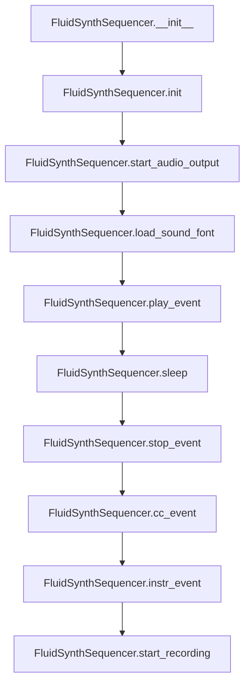
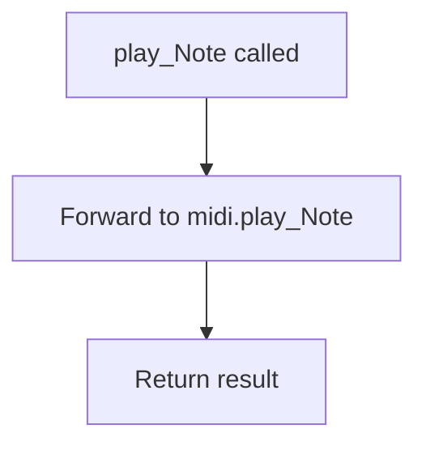
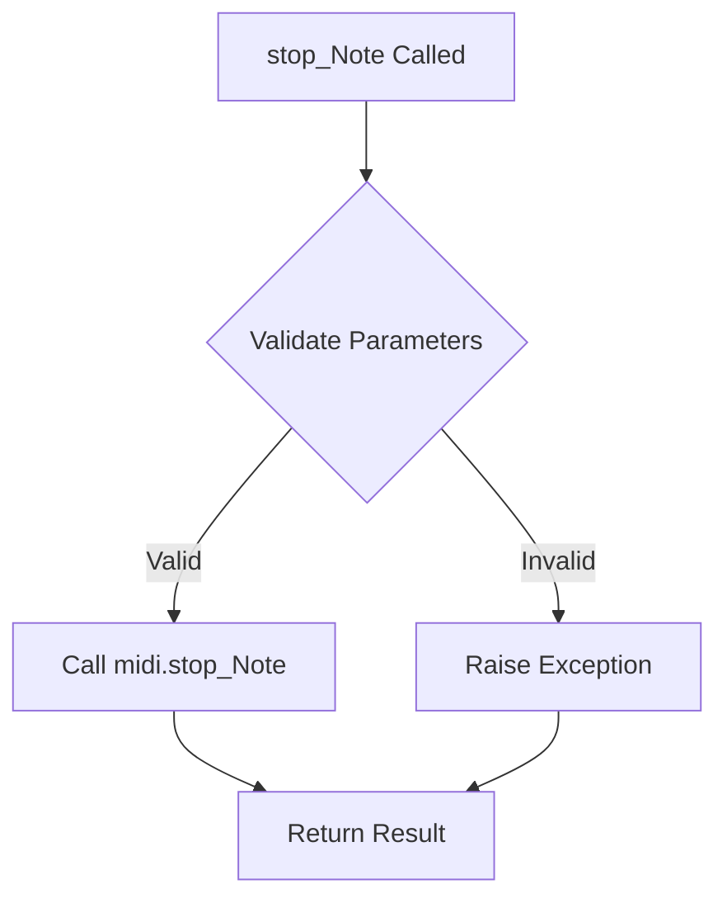
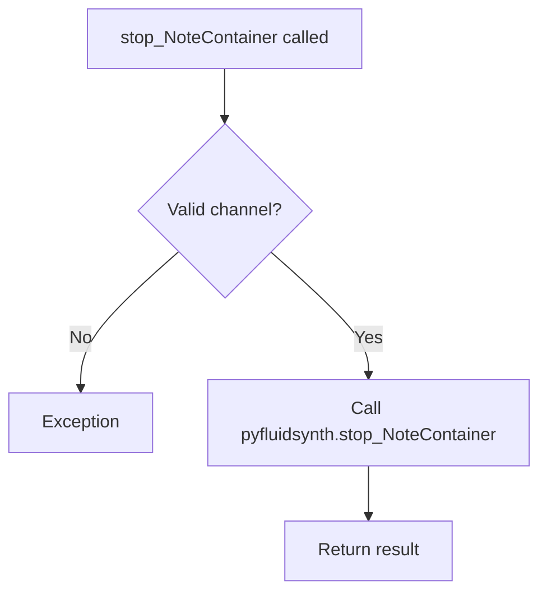
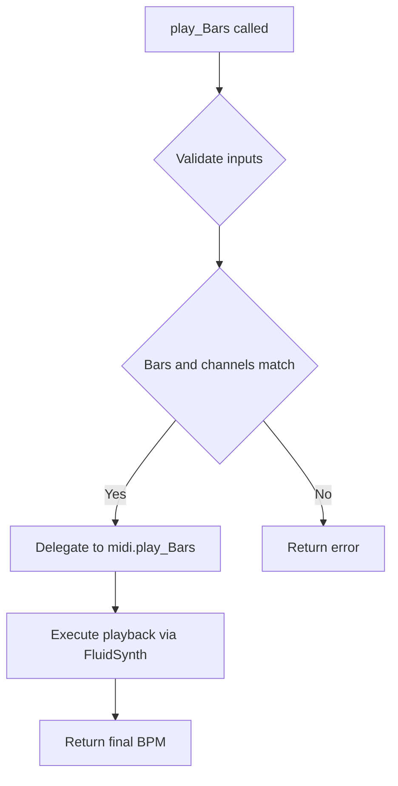
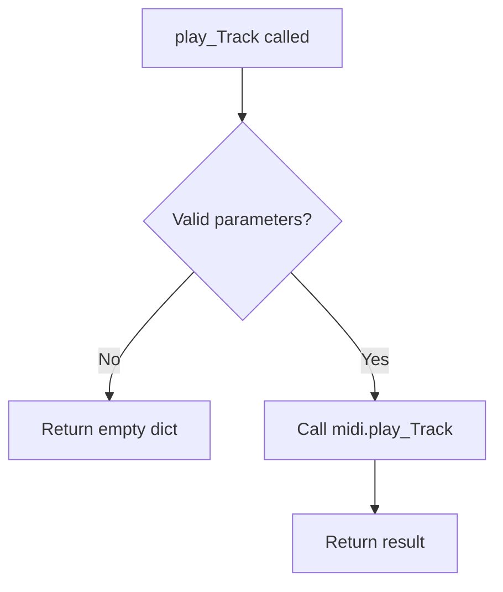
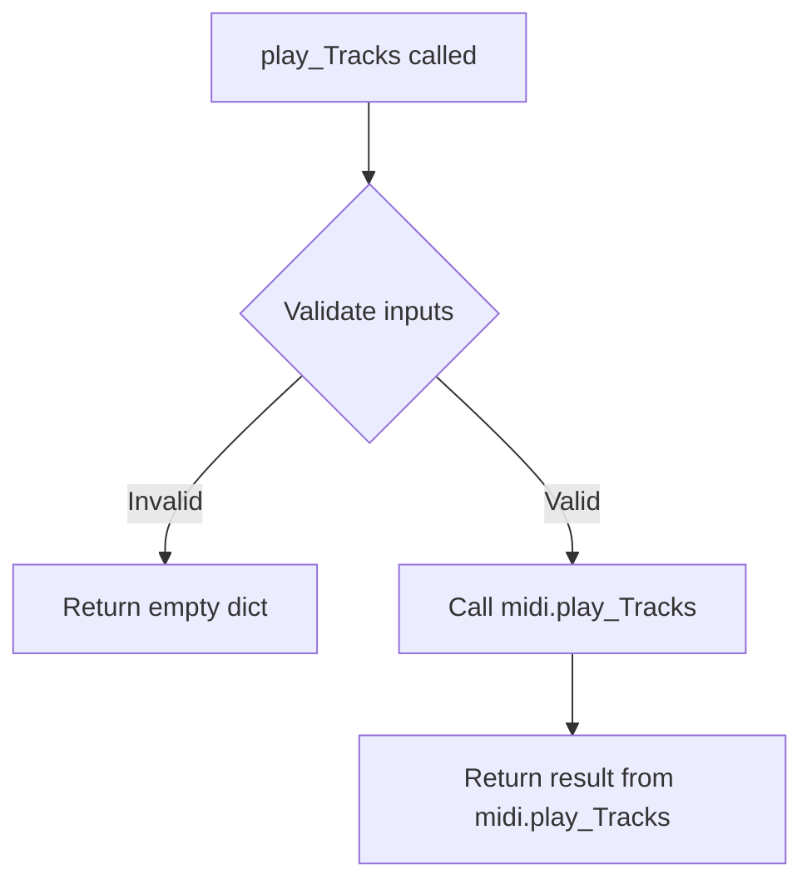
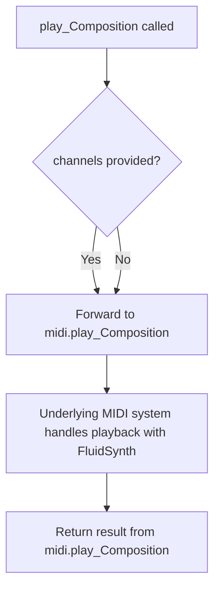
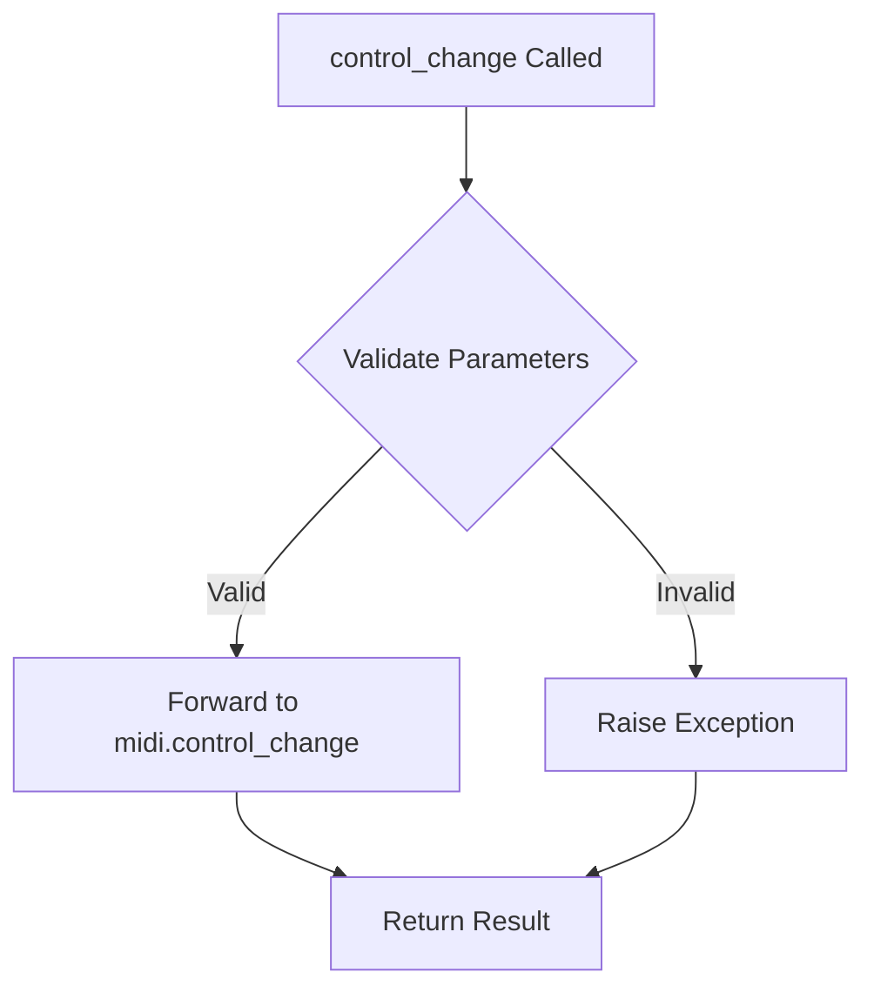
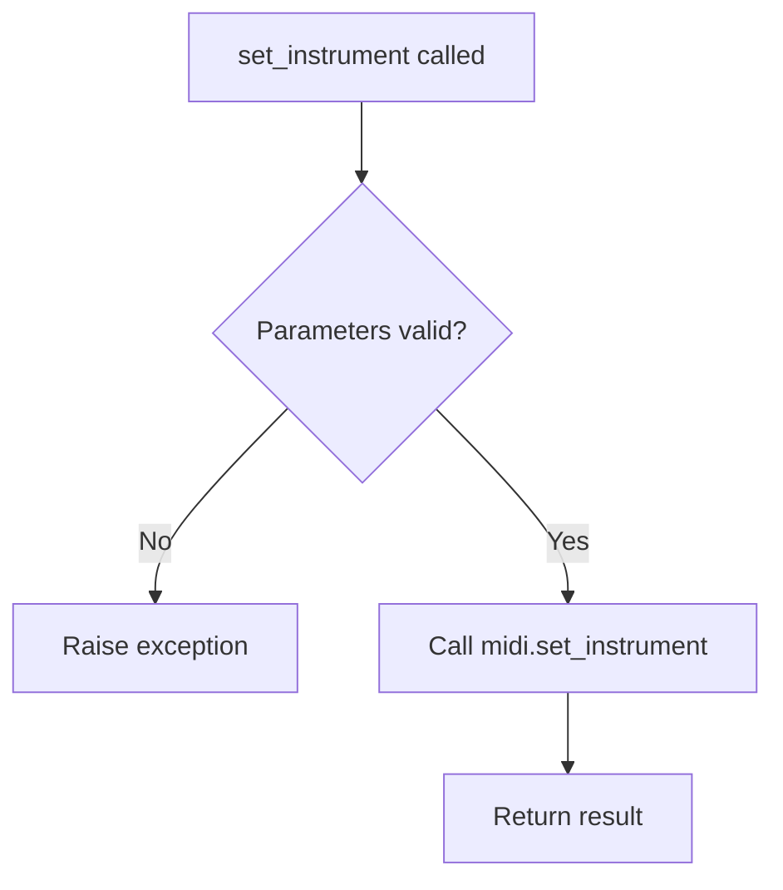

# `fluidsynth.py`

## `mingus.midi.fluidsynth.FluidSynthSequencer` · *class*

## Summary:
FluidSynthSequencer is a concrete implementation of the Sequencer base class that provides MIDI sequencing capabilities using the FluidSynth audio synthesis library.

## Description:
The FluidSynthSequencer class bridges the gap between the abstract Sequencer interface and the concrete FluidSynth audio synthesis engine. It enables MIDI music playback by translating sequencing events (notes, controls, instruments) into FluidSynth API calls. This class is designed to be used in applications requiring software-based MIDI synthesis and audio output, particularly in Python environments where the FluidSynth library is available.

The class supports core MIDI sequencing operations including note playback, instrument selection, control changes, and audio recording. It handles the integration with the FluidSynth library's audio synthesis capabilities while maintaining compatibility with the broader mingus MIDI framework.

## State:
- fs (pyfluidsynth.Synth): The underlying FluidSynth synthesizer instance used for audio generation
- sfid (int): Sound font identifier returned by fs.sfload() when a sound font is loaded
- wav (wave.Wave_write): Wave file object used for audio recording when active
- output (None): Class attribute set to None (placeholder for future implementation)

## Lifecycle:
- Creation: Instantiate with `FluidSynthSequencer()` constructor, which calls `init()` to initialize the FluidSynth engine
- Usage: Call `start_audio_output()` to enable audio, `load_sound_font()` to load sound fonts, then use playback methods like `play_Note()`, `play_Bar()`, etc.
- Destruction: Automatically calls `__del__()` to clean up FluidSynth resources when the object is garbage collected

## Method Map:


## Raises:
- IOError: Raised by `start_recording()` when the WAV file cannot be opened for writing
- AttributeError: Raised by `stop_event()` if the FluidSynth synthesizer instance hasn't been initialized
- ValueError: Raised by `control_change()` in parent Sequencer class if control or value is out of valid MIDI range (0-127)

## Example:
```python
# Create and initialize sequencer
seq = FluidSynthSequencer()

# Start audio output
seq.start_audio_output()

# Load a sound font
if seq.load_sound_font("/path/to/soundfont.sf2"):
    print("Sound font loaded successfully")

# Set instrument on channel 0
seq.instr_event(0, 0, 0)  # Piano on channel 0

# Play a note
seq.play_event(60, 0, 100)  # Middle C on channel 0 with velocity 100

# Wait for note to finish
seq.sleep(1.0)

# Stop the note
seq.stop_event(60, 0)

# Record audio (optional)
seq.start_recording("output.wav")
seq.play_Note("C-4", channel=0, velocity=100)
seq.sleep(1.0)
# Recording automatically stops when object is destroyed
```

### `mingus.midi.fluidsynth.FluidSynthSequencer.init` · *method*

## Summary:
Initializes the FluidSynth synthesizer instance for MIDI audio synthesis.

## Description:
This method creates and assigns a new FluidSynth Synth object to the instance, enabling MIDI sound generation capabilities. It is called during the object's initialization phase to set up the underlying audio synthesis engine. The method directly instantiates a Synth object from the fluidsynth library, which provides the core functionality for generating audio from MIDI events.

## Args:
    None

## Returns:
    None

## Raises:
    None

## State Changes:
    Attributes READ: None
    Attributes WRITTEN: self.fs

## Constraints:
    Preconditions: The FluidSynth library must be properly installed and accessible. The pyfluidsynth module must be correctly imported.
    Postconditions: The self.fs attribute will reference a valid FluidSynth Synth instance ready for use in MIDI synthesis operations.

## Side Effects:
    None

### `mingus.midi.fluidsynth.FluidSynthSequencer.__del__` · *method*

## Summary:
Releases the FluidSynth audio synthesis engine and associated resources when the sequencer object is destroyed.

## Description:
This destructor method ensures proper cleanup of the FluidSynth audio synthesis engine when a FluidSynthSequencer instance is about to be garbage collected. It calls the delete method on the underlying pyfluidsynth.Synth instance to release audio drivers, synthesizer instances, and system settings. This method is automatically invoked during object destruction and should not be called directly by user code.

## Args:
    None

## Returns:
    None

## Raises:
    None explicitly raised, though underlying pyfluidsynth operations may raise exceptions if cleanup fails.

## State Changes:
    Attributes READ: self.fs
    Attributes WRITTEN: None

## Constraints:
    Preconditions: The self.fs attribute must be initialized (not None) before calling this method.
    Postconditions: The FluidSynth instance and its associated resources are properly deallocated.

## Side Effects:
    I/O: Calls native C functions through pyfluidsynth to release audio drivers and system resources.
    External service calls: Invokes fluidsynth library functions to clean up audio synthesis resources.

### `mingus.midi.fluidsynth.FluidSynthSequencer.start_audio_output` · *method*

## Summary:
Initializes and starts the audio output driver for the FluidSynth synthesizer.

## Description:
This method initializes the audio output by starting the FluidSynth audio driver with the specified driver type. It serves as a bridge to the underlying pyfluidsynth library's start functionality, allowing the sequencer to produce audible sound output. The method is typically called during the setup phase of audio playback to prepare the audio system.

## Args:
    driver (str, optional): Audio driver to use for output. Valid options include 'alsa', 'oss', 'jack', 'portaudio', 'sndmgr', 'coreaudio', 'Direct Sound', 'dsound', 'pulseaudio'. When None, uses the default audio driver configured in the system.

## Returns:
    None: This method does not return any value.

## Raises:
    AssertionError: If the provided driver is not in the list of supported audio drivers.

## State Changes:
    Attributes READ: self.fs
    Attributes WRITTEN: None (method delegates to pyfluidsynth library which manages internal audio driver state)

## Constraints:
    Preconditions: The FluidSynth synthesizer instance (self.fs) must be properly initialized.
    Postconditions: The audio driver is started and ready to process audio output.

## Side Effects:
    I/O: Initializes audio hardware or system resources via the underlying audio driver.
    External service calls: Makes calls to the pyfluidsynth library to set up audio output.

### `mingus.midi.fluidsynth.FluidSynthSequencer.start_recording` · *method*

## Summary:
Initializes audio recording by opening a WAV file for writing with specific audio parameters.

## Description:
This method prepares the sequencer for audio recording by creating a WAV file with stereo (2-channel) audio, 16-bit sample width, and a 44.1kHz sampling rate. It sets up the internal `wav` attribute to write audio frames to the specified file. This method is typically called at the beginning of a recording session to establish the output file and audio format. The method is closely related to the `sleep` method, which uses the initialized `self.wav` attribute to record audio samples during playback operations.

## Args:
    file (str): Path to the WAV file to be created for recording. Defaults to "mingus_dump.wav".

## Returns:
    None: This method does not return a value.

## Raises:
    IOError: If the specified file cannot be opened for writing.

## State Changes:
    Attributes READ: None
    Attributes WRITTEN: self.wav

## Constraints:
    Preconditions: The sequencer instance must be properly initialized and ready to handle audio operations.
    Postconditions: The `self.wav` attribute will be assigned a wave file object ready for writing audio frames.

## Side Effects:
    I/O: Creates or overwrites a WAV file at the specified path with specific audio parameters.

### `mingus.midi.fluidsynth.FluidSynthSequencer.load_sound_font` · *method*

## Summary:
Loads a SoundFont file into the FluidSynth synthesizer and returns whether the operation was successful.

## Description:
This method initializes a SoundFont file for use with the FluidSynth synthesizer instance. It calls the underlying pyfluidsynth library's sfload() method to load the specified SoundFont file (.sf2) and stores the resulting sound font ID. The method returns a boolean indicating success or failure of the loading operation. This is a critical setup step for MIDI playback, as sound fonts define the musical instruments and sounds available for synthesis.

The method is typically called during the initialization or setup phase of a FluidSynthSequencer instance before attempting to play MIDI events that require specific instruments. It's separated from other initialization logic to allow for flexible sound font management during runtime.

## Args:
    sf2 (str): Path to the SoundFont file (.sf2) to be loaded.

## Returns:
    bool: True if the SoundFont was successfully loaded (sfid != -1), False otherwise. A return value of False indicates that the SoundFont file could not be loaded, typically due to file not found, invalid format, or other file system issues.

## Raises:
    None: This method does not explicitly raise exceptions, though underlying pyfluidsynth operations may raise exceptions for invalid file paths or corrupted files.

## State Changes:
    Attributes READ: None
    Attributes WRITTEN: self.sfid, self.fs

## Constraints:
    Preconditions:
        - The FluidSynth synthesizer must be initialized (self.fs should be a valid Synth instance)
        - The specified SoundFont file path must be valid and accessible
        - The SoundFont file must be in a supported format (.sf2)
    Postconditions:
        - If successful, self.sfid will contain a valid sound font identifier (non-negative integer)
        - If failed, self.sfid will be set to -1, indicating the load operation failed

## Side Effects:
    - Calls the underlying FluidSynth library's sfload() method
    - May cause file I/O operations to read the SoundFont file
    - Modifies the internal state of the FluidSynth synthesizer by loading a new sound font

### `mingus.midi.fluidsynth.FluidSynthSequencer.play_event` · *method*

## Summary:
Sends a MIDI note-on event to the FluidSynth synthesizer to play a musical note.

## Description:
This method implements the abstract play_event interface from the Sequencer base class by delegating to the FluidSynth library's noteon method. It takes a note number, MIDI channel, and velocity to trigger the playback of a specific musical note through the FluidSynth synthesizer. This method is part of the FluidSynthSequencer's implementation of the standard sequencer interface.

## Args:
    note (int): The MIDI note number (0-127) to play
    channel (int): The MIDI channel number (0-127) to send the note on  
    velocity (int): The velocity (0-127) of the note press

## Returns:
    bool: True if the note-on event was successfully sent to FluidSynth, False otherwise

## Raises:
    None explicitly raised by this method, though underlying fluidsynth operations may raise exceptions

## State Changes:
    Attributes READ: self.fs
    Attributes WRITTEN: None

## Constraints:
    Preconditions:
    - note must be between 0 and 127 inclusive (as enforced by underlying fluidsynth library)
    - channel must be greater than or equal to 0 (as enforced by underlying fluidsynth library)
    - velocity must be between 0 and 127 inclusive (as enforced by underlying fluidsynth library)
    - self.fs must be initialized (not None) - this is ensured by the FluidSynthSequencer's initialization process
    
    Postconditions:
    - The FluidSynth synthesizer will receive a note-on event for the specified note/channel/velocity combination
    - No modifications to the FluidSynthSequencer object's state occur

## Side Effects:
    - Calls the underlying FluidSynth library's noteon method
    - May produce audible sound through configured audio output drivers
    - May cause the FluidSynth synthesizer to generate audio samples

### `mingus.midi.fluidsynth.FluidSynthSequencer.stop_event` · *method*

## Summary:
Stops a MIDI note event by sending a note-off message to the FluidSynth synthesizer.

## Description:
This method sends a note-off command to the FluidSynth synthesizer instance, effectively stopping a previously played note. It is part of the FluidSynthSequencer class that implements MIDI sequencing functionality using the FluidSynth library. The method serves as the concrete implementation of the abstract stop_event method defined in the parent Sequencer class.

Known callers:
- Sequencer.stop_Note() in mingus/midi/sequencer.py: Called during the cleanup phase of note playback to properly terminate MIDI note events
- Sequencer.stop_everything(): Called to stop all active notes across all channels

This method exists as a separate implementation to encapsulate the FluidSynth-specific note-off functionality, allowing the parent Sequencer class to define the interface while enabling concrete MIDI synthesis behavior through inheritance.

## Args:
    note (int): The MIDI note number to stop (typically 0-127)
    channel (int): The MIDI channel number (typically 0-15)

## Returns:
    None: This method does not return any value

## Raises:
    AttributeError: If the FluidSynth synthesizer instance (self.fs) has not been initialized

## State Changes:
    Attributes READ: self.fs
    Attributes WRITTEN: None

## Constraints:
    Preconditions: 
    - The FluidSynth synthesizer instance (self.fs) must be initialized
    - The note parameter must be a valid MIDI note number (0-127)
    - The channel parameter must be a valid MIDI channel (0-15)
    
    Postconditions:
    - The note-off message is sent to the FluidSynth synthesizer
    - No changes are made to the FluidSynthSequencer object's state

## Side Effects:
    - Calls the FluidSynth library's noteoff function
    - May cause audio output to stop for the specified note and channel

### `mingus.midi.fluidsynth.FluidSynthSequencer.cc_event` · *method*

## Summary:
Sets a MIDI controller value for a specific channel using the FluidSynth synthesizer.

## Description:
This method sends a MIDI Control Change (CC) event to the FluidSynth synthesizer instance. It is part of the FluidSynthSequencer class which inherits from the base Sequencer class and provides MIDI sequencing capabilities using the FluidSynth library. The CC event allows for real-time control of various synthesizer parameters such as volume, pan, modulation, and other controller settings.

This method serves as a direct interface to the underlying FluidSynth library's cc() method, providing a clean abstraction layer for MIDI control change events within the mingus framework.

## Args:
    channel (int): The MIDI channel number (typically 0-15) to send the control change message to.
    control (int): The controller number (typically 0-127) specifying which parameter to modify.
    value (int): The controller value (typically 0-127) representing the new setting for the specified controller.

## Returns:
    The return value depends on the underlying pyfluidsynth.Synth.cc() implementation, but typically indicates success or failure of the operation.

## Raises:
    This method does not explicitly raise exceptions, though the underlying pyfluidsynth implementation may raise exceptions for invalid parameters.

## State Changes:
    Attributes READ: self.fs (the FluidSynth synthesizer instance)
    Attributes WRITTEN: None

## Constraints:
    Preconditions: 
    - The FluidSynth synthesizer must be initialized (self.fs should be a valid Synth instance)
    - Channel should be a valid MIDI channel number (typically 0-15)
    - Control should be a valid MIDI controller number (typically 0-127)
    - Value should be a valid MIDI controller value (typically 0-127)
    
    Postconditions: 
    - The specified controller value is sent to the FluidSynth synthesizer for the given channel

## Side Effects:
    - Calls the underlying FluidSynth library's cc() method
    - May cause audio synthesis changes in the connected sound font

### `mingus.midi.fluidsynth.FluidSynthSequencer.instr_event` · *method*

## Summary:
Sets the instrument for a MIDI channel using a sound font, bank, and program number.

## Description:
This method configures a specific MIDI channel to use a particular instrument from a loaded sound font. It serves as a bridge between the sequencer's event handling and the underlying FluidSynth engine, allowing for dynamic instrument selection during playback. The method is typically invoked during MIDI sequence processing when an instrument change event occurs.

## Args:
    channel (int): The MIDI channel number (0-127) to configure.
    instr (int): The program number (instrument preset) to select (0-127).
    bank (int): The bank number to use for instrument selection (0-127).

## Returns:
    None: This method does not return a value.

## Raises:
    None: This method does not explicitly raise exceptions, though underlying FluidSynth operations may raise errors.

## State Changes:
    Attributes READ: self.fs, self.sfid
    Attributes WRITTEN: None

## Constraints:
    Preconditions:
        - The FluidSynth synthesizer (`self.fs`) must be initialized.
        - A sound font must be loaded via `load_sound_font()` to set `self.sfid`.
        - Channel, bank, and instrument numbers must be within valid MIDI ranges (0-127).
    Postconditions:
        - The specified MIDI channel will use the selected instrument from the loaded sound font.

## Side Effects:
    - Calls the FluidSynth `program_select` API function.
    - May cause audio synthesis changes if the sequencer is actively playing.

### `mingus.midi.fluidsynth.FluidSynthSequencer.sleep` · *method*

## Summary:
Pauses execution for a specified duration while optionally recording audio output to a WAV file.

## Description:
This method implements a custom sleep mechanism that either records audio samples to a WAV file when audio recording is active, or uses standard time.sleep() when no recording is in progress. It is designed to integrate with the MIDI sequencing workflow, particularly during playback operations like play_Bar, play_Bars, play_Track, and play_Tracks where timing delays are required between musical events. The method is part of the FluidSynthSequencer class, which extends the base Sequencer class.

## Args:
    seconds (float): Number of seconds to pause execution

## Returns:
    None: This method does not return any value

## Raises:
    IOError: If writing to the WAV file fails during audio recording

## State Changes:
    Attributes READ: self.wav
    Attributes WRITTEN: None

## Constraints:
    Preconditions: 
    - When recording is active, self.wav must be a valid wave.Wave_write object with proper configuration
    - The seconds parameter must be a non-negative number
    - The FluidSynth synthesizer must be properly initialized
    
    Postconditions:
    - Execution pauses for the specified duration
    - If recording is active, audio frames are written to the WAV file
    - No changes to the sequencer's internal state beyond the sleep operation

## Side Effects:
    I/O: Writes audio frames to a WAV file when recording is active
    External service calls: Calls time.sleep() or fluidsynth audio sampling functions

## `mingus.midi.fluidsynth.init` · *function*

## Summary:
Initializes the FluidSynth MIDI system with a sound font and audio output configuration.

## Description:
This function sets up the FluidSynth MIDI system for audio playback or recording. It handles the initialization of the MIDI synthesizer, loads a sound font file, and configures either audio output or recording based on the provided parameters. The function ensures that initialization happens only once by checking a global flag.

## Args:
    sf2 (str): Path to the SoundFont2 file to load for MIDI synthesis.
    driver (str, optional): Audio driver to use for output. Defaults to None, which uses the default driver.
    file (str, optional): Path to a file for recording MIDI output. If provided, recording is enabled instead of audio output.

## Returns:
    bool: True if initialization was successful or already completed, False if loading the sound font failed.

## Raises:
    None explicitly raised, but may propagate exceptions from underlying MIDI operations.

## Constraints:
    Preconditions:
        - The global variable `initialized` must be defined and accessible.
        - The global variable `midi` must be defined and accessible, and should be an instance of a sequencer class with methods like `start_recording`, `start_audio_output`, `load_sound_font`, and `program_reset`.
        - The SoundFont2 file specified by `sf2` must exist and be readable.
    Postconditions:
        - The FluidSynth system is initialized with the specified sound font.
        - Either audio output is started or recording is configured, depending on parameters.
        - The `initialized` flag is set to True upon successful completion.

## Side Effects:
    - Starts audio output or MIDI recording via the underlying MIDI system.
    - Loads a SoundFont2 file into the FluidSynth synthesizer.
    - Modifies the global `initialized` flag.
    - May create or write to files if recording is enabled.

## Control Flow:
```mermaid
flowchart TD
    A[init called] --> B{initialized?}
    B -- No --> C{file provided?}
    C -- Yes --> D[midi.start_recording(file)]
    C -- No --> E[midi.start_audio_output(driver)]
    D --> F[midi.load_sound_font(sf2)]
    E --> F
    F --> G{load_sound_font success?}
    G -- No --> H[return False]
    G -- Yes --> I[midi.fs.program_reset()]
    I --> J[initialized = True]
    J --> K[return True]
    B -- Yes --> K
```

## Examples:
    # Initialize with default audio output
    success = init("soundfont.sf2")
    
    # Initialize with specific audio driver
    success = init("soundfont.sf2", driver="alsa")
    
    # Initialize for recording MIDI output
    success = init("soundfont.sf2", file="recording.wav")
```

## `mingus.midi.fluidsynth.play_Note` · *function*

## Summary:
Plays a musical note using the underlying MIDI system by delegating to the midi.play_Note function.

## Description:
This function acts as a wrapper that forwards note playback requests to the core MIDI implementation. It provides a simplified interface for playing individual musical notes with configurable channel and velocity parameters. The function serves as a bridge between higher-level musical abstractions and the low-level MIDI playback mechanism.

The function is typically called when a user or application needs to play a single note, often as part of larger musical sequences or compositions. It maintains consistency with the standard MIDI note-playing interface while providing a clean abstraction layer.

## Args:
    note (any): The musical note to play, which can be represented as an integer pitch value or note object with properties
    channel (int): MIDI channel number for the note playback (default: 1)
    velocity (int): Note velocity (volume) for the note playback (default: 100)

## Returns:
    Returns the result of the underlying midi.play_Note() call, which typically indicates successful processing

## Raises:
    Exception: May raise exceptions from the underlying midi.play_Note() implementation if note playback fails

## Constraints:
    Preconditions: The note parameter must be compatible with the underlying midi.play_Note() function
    Postconditions: The note is played through the MIDI system, though specific behavior depends on the implementation

## Side Effects:
    External state mutations: Relies on the underlying midi.play_Note() function to handle actual MIDI output and state changes
    External service calls: Delegates to the midi module's play_Note function for actual note playback

## Control Flow:


## Examples:
```python
# Play a middle C note on channel 1 with default velocity
result = play_Note("C-4")

# Play a note on a specific channel with custom velocity
result = play_Note("E-5", channel=2, velocity=120)

# Play a note with integer pitch value
result = play_Note(60, channel=1, velocity=100)
```

## `mingus.midi.fluidsynth.stop_Note` · *function*

## Summary:
Stops a specified MIDI note on a given channel using the underlying MIDI interface.

## Description:
This function acts as a wrapper that delegates the stopping of a MIDI note to the lower-level MIDI implementation. It provides a simplified interface for stopping notes in a MIDI sequence, abstracting away the complexity of the underlying MIDI system.

## Args:
    note (int): The MIDI note number to stop (typically 0-127).
    channel (int): The MIDI channel number (default is 1, typically 1-16).

## Returns:
    The return value depends on the underlying midi.stop_Note implementation, which typically returns None or a status indicator.

## Raises:
    Exceptions may be raised by the underlying midi.stop_Note implementation, though specific exceptions are not defined in this wrapper.

## Constraints:
    Preconditions:
    - The note number should be within the valid MIDI note range (typically 0-127).
    - The channel number should be within the valid MIDI channel range (typically 1-16).
    
    Postconditions:
    - The specified note should be stopped on the given channel.
    - No exceptions should be raised unless the underlying implementation raises them.

## Side Effects:
    - Interacts with the fluidsynth MIDI synthesizer backend.
    - May modify the state of the MIDI sequencer or synthesizer.

## Control Flow:


## Examples:
    # Stop middle C (note 60) on channel 1
    stop_Note(60)
    
    # Stop note 72 on channel 2
    stop_Note(72, channel=2)
```

## `mingus.midi.fluidsynth.play_NoteContainer` · *function*

## Summary:
Delegates note playback of a NoteContainer to the underlying MIDI system.

## Description:
This function serves as a thin wrapper that forwards NoteContainer playback requests to the underlying MIDI implementation. It provides a standardized interface for playing collections of notes through the fluidsynth MIDI system. The function accepts a NoteContainer and optional channel/velocity parameters, then delegates the actual playback to the midi.play_NoteContainer function.

## Args:
    nc (NoteContainer): Container holding multiple notes to be played. Can be None.
    channel (int): MIDI channel number to play the notes on. Defaults to 1. Must be between 1 and 16.
    velocity (int): Velocity value for note playback. Defaults to 100. Must be between 0 and 127.

## Returns:
    The return value is determined by the underlying midi.play_NoteContainer function, which typically returns a boolean indicating success/failure of note playback.

## Raises:
    None explicitly raised by this function.

## Constraints:
    Preconditions: The MIDI system must be properly initialized and connected to a sound synthesizer.
    Postconditions: The underlying MIDI system will process the NoteContainer playback request.

## Side Effects:
    I/O: Triggers MIDI output through fluidsynth audio synthesis.
    External service calls: Delegates to the underlying midi.play_NoteContainer function which may trigger additional MIDI events.

## Control Flow:
```mermaid
flowchart TD
    A[play_NoteContainer called] --> B{nc is None?}
    B -- Yes --> C[Return True]
    B -- No --> D[Call midi.play_NoteContainer(nc, channel, velocity)]
    D --> E[Return result]
```

## Examples:
```python
# Basic usage - play a container of notes
from mingus.containers import NoteContainer
nc = NoteContainer(['C-4', 'E-4', 'G-4'])
result = play_NoteContainer(nc)

# Play on specific channel with custom velocity
result = play_NoteContainer(nc, channel=2, velocity=80)
```

## `mingus.midi.fluidsynth.stop_NoteContainer` · *function*

## Summary:
Stops a NoteContainer by sending MIDI note-off messages to the FluidSynth synthesizer.

## Description:
This function acts as a bridge between the mingus MIDI sequencer and the FluidSynth backend, sending note-off messages for all notes in a NoteContainer to terminate their playback. It is called during MIDI playback to cleanly stop musical notes that were previously started with play_NoteContainer.

The function is extracted to provide a clean abstraction layer that separates the sequencer logic from the specific MIDI implementation details. This design enables the system to support multiple MIDI backends while maintaining consistent interfaces for note management operations.

## Args:
    nc (NoteContainer): The NoteContainer containing the notes to be stopped
    channel (int): The MIDI channel number (1-16) on which to send the note-off messages. Defaults to 1.

## Returns:
    The return value depends on the underlying pyfluidsynth implementation, typically indicating success or failure of the MIDI operation.

## Raises:
    None explicitly documented in the function signature, but may propagate exceptions from the underlying MIDI system if the operation fails.

## Constraints:
    Preconditions:
    - The NoteContainer must contain valid note data
    - The channel parameter must be within the valid MIDI channel range (1-16)
    - The FluidSynth synthesizer must be properly initialized and running
    
    Postconditions:
    - All notes in the NoteContainer will have note-off messages sent on the specified channel
    - The FluidSynth synthesizer state will reflect the stopped notes

## Side Effects:
    - Sends MIDI note-off messages to the FluidSynth synthesizer
    - May cause audible sound cessation on the specified MIDI channel
    - No file I/O or external state mutations

## Control Flow:


## Examples:
```python
# Stop a NoteContainer on channel 1
note_container = NoteContainer(["C-4", "E-4", "G-4"])
stop_NoteContainer(note_container)

# Stop a NoteContainer on a specific channel
stop_NoteContainer(note_container, channel=10)
```

## `mingus.midi.fluidsynth.play_Bar` · *function*

## Summary:
Plays a musical bar using the fluidsynth MIDI synthesizer by delegating to the underlying midi.play_Bar function.

## Description:
This function serves as a wrapper that delegates the playback of a musical bar to the underlying midi.play_Bar function, which is responsible for the actual MIDI synthesis and playback using fluidsynth. It provides a simplified interface for playing musical bars with configurable channel and tempo settings.

Known callers and contexts:
- This function appears to be called from higher-level playback functions in the mingus library that orchestrate musical compositions
- It is part of the fluidsynth-based MIDI playback system

This logic is extracted into its own function to provide a clean abstraction layer for fluidsynth-based playback while maintaining compatibility with the existing midi.play_Bar interface.

## Args:
    bar (object): A collection of note containers representing musical bars to be played
    channel (int): MIDI channel number to play the notes on (default: 1, range: 1-16)
    bpm (int): Beats per minute for the playback timing (default: 120, range: 1-1000)

## Returns:
    The return value is determined by the underlying midi.play_Bar function, which typically contains the final BPM value after processing the bar.

## Raises:
    Exception: May raise exceptions from the underlying midi.play_Bar function if invalid parameters are provided or playback fails.

## Constraints:
    Preconditions:
    - The bar parameter must be iterable containing note containers compatible with the MIDI playback system
    - Channel must be a valid MIDI channel number (typically 1-16)
    - BPM must be a positive number

    Postconditions:
    - The musical bar is played through the fluidsynth MIDI synthesizer
    - The function returns the result from the underlying midi.play_Bar implementation

## Side Effects:
    I/O: Audio output through the fluidsynth MIDI synthesizer
    External service calls: Delegates to midi.play_Bar function which may interact with MIDI hardware or software synthesizers

## Control Flow:
```mermaid
flowchart TD
    A[play_Bar called] --> B{Parameters valid?}
    B -- Yes --> C[Call midi.play_Bar(bar, channel, bpm)]
    C --> D[Return result]
    B -- No --> E[Raise exception]
    E --> D
```

## Examples:
```python
# Play a bar on channel 1 with default tempo (120 BPM)
result = play_Bar(my_bar)

# Play a bar on channel 2 with 150 BPM tempo
result = play_Bar(my_bar, channel=2, bpm=150)
```

## `mingus.midi.fluidsynth.play_Bars` · *function*

## Summary:
Plays multiple musical bars using FluidSynth MIDI synthesis with precise timing control.

## Description:
This function serves as a wrapper that delegates the playback of musical bars to the underlying MIDI system. It coordinates the sequential playback of multiple musical bars across different channels with specified tempo settings, leveraging FluidSynth for audio synthesis. The function acts as an interface between high-level musical composition APIs and the low-level MIDI playback mechanisms.

Known callers and contexts:
- This function is typically invoked by higher-level music composition APIs when a user wants to play a collection of musical bars
- It forms part of the standard MIDI playback pipeline in the mingus library, specifically designed for FluidSynth-based audio output

This logic is extracted into its own function to provide a clean abstraction layer between the application-level musical data structures and the low-level MIDI playback implementation, allowing for easier testing and potential alternative backend implementations.

## Args:
    bars (list): List of musical bars (NoteContainer objects) to be played sequentially
    channels (list): List of MIDI channel numbers corresponding to each bar being played
    bpm (int): Beats per minute for playback timing, defaults to 120

## Returns:
    dict: Dictionary containing the final BPM value after playback completes, reflecting any tempo changes that occurred during playback

## Raises:
    None explicitly defined in this wrapper function

## Constraints:
    Preconditions:
    - bars must be a list of valid NoteContainer objects with proper musical timing data
    - channels must be a list of integers matching the length of bars
    - Each NoteContainer in bars must contain valid note timing information
    - The FluidSynth MIDI system must be properly initialized and available
    - The underlying MIDI system must be properly configured for FluidSynth output

    Postconditions:
    - All musical notes in the provided bars will be played according to their timing
    - The final BPM value accurately reflects the playback tempo
    - Audio synthesis resources are properly managed and cleaned up

## Side Effects:
    I/O: Audio output through FluidSynth synthesizer
    External service calls: Delegates to the underlying midi.play_Bars implementation which ultimately uses FluidSynth APIs
    Mutations: May modify internal state of the FluidSynth MIDI playback system

## Control Flow:


## Examples:
```python
# Basic usage with two bars on different channels
bars = [bar1, bar2]
channels = [0, 1]
result = play_Bars(bars, channels, bpm=120)
print(f"Playback completed at {result['bpm']} BPM")

# Usage with default BPM
bars = [bar1, bar2, bar3]
channels = [0, 1, 2]
result = play_Bars(bars, channels)
```

## `mingus.midi.fluidsynth.play_Track` · *function*

## Summary:
Plays a musical track using the FluidSynth MIDI synthesizer backend.

## Description:
This function serves as a wrapper that delegates track playback to the underlying MIDI system's play_Track method. It provides a simplified interface for playing musical tracks with configurable channel and tempo settings. The function acts as a bridge between the high-level fluidsynth module and the core MIDI sequencer functionality.

Known callers within the codebase:
- This function appears to be called by higher-level music playback functions that need to play complete tracks using FluidSynth as the MIDI backend.

This logic is extracted into its own function to provide a clean abstraction layer for FluidSynth-based playback while maintaining compatibility with the existing MIDI sequencer interface.

## Args:
    track: An iterable sequence of musical bars to be played.
    channel (int): MIDI channel number to use for playback. Defaults to 1.
    bpm (int): Initial beats per minute for playback. Defaults to 120.

## Returns:
    dict: A dictionary containing the final BPM value after processing all bars, or an empty dict if playback was interrupted or failed.

## Raises:
    Exception: May propagate exceptions from the underlying midi.play_Track implementation.

## Constraints:
    Preconditions:
    - The track parameter must be iterable containing musical bars compatible with the underlying MIDI system
    - Channel must be a valid MIDI channel number (typically 1-16)
    - BPM must be a positive numeric value
    
    Postconditions:
    - The track is played through the FluidSynth MIDI synthesizer
    - Playback follows the specified channel and tempo settings

## Side Effects:
    - Initiates MIDI playback through the FluidSynth backend
    - May cause delays during playback due to timing requirements
    - Interacts with system audio output

## Control Flow:


## Examples:
```python
# Basic track playback
track = [[0, 4, NoteContainer(["C-4", "E-4", "G-4"])]]  # Simple chord bar
result = play_Track(track, channel=1, bpm=120)

# Play with different channel and tempo
result = play_Track(track, channel=2, bpm=140)
```

## `mingus.midi.fluidsynth.play_Tracks` · *function*

## Summary:
Plays multiple musical tracks concurrently using MIDI channels and configurable tempo.

## Description:
This function serves as a wrapper that delegates the playback of multiple musical tracks to the underlying MIDI sequencer's play_Tracks method. It coordinates the simultaneous playback of several musical sequences by assigning each track to a specific MIDI channel and managing the playback tempo.

The function acts as an interface layer between high-level musical composition APIs and the core MIDI sequencing engine. It enables complex musical arrangements involving multiple independent tracks to be played with proper channel assignment and tempo control.

## Args:
    tracks (list): List of musical track objects to play, each containing note data
    channels (list): List of MIDI channels corresponding to each track
    bpm (int): Initial beats per minute for playback, defaults to 120

## Returns:
    dict: Dictionary containing the final BPM value after playback completes, or empty dict if playback interrupted

## Raises:
    None explicitly raised

## Constraints:
    Preconditions:
    - tracks must be a list of track objects with valid instrument and bar data
    - channels must be a list of integers matching the length of tracks
    - tracks must have compatible lengths (all tracks should have the same number of bars)
    - tracks[0] must have a valid length attribute indicating the number of bars
    
    Postconditions:
    - All tracks will be played sequentially with proper instrument setup
    - Instrument settings will be applied to corresponding channels
    - Playback will continue until all bars are processed or interruption occurs

## Side Effects:
    I/O: Calls notify_listeners() to broadcast playback events
    External service calls: Calls set_instrument() and play_Bars() methods
    Mutations: Modifies internal state through method calls to set instruments and play bars

## Control Flow:


## Examples:
```python
# Basic usage with two tracks
tracks = [track1, track2]
channels = [1, 2]
result = play_Tracks(tracks, channels, bpm=100)
print(f"Final BPM: {result.get('bpm', 'unknown')}")

# Using default BPM
tracks = [track1, track2, track3]
channels = [1, 2, 3]
result = play_Tracks(tracks, channels)
```

## `mingus.midi.fluidsynth.play_Composition` · *function*

## Summary:
Plays a musical composition using FluidSynth audio synthesis by delegating to the underlying MIDI playback system.

## Description:
This function serves as a wrapper that forwards composition playback requests to the core MIDI playback system. It provides a simplified interface for playing compositions using FluidSynth-based audio synthesis, handling the delegation to the appropriate MIDI playback mechanism while maintaining the same API contract.

The function acts as a bridge between higher-level music applications and the underlying MIDI infrastructure, allowing users to play compositions without needing to directly interact with the complex MIDI subsystem. It specifically utilizes FluidSynth for audio rendering.

## Args:
    composition (Composition): The musical composition object containing tracks to be played.
    channels (list[int], optional): List of MIDI channel numbers to assign to each track. If None, automatically assigns channels starting from 1. Defaults to None.
    bpm (int, optional): Beats per minute for playback speed. Defaults to 120.

## Returns:
    dict: A dictionary containing the final BPM value after playback completes, or an empty dictionary if playback was interrupted. The returned dictionary has the structure {"bpm": int} or {}.

## Raises:
    None: This function does not explicitly raise exceptions, though the underlying MIDI playback system may raise exceptions.

## Constraints:
    Preconditions:
        - The composition object must contain valid tracks.
        - If channels are provided, they must correspond to the number of tracks in the composition.
        - The composition must have at least one track.
        
    Postconditions:
        - The composition playback is initiated through the MIDI system using FluidSynth.
        - The playback process continues until all bars in the composition are played.

## Side Effects:
    - May cause I/O operations through the MIDI output device.
    - Invokes the underlying MIDI playback system which may involve further MIDI communication.
    - Sets up MIDI channels for instrument configuration during playback.
    - Uses FluidSynth for audio synthesis during playback.

## Control Flow:


## Examples:
```python
# Basic usage
composition = Composition()
result = play_Composition(composition)

# With custom channels and tempo
channels = [1, 2, 3]
result = play_Composition(composition, channels=channels, bpm=140)
```

## `mingus.midi.fluidsynth.control_change` · *function*

## Summary:
Sends a MIDI control change message to a specified channel with a given control number and value.

## Description:
This function acts as a wrapper that forwards MIDI control change commands to the underlying MIDI implementation. It enables manipulation of MIDI controller parameters such as volume, pan, or modulation in real-time during playback. This function is part of the fluidsynth module and serves as an interface to the MIDI control change functionality.

## Args:
    channel (int): The MIDI channel number (typically 0-15) to send the control change message to.
    control (int): The control number (typically 0-127) specifying which controller parameter to modify.
    value (int): The control value (typically 0-127) representing the new setting for the specified control.

## Returns:
    The return value is determined by the underlying MIDI implementation and typically represents the success status or result of sending the control change command.

## Raises:
    This function may raise exceptions propagated from the underlying MIDI implementation (e.g., pyfluidsynth or other MIDI libraries).

## Constraints:
    Preconditions:
    - The channel must be a valid MIDI channel number (typically 0-15).
    - The control number must be a valid MIDI control number (typically 0-127).
    - The value must be within the valid range for MIDI control values (typically 0-127).
    - A valid MIDI synthesizer or sequencer must be initialized and active.

    Postconditions:
    - The control change message is sent to the MIDI device or synthesizer.
    - The underlying MIDI system processes the control change command.

## Side Effects:
    - Communicates with the MIDI subsystem (either FluidSynth or other MIDI backend).
    - May cause changes in audio output if the control change affects sound parameters like volume or effects.

## Control Flow:


## Examples:
    # Change volume on channel 1 to maximum
    control_change(0, 7, 127)
    
    # Set pan to center position on channel 2
    control_change(1, 10, 64)
```

## `mingus.midi.fluidsynth.set_instrument` · *function*

## Summary:
Sets the MIDI instrument for a specified channel on the synthesizer.

## Description:
This function configures a MIDI channel to use a specific instrument by delegating to the underlying MIDI system's set_instrument method. It serves as a wrapper that provides a clean interface for instrument selection within the fluidsynth module.

The function is typically called during MIDI sequence initialization or when changing instruments within a musical piece. It's part of the broader MIDI control infrastructure that allows for dynamic instrument switching during playback.

## Args:
- channel (int): The MIDI channel number (typically 0-15) to configure
- midi_instr (int): The MIDI instrument number (0-127) to assign to the channel
- bank (int): The MIDI bank number (default 0) to use for instrument selection

## Returns:
- Returns the result of the underlying midi.set_instrument call, which typically indicates success or failure of the instrument change operation

## Raises:
- Exception: May raise exceptions from the underlying midi.set_instrument implementation if invalid parameters are provided

## Constraints:
- Preconditions: Channel must be a valid MIDI channel number (typically 0-15), midi_instr must be within valid MIDI instrument range (0-127), bank must be a valid MIDI bank number
- Postconditions: The specified channel will be configured to use the requested instrument and bank combination

## Side Effects:
- Communicates with the MIDI synthesizer to change the instrument assigned to the specified channel
- May cause audible changes in sound output during playback

## Control Flow:


## Examples:
```python
# Set channel 0 to use piano (instrument 0)
set_instrument(0, 0)

# Set channel 1 to use electric guitar (instrument 25) with bank 1
set_instrument(1, 25, bank=1)
```

## `mingus.midi.fluidsynth.stop_everything` · *function*

## Summary:
Stops all ongoing MIDI playback and resets the FluidSynth synthesizer state.

## Description:
This function serves as a centralized shutdown mechanism that halts all active MIDI sequences and resets the FluidSynth synthesizer to its initial state. It delegates the actual stopping logic to the underlying `pyfluidsynth.stop_everything()` function, which handles the low-level cleanup of MIDI playback resources.

The function is typically called when terminating MIDI playback sessions or when switching between different audio synthesis contexts. It ensures that all pending MIDI events are cleared and that the synthesizer is properly reset to prevent audio artifacts or resource leaks.

## Args:
    None

## Returns:
    The return value from the underlying `midi.stop_everything()` call, which typically indicates successful completion of the stop operation.

## Raises:
    Any exceptions raised by the underlying `midi.stop_everything()` implementation, which may include:
    - RuntimeError: If the FluidSynth synthesizer is not properly initialized
    - OSError: If there are issues with system resources during cleanup

## Constraints:
    Preconditions:
    - The FluidSynth synthesizer must be initialized and active
    - The function should only be called when MIDI playback is currently active
    
    Postconditions:
    - All active MIDI sequences are terminated
    - The FluidSynth synthesizer state is reset
    - No pending MIDI events remain in the playback queue

## Side Effects:
    - Stops all active MIDI playback
    - Resets the FluidSynth synthesizer state
    - Clears any pending MIDI events from the playback queue
    - May release system resources associated with MIDI playback

## Control Flow:
```mermaid
flowchart TD
    A[stop_everything() called] --> B{Underlying midi module available?}
    B -- Yes --> C[Call midi.stop_everything()]
    B -- No --> D[Raise exception or return error]
    C --> E[Return result from midi.stop_everything()]
    D --> E
```

## Examples:
```python
# Stop all active MIDI playback
try:
    result = stop_everything()
    print("MIDI playback stopped successfully")
except Exception as e:
    print(f"Failed to stop MIDI playback: {e}")
```

## `mingus.midi.fluidsynth.modulation` · *function*

## Summary:
Sets the modulation value for a specified MIDI channel using the fluidsynth backend.

## Description:
This function provides a simplified interface for setting MIDI modulation values on a specific channel. It serves as a wrapper around the underlying MIDI system's modulation functionality, specifically designed for use with fluidsynth-based MIDI synthesis.

## Args:
    channel (int): The MIDI channel number (typically 0-15) to apply modulation to.
    value (int): The modulation value to set (typically 0-127 representing MIDI modulation range).

## Returns:
    The return value depends on the underlying implementation in the MIDI system, but typically indicates success or failure of the modulation command.

## Raises:
    This function may raise exceptions if the channel or value parameters are outside valid ranges, or if the underlying MIDI system encounters errors.

## Constraints:
    Preconditions:
    - Channel must be a valid MIDI channel number (typically 0-15).
    - Value must be within the valid MIDI modulation range (typically 0-127).

## Side Effects:
    This function interacts with the fluidsynth MIDI synthesizer backend, potentially causing audible changes in sound output or modifying synthesizer parameters.

## Control Flow:
```mermaid
flowchart TD
    A[modulation(channel, value)] --> B[Call midi.modulation(channel, value)]
    B --> C{Underlying system}
    C --> D[Return result]
```

## Examples:
    # Set modulation on channel 0 to maximum value
    modulation(0, 127)
    
    # Set modulation on channel 1 to minimum value  
    modulation(1, 0)

## `mingus.midi.fluidsynth.pan` · *function*

## Summary:
Sets the pan position for a specified MIDI channel using the underlying MIDI system.

## Description:
This function configures the stereo pan position for a given MIDI channel, controlling the left-right balance of audio output. It acts as a thin wrapper around the underlying MIDI pan functionality, providing a clean interface for panning operations within the mingus MIDI framework.

The function is typically invoked during MIDI playback to adjust the spatial positioning of instruments or sound sources in the stereo field. It's part of the fluidsynth module's MIDI control capabilities, enabling precise audio mixing and spatial audio effects.

## Args:
    channel (int): The MIDI channel number (typically 0-15) to apply the pan setting to.
    value (int): The pan position value (0-127) where 0 represents full left, 64 represents center, and 127 represents full right.

## Returns:
    The return value from the underlying midi.pan function call, which typically represents the success status or updated pan configuration.

## Raises:
    ValueError: If the channel or value parameters are outside the valid MIDI range (0-127 for channel, 0-127 for value).

## Constraints:
    Preconditions:
    - Channel must be an integer between 0 and 15 (inclusive)
    - Value must be an integer between 0 and 127 (inclusive)
    
    Postconditions:
    - The pan setting for the specified channel is updated in the MIDI system
    - The function returns the result of the underlying MIDI operation

## Side Effects:
    - May modify the MIDI output state through the underlying pyfluidsynth system
    - Could potentially trigger MIDI control change messages to connected audio devices

## Control Flow:
```mermaid
flowchart TD
    A[pan(channel, value)] --> B{Validate channel}
    B -->|Invalid| C[raise ValueError]
    B -->|Valid| D{Validate value}
    D -->|Invalid| E[raise ValueError]
    D -->|Valid| F[midi.pan(channel, value)]
    F --> G[Return result]
```

## Examples:
```python
# Set channel 1 to center pan
result = pan(1, 64)

# Pan channel 2 full left
result = pan(2, 0)

# Pan channel 3 full right
result = pan(3, 127)
```

## `mingus.midi.fluidsynth.main_volume` · *function*

## Summary:
Sets the main volume for a specified MIDI channel by delegating to the underlying MIDI system's main volume control.

## Description:
This function serves as a thin wrapper that forwards volume control commands to the MIDI system's main volume handler. It is part of the fluidsynth module's interface for controlling MIDI playback parameters. The function is typically called during MIDI sequence playback when adjusting channel-specific volume levels.

The responsibility for implementing the actual volume control is delegated to the underlying MIDI system (via `midi.main_volume`), making this function a convenient abstraction layer for volume management in fluidsynth-based applications.

## Args:
    channel (int): The MIDI channel number (typically 0-15) for which to set the volume.
    value (int): The volume level to set (typically 0-127, where 127 is maximum volume).

## Returns:
    The return value is determined by the underlying `midi.main_volume` implementation, which typically returns None or a boolean indicating success/failure.

## Raises:
    This function may raise exceptions that are propagated from the underlying `midi.main_volume` implementation, though specific exceptions depend on the concrete MIDI backend being used.

## Constraints:
    Preconditions:
    - The channel parameter must be a valid MIDI channel number (typically 0-15)
    - The value parameter must be within the valid MIDI volume range (typically 0-127)
    
    Postconditions:
    - The specified MIDI channel's volume is adjusted according to the provided value
    - No side effects beyond the MIDI system's volume control mechanism

## Side Effects:
    - Calls the underlying MIDI system's main_volume function
    - May result in changes to the audio output volume of the specified MIDI channel
    - Could potentially trigger MIDI control change messages to connected synthesizer devices

## Control Flow:
```mermaid
flowchart TD
    A[main_volume(channel, value)] --> B[midi.main_volume(channel, value)]
    B --> C[Return result]
```

## Examples:
```python
# Set channel 1 volume to maximum
main_volume(0, 127)

# Reduce volume on channel 2
main_volume(1, 64)
```

