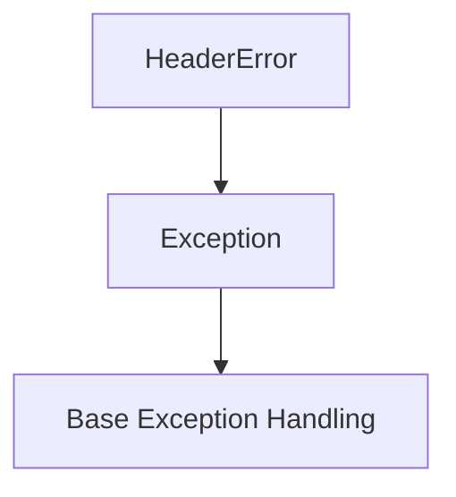
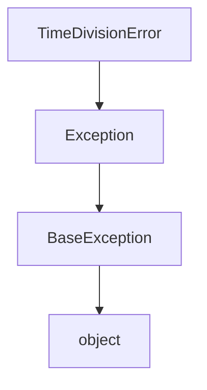

# `midi_file_in.py`

## `mingus.midi.midi_file_in.MIDI_to_Composition` · *function*

## Summary:
Converts a MIDI file into a mingus Composition object by parsing its tracks, notes, and metadata.

## Description:
This function serves as a convenient interface for converting MIDI files into mingus Composition objects. It creates a MidiFile parser instance and delegates the conversion process to the parser's MIDI_to_Composition method. The function handles the complete parsing of MIDI file structures including headers, tracks, events, and metadata such as tempo, time signature, and key signature. This extraction allows for clean separation between the high-level interface and the detailed MIDI parsing implementation.

## Args:
    file (str): Absolute or relative path to the MIDI file to be converted

## Returns:
    tuple: A tuple containing (Composition, bpm) where Composition contains the parsed musical data and bpm is the tempo in beats per minute. Note: bpm may not be defined if no tempo meta-event is present.

## Raises:
    IOError: When the specified MIDI file cannot be opened or found
    HeaderError: When the MIDI file has an invalid header
    FormatError: When the MIDI file format is not supported

## Constraints:
    Preconditions: The file parameter must be a valid path to a MIDI file with supported format (0, 1, or 2)
    Postconditions: Returns a Composition object with properly structured tracks and bars, and a bpm value if tempo meta-event was present

## Side Effects:
    I/O: Opens and reads from the specified MIDI file
    Prints: Diagnostic messages for unsupported MIDI events and meta-events

## Control Flow:
```mermaid
flowchart TD
    A[Start MIDI_to_Composition] --> B[MidiFile() instantiation]
    B --> C[MIDI_to_Composition(file) call]
    C --> D[Parse MIDI file header]
    D --> E[Parse MIDI tracks]
    E --> F[Process MIDI events]
    F --> G[Create Composition object]
    G --> H[Return (Composition, bpm)]
```

## `mingus.midi.midi_file_in.HeaderError` · *class*

## Summary:
Represents an exception raised when there are issues with MIDI file headers during parsing.

## Description:
The HeaderError class is a custom exception used within the mingus MIDI file parsing system to indicate problems encountered while processing MIDI file headers. It inherits from Python's built-in Exception class and serves as a specialized error type for header-related parsing failures.

This exception is part of the MIDI file input processing pipeline and is raised when the MIDI file header doesn't conform to expected formats or contains invalid data that prevents proper parsing of the file structure.

## State:
- Inherits from Exception class with no additional attributes
- No constructor parameters required as it's a basic exception class
- Maintains standard Exception behavior with message and traceback capabilities

## Lifecycle:
- Creation: Instantiated directly with optional error message string
- Usage: Raised during MIDI file header parsing operations when validation fails
- Destruction: Handled by exception handlers or allowed to propagate up the call stack

## Method Map:


## Raises:
- HeaderError: Raised when MIDI file header parsing encounters invalid data or format issues

## Example:
```python
try:
    # Attempt to parse MIDI file header
    parse_midi_header(file_data)
except HeaderError as e:
    print(f"MIDI header error: {e}")
    # Handle header parsing failure
```

## `mingus.midi.midi_file_in.TimeDivisionError` · *class*

## Summary:
Represents an exception that occurs when there is an invalid time division value in a MIDI file.

## Description:
TimeDivisionError is a custom exception class that extends Python's built-in Exception class. It is specifically designed to handle errors related to invalid time division values encountered when processing MIDI files. This exception is raised when the time division parameter in a MIDI file header does not conform to expected standards or valid ranges.

The motivation for having this distinct exception type is to provide more specific error handling for MIDI file parsing operations, allowing developers to catch and respond appropriately to time division-related issues without having to parse the underlying error messages or inspect the exception type manually.

## State:
This class has no instance attributes or state variables. It inherits directly from Exception and maintains no additional fields beyond those provided by the base Exception class.

## Lifecycle:
Creation: Instances of TimeDivisionError are created automatically when the MIDI file parser encounters an invalid time division value. They are typically raised by internal parsing functions within the midi_file_in module rather than being instantiated directly by user code.

Usage: The exception follows standard Python exception handling patterns - it is raised during MIDI file processing and should be caught by appropriate exception handlers in calling code.

Destruction: As with all Python exceptions, no explicit cleanup is required. The exception object is automatically destroyed when it goes out of scope.

## Method Map:


## Raises:
This class itself does not raise any exceptions. It serves as an exception type that can be raised by other components in the MIDI file processing pipeline when invalid time division values are detected.

## Example:
```python
try:
    # Attempt to parse a MIDI file with invalid time division
    midi_data = parse_midi_file("invalid_file.mid")
except TimeDivisionError as e:
    print(f"Invalid time division detected: {e}")
    # Handle the specific error case
```

## `mingus.midi.midi_file_in.FormatError` · *class*

## Summary:
Represents an exception raised when a MIDI file format is invalid or unsupported.

## Description:
The FormatError class is a custom exception used throughout the mingus MIDI processing system to indicate that a MIDI file being processed does not conform to the expected format specifications. This exception is raised when the MIDI file parser encounters structural issues, unsupported MIDI formats, or corrupted data that prevents proper parsing.

This class serves as a distinct abstraction to separate MIDI format validation errors from other potential exceptions in the system, allowing callers to specifically handle format-related issues without catching broader exception types.

## State:
The class inherits from Python's built-in Exception class and contains no additional attributes. It functions purely as an exception marker with no internal state.

## Lifecycle:
Creation: Instances are created automatically by the MIDI file parser when format violations are detected. No explicit instantiation is required by users of the library.

Usage: The exception is raised during MIDI file parsing operations and should be caught by calling code to handle format errors gracefully.

Destruction: As a standard Python exception, no special cleanup is required. The exception object is automatically destroyed after handling.

## Method Map:
```mermaid
graph TD
    A[MIDI Parser] --> B{Format Validation}
    B --> C{Invalid Format Detected}
    C --> D[FormatError.raise()]
    D --> E[Exception Handled]
```

## Raises:
- FormatError: Raised when MIDI file format validation fails during parsing operations

## Example:
```python
try:
    midi_file = MidiFile("invalid.mid")
except FormatError as e:
    print(f"MIDI file format error: {e}")
    # Handle invalid format gracefully
```

## `mingus.midi.midi_file_in.MidiFile` · *class*

## Summary:
A class for parsing MIDI files and converting them into mingus Composition objects.

## Description:
The MidiFile class provides functionality to read MIDI files and convert their contents into mingus Composition objects, which consist of Tracks, Bars, and Notes. It handles the complex parsing of MIDI file structures including headers, tracks, events, and metadata, translating them into a structured musical representation suitable for further processing and analysis within the mingus framework.

## State:
- bpm (int): The tempo of the MIDI file in beats per minute, initialized to 120
- meter (tuple): The time signature of the MIDI file represented as (numerator, denominator), initialized to (4, 4)
- bytes_read (int): Counter tracking the number of bytes read during file parsing, initialized to 0

## Lifecycle:
- Creation: Instantiate with `MidiFile()` to create a parser object
- Usage: Call `MIDI_to_Composition(file)` with a MIDI file path to parse and convert the file
- Destruction: Standard Python garbage collection handles cleanup

## Example:
```python
# Create a MidiFile parser
parser = MidiFile()

# Parse a MIDI file and convert to mingus Composition
composition, tempo = parser.MIDI_to_Composition("example.mid")

# Access the parsed composition
print(f"Tempo: {tempo} BPM")
print(f"Number of tracks: {len(composition.tracks)}")
```

### `mingus.midi.midi_file_in.MidiFile.MIDI_to_Composition` · *method*

## Summary:
Converts a MIDI file into a mingus Composition object, parsing tracks, notes, and metadata including tempo, time signature, and key signature.

## Description:
This method transforms a MIDI file into a structured Composition object containing Tracks with Bars and Notes. It processes MIDI events including note-on/off events, instrument changes, and meta-events like tempo, time signature, and key signature. The method handles the conversion of MIDI timing into musical durations and manages the organization of musical elements into bars and tracks. This method serves as the main entry point for MIDI file parsing and composition creation.

## Args:
    file (str): Path to the MIDI file to be converted

## Returns:
    tuple: A tuple containing (Composition, bpm) where Composition contains the parsed musical data and bpm is the tempo in beats per minute. Note: bpm may not be defined if no tempo meta-event is present.

## Raises:
    IOError: When the specified MIDI file cannot be opened or found
    HeaderError: When the MIDI file has an invalid header
    FormatError: When the MIDI file format is not supported

## State Changes:
    Attributes READ: self.bytes_read, self.parse_midi_file_header, self.parse_track, self.parse_time_division, self.parse_varbyte_as_int, self.parse_midi_event
    Attributes WRITTEN: None - modifies only local variables and returns new objects

## Constraints:
    Preconditions: The file parameter must be a valid path to a MIDI file with supported format (0, 1, or 2)
    Postconditions: Returns a Composition object with properly structured tracks and bars, and a bpm value if tempo meta-event was present

## Side Effects:
    I/O: Opens and reads from the specified MIDI file
    Prints: Diagnostic messages for unsupported MIDI events and meta-events

### `mingus.midi.midi_file_in.MidiFile.parse_midi_file_header` · *method*

## Summary:
Parses the header section of a MIDI file to extract format type, number of tracks, and time division information.

## Description:
This method reads and validates the MIDI file header from a file pointer, extracting essential metadata about the MIDI file structure. It performs validation checks on the header signature, chunk size, format type, and ensures proper parsing of time division data. The method is designed to be called as part of the MIDI file parsing pipeline during the initial file analysis phase.

## Args:
    fp (file-like object): A file pointer positioned at the beginning of the MIDI file header section.

## Returns:
    tuple or bool: Returns a tuple containing (format_type, number_of_tracks, time_division) if successful, or False if the chunk size is less than 6 bytes.

## Raises:
    IOError: Raised when file reading operations fail or when required data cannot be read from the file pointer.
    FormatError: Raised when the MIDI format type is invalid (not 0, 1, or 2) or when the MIDI file structure violates expected format constraints.

## State Changes:
    - Attributes READ: self.bytes_read
    - Attributes WRITTEN: self.bytes_read (incremented during parsing operations)

## Constraints:
    - Preconditions: The file pointer must be positioned at the start of a valid MIDI file header section.
    - Postconditions: The file pointer position advances by the amount of bytes read during header parsing.

## Side Effects:
    - I/O: Reads from the provided file pointer, advancing its position.
    - External service calls: None
    - Mutations to objects outside self: Modifies self.bytes_read attribute to track parsed bytes.

### `mingus.midi.midi_file_in.MidiFile.bytes_to_int` · *method*

## Summary:
Converts binary byte data or integer values into their corresponding integer representation.

## Description:
This method serves as a utility for converting byte sequences or integer values into integers, primarily used when processing MIDI file data where numeric values may be stored in binary format. It handles two main input types: binary byte data (converted via hex encoding) and direct integer values. The method is designed to be robust against different input formats while maintaining strict type checking.

## Args:
    _bytes (Union[bytes, int]): Input data that can either be binary byte data or an integer value to be returned as-is.

## Returns:
    int: The integer representation of the input data. If input is bytes, it converts them to an integer using hexadecimal conversion. If input is already an integer, it returns the integer unchanged.

## Raises:
    TypeError: Raised when the input `_bytes` is neither of type `bytes` nor `int`.

## State Changes:
    - Attributes READ: None
    - Attributes WRITTEN: None

## Constraints:
    - Preconditions: The input `_bytes` must be either an instance of `bytes` or `int`. 
    - Postconditions: The returned value is always an integer, regardless of input type.

## Side Effects:
    - I/O: Uses `binascii.b2a_hex()` which may involve internal binary-to-hexadecimal conversion operations.
    - External service calls: None
    - Mutations to objects outside self: None

### `mingus.midi.midi_file_in.MidiFile.parse_time_division` · *method*

## Summary:
Parses MIDI file time division data to extract either ticks-per-beat or SMPTE frame information.

## Description:
This method processes the time division field from a MIDI file header, interpreting the binary data according to MIDI specification. It determines whether the time division represents ticks-per-beat (standard timing) or SMPTE frames (frame-based timing) and extracts the appropriate values. The method is called during MIDI file parsing when reading the header information, specifically in the `parse_midi_file_header` method of the MidiFile class.

## Args:
    bytes (bytes): Binary byte data representing the time division field from a MIDI file header.

## Returns:
    dict: A dictionary containing time division information with keys:
        - "fps" (bool): Indicates if SMPTE frame-based timing is used
        - "ticks_per_beat" (int): Ticks per beat when fps=False
        - "SMPTE_frames" (int): SMPTE frames per second when fps=True (24, 25, 29, or 30)
        - "clock_ticks" (int): Clock ticks per SMPTE frame when fps=True

## Raises:
    TimeDivisionError: When SMPTE frames value is not one of the valid values [24, 25, 29, 30]

## State Changes:
    - Attributes READ: None
    - Attributes WRITTEN: None

## Constraints:
    - Preconditions: The input bytes must represent a valid MIDI time division value
    - Postconditions: The returned dictionary always contains the "fps" key and appropriate additional keys based on the timing mode

## Side Effects:
    - None

### `mingus.midi.midi_file_in.MidiFile.parse_track` · *method*

## Summary:
Parses MIDI track data from a file pointer and returns a list of events with their delta times.

## Description:
This method processes a single MIDI track by reading its header and then sequentially parsing all MIDI events within that track. It uses helper methods to read track headers, variable-length integers, and individual MIDI events. The parsed events are returned as a list of [delta_time, event] pairs, where delta_time represents the time interval between this event and the previous one, and event contains the structured MIDI event data. This method is part of the MIDI file parsing pipeline and is called during the track processing phase of MIDI file interpretation.

## Args:
    fp (file-like object): A file pointer positioned at the beginning of a MIDI track

## Returns:
    list[list[int, dict]]: A list of events where each event is represented as [delta_time, event_dict]. Each event_dict contains structured MIDI event information with keys:
        - "event" (int): MIDI event type (0x08-0x0F)
        - "channel" (int): MIDI channel number (0-15)
        - "meta_event" (int, optional): Meta-event type (when event=0x0F)
        - "data" (bytes, optional): Meta-event data payload (when event=0x0F)
        - "param1" (int): First parameter value
        - "param2" (int, optional): Second parameter value (for standard events)

## Raises:
    IOError: When unable to read required bytes from the file pointer during parsing
    HeaderError: When encountering an invalid track header
    FormatError: When encountering unknown or invalid MIDI event types

## State Changes:
    Attributes READ: self.parse_track_header, self.parse_varbyte_as_int, self.parse_midi_event, self.bytes_read
    Attributes WRITTEN: self.bytes_read (incremented by parsed byte count)

## Constraints:
    Preconditions: The file pointer must be positioned at a valid MIDI track start
    Postconditions: The file pointer is advanced by the total number of bytes consumed during parsing

## Side Effects:
    I/O: Reads bytes from the provided file pointer
    External service calls: None
    Mutations to objects outside self: Modifies self.bytes_read attribute

### `mingus.midi.midi_file_in.MidiFile.parse_midi_event` · *method*

## Summary:
Parses a single MIDI event from a file pointer and returns its structured representation along with the byte count consumed.

## Description:
This method reads and interprets a MIDI event from a file pointer, extracting event type, channel, and parameters according to MIDI specification. It handles three categories of MIDI events: meta-events (type 0x0F), channel controller events (types 12 and 13), and standard MIDI events (types 0x08-0x0E). The method updates internal state tracking of bytes read and returns both the parsed event data and the number of bytes consumed during parsing. This method is part of the MIDI file parsing pipeline and is called by `parse_track` during the event processing phase.

## Args:
    fp (file-like object): A file pointer positioned at the start of a MIDI event

## Returns:
    tuple: A tuple containing (event_dict, chunk_size) where:
        - event_dict (dict): Dictionary containing event information with keys:
          * "event" (int): MIDI event type (0x08-0x0F)
          * "channel" (int): MIDI channel number (0-15)
          * "meta_event" (int, optional): Meta-event type (when event=0x0F)
          * "data" (bytes, optional): Meta-event data payload (when event=0x0F)
          * "param1" (int): First parameter value
          * "param2" (int, optional): Second parameter value (for standard events)
        - chunk_size (int): Number of bytes consumed during parsing

## Raises:
    IOError: When unable to read required bytes from the file pointer
    FormatError: When encountering an unknown or invalid MIDI event type

## State Changes:
    Attributes READ: self.bytes_read, self.bytes_to_int, self.parse_varbyte_as_int
    Attributes WRITTEN: self.bytes_read (incremented by parsed byte count)

## Constraints:
    Preconditions: The file pointer must be positioned at a valid MIDI event start
    Postconditions: The file pointer is advanced by the number of bytes consumed

## Side Effects:
    I/O: Reads bytes from the provided file pointer
    External service calls: None
    Mutations to objects outside self: Modifies self.bytes_read attribute

### `mingus.midi.midi_file_in.MidiFile.parse_track_header` · *method*

## Summary:
Parses the track header from a MIDI file stream and extracts the track chunk size.

## Description:
Reads and validates the track header from a file pointer and extracts the chunk size of the following track data. This method is part of the MIDI file parsing process and ensures proper synchronization with the file's binary structure. It is called during the parsing of MIDI tracks to prepare for reading the actual track content.

## Args:
    fp (file-like object): A file pointer positioned at the start of a track header in a MIDI file.

## Returns:
    int: The size in bytes of the track chunk data that follows the header.

## Raises:
    IOError: When unable to read from the file pointer, typically due to end-of-file or file corruption.
    HeaderError: When the track header signature is invalid (expected "MTrk" but found something else).

## State Changes:
    - Attributes READ: None
    - Attributes WRITTEN: self.bytes_read (incremented by 8 bytes total)

## Constraints:
    - Preconditions: The file pointer must be positioned at the beginning of a valid track header.
    - Postconditions: The file pointer is advanced past the track header and chunk size fields.

## Side Effects:
    - I/O: Reads 8 bytes from the file pointer (4 bytes for header + 4 bytes for chunk size).
    - External service calls: None
    - Mutations to objects outside self: Modifies self.bytes_read attribute.

### `mingus.midi.midi_file_in.MidiFile.parse_midi_file` · *method*

## Summary:
Parses a complete MIDI file into structured header and track event data, resetting internal byte counter.

## Description:
Opens and parses a MIDI file, extracting its header information and all track events. This method initializes the parsing process by opening the file in binary mode, reading the MIDI header to determine format and track count, then sequentially parsing each track's events. It resets the internal `bytes_read` counter to zero before beginning parsing and closes the file upon completion. This method is typically invoked during MIDI file loading workflows to prepare the file data for further processing.

## Args:
    file (str): Path to the MIDI file to be parsed

## Returns:
    tuple: A tuple containing (header_info, track_events) where:
        - header_info (tuple): (format_type, number_of_tracks, time_division) representing the MIDI file header structure
        - track_events (list): List of track event lists, where each track contains a list of [delta_time, event] tuples representing parsed MIDI events

## Raises:
    IOError: When the specified file cannot be opened or read

## State Changes:
    Attributes READ: None
    Attributes WRITTEN: self.bytes_read (reset to 0 at start of parsing)

## Constraints:
    Preconditions: The file parameter must be a valid path to an existing MIDI file
    Postconditions: The file handle is properly closed after parsing completes

## Side Effects:
    I/O: Opens and reads from the specified file path
    External service calls: None
    Mutations to objects outside self: None

### `mingus.midi.midi_file_in.MidiFile.parse_varbyte_as_int` · *method*

## Summary:
Parses a variable-length integer from a file pointer according to MIDI format specifications, updating the internal byte counter.

## Description:
Reads bytes from a file pointer until a byte with the most significant bit unset is encountered, combining the 7-bit segments into a single integer value. This method implements the MIDI variable-length quantity (VLQ) decoding algorithm, commonly used in MIDI files to encode time values and other quantities that can vary in size. The method updates the internal `bytes_read` counter for each byte processed.

## Args:
    fp (file-like object): File pointer from which to read bytes.
    return_bytes_read (bool): If True, returns a tuple of (value, bytes_read); if False, returns only the parsed integer.

## Returns:
    Union[int, tuple[int, int]]: The parsed integer value, or a tuple containing the value and number of bytes read if return_bytes_read is True.

## Raises:
    IOError: When unable to read a byte from the file pointer, indicating potential file corruption or premature end of file.

## State Changes:
    - Attributes READ: None
    - Attributes WRITTEN: self.bytes_read (incremented by 1 for each byte read)

## Constraints:
    - Preconditions: The file pointer must support reading bytes and the underlying data must conform to MIDI VLQ format.
    - Postconditions: The method advances the file pointer position by the number of bytes read.

## Side Effects:
    - I/O: Reads one or more bytes from the provided file pointer.
    - External service calls: None
    - Mutations to objects outside self: Modifies self.bytes_read attribute

