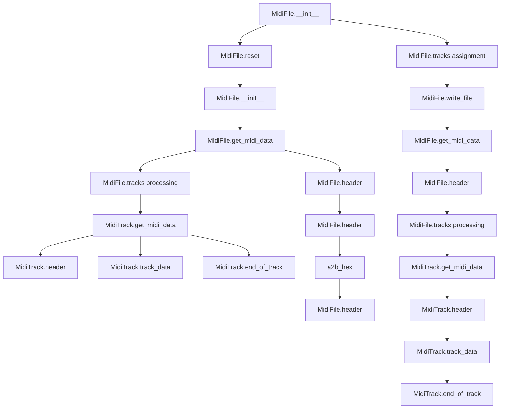
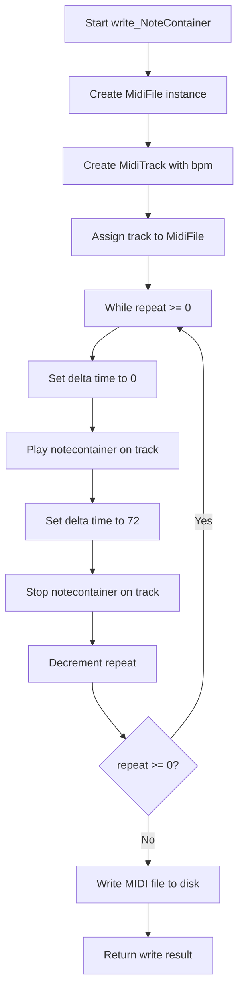

# `midi_file_out.py`

## `mingus.midi.midi_file_out.MidiFile` · *class*

## Summary:
A class for creating and managing MIDI files, responsible for organizing tracks and generating complete MIDI file data for output.

## Description:
The MidiFile class serves as the central coordinator for MIDI file creation, managing a collection of MidiTrack objects and providing methods to serialize them into complete MIDI file format. It handles the construction of MIDI headers and combines track data to produce valid MIDI files suitable for playback or storage.

This class acts as a container and orchestrator, separating the concerns of track management from file I/O operations. It provides a clean interface for building MIDI files programmatically and exporting them to disk.

## State:
- tracks: list[MidiTrack] - Collection of MidiTrack objects that make up the MIDI file. Default value is an empty list. Each track contributes data to the final MIDI file.
- time_division: bytes - MIDI time division setting, currently hardcoded to b"\x00\x48" (which represents 72 ticks per beat). This determines the timing resolution of the MIDI file.

## Lifecycle:
- Creation: Instantiate with optional list of MidiTrack objects. The constructor calls reset() to initialize track states and assigns the provided tracks.
- Usage: Call get_midi_data() to retrieve complete MIDI file data, or write_file() to directly write to disk. Tracks should be populated with data before calling these methods.
- Destruction: No explicit cleanup required; the class is lightweight and doesn't manage external resources.

## Method Map:


## Raises:
- None explicitly raised in __init__
- File-related exceptions may occur during write_file() due to OS-level issues

## Example:
```python
# Create a MIDI file with tracks
track1 = MidiTrack()
track2 = MidiTrack()
midi_file = MidiFile([track1, track2])

# Add data to tracks...
# Write to file
midi_file.write_file("output.mid", verbose=True)
```

### `mingus.midi.midi_file_out.MidiFile.__init__` · *method*

## Summary:
Initializes a MidiFile object with optional tracks and resets its internal state.

## Description:
The `__init__` method serves as the constructor for the MidiFile class, setting up the initial state of a MIDI file object. It accepts an optional list of tracks and ensures proper initialization by calling the reset method before assigning the provided tracks. This method establishes the foundation for a MidiFile instance, preparing it for MIDI data generation operations.

The method is separated from inline initialization logic to ensure consistent state setup through the reset mechanism, which properly initializes all track states. This design allows for predictable object initialization regardless of whether tracks are provided during construction. The reset operation ensures that any existing track data is cleared before setting the new tracks.

## Args:
    tracks (list[MidiTrack], optional): A list of MidiTrack objects to initialize the file with. Defaults to None, which creates an empty list.

## Returns:
    None

## Raises:
    None

## State Changes:
    Attributes READ: None
    Attributes WRITTEN: 
    - self.tracks: Assigned the provided tracks parameter or an empty list if None

## Constraints:
    Preconditions: The MidiFile object must be properly instantiated with all required attributes.
    Postconditions: The MidiFile object will have its tracks attribute set to either the provided tracks or an empty list, and all existing track states will be reset through the reset() call.

## Side Effects:
    I/O: None
    External service calls: None
    Mutations to objects outside self: Calls self.reset() which mutates the state of all tracks in self.tracks by calling reset() on each track

### `mingus.midi.midi_file_out.MidiFile.get_midi_data` · *method*

## Summary:
Generates complete MIDI file data by combining header information with processed track data.

## Description:
This method constructs the complete MIDI file data by first filtering out empty tracks and then combining the MIDI header with the serialized data from each non-empty track. It serves as the primary interface for retrieving the complete binary representation of a MIDI file from the MidiFile object.

The method is separated from inline logic to maintain clean separation of concerns, allowing the header generation to be handled independently and making the track serialization process reusable. This approach also enables easier testing and debugging of individual components.

Known callers:
- MidiFile.write_file() - Called during file writing operations to retrieve complete MIDI data before writing to disk

## Args:
    None

## Returns:
    bytes: Complete MIDI file data containing header and all non-empty track data

## Raises:
    None explicitly raised

## State Changes:
    Attributes READ: self.tracks, self.time_division
    Attributes WRITTEN: None

## Constraints:
    Preconditions: 
    - self.tracks must be a list of MidiTrack objects
    - Each MidiTrack in self.tracks should have a track_data attribute
    - self.time_division should be properly initialized
    
    Postconditions:
    - Returns a complete MIDI file structure with proper header and track data
    - Empty tracks (where track_data == b"") are excluded from the result
    - The returned data follows standard MIDI file format specifications

## Side Effects:
    None

### `mingus.midi.midi_file_out.MidiFile.header` · *method*

## Summary:
Generates the MIDI file header chunk containing metadata about the file structure and track count.

## Description:
This method constructs the standard MIDI file header (MThd chunk) that defines the file's format, number of tracks, and timing division. It's called during MIDI file serialization to create the initial header portion of the output file. The header consists of the MThd identifier, chunk size, format type (always 1 for multi-track), track count, and time division. The track count is calculated by filtering out empty tracks (where track_data == "").

## Args:
    None

## Returns:
    bytes: A byte string representing the MIDI header chunk, including the header identifier, chunk size, format type, track count, and time division.

## Raises:
    None explicitly raised

## State Changes:
    Attributes READ: self.tracks, self.time_division
    Attributes WRITTEN: None

## Constraints:
    Preconditions: 
    - self.tracks must be iterable and contain track objects with a track_data attribute
    - self.time_division must be a bytes object
    Postconditions: 
    - Returns properly formatted MIDI header bytes with correct track count calculation
    - Track count is calculated by filtering out empty tracks (where track_data == "")

## Side Effects:
    None

### `mingus.midi.midi_file_out.MidiFile.reset` · *method*

## Summary:
Resets all tracks in the MIDI file by clearing their data and resetting their state.

## Description:
This method clears the internal state of all MIDI tracks contained within the MidiFile instance. It is called during initialization to ensure a clean slate and can also be used to reset the file's contents for reuse. The method delegates the reset operation to each individual track's reset method, ensuring all track-specific state is properly cleared.

## Args:
    None

## Returns:
    None

## Raises:
    None

## State Changes:
    Attributes READ: self.tracks
    Attributes WRITTEN: Each track's track_data and delta_time attributes are reset to initial values

## Constraints:
    Preconditions: The MidiFile instance must have a tracks attribute containing iterable objects with reset methods
    Postconditions: All tracks in self.tracks will have their reset() method called, clearing their track_data and delta_time

## Side Effects:
    None

### `mingus.midi.midi_file_out.MidiFile.write_file` · *method*

## Summary:
Writes the MIDI file data to a specified file path, handling file I/O operations and providing optional verbose output.

## Description:
This method serializes the MIDI data stored in the MidiFile object and writes it to a file. It retrieves the complete MIDI data using the get_midi_data() method, opens the target file in binary write mode, writes the data, and optionally prints verbose output showing the number of bytes written. The method handles file opening and writing errors gracefully by returning False and printing informative error messages.

This logic is encapsulated in its own method to separate the file I/O concerns from the data generation logic, enabling better testability and reusability. It also provides a clean interface for the file writing operation while maintaining the ability to handle various error conditions.

Known callers:
- Direct external calls to write MIDI files to disk
- Part of the MIDI file export pipeline in the application

## Args:
    file (str): Path to the file where MIDI data will be written
    verbose (bool): If True, prints detailed information about the write operation including byte count

## Returns:
    bool: True if the file was successfully written, False if any error occurred during file operations

## Raises:
    None explicitly raised

## State Changes:
    Attributes READ: self.get_midi_data() (which accesses self.tracks and self.time_division)
    Attributes WRITTEN: None

## Constraints:
    Preconditions:
    - The MidiFile object must have valid track data available via get_midi_data()
    - The file path must be writable and the parent directory must exist
    - The file parameter must be a string representing a valid file path

    Postconditions:
    - If successful, the specified file contains the complete MIDI data
    - If unsuccessful, no partial file is left behind due to atomic write behavior
    - The method returns immediately upon encountering any error

## Side Effects:
    I/O operations: Creates or overwrites a file at the specified path
    Console output: Prints error messages to stdout when file operations fail
    Console output: Prints verbose information to stdout when verbose=True

## `mingus.midi.midi_file_out.write_Note` · *function*

## Summary:
Writes a single MIDI note to a file with configurable repetition and timing.

## Description:
Creates a MIDI file containing a single note played for a specified duration, with options for repetition and verbose output. This function constructs a minimal MIDI file structure with a single track, plays the note with appropriate timing events (note-on and note-off), and writes the result to disk.

The function is designed to be a convenience wrapper for quickly generating simple MIDI files containing individual notes. It separates the concerns of MIDI file creation, note playback, and file I/O operations, making it easy to generate basic MIDI content without manually constructing complex MIDI structures.

Known callers:
- Direct calls from user code wanting to quickly generate a MIDI file with a single note
- Part of higher-level MIDI generation pipelines that require simple note output

## Args:
    file (str): Path to the output MIDI file to be created
    note (Note): A note object containing note information including pitch, channel, and velocity
    bpm (int): Tempo in beats per minute, defaults to 120
    repeat (int): Number of times to repeat the note sequence, defaults to 0 (single play)
    verbose (bool): If True, prints detailed information about the write operation including byte count

## Returns:
    bool: True if the file was successfully written, False if any error occurred during file operations

## Raises:
    None explicitly raised in function body

## Constraints:
    Preconditions:
    - The note object must have channel and velocity attributes
    - The note object must support conversion to integer via int(note)
    - The file path must be writable and the parent directory must exist
    - The repeat parameter should be a non-negative integer

    Postconditions:
    - The specified file contains a valid MIDI file with the requested note
    - The note is played for exactly one beat duration (based on BPM)
    - If repeat > 0, the note sequence is repeated that many times

## Side Effects:
    I/O operations: Creates or overwrites a file at the specified path
    Console output: Prints verbose information to stdout when verbose=True

## Control Flow:
```mermaid
flowchart TD
    A[Start write_Note] --> B[Create MidiFile instance]
    B --> C[Create MidiTrack with bpm]
    C --> D[Assign track to MidiFile]
    D --> E[While repeat >= 0]
    E --> F[Set deltatime to 0]
    F --> G[Play note (note-on)]
    G --> H[Set deltatime to 72]
    H --> I[Stop note (note-off)]
    I --> J[Decrement repeat]
    J --> K{repeat >= 0?}
    K -->|Yes| E
    K -->|No| L[Write file to disk]
    L --> M[Return write_file result]
```

## Examples:
```python
# Basic usage - play a single note
from mingus.containers import Note
note = Note("C-4", 1, 100)
write_Note("output.mid", note)

# Play a note twice with verbose output
write_Note("output.mid", note, repeat=1, verbose=True)

# Play a note at 180 BPM
write_Note("output.mid", note, bpm=180)
```

## `mingus.midi.midi_file_out.write_NoteContainer` · *function*

## Summary:
Writes a NoteContainer to a MIDI file with configurable tempo, repetition, and verbosity options.

## Description:
Creates a MIDI file containing the musical notes from a NoteContainer, with support for specifying tempo, repeating the note sequence, and controlling output verbosity. This function orchestrates the creation of a complete MIDI file by combining a MidiTrack with a MidiFile, playing and stopping the note container with appropriate timing, and writing the result to disk.

The function is designed to be a high-level interface for exporting musical note collections to MIDI format, abstracting away the complexity of MIDI track management and file creation. It separates concerns by delegating track creation to MidiTrack and file writing to MidiFile, while managing the orchestration of note playback and timing.

Known callers within the codebase:
- Direct external usage for MIDI file generation from note containers
- Part of the MIDI export pipeline in applications using mingus

This logic is extracted into its own function to provide a clean, reusable interface for MIDI file creation from note containers, avoiding code duplication and enabling consistent behavior across different export scenarios.

## Args:
    file (str): Path to the output MIDI file to be created
    notecontainer (NoteContainer): Container holding the musical notes to be written to the MIDI file
    bpm (int, optional): Tempo of the MIDI file in beats per minute. Defaults to 120.
    repeat (int, optional): Number of times to repeat the note sequence. Defaults to 0 (single playback).
    verbose (bool, optional): Whether to print detailed output during file writing. Defaults to False.

## Returns:
    bool: True if the MIDI file was successfully written, False otherwise

## Raises:
    None explicitly raised in function body

## Constraints:
    Preconditions:
    - The file parameter must be a valid string path where the file can be written
    - The notecontainer parameter must be a valid NoteContainer object
    - The bpm parameter must be a positive integer
    - The repeat parameter must be a non-negative integer
    
    Postconditions:
    - A MIDI file is created at the specified file path
    - The file contains the musical notes from the notecontainer
    - The tempo of the MIDI file matches the specified bpm parameter
    - The note sequence is repeated the specified number of times (including the initial play)

## Side Effects:
    I/O: Creates or overwrites a file at the specified path
    Console output: May print verbose information to stdout when verbose=True

## Control Flow:


## Examples:
```python
# Basic usage - write a single note container to a MIDI file
from mingus.containers import NoteContainer
from mingus.midi import write_NoteContainer

notes = NoteContainer(["C-4", "E-4", "G-4"])  # C major chord
write_NoteContainer("chord.mid", notes)

# Write with custom tempo and verbose output
write_NoteContainer("slow_chord.mid", notes, bpm=60, verbose=True)

# Write with repetition (plays 4 times total: 1 initial + 3 repeats)
write_NoteContainer("repeated_chord.mid", notes, repeat=3)
```

## `mingus.midi.midi_file_out.write_Bar` · *function*

## Summary:
Writes a musical bar to a MIDI file with configurable tempo, repetition, and verbosity options.

## Description:
Creates a MIDI file containing the musical content of a single bar by initializing a MIDI track with the specified tempo, playing the bar content repeatedly if requested, and saving the result to disk. This function serves as a convenient interface for exporting individual musical bars to MIDI format, handling the complete workflow from track initialization to file output.

The function encapsulates the process of creating a minimal MIDI file structure (single track) and populating it with musical data from a bar object. It separates the concerns of MIDI file creation, track management, and file I/O operations, making it easy to export musical content without manually managing the underlying MIDI structure.

Known callers:
- Direct calls from user code to export individual bars to MIDI files
- Integration points in larger MIDI composition workflows where individual bar export is needed

## Args:
    file (str): Path to the output MIDI file to be created
    bar (Bar): A Bar object containing the musical content to be written to the MIDI file
    bpm (int): Tempo in beats per minute for the MIDI file. Defaults to 120
    repeat (int): Number of times to repeat the bar playback. Defaults to 0 (no repetition)
    verbose (bool): If True, prints detailed information about the file writing process. Defaults to False

## Returns:
    bool: True if the MIDI file was successfully written, False if any error occurred during file operations

## Raises:
    None explicitly raised by this function

## Constraints:
    Preconditions:
    - The bar parameter must be a valid Bar object with properly structured musical elements
    - The file path must be writable and the parent directory must exist
    - The bpm parameter should be a positive integer (though negative values may work due to lack of validation)
    - The repeat parameter should be a non-negative integer (though negative values will cause the loop to execute indefinitely)

    Postconditions:
    - A MIDI file is created at the specified file path with the bar's musical content
    - The MIDI file contains a single track with the bar's musical data
    - The tempo of the MIDI file matches the specified bpm parameter
    - The bar is repeated the specified number of times in the output

## Side Effects:
    I/O operations: Creates or overwrites a file at the specified path
    Console output: Prints verbose information to stdout when verbose=True

## Control Flow:
```mermaid
flowchart TD
    A[write_Bar called] --> B[Create MidiFile instance]
    B --> C[Create MidiTrack with bpm]
    C --> D[Assign track to MidiFile]
    D --> E[While repeat >= 0]
    E --> F[Play bar on track]
    F --> G[Decrement repeat]
    G --> H{repeat >= 0?}
    H -->|Yes| E
    H -->|No| I[Return MidiFile.write_file()]
    I --> J[Write MIDI data to file]
    J --> K[Return write_file result]
```

## Examples:
```python
# Export a single bar to MIDI file
from mingus.containers import Bar
from mingus.midi import write_Bar

# Create a simple bar
bar = Bar("C", (4, 4))
# ... add musical elements to bar ...

# Write to MIDI file with default settings
success = write_Bar("output.mid", bar)

# Write to MIDI file with custom tempo and repetition
success = write_Bar("output.mid", bar, bpm=140, repeat=2, verbose=True)
```

## `mingus.midi.midi_file_out.write_Track` · *function*

## Summary:
Writes a Track object to a MIDI file by converting it into MIDI track data and serializing it to disk.

## Description:
This function serves as the primary interface for exporting a mingus Track object to a MIDI file format. It creates a MidiFile container with a single MidiTrack, processes the input Track by playing its bars, and writes the resulting MIDI data to the specified file path. The function supports configurable tempo, repeat count, and verbose output for debugging purposes.

The logic is extracted into its own function to provide a clean, reusable interface for MIDI file generation while encapsulating the complexity of MidiFile and MidiTrack interactions. This separation allows for easier testing and reuse of the MIDI conversion pipeline without requiring direct manipulation of MidiFile objects.

## Args:
    file (str): Path to the output MIDI file to be created
    track (Track): A mingus Track object containing musical bars to be converted to MIDI
    bpm (int): Tempo in beats per minute, defaults to 120
    repeat (int): Number of times to repeat the track, defaults to 0 (single playback)
    verbose (bool): If True, prints detailed information about the write operation, defaults to False

## Returns:
    bool: True if the MIDI file was successfully written, False if any error occurred during file operations

## Raises:
    None explicitly raised in function body

## Constraints:
    Preconditions:
    - The file path must be writable and the parent directory must exist
    - The track parameter must be a valid Track object containing bars
    - The bpm parameter should be a positive integer
    - The repeat parameter should be a non-negative integer

    Postconditions:
    - The specified file contains a complete MIDI file with the track data
    - The MidiFile object is properly constructed with the track data
    - The MidiTrack is populated with the track's musical content

## Side Effects:
    I/O operations: Creates or overwrites a file at the specified path
    Console output: Prints verbose information to stdout when verbose=True

## Control Flow:
```mermaid
flowchart TD
    A[write_Track called] --> B[MidiFile instantiation]
    B --> C[MidiTrack instantiation with bpm]
    C --> D[MidiFile.tracks = [MidiTrack]]
    D --> E[while repeat >= 0]
    E --> F[t.play_Track(track)]
    F --> G[repeat -= 1]
    G --> H[E]
    H --> I[return m.write_file(file, verbose)]
    I --> J[write_file method]
    J --> K[get_midi_data called]
    K --> L[file write operation]
    L --> M[return success status]
```

## Examples:
```python
# Basic usage - write a track to MIDI file
from mingus.containers import Track
from mingus.midi import write_Track

my_track = Track()
# ... add bars to my_track ...

# Write to MIDI file with default settings
success = write_Track("output.mid", my_track)

# Write with custom tempo and verbose output
success = write_Track("output.mid", my_track, bpm=140, verbose=True)

# Write with repeated playback
success = write_Track("output.mid", my_track, repeat=2)
```

## `mingus.midi.midi_file_out.write_Composition` · *function*

## Summary:
Writes a Composition object to a MIDI file by processing its tracks and saving the result to disk.

## Description:
This function converts a Composition object into a MIDI file by creating a MidiFile with matching tracks, processing each track's data through MidiTrack objects, and writing the result to disk. It orchestrates the entire MIDI file generation pipeline from composition data to file output.

The function extracts this logic into a dedicated function to separate the concerns of composition-to-MIDI conversion from the low-level MIDI file writing process. This enables reuse of the conversion logic without requiring a full MidiFile instantiation, and allows for easier testing of the composition processing pipeline.

Known callers:
- Export functionality in music composition applications
- MIDI file generation pipelines that work with Composition objects
- Any code that needs to save a Composition as a MIDI file

## Args:
    file (str): Path to the MIDI file to be created
    composition: A Composition object containing tracks with musical data
    bpm (int): Beats per minute for the MIDI file tempo, defaults to 120
    repeat (int): Number of times to repeat the composition, defaults to 0 (single playback)
    verbose (bool): Whether to print detailed output during file writing, defaults to False

## Returns:
    bool: True if the MIDI file was successfully written, False otherwise

## Raises:
    None explicitly raised in function body

## Constraints:
    Preconditions:
    - The composition parameter must be a valid Composition object with a tracks attribute
    - The composition.tracks must be iterable and contain valid track data
    - The file path must be writable and the parent directory must exist
    - The bpm parameter should be a positive integer
    - The repeat parameter should be a non-negative integer

    Postconditions:
    - A MIDI file is created at the specified file path with the composition data
    - The file contains properly formatted MIDI data according to MIDI specifications
    - The function returns immediately upon encountering any error

## Side Effects:
    I/O operations: Creates or overwrites a file at the specified path
    Console output: Prints verbose information to stdout when verbose=True

## Control Flow:
```mermaid
flowchart TD
    A[Start write_Composition] --> B[Create MidiFile instance]
    B --> C[Initialize empty tracks list]
    C --> D[Loop through composition.tracks]
    D --> E[Create MidiTrack with bpm]
    E --> F[Add MidiTrack to tracks list]
    F --> G[Loop while repeat >= 0]
    G --> H[Loop through composition.tracks]
    H --> I[Call play_Track on corresponding MidiTrack]
    I --> J[Decrement repeat]
    J --> K[Return m.write_file(file, verbose)]
```

## Examples:
```python
# Basic usage - write a composition to MIDI file
success = write_Composition("output.mid", my_composition)

# Write with custom tempo and repeat
success = write_Composition("output.mid", my_composition, bpm=140, repeat=2)

# Write with verbose output
success = write_Composition("output.mid", my_composition, verbose=True)
```

