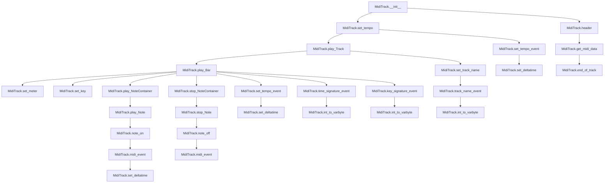

# `midi_track.py`

## `mingus.midi.midi_track.MidiTrack` · *class*

## Summary:
A class for constructing and managing MIDI track data, including notes, tempo, time signatures, and key signatures.

## Description:
The MidiTrack class is responsible for building MIDI track data by accumulating various MIDI events such as note on/off events, tempo changes, time signatures, and key signatures. It provides methods for playing musical elements (notes, note containers, bars, and tracks) and generating complete MIDI track data for inclusion in MIDI files. The class maintains internal state for tempo, timing, and track metadata while offering a high-level interface for musical composition and playback.

This class serves as the core component for MIDI track construction in the mingus library, enabling the creation of structured musical data that can be serialized into MIDI files or played through MIDI devices.

## State:
- track_data: bytes - Accumulated MIDI events for the track, including notes, tempo changes, time signatures, and key signatures
- delta_time: bytes - Current delta time value used for timing MIDI events, defaults to b"\x00"
- delay: int - Accumulated delay time for silent periods between musical elements, defaults to 0
- bpm: int - Current tempo in beats per minute, defaults to 120
- change_instrument: bool - Flag indicating whether an instrument change is pending, defaults to False
- instrument: int - Instrument number to be used when change_instrument is True, defaults to 1

## Lifecycle:
- Creation: Instantiate with optional start_bpm parameter (defaults to 120)
- Usage: Call methods like play_Note, play_NoteContainer, play_Bar, or play_Track to accumulate MIDI events
- Destruction: Use get_midi_data() to retrieve complete track data, or reset() to clear internal state

## Method Map:


## Raises:
- AssertionError: In methods like note_on, note_off, and midi_event when parameters are outside valid ranges (channel, note, velocity, event_type)
- ZeroDivisionError: In set_tempo_event when bpm is zero
- ValueError: In methods like key_signature_event when invalid key names are provided

## Example:
```python
# Create a new MIDI track with 120 BPM
track = MidiTrack(120)

# Add a simple note
note = Note("C-4", 1, 100)  # Note, channel, velocity
track.play_Note(note)

# Add a note container (chord)
notes = NoteContainer(["C-4", "E-4", "G-4"])
track.play_NoteContainer(notes)

# Play a complete bar
bar = Bar("C", (4, 4))
# ... populate bar with musical elements ...
track.play_Bar(bar)

# Get complete MIDI track data
midi_data = track.get_midi_data()
```

### `mingus.midi.midi_track.MidiTrack.__init__` · *method*

## Summary:
Initializes a MIDI track with empty data and sets its initial tempo.

## Description:
This method initializes a MIDI track object by setting up its internal data buffer and configuring the initial tempo. It is called automatically during object instantiation and establishes the foundational state for the track. The method ensures that the track starts with a clean data buffer and a properly configured tempo, making it ready for subsequent MIDI events to be added.

## Args:
    start_bpm (int): Initial tempo in beats per minute. Defaults to 120.

## Returns:
    None: This method does not return a value.

## Raises:
    AssertionError: May raise assertion errors if the set_tempo method encounters invalid tempo values during initialization.

## State Changes:
    Attributes READ: None
    Attributes WRITTEN: self.track_data, self.bpm

## Constraints:
    Preconditions: The start_bpm argument must be a positive integer.
    Postconditions: The self.track_data attribute is initialized to an empty byte string, and self.bpm is set to the provided start_bpm value.

## Side Effects:
    None: This method does not perform I/O operations or mutate external objects. It only initializes the instance's internal state.

### `mingus.midi.midi_track.MidiTrack.end_of_track` · *method*

## Summary:
Returns the MIDI end-of-track meta event byte sequence that terminates a MIDI track.

## Description:
This method returns the fixed byte sequence that represents the end-of-track meta event in MIDI format. It is used to properly terminate MIDI tracks when generating MIDI files. The method is called during the finalization phase of MIDI track construction, specifically when retrieving the complete MIDI data for a track.

## Args:
    None

## Returns:
    bytes: The end-of-track meta event byte sequence b'\x00\xff\x2f\x00'

## Raises:
    None

## State Changes:
    Attributes READ: None
    Attributes WRITTEN: None

## Constraints:
    Preconditions: None
    Postconditions: Always returns the same fixed byte sequence representing end-of-track meta event

## Side Effects:
    None

### `mingus.midi.midi_track.MidiTrack.play_Note` · *method*

## Summary:
Plays a MIDI note by generating the appropriate MIDI events and appending them to the track's data buffer.

## Description:
This method handles the playback of a single MIDI note within a track. It manages instrument changes when required, validates the note's velocity value, and generates the proper MIDI "note on" event. The method is part of the MidiTrack class's note playback pipeline and integrates with other MIDI event generation methods to construct complete MIDI sequences. This method encapsulates the core logic for playing individual notes, separating it from inline code for better maintainability and reusability.

## Args:
    note (Note): A note object containing note information including channel, velocity, and pitch. The note object must support conversion to integer via int(note) and must have channel and velocity attributes.

## Returns:
    None: This method does not return a value but modifies the track's internal state.

## Raises:
    AssertionError: When the note's velocity is outside the valid range of 0 to 127 (0x7F).

## State Changes:
    Attributes READ: self.change_instrument, self.instrument, self.track_data
    Attributes WRITTEN: self.track_data

## Constraints:
    Preconditions: 
    - The note object must have channel and velocity attributes
    - The note object must support conversion to integer via int(note)
    - The velocity value must be between 0 and 127 inclusive
    
    Postconditions:
    - The track_data attribute is updated with the new note-on MIDI event
    - If change_instrument flag was True, the instrument is set and the flag is reset

## Side Effects:
    - Modifies the track_data attribute by appending new MIDI event data
    - May invoke the set_instrument method if change_instrument flag is True
    - May invoke the note_on method to generate MIDI event bytes

### `mingus.midi.midi_track.MidiTrack.play_NoteContainer` · *method*

## Summary:
Plays a container of musical notes, handling both single and multiple-note scenarios with appropriate timing adjustments.

## Description:
This method processes a collection of musical notes (NoteContainer) by playing them sequentially. For containers with one or zero notes, it plays all notes in the container. For containers with multiple notes, it plays the first note, resets the time delta to zero, then plays the remaining notes. This approach ensures proper timing between consecutive notes in a sequence while maintaining efficient playback for single-note containers.

The method serves as a convenience wrapper that orchestrates the playback of multiple notes while managing timing states appropriately. It's designed to work with NoteContainer objects that behave like lists of note objects, making it suitable for playing chords or sequential note groups.

## Args:
    notecontainer (list-like): A container of musical notes to play, typically a list or similar sequence of Note objects. The container must support len() and indexing operations.

## Returns:
    None: This method does not return a value but executes note playback operations

## Raises:
    None explicitly raised

## State Changes:
    Attributes READ: None
    Attributes WRITTEN: self.delta_time (via set_deltatime call)

## Constraints:
    Preconditions: 
    - The notecontainer parameter must be a sequence-like object with a length property and support indexing
    - Each item in notecontainer must be playable by self.play_Note()
    
    Postconditions:
    - All notes in the container are played via self.play_Note()
    - For multi-note containers, timing is properly managed with delta time reset after the first note

## Side Effects:
    I/O: Calls self.play_Note() multiple times to generate MIDI events
    External service calls: Calls self.set_deltatime(0) to manage timing state between notes

### `mingus.midi.midi_track.MidiTrack.play_Bar` · *method*

## Summary:
Processes a musical bar by configuring track settings and playing/stopping note containers with proper timing.

## Description:
This method orchestrates the playback of a musical bar by first setting up the MIDI track with the bar's meter, key, and tempo information. It then iterates through each element in the bar, calculating appropriate timing based on note durations and managing the playback and stopping of note containers. The method accumulates timing delays for silent periods and properly sequences MIDI events for musical accuracy.

The method is specifically designed to handle bar-level musical playback, separating the concerns of musical structure configuration from individual note handling. This modular approach enables clean organization of musical time and ensures proper sequencing of MIDI events.

## Args:
    bar (Bar): A Bar object containing musical elements to be played. Each element is expected to be a tuple with structure (element_type, duration, note_container_or_metadata).

## Returns:
    None: This method does not return any value.

## Raises:
    AttributeError: When accessing attributes of bar elements that don't exist (e.g., accessing x[2] when x has fewer than 3 elements).
    TypeError: When bar is not a valid Bar object or when elements in bar are not properly structured tuples.
    ValueError: When attempting to process invalid meter or key values.

## State Changes:
    Attributes READ: 
        - self.delay: Current accumulated delay time
        - self.bpm: Current tempo setting
        - self.track_data: MIDI track data being built
        - self.delta_time: Current delta time setting
    Attributes WRITTEN: 
        - self.delay: Reset to 0 after initial setup, accumulated for silent periods
        - self.bpm: Updated when tempo changes via tempo metadata
        - self.track_data: Appended with key signature and tempo events
        - self.delta_time: Updated with timing information

## Constraints:
    Preconditions:
        - The bar parameter must be a valid Bar object with properly structured elements
        - Each element in the bar must be a tuple with at least 3 elements (type, duration, container/metadata)
        - The bar must have valid meter and key properties
        - Elements in the bar must have valid duration values
    Postconditions:
        - The MIDI track's meter, key, and tempo are configured according to the bar's properties
        - All note containers in the bar are played and stopped with appropriate timing
        - The delay attribute is reset to 0 after initial setup
        - Track data is properly accumulated with MIDI events

## Side Effects:
    I/O: Generates MIDI events through various set_* methods and play_NoteContainer/stop_NoteContainer calls
    External service calls: Invokes play_NoteContainer and stop_NoteContainer methods which may trigger MIDI output

### `mingus.midi.midi_track.MidiTrack.play_Track` · *method*

## Summary:
Processes a track by setting track name, resetting delay, and playing each bar sequentially.

## Description:
This method takes a track object and processes it by first checking if it has a name attribute to set the track name, then resets the delay counter. If the track has an instrument with an instrument_nr attribute, it prepares to change the instrument. Finally, it iterates through each bar in the track and plays it using the play_Bar method. This method serves as the main entry point for processing a complete track in the MIDI playback pipeline.

## Args:
    track: A track object that contains bars to be played and optional metadata such as name and instrument.

## Returns:
    None

## Raises:
    None explicitly raised

## State Changes:
    Attributes READ: self.delay
    Attributes WRITTEN: self.delay, self.change_instrument, self.instrument

## Constraints:
    Preconditions: The track object must be iterable and contain bars that can be processed by play_Bar. The track object may optionally have a name attribute and an instrument attribute with an instrument_nr attribute.
    Postconditions: The MidiTrack's delay is reset to 0, and if the track has an instrument with instrument_nr, the change_instrument flag is set to True and instrument is updated.

## Side Effects:
    None

### `mingus.midi.midi_track.MidiTrack.stop_Note` · *method*

## Summary:
Stops a MIDI note by creating a NOTE_OFF event and appending it to the track's data.

## Description:
This method terminates a MIDI note by generating a NOTE_OFF event using the note's channel, pitch, and velocity properties. It is called during the note termination phase of MIDI playback, specifically when releasing individual notes. The method delegates to the note_off helper method to create the proper MIDI event structure. This method is part of the MidiTrack class and is used in conjunction with play_Note to manage note playback lifecycle.

## Args:
    note (object): A note object containing channel, velocity, and pitch information. The note object must have channel, velocity, and int() convertible pitch attributes.

## Returns:
    None

## Raises:
    AttributeError: If the note object lacks required attributes (channel, velocity, or int() conversion capability).
    TypeError: If the note object's pitch cannot be converted to an integer.

## State Changes:
    Attributes READ: self.track_data, note.channel, note.velocity, note (via int() conversion)
    Attributes WRITTEN: self.track_data

## Constraints:
    Preconditions:
        - The note object must have channel, velocity, and pitch attributes
        - The note's pitch must be convertible to an integer
        - The note's pitch value plus 12 must result in a valid MIDI note number (0-127)
    Postconditions:
        - The track_data attribute is updated with the NOTE_OFF event bytes
        - The note's pitch is incremented by 12 before being sent to note_off

## Side Effects:
    None

### `mingus.midi.midi_track.MidiTrack.stop_NoteContainer` · *method*

## Summary:
Stops a container of MIDI notes by processing each note individually and managing timing between them.

## Description:
This method handles the termination of multiple MIDI notes contained within a note container. It processes the notes differently based on the container size: for containers with one or zero notes, it stops all notes sequentially; for larger containers, it stops the first note, resets the delta time to zero, then stops the remaining notes. This approach ensures proper timing synchronization when stopping multiple notes in sequence.

Known callers and contexts:
- Called in MidiTrack.play_Bar() when stopping NoteContainers after playback
- Called directly by user code when stopping groups of notes

This logic is separated into its own method to provide a clean interface for stopping multiple notes while handling the timing requirements appropriately. The method ensures that when stopping multiple notes, the first note is processed normally, followed by subsequent notes with zero delta time to maintain proper sequencing.

## Args:
    notecontainer (list-like): A collection of note objects to be stopped. Each note object must have channel, velocity, and pitch attributes that support int() conversion. The container must support len() and indexing operations.

## Returns:
    None

## Raises:
    AttributeError: If note objects lack required attributes (channel, velocity, or int() conversion capability).
    TypeError: If note objects' pitch cannot be converted to an integer.

## State Changes:
    Attributes READ: self.track_data (through stop_Note calls), self.delta_time (through set_deltatime call)
    Attributes WRITTEN: self.delta_time (through set_deltatime call)

## Constraints:
    Preconditions:
        - The notecontainer must be iterable and support len() function
        - Each note in the container must have channel, velocity, and pitch attributes
        - Each note's pitch must be convertible to an integer
        - Notes must be valid for the stop_Note method to process

    Postconditions:
        - All notes in the container are stopped via stop_Note method calls
        - The delta_time is reset to zero between the first note and subsequent notes (when container has > 1 note)
        - The track_data attribute is updated with NOTE_OFF events for each stopped note

## Side Effects:
    - Calls stop_Note method for each note in the container
    - Calls set_deltatime method to reset timing between notes
    - Modifies the track_data attribute by appending NOTE_OFF events

### `mingus.midi.midi_track.MidiTrack.set_instrument` · *method*

## Summary:
Sets the instrument for a specified MIDI channel by sending a bank selection and program change event.

## Description:
Configures an instrument on a given MIDI channel by first selecting the appropriate bank and then changing the program (instrument). This method is typically used during MIDI track initialization or when dynamically changing instruments within a track. It combines two separate MIDI events into a single operation for convenience.

The method is called in the `play_Note` method when `change_instrument` flag is set, allowing for dynamic instrument switching during playback. This approach ensures proper MIDI protocol compliance by first setting the bank before selecting the instrument.

## Args:
    channel (int): The MIDI channel number (0-15) for which to set the instrument.
    instr (int): The instrument number (0-127) to select on the specified channel.
    bank (int): The bank number (0-127) to select for the channel. Defaults to 1.

## Returns:
    None

## Raises:
    AssertionError: If channel is not in range [0, 15], or if bank/instr is not in range [0, 127].

## State Changes:
    Attributes READ: None
    Attributes WRITTEN: self.track_data

## Constraints:
    Preconditions:
        - channel must be an integer in the range [0, 15]
        - bank must be an integer in the range [0, 127]
        - instr must be an integer in the range [0, 127]
    Postconditions:
        - self.track_data contains the bank selection and program change events for the specified channel

## Side Effects:
    None

### `mingus.midi.midi_track.MidiTrack.header` · *method*

## Summary:
Returns the MIDI track header chunk containing the track's metadata and size information.

## Description:
This method constructs and returns the header portion of a MIDI track chunk according to the MIDI file format specification. It calculates the total size of the track data including the end-of-track event and encodes this size into a 4-byte big-endian hexadecimal format. The header consists of a fixed 4-byte identifier "MTrk" followed by the calculated 4-byte size. This method is typically called during the finalization phase of MIDI track construction when preparing track data for MIDI file generation.

## Args:
    None

## Returns:
    bytes: A byte string representing the MIDI track header chunk, consisting of the fixed TRACK_HEADER constant followed by the 4-byte encoded chunk size.

## Raises:
    None

## State Changes:
    Attributes READ: self.track_data, self.end_of_track()
    Attributes WRITTEN: None

## Constraints:
    Preconditions: 
    - self.track_data must be a valid bytes-like object
    - self.end_of_track() must return a valid bytes-like object
    - TRACK_HEADER must be defined as a global constant with value b'MTrk'
    Postconditions:
    - The returned bytes object follows the MIDI file format specification for track headers
    - The chunk size accurately reflects the total length of track data plus end-of-track event
    - The size is encoded as a 4-byte big-endian integer

## Side Effects:
    None

### `mingus.midi.midi_track.MidiTrack.get_midi_data` · *method*

## Summary:
Returns the complete MIDI data for this track by combining the track header, track data, and end-of-track marker.

## Description:
This method constructs the complete MIDI track data by concatenating three components: the track header (which contains metadata about the track size), the actual track data (containing all MIDI events), and the end-of-track marker. It serves as the primary interface for retrieving serialized MIDI track data. This method is typically called during MIDI file generation when all track events have been added and the final track data needs to be assembled.

## Args:
    None

## Returns:
    bytes: A complete MIDI track data sequence consisting of the track header, track data, and end-of-track marker.

## Raises:
    None

## State Changes:
    Attributes READ: self.track_data, self.end_of_track()
    Attributes WRITTEN: None

## Constraints:
    Preconditions: 
    - The track_data attribute must contain valid MIDI event data
    - The end_of_track() method must return a valid end-of-track marker
    Postconditions: 
    - Returns properly formatted MIDI track data with correct header size calculation
    - The returned data is ready for inclusion in a complete MIDI file

## Side Effects:
    None

### `mingus.midi.midi_track.MidiTrack.midi_event` · *method*

## Summary:
Constructs a MIDI event byte sequence by combining status and parameter bytes with the current delta time.

## Description:
This method builds a properly formatted MIDI event according to MIDI specifications. It takes event type, channel, and parameters to create a status byte and parameter bytes, then prepends the current delta_time to form a complete MIDI event. This method is typically called by other MIDI event creation methods within the MidiTrack class to build various types of MIDI messages.

## Args:
    event_type (int): MIDI event type (0-15). Must be within valid range.
    channel (int): MIDI channel number (0-15). Must be within valid range.
    param1 (int): First parameter for the MIDI event (0-127). Must be within valid range.
    param2 (int, optional): Second parameter for the MIDI event (0-127). Defaults to None.

## Returns:
    bytes: A byte sequence representing the complete MIDI event, including delta time.

## Raises:
    AssertionError: When any parameter is outside its valid range.

## State Changes:
    Attributes READ: self.delta_time
    Attributes WRITTEN: None

## Constraints:
    Preconditions:
        - event_type must be between 0 and 15 inclusive
        - channel must be between 0 and 15 inclusive
        - param1 must be between 0 and 127 inclusive
        - param2 must be either None or between 0 and 127 inclusive
    Postconditions:
        - Returns properly formatted MIDI event bytes
        - Delta time is prepended to the event

## Side Effects:
    None

### `mingus.midi.midi_track.MidiTrack.note_off` · *method*

## Summary:
Creates a MIDI NOTE_OFF event for the specified channel, note, and velocity to terminate note playback.

## Description:
This method generates a MIDI NOTE_OFF event by delegating to the midi_event method with the NOTE_OFF event type. It is used during the stopping phase of note playback, specifically when terminating individual notes or note containers. This method is called by stop_Note and stop_NoteContainer methods when releasing notes.

## Args:
    channel (int): MIDI channel number (0-15). Must be within valid range.
    note (int): MIDI note number (0-127). Must be within valid range.
    velocity (int): Note release velocity (0-127). Must be within valid range.

## Returns:
    bytes: A byte sequence representing the MIDI NOTE_OFF event, including delta time.

## Raises:
    AssertionError: When any parameter is outside its valid range (channel, note, or velocity).

## State Changes:
    Attributes READ: self.delta_time
    Attributes WRITTEN: None

## Constraints:
    Preconditions:
        - channel must be between 0 and 15 inclusive
        - note must be between 0 and 127 inclusive
        - velocity must be between 0 and 127 inclusive
    Postconditions:
        - Returns properly formatted MIDI NOTE_OFF event bytes
        - Delta time is prepended to the event

## Side Effects:
    None

### `mingus.midi.midi_track.MidiTrack.note_on` · *method*

## Summary:
Creates a MIDI note-on event for the specified channel, note, and velocity.

## Description:
This method generates a MIDI note-on event by delegating to the midi_event helper method with the NOTE_ON event type. It is used to add note-on messages to the MIDI track data stream, which instructs MIDI devices to start playing a specific note.

## Args:
    channel (int): MIDI channel number (0-15).
    note (int): MIDI note number (0-127).
    velocity (int): Note velocity (0-127).

## Returns:
    bytes: A byte sequence representing the MIDI note-on event, including delta time.

## Raises:
    AssertionError: When any parameter is outside its valid range (as enforced by midi_event).

## State Changes:
    Attributes READ: self.delta_time
    Attributes WRITTEN: None

## Constraints:
    Preconditions:
        - channel must be between 0 and 15 inclusive
        - note must be between 0 and 127 inclusive
        - velocity must be between 0 and 127 inclusive
    Postconditions:
        - Returns properly formatted MIDI note-on event bytes
        - Delta time is prepended to the event

## Side Effects:
    None

### `mingus.midi.midi_track.MidiTrack.controller_event` · *method*

## Summary:
Creates a MIDI controller event message for the specified channel, controller number, and controller value.

## Description:
This method generates a MIDI controller event by delegating to the underlying midi_event method. It provides a convenient interface for creating controller events without needing to manually specify the event type constant. Controller events are used to modify various parameters such as volume, pan, modulation, and other controller settings in MIDI-compatible devices.

## Args:
    channel (int): The MIDI channel number (0-15) for the controller event.
    contr_nr (int): The controller number (0-127) specifying which controller to modify.
    contr_val (int): The controller value (0-127) representing the controller's setting.

## Returns:
    bytes: A byte sequence representing the complete MIDI controller event message.

## Raises:
    AssertionError: If channel is not in range [0, 15], or if contr_nr or contr_val are not in range [0, 127].

## State Changes:
    Attributes READ: None
    Attributes WRITTEN: None

## Constraints:
    Preconditions: 
    - channel must be an integer in the range [0, 15]
    - contr_nr must be an integer in the range [0, 127]
    - contr_val must be an integer in the range [0, 127]
    Postconditions: 
    - Returns a properly formatted MIDI controller event byte sequence

## Side Effects:
    None

### `mingus.midi.midi_track.MidiTrack.reset` · *method*

## Summary:
Resets the MIDI track's data buffer and delta time to initial empty states.

## Description:
This method clears the accumulated MIDI events data and resets the delta time counter to its default value. It is typically called to prepare a MidiTrack instance for reuse or to clear previous track content before building a new one. The method is invoked during the initialization process and can also be called manually to reset track state.

## Args:
    None

## Returns:
    None

## Raises:
    None

## State Changes:
    Attributes READ: None
    Attributes WRITTEN: 
    - self.track_data: Set to empty bytes (b"")
    - self.delta_time: Set to null byte (b"\x00")

## Constraints:
    Preconditions: None
    Postconditions: 
    - self.track_data is reset to empty bytes
    - self.delta_time is reset to null byte

## Side Effects:
    None

### `mingus.midi.midi_track.MidiTrack.set_deltatime` · *method*

## Summary:
Sets the delta time for a MIDI track event, converting integer values to variable-length byte format for MIDI encoding.

## Description:
Configures the time interval between consecutive MIDI events within a track. This method handles conversion of integer delta time values to MIDI's variable-length byte format, which is required for proper MIDI file encoding. The delta time represents the time elapsed since the previous event and is crucial for maintaining proper timing in MIDI sequences.

This method is part of the MidiTrack class and is called during various stages of MIDI file construction, particularly when setting timing information for events such as note on/off commands, tempo changes, and other meta-events. It ensures that numeric time values are properly encoded according to MIDI specifications.

## Args:
    delta_time (int or bytes): The delta time value to set. If an integer is provided, it will be converted to variable-length byte format using the int_to_varbyte method. If bytes are provided, they are used directly.

## Returns:
    None

## Raises:
    None explicitly raised

## State Changes:
    Attributes READ: None
    Attributes WRITTEN: self.delta_time

## Constraints:
    Preconditions: The delta_time parameter should be either an integer (non-negative) or bytes object. When an integer is provided, it must be non-negative.
    Postconditions: The self.delta_time attribute is updated with the provided value, converted to variable-length format if needed.

## Side Effects:
    None

### `mingus.midi.midi_track.MidiTrack.select_bank` · *method*

## Summary:
Sends a MIDI bank select controller event to the specified channel with the given bank number.

## Description:
This method creates and returns a MIDI controller event message for selecting a bank on the specified channel. It delegates to the controller_event method with BANK_SELECT as the event type, making it a convenient way to perform bank selection operations in MIDI programming. Bank selection is commonly used when working with instruments that have multiple banks of sounds or patches.

## Args:
    channel (int): The MIDI channel number (0-15) for which to select the bank.
    bank (int): The bank number (0-127) to select for the channel.

## Returns:
    bytes: A byte sequence representing the complete MIDI bank select controller event message.

## Raises:
    AssertionError: If channel is not in range [0, 15], or if bank is not in range [0, 127].

## State Changes:
    Attributes READ: None
    Attributes WRITTEN: None

## Constraints:
    Preconditions: 
    - channel must be an integer in the range [0, 15]
    - bank must be an integer in the range [0, 127]
    Postconditions: 
    - Returns a properly formatted MIDI controller event byte sequence for bank selection

## Side Effects:
    None

### `mingus.midi.midi_track.MidiTrack.program_change_event` · *method*

## Summary:
Creates a MIDI program change event that selects an instrument on a specific channel.

## Description:
This method generates a MIDI program change event, which is used to switch instruments on a given MIDI channel. It delegates the actual event construction to the midi_event method, passing the PROGRAM_CHANGE event type along with the specified channel and instrument number. This method is typically called when setting up instrument changes within a MIDI track.

## Args:
    channel (int): MIDI channel number (0-15) to send the program change event to.
    instr (int): Instrument number (0-127) to select on the specified channel.

## Returns:
    bytes: A byte sequence representing the complete MIDI program change event, including delta time.

## Raises:
    AssertionError: When channel is outside the valid range (0-15) or instr is outside the valid range (0-127).

## State Changes:
    Attributes READ: self.delta_time
    Attributes WRITTEN: None

## Constraints:
    Preconditions:
        - channel must be between 0 and 15 inclusive
        - instr must be between 0 and 127 inclusive
    Postconditions:
        - Returns properly formatted MIDI program change event bytes
        - Delta time is prepended to the event

## Side Effects:
    None

### `mingus.midi.midi_track.MidiTrack.set_tempo` · *method*

## Summary:
Sets the tempo of the MIDI track in beats per minute and updates the track's metadata with the corresponding tempo event.

## Description:
This method configures the playback speed of the MIDI track by setting its tempo in beats per minute (BPM). It updates the internal BPM attribute and appends the appropriate MIDI tempo meta-event to the track's data buffer. The method is typically called during MIDI track initialization or when dynamically changing tempo within a composition. This method encapsulates the logic for tempo setting to maintain clean separation between tempo configuration and MIDI data generation.

Known callers include:
- `MidiTrack.__init__` during object instantiation with a default tempo of 120 BPM
- `play_Bar` when processing notes with tempo changes in the bar structure

## Args:
    bpm (int): The tempo in beats per minute. Must be a positive integer representing the desired tempo.

## Returns:
    None: This method does not return a value.

## Raises:
    AssertionError: May raise assertion errors if underlying helper methods encounter invalid parameters during tempo calculation or MIDI event creation.

## State Changes:
    Attributes READ: self.bpm, self.track_data, self.delta_time
    Attributes WRITTEN: self.bpm, self.track_data

## Constraints:
    Preconditions: The bpm argument must be a positive integer.
    Postconditions: The self.bpm attribute is updated to the provided value, and self.track_data contains the tempo meta-event.

## Side Effects:
    None: This method does not perform I/O operations or mutate external objects. It only modifies the instance's internal state.

### `mingus.midi.midi_track.MidiTrack.set_tempo_event` · *method*

## Summary:
Constructs a MIDI meta event for setting the tempo of a track based on beats per minute.

## Description:
This method generates a complete MIDI meta event for tempo changes. It calculates the microseconds per quarter note (MPQN) from the provided BPM value, formats it as a 3-byte hexadecimal string, converts it to binary bytes, and combines it with MIDI event identifiers to create a proper meta event structure. This method is part of the MidiTrack class and is used during MIDI file construction to define tempo changes. It is called internally by the set_tempo method when updating track tempo.

## Args:
    bpm (int): Tempo in beats per minute, typically ranging from 1 to 300+.

## Returns:
    bytes: A byte string representing a complete MIDI meta event for tempo setting, formatted as: [delta_time][META_EVENT][SET_TEMPO][length][mpqn].

## Raises:
    ZeroDivisionError: If bpm is zero.
    ValueError: If bpm results in an MPQN that cannot be represented in 3 bytes.

## State Changes:
    Attributes READ: self.delta_time
    Attributes WRITTEN: None

## Constraints:
    Preconditions: 
    - bpm must be a positive integer greater than 0
    - The calculated MPQN value must fit within 3 bytes (i.e., less than 0xFFFFFF)
    Postconditions: 
    - Returns a properly formatted MIDI meta event for tempo changes
    - The returned bytes follow standard MIDI format for meta events

## Side Effects:
    None

### `mingus.midi.midi_track.MidiTrack.set_meter` · *method*

## Summary:
Sets the time signature for the MIDI track by appending a time signature meta event to the track data.

## Description:
This method configures the musical time signature for the MIDI track. It is typically called during the initialization or setup phase of a MIDI track to establish the rhythmic framework. The method delegates the creation of the time signature event to the `time_signature_event` helper method. This method is part of the MIDI track construction pipeline and is called when setting up the rhythmic structure of a musical bar, specifically in the `play_Bar` method.

## Args:
    meter (tuple[int, int]): The time signature as a tuple of (numerator, denominator). Defaults to (4, 4).

## Returns:
    None: This method does not return a value.

## Raises:
    None explicitly raised.

## State Changes:
    Attributes READ: self.track_data, self.delta_time, self.time_signature_event
    Attributes WRITTEN: self.track_data

## Constraints:
    Preconditions: The meter tuple must contain valid integers where the denominator is a power of 2.
    Postconditions: The track_data attribute will contain the appended time signature meta event.

## Side Effects:
    None.

### `mingus.midi.midi_track.MidiTrack.time_signature_event` · *method*

## Summary:
Creates a MIDI time signature meta event for the current track with the specified meter.

## Description:
This method generates a MIDI time signature meta event that defines the rhythmic structure of the musical piece. It converts the provided meter tuple into the appropriate binary format required by the MIDI specification and combines it with existing track metadata to form a complete MIDI event. The method is typically called internally by the set_meter method when adding time signature information to a MIDI track.

Known callers:
- set_meter: Called during MIDI track initialization to establish the rhythmic framework
- play_Bar: Called when processing musical bars to ensure proper time signature handling

## Args:
    meter (tuple[int, int]): The time signature meter as (numerator, denominator). Defaults to (4, 4).

## Returns:
    bytes: A complete MIDI meta event containing the time signature information.

## Raises:
    None explicitly raised.

## State Changes:
    Attributes READ: self.delta_time
    Attributes WRITTEN: None

## Constraints:
    Preconditions: The meter tuple must contain valid integers where the denominator is a power of 2. The numerator should be a positive integer.
    Postconditions: The returned bytes represent a valid MIDI time signature meta event with proper formatting.

## Side Effects:
    None.

### `mingus.midi.midi_track.MidiTrack.set_key` · *method*

## Summary:
Sets the key signature for a MIDI track by appending a key signature meta-event to the track's data.

## Description:
This method configures the musical key signature for a MIDI track. It accepts either a Key object or a string representing a musical key and converts it to the appropriate MIDI key signature event. The method is typically called during the playback of a musical bar to establish the key context for subsequent notes. This logic is encapsulated in its own method to separate concerns and allow for easy reuse when setting key signatures in different contexts.

## Args:
    key (str or Key): The musical key to set. Can be a string like "C" for C major or "a" for A minor, or a Key object. Defaults to "C".

## Returns:
    None

## Raises:
    ValueError: If the key string is not found in the major_keys or minor_keys lists when converting from a Key object.

## State Changes:
    Attributes READ: None
    Attributes WRITTEN: self.track_data

## Constraints:
    Preconditions: The key parameter must be a valid key name present in either major_keys or minor_keys lists when converted to a string. If a Key object is passed, its name must be accessible via key.name[0].
    Postconditions: The track_data attribute contains the key signature meta-event for the specified key.

## Side Effects:
    Mutates the self.track_data attribute by appending MIDI key signature data.

### `mingus.midi.midi_track.MidiTrack.key_signature_event` · *method*

## Summary:
Creates a MIDI key signature meta-event for the specified musical key.

## Description:
This method generates a MIDI key signature meta-event that indicates the key of the musical piece. It is used internally by the MidiTrack class to add key signature information to MIDI tracks. The method handles both major and minor keys by converting them to their appropriate MIDI representation according to standard MIDI key signature conventions.

## Args:
    key (str): The musical key as a string, e.g., "C" for C major or "a" for A minor. Defaults to "C". Must be a valid key name from the mingus library's key collections.

## Returns:
    bytes: A complete MIDI meta-event containing the key signature information with proper formatting for MIDI key signature events. The structure follows the MIDI meta-event format with delta time prefix, meta event type, key signature type, length field, key value, and mode.

## Raises:
    ValueError: If the key is not found in the major_keys or minor_keys lists (this occurs when index() is called on a non-existent key).

## State Changes:
    Attributes READ: self.delta_time
    Attributes WRITTEN: None

## Constraints:
    Preconditions: The key parameter must be a valid key name present in either major_keys or minor_keys lists. The key string must be either uppercase for major keys or lowercase for minor keys.
    Postconditions: The returned bytes represent a properly formatted MIDI key signature meta-event with correct delta time prefix and meta-event structure.

## Side Effects:
    None

### `mingus.midi.midi_track.MidiTrack.set_track_name` · *method*

## Summary:
Sets the name of the MIDI track by encoding the name as a MIDI meta event and appending it to the track's data.

## Description:
This method assigns a human-readable name to the MIDI track by creating a track name meta event and appending it to the track's data buffer. It is typically called during the construction of a MIDI track when a track name is specified, such as when playing a Track object that has a name attribute. The method delegates to `track_name_event()` to generate the proper MIDI meta event structure.

## Args:
    name (str): The name to assign to the track. Must be a valid ASCII string.

## Returns:
    None: This method does not return a value.

## Raises:
    UnicodeEncodeError: If the name contains non-ASCII characters that cannot be encoded.
    AssertionError: If the name parameter is not a string.

## State Changes:
    Attributes READ: self.track_data, self.delta_time
    Attributes WRITTEN: self.track_data

## Constraints:
    Preconditions: The name argument must be a string containing only ASCII characters.
    Postconditions: The track_data attribute will contain the track name meta event appended to its existing content.

## Side Effects:
    None: This method only modifies the internal track_data attribute and does not perform any I/O or external service calls.

### `mingus.midi.midi_track.MidiTrack.track_name_event` · *method*

## Summary:
Creates a MIDI track name meta event by encoding the name as an ASCII string with variable-length length prefix.

## Description:
This method generates a MIDI track name meta event that identifies the track in a MIDI file. The method constructs a standard MIDI meta event structure consisting of a delta time (0), meta event type identifier (0xFF), meta event subtype (0x03 for track name), length field encoded in variable-length format, and the ASCII-encoded track name. This is used internally by `set_track_name()` to add track identification to MIDI data.

## Args:
    name (str): The track name to encode. Must be a valid ASCII string.

## Returns:
    bytes: A bytes object representing the complete MIDI track name meta event with format: [delta_time][meta_event][track_name_type][length][name].

## Raises:
    UnicodeEncodeError: If the name contains non-ASCII characters that cannot be encoded to ASCII.

## State Changes:
    Attributes READ: None
    Attributes WRITTEN: None

## Constraints:
    Preconditions: The name argument must be a string containing only ASCII characters.
    Postconditions: The returned bytes object represents a valid MIDI track name meta event.

## Side Effects:
    None: This method performs no I/O or external service calls and only computes and returns a bytes object.

### `mingus.midi.midi_track.MidiTrack.int_to_varbyte` · *method*

## Summary:
Converts an integer value into variable-length byte representation for MIDI data encoding.

## Description:
This method transforms an integer into a sequence of bytes using MIDI's variable-length quantity format, where each byte contains 7 bits of data and the most significant bit indicates if more bytes follow. This is commonly used in MIDI files to encode time values, note durations, and other quantities that can vary significantly in magnitude.

The method is part of the MidiTrack class and is used internally during MIDI file serialization to properly encode numeric values according to MIDI specifications. It's called by methods like set_deltatime() when encoding timing information and by track_name_event() when encoding string lengths.

## Args:
    value (int): The integer value to convert to variable-byte format. Must be non-negative.

## Returns:
    bytes: A bytes object containing the variable-length encoded representation of the input value.

## Raises:
    ValueError: When the logarithm calculation fails due to invalid input values.
    TypeError: When the input is not a number.

## State Changes:
    Attributes READ: None
    Attributes WRITTEN: None

## Constraints:
    Preconditions: The input value must be a non-negative integer.
    Postconditions: The returned bytes object represents the input value in MIDI variable-length format.

## Side Effects:
    None

