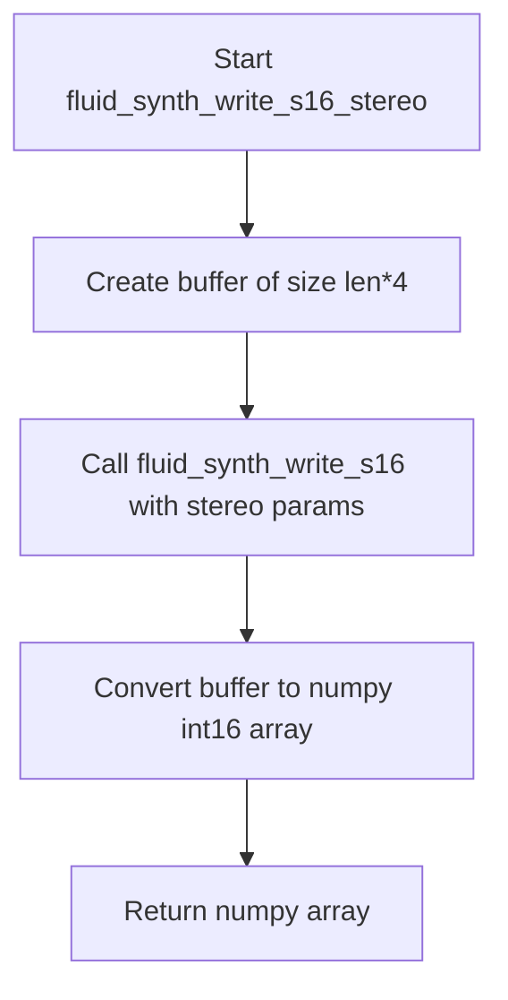
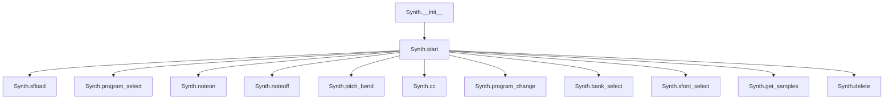
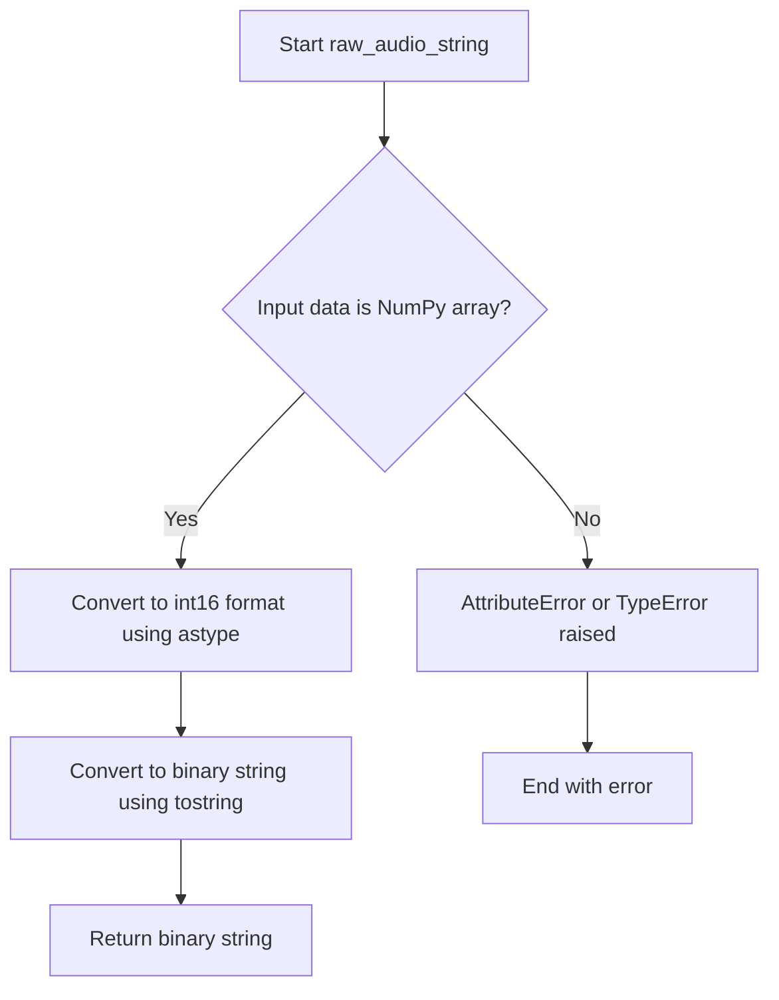

# `pyfluidsynth.py`

## `mingus.midi.pyfluidsynth.cfunc` · *function*

## Summary:
Creates a ctypes function prototype for calling C library functions with specified argument types and calling conventions.

## Description:
This utility function constructs a ctypes.CFUNCTYPE object that defines the interface for calling C functions from Python. It processes argument specifications to set up proper type information and calling convention flags for foreign function interfaces.

## Args:
    name (str): Name of the C function to be wrapped
    result (type): Return type of the C function (e.g., c_int, c_void_p)
    *args: Variable length argument list where each argument is a tuple with the format:
           (parameter_name, parameter_type, direction_flag, [additional_flags...])
           - parameter_name: string identifier for the parameter
           - parameter_type: ctypes type for the parameter (e.g., c_int, c_char_p)
           - direction_flag: integer flag indicating parameter direction (input/output/etc.)

## Returns:
    ctypes.CFUNCTYPE: A ctypes function type that can be used to create callable function pointers to C functions

## Raises:
    None explicitly raised

## Constraints:
    - Preconditions: Arguments must be properly formatted tuples with at least 3 elements
    - Postconditions: Returns a valid ctypes.CFUNCTYPE object configured with the specified signature

## Side Effects:
    - None

## Control Flow:
```mermaid
flowchart TD
    A[Start cfunc] --> B[Initialize atypes, aflags lists]
    B --> C[Iterate through args]
    C --> D[Extract atypes from arg[1]]
    D --> E[Extract aflags from arg[2], arg[0] and arg[3:]]
    E --> F[Append to respective lists]
    F --> G[Create CFUNCTYPE with result, *atypes]
    G --> H[Return CFUNCTYPE object]
```

## Examples:
    # Create a function type for a C function that takes two integers and returns an int
    func_type = cfunc("add_numbers", c_int, ("a", c_int, 1), ("b", c_int, 1))
    
    # Create a function type for a C function that takes a string and returns void
    func_type = cfunc("print_message", None, ("message", c_char_p, 1))

## `mingus.midi.pyfluidsynth.fluid_synth_write_s16_stereo` · *function*

## Summary:
Writes stereo audio samples in signed 16-bit integer format from a FluidSynth synthesizer instance.

## Description:
This function generates stereo audio data by calling the underlying FluidSynth C library function `fluid_synth_write_s16` to fill a buffer with interleaved stereo samples. It then converts this raw byte buffer into a NumPy array of signed 16-bit integers for easier manipulation in Python. This function is specifically designed for stereo output where left and right channels are interleaved in the buffer.

## Args:
    synth (c_void_p): Pointer to the FluidSynth synthesizer instance.
    len (int): Number of stereo sample frames to generate (not individual samples).

## Returns:
    numpy.ndarray: Array of shape (len * 2,) containing interleaved stereo samples as int16 values, where even indices represent left channel samples and odd indices represent right channel samples.

## Raises:
    None explicitly raised, but underlying C library calls may raise exceptions if invalid parameters are passed.

## Constraints:
    Preconditions:
        - synth must be a valid pointer to a FluidSynth synthesizer instance.
        - len must be a positive integer representing the number of stereo sample frames to generate.
    Postconditions:
        - The returned NumPy array contains exactly len * 2 elements (left and right channels for each frame).
        - The buffer allocated internally is exactly 2 * len * sizeof(int16) bytes.

## Side Effects:
    - Allocates memory for a temporary byte buffer of size len * 4 bytes.
    - Calls into the FluidSynth C library which may perform I/O operations or modify internal state.

## Control Flow:


## Examples:
```python
# Assuming synth is a valid FluidSynth synthesizer instance
samples = 1024
audio_data = fluid_synth_write_s16_stereo(synth, samples)
print(audio_data.shape)  # Output: (2048,) - 1024 stereo frames with 2 samples each
print(audio_data[0])     # Left channel sample of first frame
print(audio_data[1])     # Right channel sample of first frame
```

## `mingus.midi.pyfluidsynth.str_binary` · *function*

## Summary:
Converts a string to binary format by encoding text strings while leaving binary data unchanged.

## Description:
This utility function handles the conversion of text strings to their binary representation, primarily for compatibility with Python 2/3 differences in string handling. It is commonly used when interfacing with C libraries that expect binary data. The function checks if the input is a text string and encodes it to bytes, otherwise returns the input unchanged.

## Args:
    s (str or bytes): Input string that may be either a text string (six.text_type) or already binary data (bytes)

## Returns:
    bytes: Binary representation of the input string. If input was already bytes, returns unchanged. If input was text, returns encoded bytes.

## Raises:
    None explicitly raised

## Constraints:
    - Preconditions: Input must be either a text string or bytes object
    - Postconditions: Output is always bytes type when input is text, otherwise unchanged

## Side Effects:
    - No I/O operations
    - No external state mutations
    - No external service calls

## Control Flow:
```mermaid
flowchart TD
    A[Input s] --> B{isinstance(s, six.text_type)?}
    B -- Yes --> C[s.encode()]
    B -- No --> D[s]
    C --> E[Return bytes]
    D --> E
```

## Examples:
    # Converting text to binary (Python 2/3 compatible)
    result = str_binary("hello")
    # Returns: b'hello'
    
    # Passing binary data unchanged
    result = str_binary(b"hello")
    # Returns: b'hello'
    
    # Usage in MIDI processing context
    midi_data = str_binary("GM Sound Set")
    # Ensures proper binary format for MIDI library calls
```

## `mingus.midi.pyfluidsynth.Synth` · *class*

## Summary:
A wrapper class for the FluidSynth synthesizer library that provides MIDI synthesis capabilities with audio output.

## Description:
The Synth class serves as a Python interface to the FluidSynth C library, enabling MIDI-based audio synthesis. It manages the creation and configuration of a FluidSynth synthesizer instance, handles sound font loading, MIDI message processing, and audio output management. This class is typically instantiated by MIDI processing modules or audio applications that require software synthesizer functionality.

## State:
- settings (c_void_p): Pointer to FluidSynth settings object that stores configuration parameters like gain, sample rate, and MIDI channels
- synth (c_void_p): Pointer to the FluidSynth synthesizer instance that performs the actual audio synthesis
- audio_driver (c_void_p or None): Pointer to the audio driver instance, or None if not started

## Lifecycle:
- Creation: Instantiate with optional gain (default 0.2) and samplerate (default 44100) parameters
- Usage: Call start() to initialize audio driver for output, then use various MIDI control methods to generate audio
- Destruction: Call delete() to properly clean up all resources

## Method Map:


## Raises:
- AssertionError in start() method when an invalid audio driver name is provided
- Various exceptions may be raised by underlying FluidSynth C library functions during operation

## Example:
```python
# Create synthesizer with custom settings
synth = Synth(gain=0.5, samplerate=48000)

# Start audio output with ALSA driver
synth.start(driver="alsa")

# Load a sound font
sfid = synth.sfload("soundfont.sf2")

# Select program on channel 0
synth.program_select(0, sfid, 0, 0)

# Play a note
synth.noteon(0, 60, 100)  # Middle C, velocity 100

# Get audio samples
samples = synth.get_samples(2048)

# Clean up
synth.delete()
```

### `mingus.midi.pyfluidsynth.Synth.__init__` · *method*

## Summary:
Initializes a FluidSynth synthesizer instance with configurable audio parameters and establishes the underlying synthesis engine.

## Description:
This method initializes the core FluidSynth synthesizer by creating configuration settings, setting audio parameters such as gain and sample rate, and establishing the synthesis engine. It prepares the object for MIDI synthesis operations by configuring the underlying fluidsynth C library components through ctypes FFI calls.

## Args:
    gain (float): Audio gain level for the synthesizer output. Defaults to 0.2.
    samplerate (int): Audio sample rate in Hz. Defaults to 44100.

## Returns:
    None: This method does not return a value.

## Raises:
    None explicitly raised in the source code.

## State Changes:
    Attributes READ: None
    Attributes WRITTEN: 
        - self.settings: Stores the fluid settings object created by new_fluid_settings()
        - self.synth: Stores the fluid synthesizer object created by new_fluid_synth()
        - self.audio_driver: Set to None initially

## Constraints:
    Preconditions:
        - The pyfluidsynth library must be properly installed and accessible
        - The ctypes library must be available for FFI calls
        - The fluidsynth C library must be available on the system
    Postconditions:
        - self.settings contains a valid fluid settings object
        - self.synth contains a valid fluid synthesizer object
        - self.audio_driver is initialized to None

## Side Effects:
    - Creates and configures fluidsynth C library objects via ctypes FFI calls
    - May trigger system resource allocation for audio processing
    - No direct I/O operations or external service calls

### `mingus.midi.pyfluidsynth.Synth.start` · *method*

## Summary:
Initializes the audio driver for the synthesizer with an optional audio driver specification.

## Description:
Configures and starts the audio output driver for the MIDI synthesizer. This method allows specifying a particular audio driver to use for sound output, or defaults to the system's default audio driver. The method sets the audio driver configuration in the fluidsynth settings and creates a new audio driver instance. This is a critical step in the MIDI playback pipeline that enables the synthesizer to produce audible sound output through the system's audio subsystem.

## Args:
    driver (str or bytes, optional): Audio driver name to use for sound output. Valid options include 'alsa', 'oss', 'jack', 'portaudio', 'sndmgr', 'coreaudio', 'Direct Sound', 'dsound', 'pulseaudio'. If None, uses the system default driver.

## Returns:
    None: This method does not return a value.

## Raises:
    AssertionError: Raised when an invalid driver name is provided (driver not in the list of supported drivers).

## State Changes:
    Attributes READ: self.settings, self.synth
    Attributes WRITTEN: self.audio_driver

## Constraints:
    Preconditions: 
    - self.settings must be a valid fluidsynth settings object
    - self.synth must be a valid fluidsynth synthesizer object
    - driver (when provided) must be one of the supported audio driver names
    
    Postconditions:
    - self.audio_driver is set to a newly created fluidsynth audio driver instance
    - Audio driver setting in self.settings is updated if driver parameter is provided

## Side Effects:
    - Creates a new audio driver instance via C library call
    - Modifies fluidsynth settings through C library interface
    - May initiate system audio subsystem initialization

### `mingus.midi.pyfluidsynth.Synth.delete` · *method*

## Summary:
Releases all allocated resources associated with the FluidSynth synthesizer instance, including audio driver, synth, and settings.

## Description:
This method performs cleanup operations by releasing the native resources allocated for the FluidSynth synthesizer. It is typically called during object destruction or when explicitly disposing of the synthesizer instance. The method ensures proper resource deallocation to prevent memory leaks. This method exists as a separate function to provide explicit control over resource cleanup and follows the standard pattern of having a dedicated cleanup method in resource-managing classes.

## Args:
    None

## Returns:
    None

## Raises:
    None

## State Changes:
    Attributes READ: self.audio_driver, self.synth, self.settings
    Attributes WRITTEN: None

## Constraints:
    Preconditions: The Synth object must be initialized with valid fluidsynth resources
    Postconditions: All fluidsynth resources (audio driver, synth, settings) are properly deallocated

## Side Effects:
    Calls external C library functions delete_fluid_audio_driver, delete_fluid_synth, and delete_fluid_settings which may involve system-level resource deallocation

### `mingus.midi.pyfluidsynth.Synth.sfload` · *method*

## Summary:
Loads a SoundFont file into the synthesizer instance, making its instruments available for playback.

## Description:
This method provides access to the underlying FluidSynth library's sound font loading capability. It allows the synthesizer to load SoundFont files (.sf2) that contain instrument definitions and samples. The loaded sound fonts can then be used to play musical notes through program selection and other MIDI commands. This method serves as a direct interface to the FluidSynth C library's fluid_synth_sfload function.

## Args:
    filename (str): Path to the SoundFont file to load. Must be a valid file path string.
    update_midi_preset (int): Flag indicating whether to update MIDI presets after loading. Defaults to 0 (false).

## Returns:
    int: Return value from the underlying fluid_synth_sfload function. Typically returns a SoundFont ID on success or -1 on failure.

## Raises:
    None explicitly raised by this wrapper method.

## State Changes:
    Attributes READ: self.synth
    Attributes WRITTEN: None directly modified by this method.

## Constraints:
    Preconditions: 
    - The synth attribute must be properly initialized (not None)
    - The filename must be a valid string path to an existing SoundFont file
    - The file must be readable and in valid SoundFont format (.sf2)
    
    Postconditions:
    - The SoundFont file is loaded into the synthesizer's memory
    - Instruments from the SoundFont become available for MIDI playback
    - Return value indicates success/failure of the operation

## Side Effects:
    - I/O operation: Reads from the filesystem to load the SoundFont file
    - External service call: Invokes the FluidSynth C library function fluid_synth_sfload
    - Memory allocation: SoundFont data is loaded into the synthesizer's memory space

### `mingus.midi.pyfluidsynth.Synth.sfunload` · *method*

## Summary:
Unloads a soundfont from the synthesizer by its ID, freeing associated resources.

## Description:
This method removes a previously loaded soundfont from the synthesizer's memory using its soundfont ID. It wraps the FluidSynth C library function `fluid_synth_sfunload` to provide a clean Python interface for managing soundfont resources. This method is typically called after a soundfont is no longer needed to prevent memory leaks and free up system resources.

## Args:
    sfid (int): The soundfont ID returned by a previous call to `sfload()` method.
    update_midi_preset (int): Flag indicating whether to update MIDI presets after unloading (0 = false, 1 = true). Defaults to 0.

## Returns:
    int: Return value from the underlying C library function. Typically returns 0 on success, -1 on failure.

## Raises:
    None explicitly raised by this Python wrapper, though the underlying C function may fail under certain conditions.

## State Changes:
    Attributes READ: self.synth
    Attributes WRITTEN: None

## Constraints:
    Preconditions: The `sfid` must correspond to a valid, currently loaded soundfont in the synthesizer.
    Postconditions: The soundfont identified by `sfid` is removed from the synthesizer's memory, freeing associated resources.

## Side Effects:
    I/O: Calls into the C-based FluidSynth library.
    External service calls: Invokes the FluidSynth C API function `fluid_synth_sfunload`.
    Mutations to objects outside self: May modify internal state of the FluidSynth synthesizer instance.

### `mingus.midi.pyfluidsynth.Synth.program_select` · *method*

## Summary:
Configures a MIDI channel to use a specific soundfont program for audio synthesis.

## Description:
This method assigns a soundfont program to a MIDI channel, determining what instrument or sound will be produced when notes are played on that channel. It acts as a thin wrapper around the FluidSynth C library's `fluid_synth_program_select` function, enabling precise control over sound synthesis by selecting specific soundfont presets.

## Args:
    chan (int): The MIDI channel number (typically 0-15) to configure for the program selection.
    sfid (int): The soundfont ID previously loaded into the synthesizer via sfload().
    bank (int): The bank number within the specified soundfont to select.
    preset (int): The preset number within the specified bank to select.

## Returns:
    int: Typically returns 0 on success or a negative value on failure, though exact return semantics depend on the underlying FluidSynth C library implementation.

## Raises:
    None explicitly documented in the Python wrapper, but the underlying C library may raise errors for invalid parameters or uninitialized synthesizer states.

## State Changes:
    Attributes READ: self.synth
    Attributes WRITTEN: None

## Constraints:
    Preconditions:
    - The Synth object must be properly initialized
    - The soundfont identified by sfid must be loaded via sfload() before calling this method
    - Channel, bank, and preset values should be valid for the loaded soundfont
    - The underlying FluidSynth synthesizer must be properly initialized
    
    Postconditions:
    - The specified MIDI channel will use the selected soundfont program for subsequent note events
    - Audio output for notes played on this channel will reflect the selected program

## Side Effects:
    - Calls the FluidSynth C library function
    - May affect audio output when notes are played on the configured channel
    - No external I/O operations beyond the C library call

### `mingus.midi.pyfluidsynth.Synth.noteon` · *method*

## Summary:
Initiates a MIDI note-on event on a specified channel with given key and velocity values.

## Description:
This method sends a note-on message to the fluidsynth synthesizer for a specific MIDI channel, key (note), and velocity. It performs input validation before delegating to the underlying fluidsynth C library function. This method is part of the Synth class and enables musical note playback through the fluidsynth engine.

The method serves as a wrapper around the fluidsynth library's native note-on functionality, providing parameter validation while maintaining compatibility with standard MIDI specifications.

## Args:
    chan (int): MIDI channel number, must be non-negative (0 or greater)
    key (int): MIDI note key (0-128), representing the musical note
    vel (int): Velocity value (0-128), indicating note attack strength

## Returns:
    bool: True if the note-on command was successfully sent to the synthesizer, False if validation failed due to invalid parameters

## Raises:
    None explicitly raised by this method, though the underlying fluid_synth_noteon function may raise exceptions from the fluidsynth library

## State Changes:
    Attributes READ: self.synth
    Attributes WRITTEN: None

## Constraints:
    Preconditions: 
    - Channel number must be non-negative (chan >= 0)
    - Key must be between 0 and 128 inclusive (0 <= key <= 128)
    - Velocity must be between 0 and 128 inclusive (0 <= vel <= 128)
    
    Postconditions:
    - If all validation checks pass, the underlying fluidsynth library function fluid_synth_noteon is called with validated parameters
    - If any validation check fails, False is returned immediately without calling the library function

## Side Effects:
    - Calls the fluidsynth C library function fluid_synth_noteon
    - May cause audio output if the synthesizer is properly configured and has soundfonts loaded

### `mingus.midi.pyfluidsynth.Synth.noteoff` · *method*

## Summary:
Stops a note playback on a specified MIDI channel by sending a note-off message to the synthesizer.

## Description:
This method sends a note-off message to the FluidSynth synthesizer instance, effectively stopping the playback of a note that was previously started with a note-on message. It validates input parameters before forwarding the request to the underlying FluidSynth C library function. The method acts as a wrapper around the fluid_synth_noteoff C API function.

## Args:
    chan (int): MIDI channel number, must be non-negative (>= 0)
    key (int): MIDI note number, must be between 0 and 128 inclusive

## Returns:
    bool: True if the note-off message was successfully sent to the synthesizer, False if validation failed due to invalid parameters. The actual return value from the underlying C library function is returned for valid inputs.

## Raises:
    None explicitly raised, though the underlying C library may raise exceptions

## State Changes:
    Attributes READ: self.synth
    Attributes WRITTEN: None

## Constraints:
    Preconditions: 
    - chan must be non-negative (>= 0)
    - key must be between 0 and 128 inclusive
    Postconditions:
    - Returns False for invalid inputs (key out of range [0,128] or negative channel)
    - Returns result of fluid_synth_noteoff for valid inputs (exact behavior depends on FluidSynth C library)

## Side Effects:
    I/O: Calls the FluidSynth C library function fluid_synth_noteoff

### `mingus.midi.pyfluidsynth.Synth.pitch_bend` · *method*

## Summary:
Applies a pitch bend effect to a specified MIDI channel by adjusting the pitch value through the fluidsynth library.

## Description:
This method serves as a wrapper around the fluidsynth C library function fluid_synth_pitch_bend. It adjusts the pitch of a MIDI channel by applying a pitch bend value, with the input value being offset by 8192 to match the expected range of the underlying library function. This method is typically used during MIDI playback to create pitch modulation effects.

## Args:
    chan (int): The MIDI channel number (typically 0-15) to apply the pitch bend to.
    val (int): The pitch bend value, typically ranging from -8192 to 8191, which gets adjusted by adding 8192 before being passed to the fluidsynth library.

## Returns:
    int: The return value from the fluid_synth_pitch_bend C function call, typically indicating success (0) or error status (non-zero).

## Raises:
    None explicitly documented — the underlying C library function may raise errors based on invalid parameters such as out-of-range channel numbers or invalid pitch bend values.

## State Changes:
    Attributes READ: self.synth
    Attributes WRITTEN: None

## Constraints:
    Preconditions: 
    - The synth attribute must be properly initialized and connected to a valid fluidsynth instance.
    - The chan parameter must be a valid MIDI channel number (typically 0-15).
    - The val parameter should be within the expected range for pitch bend values (-8192 to 8191).
    
    Postconditions:
    - The pitch bend effect is applied to the specified MIDI channel through the fluidsynth library.
    - The method returns the result of the underlying C library call.

## Side Effects:
    - Makes a call to the fluidsynth C library function fluid_synth_pitch_bend.
    - May cause audible changes in pitch on the specified MIDI channel.
    - May produce error codes if invalid parameters are provided to the underlying library.

### `mingus.midi.pyfluidsynth.Synth.cc` · *method*

## Summary:
Sends a MIDI control change message to modify real-time synthesizer parameters.

## Description:
This method transmits a MIDI control change message to the FluidSynth synthesizer, enabling dynamic modification of continuous controller parameters such as volume, pan, modulation, and other real-time synthesis settings. It serves as a direct interface to the FluidSynth C library's `fluid_synth_cc` function, providing real-time control capabilities during music playback.

## Args:
    chan (int): The MIDI channel number (0-127) to send the control change to.
    ctrl (int): The control change number (0-127) identifying which parameter to modify.
    val (int): The control change value (0-127) to apply to the specified control.

## Returns:
    int: Return value from the underlying FluidSynth C library function `fluid_synth_cc`. Typically returns 0 on successful execution or negative error codes on failure.

## Raises:
    None explicitly raised by this method. Errors from the underlying C library are not caught or re-raised.

## State Changes:
    Attributes READ: self.synth
    Attributes WRITTEN: None

## Constraints:
    Preconditions: 
    - The Synth object must be properly initialized with a valid FluidSynth instance.
    - Parameters chan, ctrl, and val must be within valid MIDI range (0-127).
    - The synthesizer must be active and capable of receiving MIDI messages.
    Postconditions: 
    - The control change message is dispatched to the FluidSynth engine.
    - No validation is performed on parameter ranges beyond what the underlying C library handles.

## Side Effects:
    - Calls the FluidSynth C library function `fluid_synth_cc`.
    - May result in immediate changes to audio synthesis parameters during playback.
    - No modifications to the Python Synth object's internal state.

### `mingus.midi.pyfluidsynth.Synth.program_change` · *method*

## Summary:
Changes the MIDI program (instrument) for a specified channel on the synthesizer.

## Description:
This method sends a MIDI program change message to the synthesizer, allowing the user to switch instruments on a given MIDI channel. It serves as a wrapper around the underlying C library function fluid_synth_program_change, providing a clean interface for instrument selection in MIDI synthesis. This method is typically used during MIDI playback to change the sound of a channel from one instrument to another.

## Args:
    chan (int): The MIDI channel number (typically 0-15) to change the program for.
    prg (int): The program number (instrument index) to select (typically 0-127).

## Returns:
    int: The return value from the underlying fluid_synth_program_change C function, typically 0 for success or -1 for error.

## Raises:
    None explicitly raised by this method. Exceptions may be raised by the underlying C library function if invalid parameters are provided.

## State Changes:
    Attributes READ: self.synth
    Attributes WRITTEN: None

## Constraints:
    Preconditions: 
    - The synth object must be properly initialized
    - Channel number should be valid for the MIDI system (typically 0-15)
    - Program number should be valid for the soundfont (typically 0-127)
    
    Postconditions: 
    - The specified MIDI channel will be set to use the requested program/instrument
    - The change takes effect immediately in subsequent MIDI events

## Side Effects:
    - Makes a call to the underlying C library function fluid_synth_program_change
    - May affect audio output by changing the instrument being played on the specified channel

### `mingus.midi.pyfluidsynth.Synth.bank_select` · *method*

## Summary:
Selects a bank for a MIDI channel in the synthesizer, determining which sound font bank to use for subsequent program changes.

## Description:
This method sets the bank number for a specific MIDI channel, allowing the synthesizer to select appropriate sound fonts and presets. It serves as a wrapper around the underlying fluidsynth C library function fluid_synth_bank_select. This is typically called before program_change() to ensure the correct bank is selected for instrument loading.

## Args:
    chan (int): The MIDI channel number (typically 0-15) to set the bank for.
    bank (int): The bank number to select (typically 0-127).

## Returns:
    int: The return value from the underlying fluid_synth_bank_select C function, typically 0 for success or a negative error code indicating failure.

## Raises:
    None explicitly raised - the underlying C function may raise errors that propagate up, such as invalid channel or bank numbers.

## State Changes:
    Attributes READ: self.synth
    Attributes WRITTEN: None

## Constraints:
    Preconditions: 
    - The synth object must be properly initialized
    - The channel number should be valid for the MIDI system (typically 0-15)
    - The bank number should be within the valid range for the synthesizer (typically 0-127)
    
    Postconditions: 
    - The specified MIDI channel will have its bank set to the provided value
    - The change takes effect immediately in the synthesizer state

## Side Effects:
    - Makes a call to the fluidsynth C library function
    - May affect audio output if the bank selection changes sound font mappings
    - No direct I/O operations or external service calls

### `mingus.midi.pyfluidsynth.Synth.sfont_select` · *method*

## Summary:
Associates a soundfont with a MIDI channel in the synthesizer.

## Description:
This method links a specific soundfont (identified by its ID) to a MIDI channel, enabling the channel to play notes using sounds from that soundfont. It's part of the FluidSynth synthesizer interface for managing soundfont assignments to MIDI channels.

## Args:
    chan (int): The MIDI channel number (typically 0-15) to associate with the soundfont.
    sfid (int): The soundfont ID returned by a previous call to sfload().

## Returns:
    int: Return value from the underlying FluidSynth C library function (typically 0 for success, non-zero for error).

## Raises:
    None explicitly raised by this wrapper method.

## State Changes:
    Attributes READ: self.synth
    Attributes WRITTEN: None

## Constraints:
    Preconditions: 
    - The synth object must be properly initialized.
    - The channel number must be valid (typically 0-15).
    - The soundfont ID must correspond to a previously loaded soundfont via sfload().
    Postconditions: 
    - The specified MIDI channel will use the selected soundfont for subsequent note playback.

## Side Effects:
    Internally calls the FluidSynth C library function which may perform internal state updates within the synthesizer engine.

### `mingus.midi.pyfluidsynth.Synth.program_reset` · *method*

## Summary:
Resets the program state of the synthesizer to its default settings.

## Description:
This method resets the program state of the FluidSynth synthesizer instance to its initial configuration. It serves as a wrapper around the underlying C library function fluid_synth_program_reset, which restores all program-specific settings to their defaults while preserving the overall synth configuration.

The method is typically called during initialization or when resetting the synthesizer's program state without affecting other aspects like audio drivers or settings. It's part of the Synth class interface that provides MIDI synthesis capabilities through the FluidSynth library.

## Args:
    None

## Returns:
    The return value is determined by the underlying fluid_synth_program_reset C function, which typically returns an integer status code indicating success or failure of the operation.

## Raises:
    None explicitly documented, but the underlying C function may raise exceptions depending on the state of the synth instance.

## State Changes:
    Attributes READ: self.synth
    Attributes WRITTEN: None

## Constraints:
    Preconditions: The synth instance must be properly initialized and not deleted.
    Postconditions: The program state of the synthesizer is reset to default values.

## Side Effects:
    Calls into the FluidSynth C library through ctypes bindings.
    May affect the current program state of the synthesizer instance.

### `mingus.midi.pyfluidsynth.Synth.system_reset` · *method*

## Summary:
Resets the entire system state of the FluidSynth synthesizer to its default configuration.

## Description:
This method performs a complete system reset on the FluidSynth synthesizer instance, restoring all system-wide parameters to their default values. It acts as a wrapper around the underlying C library function fluid_synth_system_reset, which resets the complete synthesizer state including all channels, programs, controllers, and system settings.

The method is typically called when a complete reset of the synthesizer's operational state is required, such as when transitioning between different musical contexts or recovering from an error state. Unlike program_reset which only resets program-specific settings, this method affects the entire system state.

## Args:
    None

## Returns:
    The return value is determined by the underlying fluid_synth_system_reset C function, which returns the result of the C function call. The exact return type and meaning depend on the FluidSynth C library implementation.

## Raises:
    None explicitly documented, but the underlying C function may raise exceptions depending on the state of the synth instance.

## State Changes:
    Attributes READ: self.synth
    Attributes WRITTEN: None

## Constraints:
    Preconditions: The synth instance must be properly initialized and not deleted.
    Postconditions: The entire system state of the synthesizer is reset to default values.

## Side Effects:
    Calls into the FluidSynth C library through ctypes bindings.
    May affect the current system state of the synthesizer instance, including all channels, programs, and controllers.

### `mingus.midi.pyfluidsynth.Synth.get_samples` · *method*

## Summary:
Generates stereo audio samples from the FluidSynth synthesizer instance as a NumPy array of signed 16-bit integers.

## Description:
This method provides access to the raw stereo audio output from the FluidSynth synthesizer by calling the underlying C library function that writes interleaved stereo samples. It serves as a bridge between the FluidSynth audio synthesis engine and Python-based audio processing workflows. The method is typically used in audio rendering pipelines where sampled audio data needs to be extracted for further processing or output.

## Args:
    len (int): Number of stereo sample frames to generate. Defaults to 1024. Must be a positive integer representing the number of stereo frames (each frame consists of two samples: left and right channels).

## Returns:
    numpy.ndarray: Array of shape (len * 2,) containing interleaved stereo samples as int16 values, where even indices represent left channel samples and odd indices represent right channel samples.

## Raises:
    None explicitly raised by this method, though underlying C library calls may raise exceptions if invalid parameters are passed.

## State Changes:
    Attributes READ: self.synth
    Attributes WRITTEN: None

## Constraints:
    Preconditions:
        - self.synth must be a valid pointer to a FluidSynth synthesizer instance.
        - len must be a positive integer representing the number of stereo sample frames to generate.
    Postconditions:
        - The returned NumPy array contains exactly len * 2 elements (left and right channels for each frame).
        - The buffer allocated internally is exactly 2 * len * sizeof(int16) bytes.

## Side Effects:
    - Allocates memory for a temporary byte buffer of size len * 4 bytes.
    - Calls into the FluidSynth C library which may perform I/O operations or modify internal state.

## `mingus.midi.pyfluidsynth.raw_audio_string` · *function*

## Summary:
Converts audio data to a raw binary string representation in 16-bit signed integer format.

## Description:
This function takes audio data and converts it to a raw binary string format suitable for audio playback or storage. It is designed to handle audio data that can be represented as a NumPy array and ensures the data is properly formatted as 16-bit signed integers.

## Args:
    data (numpy.ndarray): Audio data represented as a NumPy array. The array should contain numeric values that can be converted to 16-bit signed integers.

## Returns:
    bytes: A raw binary string representation of the audio data in 16-bit signed integer format.

## Raises:
    AttributeError: If the input data does not have the required methods (astype, tostring) or if it's not compatible with NumPy operations.
    TypeError: If the input data cannot be converted to a NumPy array or if the conversion fails.

## Constraints:
    Preconditions:
        - Input data must be a NumPy array or array-like object that supports NumPy operations.
        - The data should contain numeric values that can be cast to 16-bit signed integers.
    Postconditions:
        - The returned value is a bytes object containing the audio data in raw binary format.
        - The data is guaranteed to be in 16-bit signed integer format.

## Side Effects:
    None

## Control Flow:


## Examples:
    # Basic usage with float audio data
    import numpy as np
    audio_data = np.array([0.5, -0.3, 0.8, -0.1], dtype=np.float32)
    raw_string = raw_audio_string(audio_data)
    print(type(raw_string))  # <class 'bytes'>
    print(len(raw_string))   # 8 bytes (4 samples × 2 bytes each)
    
    # With integer data that fits in 16-bit range
    int_data = np.array([1000, -500, 2000, -100], dtype=np.int32)
    raw_string = raw_audio_string(int_data)
    print(len(raw_string))  # 8 bytes (4 samples × 2 bytes each)
```

