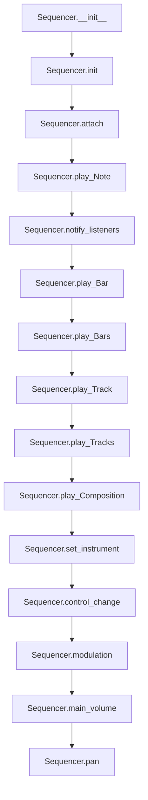

# `sequencer.py`

## `mingus.midi.sequencer.Sequencer` · *class*

## Summary:
A MIDI sequencer that manages playback of musical events and notifies listeners of sequencing activities.

## Description:
The Sequencer class provides a framework for managing MIDI music playback by handling note events, instrument changes, and control messages. It operates as a central hub that coordinates musical events and notifies registered listeners about sequencing activities. The class is designed to be subclassed, with abstract methods that must be implemented by concrete implementations to handle actual MIDI output.

The sequencer supports various musical constructs including individual notes, note containers, bars, tracks, and compositions, making it suitable for complex musical arrangements. It also provides convenience methods for common MIDI control operations like volume adjustment and panning.

## State:
- listeners (list): Collection of listener objects that receive notifications about sequencing events
- output: Placeholder for MIDI output device (currently None, to be implemented by subclasses)
- MSG_* constants (int): Message type identifiers used for listener notifications

## Lifecycle:
- Creation: Instantiate with `Sequencer()` constructor, which initializes empty listeners list and calls `init()`
- Usage: Register listeners with `attach()`, then call playback methods like `play_Note()`, `play_Bar()`, etc.
- Destruction: No explicit cleanup required; relies on Python garbage collection

## Method Map:


## Raises:
- None explicitly raised by __init__
- control_change raises ValueError if control or value is out of valid MIDI range (0-127)

## Example:
```python
# Create sequencer and register listener
seq = Sequencer()
listener = MyListener()
seq.attach(listener)

# Play a note
seq.play_Note("C-4", channel=1, velocity=100)

# Play a bar of music
bar = [[0, 4, NoteContainer(["C-4", "E-4", "G-4"])]]  # Simple chord
seq.play_Bar(bar, channel=1, bpm=120)

# Clean up
seq.detach(listener)
```

### `mingus.midi.sequencer.Sequencer.__init__` · *method*

## Summary:
Initializes a MIDI sequencer instance by setting up an empty listeners list and calling the initialization routine.

## Description:
This method serves as the constructor logic for the Sequencer class, establishing the initial state by creating an empty list for event listeners and invoking the abstract initialization method. The separation into two distinct steps allows subclasses to override the init() method to provide platform-specific MIDI setup while maintaining consistent object initialization. This design enables the sequencer to be extended for different MIDI backends (e.g., FluidSynth, real MIDI hardware) while preserving a common interface.

## Args:
    None

## Returns:
    None

## Raises:
    None

## State Changes:
    Attributes READ: None
    Attributes WRITTEN: 
    - self.listeners: Initialized as an empty list
    - self.output: May be modified by the init() method (implementation-dependent)

## Constraints:
    Preconditions: None
    Postconditions: 
    - self.listeners is initialized as an empty list
    - The init() method is called to perform platform-specific initialization

## Side Effects:
    None

### `mingus.midi.sequencer.Sequencer.init` · *method*

## Summary:
Initializes the sequencer's internal state and prepares it for MIDI event processing.

## Description:
This method serves as the initialization hook for the Sequencer class, providing a placeholder for setup operations that may be extended by subclasses. It is called during the construction of a Sequencer instance through the `__init__` method. The method currently performs no operations but exists to allow for future extension without breaking existing code. This design pattern enables subclasses to override this method to perform custom initialization logic while maintaining compatibility with the base class interface.

## Args:
    self: The instance of the Sequencer class being initialized.

## Returns:
    None: This method does not return any value.

## Raises:
    None: This method does not raise any exceptions.

## State Changes:
    Attributes READ: None
    Attributes WRITTEN: None

## Constraints:
    Preconditions: The method must be called on an instance of the Sequencer class.
    Postconditions: The Sequencer instance is in a valid initial state ready for MIDI operations.

## Side Effects:
    None: This method does not perform any I/O operations or mutate external state.

### `mingus.midi.sequencer.Sequencer.play_event` · *method*

## Summary:
Plays a MIDI note event on the specified channel with the given velocity.

## Description:
This method serves as an abstract interface for triggering MIDI note playback within the sequencer system. It is designed to be implemented by subclasses to provide actual MIDI output functionality. The method accepts note information, channel assignment, and velocity parameters to control playback characteristics.

Known callers and contexts:
- Called by `play_Note()` during individual note playback
- Called by `play_NoteContainer()` when playing containers of notes  
- Called by `play_Bar()` during bar playback
- Called by `play_Track()` during track playback
- Called by `play_Bars()` during multi-bar playback

This method exists as a separate abstraction to decouple the sequencer's high-level playback logic from the specific MIDI implementation details, allowing for different MIDI backends while maintaining consistent interface.

## Args:
    note (int): MIDI note number (0-127) representing the pitch of the note to play
    channel (int): MIDI channel number (0-15) to route the note event
    velocity (int): Note velocity (0-127) controlling the volume/attack of the note

## Returns:
    None: This method does not return any value

## Raises:
    NotImplementedError: When called on the base Sequencer class without a concrete implementation

## State Changes:
    Attributes READ: None
    Attributes WRITTEN: None

## Constraints:
    Preconditions:
        - Note must be within the valid MIDI range (0-127)
        - Channel must be within the valid MIDI channel range (0-15)
        - Velocity must be within the valid MIDI velocity range (0-127)
    Postconditions: None guaranteed

## Side Effects:
    None: This base implementation performs no I/O operations or external service calls

### `mingus.midi.sequencer.Sequencer.stop_event` · *method*

## Summary:
Stops a MIDI note event on a specific channel by sending a note-off message.

## Description:
This method handles the termination of a MIDI note event by sending a note-off message to the specified channel. It is designed to be overridden by subclasses to implement specific MIDI output mechanisms. The method serves as a hook for stopping notes in a sequencer's playback system.

Known callers and contexts:
- `stop_Note()` in the same class: Called during the process of stopping individual notes in the sequencer
- `stop_everything()` in the same class: Called to stop all active notes across all channels  
- `stop_NoteContainer()` in the same class: Called to stop a collection of notes simultaneously
- `play_Bar()` in the same class: Called during playback to stop NoteContainers after they finish playing

This method is separated from the note-stopping logic to allow for flexible MIDI backend implementations. Different sequencer subclasses can implement their own MIDI output mechanisms while maintaining the same interface. The method acts as a pure abstract interface that must be implemented by concrete sequencer classes.

## Args:
    note (int): The MIDI note number to stop (typically 0-127).
    channel (int): The MIDI channel number (typically 0-15).

## Returns:
    None: This method does not return any value.

## Raises:
    NotImplementedError: If the method is not implemented by a subclass.

## State Changes:
    Attributes READ: None
    Attributes WRITTEN: None

## Constraints:
    Preconditions: The note and channel parameters must be within valid MIDI ranges (note: 0-127, channel: 0-15).
    Postconditions: The method should send a note-off message to the MIDI output device for the specified note and channel.

## Side Effects:
    I/O: This method is intended to write MIDI messages to an external MIDI output device or interface.

### `mingus.midi.sequencer.Sequencer.cc_event` · *method*

## Summary:
Handles MIDI control change events for a specific channel, control number, and value.

## Description:
This method processes incoming MIDI control change messages, which are used to modify various parameters of MIDI instruments during playback. It serves as a dedicated handler for control change events within the sequencer's event processing pipeline. The method is called by the `control_change` method after validating the input parameters and notifying listeners. This method is intended to be overridden by subclasses to implement specific control change handling logic.

## Args:
    channel (int): The MIDI channel number (0-15) to which the control change applies.
    control (int): The control number (0-127) specifying which parameter to modify.
    value (int): The control value (0-127) representing the new setting for the parameter.

## Returns:
    None: This method does not return any value.

## Raises:
    None: This method does not explicitly raise any exceptions.

## State Changes:
    Attributes READ: None
    Attributes WRITTEN: None

## Constraints:
    Preconditions: 
    - The channel parameter must be an integer between 0 and 15 inclusive.
    - The control parameter must be an integer between 0 and 127 inclusive.
    - The value parameter must be an integer between 0 and 127 inclusive.
    
    Postconditions: 
    - The method executes without raising exceptions for valid inputs.
    - No changes are made to the sequencer's internal state.

## Side Effects:
    None: This method does not perform any I/O operations or mutate external objects.

### `mingus.midi.sequencer.Sequencer.instr_event` · *method*

## Summary:
Configures a MIDI channel with a specific instrument and bank by sending a program change message.

## Description:
This method implements the MIDI protocol for setting an instrument on a specific channel. It is called by `set_instrument()` to configure MIDI channels with particular instruments and banks. As a placeholder method, it should be overridden in subclasses to actually send MIDI program change messages to the output device. This method forms the foundation of instrument management in the MIDI sequencer system.

## Args:
    channel (int): The MIDI channel number (0-15) to configure.
    instr (int): The instrument number (0-127) to assign to the channel.
    bank (int): The bank number (0-127) to use for the instrument.

## Returns:
    None: This method does not return any value.

## Raises:
    None: This method does not explicitly raise any exceptions.

## State Changes:
    Attributes READ: None
    Attributes WRITTEN: None

## Constraints:
    Preconditions: 
    - Channel must be an integer between 0 and 15 inclusive.
    - Instrument must be an integer between 0 and 127 inclusive.
    - Bank must be an integer between 0 and 127 inclusive.
    
    Postconditions: 
    - The specified MIDI channel will be configured with the given instrument and bank settings.
    - No changes are made to the Sequencer's internal state beyond sending the MIDI event.

## Side Effects:
    - Sends a MIDI program change message to the underlying MIDI output device.
    - May cause I/O operations to communicate with the MIDI hardware or software synthesizer.

### `mingus.midi.sequencer.Sequencer.sleep` · *method*

## Summary:
Pauses execution for a specified duration without blocking the sequencer's operation.

## Description:
The sleep method introduces a time delay in the sequencer's execution flow. It is designed to allow the sequencer to pause for a given number of seconds while maintaining its operational state. This method serves as a timing control mechanism within the MIDI sequencing process, enabling precise scheduling of musical events.

Known callers:
- play_Bar: Called when waiting between musical notes to maintain proper timing
- play_Bars: Called during playback of multiple bars to synchronize note durations
- play_Track: Called when transitioning between bars in a musical track
- play_Tracks: Called during multi-track playback to coordinate timing across tracks

This method exists as a separate component because it encapsulates the timing logic needed for precise musical sequencing, allowing the sequencer to maintain synchronization without blocking other operations.

## Args:
    seconds (float): Number of seconds to pause execution. Must be non-negative.

## Returns:
    None: This method does not return any value.

## Raises:
    None: This method does not explicitly raise any exceptions.

## State Changes:
    Attributes READ: None
    Attributes WRITTEN: None

## Constraints:
    Preconditions: The seconds argument must be a non-negative number.
    Postconditions: Execution will be paused for the specified duration, but the sequencer object remains in a valid state.

## Side Effects:
    I/O: May involve system-level sleep operations that temporarily suspend thread execution.

### `mingus.midi.sequencer.Sequencer.attach` · *method*

## Summary:
Registers a new listener to the sequencer's notification system, ensuring no duplicate registrations.

## Description:
This method adds a listener to the sequencer's list of observers, enabling the listener to receive notifications when sequencing events occur. It prevents duplicate listener registrations by checking if the listener is already present in the listeners collection before appending it.

Known callers:
- The method is likely called during the setup phase of sequencer usage, when components need to subscribe to sequencing events
- It may be called by various UI components, logging systems, or debugging tools that want to monitor sequencer activity

This logic is encapsulated in its own method rather than being inlined because it provides a clean abstraction for managing the listener registry and ensures consistent duplicate prevention behavior across all registration operations.

## Args:
    listener: The object to register as a listener. Must be comparable with existing listeners in the self.listeners collection.

## Returns:
    None

## Raises:
    None explicitly raised

## State Changes:
    - Attributes READ: self.listeners
    - Attributes WRITTEN: self.listeners

## Constraints:
    - Preconditions: The sequencer instance must have a listeners attribute that supports the 'in' operator and append method.
    - Postconditions: The listener will be added to the end of self.listeners if it was not already present.

## Side Effects:
    None

### `mingus.midi.sequencer.Sequencer.detach` · *method*

## Summary:
Removes a listener from the sequencer's listeners collection if it exists.

## Description:
This method removes a specified listener from the sequencer's internal listeners list. It is used to unregister listeners that no longer wish to receive notifications from the sequencer. This method provides a clean way to manage the sequencer's notification system by allowing listeners to be properly detached.

## Args:
    listener: The listener object to be removed from the sequencer's listeners collection. This object must be comparable with items in the self.listeners collection.

## Returns:
    None

## Raises:
    None

## State Changes:
    Attributes READ: self.listeners
    Attributes WRITTEN: self.listeners

## Constraints:
    Preconditions: The listener must be an object that can be compared with items in self.listeners, and self.listeners must support the 'in' operator and remove() method.
    Postconditions: If the listener was present in self.listeners, it will be removed after the method call. If the listener was not present, self.listeners remains unchanged.

## Side Effects:
    None

### `mingus.midi.sequencer.Sequencer.notify_listeners` · *method*

## Summary:
Notifies all registered listeners with a message type and parameters.

## Description:
This method broadcasts messages to all registered listeners in the sequencer system. It is used throughout the sequencer to inform listeners about various events such as note playback, instrument changes, and control changes. The method serves as a core event notification mechanism that enables loose coupling between different components of the MIDI sequencing system.

Known callers and contexts:
- Called in set_instrument() when an instrument is changed
- Called in control_change() when a control change event occurs  
- Called in play_Note() when a note is played
- Called in stop_Note() when a note is stopped
- Called in play_NoteContainer(), stop_NoteContainer(), play_Bar(), play_Bars(), play_Track(), play_Tracks(), and play_Composition() for various sequence events

This method exists as a separate utility to avoid code duplication and provide a centralized way to notify all listeners about sequencer events.

## Args:
    msg_type (int): The type of message to broadcast to listeners (defined as class constants)
    params (dict): Additional parameters to pass along with the message

## Returns:
    None

## Raises:
    None explicitly raised

## State Changes:
    Attributes READ: self.listeners
    Attributes WRITTEN: None

## Constraints:
    Preconditions: 
    - self.listeners must be iterable
    - Each item in self.listeners must have a notify method
    Postconditions: 
    - All listeners will have their notify method called with the provided arguments

## Side Effects:
    None

### `mingus.midi.sequencer.Sequencer.set_instrument` · *method*

## Summary:
Configures a MIDI channel with a specific instrument and bank, then notifies listeners of the change.

## Description:
This method sets the instrument for a given MIDI channel by invoking the sequencer's instrument event handler and broadcasting the change to all registered listeners. It serves as the primary interface for dynamically changing instruments during MIDI sequence playback. The method is typically called during sequence processing when instrument change events occur, ensuring that both the sequencer's internal state and external listeners are properly updated.

Known callers and context:
- Called by higher-level sequencer methods when instrument changes are requested
- Part of the standard MIDI event processing pipeline for instrument management

This method exists as a separate utility to avoid code duplication and provide a centralized way to handle instrument changes while maintaining proper event notification to all interested parties.

## Args:
    channel (int): The MIDI channel number (0-15) to configure.
    instr (int): The instrument number (0-127) to assign to the channel.
    bank (int): The bank number (0-127) to use for the instrument. Defaults to 0.

## Returns:
    None: This method does not return any value.

## Raises:
    None: This method does not explicitly raise any exceptions.

## State Changes:
    Attributes READ: None
    Attributes WRITTEN: None

## Constraints:
    Preconditions:
    - Channel must be an integer between 0 and 15 inclusive.
    - Instrument must be an integer between 0 and 127 inclusive.
    - Bank must be an integer between 0 and 127 inclusive.
    
    Postconditions:
    - The specified MIDI channel will be configured with the given instrument and bank settings.
    - All registered listeners will be notified of the instrument change event.

## Side Effects:
    - Invokes the sequencer's instrument event handler to send MIDI program change messages.
    - Calls notify_listeners() to broadcast the instrument change to all registered listeners.

### `mingus.midi.sequencer.Sequencer.control_change` · *method*

## Summary:
Configures a MIDI control change message with specified channel, control number, and value, notifying listeners of the change.

## Description:
This method sends a MIDI control change message to the specified channel with the given control number and value. It validates that both control and value parameters are within the valid MIDI range (0-128) and then dispatches the event to the sequencer's event handler and notifies all registered listeners. This method is the core implementation for MIDI control change operations and is also used by convenience methods like modulation(), main_volume(), and pan().

## Args:
    channel (int): The MIDI channel number (typically 0-15) to send the control change on.
    control (int): The control number to change (must be between 0 and 128 inclusive). Common controls include 1 (modulation), 7 (main volume), and 10 (pan).
    value (int): The value to set for the control (must be between 0 and 128 inclusive).

## Returns:
    bool: True if the control change was successfully processed, False if validation failed due to invalid control or value parameters.

## Raises:
    None explicitly raised, though invalid parameters cause early return with False.

## State Changes:
    Attributes READ: None
    Attributes WRITTEN: None

## Constraints:
    Preconditions: 
    - Control parameter must be in range [0, 128]
    - Value parameter must be in range [0, 128]
    Postconditions:
    - If validation passes, the control change is dispatched via cc_event() and listeners are notified
    - If validation fails, the method returns False without side effects

## Side Effects:
    - Calls self.cc_event() to process the MIDI control change
    - Calls self.notify_listeners() to broadcast the control change event to registered listeners

### `mingus.midi.sequencer.Sequencer.play_Note` · *method*

## Summary:
Plays a musical note by converting note values, sending MIDI events, and notifying listeners of playback.

## Description:
This method handles the playback of a single musical note by processing note properties, converting note values to MIDI format, and triggering MIDI events. It serves as the core interface for note playback within the sequencer system, ensuring proper MIDI communication and listener notifications. The method supports both integer note values and note objects with embedded properties.

## Args:
    note (int or object): The musical note to play, either as an integer pitch value or an object with note properties (e.g., velocity, channel)
    channel (int): MIDI channel number (default: 1)
    velocity (int): Note velocity (default: 100)

## Returns:
    bool: Always returns True to indicate successful processing

## Raises:
    None explicitly raised

## State Changes:
    Attributes READ: self.MSG_PLAY_INT, self.MSG_PLAY_NOTE, self.play_event, self.notify_listeners
    Attributes WRITTEN: None

## Constraints:
    Preconditions: The note parameter must be convertible to an integer, and channel/velocity must be convertible to integers
    Postconditions: The note is played via MIDI event, and listeners are notified twice with different message formats:
        - Once with MSG_PLAY_INT containing the note value offset by 12 (MIDI pitch conversion)
        - Once with MSG_PLAY_NOTE containing the original note value

## Side Effects:
    I/O: Calls self.play_event() to send MIDI events with converted note value (note + 12)
    External service calls: Calls self.notify_listeners() twice to update registered listeners with different message formats

### `mingus.midi.sequencer.Sequencer.stop_Note` · *method*

## Summary:
Stops a MIDI note event and notifies listeners of the stop event with both integer and note-based representations.

## Description:
This method handles the stopping of a MIDI note by sending a note-off event to the sequencer's backend and notifying all registered listeners about the stop event. It processes the note parameter to extract channel information if the note object has a channel attribute, converts the note to its MIDI integer representation (adding 12 to the note value), and then triggers the appropriate stop events.

Known callers and contexts:
- Called in Sequencer.stop_NoteContainer() when stopping a container of notes
- Called in Sequencer.stop_everything() when stopping all active notes
- Called in Sequencer.play_Bar() when stopping NoteContainers after playback
- Called directly by user code when stopping individual notes

This method exists as a separate implementation to encapsulate the complete note stopping logic including both the backend event triggering and listener notification, providing a clean interface for stopping MIDI notes while maintaining proper event propagation throughout the system.

## Args:
    note (int or object): The MIDI note to stop, either as an integer representing the note number or as an object with note and optionally channel attributes
    channel (int): The MIDI channel number to stop the note on (defaults to 1)

## Returns:
    bool: Always returns True to indicate successful completion of the stop operation

## Raises:
    None explicitly raised

## State Changes:
    Attributes READ: None
    Attributes WRITTEN: None

## Constraints:
    Preconditions:
    - The note parameter must be convertible to an integer
    - The channel parameter must be convertible to an integer
    - The sequencer must have a valid stop_event method implemented
    - The sequencer must have a valid notify_listeners method implemented
    
    Postconditions:
    - A note-off event is sent to the sequencer backend via stop_event
    - Two listener notifications are sent: one with integer note representation and one with original note representation
    - The method returns True

## Side Effects:
    - Calls the sequencer's stop_event method to send MIDI note-off commands
    - Calls notify_listeners twice to broadcast stop events to registered listeners
    - May cause audio output to stop for the specified note and channel

### `mingus.midi.sequencer.Sequencer.stop_everything` · *method*

## Summary:
Stops all MIDI notes across all possible note numbers and channels in the sequencer.

## Description:
This method systematically terminates all active MIDI notes by calling stop_Note for every combination of note number (0-117) and channel (0-15). It is typically invoked during system shutdown, reset operations, or when clearing all active note events to prevent stuck notes. The method ensures a clean state by stopping all possible note/channel combinations, regardless of whether notes were actually playing.

## Args:
    None

## Returns:
    None

## Raises:
    None

## State Changes:
    Attributes READ: None
    Attributes WRITTEN: None

## Constraints:
    Preconditions: The sequencer instance must be properly initialized and have a valid stop_Note method implementation.
    Postconditions: All MIDI note events across all 118 note numbers and 16 channels are stopped.

## Side Effects:
    I/O: Invokes the stop_Note method 1888 times (118 × 16), which likely communicates with MIDI hardware or software synthesizers to terminate note events.

### `mingus.midi.sequencer.Sequencer.play_NoteContainer` · *method*

## Summary:
Plays all notes contained within a NoteContainer object through MIDI events.

## Description:
This method iterates over all notes in a NoteContainer and plays them sequentially using the existing play_Note method. It serves as a bridge between container-based note management and individual note playback, enabling batch processing of musical notes. The method notifies attached listeners of the playback event before processing.

## Args:
    nc (NoteContainer): Container holding multiple notes to be played. Can be None.
    channel (int): MIDI channel number to play the notes on. Defaults to 1.
    velocity (int): Velocity value for note playback. Defaults to 100.

## Returns:
    bool: True if all notes were successfully played, False if any note playback failed.

## Raises:
    None explicitly raised.

## State Changes:
    Attributes READ: self.MSG_PLAY_NC, self.listeners
    Attributes WRITTEN: None directly modified.

## Constraints:
    Preconditions: The Sequencer instance must be properly initialized and connected to MIDI output.
    Postconditions: All notes in the container will be sent as MIDI events via play_Note method calls.

## Side Effects:
    I/O: Triggers MIDI output through play_event method calls.
    External service calls: Notifies attached listeners of playback events via notify_listeners method.

### `mingus.midi.sequencer.Sequencer.stop_NoteContainer` · *method*

## Summary:
Stops a container of notes by sending stop signals to each note and notifying listeners.

## Description:
This method handles stopping a collection of musical notes represented as a NoteContainer. It notifies attached listeners of the stop operation and iterates through each note in the container, stopping them individually via the stop_Note method. When the NoteContainer is None, it returns immediately with True. This approach allows for proper cleanup of multiple notes while maintaining the sequencer's event notification system.

The method is separated from inline logic to provide a clean interface for stopping note collections and to ensure consistent listener notifications across different stop operations.

## Args:
    nc (NoteContainer or None): Container of notes to stop, or None to return immediately
    channel (int): MIDI channel number to use for stopping notes, defaults to 1

## Returns:
    bool: True if the operation completes successfully (either nc is None or all notes are stopped), False if any individual note stop fails

## Raises:
    None explicitly raised

## State Changes:
    Attributes READ: self.listeners, self.MSG_STOP_NC
    Attributes WRITTEN: None

## Constraints:
    Preconditions: The sequencer instance must be properly initialized and have a valid MSG_STOP_NC constant
    Postconditions: All notes in the container are stopped via individual stop_Note calls, and listeners are notified

## Side Effects:
    I/O: Calls notify_listeners to communicate with attached listeners
    External service calls: None
    Mutations to objects outside self: None

### `mingus.midi.sequencer.Sequencer.play_Bar` · *method*

## Summary:
Plays a musical bar by sequentially processing its note containers with appropriate timing and channel assignment.

## Description:
This method orchestrates the playback of a musical bar by iterating through its note containers, playing each one with specified timing and channel settings. It handles dynamic BPM changes within the bar and manages the timing between notes using sleep intervals. The method notifies listeners about playback events and manages the complete lifecycle of each note container from start to finish.

Known callers and contexts:
- Called in play_Bars() when processing multiple bars sequentially
- Called in play_Track() when playing a track containing bars
- Called in play_Composition() when playing a composition with bars

This logic is separated into its own method to encapsulate the complex timing and playback management for a single bar, making it reusable across different playback contexts while maintaining clean separation of concerns.

## Args:
    bar (object): A collection of note containers representing musical bars
    channel (int): MIDI channel number to play the notes on (default: 1)
    bpm (int): Beats per minute for the playback timing (default: 120)

## Returns:
    dict: Contains the final BPM value after processing the bar

## Raises:
    None explicitly raised

## State Changes:
    Attributes READ: self.MSG_PLAY_BAR, self.MSG_SLEEP, self.listeners
    Attributes WRITTEN: None

## Constraints:
    Preconditions:
    - The bar parameter must be iterable containing note containers
    - Each note container in the bar must be compatible with play_NoteContainer and stop_NoteContainer methods
    - Channel must be a valid MIDI channel number
    - BPM must be a positive number

    Postconditions:
    - All note containers in the bar are played with appropriate timing
    - The final BPM value reflects any dynamic changes made during playback
    - Listeners are notified of playback events

## Side Effects:
    I/O: Calls sleep() method which may involve audio recording or timing delays
    External service calls: Invokes play_NoteContainer, stop_NoteContainer, and notify_listeners methods
    Mutations: Modifies the internal state of listeners through notifications

### `mingus.midi.sequencer.Sequencer.play_Bars` · *method*

## Summary:
Plays multiple musical bars sequentially with precise timing control and dynamic BPM adjustment.

## Description:
This method orchestrates the playback of multiple musical bars (sequences of NoteContainers) with synchronized timing across different channels. It handles the complex scheduling of musical events, manages dynamic tempo changes, and ensures proper cleanup of playing notes. The method processes bars in chronological order, playing notes at their designated start times while maintaining precise timing intervals.

Known callers and contexts:
- This method is typically called internally by higher-level sequencing methods like play_Tracks() or play_Composition() as part of the MIDI playback pipeline
- It operates at the core sequencing level where multiple independent musical sequences need to be coordinated

This logic is separated into its own method because it encapsulates the complex timing and synchronization logic required for playing multiple concurrent musical sequences with proper temporal coordination and dynamic tempo handling.

## Args:
    bars (list): List of NoteContainer objects representing musical bars to play
    channels (list): List of MIDI channels corresponding to each bar
    bpm (int): Initial beats per minute for playback, defaults to 120

## Returns:
    dict: Dictionary containing the final BPM value after playback completes

## Raises:
    None explicitly raised

## State Changes:
    Attributes READ: self.MSG_PLAY_BARS, self.MSG_SLEEP
    Attributes WRITTEN: None directly modified

## Constraints:
    Preconditions:
    - bars must be a list of NoteContainer objects with valid timing data
    - channels must be a list of integers matching the length of bars
    - Each NoteContainer in bars must have valid note timing data
    - Bars must have a length attribute indicating their duration
    
    Postconditions:
    - All notes in the provided bars will be played according to their timing
    - The final BPM value reflects any tempo changes that occurred during playback
    - All playing notes are properly stopped at completion

## Side Effects:
    I/O: Calls notify_listeners() to broadcast playback events
    External service calls: Calls play_NoteContainer(), stop_NoteContainer(), and sleep() methods
    Mutations: Modifies internal state through method calls to play/stop note containers

### `mingus.midi.sequencer.Sequencer.play_Track` · *method*

## Summary:
Plays a sequence of musical bars from a track, updating tempo as needed and notifying listeners of playback events.

## Description:
This method iterates through each bar in a given track and plays them sequentially using the `play_Bar` method. It handles tempo changes by updating the BPM value from the result of each bar playback. The method notifies attached listeners before starting playback and after completing each bar. This approach allows for proper sequencing of musical bars while maintaining tempo consistency and providing event notifications for external systems.

The method is designed to process a track (a sequence of musical bars) and execute each bar in order, making it suitable for sequential music playback. When a bar returns an empty dictionary (indicating an error or interruption), the method terminates early and returns an empty dictionary.

## Args:
    track: An iterable sequence of musical bars to be played.
    channel: MIDI channel number to use for playback. Defaults to 1.
    bpm: Initial beats per minute for playback. Defaults to 120.

## Returns:
    dict: A dictionary containing the final BPM value after processing all bars, or an empty dict if playback was interrupted or failed.

## Raises:
    None explicitly raised, but may propagate exceptions from underlying methods like `play_Bar`.

## State Changes:
    Attributes READ: self.MSG_PLAY_TRACK, self.listeners
    Attributes WRITTEN: None directly modified, but indirectly affects playback state through method calls

## Constraints:
    Preconditions: 
    - The track parameter must be iterable containing musical bars compatible with `play_Bar`
    - Each bar in the track must be compatible with the `play_Bar` method
    - Channel must be a valid MIDI channel number
    - BPM must be a positive numeric value
    
    Postconditions:
    - All bars in the track are played sequentially
    - Tempo updates are properly propagated through the playback chain
    - Listener notifications are sent for each playback event

## Side Effects:
    - Calls `notify_listeners` to broadcast playback events with message type MSG_PLAY_TRACK
    - Invokes `play_Bar` for each bar in the track
    - May modify global playback state through MIDI events
    - May cause delays via `sleep` calls during playback

### `mingus.midi.sequencer.Sequencer.play_Tracks` · *method*

## Summary:
Plays multiple musical tracks concurrently with instrument configuration and dynamic BPM handling.

## Description:
This method orchestrates the playback of multiple musical tracks by configuring instruments on specified MIDI channels and playing each bar sequentially. It coordinates the playback of multiple independent musical sequences with proper timing and handles dynamic tempo adjustments during playback. The method serves as a central coordination point for multi-track MIDI sequencing operations.

Known callers and contexts:
- Called by higher-level sequencing methods in the MIDI playback pipeline
- Used as part of the composition playback workflow when multiple tracks need simultaneous execution
- Invoked during complex musical sequence processing where multiple concurrent sequences must be managed

This logic is separated into its own method because it encapsulates the complex coordination required for playing multiple tracks simultaneously, including instrument initialization, bar-by-bar playback, and dynamic tempo management.

## Args:
    tracks (list): List of musical track objects to play, each containing note data
    channels (list): List of MIDI channels corresponding to each track
    bpm (int): Initial beats per minute for playback, defaults to 120

## Returns:
    dict: Dictionary containing the final BPM value after playback completes, or empty dict if playback interrupted

## Raises:
    None explicitly raised

## State Changes:
    Attributes READ: self.MSG_PLAY_TRACKS, self.listeners
    Attributes WRITTEN: None directly modified

## Constraints:
    Preconditions:
    - tracks must be a list of track objects with valid instrument and bar data
    - channels must be a list of integers matching the length of tracks
    - tracks must have compatible lengths (all tracks should have the same number of bars)
    - tracks[0] must have a valid length attribute indicating the number of bars
    
    Postconditions:
    - All tracks will be played sequentially with proper instrument setup
    - Instrument settings will be applied to corresponding channels
    - Playback will continue until all bars are processed or interruption occurs

## Side Effects:
    I/O: Calls notify_listeners() to broadcast playback events
    External service calls: Calls set_instrument() and play_Bars() methods
    Mutations: Modifies internal state through method calls to set instruments and play bars

### `mingus.midi.sequencer.Sequencer.play_Composition` · *method*

## Summary:
Plays a musical composition by notifying listeners and delegating track playback to the sequencer's track-playing mechanism.

## Description:
This method serves as the primary entry point for initiating playback of a complete musical composition. It notifies registered listeners about the upcoming composition playback, handles automatic channel assignment when none are specified, and delegates the actual playback process to the `play_Tracks` method. The method orchestrates the playback flow by preparing the necessary parameters and passing them down to lower-level playback functions.

The method is designed to be a high-level interface that coordinates the playback of a complete composition, making it easier for external systems to initiate playback without needing to manage the low-level details of channel assignment or track iteration.

## Args:
    composition (Composition): The musical composition object containing tracks to be played.
    channels (list[int], optional): List of MIDI channel numbers to assign to each track. If None, automatically assigns channels starting from 1. Defaults to None.
    bpm (int, optional): Beats per minute for playback speed. Defaults to 120.

## Returns:
    dict: A dictionary containing the final BPM value after playback completes, or an empty dictionary if playback was interrupted. The returned dictionary has the structure {"bpm": int} or {}.

## Raises:
    None: This method does not explicitly raise exceptions, though underlying methods may raise exceptions.

## State Changes:
    Attributes READ: None
    Attributes WRITTEN: None

## Constraints:
    Preconditions:
        - The composition object must contain valid tracks.
        - If channels are provided, they must correspond to the number of tracks in the composition.
        - The composition must have at least one track.
        
    Postconditions:
        - Listeners are notified about the composition playback initiation via MSG_PLAY_COMPOSITION event.
        - Tracks are played sequentially using the specified or auto-assigned channels.
        - The playback process continues until all bars in the composition are played.

## Side Effects:
    - Notifies registered listeners about composition playback using MSG_PLAY_COMPOSITION event.
    - May cause I/O operations through the MIDI output device.
    - Invokes the `play_Tracks` method which may involve further MIDI communication.
    - Sets up MIDI channels for instrument configuration during playback.

### `mingus.midi.sequencer.Sequencer.modulation` · *method*

## Summary:
Sets the modulation value for a specified MIDI channel by sending a control change message.

## Description:
This method configures the modulation parameter for a given MIDI channel using MIDI control change message number 1. It serves as a convenience wrapper around the general control_change method, specifically targeting modulation control. The method is typically called during MIDI sequence playback or configuration to adjust the modulation depth of instruments.

## Args:
    channel (int): The MIDI channel number (typically 0-15) to send the modulation change on.
    value (int): The modulation value to set (must be between 0 and 128 inclusive).

## Returns:
    bool: True if the modulation change was successfully processed, False if validation failed due to invalid value parameter.

## Raises:
    None explicitly raised, though invalid parameters cause early return with False.

## State Changes:
    Attributes READ: None
    Attributes WRITTEN: None

## Constraints:
    Preconditions: 
    - Value parameter must be in range [0, 128]
    Postconditions:
    - If validation passes, the modulation control change is dispatched via control_change() and listeners are notified
    - If validation fails, the method returns False without side effects

## Side Effects:
    - Calls self.control_change() which in turn calls self.cc_event() to process the MIDI control change
    - Calls self.notify_listeners() to broadcast the modulation change event to registered listeners

### `mingus.midi.sequencer.Sequencer.main_volume` · *method*

## Summary:
Sets the main volume (channel volume) for a specified MIDI channel using MIDI control change message 7.

## Description:
This method configures the main volume level for a given MIDI channel by sending a MIDI control change message with control number 7. It serves as a convenience wrapper around the general control_change method, specifically for volume manipulation. The method delegates to control_change with fixed control number 7, making it easier to adjust volume without remembering the specific MIDI control number.

## Args:
    channel (int): The MIDI channel number (typically 0-15) to set the volume for.
    value (int): The volume level to set (must be between 0 and 128 inclusive).

## Returns:
    bool: True if the volume change was successfully processed, False if validation failed due to invalid parameters.

## Raises:
    None explicitly raised, though invalid parameters cause early return with False.

## State Changes:
    Attributes READ: None
    Attributes WRITTEN: None

## Constraints:
    Preconditions: 
    - Channel parameter must be a valid MIDI channel (typically 0-15)
    - Value parameter must be in range [0, 128]
    Postconditions:
    - If validation passes, the volume change is dispatched via control_change() and listeners are notified
    - If validation fails, the method returns False without side effects

## Side Effects:
    - Calls self.control_change() which internally calls self.cc_event() to process the MIDI control change
    - Calls self.notify_listeners() to broadcast the volume change event to registered listeners

### `mingus.midi.sequencer.Sequencer.pan` · *method*

## Summary:
Sets the pan position for a specified MIDI channel by sending a control change message with control number 10.

## Description:
This method configures the stereo pan position for a MIDI channel using MIDI control change number 10, which is the standard MIDI pan control. It serves as a convenience wrapper around the general control_change method, specifically designed for pan adjustments. The method delegates to control_change with fixed control number 10, making it easier to set pan positions without remembering the specific MIDI control number.

## Args:
    channel (int): The MIDI channel number (typically 0-15) to set the pan for.
    value (int): The pan position value (typically 0-127, where 0 = hard left, 64 = center, 127 = hard right). Must be within the valid MIDI range [0, 128].

## Returns:
    bool: True if the pan control change was successfully processed, False if validation failed due to invalid parameters.

## Raises:
    None explicitly raised, though invalid parameters cause early return with False.

## State Changes:
    Attributes READ: None
    Attributes WRITTEN: None

## Constraints:
    Preconditions: 
    - Channel parameter must be a valid MIDI channel number
    - Value parameter must be in range [0, 128] (inclusive)
    Postconditions:
    - If validation passes, the pan control change is dispatched via control_change() and listeners are notified
    - If validation fails, the method returns False without side effects

## Side Effects:
    - Calls self.control_change() which in turn calls self.cc_event() to process the MIDI control change
    - Calls self.notify_listeners() to broadcast the pan change event to registered listeners

