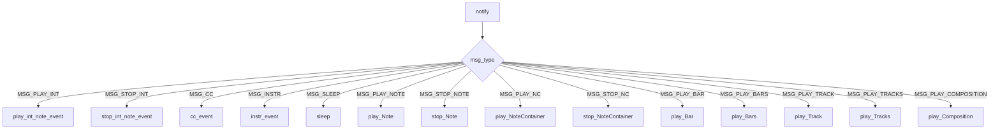

# `sequencer_observer.py`

## `mingus.midi.sequencer_observer.SequencerObserver` · *class*

## Summary:
A base class for observing and responding to MIDI sequencing events in the mingus library.

## Description:
The SequencerObserver class serves as an abstract interface for objects that wish to monitor and react to MIDI sequencing activities. It defines a set of callback methods that are invoked when various MIDI events occur during playback, allowing observers to implement custom behavior in response to musical events such as note playing, stopping, instrument changes, and timing controls.

This class is designed to be subclassed by concrete implementations that provide actual MIDI output or logging functionality. The notify method acts as a dispatcher that routes incoming sequencing messages to the appropriate callback methods based on message type. Observers are notified by a Sequencer instance through the notify method, which is called internally by the sequencer when events occur.

## State:
- No instance attributes maintained by this class
- All state is managed by subclasses that implement the callback methods

## Lifecycle:
- Creation: Instantiate directly or through subclassing
- Usage: Register with a Sequencer instance via attach() method to receive notifications
- Destruction: Cleanup handled by Python garbage collection

## Method Map:


## Raises:
- None explicitly raised by __init__
- The notify method itself does not raise exceptions; it simply dispatches to callback methods

## Example:
```python
class MyMIDIPlayer(SequencerObserver):
    def play_int_note_event(self, int_note, channel, velocity):
        print(f"Playing note {int_note} on channel {channel} with velocity {velocity}")
    
    def stop_int_note_event(self, int_note, channel):
        print(f"Stopping note {int_note} on channel {channel}")

# Usage
player = MyMIDIPlayer()
sequencer = Sequencer()
sequencer.attach(player)
sequencer.play_Note("C-4", channel=1, velocity=100)
```

### `mingus.midi.sequencer_observer.SequencerObserver.play_int_note_event` · *method*

## Summary:
Handles the playback of a MIDI note event using integer note representation, channel, and velocity parameters.

## Description:
This method serves as an abstract interface for playing MIDI note events in integer note format. It is designed to be implemented by concrete subclasses of SequencerObserver to provide actual MIDI output functionality. The method is invoked by the sequencer's notification system when a MSG_PLAY_INT message is received, typically as part of a larger musical sequence or direct note playback operation.

Known callers and context:
- Called from Sequencer.notify() when a MSG_PLAY_INT message is processed
- Part of the observer pattern implementation where the sequencer notifies listeners of events
- Used internally by the sequencer's event routing system for integer note events

This method exists as a separate interface to enable polymorphic behavior in MIDI event handling, allowing different implementations to define how integer note events should be played while maintaining a consistent API.

## Args:
    int_note (int): Integer representation of the MIDI note (0-127)
    channel (int): MIDI channel number (0-15)
    velocity (int): Note velocity (0-127)

## Returns:
    None

## Raises:
    None explicitly raised

## State Changes:
    Attributes READ: None
    Attributes WRITTEN: None

## Constraints:
    Preconditions:
    - int_note must be in the range [0, 127] (valid MIDI note numbers)
    - channel must be in the range [0, 15] (valid MIDI channels)
    - velocity must be in the range [0, 127] (valid MIDI velocities)
    Postconditions: 
    - The note should be played via the underlying MIDI output implementation
    - No state changes occur on the SequencerObserver object itself

## Side Effects:
    None

### `mingus.midi.sequencer_observer.SequencerObserver.stop_int_note_event` · *method*

## Summary:
Abstract method to stop a previously played MIDI note event by notifying registered observers.

## Description:
This method serves as an abstract interface for stopping MIDI note events in integer note format. It is designed to be implemented by concrete subclasses of SequencerObserver to provide actual MIDI output functionality for stopping notes. The method is invoked by the sequencer's notification system when a MSG_STOP_INT message is received, typically as part of a larger musical sequence or direct note stopping operation.

Known callers and context:
- Called from Sequencer.notify() when a MSG_STOP_INT message is processed
- Part of the observer pattern implementation where the sequencer notifies listeners of events
- Used internally by the sequencer's event routing system for integer note stopping events

This method exists as a separate interface to enable polymorphic behavior in MIDI event handling, allowing different implementations to define how integer note events should be stopped while maintaining a consistent API.

## Args:
    int_note (int): The MIDI note number to stop (0-127)
    channel (int): The MIDI channel number (0-15)

## Returns:
    None: This method does not return any value

## Raises:
    NotImplementedError: This is an abstract method that must be implemented by subclasses

## State Changes:
    Attributes READ: None
    Attributes WRITTEN: None

## Constraints:
    Preconditions: 
    - int_note must be within the valid MIDI note range (0-127)
    - channel must be within the valid MIDI channel range (0-15)
    
    Postconditions: 
    - The method should stop the specified note via the underlying MIDI output implementation
    - No state changes occur on the SequencerObserver instance

## Side Effects:
    None: This method performs no I/O operations or external service calls

### `mingus.midi.sequencer_observer.SequencerObserver.cc_event` · *method*

## Summary:
Processes MIDI control change events received from the sequencer.

## Description:
This method handles MIDI control change messages that occur during music playback. It is invoked by the sequencer's notification system when a MSG_CC event is detected, allowing observers to respond to real-time MIDI controller inputs such as volume, pan, or modulation changes. As an abstract callback method, it is intended to be overridden by concrete implementations to provide specific handling for different control change scenarios.

The method follows the observer pattern, where the sequencer notifies registered listeners of various musical events. This particular method specifically handles control change events, which are fundamental to dynamic musical expression and real-time parameter manipulation in MIDI applications.

## Args:
    channel (int): MIDI channel number (typically 0-15)
    control (int): Control change number (typically 0-127)
    value (int): Control value (typically 0-127)

## Returns:
    None: This method does not return any value

## Raises:
    None: This method does not explicitly raise exceptions

## State Changes:
    Attributes READ: None
    Attributes WRITTEN: None

## Constraints:
    Preconditions: 
    - Channel must be a valid MIDI channel number (typically 0-15)
    - Control must be a valid MIDI control number (typically 0-127)
    - Value must be a valid MIDI control value (typically 0-127)
    
    Postconditions: 
    - The method completes execution without errors
    - No modifications are made to the observer's state

## Side Effects:
    None: This method performs no I/O operations or external service calls

### `mingus.midi.sequencer_observer.SequencerObserver.instr_event` · *method*

## Summary:
Handles instrument change events received from the MIDI sequencer by notifying registered listeners.

## Description:
This method processes instrument change events that occur during MIDI playback. It is invoked by the sequencer's notification system when an instrument change message is received, allowing listeners to respond appropriately to instrument modifications. The method serves as a bridge between the sequencer's internal event processing and the observer pattern implementation.

Known callers and contexts:
- Called from Sequencer.notify_listeners() when a MSG_INSTR message is processed
- Invoked during playback when instrument changes occur in the musical sequence
- Part of the standard observer pattern implementation for MIDI sequencing events

This logic is separated into its own method to maintain clean separation of concerns and allow for easy extension or modification of instrument change handling behavior without affecting other event types.

## Args:
    channel (int): The MIDI channel number where the instrument change occurs
    instr (int): The instrument number to change to
    bank (int): The bank number for the instrument change

## Returns:
    None

## Raises:
    None explicitly raised

## State Changes:
    Attributes READ: None
    Attributes WRITTEN: None

## Constraints:
    Preconditions:
    - channel must be a valid MIDI channel number
    - instr must be a valid MIDI instrument number
    - bank must be a valid MIDI bank number
    
    Postconditions:
    - No state changes occur on the SequencerObserver instance itself

## Side Effects:
    None

### `mingus.midi.sequencer_observer.SequencerObserver.sleep` · *method*

## Summary:
Pauses execution for a specified number of seconds, allowing for timing control in MIDI sequencing operations.

## Description:
The sleep method is part of the SequencerObserver interface and is invoked by the sequencer when a sleep message is received. This method serves as a placeholder that must be implemented by concrete subclasses to provide actual sleep functionality, such as using Python's time.sleep() or similar timing mechanisms.

In the notification flow, when the sequencer processes a sleep command (MSG_SLEEP), it calls this method on all registered observers. The method is designed to be overridden by implementing classes to provide appropriate timing behavior for MIDI sequencing operations.

This method is part of the observer pattern implementation where the sequencer notifies registered listeners about various sequencing events, including timing pauses. The sleep functionality allows for precise control over musical timing and sequencing.

## Args:
    seconds (float): Number of seconds to pause execution. Should be a non-negative numeric value representing the duration of the delay.

## Returns:
    None: This method does not return any value.

## Raises:
    None: This method currently does not raise any exceptions, though subclasses may implement validation or error handling.

## State Changes:
    Attributes READ: None
    Attributes WRITTEN: None

## Constraints:
    Preconditions: The seconds argument should be a non-negative numeric value.
    Postconditions: Execution will be paused for the specified duration (if properly implemented by subclasses).

## Side Effects:
    I/O: May involve system sleep operations that block execution for the specified duration.

### `mingus.midi.sequencer_observer.SequencerObserver.play_Note` · *method*

## Summary:
Plays a musical note by converting note values, sending MIDI events, and notifying listeners of playback.

## Description:
This method handles the playback of a single musical note by processing note properties, converting note values to MIDI format, and triggering MIDI events. It serves as the core interface for note playback within the sequencer system, ensuring proper MIDI communication and listener notifications. The method supports both integer note values and note objects with embedded properties.

The method converts note values to MIDI format by adding 12 to the note value (standard MIDI pitch conversion) and sends two notifications to registered listeners with different message formats to ensure compatibility with various listener implementations.

## Args:
    note (int or object): The musical note to play, either as an integer pitch value or an object with note properties (e.g., velocity, channel)
    channel (int): MIDI channel number (default: 1)
    velocity (int): Note velocity (default: 100)

## Returns:
    bool: Always returns True to indicate successful processing

## Raises:
    None explicitly raised

## State Changes:
    Attributes READ: self.MSG_PLAY_INT, self.MSG_PLAY_NOTE, self.play_event, self.notify_listeners
    Attributes WRITTEN: None

## Constraints:
    Preconditions: The note parameter must be convertible to an integer, and channel/velocity must be convertible to integers
    Postconditions: The note is played via MIDI event, and listeners are notified twice with different message formats:
        - Once with MSG_PLAY_INT containing the note value offset by 12 (MIDI pitch conversion)
        - Once with MSG_PLAY_NOTE containing the original note value

## Side Effects:
    I/O: Calls self.play_event() to send MIDI events with converted note value (note + 12)
    External service calls: Calls self.notify_listeners() twice to update registered listeners with different message formats

### `mingus.midi.sequencer_observer.SequencerObserver.stop_Note` · *method*

## Summary:
Stops a musical note on a specific MIDI channel by notifying registered observers.

## Description:
The stop_Note method is part of the observer pattern implementation in the MIDI sequencer system. When a note needs to be stopped (either manually or automatically when its duration ends), this method is called to notify all registered observers that a specific note should be stopped on a given MIDI channel. This method is invoked by the sequencer's notification system when it receives a MSG_STOP_NOTE message type.

The method serves as a standardized interface for stopping notes across different observer implementations, allowing for flexible handling of note stopping events without tightly coupling the sequencer to specific MIDI output mechanisms.

## Args:
    note (str): The musical note to stop (e.g., "C-4", "A#5")
    channel (int): The MIDI channel number (typically 0-15) on which to stop the note

## Returns:
    None: This method does not return any value

## Raises:
    None: This method does not explicitly raise any exceptions

## State Changes:
    Attributes READ: None
    Attributes WRITTEN: None

## Constraints:
    Preconditions: 
    - The note parameter must be a valid musical note string
    - The channel parameter must be a valid MIDI channel number (typically 0-15)
    - The sequencer must have registered observers that implement stop_Note functionality
    
    Postconditions:
    - The method completes execution without errors
    - Registered observers are notified of the note stopping event

## Side Effects:
    None: This method does not perform any I/O operations or mutate external state

## Known Callers:
    - Sequencer.notify() when msg_type equals Sequencer.MSG_STOP_NOTE
    - Called during the sequencer's event processing pipeline when note stopping events occur

### `mingus.midi.sequencer_observer.SequencerObserver.play_NoteContainer` · *method*

## Summary:
Plays a collection of musical notes contained within a NoteContainer object through MIDI events.

## Description:
This method serves as an observer callback that handles the playback of multiple musical notes stored in a NoteContainer. It is invoked by the sequencer's notification system when a MSG_PLAY_NC message is received, allowing the observer to process note containers as part of the MIDI playback pipeline. The method delegates individual note playback to the existing play_Note method, ensuring consistent handling of musical events across different playback mechanisms.

Known callers and context:
- Called by Sequencer.notify() when msg_type equals Sequencer.MSG_PLAY_NC
- Invoked during MIDI playback sequences when note containers need to be processed
- Part of the observer pattern implementation for MIDI event handling

This logic is separated into its own method to provide a clean interface for note container playback while maintaining consistency with individual note handling through the play_Note method. The method is designed to work with the sequencer's message-passing architecture where note containers are dispatched as events.

## Args:
    notes (NoteContainer): Container holding multiple notes to be played. Can be None.
    channel (int): MIDI channel number to play the notes on. Defaults to 1.

## Returns:
    None: This method does not return a value but executes note playback operations.

## Raises:
    None explicitly raised.

## State Changes:
    Attributes READ: None directly accessed
    Attributes WRITTEN: None directly modified

## Constraints:
    Preconditions: The SequencerObserver instance must be properly initialized and registered with a sequencer.
    Postconditions: All notes in the container will be sent as MIDI events via play_Note method calls.

## Side Effects:
    I/O: Triggers MIDI output through play_Note method calls.
    External service calls: None.

### `mingus.midi.sequencer_observer.SequencerObserver.stop_NoteContainer` · *method*

## Summary:
Placeholder method for stopping playback of musical notes contained within a NoteContainer object through MIDI events.

## Description:
This method serves as a placeholder implementation for stopping multiple musical notes stored in a NoteContainer. It is designed to be invoked by the sequencer's notification system when a MSG_STOP_NC message is received, enabling the observer to process note container stopping events as part of the MIDI playback pipeline.

The method currently contains only a placeholder implementation (`pass`) and requires implementation to properly delegate individual note stopping to the existing stop_Note method. This approach maintains consistency with individual note stopping through the stop_Note method while providing a dedicated interface for note container operations.

Known callers and context:
- Called by Sequencer.notify() when msg_type equals Sequencer.MSG_STOP_NC
- Intended to be invoked during MIDI playback sequences when note containers need to be stopped
- Part of the observer pattern implementation for MIDI event handling

This method follows the same pattern as other observer methods in the class, such as play_NoteContainer, and is designed to work with the sequencer's message-passing architecture where note containers are dispatched as events.

## Args:
    notes (NoteContainer): Container holding multiple notes to be stopped. Can be None.
    channel (int): MIDI channel number to stop the notes on. Defaults to 1.

## Returns:
    None: This method does not return a value but is intended to execute note stopping operations.

## Raises:
    None explicitly raised.

## State Changes:
    Attributes READ: None directly accessed
    Attributes WRITTEN: None directly modified

## Constraints:
    Preconditions: The SequencerObserver instance must be properly initialized and registered with a sequencer.
    Postconditions: All notes in the container will be sent as MIDI stop events via stop_Note method calls (once implemented).

## Side Effects:
    I/O: Triggers MIDI output through stop_Note method calls (once implemented).
    External service calls: None.

### `mingus.midi.sequencer_observer.SequencerObserver.play_Bar` · *method*

## Summary:
Plays a musical bar by notifying registered listeners with a bar playback message.

## Description:
This method serves as a specialized interface for playing musical bars through the sequencer's notification system. It acts as a bridge between higher-level musical constructs and the underlying listener-based event system. When invoked, it creates a message containing the bar data, channel, and BPM information, then notifies all registered listeners about the bar playback event.

The method is part of the SequencerObserver pattern implementation, where listeners receive notifications about sequencing events. It's specifically designed to handle bar-level musical data, which consists of sequences of musical events organized by time and channel.

Known callers and context:
- Called internally by Sequencer.play_Bar() when a bar needs to be played
- Invoked as part of the message notification chain in Sequencer.notify_listeners()
- Part of the standard playback pipeline for musical bars in the MIDI sequencing system

This logic is separated into its own method to maintain clean separation of concerns, allowing the sequencer to handle different musical constructs (notes, bars, tracks, compositions) through a consistent notification interface while keeping the observer pattern implementation focused and testable.

## Args:
    bar (object): A representation of musical events organized by time and channel within a bar
    channel (int): The MIDI channel number (typically 0-15) to play the bar on
    bpm (int): The tempo in beats per minute for the bar playback

## Returns:
    None

## Raises:
    None explicitly raised

## State Changes:
    Attributes READ: None
    Attributes WRITTEN: None

## Constraints:
    Preconditions:
    - bar must be a valid musical structure (typically a list of events)
    - channel must be a valid MIDI channel number (typically 0-15)
    - bpm must be a positive integer representing tempo
    Postconditions:
    - All registered listeners will be notified about the bar playback event
    - No modifications to the sequencer's internal state occur

## Side Effects:
    None

### `mingus.midi.sequencer_observer.SequencerObserver.play_Bars` · *method*

## Summary:
Plays multiple musical bars sequentially with precise timing control and dynamic BPM adjustment.

## Description:
This method orchestrates the playback of multiple musical bars (sequences of NoteContainers) with synchronized timing across different channels. It handles the complex scheduling of musical events, manages dynamic tempo changes, and ensures proper cleanup of playing notes. The method processes bars in chronological order, playing notes at their designated start times while maintaining precise timing intervals.

Known callers and contexts:
- This method is typically called internally by higher-level sequencing methods like play_Tracks() or play_Composition() as part of the MIDI playback pipeline
- It operates at the core sequencing level where multiple independent musical sequences need to be coordinated

This logic is separated into its own method because it encapsulates the complex timing and synchronization logic required for playing multiple concurrent musical sequences with proper temporal coordination and dynamic tempo handling.

## Args:
    bars (list): List of NoteContainer objects representing musical bars to play
    channels (list): List of MIDI channels corresponding to each bar
    bpm (int): Initial beats per minute for playback, defaults to 120

## Returns:
    None

## Raises:
    None explicitly raised

## State Changes:
    Attributes READ: self.MSG_PLAY_BARS, self.MSG_SLEEP
    Attributes WRITTEN: None directly modified

## Constraints:
    Preconditions:
    - bars must be a list of NoteContainer objects with valid timing data
    - channels must be a list of integers matching the length of bars
    - Each NoteContainer in bars must have valid note timing data
    - Bars must have a length attribute indicating their duration
    
    Postconditions:
    - All notes in the provided bars will be played according to their timing
    - All playing notes are properly stopped at completion

## Side Effects:
    I/O: Calls notify_listeners() to broadcast playback events
    External service calls: Calls play_NoteContainer(), stop_NoteContainer(), and sleep() methods
    Mutations: Modifies internal state through method calls to play/stop note containers

### `mingus.midi.sequencer_observer.SequencerObserver.play_Track` · *method*

## Summary:
Placeholder method for playing a musical track that is intended to be overridden by subclasses to implement specific track playback behavior.

## Description:
This method represents a placeholder in the SequencerObserver base class that is designed to be implemented by concrete subclasses to handle track playback operations. Based on its position in the observer pattern and its invocation from the notify method when receiving MSG_PLAY_TRACK messages, this method would typically be responsible for processing track data and triggering appropriate MIDI events or audio playback.

The method follows the observer pattern where the sequencer dispatches notifications about musical events, and observers implement the actual playback logic. This particular method is part of a family of similar methods (play_Note, play_Bar, play_Composition, etc.) that handle different musical constructs.

## Args:
    track: The musical track to be played, typically represented as a sequence of musical events or notes
    channel (int): MIDI channel number (typically 0-15) for the track playback
    bpm (int): Beats per minute tempo setting for the track playback

## Returns:
    None

## Raises:
    NotImplementedError: This method is a placeholder and must be overridden by subclasses

## State Changes:
    Attributes READ: None
    Attributes WRITTEN: None

## Constraints:
    Preconditions:
    - The method must be implemented by a subclass to provide actual functionality
    - Track data must be compatible with the expected format for playback
    - Channel must be within valid MIDI channel range (typically 0-15)
    - BPM must be a positive integer representing tempo

    Postconditions:
    - The method should process the track data according to the specific implementation
    - No modifications are made to the observer's internal state

## Side Effects:
    - Intended to trigger external MIDI output or audio processing through subclasses
    - May invoke other methods in the observer pattern chain through the implementation

### `mingus.midi.sequencer_observer.SequencerObserver.play_Tracks` · *method*

## Summary:
Placeholder method for playing multiple musical tracks concurrently, intended to be overridden by subclasses for actual implementation.

## Description:
This method serves as a placeholder in the SequencerObserver base class that is designed to be implemented by concrete subclasses to handle the playback of multiple musical tracks simultaneously. Based on its invocation from the notify method when receiving MSG_PLAY_TRACKS messages, this method would typically coordinate the playback of multiple tracks on specified MIDI channels.

The method follows the observer pattern where the sequencer dispatches notifications about musical events, and observers implement the actual playback logic. This particular method is part of a family of similar methods (play_Note, play_Bar, play_Composition, etc.) that handle different musical constructs, specifically dealing with multiple tracks.

Known callers:
- Called by SequencerObserver.notify() when msg_type equals Sequencer.MSG_PLAY_TRACKS
- This occurs during the playback of multiple tracks in a musical composition or arrangement

This logic is its own method rather than being inlined because it represents a distinct musical construct (multiple concurrent tracks) that requires specific coordination logic different from single-track playback, and it maintains consistency with the observer pattern's method naming convention.

## Args:
    tracks: An iterable sequence of musical tracks to be played simultaneously
    channels: An iterable of MIDI channel numbers corresponding to each track
    bpm: Initial beats per minute for playback tempo

## Returns:
    None

## Raises:
    NotImplementedError: This method is a placeholder and must be overridden by subclasses

## State Changes:
    Attributes READ: None
    Attributes WRITTEN: None

## Constraints:
    Preconditions:
    - The method must be implemented by a subclass to provide actual functionality
    - Tracks data must be compatible with the expected format for playback
    - Channels must be within valid MIDI channel range (typically 0-15)
    - BPM must be a positive integer representing tempo
    - The number of tracks must match the number of channels

    Postconditions:
    - The method should process the track data according to the specific implementation
    - No modifications are made to the observer's internal state

## Side Effects:
    - Intended to trigger external MIDI output or audio processing through subclasses
    - May invoke other methods in the observer pattern chain through the implementation

### `mingus.midi.sequencer_observer.SequencerObserver.play_Composition` · *method*

## Summary:
Handles the playback of musical compositions by delegating to registered sequencer observers.

## Description:
This method is invoked by the sequencer's notification system when a composition playback event is triggered. It serves as the observer callback for the MSG_PLAY_COMPOSITION message type, enabling registered listeners to process and execute composition playback according to their specific implementation requirements.

The method acts as a bridge between the sequencer's event notification system and the composition playback logic, maintaining the observer pattern architecture where different implementations can handle composition playback in their own way. This approach allows for flexible, extensible composition playback without modifying the core sequencer logic.

Known callers and context:
- Called by SequencerObserver.notify() when MSG_PLAY_COMPOSITION message type is processed
- Invoked during the composition playback phase of the sequencer workflow
- Part of the standard observer pattern implementation for musical construct events

This method exists as a separate handler because composition playback is a distinct musical construct that requires specific handling logic, and it enables different observer implementations to customize how compositions are played back.

## Args:
    composition (object): The musical composition to be played, typically containing multiple tracks or bars
    channels (list[int]): Channel numbers to use for playback, often mapping to different instruments or sections
    bpm (int): Beats per minute tempo setting for the composition playback

## Returns:
    None

## Raises:
    None explicitly raised

## State Changes:
    Attributes READ: None
    Attributes WRITTEN: None

## Constraints:
    Preconditions:
    - composition must be a valid musical composition object that can be processed by the observer
    - channels must be a list of integers representing valid MIDI channels
    - bpm must be a positive integer representing tempo
    Postconditions: 
    - Composition playback is initiated through registered observers
    - No direct modification of sequencer state occurs

## Side Effects:
    None

### `mingus.midi.sequencer_observer.SequencerObserver.notify` · *method*

## Summary:
Processes MIDI sequencing messages by dispatching to appropriate event handlers based on message type.

## Description:
This method serves as the central dispatcher for MIDI sequencing events received from a sequencer. It receives message types and associated parameters from the sequencer's notification system and routes them to the corresponding handler methods in the observer. The method acts as a bridge between the sequencer's event system and the observer's implementation-specific event handling logic.

Known callers and contexts:
- Called by Sequencer.notify_listeners() when the sequencer needs to notify observers of sequencing events
- Invoked during playback operations such as playing notes, bars, tracks, and compositions
- Triggered whenever the sequencer generates events that require observer processing

This logic is implemented as a separate method to provide a clean abstraction layer that decouples the sequencer's event generation from the observer's event handling, allowing for flexible observer implementations while maintaining a consistent interface. This design follows the Observer pattern where the sequencer notifies observers of events without knowing their specific implementations.

## Args:
    msg_type (int): The type of MIDI sequencing message to process, defined as constants in Sequencer class
    params (dict): A dictionary containing parameters specific to the message type

## Returns:
    None: This method does not return any value

## Raises:
    None explicitly raised

## State Changes:
    Attributes READ: None
    Attributes WRITTEN: None

## Constraints:
    Preconditions:
    - msg_type must be a valid message type constant defined in Sequencer class
    - params must be a dictionary containing the expected keys for the given message type
    - The observer instance must have all required handler methods implemented
    - Each handler method must be callable with the appropriate parameters from params

    Postconditions:
    - The appropriate handler method is called with the correct parameters extracted from params
    - No state changes occur in the SequencerObserver instance itself

## Side Effects:
    External service calls: Invokes various handler methods (play_int_note_event, stop_int_note_event, cc_event, etc.) on the observer instance

