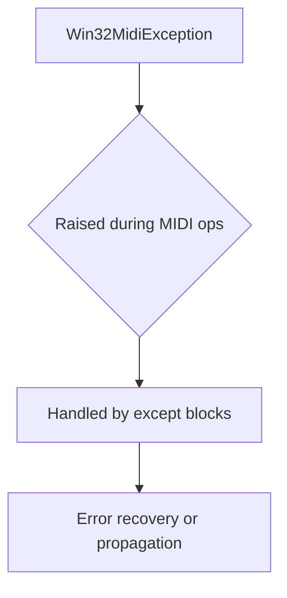
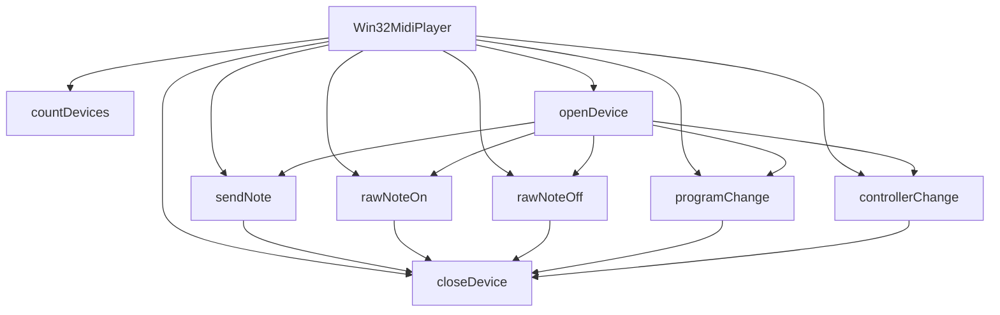

# `win32midi.py`

## `mingus.midi.win32midi.Win32MidiException` · *class*

## Summary:
Represents exceptions specific to MIDI operations on Windows platforms.

## Description:
Win32MidiException is a custom exception class that extends Python's built-in Exception class. It serves as a specialized error type for handling MIDI-related errors that occur specifically on Windows systems. This exception type allows callers to distinguish MIDI-specific failures from other types of exceptions in the win32midi module.

The motivation behind creating this distinct exception class is to provide more granular error handling for MIDI operations on Windows, enabling better debugging and error recovery strategies when working with the Windows MIDI API through the mingus library.

## State:
This class has no instance attributes or state variables. It inherits all behavior from the base Exception class.

## Lifecycle:
Creation: Instances are created by raising the exception directly or through inheritance from other exception handlers. No special initialization parameters are required.

Usage: The exception is typically raised during MIDI operation failures such as device access issues, invalid MIDI messages, or Windows API call failures.

Destruction: As a standard Python exception, cleanup is handled automatically by Python's garbage collector when the exception object goes out of scope.

## Method Map:


## Raises:
This class itself does not raise any exceptions. It is designed to be raised by other components in the win32midi module when MIDI-related operations fail on Windows systems.

## Example:
```python
try:
    # Some MIDI operation that fails on Windows
    midi_device.open()
except Win32MidiException as e:
    print(f"MIDI operation failed: {e}")
    # Handle the specific MIDI error appropriately
```

## `mingus.midi.win32midi.Win32MidiPlayer` · *class*

## Summary:
Win32MidiPlayer is a Windows-specific MIDI player that provides low-level control over MIDI devices through the Windows Multimedia API.

## Description:
This class serves as a bridge between Python applications and Windows MIDI hardware, enabling the playback of musical notes and control messages via the winmm.dll library. It is designed specifically for Windows systems and provides methods to open MIDI devices, send various MIDI messages (notes, program changes, controller changes), and manage device connections. The class handles the complexity of Windows MIDI API calls and translates them into intuitive Python methods.

## State:
- `midiOutOpenErrorCodes` (dict): Maps Windows MIDI error codes to descriptive messages for device opening failures
- `midiOutShortErrorCodes` (dict): Maps Windows MIDI error codes to descriptive messages for short message transmission failures  
- `winmm` (ctypes.windll): Reference to the Windows Multimedia DLL for making native API calls
- `hmidi` (c_void_p): Handle to the opened MIDI device, set during device opening

## Lifecycle:
- Creation: Instantiate with `Win32MidiPlayer()` constructor
- Usage: Call `openDevice()` to connect to a MIDI device, then use various send methods like `sendNote()`, `rawNoteOn()`, `programChange()`, etc., followed by `closeDevice()` to release resources
- Destruction: Automatically managed through proper resource cleanup via `closeDevice()` method

## Method Map:


## Raises:
- `Win32MidiException`: Raised during device operations when Windows MIDI API returns non-zero error codes, providing detailed error messages from the error code mappings

## Example:
```python
player = Win32MidiPlayer()
player.openDevice()  # Opens default MIDI device
player.sendNote(60, duration=1.0, volume=100)  # Play middle C for 1 second
player.closeDevice()  # Close the device connection
```

### `mingus.midi.win32midi.Win32MidiPlayer.__init__` · *method*

## Summary:
Initializes the Win32MidiPlayer object by setting up error code mappings and establishing a reference to the Windows multimedia API.

## Description:
This method initializes the Win32MidiPlayer instance by configuring error code dictionaries for MIDI output operations and storing a reference to the Windows multimedia DLL. It serves as the constructor logic for the class, preparing the object for MIDI playback operations on Windows systems.

## Args:
    None

## Returns:
    None

## Raises:
    None

## State Changes:
    Attributes READ: None
    Attributes WRITTEN: 
    - self.midiOutOpenErrorCodes: Dictionary mapping MIDI output open error codes to descriptive messages
    - self.midiOutShortErrorCodes: Dictionary mapping MIDI output short message error codes to descriptive messages  
    - self.winmm: Reference to the Windows multimedia DLL (windll.winmm)

## Constraints:
    Preconditions: None
    Postconditions: The instance will have initialized error code dictionaries and a valid reference to the winmm DLL

## Side Effects:
    None

### `mingus.midi.win32midi.Win32MidiPlayer.countDevices` · *method*

## Summary:
Returns the number of MIDI output devices available on the Windows system.

## Description:
This method queries the Windows Multimedia MIDI API to determine how many MIDI output devices are currently installed and available. It serves as a utility method to enumerate available hardware resources before attempting to open a specific MIDI device. This method is typically called during the initialization phase of the Win32MidiPlayer to assess system capabilities.

## Args:
    None

## Returns:
    int: The number of MIDI output devices available on the system. Returns 0 if no devices are found or if the Windows API call fails.

## Raises:
    None explicitly raised by this method, though the underlying Windows API call (midiOutGetNumDevs) may raise system-level errors not handled here.

## State Changes:
    Attributes READ: self.winmm
    Attributes WRITTEN: None

## Constraints:
    Preconditions: The Win32MidiPlayer instance must be properly initialized with self.winmm set to windll.winmm.
    Postconditions: The returned integer represents a valid count of MIDI output devices that can be accessed via the Windows MIDI API.

## Side Effects:
    None - This is a read-only operation that queries system information through the Windows multimedia API without modifying any system state or external resources.

### `mingus.midi.win32midi.Win32MidiPlayer.openDevice` · *method*

## Summary:
Opens a MIDI output device for playback and initializes the device handle.

## Description:
This method establishes a connection to a Windows MIDI output device using the winmm API. It is responsible for setting up the hardware interface needed for MIDI message transmission. The method is typically called during the initialization phase of a MIDI player to prepare the system for sending MIDI events. This method is separated from the constructor to allow for flexible device selection and proper error handling.

## Args:
    deviceNumber (int): The index of the MIDI output device to open. Defaults to -1, which selects the default device configured in the MIDI mapper. Valid device numbers range from 0 to countDevices()-1, where countDevices() returns the total number of available MIDI output devices.

## Returns:
    None: This method does not return a value.

## Raises:
    Win32MidiException: Raised when the MIDI device fails to open, with an error message indicating the specific failure reason. This occurs when deviceNumber is invalid or the device is already in use.

## State Changes:
    Attributes READ: self.winmm, self.midiOutOpenErrorCodes
    Attributes WRITTEN: self.hmidi

## Constraints:
    Preconditions: The Win32MidiPlayer instance must have been initialized with the winmm library and error code mapping. The deviceNumber must be either -1 (default device) or a valid index between 0 and countDevices()-1.
    Postconditions: On successful execution, self.hmidi will contain a valid handle to the opened MIDI device.

## Side Effects:
    I/O: Makes a system call to the Windows multimedia API (winmm.dll) to open the MIDI device.

### `mingus.midi.win32midi.Win32MidiPlayer.closeDevice` · *method*

## Summary:
Closes the currently opened MIDI output device and releases associated system resources.

## Description:
The closeDevice method terminates the connection to a previously opened MIDI output device by calling the Windows multimedia MIDI API function midiOutClose. This method is part of the Win32MidiPlayer class's lifecycle management, ensuring proper cleanup of MIDI device handles when they are no longer needed. The method is typically called during object destruction or when explicitly closing MIDI playback sessions.

This logic is encapsulated in its own method rather than being inlined because it represents a distinct operational phase in the MIDI player's lifecycle, separates resource management concerns from other MIDI operations, and provides a clear interface for clients to explicitly manage device lifecycle.

## Args:
    None

## Returns:
    None

## Raises:
    Win32MidiException: When the Windows MIDI API returns a non-zero error code indicating failure to close the device.

## State Changes:
    Attributes READ: self.hmidi, self.winmm
    Attributes WRITTEN: None

## Constraints:
    Preconditions: The MIDI device must have been successfully opened via openDevice() before calling this method. The self.hmidi attribute must contain a valid MIDI output handle.
    Postconditions: The MIDI output device handle (self.hmidi) is closed and invalidated, making subsequent MIDI operations fail until a new device is opened.

## Side Effects:
    I/O: Calls the Windows multimedia API function midiOutClose, which interacts with the Windows MIDI subsystem to release system resources associated with the MIDI output device.

### `mingus.midi.win32midi.Win32MidiPlayer.sendNote` · *method*

## Summary:
Sends a complete MIDI note message consisting of a note-on followed by a note-off event with specified parameters.

## Description:
The sendNote method generates and sends a complete MIDI note message to the currently opened MIDI device. It first sends a note-on message with the specified pitch, volume, and channel, waits for the specified duration, then sends a note-off message for the same pitch and channel. This creates a playable musical note with the desired characteristics.

This method is designed as a convenience function that encapsulates the process of sending a complete note message, which would otherwise require two separate calls to send note-on and note-off events. It's particularly useful for playing single notes with specific timing characteristics.

## Args:
    pitch (int): MIDI pitch value (0-127) representing the note to play
    duration (float): Duration in seconds to hold the note (default: 1.0)
    channel (int): MIDI channel number (1-16, default: 1)
    volume (int): Note velocity/volume (0-127, default: 60)

## Returns:
    None: This method does not return any value

## Raises:
    Win32MidiException: When MIDI device operations fail during either the note-on or note-off message transmission

## State Changes:
    Attributes READ: self.winmm, self.hmidi, self.midiOutShortErrorCodes
    Attributes WRITTEN: None

## Constraints:
    Preconditions:
        - A MIDI device must be opened via openDevice() before calling this method
        - Pitch must be within valid MIDI range (0-127)
        - Volume must be within valid MIDI range (0-127)
        - Channel must be between 1-16
        - Duration must be non-negative
    Postconditions:
        - A complete note message is sent to the MIDI device
        - The method blocks execution for the specified duration
        - The note-off message is sent after the duration expires

## Side Effects:
    - Blocks execution for the specified duration using time.sleep()
    - Makes Windows API calls to the MIDI subsystem via winmm.dll
    - May cause audible sound output if a MIDI synthesizer is connected

### `mingus.midi.win32midi.Win32MidiPlayer.rawNoteOn` · *method*

## Summary:
Sends a raw MIDI note-on message to the currently opened MIDI device.

## Description:
The rawNoteOn method constructs and sends a MIDI note-on message directly to the Windows MIDI output device. This method bypasses higher-level abstractions like the sendNote method, allowing direct control over MIDI message parameters. It is typically called during the MIDI message transmission phase of a music playback pipeline, often as part of a larger musical composition or real-time MIDI manipulation workflow.

This method exists as a separate component to provide low-level access to MIDI functionality while maintaining consistency with other raw MIDI methods (like rawNoteOff) in the same class. It enables precise control over note-on events without automatic note-off handling or timing delays.

## Args:
    pitch (int): The MIDI pitch value (0-127) of the note to play. Must be within valid MIDI pitch range.
    channel (int): The MIDI channel number (1-16) to send the message on. Defaults to 1.
    v (int): The velocity value (0-127) of the note press. Defaults to 60.

## Returns:
    None: This method does not return any value.

## Raises:
    Win32MidiException: Raised when the Windows MIDI API call (midiOutShortMsg) fails, providing detailed error information from the midiOutShortErrorCodes mapping.

## State Changes:
    Attributes READ: self.winmm, self.hmidi, self.midiOutShortErrorCodes
    Attributes WRITTEN: None

## Constraints:
    Preconditions: 
    - The MIDI device must be opened via openDevice() before calling this method
    - Pitch must be in the valid MIDI range (0-127)
    - Channel must be in the valid MIDI range (1-16)
    - Velocity must be in the valid MIDI range (0-127)
    
    Postconditions:
    - A MIDI note-on message is sent to the currently opened device
    - The method raises an exception if the MIDI message could not be sent successfully

## Side Effects:
    I/O: Direct interaction with the Windows MIDI subsystem through the winmm.dll library
    External service calls: Calls to Windows API functions midiOutShortMsg

### `mingus.midi.win32midi.Win32MidiPlayer.rawNoteOff` · *method*

## Summary:
Sends a MIDI note-off message to stop a previously played note on a specified channel.

## Description:
The `rawNoteOff` method constructs and sends a MIDI note-off message to the currently opened MIDI device. This method is part of the Win32MidiPlayer class and is responsible for terminating a note that was previously initiated with `rawNoteOn`. It directly interfaces with the Windows multimedia MIDI API through the `midiOutShortMsg` function.

This method is separate from other MIDI operations like `sendNote` because it provides a low-level interface for sending individual note-off commands without the automatic timing control that `sendNote` provides. This allows for more precise control over note durations and sequencing.

## Args:
- pitch (int): The MIDI pitch value (0-127) of the note to stop. This corresponds to the note that was started with `rawNoteOn`.
- channel (int): The MIDI channel number (1-16) to send the note-off message on. Defaults to 1.

## Returns:
None

## Raises:
- Win32MidiException: Raised when the Windows MIDI API call `midiOutShortMsg` fails, indicating issues such as invalid device handles, hardware unavailability, or invalid MIDI messages.

## State Changes:
- Attributes READ: self.winmm, self.hmidi, self.midiOutShortErrorCodes
- Attributes WRITTEN: None

## Constraints:
- Preconditions: The MIDI device must be opened via `openDevice()` before calling this method. The pitch value must be within the valid MIDI range (0-127). The channel must be between 1 and 16.
- Postconditions: The MIDI note-off message is sent to the device, potentially stopping a note that was previously started.

## Side Effects:
- I/O: Makes a system call to the Windows multimedia MIDI API (`midiOutShortMsg`) which may involve hardware communication or driver interactions.
- External service calls: Direct interaction with Windows system services for MIDI device management.

### `mingus.midi.win32midi.Win32MidiPlayer.programChange` · *method*

## Summary:
Changes the instrument program for a specified MIDI channel on the connected device.

## Description:
The programChange method sends a MIDI Program Change message to the currently opened MIDI device, allowing the selection of a different instrument or sound bank for a specific channel. This method is part of the Win32MidiPlayer class which provides Windows-specific MIDI functionality through the Windows Multimedia API.

This logic is implemented as a separate method because MIDI Program Change messages have a specific format and purpose that differs from other MIDI messages like Note On/Off or Controller Change messages. Having it as a dedicated method improves code readability and encapsulates the specific MIDI protocol handling for program changes.

## Args:
    program (int): The program number (0-127) to select for the instrument.
    channel (int): The MIDI channel number (1-16) to send the program change to. Defaults to 1.

## Returns:
    None: This method does not return any value.

## Raises:
    Win32MidiException: Raised when the Windows MIDI API fails to send the program change message. The exception includes a descriptive error message based on the Windows error code returned by midiOutShortMsg.

## State Changes:
    Attributes READ: self.winmm, self.hmidi, self.midiOutShortErrorCodes
    Attributes WRITTEN: None

## Constraints:
    Preconditions: 
    - The MIDI device must be opened via openDevice() before calling this method
    - The program parameter must be within the valid range of 0-127
    - The channel parameter must be within the valid range of 1-16
    Postconditions: 
    - The MIDI device's program state for the specified channel is updated
    - No other state changes occur on the Win32MidiPlayer instance

## Side Effects:
    I/O: Makes a call to the Windows Multimedia API (winmm.dll) via midiOutShortMsg to send the MIDI message to the physical MIDI device.

### `mingus.midi.win32midi.Win32MidiPlayer.controllerChange` · *method*

## Summary:
Sends a MIDI controller change message to the connected MIDI device.

## Description:
This method constructs and sends a MIDI controller change message using the Windows Multimedia MIDI API. It is used to modify controller values on a specific MIDI channel, commonly for adjusting parameters like volume, pan, or modulation.

## Args:
    controller (int): The controller number (0-127) to change.
    val (int): The value to set for the controller (0-127).
    channel (int): The MIDI channel number (1-16). Defaults to 1.

## Returns:
    None: This method does not return a value.

## Raises:
    Win32MidiException: When the Windows MIDI API fails to send the message, with an error code and description.

## State Changes:
    Attributes READ: 
        - self.winmm
        - self.hmidi
        - self.midiOutShortErrorCodes
    Attributes WRITTEN: None

## Constraints:
    Preconditions:
        - The MIDI device must be properly initialized and opened.
        - Controller and val must be within the valid range of 0-127.
        - Channel must be between 1 and 16.
    Postconditions:
        - The controller change message is sent to the MIDI device.
        - If successful, the method completes without raising an exception.

## Side Effects:
    - Makes a Windows API call to the multimedia MIDI interface.
    - May cause audible changes on the connected MIDI device if it responds to controller changes.

