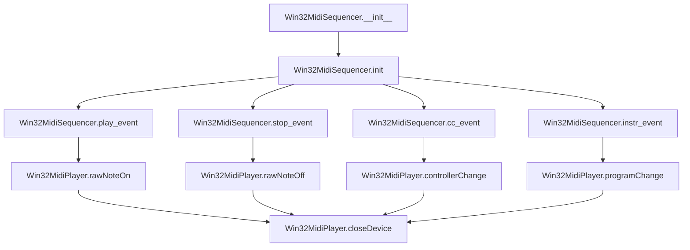

# `win32midisequencer.py`

## `mingus.midi.win32midisequencer.Win32MidiSequencer` · *class*

## Summary:
Win32MidiSequencer is a Windows-specific MIDI sequencer implementation that provides low-level MIDI event handling through the Windows Multimedia API.

## Description:
This class implements the Sequencer abstract base class specifically for Windows platforms, providing concrete implementations for MIDI event playback using the win32midi module. It serves as a bridge between high-level musical sequencing operations and Windows-specific MIDI hardware control. The class is intended exclusively for use on Windows systems (win32 platform) and manages the lifecycle of a MIDI device connection through proper initialization and cleanup.

## State:
- output (None): Placeholder for MIDI output device, currently unused in this implementation
- midplayer (Win32MidiPlayer or None): Instance of the Windows MIDI player that handles actual device communication
- Invariant: midplayer must be None or a properly initialized Win32MidiPlayer instance

## Lifecycle:
- Creation: Instantiate with `Win32MidiSequencer()` constructor, which calls parent `Sequencer.__init__()` and then `init()`
- Usage: The sequencer is ready for MIDI event playback after successful initialization, with methods called in sequence: `init()` → `play_event()`/`stop_event()`/`cc_event()`/`instr_event()`
- Destruction: Automatic cleanup occurs through `__del__()` method that closes the MIDI device connection

## Method Map:


## Raises:
- RuntimeError: Raised during `init()` if the platform is not win32, indicating the class is not intended for use on non-Windows systems

## Example:
```python
# Create and initialize the sequencer
sequencer = Win32MidiSequencer()
sequencer.init()  # Initializes Windows MIDI device

# Play a note
sequencer.play_event(60, channel=1, velocity=100)  # Play middle C

# Stop the note
sequencer.stop_event(60, channel=1)

# Change controller value
sequencer.cc_event(channel=1, control=7, value=100)  # Change volume

# Change instrument
sequencer.instr_event(channel=1, instr=40, bank=0)  # Change to piano

# Cleanup (automatic via __del__)
```

### `mingus.midi.win32midisequencer.Win32MidiSequencer.init` · *method*

## Summary:
Initializes the Win32 MIDI sequencer by setting up a Windows-specific MIDI player and opening the default MIDI device.

## Description:
This method prepares the Win32MidiSequencer for MIDI playback by creating a Win32MidiPlayer instance and establishing a connection to the system's default MIDI output device. It serves as the initialization step for the Windows-specific MIDI sequencing functionality, ensuring that the underlying MIDI hardware is properly configured before attempting to play musical notes. This method is part of the Sequencer base class's initialization process and is called during object construction to set up platform-specific MIDI capabilities.

## Args:
    None: This method takes no arguments beyond the implicit self parameter.

## Returns:
    None: This method does not return a value.

## Raises:
    RuntimeError: Raised when the method is called on a non-Windows platform (sys.platform != "win32"), indicating that this functionality is only supported on Windows systems.

## State Changes:
    Attributes READ: self (no specific attributes read)
    Attributes WRITTEN: self.midplayer (assigned a new Win32MidiPlayer instance)

## Constraints:
    Preconditions: The method must be called on a Windows system (sys.platform == "win32").
    Postconditions: On successful execution, self.midplayer will be initialized with a Win32MidiPlayer instance that has opened a MIDI device.

## Side Effects:
    I/O: Makes a system call to the Windows multimedia API (winmm.dll) through the Win32MidiPlayer.openDevice() method to open the MIDI device.

### `mingus.midi.win32midisequencer.Win32MidiSequencer.__del__` · *method*

## Summary:
Closes the MIDI device when the Win32MidiSequencer instance is deleted, ensuring proper resource cleanup.

## Description:
The `__del__` method serves as the destructor for the Win32MidiSequencer class, automatically closing the underlying MIDI device when the object is garbage collected. This method is called by Python's garbage collector when the object's reference count reaches zero, ensuring that system resources associated with the MIDI device are properly released even if the user forgets to explicitly close the device.

This logic is implemented as its own method rather than being inlined because it represents a critical resource management operation that must occur during object destruction, separating cleanup concerns from the main sequencer functionality and ensuring deterministic resource deallocation. The method is called during the normal object lifecycle when Python's garbage collector determines the object is no longer referenced.

## Args:
    None

## Returns:
    None

## Raises:
    Win32MidiException: When the underlying MIDI device fails to close properly, typically due to Windows MIDI API errors.

## State Changes:
    Attributes READ: self.midplayer
    Attributes WRITTEN: None

## Constraints:
    Preconditions: The Win32MidiSequencer instance must have been initialized with a valid midplayer attribute that implements the closeDevice method. The midplayer object must have been successfully opened via openDevice() before this method is called.
    Postconditions: The MIDI device handle is closed and invalidated, making subsequent MIDI operations fail until a new device is opened.

## Side Effects:
    I/O: Calls the Windows multimedia API function midiOutClose through the midplayer's closeDevice method, which interacts with the Windows MIDI subsystem to release system resources associated with the MIDI output device.

### `mingus.midi.win32midisequencer.Win32MidiSequencer.play_event` · *method*

## Summary:
Plays a MIDI note event by sending a raw note-on message to the Windows MIDI device.

## Description:
The play_event method sends a raw MIDI note-on message to the currently opened Windows MIDI device. This method is part of the Win32MidiSequencer's interface for controlling MIDI playback and is typically called during the execution phase of a musical sequence or real-time MIDI manipulation workflow. It provides direct access to MIDI note-on functionality without automatic note-off handling or timing management.

This method exists as a dedicated component to maintain consistency with other raw MIDI event methods (stop_event, cc_event, instr_event) in the sequencer class, ensuring a uniform interface for low-level MIDI message transmission. It is called by the parent Sequencer class's playback methods when processing note events.

## Args:
    note (int): The MIDI note pitch value (0-127) to play. Must be within valid MIDI pitch range.
    channel (int): The MIDI channel number (1-16) to send the note-on message on. Must be within valid MIDI channel range.
    velocity (int): The velocity value (0-127) representing note press strength. Must be within valid MIDI velocity range.

## Returns:
    None: This method does not return any value.

## Raises:
    Win32MidiException: Raised when the underlying Windows MIDI API call fails, providing detailed error information from the Win32MidiPlayer's error code mappings.

## State Changes:
    Attributes READ: self.midplayer
    Attributes WRITTEN: None

## Constraints:
    Preconditions:
    - The Win32MidiSequencer must be properly initialized with an opened MIDI device
    - The note parameter must be within the valid MIDI pitch range (0-127)
    - The channel parameter must be within the valid MIDI channel range (1-16)
    - The velocity parameter must be within the valid MIDI velocity range (0-127)
    
    Postconditions:
    - A MIDI note-on message is transmitted to the currently opened device
    - The method raises an exception if the MIDI message could not be sent successfully

## Side Effects:
    I/O: Direct interaction with the Windows MIDI subsystem through the winmm.dll library
    External service calls: Calls to Windows API functions via the Win32MidiPlayer's rawNoteOn method

### `mingus.midi.win32midisequencer.Win32MidiSequencer.stop_event` · *method*

## Summary:
Stops a MIDI note event by sending a raw note-off message to the Win32 MIDI player.

## Description:
This method sends a raw note-off command to the Win32 MIDI player instance, effectively terminating a previously played MIDI note on the specified channel. It is part of the Win32MidiSequencer class that implements MIDI sequencing functionality specifically for Windows platforms using the Win32 MIDI API. The method serves as the concrete implementation of the abstract stop_event method defined in the parent Sequencer class.

Known callers and contexts:
- Sequencer.stop_Note() in mingus/midi/sequencer.py: Called during the cleanup phase of individual note playback to properly terminate MIDI note events
- Sequencer.stop_everything() in mingus/midi/sequencer.py: Called to stop all active notes across all channels during system shutdown or reset
- Sequencer.stop_NoteContainer() in mingus/midi/sequencer.py: Called to stop a collection of notes simultaneously during container-based playback management

This method exists as a separate implementation to encapsulate the Win32-specific note-off functionality, allowing the parent Sequencer class to define the interface while enabling concrete MIDI output behavior through inheritance. The separation enables platform-specific MIDI handling while maintaining a consistent API across different MIDI backends.

## Args:
    note (int): The MIDI note number to stop (typically 0-127)
    channel (int): The MIDI channel number (typically 0-15)

## Returns:
    None: This method does not return any value

## Raises:
    AttributeError: If the Win32 MIDI player instance (self.midplayer) has not been initialized

## State Changes:
    Attributes READ: self.midplayer
    Attributes WRITTEN: None

## Constraints:
    Preconditions: 
    - The Win32 MIDI player instance (self.midplayer) must be initialized via the init() method
    - The note parameter must be a valid MIDI note number (0-127)
    - The channel parameter must be a valid MIDI channel (0-15)
    
    Postconditions:
    - The note-off message is sent to the Win32 MIDI output device
    - No changes are made to the Win32MidiSequencer object's state

## Side Effects:
    - Calls the Win32 MIDI API's rawNoteOff function through the Win32MidiPlayer instance
    - May cause audio output to stop for the specified note and channel

### `mingus.midi.win32midisequencer.Win32MidiSequencer.cc_event` · *method*

## Summary:
Sends a MIDI controller change message to a specified channel on the connected MIDI device.

## Description:
This method acts as a wrapper around the underlying Win32 MIDI player's controllerChange method, allowing the sequencer to send controller change events to specific MIDI channels. It is part of the MIDI sequencer's event handling system and enables dynamic control of MIDI parameters such as volume, pan, or modulation during playback. This method is typically invoked by higher-level sequencer methods like control_change when processing controller events.

## Args:
    channel (int): The MIDI channel number (1-16) to send the controller change to.
    control (int): The controller number (0-127) to modify.
    value (int): The value to set for the controller (0-127).

## Returns:
    None: This method does not return a value.

## Raises:
    Win32MidiException: When the underlying Windows MIDI API fails to send the controller change message, with an error code and description.

## State Changes:
    Attributes READ: 
        - self.midplayer
    Attributes WRITTEN: None

## Constraints:
    Preconditions:
        - The MIDI device must be properly initialized and opened via the init method.
        - Channel must be between 1 and 16.
        - Control and value must be within the valid range of 0-127.
    Postconditions:
        - The controller change message is sent to the MIDI device.
        - If successful, the method completes without raising an exception.

## Side Effects:
    - Makes a Windows API call to the multimedia MIDI interface.
    - May cause audible changes on the connected MIDI device if it responds to controller changes.

### `mingus.midi.win32midisequencer.Win32MidiSequencer.instr_event` · *method*

## Summary:
Sets the instrument program for a specified MIDI channel on the connected device.

## Description:
The instr_event method sends a MIDI Program Change message to the currently opened MIDI device, allowing the selection of a different instrument or sound bank for a specific channel. This method is part of the Win32MidiSequencer class which provides Windows-specific MIDI sequencing functionality.

This logic is implemented as a separate method because MIDI Program Change messages have a specific format and purpose that differs from other MIDI messages like Note On/Off or Controller Change messages. Having it as a dedicated method improves code readability and encapsulates the specific MIDI protocol handling for program changes.

Known callers and context:
- Called by the parent Sequencer class's set_instrument method when processing instrument change events in a musical sequence.
- Part of the standard MIDI event processing pipeline for instrument management.

## Args:
    channel (int): The MIDI channel number (1-16) to send the program change to.
    instr (int): The instrument program number (0-127) to select for the instrument.
    bank (int): The bank number (0-127) to select for the instrument.

## Returns:
    None: This method does not return any value.

## Raises:
    Win32MidiException: Raised when the Windows MIDI API fails to send the program change message. The exception includes a descriptive error message based on the Windows error code returned by midiOutShortMsg.

## State Changes:
    Attributes READ: self.midplayer
    Attributes WRITTEN: None

## Constraints:
    Preconditions: 
    - The MIDI device must be opened via init() before calling this method
    - The instr parameter must be within the valid range of 0-127
    - The channel parameter must be within the valid range of 1-16
    Postconditions: 
    - The MIDI device's program state for the specified channel is updated
    - No other state changes occur on the Win32MidiSequencer instance

## Side Effects:
    I/O: Makes a call to the Windows Multimedia API (winmm.dll) via midiOutShortMsg to send the MIDI message to the physical MIDI device.

