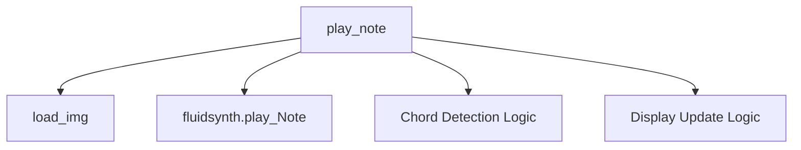

# `mingus_examples.pygame-piano`

## Tree:
```
pygame-piano/
└── pygame-piano.py
```

## Role:
Handles musical note playback and visual chord detection for a Pygame-based piano interface.

## Description:
This module provides core functionality for playing musical notes through MIDI synthesis and displaying chord information on a virtual piano keyboard. It manages both the audio output and visual feedback aspects of a piano simulation, integrating with Pygame for rendering and fluidsynth for sound generation.

The module is used primarily in the mingus_examples package to create interactive piano experiences where users can play notes and see real-time chord recognition. It serves as a bridge between musical data (mingus Note objects) and visual/audio feedback in a Pygame environment.

## Components:
- **load_img**: Centralized image loading utility with proper Pygame surface conversion
- **play_note**: Core note-playing function that handles MIDI synthesis and chord detection



## Public API:
- **load_img(name: str)**: Loads and processes a Pygame image surface with appropriate color conversion. Returns (pygame.Surface, pygame.Rect).
- **play_note(note: mingus.containers.Note)**: Plays a musical note using MIDI synthesis and updates the display with chord information. Returns None.

## Dependencies:
- **Internal**: None
- **External**: 
  - `pygame` - For image processing and display rendering
  - `mingus` - For musical note representation and chord detection
  - `fluidsynth` - For MIDI audio synthesis

## Constraints:
- The `play_note` function requires several global variables to be initialized before use:
  - `text`: Pygame surface for displaying chord information
  - `width`: Width dimension for display calculations
  - `LOWEST`: Lowest playable note octave
  - `WHITE_KEYS`: List of white key note names
  - `BLACK_KEYS`: List of black key note names
  - `white_key_width`: Width of each white key
  - `playing_w`: List tracking currently playing white keys
  - `playing_b`: List tracking currently playing black keys
  - `tick`: Current game tick counter
  - `font`: Pygame font object for text rendering
  - `channel`: MIDI channel identifier for fluidsynth
- All note objects passed to `play_note` must be valid mingus Note instances with proper name and octave attributes
- Image paths passed to `load_img` must be valid and accessible file paths

---

## Files

- [`pygame-piano.py`](pygame-piano/pygame-piano.md)

