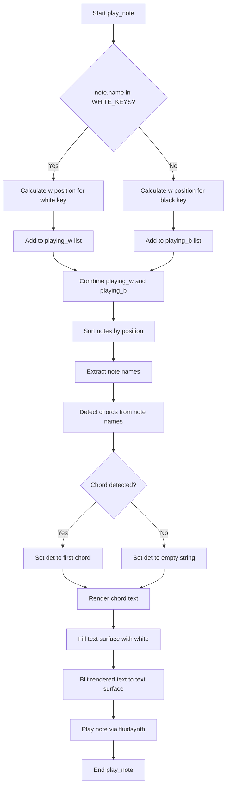

# `pygame-piano.py`

## `mingus_examples.pygame-piano.pygame-piano.load_img` · *function*

## Summary:
Loads and processes a Pygame image surface with appropriate color conversion based on alpha channel presence.

## Description:
This function handles loading an image file using Pygame and ensures proper surface conversion for optimal rendering. It processes images with or without transparency by converting them appropriately. The function is designed to be a centralized image loading utility that standardizes image preparation for the application.

## Args:
    name (str): The file path to the image to be loaded.

## Returns:
    tuple[pygame.Surface, pygame.Rect]: A tuple containing the loaded image surface and its bounding rectangle.

## Raises:
    SystemExit: Raised when a pygame.error occurs during image loading, indicating the image file could not be loaded.

## Constraints:
    Precondition: The file path provided must be valid and accessible.
    Postcondition: The returned image surface will be properly converted for rendering, and the rect will represent its dimensions.

## Side Effects:
    I/O: Reads from the file system to load the image file.
    External state mutations: None.

## Control Flow:
```mermaid
flowchart TD
    A[Start load_img] --> B{Try to load image}
    B -->|Success| C{Image has alpha channel?}
    C -->|No| D[Convert image]
    C -->|Yes| E[Convert image with alpha]
    D --> F[Return (image, rect)]
    E --> F
    B -->|Failure| G[Print error message]
    G --> H[Raise SystemExit]
```

## Examples:
    # Load an image with transparency
    img_surface, img_rect = load_img("assets/player.png")
    
    # Load an image without transparency
    bg_surface, bg_rect = load_img("assets/background.jpg")

## `mingus_examples.pygame-piano.pygame-piano.play_note` · *function*

## Summary:
Plays a musical note using MIDI synthesis and updates the display with chord information.

## Description:
This function handles the playback of a musical note by sending it to a MIDI synthesizer and updating the graphical interface to show detected chords. It manages both white and black keys on a virtual piano keyboard, calculates positions based on octaves and key layouts, and integrates with the pygame display system to show chord names. The function is responsible for positioning notes on the virtual keyboard display and detecting chords formed by currently playing notes.

## Args:
    note (mingus.containers.Note): A mingus Note object representing the musical note to be played.

## Returns:
    None: This function does not return any value.

## Raises:
    None explicitly raised.

## Constraints:
    Preconditions:
    - The global variables `text`, `width`, `LOWEST`, `WHITE_KEYS`, `BLACK_KEYS`, `white_key_width`, `playing_w`, `playing_b`, `tick`, `font`, `channel` must be properly initialized before calling this function.
    - The note parameter must be a valid mingus Note object with proper name and octave attributes.
    
    Postconditions:
    - The note is added to either the playing_w or playing_b list based on its key type.
    - The display is updated with the detected chord information.
    - The note is played through the MIDI synthesizer.

## Side Effects:
    - Writes to global variables `playing_w` and `playing_b` lists.
    - Updates the pygame display surface through the `text` variable.
    - Calls the fluidsynth.play_Note function to produce audio output.
    - Modifies the pygame display by rendering text and filling the text surface.

## Control Flow:


## Examples:
    # Basic usage with a note object
    from mingus.containers import Note
    note = Note("C", 4)
    play_note(note)
    
    # Usage in a pygame event loop context
    for event in pygame.event.get():
        if event.type == pygame.MOUSEBUTTONDOWN:
            note = Note("E", 5)
            play_note(note)
```

