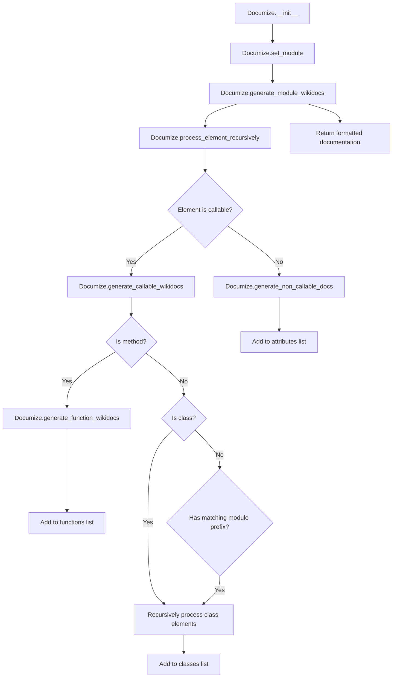

# `api_doc_generator.py`

## `scripts.api_doc_generator._is_class` · *function*

## Summary:
Determines whether a given object should be treated as a user-defined class for API documentation purposes by filtering against predefined skipped superclasses.

## Description:
This utility function evaluates if a class qualifies as a user-defined class that should appear in API documentation. It excludes built-in Python classes and framework-specific base classes that are typically not relevant to end-user API documentation. The function serves as a filter in the API documentation generation process to distinguish between core framework classes and user-defined classes.

## Args:
    cls (type): A Python class object to evaluate for inclusion in API documentation

## Returns:
    bool: True if the class inherits from object but not from _SKIPPED_CLASS_SUPERTYPES, False otherwise

## Raises:
    TypeError: If cls is not a class type, which can occur when issubclass() is called on non-class objects

## Constraints:
    Preconditions:
        - cls must be a valid Python class object or type
        - The global variable _SKIPPED_CLASS_SUPERTYPES must be defined in the module scope
    
    Postconditions:
        - Returns a boolean value indicating whether the class should be included in API documentation
        - Does not modify any external state

## Side Effects:
    None

## Control Flow:
```mermaid
flowchart TD
    A[Input: cls] --> B{issubclass(cls, object)?}
    B -- Yes --> C{issubclass(cls, _SKIPPED_CLASS_SUPERTYPES)?}
    C -- No --> D[Return True]
    C -- Yes --> E[Return False]
    B -- No --> F[Return False]
```

## Examples:
    # Example 1: Standard user-defined class
    class MyClass:
        pass
    result = _is_class(MyClass)  # Returns True (assuming MyClass doesn't inherit from skipped types)
    
    # Example 2: Built-in class (typically filtered out)
    result = _is_class(str)  # Returns False (assuming str inherits from skipped types)
    
    # Example 3: Class inheriting from object directly  
    class BaseClass(object):
        pass
    result = _is_class(BaseClass)  # Returns True (assuming BaseClass not in skipped types)
```

## `scripts.api_doc_generator._is_method` · *function*

## Summary:
Determines whether an object is a method type by checking its type against a predefined set of method types.

## Description:
This utility function identifies whether a given object is of a method type, which is commonly used in introspection and API documentation generation to distinguish between regular functions and bound methods. The function leverages the global constant `_METHOD_TYPES` to perform the type checking.

## Args:
    obj (Any): The object to check for method type compatibility.

## Returns:
    bool: True if the object's type is contained in the predefined `_METHOD_TYPES` collection, False otherwise.

## Raises:
    None explicitly raised.

## Constraints:
    Preconditions:
        - The input object must be a valid Python object that can be inspected by the `type()` function.
        - The global variable `_METHOD_TYPES` must be defined and contain appropriate type objects for method detection.

    Postconditions:
        - The function will always return a boolean value (True or False).
        - No modifications are made to the input object or global state.

## Side Effects:
    None.

## Control Flow:
```mermaid
flowchart TD
    A[Start _is_method] --> B{type(obj) in _METHOD_TYPES?}
    B -- Yes --> C[Return True]
    B -- No --> D[Return False]
```

## Examples:
    # Example 1: Checking a bound method
    class MyClass:
        def my_method(self):
            pass
    
    instance = MyClass()
    result = _is_method(instance.my_method)  # Returns True
    
    # Example 2: Checking a regular function
    def regular_func():
        pass
        
    result = _is_method(regular_func)  # Returns False
```

## `scripts.api_doc_generator.Documize` · *class*

## Summary:
A class for generating Sphinx-compatible wiki documentation from Python modules by recursively analyzing their attributes, functions, and classes.

## Description:
The Documize class is designed to automatically generate API documentation in reStructuredText format for Python modules. It recursively traverses module contents, identifying functions, classes, and attributes, and formats them according to Sphinx documentation standards. The class handles both top-level module elements and nested class members, making it suitable for comprehensive API documentation generation. It specifically filters out private attributes (starting with underscore) and module types, while preserving special methods defined in _ALLOWED_DUNDER_METHODS.

## State:
- functions: list[str] - Accumulates documentation strings for functions found in the module, sorted alphabetically
- classes: list[str] - Accumulates documentation strings for classes found in the module, sorted alphabetically  
- attributes: list[str] - Accumulates documentation strings for non-callable attributes found in the module, sorted alphabetically
- _ALLOWED_DUNDER_METHODS: set[str] - Set of special method names that should be included in documentation despite starting with double underscores
- module_string: str - The string representation of the module being documented
- module: module - The actual Python module object being processed

## Lifecycle:
- Creation: Instantiate with optional module_string parameter to specify which module to document. If no module_string is provided, the instance is created but not yet configured for documentation generation.
- Usage: Call output_wiki() method to generate complete documentation. Internally, this triggers reset(), processes the module recursively, and formats all collected documentation elements.
- Destruction: No explicit cleanup required; state is reset between documentation generations via the reset() method.

## Method Map:


## Raises:
- None explicitly raised in __init__
- ValueError or AttributeError may occur during eval() operations in process_element_recursively if invalid module paths are provided
- Potential runtime errors from inspect.getargspec or other introspection functions when dealing with built-in C extensions

## Example:
```python
# Create documentation generator for a module
doc_gen = Documize('mingus.containers')

# Generate documentation
wiki_output = doc_gen.output_wiki()

# The result contains reStructuredText formatted documentation
# ready for Sphinx processing
```

### `scripts.api_doc_generator.Documize.__init__` · *method*

## Summary:
Initializes the Documize object by setting its module and resetting internal tracking lists.

## Description:
The `__init__` method serves as the constructor for the Documize class, responsible for initializing the object's state by setting the target module string and preparing internal data structures for documentation generation. It delegates the actual module setup and reset logic to the `set_module` method.

This method is called during object instantiation and ensures that the Documize instance is properly configured with a module to document before any documentation generation occurs. When an empty string is passed, the object remains initialized but without a module assigned, allowing for later configuration.

## Args:
    module_string (str): The string representation of the Python module to be documented. Defaults to an empty string.

## Returns:
    None: This method does not return any value.

## Raises:
    NameError: If the `module_string` does not correspond to a valid Python module that can be evaluated using `eval()`.

## State Changes:
    Attributes READ: None
    Attributes WRITTEN: 
        - self.module_string: Set to the provided `module_string` value
        - self.module: Set to the result of evaluating `module_string` using `eval()` when `module_string` is not empty
        - self.functions: Reset to an empty list via `self.reset()` when `module_string` is not empty
        - self.classes: Reset to an empty list via `self.reset()` when `module_string` is not empty
        - self.attributes: Reset to an empty list via `self.reset()` when `module_string` is not empty

## Constraints:
    Preconditions:
        - The `module_string` parameter must either be an empty string or represent a valid Python module that can be imported and evaluated.
    Postconditions:
        - If `module_string` is not empty, the object's `module_string` and `module` attributes are set accordingly.
        - The internal tracking lists (`functions`, `classes`, `attributes`) are reset to empty lists.
        - If `module_string` is empty, the object remains initialized but without a module assigned.

## Side Effects:
    - Evaluates the provided `module_string` using Python's `eval()` function, which can execute arbitrary code and may have security implications if the input is untrusted.
    - Calls `self.reset()` which clears internal tracking lists when `module_string` is not empty.

### `scripts.api_doc_generator.Documize._filter_dunder_attributes` · *method*

## Summary:
Filters out dunder attributes from a collection, retaining only those explicitly allowed.

## Description:
This method processes a collection of attribute names and filters out dunder methods (those starting with '__') unless they are explicitly included in the `_ALLOWED_DUNDER_METHODS` set. It is used to clean attribute lists when generating API documentation, ensuring that only meaningful attributes are included in the output.

The method is specifically designed to work with the `process_element_recursively` method, which calls it to filter attributes before processing them further. This separation allows for cleaner documentation generation by excluding most dunder methods while preserving key ones like `__init__`, `__str__`, and others that are important for API documentation.

## Args:
    attrs (iterable[str]): An iterable of attribute names to filter.

## Returns:
    generator[str]: A generator yielding attribute names that either don't start with '__' or are in the `_ALLOWED_DUNDER_METHODS` set.

## Raises:
    None explicitly raised.

## State Changes:
    Attributes READ: `_ALLOWED_DUNDER_METHODS`
    Attributes WRITTEN: None

## Constraints:
    Preconditions: The `attrs` argument must be iterable containing string attribute names.
    Postconditions: The returned generator will yield only attribute names that meet the filtering criteria.

## Side Effects:
    None.

### `scripts.api_doc_generator.Documize.process_element_recursively` · *method*

## Summary:
Recursively processes attributes of a module or class, generating documentation for each element based on whether it is callable or not.

## Description:
This method implements the recursive traversal logic for API documentation generation. It examines all attributes of a given module or class (after filtering out dunder methods unless explicitly allowed) and delegates documentation generation to specialized handlers based on whether each element is callable or not. The method is part of the core documentation pipeline, working in conjunction with `_filter_dunder_attributes`, `generate_non_callable_docs`, and `generate_callable_wikidocs`.

During execution, the method uses `dir()` to retrieve all attributes of the evaluated element, applies filtering to exclude unwanted dunder methods, and then uses `eval()` to access each attribute by name. Non-callable elements are processed by `generate_non_callable_docs`, while callable elements are handled by `generate_callable_wikidocs`.

## Args:
    element_string (str): The dotted string representation of the module or class being processed
    element_evaled: The evaluated object representing the module or class to process  
    is_class (bool): Flag indicating whether the current context is within a class definition (default: False)

## Returns:
    None: This method does not return a value but modifies instance state through calls to other methods

## Raises:
    None explicitly raised

## State Changes:
    Attributes READ: 
        - self._filter_dunder_attributes
        - self.generate_non_callable_docs
        - self.generate_callable_wikidocs
    
    Attributes WRITTEN: 
        - Through calls to self.generate_non_callable_docs and self.generate_callable_wikidocs

## Constraints:
    Preconditions:
        - The element_string must be a valid string representing a module or class name
        - The element_evaled must be a valid Python object that can be inspected via dir()
        - The _filter_dunder_attributes method must be properly implemented
        - The generate_non_callable_docs and generate_callable_wikidocs methods must be available
        
    Postconditions:
        - All filtered attributes of the element are processed
        - Each attribute is routed to the appropriate documentation generation method
        - For callable class objects, recursive processing continues via process_element_recursively

## Side Effects:
    - Executes eval() operations during attribute access (via the eval('{0}.{1}'.format(element_string, element)) call)
    - Makes recursive calls to process_element_recursively for class objects
    - Modifies instance collections through calls to generate_non_callable_docs and generate_callable_wikidocs

### `scripts.api_doc_generator.Documize.generate_module_wikidocs` · *method*

## Summary:
Generates comprehensive wikidoc documentation for a module by recursively processing its elements and organizing them into classes, attributes, and functions.

## Description:
This method serves as the main entry point for generating documentation for a module. It orchestrates the documentation generation process by resetting internal tracking lists, creating module header information, extracting module docstrings, recursively processing all elements within the module, sorting the collected documentation fragments, and finally assembling them into a complete documentation string. The method is typically called as part of the documentation generation pipeline when a full module documentation needs to be produced.

This logic is encapsulated in its own method because it represents a complete workflow for module documentation generation that combines several distinct operations: state reset, header creation, recursive element processing, sorting, and result assembly. This approach promotes code organization and reusability.

## Args:
    None

## Returns:
    str: A complete documentation string formatted in reStructuredText for the module, including module header, docstring, sorted classes, attributes, and functions, followed by a back-to-index link.

## Raises:
    None

## State Changes:
    Attributes READ: 
    - self.module_string: Used to create module header and for recursive processing
    - self.module: Used to extract module docstring and for recursive processing
    - self.functions: Read to sort before assembly
    - self.attributes: Read to sort before assembly
    - self.classes: Read to sort before assembly
    Attributes WRITTEN: 
    - self.functions: Reset to empty list, then populated with function documentation
    - self.attributes: Reset to empty list, then populated with attribute documentation  
    - self.classes: Reset to empty list, then populated with class documentation

## Constraints:
    Preconditions: 
    - self.module_string must be set to a valid module name string
    - self.module must be a valid module object that can be evaluated
    - The module must be accessible via eval(self.module_string)
    Postconditions: 
    - All internal documentation lists (functions, attributes, classes) are reset and repopulated
    - The returned string contains properly formatted documentation

## Side Effects:
    None

### `scripts.api_doc_generator.Documize.generate_non_callable_docs` · *method*

## Summary:
Generates reStructuredText documentation entries for non-callable module attributes and class attributes.

## Description:
Processes non-callable elements (constants, attributes, etc.) from modules or classes and formats them as reStructuredText documentation entries. This method serves as part of the API documentation generation process, filtering out private elements (those starting with underscore) and excluding module types. The formatted documentation is stored in either the instance's `attributes` collection or `classes` collection depending on the `is_class` flag.

This method is specifically designed to handle static attributes and constants that don't require callable signatures, ensuring proper documentation formatting for API reference generation.

## Args:
    module_string (str): The name of the module containing the element being processed.
    element_string (str): The name of the element being documented.
    evaled: The actual value of the element being documented.
    is_class (bool): Flag indicating whether the element belongs to a class (default: False).

## Returns:
    None: This method does not return a value but modifies instance state by appending documentation entries.

## Raises:
    None: This method does not explicitly raise exceptions.

## State Changes:
    Attributes READ: 
        - self.attributes
        - self.classes
    
    Attributes WRITTEN: 
        - self.attributes (when is_class is False)
        - self.classes (when is_class is True)

## Constraints:
    Preconditions:
        - The element_string must not start with underscore ('_') to be processed.
        - The evaled parameter must not be of type types.ModuleType.
        - The module_string must be a valid string representing a module name.
        
    Postconditions:
        - If the element passes filtering conditions, a formatted documentation entry is appended to either self.attributes or self.classes.
        - The documentation entry follows reStructuredText format with type information and string representation.

## Side Effects:
    None: This method performs no I/O operations or external service calls. It only modifies internal instance collections.

### `scripts.api_doc_generator.Documize.generate_callable_wikidocs` · *method*

## Summary:
Generates reStructuredText documentation for callable elements (functions, methods, classes) within a module, organizing them into appropriate categories for API documentation.

## Description:
This method serves as the primary dispatcher for processing callable objects during API documentation generation. It distinguishes between different types of callable elements and routes them to appropriate generation methods. The method is part of the recursive documentation processing pipeline initiated by `process_element_recursively`. It handles three main cases: bound methods (detected by the internal `_is_method` utility), user-defined classes (filtered by the internal `_is_class` utility), and other callable objects that belong to the current module (identified by module membership check).

## Args:
    module_string (str): The dotted string representation of the module path being processed
    element_string (str): The name of the current element being processed
    evaled (Any): The evaluated object representing the element to process
    is_class (bool): Flag indicating whether the current context is within a class definition

## Returns:
    None: This method does not return a value but modifies instance attributes of the Documize class

## Raises:
    None explicitly raised

## State Changes:
    Attributes READ: 
        - self.functions
        - self.classes
    Attributes WRITTEN:
        - self.functions (appended when processing methods not in class context)
        - self.classes (appended when processing classes or methods in class context)

## Constraints:
    Preconditions:
        - The `evaled` parameter must be a valid Python object that can be inspected
        - The `module_string` must represent a valid module path
        - The internal helper functions `_is_method` and `_is_class` must be properly defined
        - The `generate_function_wikidocs` and `process_element_recursively` methods must be available
        - The `evaled` object must have a `__module__` attribute if it's not a method or class

    Postconditions:
        - The appropriate documentation fragments are appended to either `self.functions` or `self.classes`
        - For class objects, recursive processing continues via `process_element_recursively`
        - No external state changes occur beyond appending to instance lists

## Side Effects:
    - Appends documentation strings to instance attributes `self.functions` or `self.classes`
    - Calls `process_element_recursively` for class objects, potentially causing further recursive calls
    - May execute `eval()` operations during recursive processing (though this is handled internally)

### `scripts.api_doc_generator.Documize.generate_function_wikidocs` · *method*

## Summary:
Generates reStructuredText documentation for a function or method with parameter signatures and cleaned docstring.

## Description:
This method creates documentation in reStructuredText format for Python functions or methods. It handles parameter listing with default values, formats docstrings properly, and applies appropriate directives based on whether the function is a class method or standalone function. The method is called by `generate_callable_wikidocs` during automated API documentation generation to format individual function signatures and their associated docstrings.

## Args:
    func_string (str): The name of the function or method being documented
    func (callable): The actual function or method object to document
    is_class (bool): Flag indicating if the function is a class method (defaults to False)

## Returns:
    str: Formatted reStructuredText documentation string containing the function signature and docstring

## Raises:
    None explicitly raised - though the method uses try/except blocks internally that could mask exceptions

## State Changes:
    Attributes READ: None
    Attributes WRITTEN: None

## Constraints:
    Preconditions: 
    - func_string must be a valid string representing the function name
    - func must be a callable object with a valid signature
    - is_class must be a boolean value
    
    Postconditions:
    - Returns a properly formatted reStructuredText string
    - Function signature includes all parameters with default values where applicable
    - Docstring is cleaned and formatted with proper indentation

## Side Effects:
    None - This is a pure function that only processes input and returns formatted text

### `scripts.api_doc_generator.Documize.reset` · *method*

## Summary:
Resets the internal tracking lists for functions, classes, and attributes to empty lists.

## Description:
This method clears all previously collected documentation elements by resetting the `functions`, `classes`, and `attributes` instance variables to empty lists. It is typically called at the beginning of the documentation generation process to ensure a clean slate for collecting new documentation elements.

## Args:
    None

## Returns:
    None

## Raises:
    None

## State Changes:
    Attributes READ: None
    Attributes WRITTEN: 
    - self.functions: Reset to empty list
    - self.classes: Reset to empty list  
    - self.attributes: Reset to empty list

## Constraints:
    Preconditions: None
    Postconditions: All three instance variables (functions, classes, attributes) are empty lists

## Side Effects:
    None

### `scripts.api_doc_generator.Documize.set_module` · *method*

## Summary:
Configures the Documize object to work with a specified Python module by evaluating the module string and resetting internal state.

## Description:
This method initializes or changes the module context for the Documize documentation generator. When called, it evaluates the provided module string to obtain the actual module object, stores it in the instance, and resets the internal tracking lists (functions, classes, attributes) to prepare for new documentation generation. This method is typically called during object initialization or when switching between different modules in the documentation generation pipeline.

## Args:
    module_string (str): A string representing the Python module to be loaded and processed. Must be a valid Python module name that can be evaluated using eval(). An empty string will skip the module assignment.

## Returns:
    None

## Raises:
    Exception: Any exception that may occur during the eval() operation or self.reset() call, such as NameError if the module string is invalid or not importable.

## State Changes:
    Attributes READ: None
    Attributes WRITTEN: 
        - self.module_string: Set to the provided module_string value (when not empty)
        - self.module: Set to the result of eval(module_string) (when module_string is not empty)

## Constraints:
    Preconditions:
        - The module_string parameter must be a valid Python module name that can be successfully evaluated
        - The module must be importable in the current Python environment
    Postconditions:
        - If module_string is not empty, self.module_string is updated to the provided module_string
        - If module_string is not empty, self.module is updated to the evaluated module object
        - The object's internal tracking lists (functions, classes, attributes) are reset via the self.reset() call

## Side Effects:
    - Evaluates a string as Python code using eval(), which can pose security risks if the input is untrusted
    - Calls self.reset(), which clears all previously collected documentation elements (functions, classes, attributes)

### `scripts.api_doc_generator.Documize.output_wiki` · *method*

## Summary:
Generates and returns complete wikidoc documentation for the currently set module by delegating to the module documentation generation process.

## Description:
This method serves as a public interface for retrieving the complete documentation of a module in wikidoc format. It simply delegates the work to the internal `generate_module_wikidocs` method, which performs the actual documentation generation process. The method is typically called during the documentation generation pipeline when a full module documentation string is needed for output.

This logic is encapsulated in its own method because it provides a clean, public API endpoint for accessing the generated documentation while keeping the complex internal generation logic contained within `generate_module_wikidocs`. This separation allows for easier testing and maintenance of the documentation generation workflow.

## Args:
    None

## Returns:
    str: A complete documentation string formatted in reStructuredText for the module, including module header, docstring, sorted classes, attributes, and functions, followed by a back-to-index link.

## Raises:
    None

## State Changes:
    Attributes READ: 
    - self.module_string: Used to create module header and for recursive processing
    - self.module: Used to extract module docstring and for recursive processing
    - self.functions: Read to sort before assembly
    - self.attributes: Read to sort before assembly
    - self.classes: Read to sort before assembly
    Attributes WRITTEN: 
    - self.functions: Reset to empty list, then populated with function documentation
    - self.attributes: Reset to empty list, then populated with attribute documentation  
    - self.classes: Reset to empty list, then populated with class documentation

## Constraints:
    Preconditions: 
    - self.module_string must be set to a valid module name string
    - self.module must be a valid module object that can be evaluated
    - The module must be accessible via eval(self.module_string)
    Postconditions: 
    - All internal documentation lists (functions, attributes, classes) are reset and repopulated
    - The returned string contains properly formatted documentation

## Side Effects:
    None

## `scripts.api_doc_generator.generate_package_wikidocs` · *function*

## Summary:
Generates wiki documentation files for all non-callable attributes of a specified Python package.

## Description:
Creates individual wiki documentation files for each non-callable attribute found in a given Python package. The function evaluates the package string to obtain the actual module object, then iterates through its attributes using dir(). For each non-callable, non-private attribute, it generates a wiki-formatted documentation file containing the attribute's documentation. The function is designed to work with the mingus library's Documize class for documentation generation.

## Args:
    package_string (str): String representation of the Python package to document (e.g., 'mingus.containers'). This is evaluated using Python's eval() function.
    file_prefix (str): Prefix to use for generated wiki filenames. Defaults to 'ref'.
    file_suffix (str): Suffix to use for generated wiki filenames. Defaults to '.wiki'.

## Returns:
    None: This function performs file I/O operations but does not return any value.

## Raises:
    None explicitly raised, though underlying operations may raise exceptions during file I/O or evaluation. Specifically, eval() may raise NameError or AttributeError if package_string is invalid, and file operations may raise IOError.

## Constraints:
    Preconditions:
    - package_string must be a valid Python module path that can be evaluated safely
    - sys.argv[1] must contain a valid directory path for writing output files (this is checked implicitly)
    - The package must contain attributes that are not callable and do not start with '__'
    
    Postconditions:
    - Wiki documentation files are written to the directory specified by sys.argv[1]
    - Each file contains wiki-formatted documentation for a single non-callable attribute

## Side Effects:
    - Writes multiple wiki files to disk in the directory specified by sys.argv[1]
    - Prints status messages to standard output during execution
    - Uses global sys.argv for determining output directory
    - Evaluates arbitrary code via eval() - potential security risk

## Control Flow:
```mermaid
flowchart TD
    A[Start generate_package_wikidocs] --> B[Create Documize instance]
    B --> C[Evaluate package_string to get module]
    C --> D[Print documentation generation message]
    D --> E[Iterate through dir(package)]
    E --> F{Element is callable?}
    F -- Yes --> G[Skip to next element]
    F -- No --> H{Element starts with '__'?}
    H -- Yes --> G[Skip to next element]
    H -- No --> I[Build fullname string]
    I --> J[Set module in Documize instance]
    J --> K[Generate wiki filename]
    K --> L[Generate wiki output]
    L --> M[Open file for writing]
    M --> N{File opened successfully?}
    N -- No --> O[Print file opening error]
    N -- Yes --> P[Write output to file]
    P --> Q{Write successful?}
    Q -- No --> R[Print write error]
    Q -- Yes --> S[Print success message]
    S --> T[Close file]
    T --> U[Continue loop or end]
```

## Examples:
```python
# Generate wiki documentation for mingus.containers package
generate_package_wikidocs('mingus.containers')

# Generate wiki documentation with custom prefix and suffix
generate_package_wikidocs('mingus.core', file_prefix='api_', file_suffix='.md')
```

## `scripts.api_doc_generator.main` · *function*

## Summary:
Entry point function that generates comprehensive API documentation for the mingus music library by creating ReStructuredText files for core packages.

## Description:
This function serves as the main entry point for generating API documentation for the mingus library. It prints version information, validates command-line arguments, and orchestrates the generation of documentation files for four key mingus packages. The function is designed to be run as a standalone script that produces ReStructuredText documentation files for the mingus.core, mingus.midi, mingus.containers, and mingus.extra modules.

## Args:
    None: This function does not accept any explicit parameters. It relies on command-line arguments via sys.argv.

## Returns:
    None: This function performs I/O operations but does not return any value.

## Raises:
    SystemExit: Raised when command-line arguments are invalid or missing, causing the program to terminate with exit code 1.

## Constraints:
    Preconditions:
    - Must be called from command line with exactly one argument specifying a valid output directory path
    - The output directory must exist and be writable
    - The mingus library must be properly installed and importable
    
    Postconditions:
    - Version information is printed to standard output
    - Documentation files are generated in the specified output directory
    - Program exits with code 1 if validation fails

## Side Effects:
    - Prints version information and usage instructions to standard output
    - Exits the program with sys.exit(1) on validation failure
    - Creates multiple ReStructuredText files in the specified output directory
    - Uses sys.argv for command-line argument processing

## Control Flow:
```mermaid
flowchart TD
    A[Start main function] --> B[Print version info]
    B --> C{Number of sys.argv elements = 1?}
    C -- Yes --> D[Print usage instructions]
    D --> E[Exit with code 1]
    C -- No --> F{sys.argv[1] is valid directory?}
    F -- No --> G[Print directory error]
    G --> H[Exit with code 1]
    F -- Yes --> I[Call generate_package_wikidocs for mingus.core]
    I --> J[Call generate_package_wikidocs for mingus.midi]
    J --> K[Call generate_package_wikidocs for mingus.containers]
    K --> L[Call generate_package_wikidocs for mingus.extra]
    L --> M[End]
```

## Examples:
```python
# Run from command line to generate documentation in ./docs/
python scripts/api_doc_generator.py ./docs/

# Expected output: Multiple .rst files generated in the docs directory
# containing API documentation for mingus packages
```

