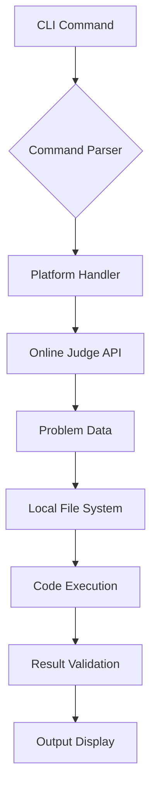

# `online-judge-tools`

## Repository Overview

### Tree Structure
```
online-judge-tools/
└── onlinejudge_command/
```

### Purpose
This repository provides command-line tools for interacting with online judge platforms such as AtCoder, Codeforces, and others. It enables developers and competitive programmers to:

- Download practice problems and test cases
- Submit solutions to online judges
- Test code locally against sample cases
- Manage contest environments and problem sets

The tools are particularly valuable for competitive programming preparation, algorithmic problem solving practice, and automating routine tasks in coding competitions.

### Target Users
- Competitive programmers preparing for contests
- Developers practicing algorithmic problem solving
- Educators teaching programming concepts through problem-solving
- Automation engineers building testing pipelines for coding challenges

### Position in Ecosystem
This is a standalone command-line utility built as a Python package. It serves as a bridge between local development environments and online judge systems, enabling seamless interaction with various competitive programming platforms.

### Architecture
The system follows a modular architecture centered around platform-specific handlers and a unified command interface. The core components form a pipeline where commands are parsed, platform-specific logic is invoked, and results are displayed or processed.

#### Data Flow Diagram (Mermaid)


### Entry Points
1. **CLI Interface**: Main entry point via `oj` command
   - Exposes subcommands like `download`, `submit`, `test`
   - Requires platform specification and problem identifiers
   - Intended for interactive use by competitive programmers

2. **Python API**: Importable modules for programmatic access
   - Modules under `onlinejudge_command` package
   - Allows integration into larger automation frameworks
   - Designed for developers building custom tools

### Core Features
1. **Problem Downloading** - Fetches problem statements and test cases from supported platforms
   - Implemented in `onlinejudge_command.download`
2. **Solution Submission** - Uploads code to online judges for evaluation
   - Implemented in `onlinejudge_command.submit`
3. **Local Testing** - Runs code against sample test cases
   - Implemented in `onlinejudge_command.test`
4. **Contest Management** - Handles contest-specific operations
   - Implemented in `onlinejudge_command.contest`

### Dependencies
- Python 3.7+
- Platform-specific libraries for HTTP communication
- Standard Python libraries (urllib, subprocess, etc.)
- External APIs for online judge platforms (AtCoder, Codeforces, etc.)

### Configuration
Configuration is primarily handled through command-line flags and environment variables:
- Platform credentials stored in environment variables
- Default directories for problem storage
- Timeout settings for network requests

### Extension Points
The system supports extension through:
- Plugin architecture for new online judge platforms
- Custom command handlers
- Hook mechanisms for preprocessing/postprocessing code

---

## Modules

- [`onlinejudge_command`](onlinejudge_command.md)

