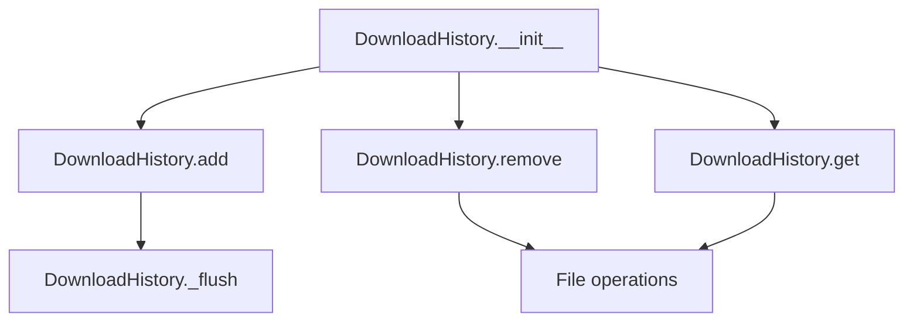

# `download_history.py`

## `onlinejudge_command.download_history.DownloadHistory` · *class*

## Summary:
Manages a history of downloaded problems by storing metadata about downloads in a JSONL file.

## Description:
The DownloadHistory class maintains a persistent record of problem downloads, allowing the system to track which problems have been downloaded to which directories. It provides methods to add entries, retrieve existing entries, and remove entries associated with a specific directory. This enables features like avoiding redundant downloads and tracking download progress.

## State:
- path: pathlib.Path - The file path where download history is stored. Defaults to a cache directory location.
- The class stores history in a JSONL (JSON Lines) format where each line contains a JSON object with timestamp, directory, and URL fields.

## Lifecycle:
- Creation: Instantiate with optional path parameter pointing to the history file location
- Usage: Call add() to record new downloads, get() to retrieve URLs for a directory, remove() to clear history for a directory
- Destruction: No explicit cleanup required; relies on filesystem for persistence

## Method Map:


## Raises:
- None explicitly raised by __init__
- File system related exceptions may occur during file operations in add(), remove(), and get() methods

## Example:
```python
# Create history instance
history = DownloadHistory()

# Add a download entry
problem = Problem("https://example.com/problem")
history.add(problem, directory=pathlib.Path("/tmp/problem1"))

# Retrieve URLs for a directory
urls = history.get(directory=pathlib.Path("/tmp/problem1"))

# Remove history for a directory
history.remove(directory=pathlib.Path("/tmp/problem1"))
```

### `onlinejudge_command.download_history.DownloadHistory.__init__` · *method*

## Summary:
Initializes a DownloadHistory object with a specified file path for storing download history data.

## Description:
This method sets up the file path where download history will be stored. It is called during object instantiation to configure the storage location for tracking downloaded problems. The default path uses the user's cache directory with a specific filename.

## Args:
    path (pathlib.Path): The file path where download history will be stored. Defaults to utils.user_cache_dir / 'download-history.jsonl'

## Returns:
    None: This method does not return a value.

## Raises:
    None: This method does not explicitly raise exceptions.

## State Changes:
    Attributes READ: None
    Attributes WRITTEN: self.path

## Constraints:
    Preconditions: None
    Postconditions: The self.path attribute will be set to the provided path or the default path.

## Side Effects:
    None: This method performs no I/O operations or external service calls.

### `onlinejudge_command.download_history.DownloadHistory.add` · *method*

## Summary:
Appends a download record to the history file containing timestamp, directory, and problem URL.

## Description:
This method adds a new entry to the download history file, recording when a problem was downloaded, where it was saved, and the problem's URL. It ensures the parent directory exists before writing and flushes the file to guarantee persistence. This method is part of the DownloadHistory class responsible for tracking problem downloads.

## Args:
    problem (Problem): The problem object containing the URL to be recorded.
    directory (pathlib.Path): The directory path where the problem was downloaded.

## Returns:
    None: This method does not return any value.

## Raises:
    IOError: If there are issues creating directories or writing to the history file.

## State Changes:
    Attributes READ: self.path
    Attributes WRITTEN: None

## Constraints:
    Preconditions: The `self.path` attribute must be set to a valid file path, and the `problem` argument must be a valid Problem instance with a get_url() method.
    Postconditions: The history file will contain a new JSON-formatted entry with timestamp, directory, and URL fields.

## Side Effects:
    I/O: Creates parent directories if they don't exist and writes to a file at self.path.
    External service calls: None
    Logging: Writes an info message to the logger indicating the history file being appended.

### `onlinejudge_command.download_history.DownloadHistory.remove` · *method*

## Summary:
Removes download history entries for a specified directory from the history file.

## Description:
This method clears all download history entries associated with a given directory from the persistent history file. It filters out entries where the 'directory' field matches the specified directory path, effectively cleaning up outdated or irrelevant download records.

The method operates on the history file represented by the instance's `path` attribute and is typically invoked when users want to remove download history for particular directories to prevent stale entries from persisting.

## Args:
    directory (pathlib.Path): The directory path for which download history should be removed. This is a keyword-only argument.

## Returns:
    None: This method does not return any value.

## Raises:
    None explicitly raised.

## State Changes:
    Attributes READ: self.path
    Attributes WRITTEN: None (modifies file content, not instance attributes)

## Constraints:
    Preconditions: The instance must have a valid path attribute pointing to an existing history file.
    Postconditions: The history file will no longer contain entries matching the specified directory.

## Side Effects:
    I/O operations: Reads from and writes to the file specified by self.path.
    External service calls: None.
    Mutations to objects outside self: Modifies the contents of the file at self.path.

### `onlinejudge_command.download_history.DownloadHistory._flush` · *method*

## Summary:
Flushes the download history file by halving its size when it exceeds 1MB to prevent excessive disk usage.

## Description:
This method manages the size of the download history file by checking if it exceeds 1MB in size. When the threshold is exceeded, it removes approximately half of the oldest entries from the file. This prevents the history file from growing indefinitely and consuming excessive disk space. The method is automatically called by the `add` method after each download operation to maintain reasonable file sizes.

## Args:
    None

## Returns:
    None

## Raises:
    FileNotFoundError: If the history file does not exist when trying to check its size or read from it.
    PermissionError: If there are insufficient permissions to read from or write to the history file.
    OSError: If there are general OS-level errors during file operations.

## State Changes:
    Attributes READ: self.path
    Attributes WRITTEN: None

## Constraints:
    Preconditions: The history file must exist and be readable/writable.
    Postconditions: If the file size exceeds 1MB, it will be reduced to approximately half its previous size.

## Side Effects:
    I/O operations: Reads the entire history file and writes back approximately half of its contents.
    External service calls: None
    Mutations to objects outside self: None

### `onlinejudge_command.download_history.DownloadHistory.get` · *method*

## Summary:
Retrieves a list of problem URLs from the download history that match a specified directory path.

## Description:
This method reads from a JSONL-formatted history file and filters entries by directory path, returning all unique problem URLs associated with that directory. It's designed to support the online judge command's ability to track previously downloaded problems by directory.

## Args:
    directory (pathlib.Path): The directory path to filter history entries by.

## Returns:
    List[str]: A list of unique problem URLs (as strings) that were previously downloaded to the specified directory. Returns an empty list if the history file doesn't exist.

## Raises:
    None explicitly raised, though JSON decode errors are logged and skipped.

## State Changes:
    Attributes READ: self.path
    Attributes WRITTEN: None

## Constraints:
    Preconditions: The method assumes self.path refers to a valid file path and that the history file contains properly formatted JSONL data where each line has 'directory' and 'url' keys.
    Postconditions: The returned list contains unique URLs and maintains insertion order due to the use of set for deduplication.

## Side Effects:
    I/O: Reads from the file system at self.path.
    Logging: Writes INFO and WARNING messages to the logger when encountering corrupted lines.

