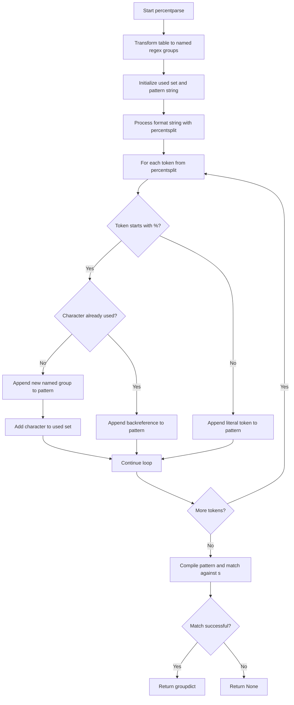
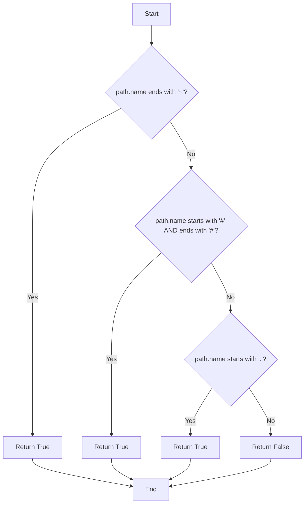

# `format_utils.py`

## `onlinejudge_command.format_utils.percentsplit` · *function*

## Summary:
Splits a string into segments at percent (%) characters while preserving escaped percent sequences.

## Description:
This function processes a string and yields segments that either contain literal percent characters or escaped percent sequences (like %s, %d). It uses regular expression matching to identify these patterns and ensures proper handling of percent escapes without splitting on them. The function is designed to handle percent-escaped formatting strings where literal percent signs should not be treated as separators.

## Args:
    s (str): Input string to be split into percent-separated segments.

## Returns:
    Generator[str, None, None]: A generator yielding string segments that represent either literal percent characters or escaped percent sequences.

## Raises:
    None explicitly raised.

## Constraints:
    Precondition: The input string must be a valid string object.
    Postcondition: All yielded segments will be non-empty strings representing either literal percent characters or escaped percent sequences.

## Side Effects:
    None.

## Control Flow:
```mermaid
flowchart TD
    A[Start percentsplit] --> B{Input string s}
    B --> C[Apply regex pattern '[^%]|%(.)' to s]
    C --> D[For each match m in results]
    D --> E[Yield m.group(0)]
    E --> F[Next match]
    F --> D
    D --> G{No more matches?}
    G -->|Yes| H[End generator]
```

## Examples:
    >>> list(percentsplit("Hello %s world"))
    ['Hello ', '%s', ' world']
    
    >>> list(percentsplit("No percent here"))
    ['No percent here']
    
    >>> list(percentsplit("Escaped %% sign"))
    ['Escaped ', '%%', ' sign']
    
    >>> list(percentsplit(""))
    []
    
    >>> list(percentsplit("%%%%"))
    ['%', '%', '%', '%']
```

## `onlinejudge_command.format_utils.percentformat` · *function*

## Summary:
Formats a string by replacing percent placeholders with values from a lookup table.

## Description:
Processes a string containing percent-encoded placeholders (like %s, %d) and substitutes them with corresponding values from a provided dictionary. This function handles special cases like escaped percent signs and ensures proper replacement of format specifiers.

## Args:
    s (str): Input string containing percent-encoded placeholders to be formatted.
    table (Dict[str, str]): Dictionary mapping placeholder characters to their replacement strings. The key '%%' is automatically handled.

## Returns:
    str: Formatted string with percent placeholders replaced by their corresponding values from the table.

## Raises:
    AssertionError: When the table contains a '%' key with a value that is not equal to '%'.

## Constraints:
    Precondition: The input string `s` must be a valid string object.
    Precondition: The `table` dictionary must not contain a '%' key with a value other than '%'.
    Postcondition: The returned string will have all percent placeholders replaced according to the mapping in `table`.

## Side Effects:
    None.

## Control Flow:
```mermaid
flowchart TD
    A[Start percentformat] --> B[Assert table constraint]
    B --> C[Set table['%'] = '%']
    C --> D[Initialize result = '']
    D --> E[For each segment from percentsplit(s)]
    E --> F{Segment starts with '%'}
    F -->|Yes| G[Lookup table[segment[1]]]
    G --> H[Append lookup result to result]
    F -->|No| I[Append segment to result]
    I --> J[Next segment]
    J --> E
    E --> K{No more segments?}
    K -->|Yes| L[Return result]
```

## Examples:
    >>> percentformat("Hello %s world", {"s": "beautiful"})
    'Hello beautiful world'
    
    >>> percentformat("Value: %d", {"d": "42"})
    'Value: 42'
    
    >>> percentformat("Escaped %% sign", {})
    'Escaped % sign'
```

## `onlinejudge_command.format_utils.percentparse` · *function*

## Summary:
Parses a string according to a percent-format template and extracts named capture groups into a dictionary.

## Description:
This function takes a format string with percent placeholders (like %s, %d) and a mapping of placeholder names to regex patterns, then attempts to match the input string against the constructed regex pattern. It returns a dictionary of matched named groups or None if no match occurs. This utility is commonly used for parsing structured text data where fields are identified by percent-based format specifiers.

The function works by first transforming the table of regex patterns into named capture groups, then building a complete regex pattern by processing each token from the format string. Tokens starting with '%' are replaced with named capture groups or backreferences, while literal tokens are preserved as-is.

## Args:
    s (str): The input string to parse against the format pattern.
    format (str): A format string containing percent placeholders (e.g., "%s %d") that define the expected structure.
    table (Dict[str, str]): A mapping from placeholder characters (like 's', 'd') to their corresponding regex patterns.

## Returns:
    Optional[Dict[str, str]]: A dictionary mapping placeholder names to their matched values, or None if the input string doesn't match the format.

## Raises:
    None explicitly raised.

## Constraints:
    Precondition: The input string `s` must be a valid string object.
    Precondition: The `format` string must be a valid string object.
    Precondition: The `table` dictionary must contain valid regex patterns as values.
    Postcondition: If a match is successful, the returned dictionary will contain keys corresponding to the placeholder characters in the format string.

## Side Effects:
    None.

## Control Flow:


## Examples:
    >>> table = {'s': '[a-zA-Z]+', 'd': '\\d+'}
    >>> percentparse('hello 123', '%s %d', table)
    {'s': 'hello', 'd': '123'}
    
    >>> percentparse('no match here', '%s %d', table)
    None
    
    >>> table = {'c': '.', 'w': '[a-zA-Z]+'}
    >>> percentparse('x hello', '%c %w', table)
    {'c': 'x', 'w': 'hello'}
    
    >>> # Test with repeated placeholders
    >>> table = {'s': '[a-zA-Z]+'}
    >>> percentparse('hello hello', '%s %s', table)
    {'s': 'hello'}
```

## `onlinejudge_command.format_utils.glob_with_format` · *function*

## Summary:
Finds files matching a format pattern within a directory, supporting platform-specific path separators and wildcard placeholders.

## Description:
This function constructs a glob pattern from a directory path and a format string, then searches for matching files. It handles Windows-specific path separator conversion and supports special format placeholders ('s' and 'e') that map to wildcards. The function is designed to locate test cases or similar files based on naming conventions.

## Args:
    directory (pathlib.Path): The root directory to search for matching files.
    format (str): A format string that specifies the pattern to match, potentially containing special placeholders.

## Returns:
    List[pathlib.Path]: A list of file paths that match the constructed glob pattern.

## Raises:
    None explicitly raised.

## Constraints:
    Precondition: The directory argument must be a valid pathlib.Path object.
    Precondition: The format argument must be a string.
    Postcondition: The returned list will contain pathlib.Path objects representing matched files.

## Side Effects:
    Logs debug messages for each matched file using the logger instance.
    Performs filesystem operations via glob.glob() to find matching files.

## Control Flow:
```mermaid
flowchart TD
    A[Start glob_with_format] --> B{Is Windows?}
    B -->|Yes| C[Replace / with \\ in format]
    B -->|No| D[Skip replacement]
    C --> E[Build lookup table]
    D --> E
    E --> F[Escape directory path]
    F --> G[Escape format string]
    G --> H[Replace escaped % with unescaped %]
    H --> I[Apply percentformat with table]
    I --> J[Concatenate directory and pattern]
    J --> K[Execute glob.glob()]
    K --> L[Map results to pathlib.Path]
    L --> M[Log each matched path]
    M --> N[Return list of paths]
```

## Examples:
    >>> glob_with_format(pathlib.Path('/tests'), 'input_%s.txt')
    [Path('/tests/input_1.txt'), Path('/tests/input_2.txt')]
    
    >>> glob_with_format(pathlib.Path('/data'), 'output_%e.dat')
    [Path('/data/output_abc.dat'), Path('/data/output_def.dat')]
```

## `onlinejudge_command.format_utils.match_with_format` · *function*

## Summary:
Matches a file path against a directory and format pattern to extract named groups.

## Description:
This function verifies whether a given file path matches a specified directory and format pattern. It is primarily used to validate and parse input/output file names according to a defined naming convention. The function handles platform-specific path separators and supports format specifiers like %s for name and %e for extension (in/out).

## Args:
    directory (pathlib.Path): The base directory path to match against.
    format (str): Format string containing placeholders (%s for name, %e for extension) to match against the path.
    path (pathlib.Path): The file path to check for matching the directory and format.

## Returns:
    Optional[Match[str]]: A regex match object if the path matches the pattern, otherwise None.

## Raises:
    None explicitly raised.

## Constraints:
    Precondition: All arguments must be valid pathlib.Path objects or strings that can be converted to pathlib.Path.
    Precondition: The format string must contain valid placeholders (%s, %e) for name and extension respectively.
    Postcondition: The returned match object will contain named groups 'name' and 'ext' if successful.

## Side Effects:
    None.

## Control Flow:
```mermaid
flowchart TD
    A[Start match_with_format] --> B{os.name == 'nt'?}
    B -->|Yes| C[Replace / with \\ in format]
    B -->|No| C[Skip replacement]
    C --> D[Initialize table with %s->(?P<name>.+) and %e->(?P<ext>in|out)]
    D --> E[Escape directory path and separator]
    E --> F[Replace % in format with %]
    F --> G[Apply percentformat to format string]
    G --> H[Compile regex pattern]
    H --> I[Match pattern against resolved path]
    I --> J[Return match result]
```

## Examples:
    >>> import pathlib
    >>> directory = pathlib.Path('/problems/a+b')
    >>> format_str = '%s.%e'
    >>> path = pathlib.Path('/problems/a+b/sample.in')
    >>> match_with_format(directory, format_str, path)
    <re.Match object; span=(0, 19), match='/problems/a+b/sample.in', groups=('sample', 'in')>

## `onlinejudge_command.format_utils.path_from_format` · *function*

## Summary:
Constructs a file path by formatting a template string with name and extension placeholders.

## Description:
This function takes a directory path, a format string with placeholders, and replacement values for name and extension, then returns the resulting file path. It uses the `percentformat` utility to process the format string, substituting '%s' with the name and '%e' with the extension.

## Args:
    directory (pathlib.Path): The base directory path where the file will be located.
    format (str): A format string containing placeholders '%s' (for name) and '%e' (for extension).
    name (str): The value to substitute for the '%s' placeholder in the format string.
    ext (str): The value to substitute for the '%e' placeholder in the format string.

## Returns:
    pathlib.Path: A new path object constructed by joining the directory with the formatted filename.

## Raises:
    AssertionError: If the internal `percentformat` function encounters invalid table configuration.

## Constraints:
    Precondition: The `directory` argument must be a valid pathlib.Path object.
    Precondition: The `format` argument must be a valid string containing only '%s' and '%e' placeholders.
    Precondition: The `name` and `ext` arguments must be strings.
    Postcondition: The returned path will be a valid pathlib.Path representing the joined directory and formatted filename.

## Side Effects:
    None.

## Control Flow:
```mermaid
flowchart TD
    A[Start path_from_format] --> B[Create table dict]
    B --> C[Set table['s'] = name]
    C --> D[Set table['e'] = ext]
    D --> E[Call percentformat(format, table)]
    E --> F[Join directory with formatted result]
    F --> G[Return pathlib.Path]
```

## Examples:
    >>> path_from_format(pathlib.Path('/tmp'), 'test_%s.%e', 'example', 'txt')
    PosixPath('/tmp/test_example.txt')
    
    >>> path_from_format(pathlib.Path('output'), 'data_%s_%e', 'file', 'csv')
    PosixPath('output/data_file_csv')
```

## `onlinejudge_command.format_utils.is_backup_or_hidden_file` · *function*

## Summary:
Determines whether a file path corresponds to a backup file, hidden file, or temporary file based on naming conventions.

## Description:
This function evaluates if a given file path represents a backup file (ending with '~'), a temporary file (enclosed in '#'), or a hidden file (starting with '.'). It is designed to filter out these types of files from processing in the online judge command utilities.

## Args:
    path (pathlib.Path): The file path to check for backup or hidden file status.

## Returns:
    bool: True if the file is identified as a backup file, hidden file, or temporary file; False otherwise.

## Raises:
    None

## Constraints:
    - Preconditions: The input must be a valid pathlib.Path object.
    - Postconditions: The function always returns a boolean value indicating the file type classification.

## Side Effects:
    None

## Control Flow:


## Examples:
    >>> import pathlib
    >>> is_backup_or_hidden_file(pathlib.Path("test.txt"))
    False
    >>> is_backup_or_hidden_file(pathlib.Path("test.txt~"))
    True
    >>> is_backup_or_hidden_file(pathlib.Path("#temp#"))
    True
    >>> is_backup_or_hidden_file(pathlib.Path(".hidden"))
    True
```

## `onlinejudge_command.format_utils.drop_backup_or_hidden_files` · *function*

## Summary:
Filters out backup files, hidden files, and temporary files from a list of file paths.

## Description:
Removes file paths that correspond to backup files (ending with '~'), hidden files (starting with '.'), or temporary files (enclosed in '#') from the input list. This function is used to clean file lists before processing, ensuring that auxiliary files are not mistakenly included in operations.

## Args:
    paths (List[pathlib.Path]): A list of file paths to filter.

## Returns:
    List[pathlib.Path]: A filtered list containing only paths that are not backup, hidden, or temporary files.

## Raises:
    None

## Constraints:
    - Preconditions: Input must be a list of valid pathlib.Path objects.
    - Postconditions: The returned list contains only paths that pass the backup/hidden file filtering criteria.

## Side Effects:
    - Logs a warning message via the logger when a backup or hidden file is encountered.

## Control Flow:
```mermaid
flowchart TD
    A[Start] --> B[Iterate through paths]
    B --> C{is_backup_or_hidden_file(path)?}
    C -- Yes --> D[Log warning]
    C -- No --> E[Add to result]
    D --> F[Continue]
    E --> F
    F --> G[Return result]
```

## Examples:
    >>> import pathlib
    >>> paths = [pathlib.Path("file1.txt"), pathlib.Path("file2.txt~"), pathlib.Path(".hidden")]
    >>> drop_backup_or_hidden_files(paths)
    [PosixPath('file1.txt')]
```

## `onlinejudge_command.format_utils.construct_relationship_of_files` · *function*

## Summary:
Constructs a hierarchical relationship between test case files by parsing their names according to a specified format pattern.

## Description:
This function processes a list of file paths and organizes them into a nested dictionary structure based on test case names and file extensions. It validates that each test case has both input and output files, and ensures proper formatting according to the provided format pattern. The function serves as a critical data preparation step for test case management in competitive programming environments.

## Args:
    paths (List[pathlib.Path]): List of file paths to process and organize.
    directory (pathlib.Path): Base directory path used for matching file patterns.
    format (str): Format string specifying how to parse file names, using %s for name and %e for extension.

## Returns:
    Dict[str, Dict[str, pathlib.Path]]: A nested dictionary mapping test case names to their file extensions and corresponding file paths. Each top-level key is a test case name, and each value is another dictionary mapping file extensions ('in', 'out') to their respective pathlib.Path objects.

## Raises:
    SystemExit: When encountering unrecognizable files, dangling output cases, or when no valid test cases are found.

## Constraints:
    Precondition: All paths in the input list must be valid file paths that can be resolved.
    Precondition: The format string must contain valid placeholders (%s for name, %e for extension).
    Precondition: Each test case must have either both 'in' and 'out' files or neither, with 'in' being mandatory for valid test cases.
    Postcondition: The returned dictionary will contain at least one test case with both 'in' and 'out' files.
    Postcondition: All file extensions in the returned dictionary will be either 'in' or 'out'.

## Side Effects:
    Writes error messages to the logger when invalid files are encountered.
    Terminates the program with exit code 1 when validation fails.

## Control Flow:
```mermaid
flowchart TD
    A[Start construct_relationship_of_files] --> B[Initialize empty tests dict]
    B --> C[Process each path in paths]
    C --> D{match_with_format succeeds?}
    D -->|No| E[Log error and exit]
    D -->|Yes| F[Extract name and ext from match]
    F --> G[Assert ext not already in tests[name]]
    G --> H[Store path in tests[name][ext]]
    H --> I[Loop to next path]
    I --> J[Check for dangling output cases]
    J --> K{Any test case missing 'in' but has 'out'?}
    K -->|Yes| L[Log error and exit]
    K -->|No| M[Check if tests is empty]
    M --> N{No test cases found?}
    N -->|Yes| O[Log error and exit]
    N -->|No| P[Log number of cases found]
    P --> Q[Return tests dictionary]
```

## Examples:
    >>> import pathlib
    >>> paths = [pathlib.Path('sample.in'), pathlib.Path('sample.out')]
    >>> directory = pathlib.Path('.')
    >>> format_str = '%s.%e'
    >>> result = construct_relationship_of_files(paths, directory, format_str)
    >>> print(result)
    {'sample': {'in': PosixPath('sample.in'), 'out': PosixPath('sample.out')}}

