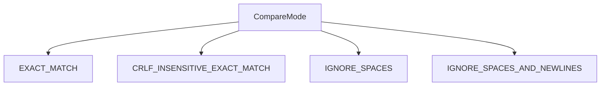

# `output_comparators.py`

## `onlinejudge_command.output_comparators.OutputComparator` · *class*

## Summary:
Abstract base class defining the interface for comparing actual and expected output in competitive programming problem evaluation.

## Description:
The OutputComparator class serves as a standardized interface for implementing various output comparison strategies used in competitive programming platforms. It defines a contract that concrete implementations must follow to determine whether a contestant's program output matches the expected output. This abstraction allows different comparison methods (exact match, floating-point tolerance, token-based comparison, etc.) to be used interchangeably within the evaluation framework.

## State:
- No instance attributes are defined in this abstract base class
- The class relies on subclasses to implement the comparison logic
- No constructor parameters or initialization requirements

## Lifecycle:
- Creation: Instances cannot be created directly due to ABC nature; subclasses must implement the abstract method
- Usage: Subclasses implement the `__call__` method to perform comparisons between actual and expected byte sequences
- Destruction: No special cleanup required as this is an abstract base class

## Method Map:
```mermaid
graph TD
    A[OutputComparator] --> B[Subclass Implementations]
    B --> C[__call__(actual: bytes, expected: bytes) -> bool]
    C --> D[Comparison Logic]
```

## Raises:
- NotImplementedError: Raised when the abstract method is not implemented by subclasses

## Example:
```python
# Abstract usage pattern
class ExactOutputComparator(OutputComparator):
    def __call__(self, actual: bytes, expected: bytes) -> bool:
        return actual == expected

comparator = ExactOutputComparator()
result = comparator(b"hello", b"hello")  # Returns True
```

### `onlinejudge_command.output_comparators.OutputComparator.__call__` · *method*

## Summary:
Abstract method that compares actual and expected output bytes to determine equivalence for judging submissions.

## Description:
This abstract method defines the core comparison interface used by the online judge system to evaluate whether a solution's output matches the expected result. It is invoked during test case evaluation to determine if a submission passes or fails. Concrete implementations provide specific comparison strategies such as exact matching, floating-point tolerance, or whitespace normalization.

## Args:
    actual (bytes): The output produced by the user's solution
    expected (bytes): The expected output for the test case

## Returns:
    bool: True if outputs are equivalent according to the comparison strategy, False otherwise

## Raises:
    NotImplementedError: This abstract method must be implemented by concrete subclasses

## State Changes:
    Attributes READ: None
    Attributes WRITTEN: None

## Constraints:
    Preconditions:
    - Both arguments must be bytes objects
    - Must be called on concrete subclass instances
    - Comparison should be deterministic for identical inputs
    
    Postconditions:
    - Always returns a boolean value
    - Behavior is defined by concrete implementation subclasses

## Side Effects:
    None

## `onlinejudge_command.output_comparators.ExactComparator` · *class*

## Summary:
ExactComparator is a concrete implementation of OutputComparator that performs byte-by-byte equality comparison between actual and expected outputs.

## Description:
This class implements the output comparison logic for cases where exact matching of byte sequences is required. It inherits from OutputComparator and provides a straightforward implementation of the `__call__` method that compares two byte sequences directly. This comparator is typically used when solutions must produce output that matches the expected output character-for-character, including whitespace and formatting.

## State:
- No instance attributes are maintained
- The class relies entirely on the parameters passed to the `__call__` method
- Inherits the abstract interface from OutputComparator

## Lifecycle:
- Creation: Instantiated like any other concrete subclass of OutputComparator
- Usage: Called with two bytes arguments (actual and expected) to perform comparison
- Destruction: No special cleanup required as it's a simple stateless comparator

## Method Map:
```mermaid
graph TD
    A[ExactComparator] --> B[__call__(actual: bytes, expected: bytes) -> bool]
    B --> C{Byte Comparison}
    C --> D[Return True if equal]
    C --> E[Return False if different]
```

## Raises:
- No exceptions are explicitly raised by this implementation
- Any exceptions would originate from the parent class or argument handling outside this method

## Example:
```python
comparator = ExactComparator()
result = comparator(b"hello world", b"hello world")  # Returns True
result = comparator(b"hello", b"world")             # Returns False
```

### `onlinejudge_command.output_comparators.ExactComparator.__call__` · *method*

## Summary:
Compares two byte sequences for exact equality and returns a boolean result.

## Description:
This method performs a direct byte-by-byte comparison between the actual output and expected output of a program execution. It is designed to be used as part of the output comparison mechanism in competitive programming problem solving tools, specifically for cases where exact matching is required.

## Args:
    actual (bytes): The actual output produced by the solution being tested
    expected (bytes): The expected output that the solution should produce

## Returns:
    bool: True if the actual and expected byte sequences are identical, False otherwise

## Raises:
    None explicitly raised

## State Changes:
    Attributes READ: None
    Attributes WRITTEN: None

## Constraints:
    Preconditions: Both arguments must be of type bytes
    Postconditions: Returns a boolean value indicating exact equality of the byte sequences

## Side Effects:
    None

## `onlinejudge_command.output_comparators.FloatingPointNumberComparator` · *class*

## Summary:
A comparator that determines equality between floating-point numbers within specified relative and absolute tolerances, falling back to exact byte comparison for non-numeric inputs.

## Description:
The FloatingPointNumberComparator class implements a flexible comparison strategy for competitive programming output evaluation. It treats input bytes as floating-point numbers when possible, using Python's math.isclose function with configurable relative and absolute tolerances. When either input cannot be converted to a float, it performs an exact byte-wise comparison instead. This approach is particularly useful for problems where small numerical precision differences should be ignored.

## State:
- rel_tol: float, relative tolerance for floating-point comparison, must be >= 0
- abs_tol: float, absolute tolerance for floating-point comparison, must be >= 0

## Lifecycle:
- Creation: Instantiate with keyword arguments rel_tol and abs_tol
- Usage: Call the instance with actual and expected byte sequences as parameters
- Destruction: No special cleanup required

## Method Map:
```mermaid
graph TD
    A[FloatingPointNumberComparator] --> B[__call__(actual, expected)]
    B --> C{Can convert to float?}
    C -->|Yes| D[math.isclose(x, y, rel_tol, abs_tol)]
    C -->|No| E[actual == expected]
```

## Raises:
- None explicitly raised by __init__, but logs a warning when max(rel_tol, abs_tol) > 1

## Example:
```python
comparator = FloatingPointNumberComparator(rel_tol=1e-9, abs_tol=1e-12)
result = comparator(b"3.14159", b"3.141592")  # Returns True if within tolerance
result = comparator(b"hello", b"world")  # Returns False (exact comparison)
```

### `onlinejudge_command.output_comparators.FloatingPointNumberComparator.__init__` · *method*

## Summary:
Initializes a FloatingPointNumberComparator with relative and absolute tolerance settings for floating-point number comparisons.

## Description:
The __init__ method configures the tolerance parameters for floating-point comparisons. It validates that the maximum of relative and absolute tolerance values is not excessively large (greater than 1.0) and stores the provided tolerance values as instance attributes. This initialization occurs during object creation and sets up the comparison behavior for subsequent calls to the comparator. The validation helps prevent unexpected behavior when comparing floating-point numbers with overly generous tolerances.

## Args:
    rel_tol (float): Relative tolerance for floating-point comparison, must be non-negative
    abs_tol (float): Absolute tolerance for floating-point comparison, must be non-negative

## Returns:
    None: This method does not return a value

## Raises:
    None: This method does not raise exceptions directly, but logs a warning when max(rel_tol, abs_tol) > 1

## State Changes:
    Attributes READ: None
    Attributes WRITTEN: self.rel_tol, self.abs_tol

## Constraints:
    Preconditions: Both rel_tol and abs_tol must be non-negative floats
    Postconditions: The instance will store the provided tolerance values and issue a warning if max(rel_tol, abs_tol) > 1.0

## Side Effects:
    I/O: Logs a warning message via the logger when tolerance values are too large

### `onlinejudge_command.output_comparators.FloatingPointNumberComparator.__call__` · *method*

## Summary:
Compares two byte sequences as floating-point numbers with configurable relative and absolute tolerance, falling back to exact byte comparison for non-numeric inputs.

## Description:
This method implements a custom output comparator for competitive programming environments where floating-point precision differences are common. It attempts to convert both actual and expected byte sequences to floating-point numbers. If both conversions succeed, it uses `math.isclose()` with configured relative and absolute tolerances to determine equality. If either conversion fails, it performs exact byte string comparison.

This logic is encapsulated in its own method to provide a clean interface for comparing output in competitive programming contexts where floating-point precision issues are common. The method handles edge cases like non-numeric inputs gracefully by falling back to exact matching.

## Args:
    actual (bytes): The actual output bytes to compare
    expected (bytes): The expected output bytes to compare

## Returns:
    bool: True if the values are considered equal according to the comparison logic, False otherwise

## Raises:
    None explicitly raised

## State Changes:
    Attributes READ: self.rel_tol, self.abs_tol
    Attributes WRITTEN: None

## Constraints:
    Preconditions: 
    - Both actual and expected parameters must be bytes objects
    - self.rel_tol and self.abs_tol must be set in the instance
    Postconditions:
    - Returns boolean indicating whether the comparison result is equal

## Side Effects:
    None

## `onlinejudge_command.output_comparators.SplitComparator` · *class*

## Summary:
A wrapper comparator that splits output into words and compares them using a provided word-level comparator.

## Description:
The SplitComparator is a decorator pattern implementation that wraps another OutputComparator to perform word-by-word comparison of actual and expected outputs. It splits both byte sequences into tokens using whitespace as delimiters, ensures matching token counts, and delegates individual token comparisons to the wrapped word_comparator. This enables flexible output comparison strategies where individual words can be compared with different tolerances or rules while maintaining overall structural validation.

## State:
- word_comparator: OutputComparator instance used to compare individual words (bytes)
  - Type: OutputComparator
  - Valid range: Any concrete implementation of OutputComparator
  - Invariant: Must be a valid comparator that accepts bytes and returns boolean

## Lifecycle:
- Creation: Instantiate with a valid OutputComparator instance
- Usage: Call the instance with actual and expected byte sequences
- Destruction: No special cleanup required (standard Python object lifecycle)

## Method Map:
```mermaid
graph TD
    A[SplitComparator.__call__] --> B[actual.split()]
    A --> C[expected.split()]
    A --> D[len(actual_words) != len(expected_words)?]
    D -->|True| E[return False]
    D -->|False| F[zip(actual_words, expected_words)]
    F --> G[self.word_comparator(x, y)]
    G --> H[return False if any fail]
    G --> I[return True if all pass]
```

## Raises:
- None explicitly raised by SplitComparator.__init__
- Exceptions may propagate from the underlying word_comparator during comparison

## Example:
```python
# Create a word comparator (e.g., exact match)
exact_word_comp = ExactOutputComparator()

# Wrap it with SplitComparator
split_comp = SplitComparator(exact_word_comp)

# Compare outputs
result = split_comp(b"hello world", b"hello world")  # Returns True
result = split_comp(b"hello   world", b"hello world")  # Returns True (whitespace normalized)
result = split_comp(b"hello world", b"hello universe")  # Returns False (word mismatch)
```

### `onlinejudge_command.output_comparators.SplitComparator.__init__` · *method*

## Summary:
Initializes a SplitComparator instance with a word-level comparator for token-based output comparison.

## Description:
The SplitComparator's constructor accepts a word-level comparator and stores it as an instance attribute. This comparator is used by the `__call__` method to compare individual tokens (words) between actual and expected output. The SplitComparator splits both outputs into tokens using whitespace and applies the provided word comparator to each pair of corresponding tokens.

## Args:
    word_comparator (OutputComparator): A callable object that implements the OutputComparator interface for comparing individual words/tokens. Must accept two byte strings and return a boolean indicating whether they match.

## Returns:
    None: This method initializes the instance but does not return a value.

## Raises:
    None: This method does not raise any exceptions directly.

## State Changes:
    Attributes READ: None
    Attributes WRITTEN: self.word_comparator

## Constraints:
    Preconditions: The word_comparator argument must be a callable object implementing the OutputComparator interface.
    Postconditions: The instance will have its word_comparator attribute set to the provided value.

## Side Effects:
    None: This method performs no I/O operations or external service calls. It only assigns the provided comparator to an instance attribute.

### `onlinejudge_command.output_comparators.SplitComparator.__call__` · *method*

## Summary:
Compares two byte sequences by splitting them into words and applying a word-level comparator to each pair of words.

## Description:
This method implements a word-by-word comparison strategy where both actual and expected byte sequences are split into tokens using whitespace as delimiters. It ensures that the number of words matches and applies a configured word comparator to each corresponding pair of words. This approach is commonly used for token-based output validation in competitive programming problems where whitespace variations should not affect correctness.

The method is designed as a callable interface that integrates with the broader output comparison framework, allowing different word comparison strategies (exact match, floating-point tolerance, etc.) to be plugged in through the word_comparator dependency. It serves as a bridge between the high-level output comparison interface and the low-level word-by-word comparison logic.

## Args:
    actual (bytes): The actual output bytes to compare
    expected (bytes): The expected output bytes to compare

## Returns:
    bool: True if both sequences contain the same number of words and each corresponding word pair compares equal using the configured word_comparator; False otherwise

## Raises:
    None explicitly raised - relies on word_comparator for any exceptions

## State Changes:
    Attributes READ: self.word_comparator
    Attributes WRITTEN: None

## Constraints:
    Preconditions:
        - Both actual and expected parameters must be valid bytes objects
        - The word_comparator attribute must be a callable that accepts two bytes arguments and returns a boolean
    Postconditions:
        - The method returns a boolean indicating whether the word-wise comparison succeeded
        - No modifications are made to the object's state

## Side Effects:
    None - No I/O operations, external service calls, or mutations to external objects occur

## `onlinejudge_command.output_comparators.SplitLinesComparator` · *class*

## Summary:
A comparator that splits output into lines and compares each line using a provided line-level comparator.

## Description:
The SplitLinesComparator is a concrete implementation of OutputComparator that processes byte string outputs by splitting them into lines and applying a line-by-line comparison strategy. It serves as a wrapper around another OutputComparator instance that handles individual line comparisons. This class is particularly useful for implementing output validators that need to compare multi-line outputs while maintaining flexibility in how individual lines are compared.

## State:
- line_comparator: OutputComparator instance used to compare individual lines
  - Type: OutputComparator
  - Valid range: Any concrete implementation of OutputComparator
  - Invariant: Must be a valid OutputComparator instance that implements __call__(bytes, bytes) -> bool

## Lifecycle:
- Creation: Instantiate with a line_comparator parameter (required)
- Usage: Call the instance with actual and expected byte strings to perform line-by-line comparison
- Destruction: No special cleanup required as this is a simple wrapper class

## Method Map:
```mermaid
graph TD
    A[SplitLinesComparator.__call__] --> B[actual.rstrip(b'\\n').split(b'\\n')]
    A --> C[expected.rstrip(b'\\n').split(b'\\n')]
    B --> D[Zip actual_lines with expected_lines]
    D --> E[Apply line_comparator to each pair]
    E --> F{line_comparator result}
    F -->|False| G[Return False]
    F -->|True| H[Continue to next pair]
    H -->|All pairs matched| I[Return True]
```

## Raises:
- None explicitly raised by SplitLinesComparator.__init__
- Any exceptions raised by the underlying line_comparator during comparison are propagated

## Example:
```python
# Create a line comparator (e.g., exact match)
exact_line_comp = ExactOutputComparator()

# Create split lines comparator
split_comp = SplitLinesComparator(exact_line_comp)

# Compare multi-line outputs
actual_output = b"line1\nline2\nline3"
expected_output = b"line1\nline2\nline3"
result = split_comp(actual_output, expected_output)  # Returns True
```

### `onlinejudge_command.output_comparators.SplitLinesComparator.__init__` · *method*

## Summary:
Initializes a SplitLinesComparator with a line-level comparator for comparing multi-line outputs.

## Description:
The `__init__` method sets up a SplitLinesComparator instance by storing the provided line comparator. This comparator will be used to evaluate individual lines when comparing multi-line outputs. The method is part of the SplitLinesComparator class constructor and establishes the core comparison strategy for line-by-line evaluation.

## Args:
    line_comparator (OutputComparator): A concrete implementation of OutputComparator that will be used to compare individual lines of output. This parameter is required and must be a valid OutputComparator instance.

## Returns:
    None: This method does not return any value.

## Raises:
    None: This method does not explicitly raise any exceptions.

## State Changes:
    Attributes READ: None
    Attributes WRITTEN: 
    - self.line_comparator: Stores the provided line_comparator parameter as an instance attribute

## Constraints:
    Preconditions:
    - The line_comparator parameter must be a valid instance of OutputComparator or its subclass
    - The line_comparator must implement the __call__(actual: bytes, expected: bytes) -> bool interface
    
    Postconditions:
    - The self.line_comparator attribute will reference the provided line_comparator instance
    - No other instance attributes are modified or created by this method

## Side Effects:
    None: This method performs no I/O operations, external service calls, or mutations to objects outside the instance being initialized.

### `onlinejudge_command.output_comparators.SplitLinesComparator.__call__` · *method*

## Summary:
Compares two byte sequences line-by-line using a nested line comparator.

## Description:
This method splits both actual and expected byte sequences into lines, ensuring they have the same number of lines. It then applies the configured line comparator to each pair of corresponding lines. The comparison succeeds only if all line pairs match according to the line comparator. This method is part of the SplitLinesComparator class which implements the OutputComparator abstract base class.

## Args:
    actual (bytes): The actual output bytes to compare
    expected (bytes): The expected output bytes to compare against

## Returns:
    bool: True if both sequences have the same number of lines and all corresponding lines match, False otherwise

## Raises:
    None explicitly raised

## State Changes:
    Attributes READ: self.line_comparator
    Attributes WRITTEN: None

## Constraints:
    Preconditions: Both actual and expected must be valid byte sequences
    Postconditions: Returns boolean indicating line-by-line equality with the configured line comparator

## Side Effects:
    None

## `onlinejudge_command.output_comparators.CRLFInsensitiveComparator` · *class*

## Summary:
A decorator comparator that normalizes CRLF line endings to LF before delegating comparison to another comparator.

## Description:
The CRLFInsensitiveComparator is a wrapper class that preprocesses byte sequences by replacing all CRLF (`\r\n`) line endings with LF (`\n`) before passing them to an underlying file comparator. This ensures that output comparisons are insensitive to platform-specific line ending conventions, making tests more portable across Windows, Unix, and macOS systems.

## State:
- file_comparator: OutputComparator
  - Type: OutputComparator
  - Valid range: Any concrete implementation of OutputComparator
  - Invariant: Must be a callable object that accepts two bytes arguments and returns a boolean

## Lifecycle:
- Creation: Instantiate with a file_comparator parameter (required)
- Usage: Call the instance with actual and expected bytes arguments
- Destruction: No special cleanup required

## Method Map:
```mermaid
graph TD
    A[CRLFInsensitiveComparator] --> B[file_comparator]
    B --> C[__call__(actual: bytes, expected: bytes) -> bool]
    C --> D[Normalize CRLF to LF]
    D --> E[Delegate to underlying comparator]
```

## Raises:
- None explicitly raised by this class
- Any exceptions are propagated from the underlying file_comparator

## Example:
```python
# Create a comparator that ignores CRLF differences
from onlinejudge_command.output_comparators import ExactOutputComparator, CRLFInsensitiveComparator

# Wrap an exact comparator to make it CRLF-insensitive
comparator = CRLFInsensitiveComparator(ExactOutputComparator())

# Compare outputs with different line endings
result = comparator(b"hello\r\nworld", b"hello\nworld")  # Returns True
```

### `onlinejudge_command.output_comparators.CRLFInsensitiveComparator.__init__` · *method*

## Summary:
Initializes a CRLFInsensitiveComparator with a nested file comparator for handling line ending differences.

## Description:
This method sets up a CRLFInsensitiveComparator instance by storing a reference to another OutputComparator that will be used to perform the actual comparison after normalizing line endings from CRLF (\r\n) to LF (\n). This decorator pattern allows the comparator to preprocess input data by standardizing line endings before delegating the comparison to the underlying file comparator.

## Args:
    file_comparator (OutputComparator): Another OutputComparator instance that will handle the actual comparison logic after line ending normalization.

## Returns:
    None: This method does not return a value.

## Raises:
    None: This method does not raise any exceptions.

## State Changes:
    Attributes READ: None
    Attributes WRITTEN: self.file_comparator

## Constraints:
    Preconditions: The file_comparator argument must be a valid OutputComparator instance.
    Postconditions: The self.file_comparator attribute will reference the provided OutputComparator instance.

## Side Effects:
    None: This method performs no I/O operations or external service calls. It only stores a reference to the provided comparator.

### `onlinejudge_command.output_comparators.CRLFInsensitiveComparator.__call__` · *method*

## Summary:
Compares two byte sequences for equality while ignoring CRLF vs LF line ending differences.

## Description:
This method normalizes line endings in both actual and expected byte sequences by converting all CRLF (`\r\n`) occurrences to LF (`\n`) before delegating the comparison to an underlying file comparator. It enables robust output comparison across different platforms that may use varying line ending conventions.

## Args:
    actual (bytes): The actual output bytes to compare.
    expected (bytes): The expected output bytes to compare against.

## Returns:
    bool: True if the normalized actual and expected byte sequences are considered equal by the underlying file comparator; False otherwise.

## Raises:
    None explicitly raised. Any exceptions are propagated from the underlying `file_comparator`.

## State Changes:
    Attributes READ: self.file_comparator
    Attributes WRITTEN: None

## Constraints:
    Preconditions: 
    - Both `actual` and `expected` must be valid bytes objects.
    - The `file_comparator` attribute must be a callable that accepts two bytes arguments and returns a boolean.
    
    Postconditions:
    - The method returns the result of comparing the normalized byte sequences.
    - No modifications are made to the instance's state.

## Side Effects:
    None. This method performs no I/O operations or external service calls. It only processes the input bytes and delegates to another comparator.

## `onlinejudge_command.output_comparators.CompareMode` · *class*

## Summary:
An enumeration defining different modes for comparing output in competitive programming problem solving.

## Description:
The CompareMode class represents various strategies for comparing expected and actual output in competitive programming environments. It provides standardized comparison modes that can be used to determine whether two output strings are equivalent according to different tolerance levels. This abstraction allows the system to handle different output formatting requirements without hardcoding comparison logic throughout the codebase.

## State:
- EXACT_MATCH: Enum value representing exact string matching with no tolerance for whitespace differences
- CRLF_INSENSITIVE_EXACT_MATCH: Enum value representing exact matching while treating CRLF and LF line endings equivalently
- IGNORE_SPACES: Enum value representing comparison that ignores all whitespace characters (spaces, tabs, etc.)
- IGNORE_SPACES_AND_NEWLINES: Enum value representing comparison that ignores all whitespace and newline characters

All enum values are defined with string representations that correspond to their intended behavior.

## Lifecycle:
- Creation: Instances are created automatically as part of the enum definition; no explicit instantiation required
- Usage: Used as constants in comparison logic throughout the system
- Destruction: Managed automatically by Python's enum mechanism

## Method Map:


## Raises:
- No exceptions are raised during initialization as this is a simple enum definition

## Example:
```python
# Usage in comparison logic
mode = CompareMode.EXACT_MATCH
if mode == CompareMode.IGNORE_SPACES:
    # Apply space-ignoring comparison
    pass
```

## `onlinejudge_command.output_comparators.check_lines_match` · *function*

## Summary:
Compares two string outputs using a specified comparison mode and returns whether they match.

## Description:
This function serves as a factory and dispatcher for different output comparison strategies. It takes two string inputs and a comparison mode, then applies the appropriate comparator to determine if the outputs are equivalent according to the specified tolerance level. The function is designed to support various competitive programming output comparison requirements including exact matching, CRLF-insensitive matching, and space-normalized matching.

Known callers within the codebase:
- This function is likely called by test case evaluation logic when comparing contestant output against expected output
- It may be invoked during submission validation or automated judging processes

The logic is extracted into its own function to centralize comparison mode selection and avoid duplication of comparator instantiation and dispatch logic throughout the codebase. This creates a clean separation between the choice of comparison strategy and the actual comparison implementation.

## Args:
- a (str): The first output string to compare
- b (str): The second output string to compare  
- compare_mode (CompareMode): The comparison strategy to use, one of:
  - EXACT_MATCH: Byte-per-byte exact comparison
  - CRLF_INSENSITIVE_EXACT_MATCH: Exact comparison ignoring CRLF vs LF line endings
  - IGNORE_SPACES: Comparison that normalizes whitespace between words
  - IGNORE_SPACES_AND_NEWLINES: Not allowed for this function (raises RuntimeError)

## Returns:
- bool: True if the outputs match according to the specified comparison mode, False otherwise

## Raises:
- RuntimeError: When compare_mode is set to IGNORE_SPACES_AND_NEWLINES, as this mode is not supported by this function

## Constraints:
- Preconditions: Both input strings must be valid UTF-8 strings
- Postconditions: The function always returns a boolean value indicating match status

## Side Effects:
- No I/O operations or external state mutations occur
- The function is pure and has no side effects beyond returning a boolean result

## Control Flow:
```mermaid
flowchart TD
    A[check_lines_match] --> B{compare_mode}
    B -->|EXACT_MATCH| C[ExactComparator()]
    B -->|CRLF_INSENSITIVE_EXACT_MATCH| D[CRLFInsensitiveComparator(ExactComparator())]
    B -->|IGNORE_SPACES| E[SplitComparator(ExactComparator())]
    B -->|IGNORE_SPACES_AND_NEWLINES| F[RuntimeError]
    B -->|Invalid| G[assert False]
    C --> H[comparator(a.encode(), b.encode())]
    D --> H
    E --> H
    F --> I[raise RuntimeError]
    G --> I
    H --> J[Return boolean result]
    I --> J
```

## Examples:
```python
# Exact matching
result = check_lines_match("hello world", "hello world", compare_mode=CompareMode.EXACT_MATCH)
# Returns True

# CRLF insensitive matching  
result = check_lines_match("hello\r\nworld", "hello\nworld", compare_mode=CompareMode.CRLF_INSENSITIVE_EXACT_MATCH)
# Returns True

# Space normalization matching
result = check_lines_match("hello   world", "hello world", compare_mode=CompareMode.IGNORE_SPACES)
# Returns True

# Error case - unsupported mode
try:
    check_lines_match("test", "test", compare_mode=CompareMode.IGNORE_SPACES_AND_NEWLINES)
except RuntimeError as e:
    print(e)  # "CompareMode.IGNORE_SPACES_AND_NEWLINES is not allowed for this function"
```

