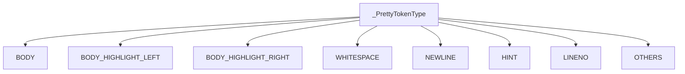
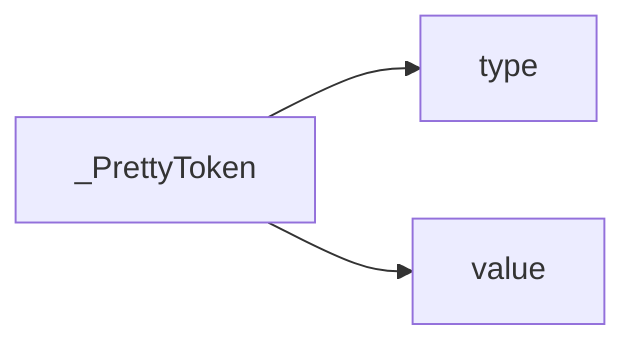
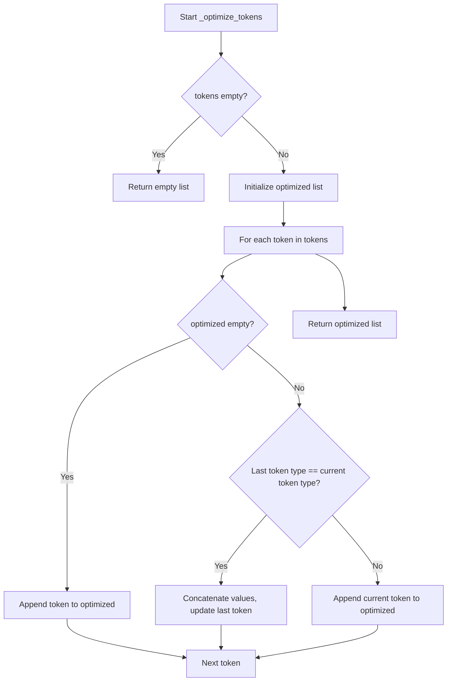
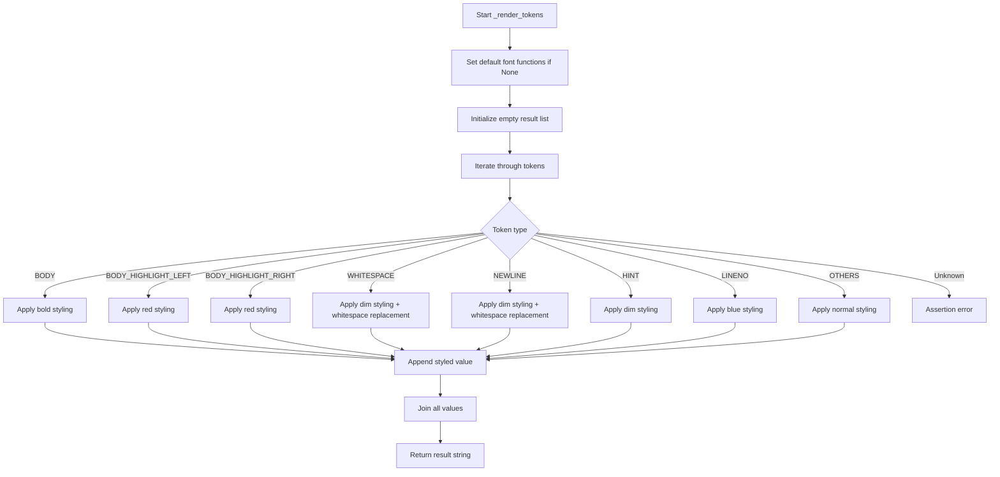
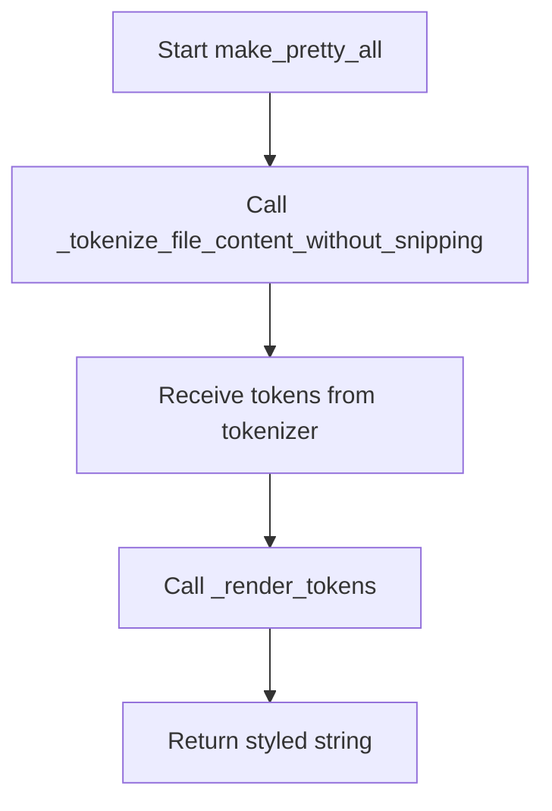
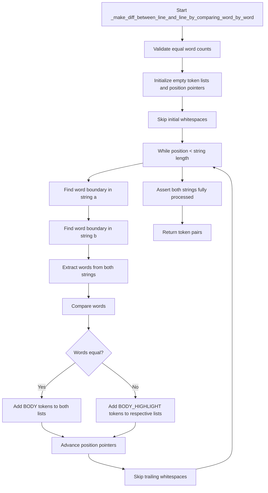
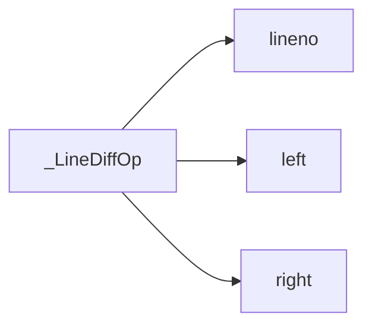

# `pretty_printers.py`

## `onlinejudge_command.pretty_printers._PrettyTokenType` · *class*

## Summary:
An enumeration defining token types used for pretty printing and formatting output in the online judge command system.

## Description:
This class represents a set of predefined token types that are used throughout the pretty printing system to categorize different parts of formatted output. It serves as a standardized way to identify and handle various components of displayed content, such as body text, highlights, whitespace, newlines, hints, line numbers, and other elements. The enum values are string constants that provide semantic meaning to different parts of the formatted output.

## State:
- Each enum member represents a specific token type with a string value:
  - BODY: Represents regular body text content
  - BODY_HIGHLIGHT_LEFT: Left side of highlighted body text
  - BODY_HIGHLIGHT_RIGHT: Right side of highlighted body text
  - WHITESPACE: Whitespace characters
  - NEWLINE: Newline characters
  - HINT: Hint or annotation text
  - LINENO: Line number indicators
  - OTHERS: Other unspecified token types

## Lifecycle:
- Creation: Automatically created as part of the enum definition; no explicit instantiation required
- Usage: Used as constants throughout the pretty printing system to categorize output tokens
- Destruction: Managed automatically by Python's enum mechanism

## Method Map:


## Raises:
- No exceptions are raised during initialization as this is a simple enum class

## Example:
```python
# Usage in pretty printing context
token_type = _PrettyTokenType.BODY
print(token_type.value)  # Output: "BODY"
```

## `onlinejudge_command.pretty_printers._PrettyToken` · *class*

## Summary:
Represents a formatted token used in pretty printing with a type identifier and textual value.

## Description:
The `_PrettyToken` class is a named tuple that encapsulates a formatted token consisting of a type and its associated string value. It serves as a fundamental building block for representing formatted output elements in the pretty printing system. This class is typically instantiated by factories or internal methods within the pretty printing module and used to construct formatted displays.

## State:
- `type`: `_PrettyTokenType` - The category/type of the token (e.g., BODY, HINT, WHITESPACE)
- `value`: `str` - The actual string content of the token

## Lifecycle:
- Creation: Instantiated using the standard named tuple constructor with `type` and `value` arguments
- Usage: Tokens are typically processed in sequences by pretty printing functions to generate formatted output
- Destruction: Managed automatically by Python's garbage collector

## Method Map:


## Raises:
- No exceptions are raised during initialization as this is a simple named tuple

## Example:
```python
# Create a token
token = _PrettyToken(_PrettyTokenType.BODY, "Hello World")
print(token.type)   # Output: _PrettyTokenType.BODY
print(token.value)  # Output: "Hello World"
```

## `onlinejudge_command.pretty_printers._optimize_tokens` · *function*

## Summary:
Combines consecutive tokens of the same type into single tokens with concatenated values.

## Description:
This function optimizes a list of pretty-printing tokens by merging adjacent tokens that have identical types. It reduces the number of tokens by consolidating sequential tokens of the same type into a single token with the combined value. This optimization is useful for reducing the overhead of processing many small tokens and improving rendering efficiency.

The function is typically called during the pretty-printing process when preparing formatted output for display or comparison. It's part of the token processing pipeline that handles formatting of output content.

## Args:
    tokens (List[_PrettyToken]): A list of pretty-printing tokens to optimize. Each token has a type and a string value.

## Returns:
    List[_PrettyToken]: A new list of tokens where consecutive tokens of the same type have been merged into single tokens with concatenated values.

## Raises:
    None explicitly raised.

## Constraints:
    Preconditions:
    - Input tokens list can be empty
    - Each token in the input list must have a valid type and value
    - The _PrettyToken type must support concatenation of values via the '+' operator
    
    Postconditions:
    - The returned list contains the same total content as the input list
    - No two consecutive tokens in the result will have the same type
    - The order of tokens is preserved
    - All original token values are preserved, just potentially concatenated

## Side Effects:
    None.

## Control Flow:


## Examples:
    Example 1: Basic optimization
    Input: [token(type="text", value="Hello"), token(type="text", value=" "), token(type="text", value="World")]
    Output: [token(type="text", value="Hello World")]

    Example 2: Mixed types
    Input: [token(type="text", value="A"), token(type="text", value="B"), token(type="number", value="123"), token(type="text", value="C")]
    Output: [token(type="text", value="AB"), token(type="number", value="123"), token(type="text", value="C")]

## `onlinejudge_command.pretty_printers._tokenize_str` · *function*

## Summary:
Breaks a string into tokens based on consecutive whitespace and non-whitespace character groups.

## Description:
This function processes a string and segments it into tokens where each token consists of either consecutive whitespace characters or consecutive non-whitespace characters. It's designed to support pretty printing operations by providing a structured representation of text content that can be formatted appropriately.

The function is typically called internally by pretty printing utilities when preparing text for display formatting. It's extracted as a separate utility function to encapsulate the tokenization logic and make it reusable across different formatting contexts.

## Args:
    s (str): The input string to tokenize

## Returns:
    List[_PrettyToken]: A list of tokens where each token contains a type (_PrettyTokenType.WHITESPACE or _PrettyTokenType.BODY) and the corresponding substring

## Raises:
    No exceptions are explicitly raised by this function

## Constraints:
    Preconditions:
    - Input string `s` must be a valid string object
    - Function assumes ASCII-compatible character handling
    
    Postconditions:
    - All characters from the input string are included in the returned tokens
    - Each token's value is a contiguous substring of the original string
    - Tokens are ordered sequentially according to their position in the input string

## Side Effects:
    None

## Control Flow:
```mermaid
flowchart TD
    A[Start _tokenize_str] --> B[Initialize tokens=[], l=0]
    B --> C{l < len(s)?}
    C -->|Yes| D[Set r = l+1]
    D --> E[While r < len(s) and (s[l] in ' \\t') == (s[r] in ' \\t')]
    E --> F[r += 1]
    F --> G[End While]
    G --> H[s[l] in ' \\t'?]
    H -->|Yes| I[typ = _PrettyTokenType.WHITESPACE]
    H -->|No| J[typ = _PrettyTokenType.BODY]
    I --> K[Create _PrettyToken(typ, s[l:r])]
    J --> K
    K --> L[tokens.append(_PrettyToken(...))]
    L --> M[l = r]
    M --> C
    C -->|No| N[Return tokens]
```

## Examples:
```python
# Basic usage
tokens = _tokenize_str("hello world")
# Returns: [_PrettyToken(_PrettyTokenType.BODY, "hello"), _PrettyToken(_PrettyTokenType.WHITESPACE, " "), _PrettyToken(_PrettyTokenType.BODY, "world")]

# Whitespace grouping
tokens = _tokenize_str("  hello\t\tworld  ")
# Returns: [_PrettyToken(_PrettyTokenType.WHITESPACE, "  "), _PrettyToken(_PrettyTokenType.BODY, "hello"), _PrettyToken(_PrettyTokenType.WHITESPACE, "\t\t"), _PrettyToken(_PrettyTokenType.BODY, "world"), _PrettyToken(_PrettyTokenType.WHITESPACE, "  ")]
```

## `onlinejudge_command.pretty_printers._tokenize_line` · *function*

## Summary:
Breaks a line into formatted tokens including body content, whitespace, and newline characters, with special handling for trailing whitespace.

## Description:
Processes a line of text by splitting it into tokens that represent different components of the line: body content, whitespace, and newlines. This function specifically handles the case where a line may contain trailing whitespace that needs to be specially marked. It's used internally by pretty printing utilities to prepare lines for formatted display.

The function separates the line into two parts: the body (everything up to the last newline character) and the trailing newline portion. It then tokenizes the body using `_tokenize_str` and processes the trailing newline portion specially to detect and mark trailing whitespace.

This logic is extracted into its own function to encapsulate the complex line parsing and tokenization logic, making it reusable and testable while keeping the pretty printing pipeline modular.

## Args:
    line (str): The input line to tokenize, potentially containing trailing newlines and whitespace

## Returns:
    List[_PrettyToken]: A list of formatted tokens representing the line components, including:
        - Body tokens for non-whitespace content
        - Whitespace tokens for space and tab characters
        - Newline tokens for \n or \r\n sequences
        - Hint tokens for trailing whitespace detection
        - Empty list if the input line is empty

## Raises:
    No exceptions are explicitly raised by this function

## Constraints:
    Preconditions:
    - Input `line` must be a valid string object
    - Function assumes ASCII-compatible character handling
    
    Postconditions:
    - All characters from the input line are represented in the returned tokens
    - Tokens are ordered sequentially according to their position in the input line
    - Trailing whitespace is specially marked with a hint token

## Side Effects:
    None

## Control Flow:
```mermaid
flowchart TD
    A[Start _tokenize_line] --> B[body = line.rstrip()]
    B --> C[newline = line[len(body):]]
    C --> D[tokens = []]
    D --> E[body != ""?]
    E -->|Yes| F[tokens += _tokenize_str(body)]
    E -->|No| G[Skip body processing]
    F --> H[newline != ""?]
    H -->|Yes| I[newline in ('\n', '\r\n')?]
    I -->|Yes| J[Add NEWLINE token]
    I -->|No| K[whitespace = newline.rstrip('\n')]
    K --> L[newline = newline[len(whitespace):]]
    L --> M[whitespace != ""?]
    M -->|Yes| N[Add WHITESPACE token]
    M -->|No| O[Skip whitespace token]
    N --> P[Add HINT token]
    P --> Q[newline != ""?]
    Q -->|Yes| R[Add NEWLINE token]
    Q -->|No| S[Skip final newline token]
    J --> T[Return tokens]
    R --> T
    O --> P
    S --> T
```

## Examples:
```python
# Basic line with body and newline
tokens = _tokenize_line("hello world\n")
# Returns: [_PrettyToken(_PrettyTokenType.BODY, "hello"), _PrettyToken(_PrettyTokenType.WHITESPACE, " "), _PrettyToken(_PrettyTokenType.BODY, "world"), _PrettyToken(_PrettyTokenType.NEWLINE, "\n")]

# Line with trailing whitespace
tokens = _tokenize_line("hello world   \n")
# Returns: [_PrettyToken(_PrettyTokenType.BODY, "hello"), _PrettyToken(_PrettyTokenType.WHITESPACE, " "), _PrettyToken(_PrettyTokenType.BODY, "world"), _PrettyToken(_PrettyTokenType.WHITESPACE, "   "), _PrettyToken(_PrettyTokenType.HINT, "(trailing whitespace)"), _PrettyToken(_PrettyTokenType.NEWLINE, "\n")]

# Empty line
tokens = _tokenize_line("\n")
# Returns: [_PrettyToken(_PrettyTokenType.NEWLINE, "\n")]
```

## `onlinejudge_command.pretty_printers._decode_with_recovery` · *function*

## Summary:
Decodes binary content into text while capturing decoding errors as formatted tokens for display.

## Description:
This function attempts to decode binary content into a UTF-8 string. When a UnicodeDecodeError occurs, it captures the error information as a HINT token and continues decoding with error replacement to produce a usable text representation. This approach ensures that even malformed content can be displayed with informative error hints.

## Args:
    content (bytes): Binary data to be decoded into text

## Returns:
    Tuple[List[_PrettyToken], str]: A tuple containing:
        - A list of _PrettyToken objects (containing error hints when decoding fails)
        - The decoded text string (either normal or with replacement characters)

## Raises:
    None explicitly raised - handles UnicodeDecodeError internally

## Constraints:
    Preconditions:
        - The content parameter must be of type bytes
        - The function assumes UTF-8 decoding as the primary method
    
    Postconditions:
        - Always returns a tuple with two elements: a list of tokens and a string
        - The returned text string will always be valid UTF-8 (even if with replacement characters)

## Side Effects:
    None

## Control Flow:
```mermaid
flowchart TD
    A[Start _decode_with_recovery] --> B{Try decode()}
    B -->|Success| C[Return tokens=[], text]
    B -->|UnicodeDecodeError| D[Create HINT token]
    D --> E[Decode with errors='replace']
    E --> F[Return tokens, text]
```

## Examples:
```python
# Normal case - valid UTF-8 content
content = b"Hello, world!"
tokens, text = _decode_with_recovery(content)
# tokens = []
# text = "Hello, world!"

# Error case - invalid UTF-8 content
content = b"\xff\xfe\xfd"
tokens, text = _decode_with_recovery(content)
# tokens = [_PrettyToken(HINT, "codec can't decode byte ...")]
# text = "���" (replacement characters)
```

## `onlinejudge_command.pretty_printers._warn_if_empty` · *function*

## Summary:
Adds hint tokens to indicate empty or improperly formatted output tokens.

## Description:
This function analyzes a list of pretty-printing tokens and appends appropriate hint tokens to indicate special formatting conditions such as empty input, missing trailing newlines, or only newlines. It serves as a utility for enhancing output readability by providing contextual information about the formatting state.

## Args:
    tokens (List[_PrettyToken]): A list of pretty-printing tokens to analyze and potentially modify. Each token is a named tuple with a type (_PrettyTokenType) and value (str).

## Returns:
    List[_PrettyToken]: The modified list of tokens with additional hint tokens appended when applicable. The original tokens list is not mutated; a new list is returned.

## Raises:
    None explicitly raised.

## Constraints:
    Preconditions:
        - The input tokens list must be a valid list of _PrettyToken objects.
        - Each token in the list must have a valid type attribute matching _PrettyTokenType enum values.
    Postconditions:
        - The returned list contains all original tokens plus zero or more hint tokens.
        - The original tokens list is not mutated; a new list is returned.

## Side Effects:
    None.

## Control Flow:
```mermaid
flowchart TD
    A[Start _warn_if_empty] --> B{tokens empty?}
    B -- Yes --> C[Return [(HINT, '(empty)')] hint]
    B -- No --> D[tokens[-1] BODY?]
    D -- Yes --> E[Append (HINT, '(no trailing newline)') hint]
    D -- No --> F[Check all tokens NEWLINE?]
    F -- Yes --> G[Append (HINT, '(only newline)') hint]
    F -- No --> H[Return original tokens]
    E --> H
    G --> H
```

## Examples:
Example 1: Empty tokens list
Input: []
Output: [(_PrettyTokenType.HINT, '(empty)')]

Example 2: Tokens with body content
Input: [(_PrettyTokenType.BODY, 'content')]
Output: [(_PrettyTokenType.BODY, 'content'), (_PrettyTokenType.HINT, '(no trailing newline)')]

Example 3: Only newline tokens
Input: [(_PrettyTokenType.NEWLINE, '\n'), (_PrettyTokenType.NEWLINE, '\n')]
Output: [(_PrettyTokenType.NEWLINE, '\n'), (_PrettyTokenType.NEWLINE, '\n'), (_PrettyTokenType.HINT, '(only newline)')]

## `onlinejudge_command.pretty_printers._tokenize_large_file_content` · *function*

## Summary:
Tokenizes large binary file content into formatted tokens with intelligent truncation strategies.

## Description:
Processes binary file content by decoding it into text and tokenizing it into formatted tokens. When the content exceeds size limits, it applies intelligent truncation strategies to preserve important context while avoiding excessive output. This function serves as a core utility for displaying large files in a readable format, particularly useful in debugging and output comparison scenarios.

The function implements three truncation strategies:
1. Do-nothing strategy: Processes content normally without truncation
2. Line-based strategy: Shows head and tail lines with a hint indicating skipped lines  
3. Character-based strategy: Shows head and tail character ranges with a hint indicating skipped characters

It selects the most compact representation among these strategies to minimize output size while preserving meaningful content.

Known callers within the codebase:
- Called by `onlinejudge_command.pretty_printers._print_diff` when formatting large files for diff display
- Triggered during output comparison operations when file sizes exceed configured limits

This logic is extracted into its own function to encapsulate the complexity of multi-strategy truncation and tokenization, making it reusable and testable while keeping the pretty printing pipeline modular.

## Args:
    content (bytes): Binary content to be tokenized
    limit (int): Maximum number of lines/characters to display before applying truncation
    head (int): Number of lines/characters to show from the beginning of content
    tail (int): Number of lines/characters to show from the end of content
    char_in_line (int): Average number of characters per line for character-based truncation

## Returns:
    List[_PrettyToken]: A list of formatted tokens representing the processed content, including:
        - Body tokens for regular content
        - Hint tokens for truncation indicators
        - Whitespace and newline tokens for proper formatting
        - Empty list if content is empty or processing fails

## Raises:
    AssertionError: When head + tail >= limit, indicating invalid configuration parameters

## Constraints:
    Preconditions:
        - The content parameter must be of type bytes
        - head + tail must be strictly less than limit (assertion enforced)
        - All integer parameters must be non-negative
        - The function assumes UTF-8 decoding as the primary method
    Postconditions:
        - Always returns a list of _PrettyToken objects
        - The returned tokens are properly formatted for pretty printing
        - Truncation strategies are applied consistently based on content size
        - The returned text string will always be valid UTF-8 (even if with replacement characters)

## Side Effects:
    None

## Control Flow:
```mermaid
flowchart TD
    A[Start _tokenize_large_file_content] --> B[assert head + tail < limit]
    B --> C[tokens, text = _decode_with_recovery(content)]
    C --> D{text present?}
    D -- Yes --> E[candidates = [do_nothing, line_based, char_based]]
    E --> F[min_candidate = min(candidates, key=count_size)]
    F --> G[tokens.extend(min_candidate)]
    G --> H[_warn_if_empty(tokens)]
    H --> I[Return tokens]
    D -- No --> J[_warn_if_empty(tokens)]
    J --> I
```

## Examples:
```python
# Basic usage with small content (no truncation)
content = b"Line 1\nLine 2\nLine 3\n"
tokens = _tokenize_large_file_content(
    content=content,
    limit=10,
    head=5,
    tail=5,
    char_in_line=80
)
# Returns tokens representing all lines without truncation

# Large content with line-based truncation
large_content = b"\n".join([f"Line {i}".encode() for i in range(100)]) + b"\n"
tokens = _tokenize_large_file_content(
    content=large_content,
    limit=10,
    head=3,
    tail=3,
    char_in_line=80
)
# Returns tokens showing first 3 lines, hint about 94 skipped lines, last 3 lines

# Content with decoding errors
invalid_content = b"\xff\xfe\xfd"
tokens = _tokenize_large_file_content(
    content=invalid_content,
    limit=10,
    head=5,
    tail=5,
    char_in_line=80
)
# Returns tokens with error hint and replacement characters
```

## `onlinejudge_command.pretty_printers._replace_whitespace` · *function*

## Summary:
Replaces whitespace characters in a string with visible escape sequences for better display and comparison.

## Description:
This function transforms common whitespace characters into their visible representations to facilitate clearer output display and easier debugging. It specifically handles space, tab, and carriage return characters by replacing them with underscore, backslash-t, and backslash-r respectively. This function is typically used in pretty printing contexts where raw whitespace characters would be difficult to distinguish or interpret.

## Args:
    s (str): The input string containing whitespace characters to be replaced.

## Returns:
    str: A new string where space characters are replaced with underscores, tab characters with backslash-t, and carriage return characters with backslash-r.

## Raises:
    None

## Constraints:
    Preconditions: The input must be a string.
    Postconditions: The returned string will have all space, tab, and carriage return characters replaced according to the mapping.

## Side Effects:
    None

## Control Flow:
```mermaid
flowchart TD
    A[Input string s] --> B{Is s a string?}
    B -- Yes --> C[Replace ' ' with '_']
    C --> D[Replace '\t' with '\\t']
    D --> E[Replace '\r' with '\\r']
    E --> F[Return transformed string]
    B -- No --> G[Exception handling (not applicable)]
```

## Examples:
    >>> _replace_whitespace("hello world")
    'hello_world'
    
    >>> _replace_whitespace("line1\ttabbed")
    'line1\\ttabbed'
    
    >>> _replace_whitespace("carriage\rreturn")
    'carriage\\rreturn'
```

## `onlinejudge_command.pretty_printers._render_tokens` · *function*

## Summary:
Transforms a sequence of formatted tokens into a styled string representation with color coding and special formatting.

## Description:
Converts a list of `_PrettyToken` objects into a formatted string with appropriate styling applied based on token types. This function serves as the core rendering engine for pretty-printed output, applying different visual styles (bold, dim, colored text) to various token categories while handling whitespace replacement for better visibility.

The function is designed to be reusable across different pretty printing contexts and allows customization of styling through optional callback functions. It extracts the formatting logic from inline code to promote code organization and maintainability.

## Args:
    tokens (List[_PrettyToken]): A sequence of formatted tokens to render, where each token consists of a type and value.
    font_bold (Optional[Callable[[str], str]]): Optional callback to apply bold formatting to text. Defaults to colorama-based bold styling.
    font_dim (Optional[Callable[[str], str]]): Optional callback to apply dim/desaturated formatting to text. Defaults to colorama-based dim styling.
    font_red (Optional[Callable[[str], str]]): Optional callback to apply red color formatting to text. Defaults to colorama-based red styling.
    font_blue (Optional[Callable[[str], str]]): Optional callback to apply blue color formatting to text. Defaults to colorama-based blue styling.
    font_normal (Optional[Callable[[str], str]]): Optional callback to apply normal/unformatted styling to text. Defaults to identity function.

## Returns:
    str: A concatenated string with all tokens rendered with their respective formatting applied.

## Raises:
    AssertionError: When an unexpected token type is encountered (should not occur with valid token types).

## Constraints:
    Preconditions: 
    - All tokens in the input list must be valid `_PrettyToken` instances
    - Token types must be members of `_PrettyTokenType` enum
    - Input tokens list must be iterable
    
    Postconditions:
    - The returned string contains all token values with appropriate styling applied
    - No tokens are lost in the transformation process

## Side Effects:
    - Uses colorama for terminal styling (stdout output)
    - May modify the appearance of terminal output through ANSI escape codes

## Control Flow:


## Examples:
    >>> tokens = [
    ...     _PrettyToken(_PrettyTokenType.BODY, "Hello"),
    ...     _PrettyToken(_PrettyTokenType.WHITESPACE, " "),
    ...     _PrettyToken(_PrettyTokenType.HINT, "world!")
    ... ]
    >>> result = _render_tokens(tokens=tokens)
    >>> print(result)
    'Hello world!'

## `onlinejudge_command.pretty_printers._get_terminal_size` · *function*

## Summary:
Returns the width of the terminal in characters, ensuring a minimum width of 40 characters.

## Description:
This function retrieves the terminal width using `shutil.get_terminal_size()` and ensures that the returned value is at least 40 characters wide. It is designed to prevent issues when the terminal is too narrow for proper display formatting.

## Args:
    None

## Returns:
    int: The terminal width in characters, guaranteed to be at least 40.

## Raises:
    OSError: If the terminal size cannot be determined, typically when running in an environment without a proper terminal.

## Constraints:
    Preconditions: The function assumes that the program is running in an environment where terminal size detection is possible.
    Postconditions: The returned integer will always be greater than or equal to 40.

## Side Effects:
    None

## Control Flow:
```mermaid
flowchart TD
    A[Call shutil.get_terminal_size()] --> B{Success?}
    B -- Yes --> C[Extract char_in_line]
    C --> D[Return max(char_in_line, 40)]
    B -- No --> E[Raise OSError]
```

## Examples:
    # In a normal terminal environment
    >>> _get_terminal_size()
    80
    
    # In a very narrow terminal or non-terminal environment  
    >>> _get_terminal_size()
    40

## `onlinejudge_command.pretty_printers.make_pretty_large_file_content` · *function*

## Summary:
Formats large binary file content into a styled, truncated string suitable for terminal display.

## Description:
Processes binary file content by decoding it into text and converting it into a formatted string with intelligent truncation and color styling. When the content exceeds the specified size limit, it applies truncation strategies to preserve important context while minimizing output size. This function is primarily used for displaying large files in a readable format during debugging and output comparison operations.

The function is called by `onlinejudge_command.pretty_printers._print_diff` when formatting large files for diff display, triggered during output comparison operations when file sizes exceed configured limits. This logic is extracted into its own function to encapsulate the complexity of multi-strategy truncation and tokenization, making it reusable and testable while keeping the pretty printing pipeline modular.

## Args:
    content (bytes): Binary content to be formatted and displayed
    limit (int): Maximum number of lines/characters to display before applying truncation
    head (int): Number of lines/characters to show from the beginning of content
    tail (int): Number of lines/characters to show from the end of content

## Returns:
    str: A formatted string representation of the file content with appropriate styling and truncation applied

## Raises:
    AssertionError: When head + tail >= limit, indicating invalid configuration parameters

## Constraints:
    Preconditions:
        - The content parameter must be of type bytes
        - head + tail must be strictly less than limit (assertion enforced)
        - All integer parameters must be non-negative
    Postconditions:
        - Always returns a properly formatted string with styling applied
        - The returned string contains all token values with appropriate styling applied

## Side Effects:
    - Uses colorama for terminal styling (stdout output)
    - May modify the appearance of terminal output through ANSI escape codes

## Control Flow:
```mermaid
flowchart TD
    A[Start make_pretty_large_file_content] --> B[Get terminal width using _get_terminal_size()]
    B --> C[Tokenize content using _tokenize_large_file_content()]
    C --> D[Render tokens using _render_tokens()]
    D --> E[Return formatted string]
```

## `onlinejudge_command.pretty_printers._tokenize_file_content_without_snipping` · *function*

## Summary:
Processes binary file content into a list of formatted tokens for pretty printing, handling decoding errors gracefully.

## Description:
Converts raw binary content into a sequence of formatted tokens suitable for pretty printing. This function decodes the binary content into text, tokenizes each line, and adds appropriate warning tokens for empty or improperly formatted output. It's designed to handle malformed content gracefully by using recovery mechanisms during decoding.

The function is typically called during the pretty printing pipeline when preparing file content for display. It's extracted into its own function to separate the concerns of content decoding, line-by-line tokenization, and post-processing warnings, making the pretty printing process modular and easier to test.

## Args:
    content (bytes): Binary file content to be converted into formatted tokens

## Returns:
    List[_PrettyToken]: A list of formatted tokens representing the decoded content, including:
        - Tokens for decoded text content
        - Tokens for whitespace and newlines
        - Hint tokens for decoding errors or formatting issues
        - Empty list if the content is empty

## Raises:
    None explicitly raised - decoding errors are handled internally

## Constraints:
    Preconditions:
        - The content parameter must be of type bytes
        - Content should be valid binary data that can be decoded to UTF-8
    
    Postconditions:
        - Always returns a list of _PrettyToken objects
        - The returned tokens accurately represent the content with proper formatting

## Side Effects:
    None

## Control Flow:
```mermaid
flowchart TD
    A[Start _tokenize_file_content_without_snipping] --> B[Call _decode_with_recovery(content)]
    B --> C[tokens, text = result]
    C --> D[Split text into lines with keepends=True]
    D --> E[For each line in lines]
    E --> F[Call _tokenize_line(line)]
    F --> G[Append tokens from _tokenize_line to tokens]
    G --> H[Call _warn_if_empty(tokens)]
    H --> I[Return final tokens list]
```

## Examples:
```python
# Normal case with valid UTF-8 content
content = b"Hello\nWorld\n"
tokens = _tokenize_file_content_without_snipping(content)
# Returns list of tokens representing "Hello\nWorld\n"

# Empty content
content = b""
tokens = _tokenize_file_content_without_snipping(content)
# Returns empty list []

# Content with decoding issues (handled gracefully)
content = b"\xff\xfe\xfd"
tokens = _tokenize_file_content_without_snipping(content)
# Returns tokens with HINT tokens indicating decoding problems
```

## `onlinejudge_command.pretty_printers.make_pretty_all` · *function*

## Summary:
Transforms binary file content into a colorized, formatted string representation for enhanced readability.

## Description:
Processes raw binary content through a two-stage pipeline: first tokenizing the content into structured tokens with formatting metadata, then rendering those tokens into a visually styled string. This function serves as the main entry point for pretty-printing file content, enabling clear visualization of text structure with appropriate styling for different content types.

The function is extracted from inline processing to provide a clean interface for pretty printing operations, separating the concerns of content parsing and presentation formatting. It enables consistent, readable output across different file types and content scenarios.

## Args:
    content (bytes): Raw binary file content to be transformed into a formatted string representation

## Returns:
    str: A colorized and formatted string representation of the input content, with appropriate styling applied to different content types (text, whitespace, newlines, etc.)

## Raises:
    None explicitly raised - internal tokenization and rendering functions handle their own error conditions

## Constraints:
    Preconditions:
        - Input content must be of type bytes
        - Content should be valid binary data that can be processed by internal tokenization functions
    
    Postconditions:
        - Returns a properly formatted string with visual styling applied
        - All content from input is preserved in the output with appropriate formatting

## Side Effects:
    - Uses colorama for terminal styling (stdout output)
    - May modify the appearance of terminal output through ANSI escape codes

## Control Flow:


## Examples:
```python
# Basic usage with valid content
content = b"Hello\nWorld\n"
result = make_pretty_all(content)
# Returns a colorized string representation of "Hello\nWorld\n"

# Empty content
content = b""
result = make_pretty_all(content)
# Returns empty string
```

## `onlinejudge_command.pretty_printers._skip_whitespaces` · *function*

## Summary:
Skips whitespace characters in a string and returns the updated index along with optimized tokens for those characters.

## Description:
This function processes consecutive whitespace characters (spaces, tabs, carriage returns, and newlines) starting from a given index in a string. It identifies whether each character is a space/tab (WHITESPACE type) or newline/carriage return (NEWLINE type), creates individual tokens for each character, and returns both the new index position and the optimized token list. This function is used internally by pretty printing utilities to handle whitespace formatting.

The function is extracted into its own utility to separate the concerns of whitespace detection and token creation from the higher-level pretty printing logic, making the code more modular and testable.

## Args:
    i (int): The starting index in the string to process whitespace characters from.
    s (str): The input string being processed for whitespace characters.

## Returns:
    Tuple[int, List[_PrettyToken]]: A tuple containing:
        - The new index position after skipping all consecutive whitespace characters
        - A list of _PrettyToken objects representing the skipped whitespace characters, optimized by merging consecutive characters of the same type

## Raises:
    None explicitly raised.

## Constraints:
    Preconditions:
    - The input index `i` must be within the bounds of the string `s` (0 <= i <= len(s))
    - The input string `s` must be a valid string object
    
    Postconditions:
    - The returned index will be either at the end of the string or pointing to the first non-whitespace character
    - The returned tokens list will contain only WHITESPACE and NEWLINE token types
    - The tokens will be optimized to merge consecutive characters of the same type

## Side Effects:
    None.

## Control Flow:
```mermaid
flowchart TD
    A[Start _skip_whitespaces] --> B[i < len(s) and s[i] in ' \\t\\r\\n'?]
    B -- No --> C[Return (i, _optimize_tokens([]))]
    B -- Yes --> D[Initialize empty tokens list]
    D --> E[Loop while i < len(s) and s[i] in ' \\t\\r\\n']
    E --> F{s[i] in ' \\t'?}
    F -- Yes --> G[Set typ = _PrettyTokenType.WHITESPACE]
    F -- No --> H[Set typ = _PrettyTokenType.NEWLINE]
    G --> I[Append _PrettyToken(typ, s[i]) to tokens]
    H --> I
    I --> J[i += 1]
    J --> E
    E --> K[Return (i, _optimize_tokens(tokens))]
```

## Examples:
Example 1: Processing leading whitespace
Input: i=0, s="   hello"
Output: (3, [token(type=WHITESPACE, value="   ")])

Example 2: Processing mixed whitespace
Input: i=0, s=" \t\n  world"
Output: (5, [token(type=WHITESPACE, value=" \t"), token(type=NEWLINE, value="\n")])

Example 3: Processing at end of string
Input: i=5, s="hello"
Output: (5, [])
```

## `onlinejudge_command.pretty_printers._make_diff_between_line_and_line_by_comparing_word_by_word` · *function*

## Summary:
Compares two strings word-by-word and generates formatted token sequences highlighting differences between them.

## Description:
This function performs a detailed comparison of two strings at the word level, breaking each string into individual words and comparing them character-by-character. When words differ, it marks them with special highlight tokens to indicate the differences. The function assumes both strings contain the same number of words (validated via assertion) and processes them character-by-character to identify word boundaries.

The function is designed to be used in pretty-printing contexts where visual differences between expected and actual output need to be clearly highlighted. It's extracted from the main diff logic to provide a reusable component for word-level comparison operations.

## Args:
    a (str): First string to compare, typically representing expected output
    b (str): Second string to compare, typically representing actual output

## Returns:
    Tuple[List[_PrettyToken], List[_PrettyToken]]: A pair of lists containing formatted tokens for each string respectively. Each token represents either a matching word (BODY type) or a differing word (BODY_HIGHLIGHT_LEFT/RIGHT types) with appropriate highlighting.

## Raises:
    AssertionError: When the two input strings do not contain the same number of words after stripping whitespace

## Constraints:
    Preconditions:
    - Both input strings must contain the same number of words (after stripping whitespace)
    - Input strings must be valid Python strings
    
    Postconditions:
    - Both returned token lists will contain exactly the same number of tokens
    - All tokens in the first list will correspond to tokens in the second list at the same positions
    - The function will process the entire length of both input strings

## Side Effects:
    None.

## Control Flow:


## Examples:
Example 1: Identical strings
Input: a="hello world", b="hello world"
Output: ([_PrettyToken(BODY, "hello"), _PrettyToken(BODY, "world")], [_PrettyToken(BODY, "hello"), _PrettyToken(BODY, "world")])

Example 2: Different words
Input: a="hello world", b="hello there"
Output: ([_PrettyToken(BODY, "hello"), _PrettyToken(BODY_HIGHLIGHT_LEFT, "world")], [_PrettyToken(BODY, "hello"), _PrettyToken(BODY_HIGHLIGHT_RIGHT, "there")])

## `onlinejudge_command.pretty_printers._tokenize_str_with_highlight` · *function*

## Summary:
Creates a list of formatted tokens with highlight styling applied to body content based on the comparison direction.

## Description:
This function takes a string and applies highlight styling to its body tokens while preserving the structure of whitespace and other token types. It's used in pretty printing contexts where visual distinction is needed between matching and non-matching content during output comparison. The function delegates the initial tokenization to `_tokenize_str` and then selectively modifies body tokens to include appropriate highlight types based on the `is_right` parameter.

The function is extracted to separate the concern of applying highlight styling from the core tokenization logic, enabling reuse in different pretty printing scenarios where highlighting behavior may vary based on context (left vs right comparison).

## Args:
    s (str): The input string to tokenize and apply highlighting to
    is_right (bool): Flag indicating whether to apply right-side highlighting (True) or left-side highlighting (False)

## Returns:
    List[_PrettyToken]: A list of tokens where body tokens are replaced with highlighted versions based on the is_right flag

## Raises:
    No exceptions are explicitly raised by this function

## Constraints:
    Preconditions:
    - Input string `s` must be a valid string object
    - The `_tokenize_str` function must be available and working correctly
    - The `_PrettyTokenType` enum must contain the required highlight token types
    
    Postconditions:
    - All characters from the input string are included in the returned tokens
    - Each token's value is a contiguous substring of the original string
    - Tokens are ordered sequentially according to their position in the input string
    - Body tokens are converted to appropriate highlight types based on the is_right flag

## Side Effects:
    None

## Control Flow:
```mermaid
flowchart TD
    A[Start _tokenize_str_with_highlight] --> B[Initialize tokens=[]]
    B --> C[Call _tokenize_str(s)]
    C --> D[Iterate over tokens]
    D --> E[token.type == _PrettyTokenType.BODY?]
    E -->|Yes| F[Select highlight type based on is_right]
    F --> G[Create new _PrettyToken with highlight type]
    G --> H[Append to tokens]
    E -->|No| I[Append original token to tokens]
    I --> J[Return tokens]
```

## Examples:
```python
# Basic usage with left highlighting
tokens = _tokenize_str_with_highlight("hello world", is_right=False)
# Returns: [_PrettyToken(_PrettyTokenType.BODY_HIGHLIGHT_LEFT, "hello"), _PrettyToken(_PrettyTokenType.WHITESPACE, " "), _PrettyToken(_PrettyTokenType.BODY_HIGHLIGHT_LEFT, "world")]

# Basic usage with right highlighting  
tokens = _tokenize_str_with_highlight("hello world", is_right=True)
# Returns: [_PrettyToken(_PrettyTokenType.BODY_HIGHLIGHT_RIGHT, "hello"), _PrettyToken(_PrettyTokenType.WHITESPACE, " "), _PrettyToken(_PrettyTokenType.BODY_HIGHLIGHT_RIGHT, "world")]
```

## `onlinejudge_command.pretty_printers._make_diff_between_line_and_line_by_difflib` · *function*

## Summary:
Computes a diff between two strings using difflib and converts the differences into formatted pretty-printing tokens.

## Description:
This function performs a line-by-line difference analysis between two strings using Python's difflib.SequenceMatcher. It identifies matching and differing segments and converts them into formatted tokens suitable for pretty printing. The resulting tokens preserve the structural information of the original strings while marking differences with appropriate highlighting.

The function is extracted to encapsulate the complex logic of diff computation and token conversion, separating it from the higher-level pretty printing orchestration. This allows for reuse in different comparison contexts while maintaining clean separation of concerns.

## Args:
    a (str): First string to compare
    b (str): Second string to compare

## Returns:
    Tuple[List[_PrettyToken], List[_PrettyToken]]: A pair of token lists where the first contains tokens for string a and the second contains tokens for string b, with appropriate highlighting for differences

## Raises:
    AssertionError: When internal assumptions about difflib opcodes are violated (should not occur under normal circumstances)

## Constraints:
    Preconditions:
    - Both input strings must be valid string objects
    - The helper functions _tokenize_str_with_highlight, _tokenize_str, and _optimize_tokens must be properly implemented
    - The _PrettyTokenType enum must contain the required token types
    
    Postconditions:
    - All characters from both input strings are represented in the returned token lists
    - Tokens are properly ordered to reflect the original string structure
    - Differences are marked with appropriate highlight types
    - The returned token lists are optimized for efficient processing

## Side Effects:
    None

## Control Flow:
```mermaid
flowchart TD
    A[Start _make_diff_between_line_and_line_by_difflib] --> B[Initialize tokens_a, tokens_b]
    B --> C[Create difflib.SequenceMatcher]
    C --> D[Set sequences a.rstrip('\\n'), b.rstrip('\\n')]
    D --> E[Get opcodes from matcher]
    E --> F[Process each opcode]
    F --> G[tag == 'replace'?]
    G -->|Yes| H[Add highlighted tokens for both strings]
    G -->|No| I[tag == 'delete'?]
    I -->|Yes| J[Add highlighted tokens for deleted string]
    I -->|No| K[tag == 'insert'?]
    K -->|Yes| L[Add highlighted tokens for inserted string]
    K -->|No| M[tag == 'equal'?]
    M -->|Yes| N[Add unhighlighted tokens for both strings]
    M -->|No| O[Assert False - unexpected opcode]
    O --> P[Handle trailing newlines]
    P --> Q[Optimize tokens for both strings]
    Q --> R[Return token pairs]
```

## Examples:
```python
# Basic usage with different strings
a = "hello world"
b = "hello there"
tokens_a, tokens_b = _make_diff_between_line_and_line_by_difflib(a, b)
# tokens_a will contain highlighted "world" 
# tokens_b will contain highlighted "there"

# Usage with identical strings
a = "same content"
b = "same content"
tokens_a, tokens_b = _make_diff_between_line_and_line_by_difflib(a, b)
# Both token lists will contain unhighlighted tokens

# Usage with trailing newlines
a = "hello\n"
b = "hello"
tokens_a, tokens_b = _make_diff_between_line_and_line_by_difflib(a, b)
# Will properly handle the newline difference
```

## `onlinejudge_command.pretty_printers._make_diff_between_line_and_line` · *function*

## Summary:
Compares two strings and generates formatted token sequences highlighting their differences using either word-by-word or difflib-based comparison methods.

## Description:
This function serves as the primary entry point for generating formatted diff tokens between two strings in the pretty printing system. It intelligently selects between two different comparison strategies based on the structure of the input strings: when both strings contain the same number of words, it uses a word-by-word comparison approach; otherwise, it falls back to a difflib-based line comparison. This strategy choice enables more precise highlighting for cases where word counts match versus when they don't.

The function is extracted from the main pretty printing logic to encapsulate the decision-making process for choosing the most appropriate diff algorithm, promoting code reuse and maintainability. It acts as a dispatcher that routes to specialized comparison functions based on input characteristics.

## Args:
    a (str): First string to compare, typically representing expected output
    b (str): Second string to compare, typically representing actual output

## Returns:
    Tuple[List[_PrettyToken], List[_PrettyToken]]: A pair of lists containing formatted tokens for each string respectively. Each token represents either matching content (BODY type) or differing content (BODY_HIGHLIGHT_LEFT/RIGHT types) with appropriate highlighting. The first list corresponds to string `a` and the second to string `b`.

## Raises:
    None explicitly raised by this function. However, the underlying comparison functions may raise exceptions if their preconditions are violated.

## Constraints:
    Preconditions:
    - Both input strings must be valid Python strings
    - The comparison functions `_make_diff_between_line_and_line_by_comparing_word_by_word` and `_make_diff_between_line_and_line_by_difflib` must be properly implemented
    - The `_PrettyToken` type and `_PrettyTokenType` enum must be available
    
    Postconditions:
    - Both returned token lists will contain exactly the same number of tokens
    - All characters from both input strings are represented in the returned token lists
    - The returned tokens are properly formatted for pretty printing with appropriate highlighting

## Side Effects:
    None.

## Control Flow:
```mermaid
flowchart TD
    A[Start _make_diff_between_line_and_line] --> B[Count words in a.strip().split()]
    B --> C[Count words in b.strip().split()]
    C --> D[Equal word counts?]
    D -->|Yes| E[Call _make_diff_between_line_and_line_by_comparing_word_by_word]
    D -->|No| F[Call _make_diff_between_line_and_line_by_difflib]
    E --> G[Return word-by-word diff tokens]
    F --> G
```

## Examples:
Example 1: Strings with equal word counts
Input: a="hello world", b="hello there"
Output: ([_PrettyToken(BODY, "hello"), _PrettyToken(BODY_HIGHLIGHT_LEFT, "world")], [_PrettyToken(BODY, "hello"), _PrettyToken(BODY_HIGHLIGHT_RIGHT, "there")])

Example 2: Strings with different word counts
Input: a="hello world", b="hello beautiful world"
Output: Token lists generated by difflib-based comparison showing insertion of "beautiful"

Example 3: Identical strings
Input: a="same content", b="same content"
Output: ([_PrettyToken(BODY, "same"), _PrettyToken(BODY, "content")], [_PrettyToken(BODY, "same"), _PrettyToken(BODY, "content")])

## `onlinejudge_command.pretty_printers._LineDiffOp` · *class*

## Summary:
Represents a line-level difference operation in a diff comparison, containing line number and tokenized content for both sides.

## Description:
The `_LineDiffOp` class is a named tuple that encapsulates a single line-level difference operation during a diff comparison between two sets of formatted output. It serves as a data structure to represent changes at the line level, storing the line number and optional tokenized content for both the left and right sides of the comparison. This class is primarily used internally by the pretty printing system to track and process differences between expected and actual output.

## State:
- `lineno`: `int` - Zero-based line number. This can represent an index for either the left side, right side, or both sides of the comparison.
- `left`: `Optional[List[_PrettyToken]]` - Tokenized content from the left side of the comparison, or None if not applicable.
- `right`: `Optional[List[_PrettyToken]]` - Tokenized content from the right side of the comparison, or None if not applicable.

## Lifecycle:
- Creation: Instantiated using the standard named tuple constructor with `lineno`, `left`, and `right` arguments
- Usage: Typically created by diff processing functions and consumed by pretty printing routines to display differences
- Destruction: Managed automatically by Python's garbage collector

## Method Map:


## Raises:
- No exceptions are raised during initialization as this is a simple named tuple

## Example:
```python
# Create a line diff operation
diff_op = _LineDiffOp(lineno=5, left=[_PrettyToken(_PrettyTokenType.BODY, "expected")], right=[_PrettyToken(_PrettyTokenType.BODY, "actual")])
print(diff_op.lineno)  # Output: 5
print(diff_op.left)    # Output: [_PrettyToken(type=<_PrettyTokenType.BODY: 1>, value='expected')]
print(diff_op.right)   # Output: [_PrettyToken(type=<_PrettyTokenType.BODY: 1>, value='actual')]
```

## `onlinejudge_command.pretty_printers._make_diff_between_file_and_file_by_comparing_line_by_line` · *function*

## Summary:
Compares two multi-line strings line-by-line and identifies differences, returning structured diff operations for pretty printing.

## Description:
This function performs a detailed line-by-line comparison between two multi-line strings, identifying where they differ and generating structured diff operations. It's designed to work with formatted output comparisons in competitive programming contexts, particularly when displaying differences between expected and actual outputs. The function processes the strings line-by-line, detecting mismatches using the provided comparison mode, and generates appropriate diff operations for each differing line.

The function is extracted from the main pretty printing logic to encapsulate the core diff computation algorithm, separating the concerns of line-by-line comparison from the formatting and presentation logic. This allows for cleaner code organization and easier testing of the diff computation independently.

## Args:
    a (str): First multi-line string to compare, typically representing expected output
    b (str): Second multi-line string to compare, typically representing actual output
    compare_mode (CompareMode): The comparison strategy to use for line-by-line matching, one of:
        - EXACT_MATCH: Byte-per-byte exact comparison
        - CRLF_INSENSITIVE_EXACT_MATCH: Exact comparison ignoring CRLF vs LF line endings
        - IGNORE_SPACES: Comparison that normalizes whitespace between words
        - IGNORE_SPACES_AND_NEWLINES: Not allowed (assertion fails)

## Returns:
    List[_LineDiffOp]: A list of line diff operations representing differences between the two strings. Each operation contains:
        - Line number (zero-based index)
        - Tokenized content from the first string (or None if missing)
        - Tokenized content from the second string (or None if missing)
    The list is ordered by line numbers and only includes lines that differ or are missing in one of the strings.

## Raises:
    AssertionError: When compare_mode is set to IGNORE_SPACES_AND_NEWLINES, as this mode is not supported for line-by-line comparison

## Constraints:
    Preconditions:
    - Both input strings must be valid Python strings
    - Both strings must have the same number of lines (after stripping trailing newlines)
    - The compare_mode parameter must not be IGNORE_SPACES_AND_NEWLINES
    - The _make_diff_between_line_and_line function must be properly implemented
    - The _tokenize_line function must be properly implemented
    
    Postconditions:
    - The returned list contains exactly one operation per differing line
    - All line numbers in the returned operations are zero-based indices
    - Operations for missing lines are added when using EXACT_MATCH or CRLF_INSENSITIVE_EXACT_MATCH modes

## Side Effects:
    None.

## Control Flow:
```mermaid
flowchart TD
    A[Start _make_diff_between_file_and_file_by_comparing_line_by_line] --> B[Validate compare_mode != IGNORE_SPACES_AND_NEWLINES]
    B --> C[Validate same number of lines in both strings]
    C --> D[Initialize empty ops list]
    D --> E[Split both strings into lines with keepends=True]
    E --> F[Initialize i = 0]
    F --> G[i < min(len(lines_a), len(lines_b)) ?]
    G -->|Yes| H[Check if lines match using check_lines_match]
    H -->|No| I[Call _make_diff_between_line_and_line for differing lines]
    I --> J[Create _LineDiffOp and append to ops]
    J --> K[i += 1]
    K --> G
    G -->|No| L[Check if compare_mode in (EXACT_MATCH, CRLF_INSENSITIVE_EXACT_MATCH)]
    L -->|Yes| M[Process extra lines from a]
    M --> N[Process extra lines from b]
    N --> O[Return ops list]
```

## Examples:
Example 1: Basic line comparison with differences
Input: a="line1\nline2\nline3", b="line1\nchanged\nline3", compare_mode=CompareMode.EXACT_MATCH
Output: [LineDiffOp(lineno=1, left=[_PrettyToken(BODY, "line2")], right=[_PrettyToken(BODY, "changed")])]

Example 2: Missing lines in second string
Input: a="line1\nline2", b="line1", compare_mode=CompareMode.EXACT_MATCH
Output: [LineDiffOp(lineno=1, left=[_PrettyToken(BODY, "line2")], right=None)]

Example 3: Extra lines in second string
Input: a="line1", b="line1\nline2", compare_mode=CompareMode.EXACT_MATCH
Output: [LineDiffOp(lineno=1, left=None, right=[_PrettyToken(BODY, "line2")])]

## `onlinejudge_command.pretty_printers._tokenize_line_with_highlight` · *function*

## Summary:
Enhances line tokenization by adding highlight styling to body content based on comparison direction.

## Description:
Processes a line through the standard tokenization function and applies highlight styling to body tokens based on whether the line is being compared against the right-hand side of a diff. This function is used internally by pretty printing utilities to provide visual distinction between matching and non-matching content during output comparison.

The function wraps the basic `_tokenize_line` functionality by intercepting BODY tokens and replacing them with appropriately highlighted variants. This logic is extracted into its own function to separate the concerns of raw tokenization from presentation-level highlighting, enabling cleaner code organization and easier testing of the highlighting behavior independently.

## Args:
    line (str): The input line to tokenize and highlight
    is_right (bool): Flag indicating if this line is being compared against the right-hand side of a diff; determines highlight style

## Returns:
    List[_PrettyToken]: A list of formatted tokens where BODY tokens are replaced with appropriate highlight tokens:
        - BODY tokens become BODY_HIGHLIGHT_LEFT or BODY_HIGHLIGHT_RIGHT based on is_right flag
        - All other token types remain unchanged

## Raises:
    No exceptions are explicitly raised by this function

## Constraints:
    Preconditions:
    - Input `line` must be a valid string object
    - Input `is_right` must be a boolean value
    
    Postconditions:
    - All tokens from the original line are preserved in the result
    - Highlighted tokens are properly mapped based on the is_right flag
    - Token order is maintained from left to right

## Side Effects:
    None

## Control Flow:
```mermaid
flowchart TD
    A[Start _tokenize_line_with_highlight] --> B[Call _tokenize_line(line)]
    B --> C[Iterate through tokens]
    C --> D[token.type == _PrettyTokenType.BODY?]
    D -->|Yes| E[Select highlight type based on is_right]
    E --> F[Create new token with highlight type]
    D -->|No| G[Keep original token]
    F --> H[Add to result tokens]
    G --> H
    H --> I[Return tokens]
```

## Examples:
```python
# Highlighting left-side content
tokens = _tokenize_line_with_highlight("hello world", is_right=False)
# Returns: [_PrettyToken(_PrettyTokenType.BODY_HIGHLIGHT_LEFT, "hello world")]

# Highlighting right-side content  
tokens = _tokenize_line_with_highlight("hello world", is_right=True)
# Returns: [_PrettyToken(_PrettyTokenType.BODY_HIGHLIGHT_RIGHT, "hello world")]

# Mixed content with existing token types
tokens = _tokenize_line_with_highlight("hello\n", is_right=False)
# Returns: [_PrettyToken(_PrettyTokenType.BODY_HIGHLIGHT_LEFT, "hello"), _PrettyToken(_PrettyTokenType.NEWLINE, "\n")]
```

## `onlinejudge_command.pretty_printers._make_diff_between_file_and_file_by_difflib` · *function*

## Summary:
Generates a detailed line-by-line diff operation list between two text strings using Python's difflib module.

## Description:
Processes two text strings and produces a sequence of diff operations that describe how to transform the first string into the second. This function leverages Python's built-in difflib.SequenceMatcher to compute the optimal diff and then converts the opcodes into a structured format suitable for pretty printing. The function handles all standard diff operations (replace, delete, insert, equal) and processes each line with tokenization and highlighting for enhanced visualization.

This logic is extracted into its own function to separate the concerns of diff computation from presentation logic, allowing the diff generation to be tested independently and reused across different pretty printing contexts. The function specifically focuses on line-level operations and tokenizes each line with appropriate highlighting for visual distinction.

## Args:
    a (str): First text string to compare (typically expected output)
    b (str): Second text string to compare (typically actual output)

## Returns:
    List[_LineDiffOp]: A list of _LineDiffOp objects, each representing a single line-level difference operation between the two input strings. Each _LineDiffOp contains:
        - lineno: Zero-based line number
        - left: Tokenized content from the first string (or None for insertions)
        - right: Tokenized content from the second string (or None for deletions)

## Raises:
    No explicit exceptions are raised by this function, though underlying operations may raise exceptions if inputs are invalid.

## Constraints:
    Preconditions:
    - Both input strings must be valid string objects
    - The function assumes proper line endings are preserved in the input strings
    
    Postconditions:
    - The returned list is ordered by line number
    - Each _LineDiffOp represents a complete line-level diff operation
    - All lines from both inputs are processed in the resulting operations

## Side Effects:
    None

## Control Flow:
```mermaid
flowchart TD
    A[Start _make_diff_between_file_and_file_by_difflib] --> B[Split strings into lines with keepends=True]
    B --> C[Initialize SequenceMatcher with lines_a and lines_b]
    C --> D[Get opcodes from matcher.get_opcodes()]
    D --> E[Process each opcode by tag]
    E --> F{Tag == 'replace'?}
    F -->|Yes| G[Handle replace operations with dual-line processing]
    G --> H[Process overlapping lines from both sides]
    H --> I[Process remaining lines from left side]
    I --> J[Process remaining lines from right side]
    J --> K[Append all operations to result]
    F -->|No| L{Tag == 'delete'?}
    L -->|Yes| M[Handle delete operations]
    M --> N[Process deleted lines from left side]
    N --> O[Append delete operations]
    L -->|No| P{Tag == 'insert'?}
    P -->|Yes| Q[Handle insert operations]
    Q --> R[Process inserted lines from right side]
    R --> S[Append insert operations]
    P -->|No| T{Tag == 'equal'?}
    T -->|Yes| U[Skip equal lines]
    U --> V[Continue to next opcode]
    T -->|No| W[Assert False - Invalid opcode tag]
    W --> X[End]
    V --> X
    S --> X
    O --> X
    K --> X
    X --> Y[Return List[_LineDiffOp]]
```

## Examples:
```python
# Basic diff between two strings
a = "line1\nline2\nline3\n"
b = "line1\nmodified\nline3\n"
diff_ops = _make_diff_between_file_and_file_by_difflib(a, b)
# Returns operations describing deletion of "line2" and insertion of "modified"

# Empty strings
diff_ops = _make_diff_between_file_and_file_by_difflib("", "hello\n")
# Returns operations describing insertion of "hello" line

# Identical strings
diff_ops = _make_diff_between_file_and_file_by_difflib("hello\nworld\n", "hello\nworld\n")
# Returns empty list (no differences)
```

## `onlinejudge_command.pretty_printers._make_diff_between_file_and_file` · *function*

## Summary:
Computes a structured diff between two multi-line strings using either line-by-line comparison or difflib-based approach based on line count matching.

## Description:
This function determines the appropriate diff algorithm to use based on whether the input strings have the same number of lines. When line counts match, it uses a line-by-line comparison approach that supports various comparison modes. When line counts differ, it falls back to difflib-based diffing with automatic mode adjustment for carriage return handling.

The function is extracted to encapsulate the decision logic for choosing between different diff computation strategies, separating this concern from the actual diff generation implementations. This enables clean separation of concerns and allows for independent testing of different diff approaches.

## Args:
    a (str): First multi-line string to compare, typically representing expected output
    b (str): Second multi-line string to compare, typically representing actual output
    compare_mode (CompareMode): The comparison strategy to use for line-by-line matching, one of:
        - EXACT_MATCH: Byte-per-byte exact comparison
        - CRLF_INSENSITIVE_EXACT_MATCH: Exact comparison ignoring CRLF vs LF line endings
        - IGNORE_SPACES: Comparison that normalizes whitespace between words
        - IGNORE_SPACES_AND_NEWLINES: Not allowed (assertion fails)

## Returns:
    List[_LineDiffOp]: A list of line diff operations representing differences between the two strings. Each operation contains:
        - Line number (zero-based index)
        - Tokenized content from the first string (or None if missing)
        - Tokenized content from the second string (or None if missing)
    The list is ordered by line numbers and only includes lines that differ or are missing in one of the strings.

## Raises:
    AssertionError: When compare_mode is set to IGNORE_SPACES_AND_NEWLINES, as this mode is not supported for the line-by-line comparison approach

## Constraints:
    Preconditions:
    - Both input strings must be valid Python strings
    - The compare_mode parameter must not be IGNORE_SPACES_AND_NEWLINES
    - The strings should be properly formatted multi-line strings
    
    Postconditions:
    - The returned list contains exactly one operation per differing line
    - All line numbers in the returned operations are zero-based indices
    - Operations for missing lines are added when using EXACT_MATCH or CRLF_INSENSITIVE_EXACT_MATCH modes

## Side Effects:
    - May emit warning messages to the logger when adjusting compare_mode or removing carriage returns
    - Uses global logger instance for warning messages

## Control Flow:
```mermaid
flowchart TD
    A[Start _make_diff_between_file_and_file] --> B[Assert compare_mode != IGNORE_SPACES_AND_NEWLINES]
    B --> C[Check if len(a.splitlines()) == len(b.splitlines())]
    C -->|Yes| D[Call _make_diff_between_file_and_file_by_comparing_line_by_line]
    C -->|No| E[Check if compare_mode in (IGNORE_SPACES, IGNORE_SPACES_AND_NEWLINES)]
    E -->|Yes| F[Log warning and set compare_mode = CRLF_INSENSITIVE_EXACT_MATCH]
    F --> G[Check if compare_mode == CRLF_INSENSITIVE_EXACT_MATCH]
    G -->|Yes| H[Remove \\r\\n from both strings if present]
    H --> I[Call _make_diff_between_file_and_file_by_difflib]
    D --> J[Return result]
    I --> J
```

## Examples:
Example 1: Same line count - uses line-by-line comparison
Input: a="line1\nline2\nline3", b="line1\nchanged\nline3", compare_mode=CompareMode.EXACT_MATCH
Output: [LineDiffOp(lineno=1, left=[_PrettyToken(BODY, "line2")], right=[_PrettyToken(BODY, "changed")])]

Example 2: Different line count - uses difflib approach
Input: a="line1\nline2", b="line1\nline2\nline3", compare_mode=CompareMode.EXACT_MATCH
Output: [LineDiffOp(lineno=2, left=None, right=[_PrettyToken(BODY, "line3")])]

## `onlinejudge_command.pretty_printers._MergedDiffOp` · *class*

## Summary:
Represents a merged diff operation that compares two formatted outputs line-by-line, capturing differences between left and right sides.

## Description:
The `_MergedDiffOp` class is a named tuple designed to represent a single operation in a merged diff view between two formatted outputs. It captures the line numbers and content of corresponding lines from both sides, along with a flag indicating whether a difference exists between them. This class is primarily used internally by the pretty printing system to organize and display differences between expected and actual outputs in a structured manner.

## State:
- `left_lineno`: `Optional[int]` - Zero-based line number from the left (expected) output, or None if not applicable
- `left`: `List[_PrettyToken]` - List of formatted tokens representing the content of the left line
- `right_lineno`: `Optional[int]` - Zero-based line number from the right (actual) output, or None if not applicable  
- `right`: `List[_PrettyToken]` - List of formatted tokens representing the content of the right line
- `has_diff`: `bool` - Flag indicating whether there is a semantic difference between the left and right lines

## Lifecycle:
- Creation: Instantiated using the standard named tuple constructor with all five fields
- Usage: Typically created by diff processing functions and consumed by pretty printing logic to render differences
- Destruction: Managed automatically by Python's garbage collector

## Method Map:
```mermaid
graph LR
    A[_MergedDiffOp] --> B[left_lineno]
    A --> C[left]
    A --> D[right_lineno]
    A --> E[right]
    A --> F[has_diff]
```

## Raises:
- No exceptions are raised during initialization as this is a simple named tuple

## Example:
```python
# Create a merged diff operation
diff_op = _MergedDiffOp(
    left_lineno=5,
    left=[_PrettyToken(_PrettyTokenType.BODY, "Expected line content")],
    right_lineno=5,
    right=[_PrettyToken(_PrettyTokenType.BODY, "Actual line content")],
    has_diff=True
)
```

## `onlinejudge_command.pretty_printers._reconstruct_entire_diff` · *function*

## Summary:
Reconstructs a complete diff view from line-level operations by merging and aligning content from two formatted outputs.

## Description:
Processes line-level diff operations to create a unified view comparing two formatted outputs. This function takes the raw diff operations and merges them with the actual content from both sides to produce a complete diff representation suitable for pretty printing. It handles both matching lines and differing lines, ensuring proper alignment between the two outputs.

The function is extracted into its own component to separate the logic of reconstructing the full diff view from the lower-level diff computation, improving modularity and testability of the pretty printing system.

## Args:
    a (str): First formatted output (typically expected output) to compare
    b (str): Second formatted output (typically actual output) to compare  
    ops (List[_LineDiffOp]): Sequence of line-level diff operations describing changes between the two outputs

## Returns:
    List[_MergedDiffOp]: Complete list of merged diff operations representing the full comparison view, where each operation contains line numbers and tokenized content from both sides

## Raises:
    AssertionError: When the reconstruction process encounters inconsistent state during stack processing, particularly when remaining stack items don't match expected positions

## Constraints:
    Preconditions:
    - Both input strings `a` and `b` must be valid strings
    - The `ops` list must contain valid `_LineDiffOp` objects with proper line numbers
    - All line numbers in `ops` must be within bounds of the respective input strings
    
    Postconditions:
    - The returned list contains exactly one operation per line from both input strings
    - All line numbers in the result are properly aligned between the two outputs
    - The result preserves the order of operations from the input diff operations
    - The function consumes all operations from the input stack

## Side Effects:
    None

## Control Flow:
```mermaid
flowchart TD
    A[Start _reconstruct_entire_diff] --> B[Split inputs into lines with keepends=True]
    B --> C[Initialize counters (i_a=0, i_b=0) and reversed stack]
    C --> D[Process matching lines while both indices valid]
    D --> E[While i_a < len(lines_a) and i_b < len(lines_b)]
    E --> F{Stack not empty AND op matches current line?}
    F -->|Yes| G[Process diff operation from stack]
    F -->|No| H[Process regular line with tokenization]
    G --> I[Update counters and pop from stack]
    H --> I
    I --> J[Continue loop]
    J --> E
    E --> K[Handle remaining stack items]
    K --> L[While stack not empty]
    L --> M{Stack item matches current position?}
    M -->|Yes| N[Process remaining diff operation]
    M -->|No| O[Assertion error]
    N --> P[Update counters]
    P --> Q[Continue loop]
    Q --> L
    L --> R[Final assertion for complete consumption]
    R --> S[Return result]
```

## Examples:
```python
# Basic usage with simple diff operations
ops = [
    _LineDiffOp(lineno=0, left=[_PrettyToken(_PrettyTokenType.BODY, "expected")], right=[_PrettyToken(_PrettyTokenType.BODY, "actual")]),
    _LineDiffOp(lineno=1, left=None, right=[_PrettyToken(_PrettyTokenType.BODY, "new line")])
]
result = _reconstruct_entire_diff("expected\n", "actual\nnew line\n", ops=ops)
# Returns list of _MergedDiffOp objects representing the complete diff view
```

## `onlinejudge_command.pretty_printers._add_lines_around_diff_lines` · *function*

## Summary:
Adds contextual lines around diff operations in a merged diff view to provide better visual context for differences.

## Description:
Processes a sequence of merged diff operations and adds a specified number of surrounding lines before and after each detected difference. This function enhances diff visualization by including context lines that help users understand the scope of changes relative to the actual differences. It works with the output of `_reconstruct_entire_diff` to create a more readable diff presentation.

The function is extracted to separate the logic of adding contextual lines from the core diff reconstruction, enabling cleaner separation of concerns in the pretty printing system. This allows for flexible adjustment of context size without modifying the underlying diff computation.

## Args:
    a (str): First formatted output (typically expected output) to compare
    b (str): Second formatted output (typically actual output) to compare  
    ops (List[_LineDiffOp]): Sequence of line-level diff operations describing changes between the two outputs
    size (int): Number of contextual lines to include before and after each diff operation

## Returns:
    List[_MergedDiffOp]: Modified list of merged diff operations with added contextual lines around differences

## Raises:
    None explicitly raised

## Constraints:
    Preconditions:
    - Input strings `a` and `b` must be valid strings
    - The `ops` list must contain valid `_LineDiffOp` objects with proper line numbers
    - All line numbers in `ops` must be within bounds of the respective input strings
    - The `size` parameter must be a non-negative integer
    
    Postconditions:
    - The returned list maintains the order of operations from the input
    - All diff operations are preserved in the result
    - Contextual lines are added appropriately around diff operations
    - The function processes all operations in the input sequence

## Side Effects:
    None

## Control Flow:
```mermaid
flowchart TD
    A[Start _add_lines_around_diff_lines] --> B[Initialize result, unused lists and use counter]
    B --> C[Iterate through operations from _reconstruct_entire_diff]
    C --> D{Operation has_diff?}
    D -->|Yes| E[Add unused lines (last size elements) to result]
    E --> F[Clear unused list]
    F --> G[Add current diff operation to result]
    G --> H[Set use counter to size]
    D -->|No| I{Use counter > 0?}
    I -->|Yes| J[Add operation to result]
    J --> K[Decrement use counter]
    I -->|No| L[Add operation to unused list]
    K --> M[Continue loop]
    L --> M
    M --> C
    C --> N[Return result]
```

## Examples:
```python
# Example usage with sample diff operations
ops = [
    _LineDiffOp(lineno=0, left=[_PrettyToken(_PrettyTokenType.BODY, "line1")], right=[_PrettyToken(_PrettyTokenType.BODY, "line1")]),
    _LineDiffOp(lineno=1, left=[_PrettyToken(_PrettyTokenType.BODY, "line2")], right=[_PrettyToken(_PrettyTokenType.BODY, "line2_diff")]),
    _LineDiffOp(lineno=2, left=[_PrettyToken(_PrettyTokenType.BODY, "line3")], right=[_PrettyToken(_PrettyTokenType.BODY, "line3")])
]

# Add 2 lines of context around differences
result = _add_lines_around_diff_lines("line1\nline2\nline3\n", "line1\nline2_diff\nline3\n", ops=ops, size=2)
# Returns diff operations with context lines included around the difference at line 1
```

## `onlinejudge_command.pretty_printers._add_dots_between_gaps` · *function*

## Summary:
Inserts ellipsis markers between disconnected line segments in diff operations to visually separate non-contiguous regions.

## Description:
This function processes a list of diff operations and inserts special ellipsis markers (_MergedDiffOpDots) between gaps in line numbers to indicate disconnected regions in the comparison. It's used to enhance readability of diff output by showing where line segments are separated by multiple lines.

The function is called during pretty printing of diff results, specifically when formatting differences between two text sequences to make the output more human-readable by indicating gaps in the line numbering.

## Args:
    a (str): First text sequence being compared
    b (str): Second text sequence being compared  
    ops (List[_MergedDiffOp]): List of diff operations representing changes between the two texts

## Returns:
    List[_MergedDiffOp]: Modified list of diff operations with ellipsis markers inserted where appropriate

## Raises:
    None explicitly raised

## Constraints:
    Preconditions:
    - Both input strings `a` and `b` should be valid strings
    - The `ops` list should contain valid `_MergedDiffOp` objects
    - `_MergedDiffOpDots` should be a predefined sentinel value representing an ellipsis operation
    
    Postconditions:
    - The returned list will contain all original operations plus zero or more ellipsis markers
    - Ellipsis markers are only added when there are significant gaps (≥2 lines) between consecutive operations
    - The first and last operations may be prefixed/suffixed with ellipsis markers if the operations don't cover the full range

## Side Effects:
    None

## Control Flow:
```mermaid
flowchart TD
    A[Start] --> B{result empty?}
    B -- Yes --> C[Append op]
    B -- No --> D{prev op has line nums?}
    D -- No --> C
    D -- Yes --> E{current op has line nums?}
    E -- No --> C
    E -- Yes --> F{gap ≥ 2 lines?}
    F -- Yes --> G[Add dots marker]
    F -- No --> C
    C --> H[Append op]
    H --> I[Process all ops]
    I --> J[Calculate min/max line nums]
    J --> K{min left != 0?}
    K -- Yes --> L[Prepend dots marker]
    K -- No --> M{min right != 0?}
    M -- Yes --> L
    M -- No --> N[Continue]
    N --> O{max left != end?}
    O -- Yes --> P[Append dots marker]
    O -- No --> Q{max right != end?}
    Q -- Yes --> P
    Q -- No --> R[Return result]
```

## Examples:
    Example usage would be in a diff formatting pipeline where:
    - Input: Two text files with gaps in line numbers
    - Operations: List of diff operations showing insertions/deletions
    - Output: Same operations with ellipsis markers inserted to indicate disconnected regions

## `onlinejudge_command.pretty_printers._len_of_tokens` · *function*

## Summary:
Calculates the total display length of a sequence of formatted tokens, accounting for special handling of whitespace and newline characters.

## Description:
This function computes the cumulative character count of formatted tokens, adjusting for how whitespace and newline characters are visually represented. It's designed to support accurate width calculations for pretty-printed output, particularly when comparing or aligning formatted text elements. The function processes each token in the input sequence, applying special handling to whitespace and newline tokens by converting them to their visible representation before measuring their length.

## Args:
    tokens (List[_PrettyToken]): A list of formatted tokens to measure. Each token contains a type and value that determines how it should be counted.

## Returns:
    int: The total character count of all tokens when properly formatted for display, with whitespace and newline characters adjusted for visual representation.

## Raises:
    None

## Constraints:
    Preconditions: The input must be a list of _PrettyToken objects with valid type and value attributes.
    Postconditions: The function always returns a non-negative integer representing the computed display length.

## Side Effects:
    None

## Control Flow:
```mermaid
flowchart TD
    A[Start _len_of_tokens] --> B[Initialize result = 0]
    B --> C[For each token in tokens]
    C --> D{token.type in (WHITESPACE, NEWLINE)?}
    D -- Yes --> E[Get token.value]
    E --> F[Apply _replace_whitespace]
    F --> G[Replace \\n with space]
    G --> H[Calculate length]
    H --> I[Add to result]
    D -- No --> J[Get token.value]
    J --> K[Calculate length]
    K --> L[Add to result]
    I --> M[Next token]
    L --> M
    M --> N{More tokens?}
    N -- Yes --> C
    N -- No --> O[Return result]
```

## Examples:
    >>> tokens = [_PrettyToken(_PrettyTokenType.BODY, "Hello"), _PrettyToken(_PrettyTokenType.WHITESPACE, " ")]
    >>> _len_of_tokens(tokens)
    6
    
    >>> tokens = [_PrettyToken(_PrettyTokenType.NEWLINE, "\\n")]
    >>> _len_of_tokens(tokens)
    1

## `onlinejudge_command.pretty_printers._tokens_from_line_diff_ops` · *function*

## Summary:
Converts a list of merged diff operations into a list of formatted pretty tokens for displaying line-by-line differences.

## Description:
Transforms a sequence of merged diff operations (representing differences between expected and actual outputs) into a structured list of formatted tokens suitable for pretty printing. This function handles the layout and formatting of diff output, including line numbering, alignment, and proper spacing between the left (expected) and right (actual) sides of the comparison.

Known callers within the codebase:
- This function is likely called by diff rendering functions in the pretty printing module that process formatted output differences
- It's typically invoked during the final formatting phase of output comparison results

The logic is extracted into its own function to separate the concerns of diff operation processing from the actual token generation and formatting logic, making the code more modular and testable.

## Args:
    ops (List[_MergedDiffOp]): A list of merged diff operations to convert. Each operation represents a line or group of lines from either the expected or actual output.
    char_in_line (int): Total width available for the formatted output line, used to calculate column widths and spacing.

## Returns:
    List[_PrettyToken]: A list of formatted tokens representing the pretty-printed diff output. Includes tokens for line numbers, content, separators, and formatting elements.

## Raises:
    AssertionError: When calculated line number widths exceed the available space in the output format.

## Constraints:
    Preconditions: 
    - The `ops` list must be a valid list of `_MergedDiffOp` objects
    - The `char_in_line` parameter must be a positive integer
    - All `_MergedDiffOp` objects in the list must have valid structure
    
    Postconditions:
    - The returned list of tokens will always contain at least one token
    - The tokens will be properly formatted for display with appropriate spacing and alignment

## Side Effects:
    None

## Control Flow:
```mermaid
flowchart TD
    A[Start _tokens_from_line_diff_ops] --> B{ops empty?}
    B -- Yes --> C[Return hint token]
    B -- No --> D[Calculate left_width]
    D --> E[Find max line numbers]
    E --> F[Calculate line number widths]
    F --> G[Validate width constraints]
    G --> H[Initialize tokens list]
    H --> I[Add header tokens]
    I --> J[Process each op in ops]
    J --> K{op is _MergedDiffOpDots?}
    K -- Yes --> L[Add dots tokens]
    K -- No --> M[Process left side]
    M --> N{left_lineno not None?}
    N -- Yes --> O[Add left line number]
    O --> P[Add separator]
    P --> Q[Add left content]
    Q --> R[Calculate padding]
    R --> S{padding >= 0?}
    S -- Yes --> T[Add padding spaces]
    S -- No --> U[Add newline]
    U --> V[Process right side]
    V --> W{right_lineno not None?}
    W -- Yes --> X[Add right line number]
    X --> Y[Add separator]
    Y --> Z[Add right content]
    W -- No --> AA[Check left_exists]
    AA --> AB{left_exists?}
    AB -- Yes --> AC[Add newline]
    AC --> AD[End loop]
    AD --> AE[Return tokens]
```

## Examples:
    >>> # Basic usage with a single diff operation
    >>> ops = [_MergedDiffOp(left_lineno=0, left=[_PrettyToken(_PrettyTokenType.BODY, "line1")], right_lineno=0, right=[_PrettyToken(_PrettyTokenType.BODY, "line1")], has_diff=False)]
    >>> tokens = _tokens_from_line_diff_ops(ops, char_in_line=80)
    >>> print(len(tokens))  # Should return 4 (header, newline, content, newline)
    
    >>> # Empty ops case
    >>> tokens = _tokens_from_line_diff_ops([], char_in_line=80)
    >>> print(tokens[0].value)  # Should return "(no diff)"

## `onlinejudge_command.pretty_printers._summary_token_of_diff_ops` · *function*

## Summary:
Generates a summary token that reports the count of deleted and added lines from a list of merged diff operations.

## Description:
This function processes a list of merged diff operations to count how many lines were removed (from the left side) and added (to the right side) in the diff. It returns a formatted hint token summarizing these counts when there are actual differences detected. This function is used to provide a concise overview of the total changes in a diff without displaying every individual change.

The function is extracted into its own component to separate the counting logic from the rendering logic, making the pretty printing system more modular and easier to test. It focuses specifically on aggregating diff statistics rather than formatting or displaying them.

## Args:
    ops (List[_MergedDiffOp]): A list of merged diff operations to analyze for line changes. Each operation represents a comparison between left and right lines, where `left_lineno` indicates a line was removed and `right_lineno` indicates a line was added.

## Returns:
    List[_PrettyToken]: A list containing a single hint token with the summary message if there are differences, or an empty list if no differences exist.

## Raises:
    No exceptions are explicitly raised by this function.

## Constraints:
    Preconditions:
    - The input list `ops` should contain valid `_MergedDiffOp` objects
    - Each `_MergedDiffOp` object should have properly initialized fields
    
    Postconditions:
    - If no differences are found (both removed and added counts are zero), an empty list is returned
    - If differences exist, a single hint token with formatted summary text is returned

## Side Effects:
    None

## Control Flow:
```mermaid
flowchart TD
    A[Start] --> B{ops is empty?}
    B -- Yes --> C[Return []]
    B -- No --> D[Initialize removed=0, added=0]
    D --> E[For each op in ops]
    E --> F{op.has_diff?}
    F -- No --> G[Continue]
    F -- Yes --> H{op.left_lineno is not None?}
    H -- Yes --> I[removed += 1]
    H -- No --> J[Skip]
    J --> K{op.right_lineno is not None?}
    K -- Yes --> L[added += 1]
    K -- No --> M[Skip]
    M --> N[End loop]
    N --> O{removed == 0 AND added == 0?}
    O -- Yes --> P[Return []]
    O -- No --> Q[Return [hint token]]
```

## Examples:
```python
# Example 1: No differences
ops = []
result = _summary_token_of_diff_ops(ops)
# Returns: []

# Example 2: Some differences
ops = [
    _MergedDiffOp(left_lineno=0, left=[], right_lineno=None, right=[], has_diff=False),
    _MergedDiffOp(left_lineno=1, left=[], right_lineno=1, right=[], has_diff=True),
    _MergedDiffOp(left_lineno=None, left=[], right_lineno=2, right=[], has_diff=True)
]
result = _summary_token_of_diff_ops(ops)
# Returns: [_PrettyToken(_PrettyTokenType.HINT, "(also 1 lines are deleted and 1 lines are added...)")]
```

## `onlinejudge_command.pretty_printers._tokenize_pretty_diff` · *function*

## Summary:
Processes formatted output and expected output to generate a structured list of pretty-printable tokens representing line-by-line differences with contextual formatting.

## Description:
This function orchestrates the complete process of generating a formatted diff view between actual output and expected output. It handles preprocessing of comparison modes, computes line-level differences, adds contextual lines around differences, inserts visual separators for disconnected regions, and formats the final output into tokens suitable for pretty printing.

Known callers within the codebase:
- This function is called by the pretty printing system when generating formatted diff output for command-line display
- It's typically invoked during the final rendering phase of output comparison results

The logic is extracted into its own function to encapsulate the entire diff processing pipeline, providing a clean interface for generating formatted diff output while separating the concerns of diff computation, context enhancement, and token generation.

## Args:
    output (str): The actual output string to compare against expected output
    expected (str): The expected output string to compare against actual output  
    compare_mode (CompareMode): The comparison strategy to use for line-by-line matching, one of:
        - EXACT_MATCH: Byte-per-byte exact comparison
        - CRLF_INSENSITIVE_EXACT_MATCH: Exact comparison ignoring CRLF vs LF line endings
        - IGNORE_SPACES: Comparison that normalizes whitespace between words
        - IGNORE_SPACES_AND_NEWLINES: Special case that gets converted to IGNORE_SPACES internally
    char_in_line (int): Total width available for the formatted output line, used to calculate column widths and spacing
    limit (int): Maximum number of diff operations to include in the output (-1 means no limit)

## Returns:
    List[_PrettyToken]: A list of formatted tokens representing the pretty-printed diff output. Includes tokens for line numbers, content, separators, formatting elements, and summary information when applicable.

## Raises:
    None explicitly raised by this function

## Constraints:
    Preconditions:
    - The output and expected strings must be valid Python strings
    - The compare_mode parameter must be a valid CompareMode enum value
    - The char_in_line parameter must be a positive integer
    - The limit parameter must be a non-negative integer or -1
    
    Postconditions:
    - The returned list of tokens will represent a complete formatted diff view
    - If limit is specified, only that many diff operations will be included in the main content
    - Additional summary tokens may be appended when there are excess operations beyond the limit

## Side Effects:
    - May emit warning messages to the logger when adjusting compare_mode from IGNORE_SPACES_AND_NEWLINES to IGNORE_SPACES
    - Uses global logger instance for warning messages

## Control Flow:
```mermaid
flowchart TD
    A[Start _tokenize_pretty_diff] --> B{compare_mode == IGNORE_SPACES_AND_NEWLINES?}
    B -- Yes --> C[Log warning and set compare_mode = IGNORE_SPACES]
    B -- No --> C
    C --> D[Call _make_diff_between_file_and_file]
    D --> E[Call _add_lines_around_diff_lines]
    E --> F[Call _add_dots_between_gaps]
    F --> G[Call _tokens_from_line_diff_ops]
    G --> H{limit != -1?}
    H -- Yes --> I[Take first limit ops, add summary token]
    H -- No --> J[Use all ops, no summary]
    I --> K[Return tokens + summary]
    J --> K
    K --> L[Return tokens]
```

## Examples:
```python
# Basic usage with limited diff output
output = "line1\nline2\nline3\n"
expected = "line1\nchanged\nline3\n"
tokens = _tokenize_pretty_diff(output, expected=expected, compare_mode=CompareMode.EXACT_MATCH, char_in_line=80, limit=5)
# Returns formatted tokens for diff display with up to 5 operations

# Usage with mode conversion
output = "line1\nline2\n"
expected = "line1\nline2\nline3\n"
tokens = _tokenize_pretty_diff(output, expected=expected, compare_mode=CompareMode.IGNORE_SPACES_AND_NEWLINES, char_in_line=80, limit=-1)
# Logs warning about mode conversion, then processes diff normally
```

## `onlinejudge_command.pretty_printers.make_pretty_diff` · *function*

## Summary:
Generates a colorized, formatted diff view between actual output and expected output for display in terminal environments.

## Description:
This function serves as the main entry point for creating visually appealing diff output that highlights differences between actual program output and expected test case results. It orchestrates the complete pipeline of decoding binary content, computing line-level differences, adding contextual formatting, and rendering the final output with appropriate terminal styling.

The function is called during the final rendering phase of output comparison results, typically when displaying test case failures to users in command-line interfaces. It encapsulates the entire pretty-printing workflow into a single, cohesive interface that handles all intermediate processing steps.

## Args:
    output_bytes (bytes): Binary representation of actual program output to be compared
    expected (str): Expected output string for comparison
    compare_mode (CompareMode): Comparison strategy to use for line-by-line matching, determining how whitespace and line endings are treated
    limit (int): Maximum number of diff operations to include in output (-1 for unlimited)

## Returns:
    str: A formatted, colorized string representing the diff view with proper terminal styling

## Raises:
    None explicitly raised - all internal errors are handled by helper functions

## Constraints:
    Preconditions:
        - output_bytes must be valid binary data
        - expected must be a valid string
        - compare_mode must be a valid CompareMode enum value
        - limit must be a non-negative integer or -1
    
    Postconditions:
        - Returns a properly formatted string with terminal colors and styling
        - Output is suitable for direct display in terminal environments

## Side Effects:
    - Uses terminal size detection via shutil.get_terminal_size()
    - Applies colorama-based styling to terminal output
    - May log warnings when converting CompareMode.IGNORE_SPACES_AND_NEWLINES to CompareMode.IGNORE_SPACES

## Control Flow:
```mermaid
flowchart TD
    A[Start make_pretty_diff] --> B[Decode binary output]
    B --> C[Get terminal width]
    C --> D[Generate diff tokens]
    D --> E[Render tokens to styled string]
    E --> F[Return formatted diff]
```

## Examples:
```python
# Basic usage with exact matching
output_bytes = b"Hello\nWorld\n"
expected = "Hello\nWorld\n"
diff = make_pretty_diff(output_bytes, expected=expected, compare_mode=CompareMode.EXACT_MATCH, limit=-1)
print(diff)  # Displays formatted diff with colors

# Usage with limited diff output
output_bytes = b"Line1\nLine2\nLine3\nLine4\n"
expected = "Line1\nChanged\nLine3\nLine4\n"
diff = make_pretty_diff(output_bytes, expected=expected, compare_mode=CompareMode.IGNORE_SPACES, limit=3)
# Shows only first 3 diff operations with summary if more exist
```

