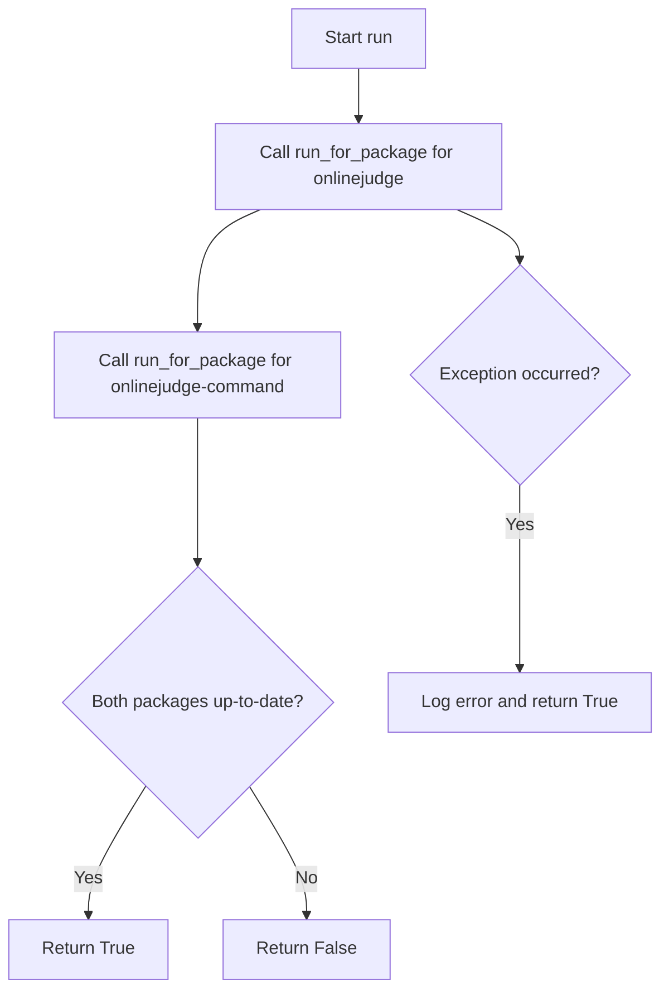

# `update_checking.py`

## `onlinejudge_command.update_checking.describe_status_code` · *function*

## Summary:
Formats an HTTP status code and its associated reason phrase into a human-readable string.

## Description:
This function takes an HTTP status code integer and returns a formatted string containing both the status code number and its standard reason phrase. It leverages the built-in `http.client.responses` dictionary which maps status codes to their corresponding descriptive messages.

The function is designed to provide consistent, standardized formatting for HTTP status codes throughout the application, particularly useful for logging or user-facing error messages.

## Args:
    status_code (int): An HTTP status code (e.g., 200, 404, 500). Must be a valid HTTP status code that exists in `http.client.responses`.

## Returns:
    str: A formatted string in the form "{status_code} {reason_phrase}", where reason_phrase is the standard description for the given status code (e.g., "200 OK", "404 Not Found").

## Raises:
    KeyError: If the provided status_code is not present in `http.client.responses`. This occurs when an invalid or unsupported HTTP status code is passed.

## Constraints:
    Preconditions:
        - The input `status_code` must be an integer.
        - The `status_code` must exist as a key in `http.client.responses`.
    Postconditions:
        - The returned string will always contain exactly two space-separated parts: the numeric status code followed by its reason phrase.
        - The function will raise a KeyError if the status code is not recognized.

## Side Effects:
    None: This function performs no I/O operations, external state mutations, or service calls. It only accesses a built-in Python dictionary.

## Control Flow:
```mermaid
flowchart TD
    A[Input status_code] --> B{Valid status_code?}
    B -->|Yes| C[Lookup http.client.responses]
    C --> D[Format string "{code} {phrase}"]
    D --> E[Return formatted string]
    B -->|No| F[Raise KeyError]
```

## Examples:
    >>> describe_status_code(200)
    '200 OK'
    
    >>> describe_status_code(404)
    '404 Not Found'
    
    >>> describe_status_code(500)
    '500 Internal Server Error'
    
    >>> describe_status_code(999)
    KeyError: 999

## `onlinejudge_command.update_checking.request` · *function*

## Summary:
Sends an HTTP request with logging and optional status checking using a requests session.

## Description:
This function serves as a wrapper around `requests.Session.request()` that adds standardized logging and optional HTTP status validation. It handles common configuration like redirect handling and provides detailed logging of the request and response lifecycle. The function is designed to centralize HTTP request logic with consistent error reporting and debugging capabilities.

The function extracts HTTP request logic into a reusable component to avoid duplication across different parts of the update checking system while ensuring consistent logging practices and error handling patterns.

## Args:
    method (str): HTTP method to use ('GET' or 'POST'). Must be one of these two values.
    url (str): The URL to send the request to.
    session (requests.Session): The requests session object to use for making the HTTP request.
    raise_for_status (bool): Whether to automatically raise an exception for HTTP error status codes (4xx or 5xx). Defaults to True.
    **kwargs: Additional keyword arguments passed directly to the underlying `session.request()` call.

## Returns:
    requests.Response: The response object returned by the underlying `session.request()` call.

## Raises:
    AssertionError: If the method parameter is not 'GET' or 'POST'.
    requests.exceptions.RequestException: If raise_for_status is True and the HTTP response status indicates an error (4xx or 5xx).

## Constraints:
    Preconditions:
        - The method argument must be either 'GET' or 'POST'
        - The session parameter must be a valid requests.Session instance
        - The url parameter must be a valid URL string
    Postconditions:
        - The function will always return a requests.Response object
        - If raise_for_status is True, the response will have a successful status code (2xx) or an exception will be raised

## Side Effects:
    - Writes log messages to the logger at INFO level for request initiation and completion
    - Writes debug log messages to the logger when request data is present
    - May write redirect log messages if the request is redirected
    - Makes actual HTTP network requests via the provided session

## Control Flow:
```mermaid
flowchart TD
    A[Start request] --> B{Method valid?}
    B -->|No| C[AssertionError]
    B -->|Yes| D[Set default allow_redirects=True]
    D --> E[Log request info]
    E --> F{Data present?}
    F -->|Yes| G[Log data debug info]
    G --> H[Make HTTP request]
    F -->|No| H
    H --> I{Redirect occurred?}
    I -->|Yes| J[Log redirect info]
    J --> K[Log status code]
    I -->|No| K
    K --> L{raise_for_status?}
    L -->|Yes| M[Check status code]
    M --> N{Status error?}
    N -->|Yes| O[raise_for_status() exception]
    N -->|No| P[Return response]
    L -->|No| P
```

## Examples:
    >>> import requests
    >>> session = requests.Session()
    >>> response = request('GET', 'https://api.github.com', session)
    >>> print(response.status_code)
    200
    
    >>> # With POST request and custom data
    >>> response = request('POST', 'https://httpbin.org/post', session, data={'key': 'value'})
    >>> print(response.status_code)
    200

## `onlinejudge_command.update_checking.get_latest_version_from_pypi` · *function*

## Summary:
Retrieves the latest version of a package from PyPI with caching to reduce network requests.

## Description:
Fetches the most recent version number of a specified package from the Python Package Index (PyPI) API. This function implements a caching mechanism to avoid frequent network requests by storing version information locally for 8 hours. When the cached version is still valid, it returns the cached value immediately. Otherwise, it makes a network request to PyPI to fetch the current version and updates the cache.

The function is extracted into its own component to encapsulate the complexity of network communication, caching logic, and error handling for update checking purposes. This separation allows the update checking system to be more maintainable and testable.

## Args:
    package_name (str): The name of the PyPI package to check for updates. Must be a valid package identifier.

## Returns:
    str: The latest version string of the package. Returns '0.0.0' if the network request fails or the package is not found.

## Raises:
    None explicitly raised, though underlying operations may raise exceptions that are caught and handled internally.

## Constraints:
    Preconditions:
        - The package_name parameter must be a non-empty string representing a valid PyPI package name
        - The system must have network connectivity to reach PyPI
        - The user must have permission to read/write to the user cache directory
    Postconditions:
        - The function always returns a version string (even if it's '0.0.0' on failure)
        - The cache file is updated with the latest version information after a successful network request

## Side Effects:
    - Makes a network request to https://pypi.org/pypi/{package_name}/json
    - Reads from and writes to the local file system (user cache directory)
    - Logs debug messages when loading/storing cache
    - Logs warning messages when cache loading fails
    - Logs error messages when network requests fail

## Control Flow:
```mermaid
flowchart TD
    A[Start get_latest_version_from_pypi] --> B{Cache file exists?}
    B -->|No| C[Make network request to PyPI]
    B -->|Yes| D[Load cache file]
    D --> E{Cache valid (within 8h)?}
    E -->|Yes| F[Return cached version]
    E -->|No| G[Make network request to PyPI]
    C --> H[Parse JSON response]
    G --> H
    H --> I{Network request successful?}
    I -->|No| J[Set version to '0.0.0']
    I -->|Yes| K[Extract version from response]
    J --> L[Update cache]
    K --> L
    L --> M[Write cache to disk]
    M --> N[Return version]
```

## Examples:
    >>> get_latest_version_from_pypi('onlinejudge')
    '1.2.3'
    
    >>> get_latest_version_from_pypi('nonexistent-package')
    '0.0.0'

## `onlinejudge_command.update_checking.is_update_available_on_pypi` · *function*

## Summary:
Checks if a newer version of a package is available on PyPI by comparing the current version with the latest version.

## Description:
Determines whether an update is available for a specified package by comparing the current installed version with the latest version published on the Python Package Index (PyPI). This function serves as the core comparison logic for the update checking system, extracting the comparison responsibility into a dedicated function to enable clean separation of concerns between version fetching and version comparison.

The function leverages `distutils.version.StrictVersion` for robust version string comparison that properly handles semantic versioning conventions like '1.2.10' being greater than '1.2.9'. It internally calls `get_latest_version_from_pypi` to retrieve the latest version information from PyPI.

## Args:
    package_name (str): The name of the PyPI package to check for updates. Must be a valid package identifier.
    current_version (str): The currently installed version of the package as a string. Must be a valid version identifier.

## Returns:
    bool: True if a newer version is available on PyPI, False otherwise. Returns False if version comparison fails due to invalid version strings.

## Raises:
    None explicitly raised by this function, though underlying `distutils.version.StrictVersion` comparisons may raise ValueError for malformed version strings, and `get_latest_version_from_pypi` may raise exceptions that propagate up.

## Constraints:
    Preconditions:
        - Both `package_name` and `current_version` must be non-empty strings
        - `current_version` must be a valid version string that `distutils.version.StrictVersion` can parse
        - The system must have network connectivity to reach PyPI
        - The user must have permission to read/write to the user cache directory (for underlying `get_latest_version_from_pypi` function)
    Postconditions:
        - The function returns a boolean indicating version status without side effects
        - Version comparison is performed using strict semantic versioning rules

## Side Effects:
    - Makes a network request to PyPI via `get_latest_version_from_pypi`
    - May trigger caching behavior in `get_latest_version_from_pypi`
    - No direct file system or global state modifications

## Control Flow:
```mermaid
flowchart TD
    A[Start is_update_available_on_pypi] --> B[Parse current_version with StrictVersion]
    B --> C[Call get_latest_version_from_pypi(package_name)]
    C --> D[Parse latest version with StrictVersion]
    D --> E[Compare versions: current < latest?]
    E --> F{Result}
    F -->|True| G[Return True]
    F -->|False| H[Return False]
```

## Examples:
    >>> is_update_available_on_pypi('onlinejudge', '1.2.3')
    True
    
    >>> is_update_available_on_pypi('onlinejudge', '2.0.0')
    False

## `onlinejudge_command.update_checking.run_for_package` · *function*

## Summary:
Checks if a package is up-to-date by comparing its current version with the latest version available on PyPI, and logs update notifications when appropriate.

## Description:
This function determines whether the currently installed version of a package matches the latest version available on the Python Package Index (PyPI). It serves as the main entry point for the update checking functionality, orchestrating the process of version comparison and issuing appropriate log messages when updates are available. The function is designed to be called periodically or during application startup to notify users about available package updates.

The logic is extracted into its own function to separate the concerns of version checking from the notification and decision-making processes. This enables better testability, reusability, and cleaner code organization by encapsulating the update availability determination in a single, well-defined interface.

## Args:
    package_name (str): The name of the PyPI package to check for updates. Must be a valid package identifier.
    current_version (str): The currently installed version of the package as a string. Must be a valid version identifier.

## Returns:
    bool: True if the package is up-to-date (no newer version available), False if an update is available. Returns True if version comparison fails due to invalid version strings.

## Raises:
    None explicitly raised by this function, though underlying functions (`is_update_available_on_pypi`, `get_latest_version_from_pypi`) may raise exceptions that could propagate up.

## Constraints:
    Preconditions:
        - Both `package_name` and `current_version` must be non-empty strings
        - `current_version` must be a valid version string that can be parsed by `distutils.version.StrictVersion`
        - The system must have network connectivity to reach PyPI
        - The user must have permission to read/write to the user cache directory (for underlying functions)
    Postconditions:
        - The function returns a boolean indicating whether the package is up-to-date
        - Appropriate log messages are generated when updates are detected

## Side Effects:
    - Makes network requests to PyPI via `is_update_available_on_pypi` and `get_latest_version_from_pypi`
    - Logs warning messages when updates are available (via `logger.warning`)
    - Logs informational messages with installation commands when updates are available (via `logger.info`)
    - May trigger caching behavior in underlying functions

## Control Flow:
```mermaid
flowchart TD
    A[Start run_for_package] --> B[Call is_update_available_on_pypi]
    B --> C{Is update available?}
    C -->|No| D[Return True (up-to-date)]
    C -->|Yes| E[Log warning about available update]
    E --> F[Log info about installation command]
    F --> G[Return False (outdated)]
```

## Examples:
    >>> run_for_package(package_name='onlinejudge', current_version='1.2.3')
    # If latest version is '1.2.3' or higher:
    # Returns True and produces no log messages
    True
    
    >>> run_for_package(package_name='onlinejudge', current_version='1.0.0')
    # If latest version is '1.2.3':
    # Logs warning: "update available for onlinejudge: 1.0.0 -> 1.2.3"
    # Logs info: "run: $ pip3 install -U onlinejudge"
    # Returns False
    False
```

## `onlinejudge_command.update_checking.run` · *function*

## Summary:
Checks for updates to the onlinejudge and onlinejudge-command packages by comparing their current versions with the latest versions available on PyPI.

## Description:
This function serves as the main entry point for the update checking system. It verifies whether the currently installed versions of the onlinejudge and onlinejudge-command packages are up-to-date by querying PyPI. The function is designed to be called periodically or during application startup to notify users about available package updates.

The logic is extracted into its own function to provide a clean interface for update checking while delegating the actual version comparison and network operations to the `run_for_package` helper function. This separation allows for easier testing and maintenance of the update checking functionality.

## Args:
    None

## Returns:
    bool: True if both packages are up-to-date (no newer versions available), False if either package has an update available. Returns True if any update check fails due to network issues or invalid version strings.

## Raises:
    None explicitly raised by this function, though underlying functions may raise exceptions that are caught and logged.

## Constraints:
    Preconditions:
        - The system must have network connectivity to reach PyPI
        - The `version` and `api_version` modules must be properly initialized with `__package_name__` and `__version__` attributes
        - The user must have permission to read/write to the user cache directory (for underlying functions)
    Postconditions:
        - The function returns a boolean indicating whether all packages are up-to-date
        - Appropriate log messages are generated when updates are detected

## Side Effects:
    - Calls `run_for_package` which performs network operations to check package versions
    - Logs error messages when update checks fail (via `logger.error`)
    - May trigger caching behavior in underlying functions

## Control Flow:


## Examples:
    >>> run()
    # If both packages are up-to-date:
    # Returns True and produces no log messages
    True
    
    >>> run()
    # If either package has an update available:
    # Logs warnings and info messages about available updates
    # Returns False
    False

