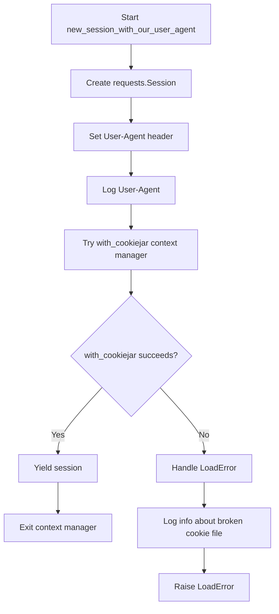
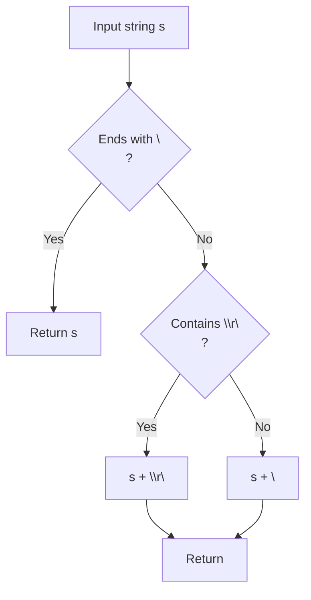
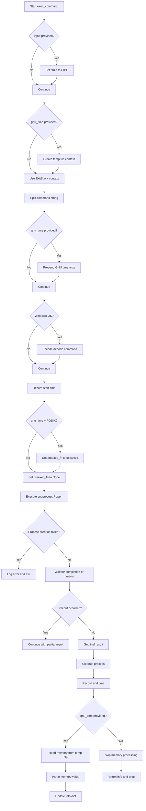
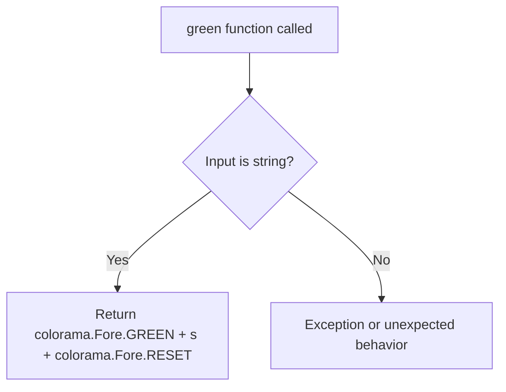
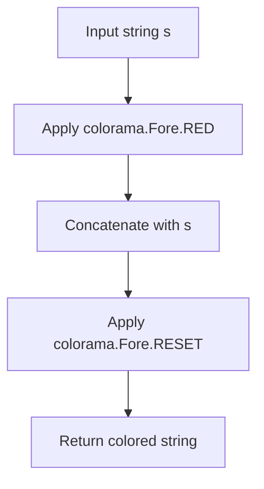
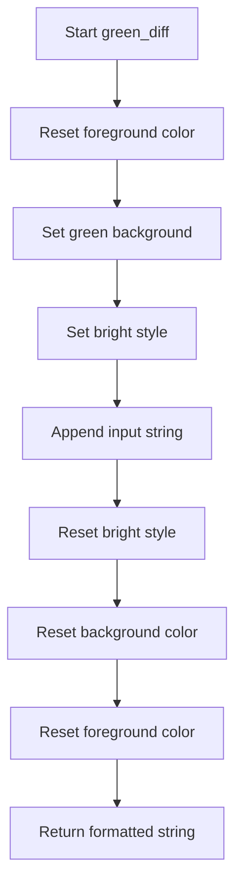
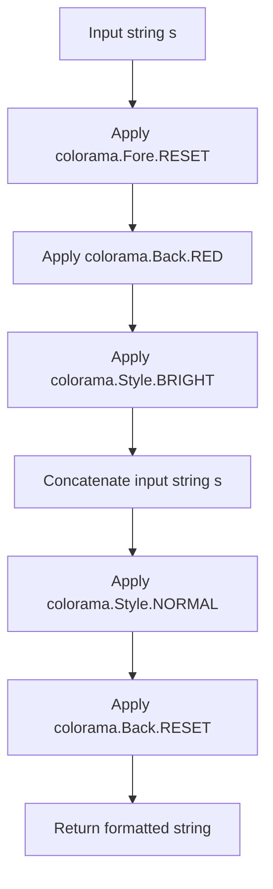
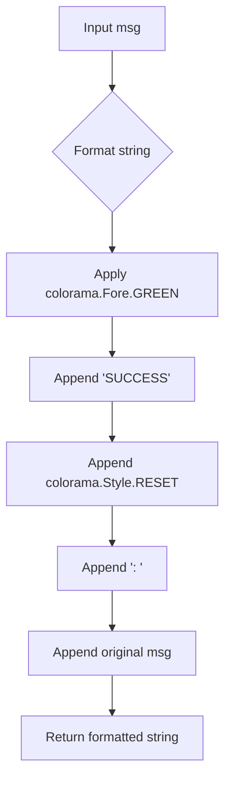

# `utils.py`

## `onlinejudge_command.utils.new_session_with_our_user_agent` · *function*

## Summary:
Creates a requests session with a custom User-Agent header and manages cookie persistence using a cookie jar file.

## Description:
This function initializes a new HTTP session with a standardized User-Agent string that identifies the online judge command tool. It wraps the session with cookie management functionality to persist cookies across requests, using a specified file path for cookie storage. The function is designed to be used as a context manager to ensure proper cleanup of the session and cookie jar resources.

## Args:
    path (pathlib.Path): The file path where cookies will be loaded from and saved to.

## Returns:
    Iterator[requests.Session]: A context manager that yields a requests.Session object configured with the custom User-Agent header and cookie management.

## Raises:
    http.cookiejar.LoadError: Raised when the cookie jar file at the specified path cannot be loaded due to corruption or permission issues.

## Constraints:
    Preconditions:
        - The path argument must be a valid pathlib.Path object pointing to a writable location.
        - The directory containing the path must exist and be writable.
    Postconditions:
        - The returned session will have a properly set User-Agent header.
        - The session will manage cookies via the specified cookie jar file.
        - The session and cookie jar will be properly closed when exiting the context.

## Side Effects:
    - Reads from and writes to the file system at the specified path for cookie persistence.
    - Logs debug information about the User-Agent header.
    - May log informational messages about broken cookie files.

## Control Flow:


## Examples:
```python
from pathlib import Path
import requests

# Basic usage
cookie_path = Path("cookies.jar")
with new_session_with_our_user_agent(path=cookie_path) as session:
    response = session.get("https://example.com")
    # Session automatically handles cookies and cleans up
```

## `onlinejudge_command.utils.textfile` · *function*

## Summary:
Ensures a string has a trailing newline character, normalizing line endings to Unix-style.

## Description:
This utility function standardizes text formatting by ensuring that input strings end with a newline character. It handles various line ending styles (Unix \n, Windows \r\n, or old Mac \r) and converts them to a consistent Unix-style newline format. This function is particularly useful when preparing text for file output or console display where consistent line termination is required.

The function was extracted to provide a centralized way to handle text normalization, preventing inconsistent line endings from propagating through the codebase and ensuring predictable output formatting.

## Args:
    s (str): Input string that may or may not have a trailing newline character

## Returns:
    str: The input string with a trailing newline character appended if missing, maintaining existing line ending style consistency

## Raises:
    None

## Constraints:
    Precondition: Input must be a string type
    Postcondition: Output string will always end with a newline character

## Side Effects:
    None

## Control Flow:


## Examples:
    >>> textfile("hello")
    'hello\\n'
    
    >>> textfile("hello\\n")
    'hello\\n'
    
    >>> textfile("hello\\r\\n")
    'hello\\r\\n'
    
    >>> textfile("hello\\r")
    'hello\\n'
```

## `onlinejudge_command.utils.exec_command` · *function*

## Summary:
Executes a shell command with optional input, timeout, and memory usage tracking using GNU time.

## Description:
This function provides a standardized way to execute shell commands while capturing execution time, memory usage (when GNU time is available), and command output. It handles various edge cases like timeouts, process cleanup, and platform-specific differences. The function is designed to be reusable across different parts of the online judge system that need to run external commands.

## Args:
    command_str (str): The shell command to execute as a string.
    stdin (Optional[BinaryIO]): Input stream to connect to the command's stdin. Defaults to None.
    input (Optional[bytes]): Input data to send to the command's stdin. Defaults to None.
    timeout (Optional[float]): Maximum time in seconds to wait for command completion. Defaults to None.
    gnu_time (Optional[str]): Path to the GNU time executable for memory usage tracking. Defaults to None.

## Returns:
    Tuple[Dict[str, Any], subprocess.Popen]: A tuple containing:
        - info (Dict[str, Any]): Dictionary with keys 'answer' (command output bytes), 'elapsed' (execution time in seconds), and 'memory' (memory usage in MB if GNU time is used).
        - proc (subprocess.Popen): The process object representing the running command.

## Raises:
    FileNotFoundError: When the command executable doesn't exist.
    PermissionError: When the command executable lacks execution permissions.

## Constraints:
    Preconditions:
        - command_str must be a valid shell command string.
        - If input is provided, stdin must be None (they are mutually exclusive).
        - gnu_time, if provided, must be a valid path to the GNU time executable.
    Postconditions:
        - The command is executed and cleaned up properly regardless of success or failure.
        - Memory usage is captured when gnu_time is provided and valid.
        - Execution time is always measured.

## Side Effects:
    - Executes external shell commands.
    - May write temporary files when gnu_time is used.
    - Logs error messages to stderr when command execution fails.
    - May terminate processes via SIGTERM if timeout occurs or cleanup is needed.
    - Calls sys.exit(1) when command execution fails due to FileNotFoundError or PermissionError.

## Control Flow:


## Examples:
    Basic usage:
    ```python
    info, proc = exec_command("echo Hello World")
    print(info['answer'].decode())  # Output: b'Hello World\n'
    ```

    With timeout:
    ```python
    info, proc = exec_command("sleep 5", timeout=2)
    print(info['elapsed'])  # Shows elapsed time (less than 2 seconds due to timeout)
    ```

    With memory tracking:
    ```python
    info, proc = exec_command("python -c 'print('x' * 1000000)'", gnu_time="/usr/bin/time")
    print(info['memory'])  # Shows memory usage in MB
    ```

## `onlinejudge_command.utils.green` · *function*

## Summary:
Returns a string with ANSI color codes that render the input text in green.

## Description:
This function wraps the input string with ANSI escape codes to display the text in green color when printed to terminals that support ANSI color codes. It leverages the colorama library to ensure cross-platform compatibility for colored terminal output. This utility function is commonly used for creating visually distinct success messages or highlighting important information in command-line interfaces.

## Args:
    s (str): The input string to be colored in green.

## Returns:
    str: The input string wrapped with ANSI green color codes and reset codes.

## Raises:
    None

## Constraints:
    - Input must be a string
    - Requires colorama library to be properly initialized in the environment
    - The function assumes colorama.Fore.GREEN and colorama.Fore.RESET are valid constants

## Side Effects:
    - None

## Control Flow:


## Examples:
    >>> green("Success!")
    '\x1b[32mSuccess!\x1b[0m'

## `onlinejudge_command.utils.red` · *function*

## Summary:
Formats a string with red color terminal escape codes for console output.

## Description:
This function applies ANSI color codes to make text appear in red when displayed in a compatible terminal. It wraps the input string with colorama's RED foreground color code and RESET code to ensure subsequent text isn't affected by the color formatting.

## Args:
    s (str): The input string to be formatted with red color.

## Returns:
    str: The input string wrapped with ANSI color escape codes for red text.

## Raises:
    None

## Constraints:
    Preconditions:
        - Input must be a string
        - Colorama must be properly initialized in the environment
    Postconditions:
        - Output string contains ANSI escape codes for red text
        - Original string content is preserved

## Side Effects:
    None

## Control Flow:


## Examples:
    >>> red("Error message")
    '\x1b[31mError message\x1b[0m'

## `onlinejudge_command.utils.green_diff` · *function*

## Summary:
Formats a string with green background and bright text styling for terminal output.

## Description:
This function applies terminal color formatting to a string using the colorama library to create a green background with bright text. It's designed to highlight differences or changes in terminal output by applying specific ANSI color codes.

The function is likely used in command-line interfaces where visual distinction is needed for important information, particularly in diff-like displays or status indicators.

## Args:
    s (str): The input string to be formatted with green background and bright text styling.

## Returns:
    str: A formatted string containing ANSI escape sequences that will display the input text with a green background and bright text when printed to a terminal supporting ANSI colors.

## Raises:
    None: This function does not raise any exceptions.

## Constraints:
    Preconditions:
        - The input string `s` must be a valid string object.
        - The colorama library must be properly initialized in the environment.
    
    Postconditions:
        - The returned string contains ANSI escape sequences for terminal formatting.
        - The formatting will only be visible in terminals that support ANSI color codes.

## Side Effects:
    None: This function has no side effects beyond returning a formatted string.

## Control Flow:


## Examples:
    # Basic usage
    formatted_text = green_diff("This is a test")
    print(formatted_text)  # Will display with green background and bright text
    
    # In context of a diff display
    diff_output = green_diff("Added line")
    print(diff_output)  # Displays "Added line" with green background

## `onlinejudge_command.utils.red_diff` · *function*

## Summary:
Formats a string with red background and bright text styling for terminal output.

## Description:
This function applies terminal color formatting to highlight text with a red background and bright font style. It is designed to be used for visual differentiation of text in command-line interfaces, particularly for indicating differences or errors in output.

The function is likely called in contexts where colored terminal output is needed for better user experience, such as in diff displays or error messages. It's extracted as a separate utility function to centralize the formatting logic and ensure consistent styling throughout the application.

## Args:
    s (str): The input string to be formatted with red background and bright text styling.

## Returns:
    str: The input string wrapped with ANSI escape codes for red background and bright text formatting.

## Raises:
    None

## Constraints:
    Preconditions:
    - Input string must be a valid string object
    - The colorama library must be properly initialized in the environment
    
    Postconditions:
    - Output string contains ANSI escape codes for terminal formatting
    - Original string content is preserved within the formatting wrapper

## Side Effects:
    None

## Control Flow:


## Examples:
    # Basic usage
    formatted_text = red_diff("This is an error message")
    print(formatted_text)  # Displays "This is an error message" with red background and bright text

## `onlinejudge_command.utils.success` · *function*

## Summary:
Formats a success message with green coloring for terminal output.

## Description:
This function takes a message string and wraps it with ANSI color codes to display it in green, indicating a successful operation. It is designed to provide consistent visual feedback in command-line interfaces.

## Args:
    msg (str): The success message to be formatted. This parameter represents the core information about what succeeded.

## Returns:
    str: A formatted string that includes the word "SUCCESS" in green color followed by a colon and space, then the original message. The formatting uses colorama for cross-platform terminal color support.

## Raises:
    None: This function does not raise any exceptions.

## Constraints:
    Preconditions:
        - The input `msg` must be a string.
        - Colorama must be properly initialized in the environment for colored output to work.
    
    Postconditions:
        - The returned string will always contain the literal text "SUCCESS: " prefix followed by the original message.
        - The color codes are applied using colorama constants for cross-platform compatibility.

## Side Effects:
    None: This function has no side effects beyond returning a formatted string.

## Control Flow:


## Examples:
    >>> success("File downloaded successfully")
    '\x1b[32mSUCCESS\x1b[0m: File downloaded successfully'
    
    >>> success("Operation completed")
    '\x1b[32mSUCCESS\x1b[0m: Operation completed'

## `onlinejudge_command.utils.failure` · *function*

## Summary:
Formats a failure message with red color coding for terminal output.

## Description:
This function takes a string message and wraps it with ANSI color codes to display it in red, indicating a failure state. It is designed to provide consistent error messaging across the application with a standardized format.

## Args:
    msg (str): The failure message to be formatted. This should be a descriptive error message explaining what went wrong.

## Returns:
    str: A formatted string that includes the word "FAILURE" in red text followed by a colon and space, then the original message. The formatting uses colorama for terminal color support.

## Raises:
    None: This function does not raise any exceptions.

## Constraints:
    Preconditions:
        - The msg parameter must be a string.
        - Colorama must be properly initialized in the environment for colored output to work.
    
    Postconditions:
        - The returned string will always have the format "FAILURE: {original_message}" with red coloring.
        - The function will not modify the original message parameter.

## Side Effects:
    None: This function has no side effects beyond returning a formatted string.

## Control Flow:
```mermaid
flowchart TD
    A[Start failure()] --> B[Get RED color from colorama]
    B --> C[Concatenate 'FAILURE' with RESET style]
    C --> D[Add colon and space]
    D --> E[Append original message]
    E --> F[Return formatted string]
```

## Examples:
    >>> failure("Connection failed")
    '\x1b[31mFAILURE\x1b[0m: Connection failed'
    
    >>> failure("Invalid input provided")
    '\x1b[31mFAILURE\x1b[0m: Invalid input provided'

## `onlinejudge_command.utils.remove_suffix` · *function*

## Summary:
Removes a specified suffix from the end of a string, asserting that the string actually ends with that suffix.

## Description:
This function removes a specified suffix from the end of a string. It performs an assertion check to ensure that the input string actually ends with the specified suffix before proceeding with the removal. This function is typically used in contexts where string manipulation is needed for path or filename processing, or when preparing data for further processing that requires a clean suffix removal. The assertion ensures that the caller has properly validated that the suffix exists at the end of the string.

## Args:
    s (str): The input string from which the suffix will be removed. Must end with the specified suffix.
    suffix (str): The suffix to be removed from the end of the string. Must be a non-empty string.

## Returns:
    str: A new string with the specified suffix removed from the end of the input string.

## Raises:
    AssertionError: When the input string `s` does not end with the specified `suffix`.

## Constraints:
    Preconditions:
        - The input string `s` must end with the specified `suffix`.
        - Both `s` and `suffix` must be non-empty strings.
    Postconditions:
        - The returned string will be exactly `len(s) - len(suffix)` characters long.
        - The returned string will be identical to `s` except for the removed suffix.

## Side Effects:
    None

## Control Flow:
```mermaid
flowchart TD
    A[remove_suffix(s, suffix)] --> B{assert s.endswith(suffix)}
    B --> C[return s[:-len(suffix)]]
```

## Examples:
    >>> remove_suffix("example.txt", ".txt")
    'example'
    
    >>> remove_suffix("test_case_1", "_1")
    'test_case'
    
    >>> remove_suffix("file.py", ".py")
    'file'

## `onlinejudge_command.utils.is_windows_subsystem_for_linux` · *function*

## Summary:
Determines whether the current execution environment is running under Windows Subsystem for Linux (WSL).

## Description:
This function checks if the system is running Linux-based WSL by examining the platform information returned by `platform.uname()`. It specifically looks for the string 'microsoft' in the kernel release version to identify WSL environments.

The function is extracted into its own utility to centralize the detection logic for WSL environments, allowing other parts of the codebase to make environment-specific decisions without duplicating the detection logic throughout the application.

## Args:
    None

## Returns:
    bool: True if running under WSL (Windows Subsystem for Linux), False otherwise.

## Raises:
    None

## Constraints:
    Preconditions:
        - The system must support the `platform` module
        - The `platform.uname()` function must be available and return valid system information
    
    Postconditions:
        - Always returns a boolean value
        - Does not modify any external state

## Side Effects:
    None

## Control Flow:
```mermaid
flowchart TD
    A[Start] --> B{platform.uname().system == 'Linux'?}
    B -- No --> C[Return False]
    B -- Yes --> D{platform.uname().release contains 'microsoft'?}
    D -- No --> C
    D -- Yes --> E[Return True]
```

## Examples:
    # Check if running under WSL
    if is_windows_subsystem_for_linux():
        print("Running under WSL")
    else:
        print("Not running under WSL")

## `onlinejudge_command.utils.webbrowser_register_explorer_exe` · *function*

## Summary:
Registers the Windows Explorer browser for use in WSL environments by configuring the webbrowser module to use explorer.exe as the default browser.

## Description:
This function specifically configures the Python webbrowser module to use Windows Explorer (explorer.exe) as the browser when running under Windows Subsystem for Linux (WSL). It addresses compatibility issues in WSL environments where the default browser handling doesn't work properly by registering explorer.exe as a browser option that can be used to open URLs from within the WSL environment.

The function is extracted into its own utility to centralize the browser registration logic for WSL environments, allowing the application to properly handle browser opening operations in WSL without requiring users to manually configure their browser settings.

## Args:
    None

## Returns:
    None

## Raises:
    None

## Constraints:
    Preconditions:
        - Must be running under Windows Subsystem for Linux (WSL)
        - The webbrowser module must be available
        - The system must have explorer.exe available for execution
        
    Postconditions:
        - The 'explorer' browser is registered with the webbrowser module
        - No changes occur if not running under WSL

## Side Effects:
    - Modifies the global webbrowser module's browser registry
    - May affect subsequent calls to webbrowser.open() in WSL environments

## Control Flow:
```mermaid
flowchart TD
    A[Start] --> B{is_windows_subsystem_for_linux()?}
    B -- No --> C[Return]
    B -- Yes --> D[Create GenericBrowser instance with 'explorer.exe']
    D --> E{Python version < 3.7?}
    E -- Yes --> F[Register with webbrowser.register('explorer', None, instance)]
    E -- No --> G[Register with webbrowser.register('explorer', None, instance, preferred=True)]
    F --> H[End]
    G --> H
```

## Examples:
    # Register explorer.exe for WSL browser handling
    webbrowser_register_explorer_exe()
    
    # Later in code, this will use explorer.exe in WSL
    import webbrowser
    webbrowser.open('https://example.com')
```

## `onlinejudge_command.utils.get_default_command` · *function*

## Summary:
Returns the default executable filename based on the operating system platform.

## Description:
This function determines the appropriate default executable filename to use when running compiled programs in different operating systems. It returns a Windows-specific path for `.exe` files on Windows systems and a Unix-like path for `.out` files on other platforms.

## Args:
    None

## Returns:
    str: The default executable filename. On Windows systems, returns `'.\\a.exe'`. On all other platforms, returns `'./a.out'`.

## Raises:
    None

## Constraints:
    Preconditions:
        - The `platform` module must be available and functioning correctly.
        - The system's platform identification must work as expected.
    
    Postconditions:
        - Always returns a string representing a valid path pattern for an executable file.
        - The returned string follows the conventions of the respective operating system.

## Side Effects:
    None

## Control Flow:
```mermaid
flowchart TD
    A[Start get_default_command] --> B{platform.system() == 'Windows'?}
    B -- Yes --> C[Return '.\\a.exe']
    B -- No --> D[Return './a.out']
    C --> E[End]
    D --> E
```

## Examples:
```python
# On Windows
>>> get_default_command()
'.\\a.exe'

# On Linux/macOS
>>> get_default_command()
'./a.out'
```

