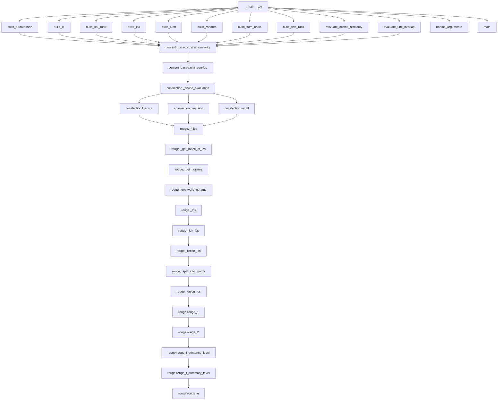

# `sumy.evaluation`

## Tree:
evaluation/
├── __main__.py
├── content_based.py
├── coselection.py
└── rouge.py

## Role:
Provides evaluation metrics and tools for assessing the quality of text summarization systems by comparing generated summaries against reference summaries using various quantitative approaches.

## Description:
The evaluation module serves as the core component for measuring summarization performance in the sumy library. It offers multiple evaluation strategies including content-based similarity metrics (cosine similarity, unit overlap), coselection metrics (precision, recall, F-score), and ROUGE metrics (ROUGE-1, ROUGE-2, ROUGE-L) for comprehensive assessment of summarization quality.

This module is primarily consumed by the command-line interface (`__main__.py`) for running automated evaluations, but also provides reusable components for integration into larger systems or custom evaluation pipelines. The module is organized around distinct evaluation paradigms, each implemented in its own submodule to maintain clear separation of concerns and promote code reusability.

## Components:
*   **build_edmundson**: Creates an Edmundson summarizer with language-specific configurations
*   **build_kl**: Configures a Kullback-Leibler divergence-based summarizer
*   **build_lex_rank**: Initializes a LexRank summarizer with language-aware settings
*   **build_lsa**: Sets up an LSA (Latent Semantic Analysis) summarizer with appropriate linguistic preprocessing
*   **build_luhn**: Constructs a Luhn summarizer instance with language-specific processing
*   **build_random**: Returns a RandomSummarizer for baseline comparison
*   **build_sum_basic**: Configures a SumBasic summarizer with language-specific features
*   **build_text_rank**: Creates a TextRank summarizer with language-aware initialization
*   **evaluate_cosine_similarity**: Computes cosine similarity between document models
*   **evaluate_unit_overlap**: Calculates unit overlap similarity between document models
*   **handle_arguments**: Processes command-line arguments for evaluation workflows
*   **main**: Main entry point for command-line evaluation execution
*   **cosine_similarity**: Utility function for computing cosine similarity between document models
*   **unit_overlap**: Computes Jaccard similarity coefficient between document models
*   **_divide_evaluation**: Calculates the ratio of common sentences between collections
*   **f_score**: Computes F-score combining precision and recall for coselection evaluation
*   **precision**: Measures precision in coselection evaluation
*   **recall**: Calculates recall in coselection evaluation
*   **_f_lcs**: Computes F1-measure for longest common subsequence (LCS) between two sequences
*   **_get_index_of_lcs**: Returns lengths of two sequences for LCS operations
*   **_get_ngrams**: Extracts n-grams from a text sequence
*   **_get_word_ngrams**: Generates word-based n-grams from Sentence objects
*   **_lcs**: Builds dynamic programming table for longest common subsequence (LCS) algorithm
*   **_len_lcs**: Retrieves LCS length from precomputed dynamic programming table
*   **_recon_lcs**: Reconstructs actual LCS from sequences using backtracking algorithm
*   **_split_into_words**: Converts Sentence objects to flat list of word tokens
*   **_union_lcs**: Computes union-based LCS ratio for multiple evaluations
*   **rouge_1**: Implements ROUGE-1 metric for unigram overlap
*   **rouge_2**: Implements ROUGE-2 metric for bigram overlap
*   **rouge_l_sentence_level**: Computes ROUGE-L at sentence level using LCS
*   **rouge_l_summary_level**: Computes ROUGE-L at summary level using union LCS
*   **rouge_n**: Implements general ROUGE-N metric for n-gram overlap

## Public API:
*   **build_edmundson(parser, language)**: Factory function for Edmundson summarizer
*   **build_kl(parser, language)**: Factory function for Kullback-Leibler summarizer
*   **build_lex_rank(parser, language)**: Factory function for LexRank summarizer
*   **build_lsa(parser, language)**: Factory function for LSA summarizer
*   **build_luhn(parser, language)**: Factory function for Luhn summarizer
*   **build_random(parser, language)**: Factory function for Random summarizer
*   **build_sum_basic(parser, language)**: Factory function for SumBasic summarizer
*   **build_text_rank(parser, language)**: Factory function for TextRank summarizer
*   **evaluate_cosine_similarity(evaluated_sentences, reference_sentences)**: Computes cosine similarity between documents
*   **evaluate_unit_overlap(evaluated_sentences, reference_sentences)**: Calculates unit overlap similarity between documents
*   **handle_arguments(args)**: Processes command-line arguments for evaluation
*   **main(args=None)**: Entry point for command-line evaluation
*   **cosine_similarity(evaluated_model, reference_model)**: Computes cosine similarity between document models
*   **unit_overlap(evaluated_model, reference_model)**: Calculates Jaccard similarity between document models
*   **_divide_evaluation(numerator_sentences, denominator_sentences)**: Calculates ratio of common sentences
*   **f_score(evaluated_sentences, reference_sentences, weight=1.0)**: Computes F-score for coselection evaluation
*   **precision(evaluated_sentences, reference_sentences)**: Calculates precision for coselection evaluation
*   **recall(evaluated_sentences, reference_sentences)**: Calculates recall for coselection evaluation
*   **_f_lcs(llcs, m, n)**: Computes F1-measure for longest common subsequence (LCS) between two sequences
*   **_get_index_of_lcs(x, y)**: Returns lengths of two sequences for LCS operations
*   **_get_ngrams(n, text)**: Extracts n-grams from text
*   **_get_word_ngrams(n, sentences)**: Generates word-based n-grams from sentences
*   **_lcs(x, y)**: Builds dynamic programming table for longest common subsequence (LCS) algorithm
*   **_len_lcs(x, y)**: Retrieves LCS length from precomputed dynamic programming table
*   **_recon_lcs(x, y)**: Reconstructs actual LCS from sequences using backtracking algorithm
*   **_split_into_words(sentences)**: Converts sentences to word tokens
*   **_union_lcs(evaluated_sentences, reference_sentence)**: Computes union-based LCS ratio for multiple evaluations
*   **rouge_1(evaluated_sentences, reference_sentences)**: Implements ROUGE-1 metric
*   **rouge_2(evaluated_sentences, reference_sentences)**: Implements ROUGE-2 metric
*   **rouge_l_sentence_level(evaluated_sentences, reference_sentences)**: Computes ROUGE-L sentence-level score
*   **rouge_l_summary_level(evaluated_sentences, reference_sentences)**: Computes ROUGE-L summary-level score
*   **rouge_n(evaluated_sentences, reference_sentences, n)**: Implements general ROUGE-N metric

## Dependencies:
*   Internal: sumy.parsers, sumy.summarizers, sumy.models.dom, sumy.nlp.stemmers, sumy.nlp.stop_words, sumy.utils
*   External: docopt, numpy (for some computations)

## Constraints:
*   All evaluation functions expect Sentence objects with valid 'words' attributes
*   Language parameters must be supported by internal stemmer and stop-word systems
*   File paths provided in command-line arguments must be accessible
*   Evaluation functions may raise ValueError for empty collections or invalid inputs
*   Thread-safe: No shared mutable state between evaluation functions

---

## Files

- [`__main__.py`](evaluation/__main__.md)
- [`content_based.py`](evaluation/content_based.md)
- [`coselection.py`](evaluation/coselection.md)
- [`rouge.py`](evaluation/rouge.md)

