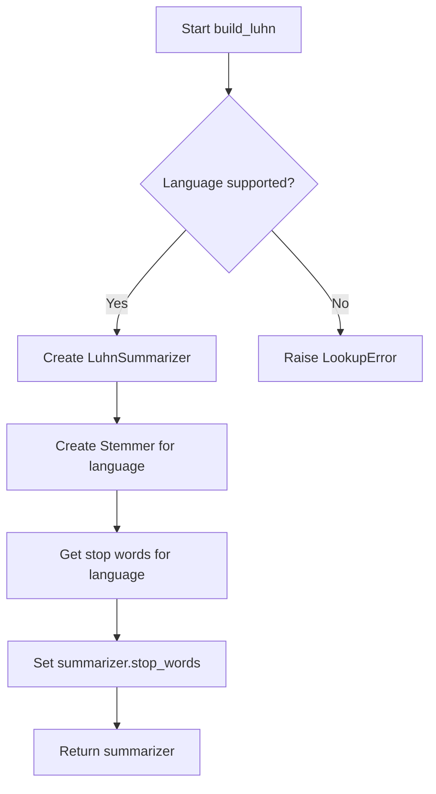
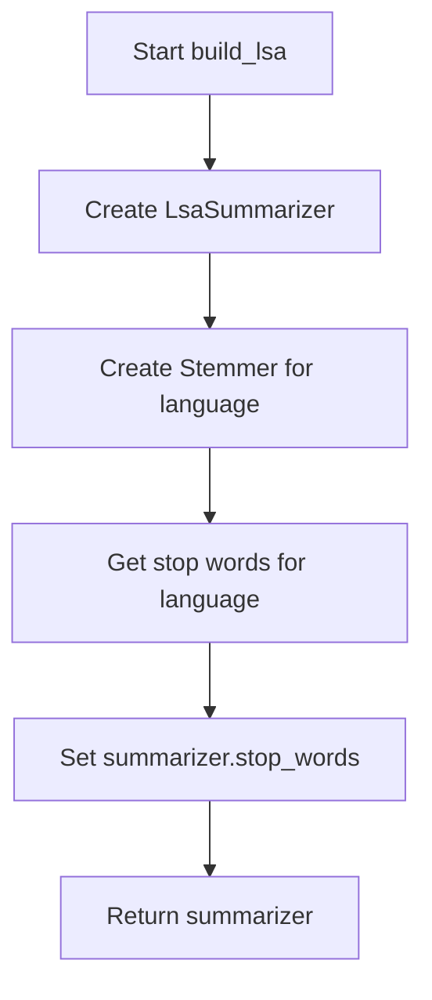
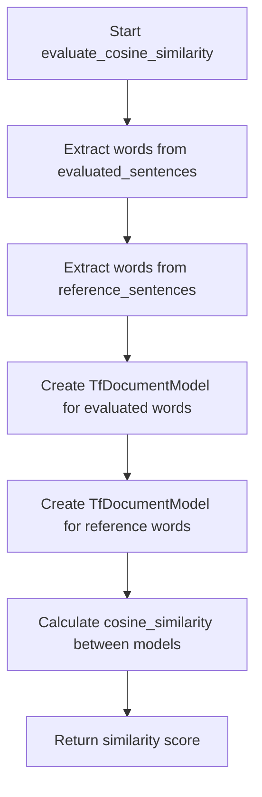
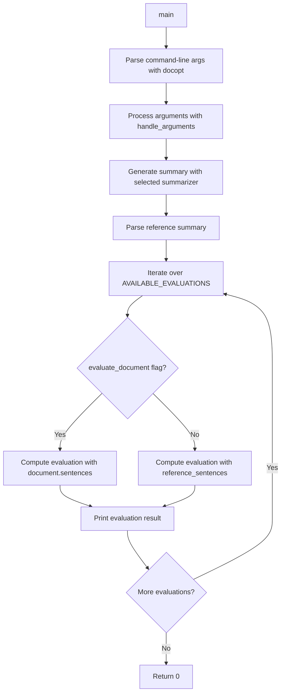

# `__main__.py`

## `sumy.evaluation.__main__.build_random` · *function*

## Summary:
Creates and returns a RandomSummarizer instance for performing random sentence selection-based text summarization.

## Description:
This function serves as a factory method for creating RandomSummarizer objects, which implement a summarization technique that randomly ranks sentences and selects the top ones based on that random ranking. The function ignores the parser and language parameters, always returning the same type of summarizer regardless of input. This abstraction allows the evaluation framework to consistently instantiate different summarizer types through a uniform interface.

## Args:
    parser: A document parser object (unused in implementation)
    language: Language specification string (unused in implementation)

## Returns:
    RandomSummarizer: An instance of the RandomSummarizer class configured for random-based sentence selection.

## Raises:
    None explicitly raised by this function.

## Constraints:
    Preconditions: None required for function call.
    Postconditions: Always returns a RandomSummarizer instance.

## Side Effects:
    None.

## Control Flow:
```mermaid
flowchart TD
    A[build_random called] --> B{Ignore params}
    B --> C[Return RandomSummarizer()]
```

## Examples:
```python
# Basic usage
from parsers.plaintext import PlaintextParser
from nlp.tokenizers import Tokenizer

parser = PlaintextParser.from_string("Sample text for summarization.", Tokenizer("english"))
summarizer = build_random(parser, "english")
summary = summarizer(document, 3)
```

## `sumy.evaluation.__main__.build_luhn` · *function*

## Summary:
Creates and configures a Luhn summarizer instance with language-specific stemming and stop words.

## Description:
This function constructs a LuhnSummarizer object initialized with a stemmer appropriate for the specified language and configures its stop words using language-specific stop word lists. It serves as a factory function to standardize the creation of Luhn summarizer instances with proper linguistic preprocessing.

The function extracts the summarizer construction logic into a dedicated utility to enforce a clear responsibility boundary between configuration and execution phases, ensuring consistent initialization of Luhn summarizers across different parts of the application. Note that the parser parameter is currently unused in the implementation.

## Args:
    parser (object): A document parser instance (currently unused in implementation).
    language (str): Language code string (e.g., 'english', 'french') used to select appropriate stemmer and stop words.

## Returns:
    LuhnSummarizer: A configured instance of the Luhn summarizer with language-specific stemming and stop words set.

## Raises:
    LookupError: When the specified language is not supported for stop-word retrieval or stemmer selection.

## Constraints:
    Preconditions:
        - The language parameter must be a valid language identifier recognized by the system.
        - Stop-word data files must exist for the specified language.
    Postconditions:
        - The returned summarizer instance will have its stop_words property properly initialized.
        - The summarizer will be configured with a suitable stemmer for the given language.

## Side Effects:
    None.

## Control Flow:


## Examples:
```python
# Basic usage
parser = PlaintextParser.from_string("Sample text for summarization.", Tokenizer("english"))
summarizer = build_luhn(parser, "english")
```

## `sumy.evaluation.__main__.build_edmundson` · *function*

## Summary:
Configures and returns an Edmundson summarizer with language-specific stemming and word lists for significance analysis.

## Description:
This function creates an EdmundsonSummarizer instance with appropriate configuration for the specified language, including setting stop words, significant words (bonus words), and stigma words based on the parser's content analysis. It serves as a factory function to prepare the Edmundson summarizer with domain-specific linguistic features.

## Args:
    parser: Parser object (PlaintextParser or HtmlParser) containing significant_words and stigma_words properties
    language: String representing the language for stemming and stop-word processing

## Returns:
    EdmundsonSummarizer: Configured summarizer instance ready for text summarization

## Raises:
    LookupError: When stop-words are not available for the specified language
    ValueError: When bonus_words or stigma_words are not properly set in the parser

## Constraints:
    Preconditions:
        - Parser must have significant_words and stigma_words properties
        - Language must be supported by the stemmer
        - Stop words must be available for the specified language
    Postconditions:
        - Returned summarizer has null_words set to stop words for the language
        - Returned summarizer has bonus_words set to parser's significant_words
        - Returned summarizer has stigma_words set to parser's stigma_words

## Side Effects:
    None

## Control Flow:
```mermaid
flowchart TD
    A[Start build_edmundson] --> B[Create EdmundsonSummarizer with Stemmer(language)]
    B --> C[Set summarizer.null_words = get_stop_words(language)]
    C --> D[Set summarizer.bonus_words = parser.significant_words]
    D --> E[Set summarizer.stigma_words = parser.stigma_words]
    E --> F[Return summarizer]
```

## Examples:
```python
# Using with PlaintextParser
parser = PlaintextParser.from_string("Sample text...", Tokenizer("english"))
summarizer = build_edmundson(parser, "english")

# Using with HtmlParser  
parser = HtmlParser.from_string("<html><body>Sample HTML...</body></html>", "http://example.com", Tokenizer("english"))
summarizer = build_edmundson(parser, "english")
```

## `sumy.evaluation.__main__.build_lsa` · *function*

## Summary:
Creates and configures an LSA (Latent Semantic Analysis) summarizer with language-specific stemming and stop words.

## Description:
This function constructs an LsaSummarizer instance initialized with a stemmer appropriate for the specified language and configures its stop words using language-specific stop word lists. It serves as a factory function for creating properly configured LSA summarizers.

The logic is extracted into its own function to encapsulate the instantiation and configuration process, enforcing a clear responsibility boundary between the creation of summarizer objects and their usage in the summarization pipeline.

## Args:
    parser: The parser object (currently unused in implementation)
    language (str): Language code string specifying the language for stemming and stop words

## Returns:
    LsaSummarizer: A configured LSA summarizer instance ready for text summarization

## Raises:
    LookupError: When stop-words are not available for the specified language
    LookupError: When a stemmer is not available for the specified language

## Constraints:
    Preconditions:
        - Language parameter must be a valid language identifier recognized by the system
        - Stop-word data files must exist for the specified language
        - NLTK stemmer classes must be available for the specified language (if not using special stemmers)

    Postconditions:
        - Returns a fully initialized LsaSummarizer instance
        - The returned summarizer has stop_words property properly set
        - The summarizer is configured with appropriate stemmer for the language

## Side Effects:
    - Accesses filesystem to load stop-word data files
    - May raise LookupError if language resources are unavailable

## Control Flow:


## Examples:
```python
# Basic usage
parser = PlaintextParser.from_string("Sample text for summarization.", Tokenizer("english"))
summarizer = build_lsa(parser, "english")

# Usage in summarization pipeline
document = parser.parse()
summary = summarizer(document, 3)  # Get 3 sentences summary
```

## `sumy.evaluation.__main__.build_text_rank` · *function*

## Summary:
Creates and configures a TextRank summarizer instance with language-specific stemming and stop-word filtering.

## Description:
This function constructs a TextRankSummarizer object initialized with a stemmer appropriate for the specified language and configures its stop words based on the same language. It serves as a factory function to encapsulate the setup logic for TextRank summarization, ensuring consistent initialization across different usage contexts. The parser parameter is currently unused in the implementation but may be intended for future extensibility.

## Args:
    parser: The parser object (currently unused in implementation). Type: Parser. Default: None.
    language (str): Language code for determining the appropriate stemmer and stop words. Type: str. Allowed values: standard language codes supported by the system.

## Returns:
    TextRankSummarizer: A configured summarizer instance ready for use with document summarization tasks.

## Raises:
    LookupError: When stop-words are not available for the specified language.
    LookupError: When a stemmer is not available for the specified language.

## Constraints:
    Preconditions:
        - The language parameter must correspond to a supported language in the system.
        - Stop-word data files must exist for the specified language.
        - NLTK stemmer classes must be available for the specified language if not using special stemmers.

    Postconditions:
        - Returns a fully initialized TextRankSummarizer instance.
        - The returned summarizer has its stop_words property set to the appropriate stop words for the language.

## Side Effects:
    - Accesses filesystem to load stop-word data files.
    - May raise LookupError exceptions if language resources are unavailable.

## Control Flow:
```mermaid
flowchart TD
    A[Start build_text_rank] --> B{Language supported?}
    B -- No --> C[Raise LookupError]
    B -- Yes --> D[Create Stemmer(language)]
    D --> E[Get stop words for language]
    E --> F[Create TextRankSummarizer(Stemmer)]
    F --> G[Set summarizer.stop_words]
    G --> H[Return summarizer]
```

## Examples:
```python
# Basic usage
parser = PlaintextParser.from_string("Sample text for summarization.", Tokenizer("english"))
summarizer = build_text_rank(parser, "english")

# Usage with HTML parser
parser = HtmlParser.from_string("<html><body>Sample HTML content.</body></html>", "http://example.com", Tokenizer("english"))
summarizer = build_text_rank(parser, "english")
```

## `sumy.evaluation.__main__.build_lex_rank` · *function*

## Summary:
Creates and configures a LexRank summarizer instance with language-specific stemming and stop-word filtering.

## Description:
This function constructs a LexRankSummarizer object initialized with a stemmer appropriate for the specified language and configures its stop words using language-specific stop-word lists. It serves as a factory function to standardize the creation of LexRank summarizer instances with proper linguistic preprocessing.

The LexRank algorithm is a graph-based method for extractive text summarization that ranks sentences based on their similarity to other sentences in the document. This function ensures that the summarizer is properly configured with language-aware text processing capabilities.

This logic is extracted into its own function to provide a centralized configuration point for LexRank summarizers, making it easier to maintain consistent initialization across different parts of the application and allowing for future extensions without modifying the core summarizer creation logic.

## Args:
    parser: The parser object (unused in current implementation). This parameter is accepted for interface consistency but not utilized in the function body.
    language (str): Language code specifying the language for text processing (e.g., 'english', 'german'). Must correspond to a supported language with available stemmer and stop-word resources.

## Returns:
    LexRankSummarizer: A configured LexRankSummarizer instance ready for use in text summarization tasks.

## Raises:
    LookupError: When the specified language does not have available stemmer or stop-word resources.
    IOError: When stop-word files cannot be accessed for the specified language.

## Constraints:
    Preconditions:
    - The language parameter must be a valid language identifier recognized by the system.
    - Stop-word data files must exist for the specified language.
    - Stemmer implementations must be available for the specified language.

    Postconditions:
    - The returned summarizer instance will have its stop_words property set to the language-appropriate stop-word list.
    - The summarizer will be initialized with a stemmer appropriate for the specified language.

## Side Effects:
    None

## Control Flow:
```mermaid
flowchart TD
    A[build_lex_rank called] --> B{Language valid?}
    B -- No --> C[Raise LookupError]
    B -- Yes --> D[Create LexRankSummarizer with Stemmer(language)]
    D --> E[Get stop words for language]
    E --> F[Set summarizer.stop_words]
    F --> G[Return summarizer]
```

## Examples:
```python
# Basic usage
parser = PlaintextParser.from_string("Sample text for summarization.", Tokenizer("english"))
summarizer = build_lex_rank(parser, "english")

# Usage in a summarization pipeline
document = parser.parse()
summary = summarizer(document, 3)  # Get top 3 sentences
```

## `sumy.evaluation.__main__.build_sum_basic` · *function*

## Summary:
Creates and configures a SumBasicSummarizer instance with language-specific stemming and stop words.

## Description:
This function constructs a SumBasicSummarizer object initialized with a stemmer appropriate for the specified language and configures its stop words using language-specific stop word lists. It serves as a factory function for creating properly initialized summarizer instances.

The logic is extracted into its own function to encapsulate the instantiation and configuration process, ensuring consistent setup of SumBasicSummarizer objects across different parts of the application. This promotes code reuse and maintains clean separation between configuration concerns and summarization logic.

## Args:
    parser (object): A parser object that provides document parsing capabilities (type not specified in function signature, but used in calling context)
    language (str): Language code string (e.g., 'english', 'french') specifying the language for stemming and stop word processing

## Returns:
    SumBasicSummarizer: An initialized SumBasicSummarizer instance configured with language-specific stemming and stop words

## Raises:
    LookupError: When the specified language is not supported for either stemming or stop word processing

## Constraints:
    Preconditions:
    - The language parameter must be a valid language identifier recognized by the system
    - The language must have available stemmer implementations and stop word lists
    - Parser argument is expected to be compatible with the calling context but not directly used in this function

    Postconditions:
    - Returns a fully configured SumBasicSummarizer instance
    - The returned summarizer has its stop_words property set to language-appropriate stop words
    - The summarizer is initialized with a stemmer appropriate for the specified language

## Side Effects:
    None

## Control Flow:
```mermaid
flowchart TD
    A[Start build_sum_basic] --> B{Language supported?}
    B -- No --> C[Throw LookupError]
    B -- Yes --> D[Create Stemmer(language)]
    D --> E[Create SumBasicSummarizer(Stemmer)]
    E --> F[Get stop words for language]
    F --> G[Set summarizer.stop_words]
    G --> H[Return summarizer]
```

## Examples:
```python
# Basic usage
parser = PlaintextParser.from_file("document.txt", Tokenizer("english"))
summarizer = build_sum_basic(parser, "english")

# Usage in summarization pipeline
document = parser.parse()
summary = summarizer(document, sentences_count=3)
```

## `sumy.evaluation.__main__.build_kl` · *function*

## Summary:
Creates and configures a Kullback-Leibler divergence-based summarizer with language-specific stemming and stop words.

## Description:
This function serves as a factory method for creating KLSummarizer instances. It encapsulates the initialization logic for setting up a summarizer with appropriate language processing capabilities, specifically configuring a stemmer and stop words collection based on the specified language. This extraction allows for consistent instantiation patterns across different summarizer types in the evaluation framework.

## Args:
    parser (object): Document parser object (passed for interface consistency with other builder functions, but unused in implementation)
    language (str): Language code string (e.g., 'english', 'french') used to select appropriate stemmer and stop words

## Returns:
    KLSummarizer: Configured summarizer instance ready for document summarization using KL divergence algorithm

## Raises:
    LookupError: When the specified language is not supported for stemming or stop words are unavailable for that language

## Constraints:
    Preconditions:
    - Language parameter must be a valid language identifier recognized by the stemmer and stop words system
    - The language must have associated stop-word data files in the package resources
    
    Postconditions:
    - Returned summarizer instance has properly configured stemmer and stop words
    - The summarizer is ready to process documents via its __call__ method

## Side Effects:
    None

## Control Flow:
```mermaid
flowchart TD
    A[build_kl called] --> B[Create KLSummarizer with Stemmer(language)]
    B --> C[Get stop words for language]
    C --> D[Assign stop_words to summarizer]
    D --> E[Return configured summarizer]
```

## Examples:
```python
# Basic usage
parser = PlaintextParser.from_string("Sample text for summarization.", Tokenizer("english"))
summarizer = build_kl(parser, "english")
summary = summarizer(document, 3)  # Get 3-sentence summary
```

## `sumy.evaluation.__main__.evaluate_cosine_similarity` · *function*

## Summary:
Computes the cosine similarity between two sets of sentences by converting them into TF document models and calculating the similarity between their vector representations.

## Description:
This function serves as an evaluation metric for comparing the semantic similarity between an evaluated text and a reference text. It transforms sentence word sequences into TF (Term Frequency) document models and computes their cosine similarity. The function is designed to be used in automated text summarization evaluation pipelines where the similarity between generated summaries and reference summaries needs to be quantified.

The logic is extracted into its own function to separate the concerns of data transformation (converting sentences to word sequences and then to TF models) from the similarity calculation itself. This modular approach allows for easier testing, reuse, and potential replacement of the similarity computation algorithm without affecting the data preparation logic.

## Args:
    evaluated_sentences (Iterable[Sentence]): An iterable of sentence objects containing word sequences to be evaluated.
    reference_sentences (Iterable[Sentence]): An iterable of sentence objects containing word sequences serving as reference.

## Returns:
    float: The cosine similarity value between the evaluated and reference documents, ranging from 0.0 (no similarity) to 1.0 (identical documents).

## Raises:
    ValueError: If either of the document models becomes empty (magnitude equals zero), indicating that no meaningful similarity could be computed.

## Constraints:
    Preconditions:
        - Both evaluated_sentences and reference_sentences must be iterable collections of sentence objects.
        - Each sentence object must have a 'words' attribute containing a sequence of words.
        - The sentence objects must be compatible with the TfDocumentModel constructor.
    
    Postconditions:
        - The returned value is always between 0.0 and 1.0 inclusive.
        - The function will raise an exception if either document contains no words.

## Side Effects:
    None

## Control Flow:


## Examples:
```python
# Basic usage with sentence objects
evaluated = [Sentence("This is the first sentence."), Sentence("This is the second sentence.")]
reference = [Sentence("This is the first sentence."), Sentence("This is the second sentence.")]
similarity = evaluate_cosine_similarity(evaluated, reference)
print(similarity)  # Output: 1.0 (identical documents)

# Usage with dissimilar documents
evaluated = [Sentence("Machine learning is fascinating.")]
reference = [Sentence("Web development is interesting.")]
similarity = evaluate_cosine_similarity(evaluated, reference)
print(similarity)  # Output: 0.0 or near-zero value
```

## `sumy.evaluation.__main__.evaluate_unit_overlap` · *function*

## Summary:
Computes the unit overlap similarity between two sets of sentences by converting them to term frequency models and calculating their term set intersection.

## Description:
This function serves as an evaluation metric for text summarization systems by measuring the similarity between an evaluated summary and a reference summary using the unit overlap algorithm. It transforms sentence word sequences into term frequency document models and computes their similarity based on shared terms. The function is designed to be a standalone evaluation utility that can be invoked from command-line arguments.

## Args:
    evaluated_sentences (Iterable[Sentence]): Collection of sentences from the summary being evaluated
    reference_sentences (Iterable[Sentence]): Collection of sentences from the reference summary

## Returns:
    float: The unit overlap similarity score between 0 and 1, where 1 indicates identical term sets and 0 indicates no common terms

## Raises:
    ValueError: If either evaluated_sentences or reference_sentences contains invalid sentence objects without words attribute, or if the resulting document models are empty

## Constraints:
    Preconditions:
        - Both evaluated_sentences and reference_sentences must be iterable collections of objects with a 'words' attribute
        - Each sentence object must have a valid 'words' attribute containing a sequence of words
        - The resulting document models must not be empty
    Postconditions:
        - Returns a float value in the range [0, 1]
        - The returned value represents the normalized similarity between the two document models calculated as: common_terms / (|terms1| + |terms2| - common_terms)

## Side Effects:
    None

## Control Flow:
```mermaid
flowchart TD
    A[Start evaluate_unit_overlap] --> B{evaluated_sentences}
    B --> C{reference_sentences}
    C --> D[Chain evaluated_words]
    D --> E[Chain reference_words]
    E --> F[Create TfDocumentModel(evaluated_words)]
    F --> G[Create TfDocumentModel(reference_words)]
    G --> H[Call unit_overlap]
    H --> I[Return similarity score]
```

## Examples:
    # Basic usage with sentence objects
    similarity = evaluate_unit_overlap(summary_sentences, reference_sentences)
    print(f"Similarity: {similarity:.3f}")

## `sumy.evaluation.__main__.main` · *function*

## Summary:
Executes the evaluation of a document summary against a reference summary using various evaluation metrics.

## Description:
This function serves as the main entry point for the sumy evaluation module's command-line interface. It processes command-line arguments to configure document parsing, select a summarization method, and prepare evaluation components. The function then generates a summary using the selected method, compares it against a reference summary using multiple evaluation metrics, and prints the results to standard output.

The function is designed to be called from the command line with various arguments controlling input source, summarization method, and evaluation parameters. It orchestrates the entire evaluation workflow by coordinating argument processing, summarization, and evaluation metric computation.

## Args:
    args (list[str], optional): Command-line arguments to parse. If None, sys.argv[1:] is used. Defaults to None.

## Returns:
    int: Exit status code (0 for success).

## Raises:
    None explicitly raised by this function, though underlying operations may raise exceptions during file I/O, network requests, or argument parsing.

## Constraints:
    Preconditions:
    - Command-line arguments must be properly formatted according to docopt specification
    - At least one input source must be specified (--url, --file, or stdin)
    - Required arguments must be present (--language, --length, reference summary path)
    - Valid summarization method must be selected
    
    Postconditions:
    - All evaluation metrics are computed and printed to stdout
    - Function returns successfully with exit code 0

## Side Effects:
    - Reads from standard input when no explicit input source is provided
    - May read from filesystem when --file argument is provided
    - May make HTTP requests when --url argument is provided
    - Prints evaluation results to standard output

## Control Flow:


## Examples:
```python
# Basic usage from command line
# python -m sumy.evaluation --file document.txt --language english --length 5 reference_summary.txt --luhn

# Using URL input
# python -m sumy.evaluation --url https://example.com/article --language english --length 10 reference_summary.txt --text-rank

# Using stdin input
# echo "Sample document text" | python -m sumy.evaluation --language english --length 3 reference_summary.txt --sum-basic
```

## `sumy.evaluation.__main__.handle_arguments` · *function*

## Summary:
Processes command-line arguments to configure document parsing, summarization method selection, and reference summary loading for evaluation purposes.

## Description:
This function serves as the argument handler for the sumy evaluation module's command-line interface. It determines the appropriate document parser based on input source (URL, file, or stdin), selects a summarization algorithm from available methods, and prepares the necessary components for evaluating a summary against a reference. The function centralizes the logic for argument interpretation and resource initialization, making the evaluation workflow modular and configurable.

## Args:
    args (dict): Dictionary containing parsed command-line arguments from docopt. Expected keys include:
        --format (str): Document format identifier (e.g., 'html', 'plaintext'). Optional.
        --url (str): URL of the document to summarize. Optional.
        --file (str): Path to a local file containing the document. Optional.
        --language (str): Language code for tokenization and processing. Required.
        --length (int or str): Number of sentences or percentage of document to include in summary. Required.
        <reference_summary> (str): Path to the reference summary file. Required.
        Various boolean flags for different summarization methods (e.g., --luhn, --text-rank, etc.). Optional.

## Returns:
    tuple: A tuple containing four elements:
        1. summarizer_builder: A callable that constructs a summarizer instance with the selected method.
        2. parser.document: The parsed document object ready for summarization.
        3. items_count: An ItemsCount instance configured with the desired summary length.
        4. reference_summmary: The decoded content of the reference summary file as a string.

## Raises:
    ValueError: When an unsupported document format is specified via --format argument.

## Constraints:
    Precondition: The args dictionary must contain all required keys (--language, --length, <reference_summary>) and at least one of --url, --file, or stdin input source must be specified.
    Postcondition: All returned objects are properly initialized and ready for use in the evaluation pipeline.

## Side Effects:
    - Reads from filesystem when --file is specified.
    - Makes HTTP request when --url is specified.
    - Reads from standard input when neither --url nor --file is specified.
    - Opens and reads from the reference summary file.

## Control Flow:
```mermaid
flowchart TD
    A[Start handle_arguments] --> B{--format provided?}
    B -- Yes --> C{--format in PARSERS?}
    C -- No --> D[raise ValueError]
    C -- Yes --> E[parser = PARSERS[--format]]
    B -- No --> F[parser = PARSERS["plaintext"]]
    F --> G{--url provided?}
    G -- Yes --> H[parser = PARSERS["html"]]
    H --> I[document_content = fetch_url(--url)]
    G -- No --> J{--file provided?}
    J -- Yes --> K[parser = PARSERS.get(--format, PlaintextParser)]
    K --> L[document_content = file.read(--file)]
    J -- No --> M[document_content = sys.stdin.read()]
    M --> N[summarizer_builder = AVAILABLE_METHODS["luhn"]]
    N --> O{Any method flag set?}
    O -- Yes --> P[summarizer_builder = matching_builder]
    O -- No --> Q[Use default Luhn]
    Q --> R[items_count = ItemsCount(--length)]
    R --> S[parser = parser(document_content, Tokenizer(--language))]
    S --> T[reference_summmary = file.read(<reference_summary>).decode("utf-8")]
    T --> U[Return (summarizer_builder, parser.document, items_count, reference_summmary)]
```

## Examples:
    # Typical usage with file input and Luhn summarizer
    args = {
        '--url': None,
        '--file': '/path/to/document.txt',
        '--format': 'plaintext',
        '--language': 'english',
        '--length': 5,
        '<reference_summary>': '/path/to/reference.txt',
        '--luhn': True,
        '--text-rank': False
    }
    summarizer, document, count, ref_summary = handle_arguments(args)
    
    # Usage with URL input and TextRank summarizer
    args = {
        '--url': 'https://example.com/article',
        '--file': None,
        '--format': None,
        '--language': 'english',
        '--length': '20%',
        '<reference_summary>': '/path/to/reference.txt',
        '--luhn': False,
        '--text-rank': True
    }
    summarizer, document, count, ref_summary = handle_arguments(args)

