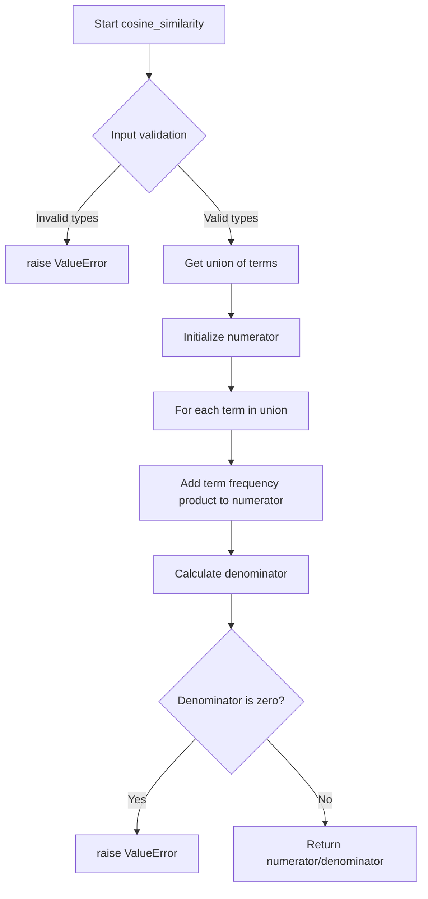
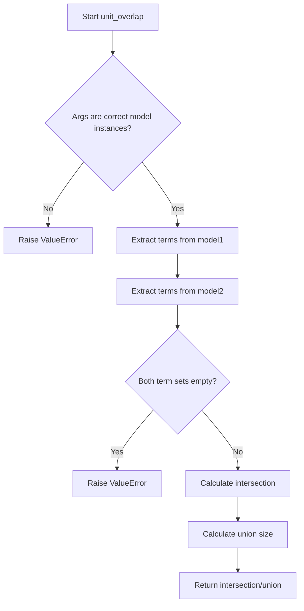

# `content_based.py`

## `sumy.evaluation.content_based.cosine_similarity` · *function*

## Summary:
Computes the cosine similarity between two document models based on their term frequencies.

## Description:
Calculates the cosine similarity between two TfDocumentModel instances by comparing their term frequency vectors. This function implements the standard cosine similarity formula using dot product of term frequency vectors divided by the product of their magnitudes.

The function is extracted into its own component to provide a reusable utility for comparing document representations in content-based evaluation metrics. It encapsulates the mathematical computation of cosine similarity while enforcing type safety and proper validation of input document models.

## Args:
    evaluated_model (TfDocumentModel): The first document model to compare
    reference_model (TfDocumentModel): The second document model to compare

## Returns:
    float: The cosine similarity value between -1 and 1, where 1 indicates identical documents, 0 indicates orthogonal documents, and -1 indicates opposite documents.

## Raises:
    ValueError: If either argument is not an instance of TfDocumentModel, or if both document models are empty (magnitude of 0.0).

## Constraints:
    Preconditions:
        - Both arguments must be instances of TfDocumentModel class
        - Neither document model should be empty (have zero magnitude)
    
    Postconditions:
        - Returns a float value in the range [-1.0, 1.0]
        - The computation uses all terms present in either document model

## Side Effects:
    None

## Control Flow:


## Examples:
    # Basic usage with two document models
    similarity = cosine_similarity(doc1_model, doc2_model)
    
    # Error handling for invalid input
    try:
        similarity = cosine_similarity(invalid_input, doc2_model)
    except ValueError as e:
        print(f"Invalid input: {e}")
        
    # Error handling for empty documents
    try:
        similarity = cosine_similarity(empty_model, doc2_model)
    except ValueError as e:
        print(f"Empty document error: {e}")
```

## `sumy.evaluation.content_based.unit_overlap` · *function*

## Summary:
Computes the unit overlap similarity between two document models based on their term sets.

## Description:
This function calculates the Jaccard similarity coefficient between two document models by comparing their unique terms. It's designed to measure content similarity between documents in a text summarization evaluation context. The function extracts terms from both models, computes their intersection and union, and returns the ratio of common terms to total unique terms.

The logic is extracted into a separate function to provide a clean interface for similarity computation while enforcing type checking and validation of input documents.

## Args:
    evaluated_model (object): The first document model to compare, containing terms from a document
    reference_model (object): The second document model to compare, containing terms from a document

## Returns:
    float: The unit overlap similarity score between 0 and 1, where 1 indicates identical terms and 0 indicates no common terms

## Raises:
    ValueError: If either argument is not an instance of the expected document model type (likely TfDocumentModel), or if both documents are empty

## Constraints:
    Preconditions:
        - Both arguments must be instances of the appropriate document model class (likely TfDocumentModel)
        - At least one of the documents must contain terms
    Postconditions:
        - Returns a float value between 0 and 1 inclusive
        - The result represents the Jaccard similarity coefficient

## Side Effects:
    None

## Control Flow:


## Examples:
    # Basic usage with valid models
    similarity = unit_overlap(doc_model1, doc_model2)
    
    # Error case - invalid model type
    try:
        unit_overlap(invalid_model, doc_model)
    except ValueError as e:
        print(f"Error: {e}")
        
    # Error case - empty documents
    try:
        unit_overlap(empty_model1, empty_model2)
    except ValueError as e:
        print(f"Error: {e}")
```

