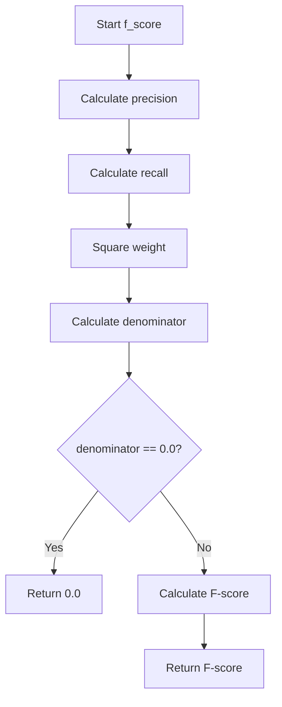
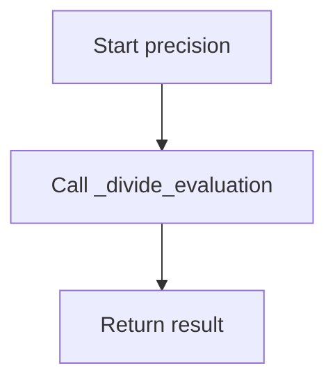
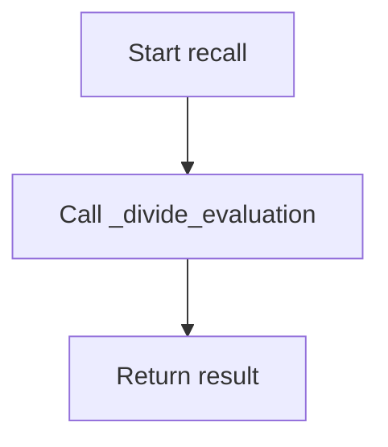

# `coselection.py`

## `sumy.evaluation.coselection.f_score` · *function*

## Summary:
Computes the F-score metric for coselection evaluation by combining precision and recall with a configurable beta weight.

## Description:
This function implements the F-score (F-measure) calculation for coselection evaluation tasks. It combines precision and recall metrics using a weighted harmonic mean to provide a balanced measure of evaluation quality.

The function delegates to existing precision() and recall() functions to compute the base metrics, then applies the standard F-score formula with configurable weighting. This extraction allows for clean separation of concerns between individual metric calculation and their combination into a composite score.

## Args:
    evaluated_sentences (Iterable[str]): Collection of sentences that are being evaluated for selection quality, typically representing the output of a selection algorithm.
    reference_sentences (Iterable[str]): Collection of sentences that serve as the reference or ground truth, typically representing the complete set of sentences to be selected from.
    weight (float): Beta weight parameter that controls the balance between precision and recall. Default is 1.0 (equal weighting). Higher values favor recall, lower values favor precision.

## Returns:
    float: The F-score value ranging from 0.0 to 1.0, where 1.0 indicates perfect balance between precision and recall, and 0.0 indicates no overlap between reference and evaluated sets.

## Raises:
    None

## Constraints:
    Preconditions:
        - Both evaluated_sentences and reference_sentences must contain at least one sentence.
        - Sentences should be represented as strings.
        - The weight parameter should be non-negative.
    Postconditions:
        - The returned value is always between 0.0 and 1.0 inclusive.
        - When both precision and recall are zero, the function returns 0.0 to avoid division by zero.

## Side Effects:
    None

## Control Flow:


## Examples:
    >>> f_score(["a", "b"], ["a", "b", "c"])
    0.6666666666666666
    >>> f_score(["a", "b"], ["a", "b", "c"], weight=2.0)
    0.5714285714285714
    >>> f_score(["a", "b"], ["a", "b", "c"], weight=0.5)
    0.75
```

## `sumy.evaluation.coselection.precision` · *function*

## Summary:
Computes the precision metric for coselection evaluation by measuring the ratio of reference sentences that are present in the evaluated set.

## Description:
This function calculates precision in the context of coselection evaluation, determining how many of the reference sentences are successfully selected in the evaluated set. It serves as a key performance indicator for assessing the quality of sentence selection algorithms. The function delegates the actual computation to `_divide_evaluation` with the arguments reversed to maintain the proper mathematical definition of precision.

## Args:
    evaluated_sentences (Iterable[str]): Collection of sentences that are being evaluated for selection quality, typically representing the output of a selection algorithm.
    reference_sentences (Iterable[str]): Collection of sentences that serve as the reference or ground truth, typically representing the complete set of sentences to be selected from.

## Returns:
    float: The precision score ranging from 0.0 to 1.0, where 1.0 indicates perfect recall of reference sentences and 0.0 indicates no overlap between reference and evaluated sets.

## Raises:
    ValueError: When either the reference_sentences or evaluated_sentences collection is empty, as precision calculation requires both sets to contain at least one sentence.

## Constraints:
    Preconditions:
        - Both evaluated_sentences and reference_sentences must contain at least one sentence.
        - Sentences should be represented as strings.
    Postconditions:
        - The returned value is always between 0.0 and 1.0 inclusive.
        - The function performs set operations to ensure efficient computation of common elements.

## Side Effects:
    None

## Control Flow:


## Examples:
    >>> precision(["a", "b"], ["a", "b", "c"])
    0.6666666666666666
    >>> precision(["a", "b", "c"], ["a", "b"])
    1.0
    >>> precision([], ["a", "b"])
    ValueError: Both collections have to contain at least 1 sentence.
```

## `sumy.evaluation.coselection.recall` · *function*

## Summary:
Computes the recall metric by calculating the ratio of common sentences between evaluated and reference sentence sets.

## Description:
This function serves as a wrapper around `_divide_evaluation` to calculate recall for coselection evaluation. It measures how well the evaluated sentence set captures the reference sentence set by determining the proportion of reference sentences that appear in the evaluated set. This metric is commonly used in summarization and text selection tasks to assess the completeness of selected content.

## Args:
    evaluated_sentences (Iterable[str]): Collection of sentences that are being evaluated for selection quality.
    reference_sentences (Iterable[str]): Collection of sentences that serve as the ground truth or reference.

## Returns:
    float: The recall value representing the ratio of common sentences to total reference sentences. This value ranges from 0.0 to 1.0, where 1.0 indicates perfect recall (all reference sentences are captured).

## Raises:
    ValueError: When either the evaluated_sentences or reference_sentences collection is empty.

## Constraints:
    Preconditions:
        - Both evaluated_sentences and reference_sentences must contain at least one sentence.
        - Sentences should be represented as strings.
    Postconditions:
        - The returned value is always between 0.0 and 1.0 inclusive.
        - The function performs set operations to ensure efficient computation of common elements.

## Side Effects:
    None

## Control Flow:


## Examples:
    >>> recall(["a", "b", "c"], ["a", "b"])
    1.0
    >>> recall(["a", "b"], ["a", "b", "c"])
    0.6666666666666666
    >>> recall([], ["a", "b"])
    ValueError: Both collections have to contain at least 1 sentence.
```

## `sumy.evaluation.coselection._divide_evaluation` · *function*

## Summary:
Calculates the ratio of common sentences between two collections, representing the selection effectiveness of a subset.

## Description:
This function computes the fraction of sentences in the denominator collection that are also present in the numerator collection. It serves as a core evaluation metric for measuring how well a selected subset represents the full set of sentences. The function is designed to be used internally within the coselection evaluation framework.

## Args:
    numerator_sentences (Iterable[str]): Collection of sentences that serve as the reference or ground truth.
    denominator_sentences (Iterable[str]): Collection of sentences that are being evaluated for selection quality.

## Returns:
    float: The ratio of common sentences to total sentences in the denominator collection. This value ranges from 0.0 to 1.0, where 1.0 indicates perfect selection coverage.

## Raises:
    ValueError: When either the numerator_sentences or denominator_sentences collection is empty.

## Constraints:
    Preconditions:
        - Both numerator_sentences and denominator_sentences must contain at least one sentence.
        - Sentences should be represented as strings.
    Postconditions:
        - The returned value is always between 0.0 and 1.0 inclusive.
        - The function performs set operations to ensure efficient computation of common elements.

## Side Effects:
    None

## Control Flow:
```mermaid
flowchart TD
    A[Start _divide_evaluation] --> B{len(numerator_sentences) == 0 OR len(denominator_sentences) == 0?}
    B -- Yes --> C[Raise ValueError]
    B -- No --> D[Convert to frozenset]
    D --> E[Calculate common_count]
    E --> F[Calculate choosen_count]
    F --> G[assert choosen_count != 0]
    G --> H[Return common_count / choosen_count]
```

## Examples:
    >>> _divide_evaluation(["a", "b", "c"], ["a", "b"])
    1.0
    >>> _divide_evaluation(["a", "b"], ["a", "b", "c"])
    0.6666666666666666
    >>> _divide_evaluation([], ["a", "b"])
    ValueError: Both collections have to contain at least 1 sentence.
```

