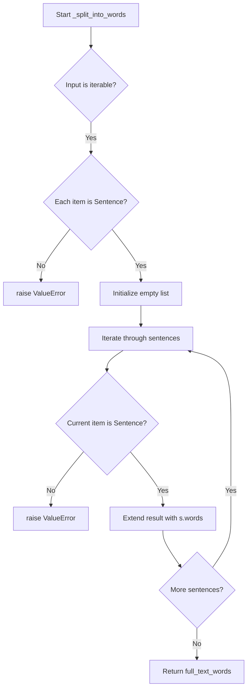

# `rouge.py`

## `sumy.evaluation.rouge._get_ngrams` · *function*

## Summary:
Generates a set of n-grams from a given text sequence by sliding a window of size n across the text.

## Description:
This function extracts all contiguous subsequences of length n from the input text and returns them as a set of tuples. It is commonly used in natural language processing tasks such as ROUGE evaluation to compare overlapping word sequences between reference and candidate texts.

## Args:
    n (int): The size of the n-grams to extract. Must be a non-negative integer.
    text (list): A sequence (such as a list of words or tokens) from which to extract n-grams.

## Returns:
    set[tuple]: A set containing tuples representing all unique n-grams found in the text. Each tuple contains n consecutive elements from the input text. Returns an empty set when n is greater than the length of text.

## Raises:
    TypeError: If n is not an integer or if text is not iterable.

## Constraints:
    Preconditions:
        - n must be a non-negative integer
        - text must be iterable (e.g., list, tuple, string)
    Postconditions:
        - The returned set will contain at most (len(text) - n + 1) elements when n <= len(text)
        - All elements in the returned tuples are from the original text in order
        - Duplicate n-grams are removed due to the use of a set
        - When n > len(text), an empty set is returned

## Side Effects:
    None

## Control Flow:
```mermaid
flowchart TD
    A[Start _get_ngrams(n, text)] --> B{Is n >= 0?}
    B -- No --> C[Raise TypeError]
    B -- Yes --> D{Is text iterable?}
    D -- No --> E[Raise TypeError]
    D -- Yes --> F[Initialize ngram_set = set()]
    F --> G[Get text_length = len(text)]
    G --> H[Calculate max_index_ngram_start = text_length - n]
    H --> I{max_index_ngram_start >= 0?}
    I -- No --> J[Return empty set]
    I -- Yes --> K[Loop i from 0 to max_index_ngram_start]
    K --> L[Add tuple(text[i:i+n]) to ngram_set]
    L --> M[Return ngram_set]
```

## Examples:
    >>> _get_ngrams(2, ['the', 'quick', 'brown', 'fox'])
    {('the', 'quick'), ('quick', 'brown'), ('brown', 'fox')}
    
    >>> _get_ngrams(3, ['a', 'b', 'c'])
    {('a', 'b', 'c')}
    
    >>> _get_ngrams(2, ['a', 'b'])
    {('a', 'b')}
    
    >>> _get_ngrams(3, ['a', 'b'])
    set()
    
    >>> _get_ngrams(0, ['a', 'b', 'c'])
    set()

## `sumy.evaluation.rouge._split_into_words` · *function*

## Summary:
Converts a collection of Sentence objects into a flat list of word tokens.

## Description:
This function processes a sequence of Sentence objects and extracts all word tokens from each sentence, returning them as a single flattened list. It serves as a utility for preparing text data for evaluation metrics that require tokenized input.

The function is called by various ROUGE evaluation components that need to process sentence-level word collections for scoring calculations. It's extracted into its own function to enforce type safety and provide a clean abstraction for word token extraction from sentence objects.

## Args:
    sentences (Iterable[Sentence]): An iterable collection of Sentence objects to process. Each object must be of type Sentence.

## Returns:
    list[str]: A flat list containing all word tokens from all input sentences, in order.

## Raises:
    ValueError: When any object in the input collection is not of type Sentence.

## Constraints:
    Preconditions:
        - Input must be iterable
        - All elements in the input must be instances of Sentence class
    Postconditions:
        - Returns a list of strings representing word tokens
        - Order of words is preserved from input sentences

## Side Effects:
    None

## Control Flow:


## Examples:
```python
# Basic usage with valid Sentence objects
sentences = [Sentence("Hello world", tokenizer), Sentence("How are you?", tokenizer)]
words = _split_into_words(sentences)
# Returns: ['Hello', 'world', 'How', 'are', 'you', '?']

# Error case - invalid input type
try:
    _split_into_words(["not_a_sentence"])
except ValueError as e:
    print(e)  # Prints: "Object in collection must be of type Sentence"
```

## `sumy.evaluation.rouge._get_word_ngrams` · *function*

## Summary:
Extracts a set of unique n-grams from a list of Sentence objects by converting them to word tokens and generating n-grams.

## Description:
This function processes a list of Sentence objects to extract all unique n-grams of a specified size. It first converts each sentence into a list of word tokens using `_split_into_words`, then generates n-grams of size `n` from the concatenated word sequences using `_get_ngrams`. The result is a set containing all unique n-grams found across all input sentences.

The function is specifically designed for ROUGE evaluation metrics where n-gram overlap between reference and candidate texts needs to be computed. It provides a clean abstraction for the preprocessing and n-gram generation steps required for such evaluations.

## Args:
    n (int): The size of n-grams to extract. Must be a positive integer (> 0).
    sentences (list[Sentence]): A list of Sentence objects containing the text to process. Must contain at least one sentence.

## Returns:
    set[tuple]: A set of unique n-grams represented as tuples of words. Each tuple contains n consecutive words from the input sentences. Returns an empty set if no valid n-grams can be generated.

## Raises:
    AssertionError: When len(sentences) <= 0 or n <= 0, indicating invalid input parameters.

## Constraints:
    Preconditions:
        - The n parameter must be a positive integer
        - The sentences parameter must be a non-empty list
        - Each element in sentences must be a valid Sentence object
    Postconditions:
        - The returned set contains only unique n-grams
        - All n-grams are formed from the word tokens of input sentences
        - The order of sentences in the input list is preserved during processing

## Side Effects:
    None

## Control Flow:
```mermaid
flowchart TD
    A[Start _get_word_ngrams(n, sentences)] --> B{len(sentences) > 0?}
    B -- No --> C[Raise AssertionError]
    B -- Yes --> D{n > 0?}
    D -- No --> E[Raise AssertionError]
    D -- Yes --> F[Initialize empty set words]
    F --> G[Iterate through sentences]
    G --> H[Call _split_into_words([sentence])]
    H --> I[Call _get_ngrams(n, split_result)]
    I --> J[Update words with n-grams]
    J --> K{More sentences?}
    K -- Yes --> G
    K -- No --> L[Return words set]
```

## Examples:
    >>> from models.dom import Sentence
    >>> sentences = [Sentence("The quick brown fox", tokenizer), Sentence("Jumps over the lazy dog", tokenizer)]
    >>> _get_word_ngrams(2, sentences)
    {('The', 'quick'), ('quick', 'brown'), ('brown', 'fox'), ('Jumps', 'over'), ('over', 'the'), ('the', 'lazy'), ('lazy', 'dog')}
    
    >>> _get_word_ngrams(3, [Sentence("Hello world", tokenizer)])
    {('Hello', 'world')}
    
    >>> _get_word_ngrams(1, [Sentence("A B C", tokenizer)])
    {('A',), ('B',), ('C',)}
```

## `sumy.evaluation.rouge._get_index_of_lcs` · *function*

## Summary:
Returns the lengths of two input sequences as a tuple for use in longest common subsequence operations.

## Description:
This function takes two sequences as input and returns their lengths as a tuple. It serves as a simple utility function that extracts sequence length information, likely used as part of a longest common subsequence (LCS) algorithm implementation. The function provides a clean interface for obtaining sequence dimensions without requiring direct access to the len() function.

This logic is extracted into its own function rather than being inlined to:
- Provide a consistent interface for sequence length retrieval
- Enable potential future modifications to length calculation logic
- Support testing of the length extraction functionality independently

## Args:
    x (sequence): First input sequence (e.g., string, list, or other iterable)
    y (sequence): Second input sequence (e.g., string, list, or other iterable)

## Returns:
    tuple[int, int]: A tuple containing (len(x), len(y)) representing the lengths of both input sequences

## Raises:
    TypeError: If either x or y does not support the len() function

## Constraints:
    Preconditions:
    - Both x and y must be sequences that support the len() function
    - Input types should be compatible with len() function
    
    Postconditions:
    - Function always returns a tuple of two integers
    - Returned values represent the actual lengths of input sequences

## Side Effects:
    None

## Control Flow:
```mermaid
flowchart TD
    A[Start _get_index_of_lcs(x,y)] --> B{Validate x and y are sequences}
    B --> C[Return (len(x), len(y))]
    C --> D[End]
```

## Examples:
    # Basic usage with strings
    result = _get_index_of_lcs("hello", "world")
    # Returns (5, 5)
    
    # Usage with lists
    result = _get_index_of_lcs([1,2,3], [4,5])
    # Returns (3, 2)

## `sumy.evaluation.rouge._len_lcs` · *function*

## Summary:
Calculates the length of the longest common subsequence (LCS) between two sequences using dynamic programming tables.

## Description:
Computes the length of the longest common subsequence between two input sequences by leveraging precomputed dynamic programming tables. This function serves as a bridge between the LCS table computation and the final result extraction, specifically retrieving the LCS length from the computed table.

The function is extracted into its own component to:
- Separate the algorithmic computation (table building) from result retrieval (value extraction)
- Provide a clean interface for accessing LCS length without exposing internal table structure
- Enable reuse of the LCS length calculation logic across different ROUGE metrics implementations

## Args:
    x (sequence): First input sequence (e.g., string, list, or other iterable)
    y (sequence): Second input sequence (e.g., string, list, or other iterable)

## Returns:
    int: The length of the longest common subsequence between sequences x and y

## Raises:
    KeyError: When attempting to access table coordinates that were not computed due to invalid indices or mismatched sequence lengths
    TypeError: When either x or y does not support the len() function or indexing operations

## Constraints:
    Preconditions:
    - Both x and y must be indexable sequences that support the len() function
    - Sequences must be compatible with indexing operations
    - The sequences should be such that _lcs(x, y) can successfully compute a table
    - Indices used for table access must be valid (within bounds)
    
    Postconditions:
    - Returns a non-negative integer representing the LCS length
    - The returned value corresponds to the optimal solution of the LCS problem for the given inputs

## Side Effects:
    None

## Control Flow:
```mermaid
flowchart TD
    A[Start _len_lcs(x, y)] --> B[table = _lcs(x, y)]
    B --> C[n, m = _get_index_of_lcs(x, y)]
    C --> D[return table[n, m]]
    D --> E[End]
```

## Examples:
    # Basic usage with strings
    result = _len_lcs("hello", "world")
    # Returns 2 (common subsequence: "l", "o")
    
    # Usage with lists
    result = _len_lcs([1,2,3,4], [2,4,6])
    # Returns 2 (common subsequence: [2, 4])
```

## `sumy.evaluation.rouge._lcs` · *function*

## Summary:
Computes the dynamic programming table for the longest common subsequence (LCS) algorithm between two sequences.

## Description:
Implements the classic dynamic programming approach to compute the longest common subsequence table for two input sequences. This function builds a 2D table where each cell [i,j] represents the length of the LCS between the first i elements of sequence x and the first j elements of sequence y. The table is used by higher-level functions to reconstruct the actual LCS or calculate LCS-based metrics like ROUGE scores.

This logic is extracted into its own function rather than being inlined because:
- It encapsulates the core computational algorithm for LCS table construction
- Enables reuse across different ROUGE metric calculations (ROUGE-L, etc.)
- Provides a clean separation between the algorithmic core and result extraction logic
- Allows for easier testing and optimization of the table-building process

## Args:
    x (sequence): First input sequence (e.g., string, list, or other iterable)
    y (sequence): Second input sequence (e.g., string, list, or other iterable)

## Returns:
    dict[tuple[int, int], int]: A dictionary-based 2D table where keys are coordinate tuples (i,j) and values are the LCS lengths for subsequences of length i and j respectively. The table has dimensions (len(x)+1) × (len(y)+1) with indices ranging from (0,0) to (len(x), len(y)).

## Raises:
    None explicitly raised - however, underlying operations may raise exceptions if sequences are incompatible with indexing operations.

## Constraints:
    Preconditions:
    - Both x and y must be indexable sequences (support __getitem__ and len())
    - Sequences should be compatible with integer indexing operations
    - Indexing operations must not raise exceptions for valid indices
    
    Postconditions:
    - Returns a complete table with all cells populated according to LCS algorithm
    - Table size is (len(x)+1) × (len(y)+1) 
    - All values in the table are non-negative integers

## Side Effects:
    None

## Control Flow:
```mermaid
flowchart TD
    A[Start _lcs(x, y)] --> B[n, m = _get_index_of_lcs(x, y)]
    B --> C[table = dict()]
    C --> D[i = 0 to n+1]
    D --> E[j = 0 to m+1]
    E --> F{if i == 0 or j == 0}
    F -->|True| G[table[i,j] = 0]
    F -->|False| H{x[i-1] == y[j-1]}
    H -->|True| I[table[i,j] = table[i-1,j-1] + 1]
    H -->|False| J[table[i,j] = max(table[i-1,j], table[i,j-1])]
    J --> K[Return table]
```

## Examples:
    # Basic usage with strings
    lcs_table = _lcs("abc", "ac")
    # Returns a dictionary with entries like {(0,0): 0, (1,0): 0, (0,1): 0, (1,1): 1, ...}
    
    # Usage with lists
    lcs_table = _lcs([1,2,3], [2,3])
    # Returns a dictionary with entries showing LCS lengths for all subsequence combinations

## `sumy.evaluation.rouge._recon_lcs` · *function*

## Summary:
Reconstructs the longest common subsequence (LCS) from two sequences using a backtracking algorithm based on a precomputed LCS table.

## Description:
This function implements a backtracking algorithm to reconstruct the actual longest common subsequence (LCS) from two input sequences. It uses a precomputed LCS table (generated by `_lcs`) and a helper function `_get_index_of_lcs` to determine the starting position for backtracking. The function recursively traces backwards through the LCS table to build the actual subsequence, returning it as a tuple of elements.

This logic is extracted into its own function rather than being inlined because:
- It separates the algorithmic core of LCS reconstruction from the table computation
- It enables reuse of the reconstruction logic across different ROUGE metric implementations
- It provides a clean abstraction layer for the backtracking process
- It allows for easier testing and debugging of the reconstruction algorithm independently

## Args:
    x (sequence): First input sequence (e.g., string, list, or other iterable) to compare
    y (sequence): Second input sequence (e.g., string, list, or other iterable) to compare

## Returns:
    tuple: A tuple containing the reconstructed longest common subsequence elements in order. Returns an empty tuple if either input sequence is empty or if there is no common subsequence. The elements in the tuple maintain their relative order from the original sequences.

## Raises:
    None explicitly raised - however, underlying operations may raise exceptions if sequences are incompatible with indexing operations or if recursive depth exceeds system limits.

## Constraints:
    Preconditions:
    - Both x and y must be indexable sequences (support __getitem__ and len())
    - Sequences should be compatible with integer indexing operations
    - The sequences must have been processed by the `_lcs` function to ensure proper table construction
    - Recursive depth should not exceed system limits for large sequences
    
    Postconditions:
    - Returns a tuple containing elements that form the longest common subsequence
    - Elements in the returned tuple maintain their relative order from the original sequences
    - The returned tuple represents a valid subsequence of both input sequences

## Side Effects:
    None

## Control Flow:
```mermaid
flowchart TD
    A[Start _recon_lcs(x, y)] --> B[table = _lcs(x, y)]
    B --> C[_get_index_of_lcs(x, y) -> i, j]
    C --> D[_recon(i, j) recursive call]
    D --> E{Base case: i == 0 or j == 0}
    E -->|True| F[Return []]
    E -->|False| G{x[i-1] == y[j-1]}
    G -->|True| H[Return _recon(i-1, j-1) + [(x[i-1], i)]]
    G -->|False| I[table[i-1, j] > table[i, j-1]]
    I -->|True| J[Return _recon(i-1, j)]
    I -->|False| K[Return _recon(i, j-1)]
    L[Process result] --> M[map(lambda r: r[0], result)]
    M --> N[Return tuple(result)]
```

## Examples:
    # Basic usage with strings
    result = _recon_lcs("abcde", "acde")
    # Returns ('a', 'c', 'd', 'e') - the longest common subsequence
    
    # Usage with lists
    result = _recon_lcs([1,2,3,4,5], [2,4,5])
    # Returns (2, 4, 5) - the longest common subsequence
    
    # Edge case with empty sequences
    result = _recon_lcs("", "abc")
    # Returns () - empty tuple
    
    # Edge case with no common subsequence
    result = _recon_lcs("abc", "xyz")
    # Returns () - empty tuple

## `sumy.evaluation.rouge.rouge_n` · *function*

## Summary:
Computes the ROUGE-N metric by calculating the overlap ratio of n-grams between evaluated and reference sentence collections.

## Description:
This function implements the ROUGE-N evaluation metric, which measures the overlap of n-grams between a set of evaluated sentences and a set of reference sentences. It extracts n-grams of a specified size from both collections and computes the ratio of overlapping n-grams to total reference n-grams. The ROUGE-N metric is commonly used in automatic text summarization evaluation to measure the similarity between generated summaries and reference summaries.

The function is extracted into its own component to encapsulate the core n-gram overlap computation logic, separating it from sentence processing and tokenization concerns. This modular approach allows for reuse in different evaluation contexts while maintaining clean responsibility boundaries.

## Args:
    evaluated_sentences (list[Sentence]): A list of Sentence objects representing the evaluated text to compare against references. Must contain at least one sentence.
    reference_sentences (list[Sentence]): A list of Sentence objects representing the reference text to compare against the evaluation. Must contain at least one sentence.
    n (int): The size of n-grams to extract and compare. Defaults to 2 (bigrams). Must be a positive integer.

## Returns:
    float: The ROUGE-N score, representing the ratio of overlapping n-grams to total reference n-grams. Returns 0.0 when there are no reference n-grams to compare against.

## Raises:
    ValueError: When either evaluated_sentences or reference_sentences contains zero sentences, indicating invalid input collections.

## Constraints:
    Preconditions:
        - Both evaluated_sentences and reference_sentences must be non-empty lists
        - Each element in both lists must be a valid Sentence object
        - The n parameter must be a positive integer
    Postconditions:
        - The returned score is always between 0.0 and 1.0 inclusive
        - The function handles empty intersections gracefully by returning 0.0 when reference_count is 0

## Side Effects:
    None

## Control Flow:
```mermaid
flowchart TD
    A[Start rouge_n(evaluated_sentences, reference_sentences, n)] --> B{len(evaluated_sentences) <= 0 OR len(reference_sentences) <= 0?}
    B -- Yes --> C[Raise ValueError]
    B -- No --> D[Call _get_word_ngrams(n, evaluated_sentences)]
    D --> E[Call _get_word_ngrams(n, reference_sentences)]
    E --> F[reference_count = len(reference_ngrams)]
    F --> G[overlapping_ngrams = evaluated_ngrams ∩ reference_ngrams]
    G --> H[overlapping_count = len(overlapping_ngrams)]
    H --> I[Return overlapping_count / reference_count]
```

## Examples:
    >>> from models.dom import Sentence
    >>> evaluated = [Sentence("The cat sat on the mat", tokenizer)]
    >>> reference = [Sentence("The cat was sitting on the mat", tokenizer)]
    >>> rouge_n(evaluated, reference, n=2)
    0.6666666666666666
    
    >>> rouge_n([], reference, n=2)
    ValueError: Collections must contain at least 1 sentence.
```

## `sumy.evaluation.rouge.rouge_1` · *function*

## Summary:
Computes the ROUGE-1 metric by calculating the overlap ratio of unigrams between evaluated and reference sentence collections.

## Description:
This function implements the ROUGE-1 evaluation metric, which measures the overlap of unigrams (single words) between a set of evaluated sentences and a set of reference sentences. It serves as a specialized wrapper around the general ROUGE-N implementation, specifically configured for unigram analysis.

The function is extracted into its own component to provide a dedicated interface for ROUGE-1 evaluation while leveraging the existing n-gram overlap computation logic. This modular approach maintains clean responsibility boundaries and enables easy reuse of the underlying n-gram processing functionality.

## Args:
    evaluated_sentences (list[Sentence]): A list of Sentence objects representing the evaluated text to compare against references. Must contain at least one sentence.
    reference_sentences (list[Sentence]): A list of Sentence objects representing the reference text to compare against the evaluation. Must contain at least one sentence.

## Returns:
    float: The ROUGE-1 score, representing the ratio of overlapping unigrams to total reference unigrams. Returns 0.0 when there are no reference unigrams to compare against.

## Raises:
    ValueError: When either evaluated_sentences or reference_sentences contains zero sentences, indicating invalid input collections.

## Constraints:
    Preconditions:
        - Both evaluated_sentences and reference_sentences must be non-empty lists
        - Each element in both lists must be a valid Sentence object
    Postconditions:
        - The returned score is always between 0.0 and 1.0 inclusive
        - The function handles empty intersections gracefully by returning 0.0 when reference_count is 0

## Side Effects:
    None

## Control Flow:
```mermaid
flowchart TD
    A[Start rouge_1(evaluated_sentences, reference_sentences)] --> B[Call rouge_n(evaluated_sentences, reference_sentences, 1)]
    B --> C[Return rouge_n result]
```

## Examples:
    >>> from models.dom import Sentence
    >>> evaluated = [Sentence("The cat sat on the mat", tokenizer)]
    >>> reference = [Sentence("The cat was sitting on the mat", tokenizer)]
    >>> rouge_1(evaluated, reference)
    0.6666666666666666

## `sumy.evaluation.rouge.rouge_2` · *function*

## Summary:
Computes the ROUGE-2 metric by calculating the overlap ratio of bigrams between evaluated and reference sentence collections.

## Description:
This function implements the ROUGE-2 evaluation metric, which measures the overlap of bigrams (2-word sequences) between a set of evaluated sentences and a set of reference sentences. It serves as a specialized wrapper around the general ROUGE-N implementation, specifically configured for bigram analysis.

The function is extracted into its own component to provide a dedicated interface for ROUGE-2 calculations while leveraging the reusable n-gram overlap computation logic from rouge_n. This modular approach enables clean separation of concerns and facilitates reuse of the underlying n-gram processing functionality.

## Args:
    evaluated_sentences (list[Sentence]): A list of Sentence objects representing the evaluated text to compare against references. Must contain at least one sentence.
    reference_sentences (list[Sentence]): A list of Sentence objects representing the reference text to compare against the evaluation. Must contain at least one sentence.

## Returns:
    float: The ROUGE-2 score, representing the ratio of overlapping bigrams to total reference bigrams. Returns 0.0 when there are no reference bigrams to compare against.

## Raises:
    ValueError: When either evaluated_sentences or reference_sentences contains zero sentences, indicating invalid input collections.

## Constraints:
    Preconditions:
        - Both evaluated_sentences and reference_sentences must be non-empty lists
        - Each element in both lists must be a valid Sentence object
    Postconditions:
        - The returned score is always between 0.0 and 1.0 inclusive
        - The function handles empty intersections gracefully by returning 0.0 when reference_count is 0

## Side Effects:
    None

## Control Flow:
```mermaid
flowchart TD
    A[Start rouge_2(evaluated_sentences, reference_sentences)] --> B[Call rouge_n(evaluated_sentences, reference_sentences, 2)]
    B --> C[Return rouge_n result]
```

## Examples:
    >>> from models.dom import Sentence
    >>> evaluated = [Sentence("The cat sat on the mat", tokenizer)]
    >>> reference = [Sentence("The cat was sitting on the mat", tokenizer)]
    >>> rouge_2(evaluated, reference)
    0.6666666666666666

## `sumy.evaluation.rouge._f_lcs` · *function*

## Summary:
Computes the F1-measure for longest common subsequence (LCS) between two sequences.

## Description:
This function calculates the F1-measure (harmonic mean) of recall and precision based on the longest common subsequence length. It implements the standard F1-score formula where beta = 1, making it equivalent to the F1-score for LCS-based text similarity. This is used in ROUGE evaluation metrics to quantify similarity between reference and candidate text sequences.

## Args:
    llcs (float): Length of the longest common subsequence between reference and candidate texts.
    m (int): Length of the reference text sequence.
    n (int): Length of the candidate text sequence.

## Returns:
    float: The F1-measure value representing the harmonic mean of recall and precision for LCS similarity.

## Raises:
    ZeroDivisionError: When either m or n is zero, causing division by zero in calculations.

## Constraints:
    Preconditions:
        - llcs must be non-negative (llcs >= 0)
        - m must be positive (m > 0)
        - n must be positive (n > 0)
    Postconditions:
        - Returns a value between 0 and 1 inclusive
        - If llcs equals 0, returns 0 regardless of m and n values
        - If llcs equals both m and n, returns 1

## Side Effects:
    None

## Control Flow:
```mermaid
flowchart TD
    A[Start _f_lcs] --> B[r_lcs = llcs / m]
    B --> C[p_lcs = llcs / n]
    C --> D[beta = p_lcs / r_lcs]
    D --> E[num = (1 + beta^2) * r_lcs * p_lcs]
    E --> F[denom = r_lcs + (beta^2 * p_lcs)]
    F --> G[return num / denom]
```

## Examples:
    >>> _f_lcs(3.0, 5.0, 4.0)
    0.6
    >>> _f_lcs(0.0, 5.0, 4.0)
    0.0
    >>> _f_lcs(5.0, 5.0, 5.0)
    1.0
```

## `sumy.evaluation.rouge.rouge_l_sentence_level` · *function*

## Summary:
Computes the ROUGE-L sentence-level evaluation metric by calculating the F1-score based on the longest common subsequence between reference and evaluated sentences.

## Description:
This function implements the ROUGE-L (Recall-Oriented Understudy for Gisting Evaluation - Longest Common Subsequence) metric at the sentence level. It takes collections of reference and evaluated sentences, converts them to word tokens, computes the longest common subsequence length, and returns the F1-score that balances precision and recall for sentence-level text similarity assessment.

The function is extracted into its own component to:
- Encapsulate the complete ROUGE-L sentence-level computation workflow
- Provide a clean interface for sentence-level evaluation metrics
- Separate concerns between text preprocessing, LCS computation, and final scoring
- Enable reuse across different evaluation contexts while maintaining consistent behavior

## Args:
    evaluated_sentences (Iterable[Sentence]): Collection of Sentence objects representing the evaluated text to be compared against references. Must contain at least one sentence.
    reference_sentences (Iterable[Sentence]): Collection of Sentence objects representing the reference text used for comparison. Must contain at least one sentence.

## Returns:
    float: The ROUGE-L F1-score between the evaluated and reference sentences, ranging from 0.0 (no overlap) to 1.0 (perfect match).

## Raises:
    ValueError: When either evaluated_sentences or reference_sentences contains zero elements, indicating empty collections.

## Constraints:
    Preconditions:
        - Both evaluated_sentences and reference_sentences must be non-empty collections
        - Each element in both collections must be of type Sentence
        - Collections must support the len() function and iteration
    Postconditions:
        - Returns a floating-point value between 0.0 and 1.0 inclusive
        - If both collections are empty, raises ValueError
        - If collections contain non-Sentence objects, raises ValueError via _split_into_words

## Side Effects:
    None

## Control Flow:
```mermaid
flowchart TD
    A[Start rouge_l_sentence_level] --> B{Empty collections?}
    B -- Yes --> C[raise ValueError]
    B -- No --> D[_split_into_words(reference_sentences)]
    D --> E[_split_into_words(evaluated_sentences)]
    E --> F[m = len(reference_words)]
    F --> G[n = len(evaluated_words)]
    G --> H[lcs = _len_lcs(evaluated_words, reference_words)]
    H --> I[return _f_lcs(lcs, m, n)]
```

## Examples:
    # Basic usage with valid Sentence objects
    from sumy.models.dom import Sentence
    from sumy.tokenizers import Tokenizer
    
    tokenizer = Tokenizer("english")
    ref_sent1 = Sentence("The cat sat on the mat.", tokenizer)
    ref_sent2 = Sentence("Dogs are loyal animals.", tokenizer)
    eval_sent1 = Sentence("The cat sat on the rug.", tokenizer)
    eval_sent2 = Sentence("Dogs are faithful pets.", tokenizer)
    
    score = rouge_l_sentence_level([eval_sent1, eval_sent2], [ref_sent1, ref_sent2])
    # Returns a float value between 0.0 and 1.0 representing ROUGE-L score
    
    # Error case - empty collections
    try:
        rouge_l_sentence_level([], [ref_sent1])
    except ValueError as e:
        print(e)  # Prints: "Collections must contain at least 1 sentence."
```

## `sumy.evaluation.rouge._union_lcs` · *function*

## Summary:
Computes the union-based longest common subsequence (LCS) ratio between a reference sentence and multiple evaluated sentences.

## Description:
Calculates the normalized union of longest common subsequences between a reference sentence and a collection of evaluated sentences. This metric is used in ROUGE evaluation to measure the similarity between generated text and reference text by considering the union of all LCS matches across multiple evaluations.

The function is called by ROUGE evaluation components that need to compute union-based LCS scores for text summarization quality assessment. It's extracted into its own function to encapsulate the complex logic of computing union LCS ratios, separating it from the higher-level ROUGE scoring functions and enabling reuse across different evaluation contexts.

## Args:
    evaluated_sentences (Iterable[Sentence]): Collection of Sentence objects to compare against the reference. Must contain at least one sentence.
    reference_sentence (Sentence): Single Sentence object serving as the reference for comparison.

## Returns:
    float: The union LCS ratio value between 0.0 and 1.0, representing the normalized similarity score. Returns 1.0 when all evaluated sentences perfectly match the reference, and 0.0 when there are no common subsequences.

## Raises:
    ValueError: When evaluated_sentences collection contains zero elements.

## Constraints:
    Preconditions:
        - evaluated_sentences must be non-empty
        - Both evaluated_sentences and reference_sentence must contain valid Sentence objects
        - Each Sentence object must have a valid words attribute
    Postconditions:
        - Returns a floating-point value in the range [0.0, 1.0]
        - The calculation is mathematically sound for union-based LCS computation

## Side Effects:
    None

## Control Flow:
```mermaid
flowchart TD
    A[Start _union_lcs] --> B{evaluated_sentences empty?}
    B -- Yes --> C[raise ValueError]
    B -- No --> D[Initialize lcs_union = set()]
    D --> E[reference_words = _split_into_words([reference_sentence])]
    E --> F[combined_lcs_length = 0]
    F --> G[Iterate through evaluated_sentences]
    G --> H[evaluated_words = _split_into_words([eval_s])]
    H --> I[lcs = set(_recon_lcs(reference_words, evaluated_words))]
    I --> J[combined_lcs_length += len(lcs)]
    J --> K[lcs_union = lcs_union.union(lcs)]
    K --> L{More evaluated_sentences?}
    L -- Yes --> G
    L -- No --> M[union_lcs_count = len(lcs_union)]
    M --> N[union_lcs_value = union_lcs_count / combined_lcs_length]
    N --> O[Return union_lcs_value]
```

## Examples:
    # Basic usage with valid Sentence objects
    reference = Sentence("The quick brown fox jumps over the lazy dog", tokenizer)
    evaluated = [Sentence("The quick brown fox", tokenizer), Sentence("jumps over the lazy dog", tokenizer)]
    score = _union_lcs(evaluated, reference)
    # Returns a float value between 0.0 and 1.0 representing union LCS ratio
    
    # Error case - empty evaluated_sentences
    try:
        _union_lcs([], reference)
    except ValueError as e:
        print(e)  # Prints: "Collections must contain at least 1 sentence."
```

## `sumy.evaluation.rouge.rouge_l_summary_level` · *function*

## Summary:
Computes the ROUGE-L summary-level score by calculating the union-based longest common subsequence between evaluated and reference sentences.

## Description:
This function implements the ROUGE-L summary-level evaluation metric, which measures text similarity by computing the union of longest common subsequences between reference and evaluated sentences. It aggregates LCS scores across all reference sentences and normalizes the result using the F1-measure formula.

The function is called by ROUGE evaluation pipelines when computing summary-level text similarity scores for automatic summarization evaluation. It's extracted into its own function to encapsulate the complete ROUGE-L computation logic, separating it from higher-level evaluation orchestration and enabling reuse across different evaluation contexts.

## Args:
    evaluated_sentences (Iterable[Sentence]): Collection of Sentence objects representing the generated text to evaluate. Must contain at least one sentence.
    reference_sentences (Iterable[Sentence]): Collection of Sentence objects representing the reference text for comparison. Must contain at least one sentence.

## Returns:
    float: The ROUGE-L summary-level score between 0.0 and 1.0, where 1.0 indicates perfect match and 0.0 indicates no similarity.

## Raises:
    ValueError: When either evaluated_sentences or reference_sentences collection contains zero elements.

## Constraints:
    Preconditions:
        - Both evaluated_sentences and reference_sentences must be non-empty collections
        - All elements in both collections must be valid Sentence objects
        - Each Sentence object must have a valid words attribute
    Postconditions:
        - Returns a floating-point value in the range [0.0, 1.0]
        - The calculation properly handles union-based LCS aggregation across multiple references

## Side Effects:
    None

## Control Flow:
```mermaid
flowchart TD
    A[Start rouge_l_summary_level] --> B{evaluated_sentences empty?}
    B -- Yes --> C[raise ValueError]
    B -- No --> D{reference_sentences empty?}
    D -- Yes --> E[raise ValueError]
    D -- No --> F[m = len(_split_into_words(reference_sentences))]
    F --> G[n = len(_split_into_words(evaluated_sentences))]
    G --> H[Initialize union_lcs_sum = 0]
    H --> I[Iterate through reference_sentences]
    I --> J[union_lcs_sum += _union_lcs(evaluated_sentences, ref_s)]
    J --> K{More reference_sentences?}
    K -- Yes --> I
    K -- No --> L[return _f_lcs(union_lcs_sum, m, n)]
```

## Examples:
    # Basic usage with valid Sentence objects
    reference = [Sentence("The quick brown fox jumps over the lazy dog", tokenizer)]
    evaluated = [Sentence("The quick brown fox", tokenizer), Sentence("jumps over the lazy dog", tokenizer)]
    score = rouge_l_summary_level(evaluated, reference)
    # Returns a float value between 0.0 and 1.0 representing ROUGE-L score
    
    # Error case - empty collections
    try:
        rouge_l_summary_level([], reference)
    except ValueError as e:
        print(e)  # Prints: "Collections must contain at least 1 sentence."

