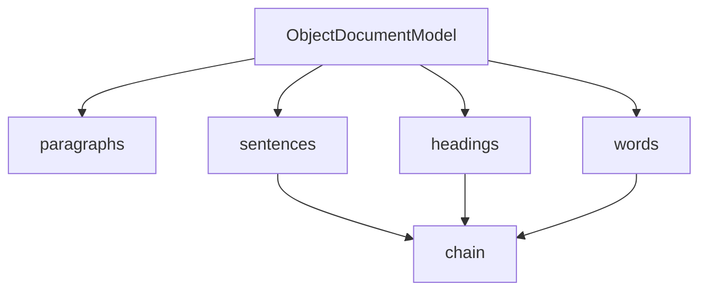

# `_document.py`

## `sumy.models.dom._document.ObjectDocumentModel` · *class*

## Summary:
Represents a document model organized as a collection of paragraphs, providing aggregated views of sentences, headings, and words across all paragraphs.

## Description:
The ObjectDocumentModel serves as a container for organizing document content structured as paragraphs. It provides convenient access to aggregated collections of sentences, headings, and words from all contained paragraphs. This abstraction enables efficient traversal and analysis of document structure while maintaining encapsulation of paragraph-level data.

This class is typically instantiated by document processors or parsers that construct document models from raw text or other document representations. The class enforces a clear boundary between paragraph-level organization and document-level aggregations.

## State:
- `_paragraphs`: tuple of paragraph objects
  - Type: tuple of paragraph objects
  - Valid range: Must contain paragraph objects with `sentences`, `headings`, and `words` attributes
  - Invariant: Once set in __init__, remains immutable throughout object lifetime

## Lifecycle:
- Creation: Instantiate with an iterable of paragraph objects
- Usage: Access properties `paragraphs`, `sentences`, `headings`, and `words` as needed
- Destruction: No special cleanup required; relies on Python's garbage collection

## Method Map:


## Raises:
- None explicitly raised by __init__
- However, passing non-iterable or paragraph objects without required attributes may cause runtime errors during property access

## Example:
```python
# Create paragraphs with sentences, headings, and words
paragraph1 = Paragraph(sentences=[...], headings=[...], words=[...])
paragraph2 = Paragraph(sentences=[...], headings=[...], words=[...])

# Create document model
doc_model = ObjectDocumentModel([paragraph1, paragraph2])

# Access aggregated content
all_sentences = doc_model.sentences
all_headings = doc_model.headings
all_words = doc_model.words
```

### `sumy.models.dom._document.ObjectDocumentModel.__init__` · *method*

## Summary:
Initializes the ObjectDocumentModel with a collection of paragraphs, storing them as an immutable tuple.

## Description:
This method serves as the constructor for the ObjectDocumentModel class, responsible for setting up the initial state of the document object by storing the provided paragraphs in an immutable tuple format. It is called during object instantiation to establish the fundamental data structure that represents the document's content. The ObjectDocumentModel aggregates content from multiple paragraphs, making them available through properties like sentences, headings, and words.

## Args:
    paragraphs (iterable): An iterable collection of paragraph objects that constitute the document's content.

## Returns:
    None: This method does not return any value.

## Raises:
    None: This method does not explicitly raise any exceptions.

## State Changes:
    Attributes READ: None
    Attributes WRITTEN: self._paragraphs

## Constraints:
    Preconditions: The paragraphs argument must be an iterable that can be converted to a tuple. Each paragraph object must have `sentences`, `headings`, and `words` attributes.
    Postconditions: The self._paragraphs attribute will be set to a tuple containing all elements from the input iterable.

## Side Effects:
    None: This method does not perform any I/O operations or mutate external objects.

### `sumy.models.dom._document.ObjectDocumentModel.paragraphs` · *method*

## Summary:
Returns the tuple of paragraph objects stored in this document model instance.

## Description:
This property provides read-only access to the internal collection of paragraph objects that constitute the document structure. It is implemented as a cached property to avoid recomputation and ensure consistent access to the paragraph data throughout the document's lifecycle.

The method is called during various stages of document processing, particularly when iterating over document structure elements or when building higher-level abstractions like sentence collections. It serves as a key interface point for accessing the fundamental building blocks of the document model.

## Args:
    None

## Returns:
    tuple[Paragraph]: A tuple containing all paragraph objects in the document, maintaining their original order.

## Raises:
    None

## State Changes:
    Attributes READ: self._paragraphs
    Attributes WRITTEN: None

## Constraints:
    Preconditions: The ObjectDocumentModel instance must have been properly initialized with a sequence of paragraph objects.
    Postconditions: The returned tuple is immutable and represents the exact paragraph collection stored in the document model.

## Side Effects:
    None

### `sumy.models.dom._document.ObjectDocumentModel.sentences` · *method*

## Summary:
Returns a flattened tuple of all sentences from all paragraphs in the document model.

## Description:
This method provides access to all sentences contained within the document's paragraphs by flattening the nested structure of paragraph sentences. It is implemented as a cached property to avoid recomputation on repeated access.

The method is called by the cached_property decorator when accessing the `sentences` attribute of an ObjectDocumentModel instance. It aggregates sentences from each paragraph in the document's `_paragraphs` collection into a single flat tuple.

## Args:
    None

## Returns:
    tuple: A tuple containing all sentences from all paragraphs in the document, flattened into a single sequence.

## Raises:
    None

## State Changes:
    Attributes READ: self._paragraphs
    Attributes WRITTEN: None

## Constraints:
    Preconditions: The ObjectDocumentModel instance must have been initialized with a valid sequence of paragraphs, and each paragraph must have a `sentences` property that returns an iterable.
    Postconditions: The returned tuple contains all sentences from all paragraphs in the order they appear in the document structure.

## Side Effects:
    None

### `sumy.models.dom._document.ObjectDocumentModel.headings` · *method*

## Summary:
Returns a flattened tuple of all heading elements from all paragraphs in the document model.

## Description:
This method provides access to all heading elements contained within the document's paragraphs by flattening the nested structure of paragraph headings. It is implemented as a cached property to avoid recomputation and improve performance when accessed multiple times.

The method is called by the cached_property decorator mechanism when the `headings` attribute is accessed on an ObjectDocumentModel instance. This approach ensures that the computation is performed only once per object lifetime, with subsequent accesses returning a cached result.

## Args:
    None

## Returns:
    tuple: A tuple containing all heading elements from all paragraphs in the document. Each heading element maintains its original type and structure from the source paragraphs.

## Raises:
    None

## State Changes:
    Attributes READ: self._paragraphs
    Attributes WRITTEN: None

## Constraints:
    Preconditions: The object must have been initialized with a sequence of paragraph objects that each have a `headings` attribute.
    Postconditions: The returned tuple contains all heading elements from all paragraphs, maintaining the order of paragraphs and their respective headings.

## Side Effects:
    None

### `sumy.models.dom._document.ObjectDocumentModel.words` · *method*

## Summary:
Returns a flattened tuple containing all words from all paragraphs in the document.

## Description:
This method aggregates words from all paragraphs in the document model into a single tuple. It is designed to provide easy access to all textual content in a flattened structure for downstream processing such as tokenization, frequency analysis, or summarization algorithms.

The method is implemented as a property using the `@cached_property` decorator, which means it computes the result once and caches it for subsequent accesses. This optimization is particularly useful when the same document's words are accessed multiple times during processing.

## Args:
    None

## Returns:
    tuple[str]: A tuple containing all words from all paragraphs in the document, flattened into a single sequence.

## Raises:
    None

## State Changes:
    Attributes READ: self._paragraphs
    Attributes WRITTEN: None

## Constraints:
    Preconditions: The object must have a `_paragraphs` attribute containing paragraph objects that each have a `words` property.
    Postconditions: The returned tuple contains all words from all paragraphs in order, with duplicates preserved.

## Side Effects:
    None

### `sumy.models.dom._document.ObjectDocumentModel.__unicode__` · *method*

## Summary:
Returns a string representation of the document model showing the number of paragraphs it contains.

## Description:
This method provides a human-readable string representation of the ObjectDocumentModel instance, indicating the total number of paragraphs in the document. It is typically called during debugging, logging, or when the object needs to be displayed as a string.

## Args:
    None

## Returns:
    str: A formatted string in the pattern "<DOM with X paragraphs>" where X is the count of paragraphs.

## Raises:
    None

## State Changes:
    Attributes READ: self.paragraphs
    Attributes WRITTEN: None

## Constraints:
    Preconditions: The object must have a paragraphs attribute that supports the len() function.
    Postconditions: The returned string format is always consistent and represents the current paragraph count.

## Side Effects:
    None

### `sumy.models.dom._document.ObjectDocumentModel.__repr__` · *method*

## Summary:
Returns the string representation of the document model by delegating to its `__str__` method.

## Description:
This method provides a standard Python `__repr__` implementation that delegates to the object's `__str__` method. It is typically used for debugging and development purposes to provide a readable representation of the `ObjectDocumentModel` instance. The method is part of Python's standard object protocol and ensures that when the object is printed or inspected in the REPL, it shows the result of the `__str__` method.

In this implementation, `__repr__` simply returns the result of `self.__str__()`. Based on the class structure, the `__str__` method would likely return a string representation derived from the underlying paragraph objects, though the actual `__str__` implementation is not shown in the provided code.

## Args:
    None

## Returns:
    str: The string representation of the object, as determined by the `__str__` method implementation.

## Raises:
    None

## State Changes:
    Attributes READ: 
    - self._paragraphs (accessed indirectly via `__str__` method)
    
    Attributes WRITTEN: None

## Constraints:
    Preconditions:
    - The object must have a valid `__str__` method implemented
    - The `__str__` method must return a string value
    
    Postconditions:
    - The returned value is always a string
    - The string represents the object in a human-readable format

## Side Effects:
    None

