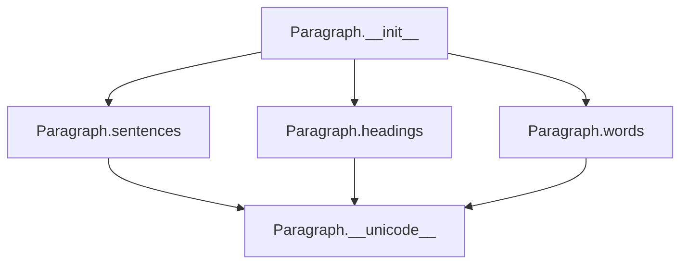

# `_paragraph.py`

## `sumy.models.dom._paragraph.Paragraph` · *class*

## Summary:
Represents a paragraph composed of multiple sentences, providing filtered access to regular sentences and words.

## Description:
The Paragraph class serves as a container for organizing and accessing textual content structured as sentences. It provides cached properties to efficiently retrieve filtered collections of sentences and words, specifically returning only non-heading sentences. This abstraction enables efficient processing of document structure while maintaining clean separation between content and presentation logic.

## State:
- `_sentences`: tuple[Sentence] - Immutable collection of all sentences in the paragraph (including headings)
- `_cached_property_sentences`: tuple[Sentence] - Cached result of filtering out headings from `_sentences`
- `_cached_property_headings`: tuple[Sentence] - Cached result of filtering only headings from `_sentences`
- `_cached_property_words`: tuple[str] - Cached result of flattening words from all sentences in `_sentences`

## Lifecycle:
- Creation: Instantiate with an iterable of Sentence objects via `__init__`
- Usage: Access cached properties `sentences`, `headings`, and `words` for efficient retrieval
- Destruction: No explicit cleanup required; relies on Python's garbage collection

## Method Map:


## Raises:
- TypeError: Raised during initialization if any item in the input iterable is not a Sentence instance

## Example:
```python
# Create sentences
sentence1 = Sentence("This is a regular sentence.", tokenizer)
heading1 = Sentence("Introduction", tokenizer, is_heading=True)

# Create paragraph
para = Paragraph([sentence1, heading1])

# Access filtered views
regular_sentences = para.sentences  # Excludes headings
all_headings = para.headings        # Only headings
all_words = para.words              # Flattened words from all sentences
```

### `sumy.models.dom._paragraph.Paragraph.__init__` · *method*

## Summary:
Initializes a Paragraph object with a collection of Sentence instances, validating and storing them as an immutable tuple.

## Description:
This method constructs a Paragraph instance by accepting an iterable of Sentence objects, converting it to a tuple, and performing validation to ensure all elements are Sentence instances. It serves as the primary constructor for the Paragraph class, establishing the foundational sentence collection that defines the paragraph's content.

## Args:
    sentences (iterable[Sentence]): An iterable containing Sentence objects to be stored in the paragraph. Each item must be an instance of the Sentence class.

## Returns:
    None: This method does not return a value; it initializes the object's internal state.

## Raises:
    TypeError: Raised when any item in the sentences iterable is not an instance of the Sentence class.

## State Changes:
    - Attributes READ: None
    - Attributes WRITTEN: self._sentences

## Constraints:
    - Preconditions: The sentences argument must be iterable, and all items within it must be instances of the Sentence class.
    - Postconditions: The self._sentences attribute will be set to a tuple containing all the Sentence objects from the input iterable.

## Side Effects:
    - None: This method performs no I/O operations or external service calls.

### `sumy.models.dom._paragraph.Paragraph.sentences` · *method*

## Summary:
Returns a tuple of non-heading sentences contained in the paragraph.

## Description:
Filters and returns only the regular content sentences from the paragraph's internal sentence collection, excluding any heading sentences. This method provides clean access to the main textual content while maintaining separation between structural elements (headings) and body text.

The method is typically invoked during document processing pipelines when analyzing or summarizing content, ensuring that heading elements are excluded from content-based operations.

This dedicated method encapsulates the filtering logic to maintain clean separation between document structure representation and content extraction, improving code readability and reusability.

## Args:
    None

## Returns:
    tuple[Sentence]: A tuple containing Sentence objects from `self._sentences` where each sentence's `is_heading` property is False.

## Raises:
    None

## State Changes:
    - Attributes READ: self._sentences
    - Attributes WRITTEN: None

## Constraints:
    - Preconditions: The `self._sentences` attribute must be initialized and contain Sentence objects with an `is_heading` boolean property.
    - Postconditions: The returned tuple contains only Sentence objects where `is_heading` evaluates to False.

## Side Effects:
    None

### `sumy.models.dom._paragraph.Paragraph.headings` · *method*

## Summary:
Returns a tuple of sentences that are identified as headings within the paragraph.

## Description:
This method filters the sentences stored in the paragraph's `_sentences` attribute and returns only those that are marked as headings. It provides a clean interface for accessing heading sentences without exposing the internal sentence collection directly.

The method is typically called during document analysis or summarization processes where identifying structural elements like headings is important for organizing content or determining sentence importance.

This logic is encapsulated in its own method to provide a clear abstraction layer and make the code more readable and maintainable compared to inline filtering operations.

## Args:
    None

## Returns:
    tuple[Sentence]: A tuple containing all sentences in the paragraph that have the `is_heading` property set to True.

## Raises:
    None

## State Changes:
    - Attributes READ: self._sentences
    - Attributes WRITTEN: None

## Constraints:
    - Preconditions: The `self._sentences` attribute must be initialized and contain Sentence objects with an `is_heading` property.
    - Postconditions: The returned tuple will contain only Sentence objects that are headings, and the order will match their appearance in `self._sentences`.

## Side Effects:
    None

### `sumy.models.dom._paragraph.Paragraph.words` · *method*

## Summary:
Returns a tuple containing all words from all sentences in the paragraph, preserving sequential order.

## Description:
This method provides access to all words contained within the paragraph's constituent sentences. It is implemented as a cached property that lazily computes and caches the result. The method aggregates words from each sentence using itertools.chain, maintaining the sequential order of words as they appear in the original text.

This method is typically called during text summarization or analysis workflows when word-level operations are required, such as frequency analysis or term extraction.

## Args:
    None

## Returns:
    tuple[str]: A tuple of strings representing all words from all sentences in the paragraph, ordered sequentially by sentence and then by position within each sentence. Returns an empty tuple if the paragraph contains no sentences.

## Raises:
    None

## State Changes:
    Attributes READ: self._sentences
    Attributes WRITTEN: None

## Constraints:
    Preconditions: The paragraph must have been initialized with a list of sentences in self._sentences, where each sentence is an instance of the Sentence class.
    Postconditions: The returned tuple contains all words from all sentences in the paragraph, maintaining the original sequential order.

## Side Effects:
    None

### `sumy.models.dom._paragraph.Paragraph.__unicode__` · *method*

## Summary:
Returns a string representation of the paragraph showing the count of headings and sentences it contains.

## Description:
This method provides a human-readable summary of a paragraph's structure by displaying the number of headings and sentences it contains. It is typically called during debugging, logging, or when displaying paragraph information in a user interface. The method serves as a diagnostic tool to quickly understand the composition of a paragraph object.

## Args:
    None

## Returns:
    str: A formatted string containing the paragraph's heading and sentence counts in the format "<Paragraph with {headings_count} headings & {sentences_count} sentences>"

## Raises:
    None

## State Changes:
    Attributes READ: self.headings, self.sentences
    Attributes WRITTEN: None

## Constraints:
    Preconditions: The object must have headings and sentences attributes that support the len() function
    Postconditions: The returned string format is always consistent and follows the pattern described

## Side Effects:
    None

### `sumy.models.dom._paragraph.Paragraph.__repr__` · *method*

## Summary:
Returns a string representation of the paragraph by delegating to its __str__ method.

## Description:
The `__repr__` method provides a formal string representation of the Paragraph object. It delegates the actual string formatting to the object's `__str__` method, which typically provides a human-readable description of the paragraph's content including the number of headings and sentences.

This method is part of Python's standard object protocol and is used primarily for debugging and development purposes to get a clear representation of the object's state.

## Args:
    None

## Returns:
    str: A string representation of the paragraph object, typically formatted by the __str__ method.

## Raises:
    None explicitly raised

## State Changes:
    Attributes READ: 
    - self._sentences (accessed indirectly via self.headings and self.sentences properties)
    - self.headings (cached property accessed via cached_property decorator)
    - self.sentences (cached property accessed via cached_property decorator)

    Attributes WRITTEN: None

## Constraints:
    Preconditions:
    - The object must have been properly initialized with valid Sentence objects
    - The __str__ method must be implemented and return a string

    Postconditions:
    - The returned value is a string representation of the paragraph
    - The method does not modify the object's state

## Side Effects:
    None

