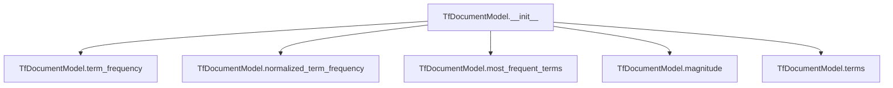

# `tf.py`

## `sumy.models.tf.TfDocumentModel` · *class*

## Summary:
Represents a document model for computing term frequencies using TF (Term Frequency) statistics.

## Description:
The TfDocumentModel class encapsulates the term frequency information of a document, allowing for various frequency-based computations such as normalized term frequencies and magnitude calculations. It accepts either a sequence of words or a string with a tokenizer to process text into words. This abstraction enables efficient computation of TF-based metrics for document analysis and comparison.

## State:
- `_terms`: Counter object containing lowercase word frequencies; type Counter[unicode]; invariant: all keys are lowercase strings
- `_max_frequency`: Integer representing maximum term frequency in the document; type int; invariant: always >= 1 (defaults to 1 when no terms exist)

## Lifecycle:
- Creation: Instantiate with either a sequence of words or a string and tokenizer; required arguments are `words` and optionally `tokenizer`
- Usage: Access properties like `magnitude` and `terms`, call methods like `term_frequency()`, `normalized_term_frequency()`, and `most_frequent_terms()`
- Destruction: No explicit cleanup required; uses standard Python garbage collection

## Method Map:


## Raises:
- ValueError: Raised during initialization when `words` is a string but `tokenizer` is None, or when `words` is neither a string nor a sequence

## Example:
```python
# Create from sequence of words
model1 = TfDocumentModel(['hello', 'world', 'hello'])

# Create from string with tokenizer
from sumy.tokenizers import Tokenizer
tokenizer = Tokenizer("english")
model2 = TfDocumentModel("Hello world hello", tokenizer)

# Use methods
print(model1.magnitude)  # Compute document magnitude
print(model1.term_frequency('hello'))  # Get frequency of 'hello'
print(model1.normalized_term_frequency('hello'))  # Get normalized frequency
print(model1.most_frequent_terms(1))  # Get most frequent term
```

### `sumy.models.tf.TfDocumentModel.__init__` · *method*

## Summary:
Initializes a TfDocumentModel instance by converting input words into normalized lowercase terms and computing their frequency statistics.

## Description:
This constructor method processes input words into a standardized format for TF-IDF calculations. It accepts either a string (which requires tokenization) or a sequence of words, normalizes them to lowercase, and builds frequency counters. This separation allows for clean preprocessing logic and ensures consistent term representation throughout the document model.

## Args:
    words (str or Sequence): Input words either as a string requiring tokenization or as a sequence of words
    tokenizer (object, optional): Tokenizer object used to convert string input into word sequences. Required when words is a string.

## Returns:
    None: This method initializes instance attributes and does not return a value

## Raises:
    ValueError: When words is a string but tokenizer is None, or when words is neither a string nor a sequence

## State Changes:
    Attributes READ: None
    Attributes WRITTEN: 
        - self._terms: Counter object containing lowercase word frequencies
        - self._max_frequency: Maximum frequency value among all terms (or 1 if no terms)

## Constraints:
    Preconditions:
        - If words is a string, tokenizer must be provided
        - If words is not a string, it must be a Sequence
    Postconditions:
        - self._terms contains normalized lowercase word frequencies
        - self._max_frequency is set to the highest frequency count or 1 if empty

## Side Effects:
    None: This method performs no I/O operations or external service calls

### `sumy.models.tf.TfDocumentModel.magnitude` · *method*

## Summary:
Computes the Euclidean norm (magnitude) of the term frequency vector representation.

## Description:
Calculates the mathematical magnitude of the document's term frequency vector by taking the square root of the sum of squared term frequencies. This property is commonly used in information retrieval and text processing to normalize document vectors or compute similarity measures.

This method exists as a dedicated property to encapsulate the mathematical computation of vector magnitude, making the intent clear and reusable throughout the system. It's particularly useful in cosine similarity calculations and other vector-based text analysis operations.

## Args:
    None

## Returns:
    float: The Euclidean norm of the term frequency vector, representing the magnitude of the document's vector representation.

## Raises:
    None

## State Changes:
    Attributes READ: self._terms
    Attributes WRITTEN: None

## Constraints:
    Preconditions: The object must have been initialized with valid term frequencies stored in self._terms.
    Postconditions: The returned value is always a non-negative floating-point number.

## Side Effects:
    None

### `sumy.models.tf.TfDocumentModel.terms` · *method*

## Summary:
Returns an iterable of all unique terms stored in the document model.

## Description:
This method provides access to the set of unique terms (words) that have been processed and counted within the document model. It serves as a read-only interface to the internal term collection, allowing external components to iterate over or inspect the vocabulary of the document without modifying the underlying data structure.

The method is called by components that need to enumerate or analyze the terms present in a document, such as during feature extraction, term frequency calculations, or vocabulary building operations in text processing pipelines.

## Args:
    None

## Returns:
    dict_keys: An iterable view of the keys (unique terms) in the internal `_terms` Counter dictionary.

## Raises:
    None

## State Changes:
    Attributes READ: self._terms
    Attributes WRITTEN: None

## Constraints:
    Preconditions: The object must be properly initialized with terms in `self._terms`
    Postconditions: The returned iterable reflects the current state of terms in the document model

## Side Effects:
    None

### `sumy.models.tf.TfDocumentModel.most_frequent_terms` · *method*

## Summary:
Returns the most frequent terms in the document, sorted by frequency in descending order.

## Description:
This method retrieves terms from the document model's internal term frequency counter, sorts them by frequency in descending order, and returns either all terms or a specified number of top terms. It's designed to provide access to the most significant terms in a document for summarization purposes.

## Args:
    count (int): Number of top frequent terms to return. Defaults to 0 (return all terms). Must be non-negative.

## Returns:
    tuple[str]: A tuple of term strings sorted by frequency in descending order. Returns all terms if count is 0 or positive value.

## Raises:
    ValueError: When count is negative, indicating only non-negative values are allowed.

## State Changes:
    Attributes READ: self._terms
    Attributes WRITTEN: None

## Constraints:
    Preconditions: The object must have been initialized with valid terms data.
    Postconditions: The returned tuple contains terms in descending frequency order.

## Side Effects:
    None

### `sumy.models.tf.TfDocumentModel.term_frequency` · *method*

## Summary:
Returns the frequency count of a specified term within the document model's term collection.

## Description:
This method retrieves the frequency of a given term from the internal term counter. It is used to determine how many times a specific word appears in the document represented by this model. The method is part of the TfDocumentModel class which maintains term frequencies for text processing tasks.

## Args:
    term (str): The term whose frequency needs to be retrieved.

## Returns:
    int: The frequency count of the specified term. Returns 0 if the term is not found in the document.

## Raises:
    None

## State Changes:
    Attributes READ: self._terms
    Attributes WRITTEN: None

## Constraints:
    Preconditions: The term parameter must be a string.
    Postconditions: The returned value is always a non-negative integer representing term frequency.

## Side Effects:
    None

### `sumy.models.tf.TfDocumentModel.normalized_term_frequency` · *method*

## Summary:
Computes the normalized term frequency of a given term within the document, applying smoothing if specified.

## Description:
This method calculates the normalized term frequency by dividing the term's frequency by the maximum term frequency in the document. It optionally applies smoothing to prevent zero frequencies for unseen terms. This normalization technique is commonly used in text processing and information retrieval to scale term frequencies to a [0, 1] range while preserving relative importance.

## Args:
    term (str): The term for which to compute the normalized frequency.
    smooth (float): Smoothing factor applied to avoid zero frequencies. Must be between 0.0 and 1.0. Defaults to 0.0.

## Returns:
    float: The normalized term frequency, ranging from 0.0 to 1.0. Returns 0.0 if the term is not found and no smoothing is applied.

## Raises:
    None explicitly raised.

## State Changes:
    Attributes READ: self._terms, self._max_frequency
    Attributes WRITTEN: None

## Constraints:
    Preconditions: The term must be a string. The smooth parameter must be in the range [0.0, 1.0].
    Postconditions: The returned value is always in the range [0.0, 1.0].

## Side Effects:
    None.

### `sumy.models.tf.TfDocumentModel.__repr__` · *method*

## Summary:
Returns a string representation of the TfDocumentModel instance showing its internal term frequency data structure.

## Description:
This method provides a developer-friendly string representation of the TfDocumentModel object for debugging and logging purposes. It displays the internal `_terms` attribute (a Counter object containing word frequencies) in a formatted way using pprint.pformat. The method is automatically called when the object is printed or converted to string in interactive environments.

## Args:
    None

## Returns:
    str: A formatted string representation in the form "<TfDocumentModel {formatted_terms}>", where {formatted_terms} is the pretty-printed representation of the internal Counter object storing term frequencies.

## Raises:
    None

## State Changes:
    Attributes READ: self._terms
    Attributes WRITTEN: None

## Constraints:
    Preconditions: The object must have been initialized with valid data (self._terms should be a Counter object).
    Postconditions: The returned string accurately represents the internal state of the object's term frequencies.

## Side Effects:
    None

