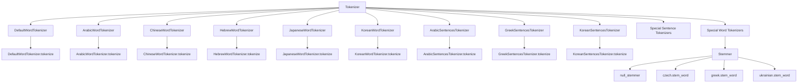

# `sumy.nlp`

## Tree:
    nlp/
    ├── stemmers/
    │   ├── __init__.py
    │   ├── czech.py
    │   ├── greek.py
    │   └── ukrainian.py
    └── tokenizers.py

## Role:
    Provides language-aware text processing capabilities for natural language understanding tasks.

## Description:
The nlp module serves as the core text processing layer for the sumy library, offering both linguistic analysis tools (stemming) and text segmentation utilities (tokenization) across multiple languages. It enables robust natural language processing workflows by providing consistent interfaces for text preparation and linguistic normalization. This module is fundamental to the library's ability to process diverse textual content effectively.

## Components:
    - Tokenizer (class): Unified interface for language-specific sentence and word tokenization
    - ArabicSentencesTokenizer (class): Specialized tokenizer for Arabic sentence segmentation
    - ArabicWordTokenizer (class): Specialized tokenizer for Arabic word segmentation
    - ChineseWordTokenizer (class): Specialized tokenizer for Chinese word segmentation
    - DefaultWordTokenizer (class): General-purpose word tokenizer using NLTK
    - GreekSentencesTokenizer (class): Specialized tokenizer for Greek sentence segmentation
    - HebrewWordTokenizer (class): Specialized tokenizer for Hebrew word segmentation
    - JapaneseWordTokenizer (class): Specialized tokenizer for Japanese word segmentation
    - KoreanSentencesTokenizer (class): Specialized tokenizer for Korean sentence segmentation
    - KoreanWordTokenizer (class): Specialized tokenizer for Korean noun extraction
    - Stemmer (class): Unified interface for language-specific word stemming
    - null_stemmer (function): Basic Unicode normalization utility
    - czech.stem_word (function): Czech-specific word stemming algorithm
    - greek.stem_word (function): Greek-specific word stemming using external library
    - ukrainian.stem_word (function): Ukrainian-specific word stemming with morphological rules

## Public API:
    - Tokenizer: Main class for language-aware text tokenization
      - Signature: Tokenizer(language: str)
      - Description: Creates a tokenizer instance for the specified language
      - Usage: Use to_sentences() and to_words() for text segmentation
    - ArabicSentencesTokenizer: Arabic sentence tokenizer
      - Signature: ArabicSentencesTokenizer.tokenize(text: str)
      - Description: Segments Arabic text into sentences using pyarabic
      - Usage: Process Arabic text for sentence-level analysis
    - ArabicWordTokenizer: Arabic word tokenizer
      - Signature: ArabicWordTokenizer.tokenize(text: str)
      - Description: Splits Arabic text into individual words using pyarabic
      - Usage: Tokenize Arabic text for word-level processing
    - ChineseWordTokenizer: Chinese word tokenizer
      - Signature: ChineseWordTokenizer.tokenize(text: str)
      - Description: Segments Chinese text into words using jieba
      - Usage: Process Chinese text for word-level analysis
    - DefaultWordTokenizer: General-purpose word tokenizer
      - Signature: DefaultWordTokenizer.tokenize(text: str)
      - Description: Tokenizes text using NLTK's word_tokenize
      - Usage: Standard word tokenization for unknown or unsupported languages
    - GreekSentencesTokenizer: Greek sentence tokenizer
      - Signature: GreekSentencesTokenizer.tokenize(text: str)
      - Description: Splits Greek text into sentences with semicolon handling
      - Usage: Process Greek text for sentence-level analysis
    - HebrewWordTokenizer: Hebrew word tokenizer
      - Signature: HebrewWordTokenizer.tokenize(text: str)
      - Description: Extracts Hebrew words from text using hebrew_tokenizer
      - Usage: Tokenize Hebrew text for linguistic analysis
    - JapaneseWordTokenizer: Japanese word tokenizer
      - Signature: JapaneseWordTokenizer.tokenize(text: str)
      - Description: Segments Japanese text into words using tinysegmenter
      - Usage: Process Japanese text for word-level analysis
    - KoreanSentencesTokenizer: Korean sentence tokenizer
      - Signature: KoreanSentencesTokenizer.tokenize(text: str)
      - Description: Splits Korean text into sentences using Kkma
      - Usage: Process Korean text for sentence-level analysis
    - KoreanWordTokenizer: Korean noun tokenizer
      - Signature: KoreanWordTokenizer.tokenize(text: str)
      - Description: Extracts Korean noun tokens using Kkma
      - Usage: Extract nouns from Korean text for feature extraction
    - Stemmer: Unified interface for language-specific stemming
      - Signature: Stemmer(language: str)
      - Description: Creates a stemmer instance for the specified language
      - Usage: Apply word stemming to normalize text for analysis
    - null_stemmer: Basic Unicode normalization
      - Signature: null_stemmer(object: Any) -> str
      - Description: Converts input to lowercase Unicode string
      - Usage: Normalize text input before processing
    - czech.stem_word: Czech word stemming
      - Signature: stem_word(word: str, aggressive: bool = False) -> str
      - Description: Reduces Czech words to root forms using morphological rules
      - Usage: Apply to Czech text for linguistic normalization
    - greek.stem_word: Greek word stemming
      - Signature: stem_word(word: str) -> str
      - Description: Stems Greek words using external greek-stemmer library
      - Usage: Process Greek text with morphological analysis
    - ukrainian.stem_word: Ukrainian word stemming
      - Signature: stem_word(word: str) -> str
      - Description: Applies Ukrainian stemming with morphological suffix removal
      - Usage: Reduce Ukrainian words to base forms

## Dependencies:
    - Internal: sumy.nlp.utils (for to_unicode compatibility function)
    - External: nltk.stem.snowball (NLTK Snowball stemmers)
    - External: greek-stemmer (Greek stemming library)
    - External: re (Python regular expressions)
    - External: pyarabic (Arabic text processing)
    - External: jieba (Chinese text segmentation)
    - External: hebrew_tokenizer (Hebrew text processing)
    - External: tinysegmenter (Japanese text segmentation)
    - External: konlpy (Korean text processing)

## Constraints:
    - All tokenizers expect Unicode strings or UTF-8 encoded bytes
    - Tokenizer instances must be initialized with supported language identifiers
    - Specialized tokenizers (Arabic, Chinese, Hebrew, Japanese, Korean) may have additional installation requirements
    - Thread safety: Tokenizer and Stemmer instances are safe for concurrent use once initialized
    - Initialization prerequisite: Languages must be registered in SPECIAL_TOKENIZERS or available in NLTK

---

## Files

- [`tokenizers.py`](nlp/tokenizers.md)

