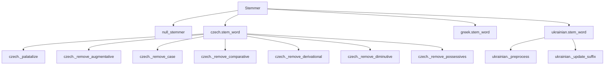

# `sumy.nlp.stemmers`

## Tree:
    stemmers/
    ├── __init__.py
    ├── czech.py
    └── greek.py
    └── ukrainian.py

## Role:
    Provides language-specific stemming algorithms for morphological text processing.

## Description:
The stemmers module offers a collection of linguistic tools for reducing words to their root forms across multiple languages. It serves as a centralized repository for various stemming implementations, supporting both general-purpose algorithms (via NLTK) and specialized approaches for Czech, Greek, and Ukrainian languages. This module enables consistent text preprocessing capabilities for multilingual natural language processing tasks.

## Components:
    - Stemmer (class): Unified interface for language-aware stemming operations
    - null_stemmer (function): Basic Unicode normalization utility
    - czech.stem_word (function): Comprehensive Czech word stemming algorithm
    - czech._palatalize (function): Applies Czech palatalization rules
    - czech._remove_augmentative (function): Removes Czech augmentative suffixes
    - czech._remove_case (function): Strips Czech case endings
    - czech._remove_comparative (function): Eliminates comparative suffixes
    - czech._remove_derivational (function): Removes derivational suffixes
    - czech._remove_diminutive (function): Strips diminutive endings
    - czech._remove_possessives (function): Removes possessive suffixes
    - greek.stem_word (function): Greek word stemming using external library
    - ukrainian.stem_word (function): Ukrainian word stemming with morphological rules

## Public API:
    - Stemmer: Main class for creating language-specific stemmers
      - Signature: Stemmer(language: str)
      - Description: Creates a stemmer instance for the specified language
      - Usage: stemmer_instance(word) to stem individual words
    - null_stemmer: Basic Unicode normalization utility
      - Signature: null_stemmer(object: Any) -> str
      - Description: Converts input to lowercase Unicode string
      - Usage: Normalize text input before processing
    - czech.stem_word: Czech word stemming function
      - Signature: stem_word(word: str, aggressive: bool = False) -> str
      - Description: Reduces Czech words to root forms using morphological rules
      - Usage: Apply to Czech text for linguistic normalization
    - greek.stem_word: Greek word stemming function
      - Signature: stem_word(word: str) -> str
      - Description: Stems Greek words using external greek-stemmer library
      - Usage: Process Greek text with morphological analysis
    - ukrainian.stem_word: Ukrainian word stemming function
      - Signature: stem_word(word: str) -> str
      - Description: Applies Ukrainian stemming with morphological suffix removal
      - Usage: Reduce Ukrainian words to base forms

## Dependencies:
    - Internal: sumy.nlp.utils (for to_unicode compatibility function)
    - External: nltk.stem.snowball (NLTK Snowball stemmers)
    - External: greek-stemmer (Greek stemming library)
    - External: re (Python regular expressions)

## Constraints:
    - All stemmer functions expect Unicode strings or UTF-8 encoded bytes
    - Stemmer instances must be initialized with supported language identifiers
    - Specialized stemmers (Czech, Greek, Ukrainian) may have additional installation requirements
    - Thread safety: Stemmer instances are safe for concurrent use once initialized
    - Initialization prerequisite: Languages must be registered in SPECIAL_STEMMERS or available in NLTK

---

## Files

- [`__init__.py`](stemmers/__init__.md)
- [`czech.py`](stemmers/czech.md)
- [`greek.py`](stemmers/greek.md)
- [`ukrainian.py`](stemmers/ukrainian.md)

