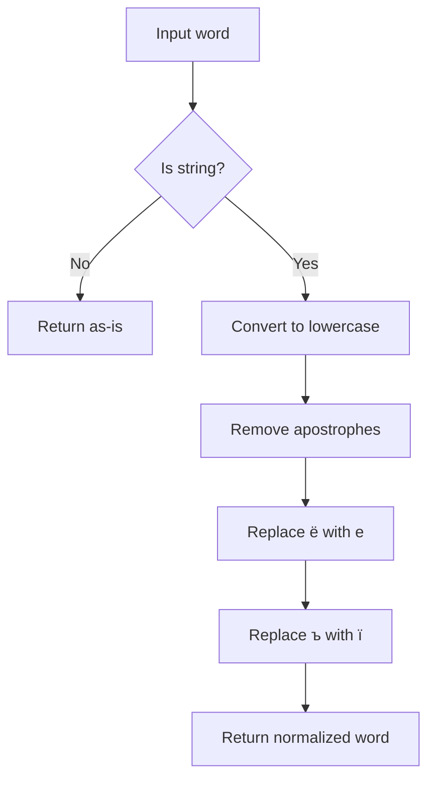

# `ukrainian.py`

## `sumy.nlp.stemmers.ukrainian.stem_word` · *function*

## Summary:
Applies Ukrainian linguistic stemming to reduce words to their base forms by systematically removing morphological suffixes.

## Description:
This function implements a Ukrainian word stemming algorithm that reduces inflected words to their canonical root form. It follows a systematic approach of identifying word regions, applying sequential suffix removal rules based on morphological categories, and performing final derivational adjustments.

The function is part of a larger Ukrainian stemmer implementation and serves as the core processing unit for morphological reduction of Ukrainian text. It handles various grammatical categories including verbs, nouns, adjectives, participles, and reflexive forms through a carefully ordered sequence of pattern matching and replacement operations.

## Args:
    word (str): The Ukrainian word to be stemmed. Should be a string containing Cyrillic characters.

## Returns:
    str: The stemmed version of the input word with morphological suffixes removed. Returns the original word unchanged if it contains no Ukrainian vowels or if no stemming rules apply.

## Raises:
    None explicitly raised.

## Constraints:
    Preconditions:
        - Input must be a string type
        - Word should contain Cyrillic characters for meaningful stemming
        - Function assumes proper initialization of internal regex patterns (referenced via global variables)

    Postconditions:
        - Output is a valid Ukrainian word stem
        - All applied transformations follow Ukrainian morphological rules
        - Function maintains consistency with other stemming operations in the module

## Side Effects:
    None.

## Control Flow:
```mermaid
flowchart TD
    A[Start stem_word] --> B[_preprocess(word)]
    B --> C{Contains Ukrainian vowels?}
    C -->|No| D[Return word]
    C -->|Yes| E[Find _RVRE pattern]
    E --> F[Split word into start and suffix]
    F --> G[Apply _PERFECTIVE_GROUND removal]
    G --> H{Updated?}
    H -->|No| I[Apply _REFLEXIVE removal]
    I --> J[Apply _ADJECTIVE removal]
    J --> K{Updated?}
    K -->|Yes| L[Apply _PARTICIPLE removal]
    K -->|No| M[Apply _VERB removal]
    M --> N{Updated?}
    N -->|No| O[Apply _NOUN removal]
    O --> P[Apply 'и$' removal]
    P --> Q{Matches _DERIVATIONAL?}
    Q -->|Yes| R[Apply 'ость$' removal]
    R --> S[Apply 'ь$' removal]
    S --> T{Updated?}
    T -->|Yes| U[Apply 'ейше?$' removal]
    U --> V[Apply 'нн$' removal]
    V --> W[Concatenate start + suffix]
    W --> X[Return result]
```

## Examples:
    >>> stem_word("програмування")
    'програмуван'
    
    >>> stem_word("виконавець")
    'виконавец'
    
    >>> stem_word("величезний")
    'величезн'
    
    >>> stem_word("робити")
    'роб'

## `sumy.nlp.stemmers.ukrainian._preprocess` · *function*

## Summary:
Normalizes Ukrainian text by converting to lowercase and replacing specific Cyrillic characters with their standard equivalents.

## Description:
This function processes a Ukrainian word by applying several normalization transformations to ensure consistent text representation. It is designed to handle common character variations in Ukrainian text that may arise from different input sources or encoding issues.

The function is called internally by the Ukrainian stemmer to preprocess words before applying stemming algorithms. This extraction ensures that text normalization is consistently applied across all stemming operations while maintaining clean separation between preprocessing and stemming logic.

## Args:
    word (str): The input Ukrainian word to be normalized. Must be a string containing Cyrillic characters.

## Returns:
    str: The normalized word with lowercase conversion and character replacements applied. Returns an empty string if input is empty.

## Raises:
    None

## Constraints:
    Preconditions:
        - Input must be a string type
        - Function assumes input contains only printable ASCII and Cyrillic characters
    
    Postconditions:
        - Output string contains only lowercase Cyrillic characters
        - All apostrophes are removed from the input
        - The character 'ё' is replaced with 'е'
        - The character 'ъ' is replaced with 'ї'

## Side Effects:
    None

## Control Flow:


## Examples:
    >>> _preprocess("Привіт'")
    'привіт'
    
    >>> _preprocess("МістоЁ")
    'місто'
    
    >>> _preprocess("ТестЪ")
    'тестї'
    
    >>> _preprocess("HELLO")
    'hello'

## `sumy.nlp.stemmers.ukrainian._update_suffix` · *function*

## Summary:
Updates a suffix string by applying a regular expression pattern replacement and determines if any change occurred.

## Description:
This function takes a suffix string and applies a regular expression substitution to it. It returns a tuple indicating whether the suffix was modified and the resulting string after the substitution. This utility function is used internally by Ukrainian stemmer implementations to perform morphological transformations on word endings.

## Args:
    suffix (str): The input suffix string to be processed.
    pattern (str): Regular expression pattern to match against the suffix.
    replacement (str): String to replace matched patterns with.

## Returns:
    tuple[bool, str]: A tuple containing:
        - bool: True if the suffix was changed by the replacement operation, False otherwise.
        - str: The resulting string after applying the regex substitution.

## Raises:
    None explicitly raised.

## Constraints:
    - Preconditions: All arguments must be strings.
    - Postconditions: The returned tuple will always contain a boolean and a string in that order.

## Side Effects:
    None.

## Control Flow:
```mermaid
flowchart TD
    A[Start _update_suffix] --> B[Apply re.sub(pattern, replacement, suffix)]
    B --> C[Compare suffix != result]
    C --> D{Change detected?}
    D -->|Yes| E[Return (True, result)]
    D -->|No| F[Return (False, result)]
```

## Examples:
    >>> _update_suffix("ing", "ing$", "e")
    (True, "e")
    
    >>> _update_suffix("ed", "ed$", "ing")
    (True, "ing")
    
    >>> _update_suffix("ing", "ing$", "ing")
    (False, "ing")
```

