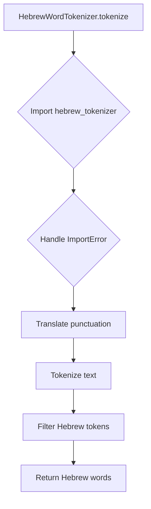

# `tokenizers.py`

## `sumy.nlp.tokenizers.DefaultWordTokenizer` · *class*

## Summary:
DefaultWordTokenizer is a tokenizer class that uses NLTK's word_tokenize function to split text into individual words or tokens.

## Description:
This class serves as a default implementation for word tokenization in the sumy library. It provides a simple interface for breaking text into tokens using NLTK's built-in tokenization capabilities. The class is designed to be a drop-in replacement for basic tokenization needs and is typically used when language-specific tokenizers are not available or when a general-purpose solution is sufficient.

## State:
- The class maintains no internal state beyond what is required by the parent object class
- The tokenize method accepts a single parameter `text` of type str
- No class invariants apply as the class is stateless

## Lifecycle:
- Creation: Instantiation requires no arguments and can be done with `DefaultWordTokenizer()`
- Usage: Call the `tokenize()` method with a string argument to get a list of tokens
- Destruction: No special cleanup is required as the class is stateless

## Method Map:
```mermaid
graph TD
    A[DefaultWordTokenizer] --> B[tokenize(text)]
    B --> C[nltk.word_tokenize(text)]
```

## Raises:
- No exceptions are explicitly raised by the constructor
- The underlying `nltk.word_tokenize()` function may raise exceptions if the input text is not properly formatted, though these are not handled by this wrapper class

## Example:
```python
tokenizer = DefaultWordTokenizer()
tokens = tokenizer.tokenize("Hello world, this is a test.")
# Result: ['Hello', 'world', ',', 'this', 'is', 'a', 'test', '.']
```

### `sumy.nlp.tokenizers.DefaultWordTokenizer.tokenize` · *method*

## Summary:
Tokenizes a text string into individual words and punctuation marks using NLTK's word tokenizer within the DefaultWordTokenizer class.

## Description:
This method serves as the primary tokenization implementation for the DefaultWordTokenizer class, applying NLTK's sophisticated word tokenization algorithm to convert input text into a list of individual word tokens and punctuation marks. The method provides a standardized tokenization approach for text processing pipelines in the sumy library, enabling consistent text analysis across different components. This design allows for easy extension and replacement of tokenization strategies by subclassing the DefaultWordTokenizer.

## Args:
    text (str): The input text string to be tokenized into individual words and punctuation marks.

## Returns:
    list[str]: A list of tokenized elements (words and punctuation) extracted from the input text, where each element represents a distinct linguistic unit.

## Raises:
    None explicitly raised by this method.

## State Changes:
    Attributes READ: None
    Attributes WRITTEN: None

## Constraints:
    Preconditions: The input text must be a valid string.
    Postconditions: The returned list will contain at least one token for any non-empty input string, with each token being a string.

## Side Effects:
    None

## `sumy.nlp.tokenizers.HebrewWordTokenizer` · *class*

## Summary:
A tokenizer class designed to extract Hebrew words from text by leveraging the hebrew_tokenizer library.

## Description:
The HebrewWordTokenizer is responsible for processing Hebrew text and returning a list of Hebrew words while filtering out punctuation and non-Hebrew tokens. It serves as a specialized text processing component for Hebrew language applications. This class is typically used when preprocessing Hebrew text for natural language processing tasks such as summarization, sentiment analysis, or topic modeling.

## State:
- `_TRANSLATOR`: A class attribute of type `dict` created using `str.maketrans("", "", string.punctuation)`. It maps punctuation characters to None, effectively removing them from text during translation operations.

## Lifecycle:
- Creation: The class is a static utility class and does not require instantiation. All methods are class methods.
- Usage: The primary method `tokenize()` should be called with a string argument containing Hebrew text.
- Destruction: No explicit cleanup is required as the class is stateless.

## Method Map:


## Raises:
- `ValueError`: Raised when the `hebrew_tokenizer` library is not installed, with a message instructing the user to install it via `pip install hebrew_tokenizer`.

## Example:
```python
# Tokenizing Hebrew text
text = "שלום עולם! איך אתה?"
words = HebrewWordTokenizer.tokenize(text)
# Result: ['שלום', 'עולם', 'איך', 'אתה']
```

### `sumy.nlp.tokenizers.HebrewWordTokenizer.tokenize` · *method*

## Summary:
Tokenizes Hebrew text into individual words while filtering out non-Hebrew tokens.

## Description:
This method performs Hebrew text tokenization using the external hebrew_tokenizer library. It first removes punctuation from the input text using a predefined translator, then applies the Hebrew tokenizer to break the text into tokens. Only tokens classified as Hebrew (including various Hebrew token groups) are retained in the final result.

## Args:
    text (str): The Hebrew text string to be tokenized.

## Returns:
    list[str]: A list of Hebrew words extracted from the input text, with punctuation removed.

## Raises:
    ValueError: When the hebrew_tokenizer library is not installed in the environment.

## State Changes:
    Attributes READ: cls._TRANSLATOR (a translation table that maps punctuation characters to None)
    Attributes WRITTEN: None

## Constraints:
    Preconditions: The input text must be a valid string. The hebrew_tokenizer library must be installed.
    Postconditions: The returned list contains only Hebrew words, with no punctuation and no non-Hebrew tokens.

## Side Effects:
    None

## `sumy.nlp.tokenizers.JapaneseWordTokenizer` · *class*

## Summary:
A tokenizer class that segments Japanese text into individual words using the tinysegmenter library.

## Description:
The JapaneseWordTokenizer is designed to handle the specific challenge of tokenizing Japanese text, which does not naturally contain spaces between words like many Western languages. This class provides a standardized interface for Japanese text segmentation by leveraging the tinysegmenter library, a lightweight Japanese tokenizer. It is intended to be used as part of a larger text processing pipeline where Japanese language support is required.

## State:
- No instance attributes are stored beyond the temporary creation of the TinySegmenter object during tokenization
- The class does not maintain any persistent state between method calls
- The `tokenize` method receives text as a string parameter

## Lifecycle:
- Creation: Instantiation requires no arguments and creates a simple object ready for tokenization
- Usage: Call the `tokenize` method with a Japanese text string as input
- Destruction: No special cleanup required; the object is stateless and can be garbage collected

## Method Map:
```mermaid
graph TD
    A[JapaneseWordTokenizer] --> B[tokenize(text)]
    B --> C{tinysegmenter ImportError}
    C -->|Raise| D[ValueError]
    C -->|Continue| E[Create TinySegmenter]
    E --> F[segmenter.tokenize(text)]
    F --> G[Return tokens]
```

## Raises:
- ValueError: Raised when the tinysegmenter library is not installed, with a descriptive message instructing the user to install it via pip

## Example:
```python
tokenizer = JapaneseWordTokenizer()
tokens = tokenizer.tokenize("私は学生です")
# Returns a list of tokens like ['私', 'は', '学生', 'です']
```

### `sumy.nlp.tokenizers.JapaneseWordTokenizer.tokenize` · *method*

## Summary:
Segments Japanese text into individual words using TinySegmenter library.

## Description:
This method performs Japanese word segmentation by utilizing the TinySegmenter library. It accepts a Japanese text string and returns a list of individual words (tokens) that comprise the text.

The method is intended for use in text processing pipelines requiring Japanese language tokenization. It handles the internal instantiation of the TinySegmenter class and provides a clean interface for Japanese word segmentation.

## Args:
    text (str): Japanese text string to be segmented into individual words.

## Returns:
    list[str]: List of tokenized Japanese words extracted from the input text.

## Raises:
    ValueError: When the tinysegmenter library is not installed, with installation instructions.

## State Changes:
    Attributes READ: None
    Attributes WRITTEN: None

## Constraints:
    Preconditions: Input text must be a valid string containing Japanese characters.
    Postconditions: Output is a list of properly segmented Japanese words.

## Side Effects:
    Runtime import: Attempts to import tinysegmenter library, raising ImportError if unavailable.

## `sumy.nlp.tokenizers.ChineseWordTokenizer` · *class*

## Summary:
A tokenizer that splits Chinese text into individual words using the jieba library.

## Description:
The ChineseWordTokenizer is designed to segment Chinese text into meaningful word units. It serves as a specialized tokenizer for Chinese language processing tasks where word boundaries are not naturally indicated by spaces. This class acts as a wrapper around the jieba library, which is a popular Python library for Chinese text segmentation.

## State:
- No instance attributes are stored beyond the tokenization process itself
- The class does not maintain any persistent state between method calls
- The tokenize method accepts a single parameter `text` of type str

## Lifecycle:
- Creation: Instantiation requires no arguments
- Usage: Call the `tokenize` method with a string argument containing Chinese text
- Destruction: No special cleanup required as the class is stateless

## Method Map:
```mermaid
graph TD
    A[ChineseWordTokenizer] --> B[tokenize(text)]
    B --> C{Import jieba}
    C -->|Success| D[jieba.cut(text)]
    C -->|Failure| E[ValueError]
```

## Raises:
- ValueError: Raised when the jieba library is not installed, with a descriptive message instructing users to install it via pip

## Example:
```python
tokenizer = ChineseWordTokenizer()
tokens = tokenizer.tokenize("我爱自然语言处理")
# Returns a generator of tokens; convert to list for display:
token_list = list(tokens)
print(token_list)  # Output: ['我', '爱', '自然语言', '处理']
```

### `sumy.nlp.tokenizers.ChineseWordTokenizer.tokenize` · *method*

## Summary:
Tokenizes Chinese text into individual words using the jieba library.

## Description:
This method performs word segmentation on Chinese text by utilizing the jieba library, which is specifically designed for Chinese natural language processing. It is part of the ChineseWordTokenizer class and serves as the primary tokenization mechanism for Chinese text. The method is called during the text preprocessing phase when Chinese documents need to be broken down into meaningful word units for further analysis.

## Args:
    text (str): The Chinese text to be tokenized into individual words.

## Returns:
    generator: A generator yielding individual Chinese words (tokens) from the input text.

## Raises:
    ValueError: When the jieba library is not installed, providing instructions for installation.

## State Changes:
    Attributes READ: None
    Attributes WRITTEN: None

## Constraints:
    Preconditions: The input text must be a valid string containing Chinese characters.
    Postconditions: The returned generator will yield individual Chinese words that form the segmented text.

## Side Effects:
    None

## `sumy.nlp.tokenizers.KoreanSentencesTokenizer` · *class*

## Summary:
A tokenizer that splits Korean text into sentences using the Kkma library.

## Description:
This class provides sentence tokenization functionality specifically for Korean text by leveraging the Kkma (Korean Natural Language Processing Toolkit) library. It serves as a specialized tokenizer for Korean language processing tasks where sentence-level segmentation is required. This class is part of a broader set of language-specific tokenizers used in text summarization and natural language processing pipelines.

## State:
- No instance attributes maintained
- The class relies on the konlpy library's Kkma tokenizer internally
- Requires konlpy to be installed for proper operation

## Lifecycle:
- Creation: Instantiation requires no arguments
- Usage: Call the `tokenize` method with Korean text as input
- Destruction: No special cleanup required; uses standard Python garbage collection

## Method Map:
```mermaid
graph TD
    A[KoreanSentencesTokenizer] --> B[tokenize(text)]
    B --> C{konlpy available?}
    C -->|No| D[ValueError]
    C -->|Yes| E[Kkma().sentences()]
```

## Raises:
- ValueError: When the konlpy library is not installed, with a descriptive message instructing users to install it via pip

## Example:
```python
tokenizer = KoreanSentencesTokenizer()
text = "안녕하세요. 반갑습니다. 오늘 날씨가 좋네요."
sentences = tokenizer.tokenize(text)
# Returns: ['안녕하세요.', '반갑습니다.', '오늘 날씨가 좋네요.']
```

### `sumy.nlp.tokenizers.KoreanSentencesTokenizer.tokenize` · *method*

## Summary:
Splits Korean text into individual sentences using the Kkma tokenizer from Konlpy within the KoreanSentencesTokenizer class.

## Description:
This method implements sentence segmentation for Korean text by utilizing the Kkma (Korean Natural Language Processing Toolkit) from the konlpy library. It is part of the KoreanSentencesTokenizer class and serves as a specialized sentence tokenizer for Korean language processing within the Sumy library. The method is designed to handle Korean text specifically, breaking it down into meaningful sentence units for further NLP processing.

## Args:
    text (str): The Korean text to be segmented into sentences.

## Returns:
    list[str]: A list of strings, where each string represents a sentence from the input text. Returns an empty list if the input is empty or contains no sentences.

## Raises:
    ValueError: When the konlpy library is not installed, indicating that the Korean tokenizer dependency is missing.

## State Changes:
    Attributes READ: None
    Attributes WRITTEN: None

## Constraints:
    Preconditions: The input text must be a valid string containing Korean characters.
    Postconditions: The returned list will contain at least one sentence, even if the input is a single sentence or empty string.

## Side Effects:
    None

## `sumy.nlp.tokenizers.KoreanWordTokenizer` · *class*

## Summary:
A tokenizer that extracts noun tokens from Korean text using the Kkma (Korean Morphological Analyzer) from the konlpy library.

## Description:
This class provides Korean text tokenization functionality by utilizing the Kkma morphological analyzer from the konlpy package. It specifically extracts noun tokens from Korean text, making it suitable for Korean natural language processing tasks such as text summarization, sentiment analysis, or topic modeling. The class serves as a specialized tokenizer for Korean language text processing within the sumy library ecosystem.

## State:
- No instance attributes maintained
- The `tokenize` method takes a single parameter `text` of type str representing the Korean text to be tokenized

## Lifecycle:
- Creation: Instantiation requires no arguments and is straightforward
- Usage: Call the `tokenize` method with a Korean text string as argument
- Destruction: No special cleanup required as it's a simple stateless class

## Method Map:
```mermaid
graph TD
    A[KoreanWordTokenizer] --> B[tokenize(text)]
    B --> C{konlpy ImportError}
    C -->|Yes| D[ValueError]
    C -->|No| E[Kkma() instantiation]
    E --> F[kkma.nouns(text)]
    F --> G[Return list of Korean noun tokens]
```

## Raises:
- ValueError: Raised when the konlpy library is not installed, with a descriptive message instructing users to install it via pip

## Example:
```python
tokenizer = KoreanWordTokenizer()
tokens = tokenizer.tokenize("안녕하세요, 저는 프로그래머입니다.")
# Returns list of Korean noun tokens extracted from the text
```

### `sumy.nlp.tokenizers.KoreanWordTokenizer.tokenize` · *method*

## Summary:
Tokenizes Korean text into a list of noun tokens using the Kkma Korean morphological analyzer.

## Description:
This method performs Korean text tokenization by utilizing the Kkma (Korean Morphological Analyzer) from the konlpy library. It extracts only noun tokens from the input text, making it suitable for applications requiring Korean word segmentation focused on nouns. The method is part of the KoreanWordTokenizer class and serves as the primary tokenization interface for Korean text processing.

The tokenization process specifically targets Korean nouns, returning a list of noun components extracted from the input text. This approach is particularly useful for Korean text analysis where noun-based features are important for downstream tasks like text summarization, sentiment analysis, or topic modeling.

## Args:
    text (str): The Korean text string to be tokenized into noun components.

## Returns:
    list[str]: A list of noun tokens extracted from the input text. Each token is a string representing a Korean noun. Returns an empty list if no nouns are found or if the input text is empty.

## Raises:
    ValueError: When the konlpy library is not installed, indicating that the user needs to install it via 'pip install konlpy'.

## State Changes:
    Attributes READ: None
    Attributes WRITTEN: None

## Constraints:
    Preconditions: The input text must be a valid string containing Korean characters.
    Postconditions: The returned list contains only Korean noun tokens extracted from the input text. The method preserves the order of nouns as they appear in the original text.

## Side Effects:
    External dependency: Requires the konlpy library to be installed in the environment.
    I/O: May involve loading the Kkma model from disk during initialization.

## `sumy.nlp.tokenizers.GreekSentencesTokenizer` · *class*

## Summary:
A tokenizer that splits Greek text into sentences using NLTK's sentence tokenization with additional processing for semicolon-separated clauses.

## Description:
This class provides a class method to tokenize Greek text into individual sentences. It uses NLTK's sentence tokenization specifically configured for Greek language processing, followed by additional regex-based splitting to handle semicolon-separated clauses within sentences. The tokenizer is designed to properly separate Greek text that contains semicolons separating independent clauses or phrases.

## State:
- No instance attributes or state maintained
- The class operates purely on input text provided to its tokenize method

## Lifecycle:
- Creation: The class can be used directly via its class method without instantiation
- Usage: Call the `tokenize` class method with a Greek text string as argument
- Destruction: No special cleanup required as the class is stateless

## Method Map:
```mermaid
graph TD
    A[GreekSentencesTokenizer.tokenize] --> B[nltk.sent_tokenize with language='greek']
    B --> C[re.split with (?<=[;;])\\s+ pattern]
    C --> D[filter out empty results]
    D --> E[strip whitespace from sentences]
    E --> F[Return list of sentences]
```

## Raises:
- This class does not explicitly raise exceptions in its implementation
- However, underlying NLTK operations may raise exceptions if NLTK is not properly installed or configured for Greek language processing

## Example:
```python
from sumy.nlp.tokenizers import GreekSentencesTokenizer

# Basic sentence tokenization
text = "Αυτό είναι ένα παράδειγμα. Αυτό είναι ένα άλλο παράδειγμα;"
sentences = GreekSentencesTokenizer.tokenize(text)
# Returns: ['Αυτό είναι ένα παράδειγμα', 'Αυτό είναι ένα άλλο παράδειγμα']

# Handling semicolon-separated clauses
text2 = "Είναι ένα καλό παράδειγμα; αυτό είναι ένα άλλο."
sentences2 = GreekSentencesTokenizer.tokenize(text2)
# Returns: ['Είναι ένα καλό παράδειγμα', 'αυτό είναι ένα άλλο']

# Complex text with multiple semicolons
text3 = "Πρώτη πρόταση; δεύτερη πρόταση. Τρίτη πρόταση; τέταρτη πρόταση;"
sentences3 = GreekSentencesTokenizer.tokenize(text3)
# Returns: ['Πρώτη πρόταση', 'δεύτερη πρόταση', 'Τρίτη πρόταση', 'τέταρτη πρόταση']
```

### `sumy.nlp.tokenizers.GreekSentencesTokenizer.tokenize` · *method*

## Summary:
Splits Greek text into individual sentences, handling semicolon-separated clauses.

## Description:
This method tokenizes Greek text into sentences using NLTK's sentence tokenizer configured for Greek language, then processes each sentence to split on semicolons followed by whitespace, creating a flat list of individual sentences.

## Args:
    text (str): The Greek text to be tokenized into sentences.

## Returns:
    list[str]: A list of individual sentences extracted from the input text, with leading/trailing whitespace stripped and semicolon-separated clauses properly separated.

## Raises:
    None explicitly raised.

## State Changes:
    Attributes READ: None
    Attributes WRITTEN: None

## Constraints:
    Preconditions: The input text must be a valid string containing Greek characters.
    Postconditions: The returned list contains only non-empty sentences with whitespace trimmed, and semicolon-separated clauses are properly split into separate sentences.

## Side Effects:
    None.

## `sumy.nlp.tokenizers.ArabicWordTokenizer` · *class*

## Summary:
ArabicWordTokenizer is a text processing class that tokenizes Arabic text using the pyarabic library's tokenize function.

## Description:
This class provides a standardized interface for splitting Arabic text into individual words or tokens. It serves as a specialized tokenizer for Arabic language processing within the sumy library ecosystem. The class is designed to be used when working with Arabic text in summarization tasks, where proper word segmentation is essential for accurate analysis. It acts as a wrapper around the pyarabic library's tokenize functionality.

## State:
- No instance attributes maintained
- The class relies entirely on the pyarabic library for tokenization functionality
- No initialization parameters required

## Lifecycle:
- Creation: Instantiation is straightforward with no constructor arguments required
- Usage: Call the `tokenize` method with Arabic text as a string argument
- Destruction: No special cleanup required as it's a simple stateless wrapper

## Method Map:
```mermaid
graph TD
    A[ArabicWordTokenizer] --> B[tokenize(text)]
    B --> C{pyarabic.tokenize}
    C --> D[Returns list of Arabic tokens]
```

## Raises:
- ValueError: Raised when the pyarabic library is not installed, with a descriptive message instructing users to install it via pip

## Example:
```python
tokenizer = ArabicWordTokenizer()
arabic_text = "هذا نص عربي للاختبار"
tokens = tokenizer.tokenize(arabic_text)
# Returns list of Arabic word tokens
```

### `sumy.nlp.tokenizers.ArabicWordTokenizer.tokenize` · *method*

## Summary:
Converts an Arabic text string into a sequence of tokenized words using the pyarabic library.

## Description:
This method performs word tokenization on Arabic text by leveraging the pyarabic library's tokenize function. It is part of the ArabicWordTokenizer class and serves as a specialized tokenizer for Arabic language text processing within the Sumy library's natural language processing pipeline. The method encapsulates the dependency on the pyarabic library and provides clear error messaging when the library is not installed.

## Args:
    text (str): The Arabic text string to be tokenized into individual words.

## Returns:
    list[str]: A list of tokenized Arabic words extracted from the input text.

## Raises:
    ValueError: When the pyarabic library is not installed, providing a clear installation instruction.

## State Changes:
    Attributes READ: None
    Attributes WRITTEN: None

## Constraints:
    Preconditions: The input text must be a valid string containing Arabic characters.
    Postconditions: The returned list contains properly segmented Arabic words with no empty tokens.

## Side Effects:
    None

## `sumy.nlp.tokenizers.ArabicSentencesTokenizer` · *class*

## Summary:
Tokenizes Arabic text into sentences using the pyarabic library's sentence_tokenize function.

## Description:
The ArabicSentencesTokenizer class provides a method to split Arabic text into individual sentences. It serves as a specialized tokenizer for Arabic language processing tasks where sentence-level segmentation is required. This class acts as an abstraction layer over the pyarabic library's sentence_tokenize functionality.

## State:
- No instance attributes maintained
- The class relies on the pyarabic library for tokenization functionality
- No initialization parameters required

## Lifecycle:
- Creation: Instantiation requires no arguments
- Usage: Call the tokenize() method with Arabic text as a string argument
- Destruction: No special cleanup required as it's a stateless utility class

## Method Map:
```mermaid
graph TD
    A[ArabicSentencesTokenizer] --> B[tokenize(text)]
    B --> C{Import pyarabic}
    C -->|Success| D[sentence_tokenize(text)]
    C -->|Failure| E[ValueError]
```

## Raises:
- ValueError: Raised when the pyarabic library is not installed, with a message instructing the user to install it via 'pip install pyarabic'

## Example:
```python
tokenizer = ArabicSentencesTokenizer()
text = "مرحبا بالعالم. كيف حالك؟"
sentences = tokenizer.tokenize(text)
# Returns list of sentences: ['مرحبا بالعالم.', 'كيف حالك؟']

# Example with English text for comparison
english_text = "Hello world. How are you?"
english_sentences = tokenizer.tokenize(english_text)
# Note: This tokenizer is specifically designed for Arabic text
```

### `sumy.nlp.tokenizers.ArabicSentencesTokenizer.tokenize` · *method*

## Summary:
Segments Arabic text into individual sentences using the pyarabic library's sentence tokenizer.

## Description:
This method performs sentence-level tokenization on Arabic text by utilizing the `sentence_tokenize` function from the `pyarabic.araby` module. It is part of the `ArabicSentencesTokenizer` class and serves as a crucial component in the Arabic text processing pipeline for summarization tasks. The method abstracts away the dependency management for the pyarabic library and provides a clean interface for sentence segmentation.

This implementation is specifically designed for Arabic language processing and differs from other tokenizers in the system by focusing on sentence-level rather than word-level segmentation. It ensures that Arabic text is properly broken down into meaningful sentence units that can be processed by downstream summarization algorithms.

## Args:
    text (str): The Arabic text to be segmented into sentences.

## Returns:
    list[str]: A list of sentence strings extracted from the input text, where each sentence is a valid substring of the original text.

## Raises:
    ValueError: Raised when the pyarabic library is not installed in the environment, with a descriptive installation instruction.

## State Changes:
    Attributes READ: None
    Attributes WRITTEN: None

## Constraints:
    Preconditions: 
    - The input text must be a string
    - The pyarabic library must be installed in the Python environment
    
    Postconditions:
    - The returned list contains at least one element if the input text is non-empty
    - All elements in the returned list are valid substrings of the input text
    - The order of sentences in the result preserves the order from the input text

## Side Effects:
    - Imports the pyarabic library at runtime (only on first call)
    - Raises ValueError if pyarabic is not installed
    - No persistent state changes or external I/O operations beyond the import

## `sumy.nlp.tokenizers.Tokenizer` · *class*

## Summary:
Tokenizer is a language-aware text processing class that provides sentence and word tokenization services for multiple languages.

## Description:
The Tokenizer class serves as a unified interface for text tokenization across different languages. It provides methods for splitting text into sentences and extracting valid words from sentences, with support for language-specific tokenization strategies. The class is designed to be used in text summarization and natural language processing workflows where multi-language support is required.

## State:
- `_language` (str): The normalized language code for which this tokenizer is configured. This attribute is set during initialization and can be accessed via the `language` property.
- `_sentence_tokenizer` (callable): A language-specific or NLTK-based sentence tokenizer function that splits text into sentences.
- `_word_tokenizer` (BaseWordTokenizer): A language-specific or default word tokenizer that breaks sentences into individual words.

## Lifecycle:
- Creation: Instantiate with a language parameter (e.g., `Tokenizer('english')`). The constructor normalizes the language code and selects appropriate tokenizers.
- Usage: Call `to_sentences()` to split paragraphs into sentences, or `to_words()` to extract valid words from sentences.
- Destruction: No special cleanup required; uses standard Python garbage collection.

## Method Map:
```mermaid
graph TD
    A[Tokenizer] --> B[to_sentences(paragraph)]
    A --> C[to_words(sentence)]
    B --> D[_get_sentence_tokenizer]
    C --> D
    D --> E[SPECIAL_SENTENCE_TOKENIZERS lookup]
    E --> F{Found?}
    F -- Yes --> G[Return special tokenizer]
    F -- No --> H[nltk.data.load with punkt]
    H --> I[Return NLTK tokenizer]
    C --> J[_get_word_tokenizer]
    J --> K[SPECIAL_WORD_TOKENIZERS lookup]
    K --> L{Found?}
    L -- Yes --> M[Return special tokenizer]
    L -- No --> N[Return DefaultWordTokenizer]
```

## Raises:
- LookupError: Raised during initialization when NLTK tokenizers are missing or when a language is not supported. This occurs when `nltk.data.load()` fails to find the required punkt tokenizer.

## Example:
```python
# Create tokenizer for English
tokenizer = Tokenizer('english')

# Split paragraph into sentences
paragraph = "Hello world. How are you today? I'm fine!"
sentences = tokenizer.to_sentences(paragraph)
# Result: ('Hello world.', 'How are you today?', "I'm fine!")

# Extract words from a sentence
sentence = "Hello world!"
words = tokenizer.to_words(sentence)
# Result: ('Hello', 'world')
```

### `sumy.nlp.tokenizers.Tokenizer.__init__` · *method*

## Summary:
Initializes a tokenizer instance for the specified language, setting up appropriate sentence and word tokenizers.

## Description:
This method configures the tokenizer object by normalizing the input language, resolving aliases, and selecting the appropriate sentence and word tokenizers based on the language. It serves as the constructor logic that prepares the tokenizer for text processing operations. The initialization process handles special language aliases (like Slovak mapping to Czech) and ensures proper tokenizer selection for both sentence and word segmentation tasks.

## Args:
    language (str): Language identifier for which the tokenizer should be configured. This can be a standard language code or alias such as "slovak" which maps to "czech".

## Returns:
    None: This method initializes instance attributes and does not return a value.

## Raises:
    LookupError: When NLTK tokenizers are missing or the specified language is not supported. This occurs when attempting to load NLTK tokenizers for unsupported languages.

## State Changes:
    Attributes READ: None
    Attributes WRITTEN: 
    - self._language: Stores the normalized language identifier
    - self._sentence_tokenizer: Stores the sentence tokenizer for the language
    - self._word_tokenizer: Stores the word tokenizer for the language

## Constraints:
    Preconditions:
    - The language parameter must be a valid string identifier
    - Required NLTK tokenizers must be installed for standard languages
    - Special language aliases must be defined in LANGUAGE_ALIASES
    
    Postconditions:
    - self._language contains the normalized language name
    - self._sentence_tokenizer is initialized with appropriate tokenizer for the language
    - self._word_tokenizer is initialized with appropriate tokenizer for the language

## Side Effects:
    None: This method performs no I/O operations or external service calls. It only initializes internal state.

### `sumy.nlp.tokenizers.Tokenizer.language` · *method*

## Summary:
Returns the language setting of the tokenizer instance.

## Description:
This property method provides read-only access to the language attribute that was set during the initialization of the Tokenizer object. It serves as a getter for the internal `_language` field and allows external code to query which language the tokenizer is configured to process.

The language property is used throughout the Tokenizer class to determine which tokenization strategies (sentence and word) should be applied. It's accessed by various methods in the class such as `to_sentences()` and `to_words()` to select appropriate tokenizers based on the language setting.

## Args:
    None

## Returns:
    str: The language identifier string that was passed to the Tokenizer constructor.

## Raises:
    None

## State Changes:
    Attributes READ: self._language
    Attributes WRITTEN: None

## Constraints:
    Preconditions: The Tokenizer instance must have been properly initialized with a valid language parameter.
    Postconditions: The returned value is identical to the language parameter provided during initialization.

## Side Effects:
    None

### `sumy.nlp.tokenizers.Tokenizer._get_sentence_tokenizer` · *method*

## Summary:
Returns the sentence tokenizer for the specified language, using either a special handler or NLTK's punkt tokenizer.

## Description:
This method acts as a factory for retrieving sentence tokenizers. It first checks if a special sentence tokenizer exists for the requested language in the SPECIAL_SENTENCE_TOKENIZERS dictionary. If not found, it attempts to load the appropriate NLTK punkt tokenizer for the language. This approach enables custom handling of languages requiring special processing while maintaining compatibility with standard NLTK tokenizers.

## Args:
    language (str): Language code for which to retrieve the sentence tokenizer.

## Returns:
    callable: A sentence tokenizer function that splits text into sentences for the specified language. The returned function accepts a string and returns a list of sentence strings.

## Raises:
    LookupError: When NLTK tokenizers are missing or the language is not supported.

## State Changes:
    Attributes READ: self.SPECIAL_SENTENCE_TOKENIZERS
    Attributes WRITTEN: None

## Constraints:
    Preconditions: The language parameter must be a valid string identifier.
    Postconditions: Returns a callable sentence tokenizer function or raises LookupError.

## Side Effects:
    I/O: Loads tokenizer data from NLTK's data repository via nltk.data.load().
    External service calls: Depends on NLTK's data loading mechanism.

### `sumy.nlp.tokenizers.Tokenizer._get_word_tokenizer` · *method*

## Summary:
Returns the appropriate word tokenizer for the specified language, falling back to a default tokenizer if no specialized tokenizer is available.

## Description:
This method serves as a factory for selecting the correct word tokenizer based on the language parameter. It checks if a specialized tokenizer exists for the given language in the SPECIAL_WORD_TOKENIZERS dictionary and returns it if found. Otherwise, it defaults to creating a DefaultWordTokenizer instance. This approach allows the system to support language-specific tokenization while maintaining backward compatibility with a general-purpose tokenizer.

The method is part of the Tokenizer class initialization process and ensures that the appropriate tokenization strategy is selected for processing text in different languages.

## Args:
    language (str): The language code for which to retrieve a word tokenizer

## Returns:
    BaseWordTokenizer: Either a language-specific tokenizer from SPECIAL_WORD_TOKENIZERS or a DefaultWordTokenizer instance

## Raises:
    None explicitly raised by this method

## State Changes:
    Attributes READ: self.SPECIAL_WORD_TOKENIZERS
    Attributes WRITTEN: None

## Constraints:
    Preconditions: The language parameter must be a valid string that can be used as a dictionary key
    Postconditions: Always returns a valid BaseWordTokenizer instance

## Side Effects:
    None

### `sumy.nlp.tokenizers.Tokenizer.to_sentences` · *method*

## Summary:
Converts a paragraph of text into a tuple of sentence strings by applying sentence tokenization with language-specific abbreviation handling.

## Description:
This method takes a paragraph of text and splits it into individual sentences using the tokenizer's sentence tokenizer. It specifically handles language-specific abbreviations by updating the tokenizer's abbreviation types with extra abbreviations defined for the current language. This method is part of the Tokenizer class and provides a standardized way to break text into sentences while maintaining proper whitespace handling.

## Args:
    paragraph (str): The input text paragraph to be split into sentences.

## Returns:
    tuple[str]: A tuple containing individual sentences extracted from the input paragraph, with leading/trailing whitespace removed.

## Raises:
    None explicitly raised.

## State Changes:
    Attributes READ: self._sentence_tokenizer, self._language, self.LANGUAGE_EXTRA_ABREVS
    Attributes WRITTEN: None

## Constraints:
    Preconditions: The paragraph parameter must be a string. The tokenizer must have a valid _sentence_tokenizer attribute with a _params attribute that supports abbrev_types updates.
    Postconditions: The returned tuple contains only stripped strings representing individual sentences.

## Side Effects:
    None

### `sumy.nlp.tokenizers.Tokenizer.to_words` · *method*

## Summary:
Converts a sentence into a tuple of valid words by applying word tokenization and filtering.

## Description:
This method takes a sentence as input, applies word tokenization using the internal `_word_tokenizer`, and filters the resulting tokens to include only those that are considered valid words according to the `_is_word` filter function. It serves as a utility for extracting clean word sequences from textual input.

The method ensures proper Unicode handling by converting the input sentence using `to_unicode()` before tokenization, and then filters out tokens that don't match the valid word pattern defined by `Tokenizer._WORD_PATTERN`.

## Args:
    sentence (str): The input sentence to be converted into words.

## Returns:
    tuple[str]: A tuple containing only the valid words from the tokenized sentence. Valid words are those that match the regular expression pattern `^[^\W\d_](?:[^\W\d_]|['-])*$`.

## Raises:
    None explicitly raised.

## State Changes:
    Attributes READ: 
        - self._word_tokenizer
        - self._is_word
    Attributes WRITTEN: None

## Constraints:
    Preconditions:
        - The input `sentence` must be a string.
        - The `_word_tokenizer` attribute must be initialized and callable.
        - The `_is_word` attribute must be a callable that accepts a token and returns a boolean.
    Postconditions:
        - The returned tuple contains only tokens that satisfy the `_is_word` condition.
        - The order of words in the tuple matches their order in the tokenized input.
        - All input strings are properly converted to Unicode before processing.

## Side Effects:
    None.

### `sumy.nlp.tokenizers.Tokenizer._is_word` · *method*

## Summary:
Determines whether a given string matches the pattern of a valid word token.

## Description:
This static method validates if a string conforms to the standard word pattern used by the tokenizer. It is primarily used in the filtering process of word tokenization to exclude non-word tokens such as punctuation or numbers. The validation is performed using a regular expression that ensures the string starts with a non-digit, non-word character and contains only valid word characters (letters, apostrophes, hyphens) afterward.

## Args:
    word (str): The string to validate as a potential word token.

## Returns:
    bool: True if the word matches the valid word pattern, False otherwise.

## Raises:
    None explicitly raised.

## State Changes:
    - Attributes READ: None
    - Attributes WRITTEN: None

## Constraints:
    - Preconditions: The input `word` must be a string.
    - Postconditions: The returned boolean accurately reflects whether the word matches the `_WORD_PATTERN`.

## Side Effects:
    - No I/O, external service calls, or mutations to objects outside the method scope.

