# `html.py`

## `sumy.parsers.html.HtmlParser` · *class*

## Summary:
HtmlParser is a document parser that extracts structured content from HTML documents, organizing text into paragraphs and sentences while identifying significant and stigma words based on HTML annotations.

## Description:
The HtmlParser class serves as a specialized document processor that transforms HTML content into a structured document model suitable for text summarization and analysis. It leverages the breadability library to extract readable content from HTML and organizes it into paragraphs and sentences while preserving semantic information from HTML tags.

This class is designed to be instantiated through factory methods (from_string, from_file, from_url) rather than direct construction, ensuring proper handling of different input sources. The parser identifies significant words (from headings and emphasized text) and stigma words (from links and strikethrough text) based on HTML tag annotations.

## State:
- `_article`: Article object from breadability library
  - Type: breadability.readable.Article
  - Valid range: Must be initialized with HTML content and optional URL
  - Invariant: Set once in __init__, remains immutable throughout object lifetime
- `SIGNIFICANT_TAGS`: tuple of str
  - Type: tuple of strings
  - Valid range: Contains HTML tag names that indicate significant text
  - Invariant: Constant class attribute, never modified after class definition

## Lifecycle:
- Creation: Use factory methods from_string, from_file, or from_url to instantiate. These methods pass the class (cls) as the first argument to __init__.
- Usage: Access cached properties significant_words, stigma_words, and document for content analysis. The document property operates on self._article.main_text which contains the processed HTML content with semantic annotations.
- Destruction: No special cleanup required; relies on Python's garbage collection

## Method Map:

```mermaid
graph TD
    A[HtmlParser.from_string] --> B[HtmlParser.__init__]
    A --> C[HtmlParser.document]
    A --> D[HtmlParser.significant_words]
    A --> E[HtmlParser.stigma_words]
    
    F[HtmlParser.from_file] --> G[HtmlParser.__init__]
    F --> H[HtmlParser.document]
    F --> I[HtmlParser.significant_words]
    F --> J[HtmlParser.stigma_words]
    
    K[HtmlParser.from_url] --> L[HtmlParser.__init__]
    K --> M[HtmlParser.document]
    K --> N[HtmlParser.significant_words]
    K --> O[HtmlParser.stigma_words]
    
    P[HtmlParser.__init__] --> Q[HtmlParser._contains_any]
    P --> R[HtmlParser.document]
    P --> S[HtmlParser.significant_words]
    P --> T[HtmlParser.stigma_words]
```


## Raises:
- TypeError: Raised by __init__ if tokenizer parameter is not provided
- IOError: Raised by from_file if file_path does not exist or cannot be read
- requests.exceptions.RequestException: Raised by from_url if URL fetch fails
- ValueError: May be raised by breadability.Article if HTML content is malformed

## Example:
```python
# Parse HTML from string
parser = HtmlParser.from_string("<h1>Title</h1><p>This is content.</p>", "http://example.com", tokenizer)

# Extract significant words
significant = parser.significant_words

# Extract stigma words  
stigma = parser.stigma_words

# Get structured document model
doc_model = parser.document

# Parse HTML from file
parser2 = HtmlParser.from_file("/path/to/file.html", "http://example.com", tokenizer)

# Parse HTML from URL
parser3 = HtmlParser.from_url("http://example.com/page.html", tokenizer)
```

### `sumy.parsers.html.HtmlParser.from_string` · *method*

## Summary:
Constructs an HtmlParser instance from HTML string content, URL, and tokenizer.

## Description:
This class method serves as a factory constructor for HtmlParser objects, providing an alternative way to instantiate parsers when HTML content is available as a string. It follows the standard pattern of alternative constructors in the HtmlParser class, alongside `from_file` and `from_url`, offering a clean interface for creating parser instances from raw HTML content.

## Args:
    cls: The HtmlParser class itself (used for classmethod decorator)
    string (str): Raw HTML content to parse and process
    url (str): The URL associated with the HTML content, used for article extraction and metadata
    tokenizer: Tokenizer instance for processing text into sentences and words

## Returns:
    HtmlParser: A new HtmlParser instance initialized with the provided HTML content, tokenizer, and URL

## Raises:
    None explicitly raised by this method

## State Changes:
    Attributes READ: None
    Attributes WRITTEN: None (the instance creation process initializes internal state)

## Constraints:
    Preconditions: 
    - The `string` parameter must contain valid HTML content
    - The `url` parameter should be a valid URL string
    - The `tokenizer` parameter must be a valid tokenizer instance
    
    Postconditions:
    - Returns a fully initialized HtmlParser instance
    - The returned instance will have its internal `_article` attribute set via the Article constructor

## Side Effects:
    None directly caused by this method

### `sumy.parsers.html.HtmlParser.from_file` · *method*

## Summary:
Creates an HtmlParser instance by reading HTML content from a file path.

## Description:
This class method serves as a factory constructor for HtmlParser objects, specifically designed to read HTML content from a file and initialize the parser with that content. It is part of the HtmlParser class's alternative constructors alongside from_string and from_url. The method abstracts the file reading operation and delegates the actual parsing to the main constructor.

The method follows the same pattern as the other factory methods (from_string, from_url) in that it reads content from an external source and creates a new HtmlParser instance with that content. This approach provides a clean interface for creating parsers from different sources while maintaining consistency in the initialization process.

## Args:
    file_path (str): The absolute or relative path to the HTML file to be parsed.
    url (str): The URL associated with the HTML content, used for context and metadata.
    tokenizer: An instance of a tokenizer used for processing text content.

## Returns:
    HtmlParser: A new instance of HtmlParser initialized with content from the specified file.

## Raises:
    FileNotFoundError: If the specified file_path does not exist.
    IOError: If there are issues reading the file.

## State Changes:
    Attributes READ: None
    Attributes WRITTEN: None

## Constraints:
    Preconditions: The file_path must point to an existing file that can be opened in binary mode.
    Postconditions: The returned HtmlParser instance is properly initialized with the file's content and associated URL.

## Side Effects:
    I/O: Reads the entire file content from disk into memory.
    External service calls: None

### `sumy.parsers.html.HtmlParser.from_url` · *method*

## Summary:
Creates an HTML parser instance by fetching content from a URL and initializing it with the retrieved data.

## Description:
This class method serves as a factory for creating HtmlParser instances from web URLs. It fetches the HTML content from the specified URL using the fetch_url utility function, then initializes a new HtmlParser instance with the fetched content, tokenizer, and URL. This approach separates the concerns of URL fetching and parser initialization, making the code more modular and testable.

## Args:
    url (str): The URL to fetch HTML content from
    tokenizer (Tokenizer): The tokenizer instance to use for processing text

## Returns:
    HtmlParser: A new HtmlParser instance initialized with content from the URL

## Raises:
    Exception: When the URL fetch operation fails or returns invalid content

## State Changes:
    Attributes READ: None
    Attributes WRITTEN: None

## Constraints:
    Preconditions: 
    - The url parameter must be a valid URL string
    - The tokenizer parameter must be a valid Tokenizer instance
    Postconditions:
    - Returns a fully initialized HtmlParser instance
    - The returned instance contains the HTML content fetched from the URL

## Side Effects:
    I/O: Makes an HTTP GET request to the specified URL
    External service call: Uses fetch_url to retrieve content from the web

### `sumy.parsers.html.HtmlParser.__init__` · *method*

## Summary:
Initializes an HtmlParser instance by setting up the parent DocumentParser and creating a breadability Article object for HTML content processing.

## Description:
The `__init__` method serves as the constructor for HtmlParser, establishing the object's foundational components. It first calls the parent DocumentParser's constructor to initialize the tokenizer relationship, then creates a breadability Article object to process the provided HTML content. This method is exclusively called by factory methods (`from_string`, `from_file`, `from_url`) and should not be invoked directly by users. The Article object handles the complex parsing of HTML markup into readable content that can be further analyzed for text summarization.

## Args:
    html_content (str): Raw HTML content to parse and process
    tokenizer (Tokenizer): Tokenizer instance for sentence and word tokenization
    url (str, optional): URL associated with the HTML content for contextual processing

## Returns:
    None: This method initializes the object's state and returns nothing

## Raises:
    TypeError: If tokenizer parameter is not provided or is None
    ValueError: If breadability.Article raises an error due to malformed HTML content

## State Changes:
    Attributes READ: None
    Attributes WRITTEN: 
        - self._article: Set to a new Article instance created from html_content and url

## Constraints:
    Preconditions:
        - html_content must be a valid string containing HTML markup
        - tokenizer must be a valid Tokenizer instance
        - url, if provided, must be a valid URL string or None
    Postconditions:
        - self._article is initialized as a breadability.readable.Article instance
        - Parent DocumentParser is properly initialized with the provided tokenizer
        - The Article object processes the HTML content for later extraction of paragraphs, sentences, and semantic elements

## Side Effects:
    None: This method performs no I/O operations or external service calls. It only creates internal objects.

### `sumy.parsers.html.HtmlParser.significant_words` · *method*

## Summary:
Extracts significant words from HTML content by identifying text within specified semantic tags and tokenizing them.

## Description:
This method processes the main text content of an HTML document to extract words from paragraphs that contain significant semantic tags. It serves as a key component in the text summarization pipeline by providing a set of important words that can be used for keyword extraction and document analysis. The method is designed to be called during document parsing and analysis phases, and is implemented as a cached property to avoid recomputation.

## Args:
    None explicitly required

## Returns:
    tuple[str]: A tuple of significant words extracted from the document's main text, or fallback SIGNIFICANT_WORDS if none found.

## Raises:
    None explicitly raised

## State Changes:
    Attributes READ: 
    - self._article (Article object containing parsed HTML content)
    - self.SIGNIFICANT_TAGS (tuple of HTML tag names considered significant)
    - self.SIGNIFICANT_WORDS (fallback tuple of default significant words)
    Attributes WRITTEN: None

## Constraints:
    Preconditions:
    - self._article must be properly initialized with HTML content
    - self.SIGNIFICANT_TAGS must contain valid HTML tag names
    - self.SIGNIFICANT_WORDS must be defined as a tuple of strings
    Postconditions:
    - Returns a tuple of strings representing significant words
    - Returns fallback SIGNIFICANT_WORDS if no significant words are found

## Side Effects:
    None

### `sumy.parsers.html.HtmlParser.stigma_words` · *method*

## Summary:
Extracts and returns words from HTML elements annotated with stigma tags (a, strike, or s) in the main document text.

## Description:
This method scans the main text content of an HTML document for paragraphs containing specific annotation tags that are classified as stigma elements. It collects text from these annotated elements, tokenizes them into individual words, and returns them as a tuple. When no stigma words are found, it returns a fallback constant `STIGMA_WORDS`.

The stigma tags considered are "a" (anchor), "strike", and "s" (strikethrough), which are typically used for stylistic or deprecated formatting in HTML. This method is designed to isolate potentially problematic or deprecated content markers for further processing or filtering.

This method is typically called during document parsing when analyzing HTML content for specific formatting patterns that may need special handling or removal.

## Args:
    None

## Returns:
    tuple[str]: A tuple of word strings extracted from stigma-marked HTML elements, or the fallback STIGMA_WORDS constant if no stigma words are found.

## Raises:
    None explicitly raised.

## State Changes:
    Attributes READ: self._article, self.STIGMA_WORDS
    Attributes WRITTEN: None

## Constraints:
    Preconditions: The HtmlParser instance must have been properly initialized with HTML content and a tokenizer.
    Postconditions: The returned tuple contains only words extracted from elements with stigma annotations, or the fallback constant if none were found.

## Side Effects:
    None

### `sumy.parsers.html.HtmlParser._contains_any` · *method*

## Summary:
Checks if any of the specified items exist within a given sequence.

## Description:
This method performs a membership test to determine whether any of the provided arguments are contained within the specified sequence. It serves as a utility function for checking the presence of multiple potential items in a single operation.

## Args:
    sequence (Any): The sequence to search within. Can be any iterable object.
    *args (Any): Variable length argument list of items to check for membership in the sequence.

## Returns:
    bool: True if any of the items in args are found in sequence, False otherwise.

## Raises:
    None explicitly raised.

## State Changes:
    Attributes READ: None
    Attributes WRITTEN: None

## Constraints:
    Preconditions: The sequence parameter must be iterable or None.
    Postconditions: The method will always return a boolean value indicating membership status.

## Side Effects:
    None

### `sumy.parsers.html.HtmlParser.document` · *method*

## Summary:
Converts HTML article text into a structured document model with paragraphs, sentences, and headings.

## Description:
Transforms the annotated text from an HTML article into a hierarchical document structure consisting of paragraphs containing sentences. This method processes HTML annotations to identify headings (h1, h2, h3) and filters out preformatted text blocks while properly tokenizing remaining content into sentences.

The method is part of the HtmlParser class and serves as the core transformation step that converts raw HTML article content into a structured document model suitable for further processing such as summarization or analysis. It leverages the breadability library to extract readable content from HTML and processes the resulting annotated text.

This method is designed to be called as a cached property, ensuring efficient reuse of parsed document structures. It operates on the self._article.main_text attribute which contains the processed HTML content with semantic annotations.

## Args:
    None

## Returns:
    ObjectDocumentModel: A document model containing paragraphs with sentences, where headings are properly identified and preformatted text is excluded.

## Raises:
    None explicitly raised

## State Changes:
    - Attributes READ: self._article, self._tokenizer
    - Attributes WRITTEN: None

## Constraints:
    - Preconditions: self._article must have a main_text attribute containing annotated text from breadability
    - Postconditions: Returns a valid ObjectDocumentModel with properly structured paragraphs and sentences
    - The annotated_text structure is expected to be an iterable of paragraphs, where each paragraph contains tuples of (text, annotations)
    - The method assumes proper initialization of HtmlParser with valid HTML content and tokenizer

## Side Effects:
    - Calls self.tokenize_sentences() which may involve external tokenization services
    - Reads from self._article.main_text which involves parsing HTML content via breadability
    - Uses self._tokenizer for sentence and word tokenization operations

