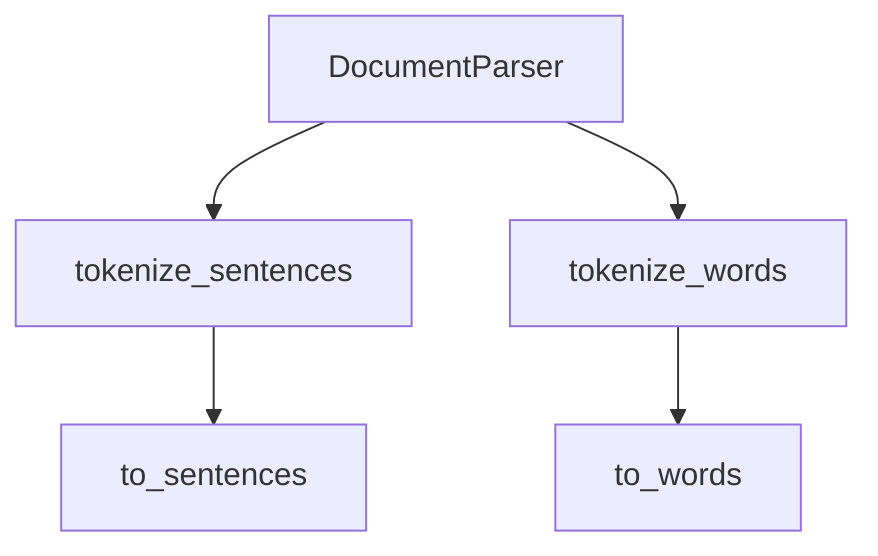

# `parser.py`

## `sumy.parsers.parser.DocumentParser` · *class*

## Summary:
A document parser that tokenizes text into sentences and words using a provided tokenizer.

## Description:
The DocumentParser class serves as an abstraction layer for text processing operations, specifically designed to break down paragraphs into sentences and sentences into individual words. It relies on an external tokenizer object to perform the actual tokenization work. This class is typically instantiated by components that require text preprocessing capabilities for summarization or analysis tasks.

The class contains two class-level constants: `SIGNIFICANT_WORDS` and `STIGMA_WORDS`, which appear to be lists of Czech words used for identifying important or negative terms in text analysis, though they are not currently used in the implemented methods.

## State:
- `_tokenizer`: Tokenizer instance used for text processing operations. Must implement `to_sentences()` and `to_words()` methods. No specific constraints on the tokenizer type beyond this interface requirement.

## Lifecycle:
- Creation: Instantiate with a valid tokenizer object that implements the required interface.
- Usage: Call `tokenize_sentences()` to split paragraphs into sentences, followed by `tokenize_words()` to split sentences into words.
- Destruction: No explicit cleanup required; relies on Python's garbage collection.

## Method Map:


## Raises:
- None explicitly raised by `__init__`
- Exceptions may be raised by the underlying tokenizer's methods (`to_sentences`, `to_words`) if they encounter invalid input

## Example:
```python
# Assuming a tokenizer is available
parser = DocumentParser(tokenizer)
paragraph = "This is the first sentence. This is the second sentence!"
sentences = parser.tokenize_sentences(paragraph)
words = [parser.tokenize_words(s) for s in sentences]
```

### `sumy.parsers.parser.DocumentParser.__init__` · *method*

## Summary:
Initializes a DocumentParser instance with a specified tokenizer.

## Description:
This method sets up the DocumentParser object by storing the provided tokenizer for later use in parsing documents. It serves as the constructor for the DocumentParser class, establishing the tokenizer dependency that will be used throughout the parsing process.

## Args:
    tokenizer: An object implementing the tokenizer interface, used for tokenizing text during document parsing.

## Returns:
    None

## Raises:
    None

## State Changes:
    Attributes READ: None
    Attributes WRITTEN: self._tokenizer

## Constraints:
    Preconditions: The tokenizer argument must be a valid object implementing the expected tokenizer interface.
    Postconditions: The DocumentParser instance will have its _tokenizer attribute set to the provided tokenizer.

## Side Effects:
    None

### `sumy.parsers.parser.DocumentParser.tokenize_sentences` · *method*

## Summary:
Splits a paragraph into individual sentences using a tokenizer and filters out empty sentences.

## Description:
This method takes a paragraph of text and breaks it down into individual sentences using the instance's tokenizer. It then filters out any empty or whitespace-only sentences from the result.

The method serves as a utility for processing text paragraphs into discrete sentence units while ensuring clean output by excluding invalid entries.

## Args:
    paragraph (str): The input text paragraph to be tokenized into sentences.

## Returns:
    list[str]: A list of non-empty sentences extracted from the paragraph, with leading/trailing whitespace removed.

## Raises:
    AttributeError: If self._tokenizer is None or does not have a to_sentences method.

## State Changes:
    Attributes READ: self._tokenizer
    Attributes WRITTEN: None

## Constraints:
    Preconditions: 
    - self._tokenizer must be initialized and have a to_sentences method
    - paragraph must be a string type
    
    Postconditions:
    - Returns a list of strings where each string represents a sentence
    - All returned sentences are stripped of leading/trailing whitespace
    - Empty or whitespace-only sentences are excluded from the result

## Side Effects:
    None

### `sumy.parsers.parser.DocumentParser.tokenize_words` · *method*

## Summary:
Converts a sentence into a list of word tokens using the parser's tokenizer.

## Description:
This method serves as a wrapper around the internal tokenizer's `to_words` method to tokenize sentences into individual word tokens. It is part of the document parsing pipeline where raw text needs to be broken down into discrete linguistic units for further processing such as feature extraction or summarization. The method is called during the text preprocessing phase when individual sentences need to be converted into word-level representations.

## Args:
    sentence (str): The input sentence to be tokenized into words.

## Returns:
    list[str]: A list of word tokens extracted from the input sentence.

## Raises:
    None explicitly raised; any exceptions would originate from the underlying `_tokenizer.to_words()` implementation.

## State Changes:
    Attributes READ: self._tokenizer
    Attributes WRITTEN: None

## Constraints:
    Preconditions: The `sentence` argument must be a string. The `self._tokenizer` attribute must be initialized and have a `to_words` method.
    Postconditions: The returned list contains word tokens derived from the input sentence, maintaining the order of words.

## Side Effects:
    None

