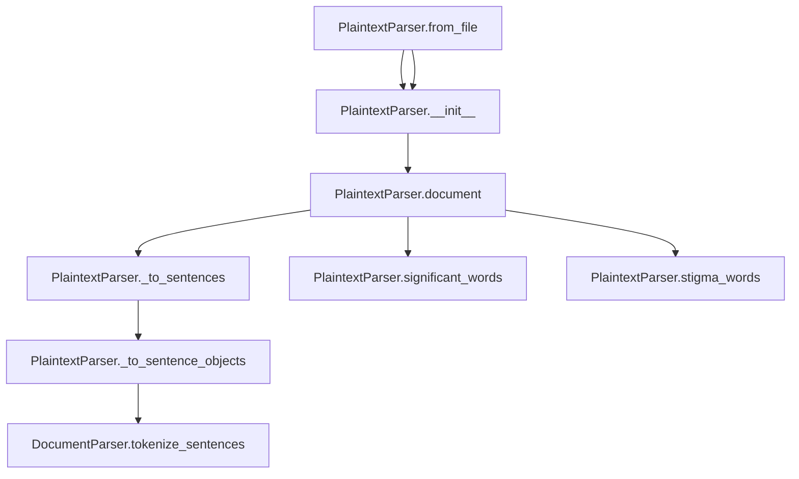

# `plaintext.py`

## `sumy.parsers.plaintext.PlaintextParser` · *class*

## Summary:
A plaintext document parser that converts plain text into a structured document model with paragraphs, sentences, and headings.

## Description:
The PlaintextParser class is responsible for transforming raw plaintext content into a structured document model suitable for text analysis and summarization tasks. It processes text by identifying headings (uppercase lines), separating paragraphs (empty lines), and converting remaining content into sentences. The parser creates a hierarchical document structure consisting of paragraphs containing sentences, with special handling for heading sentences.

This class is typically instantiated by text processing pipelines that require structured document representation from plain text input. It serves as a concrete implementation of the DocumentParser abstract base class, providing specific logic for plaintext parsing.

## State:
- `_text`: str - The raw text content being parsed, stored after Unicode conversion and stripping
  - Type: str
  - Valid range: Any valid Unicode string
  - Invariant: Set once during initialization, remains immutable throughout object lifetime
- `_tokenizer`: Tokenizer instance - Used for sentence and word tokenization operations
  - Type: Tokenizer object implementing required interface
  - Valid range: Must support to_words() method for word tokenization
  - Invariant: Set once during initialization via parent class constructor

## Lifecycle:
- Creation: Instantiate using either `from_string()` or `from_file()` class methods, or directly with `__init__()`
- Usage: Access the `document` property to obtain the parsed document model, or access `significant_words` and `stigma_words` properties for word lists
- Destruction: No explicit cleanup required; relies on Python's garbage collection

## Method Map:


## Raises:
- FileNotFoundError: When `from_file()` is called with a non-existent file path
- UnicodeDecodeError: When `from_file()` encounters invalid UTF-8 encoding in the file
- AttributeError: If the tokenizer passed to `__init__` lacks required methods

## Example:
```python
# Parse from string
from sumy.parsers.plaintext import PlaintextParser
from sumy.nlp.tokenizers import Tokenizer

parser = PlaintextParser.from_string("Hello world.\n\nTHIS IS A HEADING\n\nRegular sentence.", Tokenizer("english"))
document = parser.document  # Access parsed document structure

# Parse from file
parser = PlaintextParser.from_file("/path/to/file.txt", Tokenizer("english"))
significant_words = parser.significant_words  # Access significant words list
```

### `sumy.parsers.plaintext.PlaintextParser.from_string` · *method*

## Summary:
Creates a new PlaintextParser instance from a string and tokenizer.

## Description:
The `from_string` class method provides a convenient factory interface for creating PlaintextParser instances. It serves as an alternative to direct instantiation, allowing users to create parsers from string content without needing to manage the constructor parameters manually. This method is particularly useful in pipelines where text content is already loaded into memory and needs to be processed by a parser.

This method is implemented as a classmethod to provide a clean, static interface for object creation while maintaining consistency with other factory methods like `from_file`.

## Args:
    string (str): The text content to parse, typically representing the full document text.
    tokenizer (Tokenizer): An instance of a tokenizer that implements the required tokenization interface (to_sentences, to_words).

## Returns:
    PlaintextParser: A new instance of the PlaintextParser class initialized with the provided string and tokenizer.

## Raises:
    None explicitly raised by this method.

## State Changes:
    Attributes READ: None
    Attributes WRITTEN: None (the returned instance will have its own state)

## Constraints:
    Preconditions:
        - The `string` parameter must be a valid string representation of text content.
        - The `tokenizer` parameter must be a valid tokenizer object implementing the required interface.
    Postconditions:
        - A new PlaintextParser instance is created and returned.
        - The returned instance will have its internal `_text` attribute set to the provided string, processed through `to_unicode()` and stripped of whitespace.

## Side Effects:
    None

### `sumy.parsers.plaintext.PlaintextParser.from_file` · *method*

## Summary:
Creates a PlaintextParser instance by reading text from a file and initializing it with the provided tokenizer.

## Description:
This class method serves as a factory for creating PlaintextParser instances from file content. It reads the entire file content using UTF-8 encoding and delegates to the constructor to process the text with the given tokenizer. This approach separates file I/O concerns from the parser initialization logic, making the code more modular and testable.

## Args:
    file_path (str): Absolute or relative path to the text file to be parsed.
    tokenizer: An object capable of tokenizing text into sentences and words, typically passed to the parser's constructor.

## Returns:
    PlaintextParser: A new instance of PlaintextParser initialized with content from the file and the provided tokenizer.

## Raises:
    FileNotFoundError: If the specified file_path does not exist.
    UnicodeDecodeError: If the file cannot be decoded using UTF-8 encoding.

## State Changes:
    Attributes READ: None
    Attributes WRITTEN: None

## Constraints:
    Preconditions: The file_path must point to an existing file that can be read with UTF-8 encoding.
    Postconditions: The returned PlaintextParser instance will have its internal text representation set to the file's content.

## Side Effects:
    I/O: Reads the entire content of the file specified by file_path.
    External service calls: None
    Mutations to objects outside self: None

### `sumy.parsers.plaintext.PlaintextParser.__init__` · *method*

## Summary:
Initializes a PlaintextParser instance with text content and a tokenizer for document parsing.

## Description:
This method sets up a PlaintextParser object by initializing the parent DocumentParser with the provided tokenizer and storing the text content after Unicode conversion and stripping. It serves as the constructor for the PlaintextParser class, preparing the object for document parsing operations.

The method delegates to the parent class constructor to establish the tokenizer dependency, then processes the input text through Unicode conversion and whitespace stripping to ensure consistent text handling.

## Args:
    text: Any object convertible to Unicode string - The raw text content to be parsed
    tokenizer: Tokenizer instance - Object implementing the tokenizer interface for sentence and word tokenization

## Returns:
    None

## Raises:
    UnicodeDecodeError: When the to_unicode conversion fails due to invalid UTF-8 sequences in bytes objects
    AttributeError: When the tokenizer lacks required methods for tokenization operations

## State Changes:
    Attributes READ: None
    Attributes WRITTEN: 
    - self._text: Stores the Unicode-converted and stripped text content
    - self._tokenizer: Set via parent class constructor

## Constraints:
    Preconditions: 
    - The text parameter must be convertible to a Unicode string
    - The tokenizer parameter must implement the required tokenizer interface
    Postconditions: 
    - The _text attribute contains the stripped Unicode representation of the input text
    - The _tokenizer attribute is properly initialized from the parent class

## Side Effects:
    None

### `sumy.parsers.plaintext.PlaintextParser.significant_words` · *method*

## Summary:
Retrieves significant words from document headings, falling back to default significant words when no headings are present.

## Description:
Extracts all words from document headings across all paragraphs and returns them as a tuple. This method is implemented as a cached property and is part of the PlaintextParser's document processing pipeline. When no headings are found in the document structure, it falls back to returning the default SIGNIFICANT_WORDS constant inherited from the parent DocumentParser class.

The method specifically targets heading sentences (identified by their is_heading property) and aggregates words from all such headings across all paragraphs in the document. This approach prioritizes structural elements over content, making it suitable for summarization tasks that emphasize document organization and key topic indicators.

## Args:
    None

## Returns:
    tuple[str]: A tuple containing all words extracted from document headings in order of appearance, or the default SIGNIFICANT_WORDS constant if no headings exist in the document.

## Raises:
    None explicitly raised

## State Changes:
    Attributes READ: 
    - self.document.paragraphs
    - self.document.headings  
    - self.SIGNIFICANT_WORDS
    
    Attributes WRITTEN: 
    - None

## Constraints:
    Preconditions:
    - self.document must be a valid ObjectDocumentModel instance with populated paragraphs
    - Each paragraph in self.document.paragraphs must have a valid headings attribute
    - Each heading in paragraph.headings must have a valid words attribute
    
    Postconditions:
    - Returns either a tuple of words from headings or the default SIGNIFICANT_WORDS constant
    - The returned tuple maintains the order of words as they appear in the document structure

## Side Effects:
    None

### `sumy.parsers.plaintext.PlaintextParser.stigma_words` · *method*

## Summary:
Returns the STIGMA_WORDS constant associated with the parser instance.

## Description:
This method provides access to the STIGMA_WORDS class constant, which contains a predefined list of Czech words considered to have negative connotations or stigma. The method acts as a simple accessor that exposes this constant to client code while maintaining encapsulation through the cached_property decorator.

The method is called during document processing when analyzing text for potentially problematic or sensitive terminology. It's part of the parser's interface for accessing linguistic constants that may be used in various text analysis operations.

This method is part of the DocumentParser base class hierarchy and is overridden in the PlaintextParser subclass to provide access to the specific STIGMA_WORDS constant defined for plaintext parsing operations.

## Args:
    None

## Returns:
    tuple: A tuple containing the STIGMA_WORDS constant, which represents a collection of Czech words with negative connotations.

## Raises:
    None

## State Changes:
    Attributes READ: self.STIGMA_WORDS
    Attributes WRITTEN: None

## Constraints:
    Preconditions: The class must define a STIGMA_WORDS constant.
    Postconditions: The returned value is always the same tuple instance defined at class level.

## Side Effects:
    None

### `sumy.parsers.plaintext.PlaintextParser.document` · *method*

## Summary:
Converts plain text into a structured document model with paragraphs, sentences, and headings.

## Description:
Transforms raw text into a hierarchical document structure by splitting lines into paragraphs and sentences, while identifying uppercase lines as headings. This method processes the internal `_text` attribute and constructs an `ObjectDocumentModel` containing properly organized paragraphs with their constituent sentences and headings.

The method implements a state machine approach to parse text lines, recognizing three categories: uppercase lines (treated as headings), empty lines (used to separate paragraphs), and regular text lines (grouped into paragraphs). It leverages the `_to_sentences` helper method to convert text lines into structured `Sentence` objects.

This logic is encapsulated in its own method because it represents a distinct parsing phase that transforms raw text into a semantic document structure, separating concerns between text processing and document modeling.

## Args:
    None

## Returns:
    ObjectDocumentModel: A document model containing paragraphs with sentences and headings organized according to the text structure.

## Raises:
    None explicitly raised.

## State Changes:
    Attributes READ: 
    - self._text: Raw text content to be parsed
    - self._tokenizer: Tokenizer used for sentence conversion
    
    Attributes WRITTEN: 
    - None

## Constraints:
    Preconditions:
    - self._text must be a string containing text to be parsed
    - self._tokenizer must be a valid tokenizer object with appropriate methods
    
    Postconditions:
    - Returns a complete ObjectDocumentModel with properly structured paragraphs
    - All text lines are processed into sentences and headings
    - Empty lines properly delimit paragraphs

## Side Effects:
    - Calls self._to_sentences() which may involve text tokenization operations
    - Invokes tokenizer's to_sentences() method during sentence construction via _to_sentence_objects()

### `sumy.parsers.plaintext.PlaintextParser._to_sentences` · *method*

## Summary:
Converts a list of text lines into a list of Sentence objects, handling mixed input types.

## Description:
Processes a sequence of text lines, identifying existing Sentence objects and converting remaining text into new Sentence objects. This private method serves as a bridge between raw text processing and structured sentence objects within the document model.

The method is called during document parsing when text needs to be converted into Sentence objects while preserving existing Sentence instances that may have been pre-processed. It handles both plain text lines and pre-existing Sentence objects within the same input sequence.

## Args:
    lines (list[str|Sentence]): A sequence containing either text strings or Sentence objects to be processed.

## Returns:
    list[Sentence]: A list of Sentence objects constructed from the input lines.

## Raises:
    None explicitly raised.

## State Changes:
    Attributes READ: None
    Attributes WRITTEN: None

## Constraints:
    Preconditions:
    - lines must be iterable
    - Each item in lines must be either a string or a Sentence instance
    
    Postconditions:
    - Returns a list of Sentence objects
    - Existing Sentence objects are preserved in their original form
    - Text lines are converted to Sentence objects using the parser's tokenizer via `_to_sentence_objects()` method

## Side Effects:
    Calls self._to_sentence_objects() which may involve text tokenization operations.

### `sumy.parsers.plaintext.PlaintextParser._to_sentence_objects` · *method*

## Summary:
Converts a text into an iterable of Sentence objects using the parser's tokenizer.

## Description:
This method takes raw text input and transforms it into a sequence of Sentence objects by first tokenizing the text into individual sentences and then wrapping each sentence with a Sentence object that uses the parser's tokenizer.

The method is part of the PlaintextParser class and serves as a utility for creating Sentence objects from text segments during document parsing operations. It is called internally by other methods like `_to_sentences` when processing paragraphs of text.

## Args:
    text (str): The raw text to be converted into Sentence objects.

## Returns:
    generator[Sentence]: A generator yielding Sentence objects created from the input text.

## Raises:
    AttributeError: If self._tokenizer is None or does not have a to_sentences method.

## State Changes:
    Attributes READ: self._tokenizer, self.tokenize_sentences
    Attributes WRITTEN: None

## Constraints:
    Preconditions:
    - text must be a string type
    - self._tokenizer must be initialized and have a to_sentences method
    
    Postconditions:
    - Returns a generator of Sentence objects
    - Each Sentence object is constructed with the corresponding sentence text and the parser's tokenizer
    - The underlying tokenize_sentences method must return a list-like structure of sentences

## Side Effects:
    None

