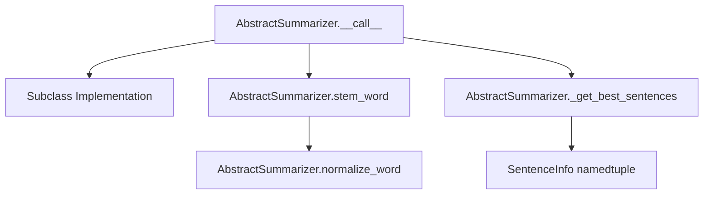

# `_summarizer.py`

## `sumy.summarizers._summarizer.AbstractSummarizer` · *class*

## Summary:
Abstract base class defining the interface for text summarization algorithms.

## Description:
The AbstractSummarizer serves as the foundational interface for all text summarization implementations in the sumy library. It defines the core contract that concrete summarizer classes must implement, providing common utilities for word stemming and sentence ranking while enforcing a standardized method signature for the summarization process. This abstract class ensures that all summarizer implementations follow a consistent pattern for document processing and sentence selection.

## State:
- `_stemmer`: Callable object used for word stemming operations. Must be callable and defaults to null_stemmer.
- The class maintains no other persistent state beyond the stemmer configuration.

## Lifecycle:
- Creation: Instantiate with an optional stemmer parameter (defaults to null_stemmer). The stemmer must be callable.
- Usage: Call the instance with a document and desired sentence count to generate a summary. Concrete implementations must override the `__call__` method.
- Destruction: No explicit cleanup required; relies on Python's garbage collection.

## Method Map:


## Raises:
- ValueError: Raised during initialization when the provided stemmer is not callable.

## Example:
```python
# Basic instantiation with default stemmer
summarizer = AbstractSummarizer()  # Uses default null_stemmer

# Custom stemmer usage
def custom_stemmer(word):
    return word.lower()  # Simple custom stemmer
summarizer = AbstractSummarizer(custom_stemmer)

# Note: Direct instantiation would raise NotImplementedError when calling
# the summarization method, as it's meant to be subclassed
# Proper usage requires creating a subclass that implements __call__
```

### `sumy.summarizers._summarizer.AbstractSummarizer.__init__` · *method*

## Summary:
Initializes the AbstractSummarizer with a stemmer callable for text processing.

## Description:
This method configures the stemmer for the summarizer instance by validating that it is callable and storing it as an instance attribute. The separation of this logic into its own method allows for proper initialization of the stemmer dependency while ensuring type safety through validation. This approach enables subclasses to override the stemmer behavior while maintaining consistent initialization patterns.

## Args:
    stemmer (callable): A callable object that performs stemming operations. Defaults to null_stemmer.

## Returns:
    None: This method does not return any value.

## Raises:
    ValueError: Raised when the provided stemmer is not callable.

## State Changes:
    Attributes READ: None
    Attributes WRITTEN: self._stemmer

## Constraints:
    Preconditions: The stemmer argument must be a callable object that can be invoked with text input.
    Postconditions: The self._stemmer attribute is set to the provided stemmer, which will be used for text processing during summarization.

## Side Effects:
    None: This method does not perform any I/O operations or mutate external objects.

### `sumy.summarizers._summarizer.AbstractSummarizer.__call__` · *method*

## Summary:
Abstract method that serves as the main entry point for document summarization, requiring implementation in derived classes.

## Description:
This method defines the interface for summarizing documents and must be implemented by subclasses. It acts as the primary callable interface for the summarization process, accepting a document and desired sentence count to produce a summary. The base implementation raises NotImplementedError to enforce subclass implementation. This method is part of the abstract base class pattern that ensures all concrete summarizer implementations provide a consistent interface.

## Args:
    document (Any): The input document to be summarized, typically containing text content
    sentences_count (int): The number of sentences to include in the resulting summary

## Returns:
    NotImplemented: This method raises NotImplementedError in the base class and should be overridden by subclasses

## Raises:
    NotImplementedError: Always raised in the base AbstractSummarizer class, indicating the method must be implemented by subclasses

## State Changes:
    Attributes READ: None
    Attributes WRITTEN: None

## Constraints:
    Preconditions: 
    - The document parameter must be a valid document object that can be processed by implementing classes
    - The sentences_count parameter must be a positive integer
    - This method should only be called on instances of subclasses that implement the method
    
    Postconditions: 
    - The method will raise NotImplementedError when called on the base class
    - Subclasses must implement this method to return a valid summary

## Side Effects:
    None: This method does not perform any I/O operations or mutate external state

### `sumy.summarizers._summarizer.AbstractSummarizer.stem_word` · *method*

## Summary:
Normalizes and applies stemming to a word using the summarizer's configured stemmer.

## Description:
This method processes a word through two stages: normalization and stemming. First, it normalizes the word using the inherited normalize_word method (converting to Unicode and lowercasing), then applies the configured stemmer to produce a stemmed version. This method serves as a centralized interface for word stemming within the summarization pipeline, ensuring consistent preprocessing of words across different summarization algorithms.

The stemmer is configured during object initialization via the AbstractSummarizer constructor, which accepts a callable stemmer function. By default, a null stemmer is used that returns the word unchanged.

## Args:
    word (Any): The input word to process. Can be a string, bytes, or any object that can be converted to Unicode.

## Returns:
    Any: The stemmed version of the normalized word. The exact return type depends on the configured stemmer implementation.

## Raises:
    UnicodeDecodeError: When the input word contains invalid UTF-8 sequences that cannot be decoded during normalization.
    ValueError: When the stemmer configured in the summarizer instance is not callable (though this would be caught during initialization).

## State Changes:
    - Attributes READ: self._stemmer, self.normalize_word
    - Attributes WRITTEN: None

## Constraints:
    - Preconditions: The summarizer instance must have a valid stemmer configured (callable) and the word must be convertible to Unicode
    - Postconditions: The returned value is the result of applying the stemmer to the normalized word

## Side Effects:
    - Invokes the configured stemmer function which may perform complex linguistic operations
    - Calls normalize_word method which may decode bytes objects
    - No external I/O or mutations to objects outside the summarizer instance

### `sumy.summarizers._summarizer.AbstractSummarizer.normalize_word` · *method*

## Summary:
Normalizes a word by converting it to Unicode and lowercasing it for consistent text processing.

## Description:
This method performs text normalization by first converting the input word to a Unicode string representation using the to_unicode utility function, then converting it to lowercase. This ensures consistent text handling regardless of input encoding or case variations. The method is typically used in text preprocessing steps within summarization pipelines where uniform text representation is required for accurate comparison and analysis.

## Args:
    word (Any): The input word to normalize. Can be a string, bytes, or any object that can be converted to Unicode.

## Returns:
    str: A lowercase Unicode string representation of the input word.

## Raises:
    UnicodeDecodeError: When the input word contains invalid UTF-8 sequences that cannot be decoded.

## State Changes:
    - Attributes READ: None
    - Attributes WRITTEN: None

## Constraints:
    - Preconditions: The input word must be convertible to Unicode string
    - Postconditions: The returned value is always a lowercase Unicode string

## Side Effects:
    - Invokes to_unicode function which may decode bytes objects
    - No external I/O or mutations to objects outside the scope

### `sumy.summarizers._summarizer.AbstractSummarizer._get_best_sentences` · *method*

## Summary:
Selects the highest-rated sentences from a collection based on a rating function or dictionary, then returns them in their original order.

## Description:
This method serves as a core utility for summarization algorithms to extract the most important sentences according to a scoring mechanism. It takes a collection of sentences, applies a rating function or dictionary to score them, sorts them by rating in descending order, selects the desired number of top sentences, and finally returns them in their original order. This method is typically called during the sentence selection phase of a summarization pipeline.

## Args:
    sentences (iterable): Collection of sentences to be rated and selected.
    count (int, str, or callable): Number of sentences to select. Can be an integer, percentage string (e.g., "30%"), or a callable that filters the ranked sentences.
    rating (callable or dict): Either a callable that rates sentences or a dictionary mapping sentences to their ratings.
    *args: Additional positional arguments passed to the rating function.
    **kwargs: Additional keyword arguments passed to the rating function.

## Returns:
    tuple: A tuple of selected sentences ordered by their original position in the input collection.

## Raises:
    AssertionError: When rating is a dictionary and additional args/kwargs are provided.
    ValueError: When count value is unsupported.

## State Changes:
    None

## Constraints:
    Preconditions:
        - Sentences must be iterable.
        - Rating must either be a callable or a dictionary.
        - If rating is a dictionary, no additional args or kwargs should be provided.
        - Count must be a supported type (int, float, string, or callable).
    Postconditions:
        - The returned tuple contains sentences in their original order.
        - The number of returned sentences matches the requested count.

## Side Effects:
    None

