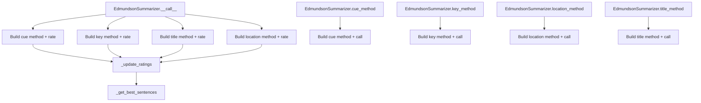

# `edmundson.py`

## `sumy.summarizers.edmundson.EdmundsonSummarizer` · *class*

## Summary:
EdmundsonSummarizer is a text summarization class that implements the Edmundson method, combining multiple weighting strategies (cue, key, title, location) to rank and select sentences for a summary.

## Description:
The EdmundsonSummarizer class provides a flexible approach to text summarization by integrating four different Edmundson-based methods: cue words, key words, title-based relevance, and location-based importance. It allows users to configure weights for each method and customize the sets of words used for each strategy. This class serves as a unified interface for applying these various text analysis techniques to generate coherent summaries.

## State:
- `_cue_weight`: float, default 1.0 - Weight applied to cue word method ratings
- `_key_weight`: float, default 0.0 - Weight applied to key word method ratings  
- `_title_weight`: float, default 1.0 - Weight applied to title-based method ratings
- `_location_weight`: float, default 1.0 - Weight applied to location-based method ratings
- `_bonus_words`: frozenset of stemmed words - Words that boost sentence ratings in cue method
- `_stigma_words`: frozenset of stemmed words - Words that reduce sentence ratings in cue method
- `_null_words`: frozenset of stemmed words - Words used for title and location methods

## Lifecycle:
- Creation: Instantiate with optional stemmer and weight parameters. All weights must be non-negative.
- Usage: Call the instance with a document and desired sentence count to generate a summary. Alternatively, use specific method functions for individual approaches.
- Destruction: No explicit cleanup required; relies on Python's garbage collection.

## Method Map:


## Raises:
- ValueError: When negative weights are provided during initialization, or when required word sets are empty during method execution.

## Example:
```python
from sumy.summarizers.edmundson import EdmundsonSummarizer
from sumy.nlp.stemmers import null_stemmer

# Create summarizer with custom weights
summarizer = EdmundsonSummarizer(
    stemmer=null_stemmer,
    cue_weight=1.0,
    key_weight=0.5,
    title_weight=1.0,
    location_weight=0.8
)

# Set word collections for cue method
summarizer.bonus_words = ["important", "significant", "crucial"]
summarizer.stigma_words = ["unimportant", "irrelevant"]

# Set word collection for title/location methods
summarizer.null_words = ["the", "and", "or"]

# Generate summary
summary = summarizer(document, 3)
```

### `sumy.summarizers.edmundson.EdmundsonSummarizer.__init__` · *method*

## Summary:
Initializes an EdmundsonSummarizer instance with configurable weights for different text analysis methods and sets up the base summarizer with a stemmer.

## Description:
The EdmundsonSummarizer constructor creates a new instance of the summarizer with customizable weights for four different text analysis methods: cue words, key words, title-based relevance, and location-based importance. It validates the weight parameters to ensure they are non-negative and stores them as instance attributes for later use in the summarization process. The method also initializes the parent AbstractSummarizer class with the provided stemmer.

## Args:
    stemmer (Stemmer, optional): A stemming function to normalize words. Defaults to null_stemmer.
    cue_weight (float, optional): Weight for cue word method. Must be non-negative. Defaults to 1.0.
    key_weight (float, optional): Weight for key word method. Must be non-negative. Defaults to 0.0.
    title_weight (float, optional): Weight for title-based method. Must be non-negative. Defaults to 1.0.
    location_weight (float, optional): Weight for location-based method. Must be non-negative. Defaults to 1.0.

## Returns:
    None: This method does not return any value.

## Raises:
    ValueError: Raised by _ensure_correct_weights when any of the weight parameters is negative.

## State Changes:
    Attributes READ: None
    Attributes WRITTEN: 
    - self._cue_weight: Stores the cue weight as a float
    - self._key_weight: Stores the key weight as a float
    - self._title_weight: Stores the title weight as a float
    - self._location_weight: Stores the location weight as a float

## Constraints:
    Preconditions: All weight parameters must be non-negative numbers.
    Postconditions: All weight parameters are stored as float values in the instance.

## Side Effects:
    None: This method performs no I/O operations or external service calls.

### `sumy.summarizers.edmundson.EdmundsonSummarizer._ensure_correct_weights` · *method*

## Summary:
Validates that all provided weight values are non-negative, raising an error if any negative weights are detected.

## Description:
This method serves as a validation utility to ensure that all weight parameters passed to the Edmundson summarizer remain within acceptable bounds. It is called during the initialization or configuration phase of the summarizer to prevent invalid negative weights from being used in the scoring calculations. The method is designed to be a standalone validation function rather than being inlined to improve code readability and maintainability.

## Args:
    *weights (float): Variable-length argument list of weight values to validate.

## Returns:
    None: This method does not return any value.

## Raises:
    ValueError: Raised when any of the provided weight values is less than 0.0.

## State Changes:
    Attributes READ: None
    Attributes WRITTEN: None

## Constraints:
    Preconditions: The method expects all arguments to be numeric values.
    Postconditions: All provided weights must be greater than or equal to zero.

## Side Effects:
    None: This method performs no I/O operations or external service calls.

### `sumy.summarizers.edmundson.EdmundsonSummarizer.bonus_words` · *method*

## Summary:
Sets the bonus words for the Edmundson summarizer by stemming and freezing a collection of words.

## Description:
This method serves as a property setter for the bonus_words attribute. It processes a collection of words by applying the stem_word method to each word and stores the result as an immutable frozenset in the _bonus_words attribute. Bonus words are used to identify important terms that should be weighted more heavily in the Edmundson summarization algorithm, particularly in the cue-based method. This method is typically called during the configuration phase of the EdmundsonSummarizer to define additional important terms beyond those identified automatically.

## Args:
    collection (iterable): An iterable collection of words to be processed as bonus words.

## Returns:
    None: This method does not return any value.

## Raises:
    AttributeError: If self.stem_word is not defined or callable.

## State Changes:
    Attributes READ: None
    Attributes WRITTEN: self._bonus_words

## Constraints:
    Preconditions: 
    - The collection parameter must be iterable
    - self.stem_word must be a callable method that can process each item in the collection
    Postconditions:
    - self._bonus_words will be set to a frozenset containing stemmed versions of all items in collection

## Side Effects:
    None

### `sumy.summarizers.edmundson.EdmundsonSummarizer.stigma_words` · *method*

## Summary:
Sets the stigma words for the Edmundson summarizer by converting input words to their stemmed form and storing them as an immutable frozen set.

## Description:
This method configures the stigma words used by the Edmundson summarization algorithm. Stigma words are terms that should be penalized during sentence scoring, typically representing less important or irrelevant content. The method processes the input collection by applying the summarizer's stemmer to each word and stores the result as an immutable frozenset for efficient lookup during summarization.

This logic is implemented as a property setter to provide a clean interface for setting stigma words while ensuring consistent preprocessing through the summarizer's stemmer. It follows the same pattern as the bonus_words and null_words setters in the class, maintaining consistency in the API design.

## Args:
    collection (iterable): An iterable of words (strings) to be used as stigma words.

## Returns:
    None: This method does not return a value.

## Raises:
    None: This method does not explicitly raise exceptions, though underlying operations may raise exceptions from the stemmer or frozenset conversion.

## State Changes:
    Attributes READ: None
    Attributes WRITTEN: self._stigma_words

## Constraints:
    Preconditions: The collection parameter must be iterable and contain strings that can be processed by the stemmer. The stemmer must be properly initialized in the parent AbstractSummarizer class.
    Postconditions: The self._stigma_words attribute will be updated to contain a frozenset of stemmed versions of the input words.

## Side Effects:
    None: This method performs no I/O operations or external service calls. It only modifies the object's internal state.

### `sumy.summarizers.edmundson.EdmundsonSummarizer.null_words` · *method*

## Summary:
Sets the null words for the Edmundson summarizer by stemming and freezing a collection of words.

## Description:
This method configures the null words used by the Edmundson summarization technique. It takes a collection of words, stems each word using the inherited `stem_word` method from `AbstractSummarizer`, and stores them as an immutable frozenset in the `_null_words` attribute. This method is the setter for the `null_words` property and is used to define words that should be penalized during sentence scoring in the Edmundson summarization approach.

The null words are typically words that appear frequently in titles or headings but are not informative for summarization purposes. By setting these words, the summarizer can reduce the importance of sentences containing them.

## Args:
    collection (iterable): A collection of words to be used as null words.

## Returns:
    None

## Raises:
    None explicitly raised

## State Changes:
    Attributes READ: None
    Attributes WRITTEN: self._null_words

## Constraints:
    Preconditions: The collection parameter should be iterable and contain words that can be stemmed.
    Postconditions: The `_null_words` attribute is updated to contain a frozenset of stemmed words from the input collection.

## Side Effects:
    None

### `sumy.summarizers.edmundson.EdmundsonSummarizer.__call__` · *method*

## Summary:
Applies weighted Edmundson methods (cue, key, title, location) to rate document sentences and returns the highest-rated sentences.

## Description:
This method implements the core Edmundson summarization algorithm by applying multiple weighting strategies to score sentences based on their textual features. It conditionally executes four different sentence rating methods (cue, key, title, location) based on their respective weight parameters, aggregates the scores, and selects the best sentences according to the specified count. The method serves as the main entry point for Edmundson-based summarization, combining multiple textual cues to determine sentence importance. It leverages the `_get_best_sentences` utility to select the top-rated sentences while preserving their original order.

## Args:
    document: The input document containing sentences to be summarized.
    sentences_count: The number of top sentences to return, can be an integer, percentage string (e.g., "30%"), or a callable that filters sentences.

## Returns:
    tuple: A tuple of the highest-rated sentences ordered by their original position in the document.

## Raises:
    ValueError: When any of the weighting methods require prerequisite words (bonus/stigma/null) that haven't been set, or when invalid count parameter is provided.

## State Changes:
    Attributes READ: _cue_weight, _key_weight, _title_weight, _location_weight
    Attributes WRITTEN: None

## Constraints:
    Preconditions:
        - Document must contain sentences to rate.
        - Weight parameters must be non-negative.
        - Bonus/stigma/null word sets must be properly configured for methods with positive weights.
    Postconditions:
        - Returns exactly the requested number of sentences (or fewer if insufficient).
        - Sentences are returned in their original order from the document.

## Side Effects:
    None

### `sumy.summarizers.edmundson.EdmundsonSummarizer._update_ratings` · *method*

## Summary:
Accumulates new sentence ratings into existing ratings dictionary.

## Description:
This method performs in-place accumulation of sentence ratings by adding new ratings to existing ones. It is used internally by the EdmundsonSummarizer to combine ratings from different scoring methods (cue, key, title, location) into a single composite rating for each sentence. The method ensures that both dictionaries have matching sentence keys before performing the accumulation.

Known callers:
- EdmundsonSummarizer.__call__: Called during the main summarization process to accumulate ratings from each scoring method
- EdmundsonSummarizer.cue_method: Called during cue-based summarization
- EdmundsonSummarizer.key_method: Called during key-based summarization  
- EdmundsonSummarizer.title_method: Called during title-based summarization
- EdmundsonSummarizer.location_method: Called during location-based summarization

This logic is separated into its own method to avoid code duplication and provide a clean interface for combining ratings from different scoring approaches.

## Args:
    ratings (defaultdict): Dictionary containing existing sentence ratings to be updated in-place.
    new_ratings (dict): Dictionary containing new ratings to be added to existing ratings.

## Returns:
    defaultdict: The updated ratings dictionary with accumulated values.

## Raises:
    AssertionError: When the length of ratings and new_ratings differ (except when ratings is empty).

## State Changes:
    Attributes READ: None
    Attributes WRITTEN: None

## Constraints:
    Preconditions: 
    - The ratings dictionary must be a defaultdict (initialized with zero values)
    - Both ratings and new_ratings must have the same sentence keys
    - Length of ratings must be either 0 or equal to length of new_ratings
    
    Postconditions:
    - All sentences in new_ratings will have their ratings accumulated into ratings
    - The returned ratings dictionary will contain updated cumulative values

## Side Effects:
    None

### `sumy.summarizers.edmundson.EdmundsonSummarizer.cue_method` · *method*

## Summary:
Applies the Edmundson cue method to score and select sentences from a document based on bonus and stigma word frequencies.

## Description:
This method implements the cue-based sentence scoring approach from the Edmundson summarization technique. It creates a specialized cue method instance using the current summarizer configuration and applies it to rate document sentences. The cue method evaluates sentences based on the frequency of bonus words (positive indicators) and stigma words (negative indicators) to determine their importance for inclusion in the summary.

This method is specifically called from the main `__call__` method when the cue weight is greater than zero, enabling conditional application of this particular scoring strategy alongside other Edmundson methods (key, title, location). The separation allows for modular implementation of different sentence rating approaches within the overall Edmundson framework.

## Args:
    document: The input document containing sentences to be rated and selected.
    sentences_count: The number of top sentences to return, can be an integer, percentage string (e.g., "30%"), or a callable that filters sentences.
    bonus_word_value (float): Weight multiplier for bonus words in the scoring calculation. Defaults to 1.0.
    stigma_word_value (float): Weight multiplier for stigma words in the scoring calculation. Defaults to 1.0.

## Returns:
    tuple: A tuple of Sentence objects representing the highest-rated sentences ordered by their original position in the document.

## Raises:
    ValueError: When bonus_words or stigma_words have not been set on the summarizer instance, as these are required for cue method operation.

## State Changes:
    Attributes READ: self._stemmer, self._bonus_words, self._stigma_words
    Attributes WRITTEN: None

## Constraints:
    Preconditions:
        - The EdmundsonSummarizer instance must have been initialized with a stemmer.
        - Bonus words and stigma words must be set via the bonus_words and stigma_words properties before calling this method.
        - The bonus_word_value and stigma_word_value parameters must be non-negative numbers.
        - The document must contain at least one sentence.
    Postconditions:
        - Returns exactly the requested number of sentences (or fewer if insufficient).
        - Sentences are returned in their original order from the document.

## Side Effects:
    None

### `sumy.summarizers.edmundson.EdmundsonSummarizer._build_cue_method_instance` · *method*

## Summary:
Creates and returns an EdmundsonCueMethod instance configured with the current stemmer and word collections.

## Description:
This method constructs an EdmundsonCueMethod object using the summarizer's internal stemmer and the currently configured bonus and stigma word collections. It ensures these word collections are properly initialized before creating the method instance by calling validation methods. This method is part of the Edmundson summarization approach that uses cue words to score sentences.

## Args:
    None

## Returns:
    EdmundsonCueMethod: A configured instance of the cue method for sentence scoring.

## Raises:
    ValueError: When the internal `_bonus_words` attribute is empty, indicating bonus words have not been set.
    ValueError: When the internal `_stigma_words` attribute is empty, indicating stigma words have not been set.

## State Changes:
    Attributes READ: self._stemmer, self._bonus_words, self._stigma_words
    Attributes WRITTEN: None

## Constraints:
    Preconditions: The EdmundsonSummarizer instance must have been initialized with a stemmer, and the `_bonus_words` and `_stigma_words` attributes must be populated with valid collections.
    Postconditions: The returned EdmundsonCueMethod instance is properly configured with the current stemmer and word collections.

## Side Effects:
    None

### `sumy.summarizers.edmundson.EdmundsonSummarizer.key_method` · *method*

## Summary:
Selects and ranks sentences based on key word frequency using bonus words to identify important content.

## Description:
This method implements the key-based sentence ranking approach from the Edmundson summarization technique. It creates an instance of EdmundsonKeyMethod using the summarizer's configured stemmer and bonus words, then applies this method to rank sentences in the document according to their key word content. The method supports flexible sentence count specification including absolute numbers, percentage-based counts, and filtering functions.

The method is separated from inline logic to encapsulate the key method creation and ranking process, ensuring proper initialization of the EdmundsonKeyMethod instance and providing a clean interface for different sentence count specifications. It is called during the summarization process when the key weight is greater than zero, specifically in the `__call__` method when processing key-weighted sentences.

## Args:
    document: Document object containing sentences to be ranked
    sentences_count: Integer specifying number of sentences to return, or string ending with '%' for percentage, or callable for filtering
    weight: Float value (default 0.5) controlling the threshold for significant word detection

## Returns:
    tuple: A tuple of ranked sentences, sorted by importance according to key word frequency. Returns empty tuple if no sentences are available.

## Raises:
    ValueError: When bonus words have not been set (bonus_words attribute is empty)

## State Changes:
    Attributes READ: self._bonus_words, self._stemmer
    Attributes WRITTEN: None

## Constraints:
    Preconditions: Bonus words must be set via the bonus_words property before calling this method
    Postconditions: Returns a tuple of sentences ordered by key word significance

## Side Effects:
    None

### `sumy.summarizers.edmundson.EdmundsonSummarizer._build_key_method_instance` · *method*

## Summary:
Creates and returns an instance of the EdmundsonKeyMethod class configured with the summarizer's stemmer and bonus words.

## Description:
This method serves as a factory for creating EdmundsonKeyMethod instances, which are used in the Edmundson summarization technique to identify important sentences based on key word frequency. It ensures that bonus words are properly initialized before creating the method instance. The method is called during the summarization process when the key weight is greater than zero, specifically in the `__call__` method when processing key-weighted sentences.

This method is separate from inline instantiation to maintain clean separation of concerns and encapsulation of the creation logic. It also provides a consistent interface for building key method instances throughout the class.

## Args:
    None

## Returns:
    EdmundsonKeyMethod: An instance of the EdmundsonKeyMethod class configured with the summarizer's stemmer and bonus words.

## Raises:
    ValueError: If the bonus_words attribute is empty (not set), indicating that bonus words must be provided before building the key method instance.

## State Changes:
    Attributes READ: self._stemmer, self._bonus_words
    Attributes WRITTEN: None

## Constraints:
    Preconditions: The _bonus_words attribute must be populated with a non-empty frozenset of stemmed words.
    Postconditions: Returns a valid EdmundsonKeyMethod instance ready for use in sentence rating.

## Side Effects:
    None

### `sumy.summarizers.edmundson.EdmundsonSummarizer._build_title_method_instance` · *method*

## Summary:
Creates and returns a new instance of the Edmundson title method for sentence scoring.

## Description:
This method constructs and initializes an EdmundsonTitleMethod instance using the summarizer's stemmer and null words collection. It ensures proper initialization of the title method by validating the null words collection first, then returns the configured title method instance for use in the summarization pipeline. This method is called during the summarization process when the title weight is greater than zero, specifically in the main `__call__` method of the EdmundsonSummarizer.

## Args:
    None

## Returns:
    EdmundsonTitleMethod: A configured instance of the title method class ready for sentence rating operations.

## Raises:
    ValueError: When the `_null_words` attribute is empty or None, indicating that the null words collection has not been properly initialized.

## State Changes:
    Attributes READ: self._null_words, self._stemmer
    Attributes WRITTEN: None

## Constraints:
    Preconditions: The `EdmundsonSummarizer` instance must have its `_null_words` attribute initialized with a collection of words.
    Postconditions: The returned EdmundsonTitleMethod instance is properly configured with the summarizer's stemmer and null words.

## Side Effects:
    None

### `sumy.summarizers.edmundson.EdmundsonSummarizer.location_method` · *method*

## Summary:
Applies the Edmundson location method to rate sentences based on their proximity to document headings and positional factors.

## Description:
This method implements the location-based sentence scoring approach from the Edmundson summarization technique. It creates an instance of the EdmundsonLocationMethod using the summarizer's stemmer and null words configuration, then applies this method to rate sentences in the document based on their relationship to headings and positional factors (beginning/end of paragraphs and sentences). The method serves as a bridge between the EdmundsonSummarizer class and the specific location scoring implementation, allowing for configurable weighting of different positional factors.

This method is called during the Edmundson summarization process when the location weight is greater than zero. It provides a way to apply the location-based scoring independently from the main summarization workflow, enabling fine-grained control over the contribution of positional factors to sentence importance. The location method specifically evaluates sentences based on:
1. Heading significance (words in document headings)
2. Paragraph position bonuses (first/last paragraphs)
3. Sentence position bonuses (first/last sentences in paragraphs)

## Args:
    document: The input document containing sentences to be scored.
    sentences_count: The number of top sentences to return.
    w_h (float): Weight for heading significance factor (default: 1.0).
    w_p1 (float): Weight for first paragraph bonus (default: 1.0).
    w_p2 (float): Weight for last paragraph bonus (default: 1.0).
    w_s1 (float): Weight for first sentence bonus (default: 1.0).
    w_s2 (float): Weight for last sentence bonus (default: 1.0).

## Returns:
    tuple: A tuple of the highest-rated sentences ordered by their original position in the document.

## Raises:
    ValueError: When the `_null_words` attribute is empty or None, indicating that the null words collection has not been properly initialized. This occurs when the method tries to build the location method instance.

## State Changes:
    Attributes READ: self._build_location_method_instance
    Attributes WRITTEN: None

## Constraints:
    Preconditions:
        - The EdmundsonSummarizer instance must have been properly initialized with a stemmer and null words.
        - The document must contain sentences to rate.
        - All weight parameters should be numeric values.
        - The null words collection must be set via the `null_words` property before calling this method.
    Postconditions:
        - Returns exactly the requested number of sentences (or fewer if insufficient).
        - Sentences are returned in their original order from the document.

## Side Effects:
    None

### `sumy.summarizers.edmundson.EdmundsonSummarizer._build_location_method_instance` · *method*

## Summary:
Creates and returns an instance of the Edmundson location method for sentence scoring based on heading significance.

## Description:
This method constructs and initializes an EdmundsonLocationMethod instance using the summarizer's stemmer and null words collection. It ensures proper initialization of null words before creating the location method instance. This method is part of the Edmundson summarization approach that evaluates sentences based on their position relative to document headings. The location method specifically rates sentences based on their proximity to document headings and paragraph positions.

## Args:
    None

## Returns:
    EdmundsonLocationMethod: An initialized instance of the location method that can score sentences based on heading significance and positional factors.

## Raises:
    ValueError: When the `_null_words` attribute is empty or None, indicating that the null words collection has not been properly initialized.

## State Changes:
    Attributes READ: self._stemmer, self._null_words
    Attributes WRITTEN: None

## Constraints:
    Preconditions: The `EdmundsonSummarizer` instance must have its `_null_words` attribute initialized with a collection of words.
    Postconditions: The returned EdmundsonLocationMethod instance is properly initialized with the summarizer's stemmer and null words.

## Side Effects:
    None

### `sumy.summarizers.edmundson.EdmundsonSummarizer.__check_bonus_words` · *method*

## Summary:
Validates that bonus words have been set for the Edmundson summarizer.

## Description:
This method performs a validation check to ensure that the bonus_words attribute has been properly initialized with a non-empty collection. It is called during the summarization process to prevent errors when bonus words are expected but not configured.

## Args:
    None

## Returns:
    None

## Raises:
    ValueError: When the internal `_bonus_words` attribute is empty or None, indicating that bonus words have not been set.

## State Changes:
    Attributes READ: self._bonus_words
    Attributes WRITTEN: None

## Constraints:
    Preconditions: The EdmundsonSummarizer instance must have been initialized and the `_bonus_words` attribute must be accessible.
    Postconditions: If the method completes without raising an exception, the `_bonus_words` attribute contains a valid non-empty collection.

## Side Effects:
    None

### `sumy.summarizers.edmundson.EdmundsonSummarizer.__check_stigma_words` · *method*

## Summary:
Validates that the stigma words collection is properly initialized and not empty.

## Description:
This method performs a validation check to ensure that the `_stigma_words` attribute has been properly set with a non-empty collection before proceeding with summarization operations that depend on stigma word analysis. It is called during the summarization process to prevent runtime errors when stigma word-based scoring is attempted without proper initialization.

## Args:
    None

## Returns:
    None

## Raises:
    ValueError: When the `_stigma_words` attribute is empty or None, indicating that the stigma words collection has not been properly initialized.

## State Changes:
    - Attributes READ: self._stigma_words
    - Attributes WRITTEN: None

## Constraints:
    - Preconditions: The `EdmundsonSummarizer` instance must have been initialized with appropriate configuration, and the `_stigma_words` attribute should be set before calling this method.
    - Postconditions: If the method completes successfully, it guarantees that `self._stigma_words` contains at least one element.

## Side Effects:
    None

### `sumy.summarizers.edmundson.EdmundsonSummarizer.__check_null_words` · *method*

## Summary:
Validates that the null words collection is properly initialized and not empty.

## Description:
This method serves as a validation check to ensure that the `_null_words` attribute has been properly set with a non-empty collection before proceeding with summarization operations. It is called during the summarization process to prevent errors that would occur when attempting to use an empty set of null words.

## Args:
    None

## Returns:
    None

## Raises:
    ValueError: When the `_null_words` attribute is empty or None, indicating that the null words collection has not been properly initialized.

## State Changes:
    Attributes READ: self._null_words
    Attributes WRITTEN: None

## Constraints:
    Preconditions: The `EdmundsonSummarizer` instance must have its `_null_words` attribute initialized with a collection of words.
    Postconditions: If this method completes successfully, the `_null_words` attribute contains a valid, non-empty collection.

## Side Effects:
    None

