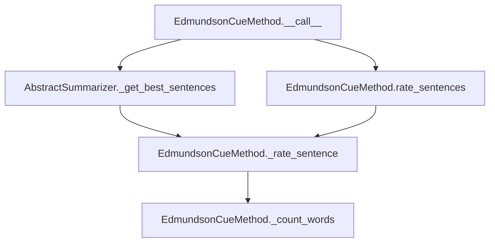

# `edmundson_cue.py`

## `sumy.summarizers.edmundson_cue.EdmundsonCueMethod` · *class*

## Summary:
Implements the Edmundson cue word method for text summarization by rating sentences based on bonus and stigma words.

## Description:
The EdmundsonCueMethod class implements a text summarization technique that rates sentences based on the presence of cue words. It assigns positive weights to bonus words and negative weights to stigma words, then selects the highest-rated sentences to form a summary. This class extends AbstractSummarizer and provides a concrete implementation of the Edmundson cue word approach for identifying important sentences in a document.

The method works by counting occurrences of bonus and stigma words in each sentence, applying configurable weights to these counts, and computing a net rating for each sentence. Sentences are then ranked and selected based on these ratings.

## State:
- `_bonus_words`: Set or list of words that contribute positively to sentence ratings
- `_stigma_words`: Set or list of words that contribute negatively to sentence ratings
- Inherits stemmer from parent AbstractSummarizer class

## Lifecycle:
- Creation: Instantiate with stemmer, bonus_words, and stigma_words parameters
  - stemmer: Callable for word stemming (defaults to null_stemmer)
  - bonus_words: Iterable of words that increase sentence ratings
  - stigma_words: Iterable of words that decrease sentence ratings
- Usage: Call instance with document, sentences_count, bonus_word_weight, and stigma_word_weight to generate summary
- Destruction: No special cleanup required; relies on Python's garbage collection

## Method Map:


## Raises:
- None explicitly raised by this class constructor
- May raise exceptions from parent AbstractSummarizer.__init__ if stemmer is not callable
- May raise exceptions from AbstractSummarizer._get_best_sentences during sentence selection

## Example:
```python
from sumy.summarizers.edmundson_cue import EdmundsonCueMethod

# Create summarizer with bonus and stigma words
bonus_words = {'important', 'significant', 'key', 'crucial'}
stigma_words = {'unimportant', 'irrelevant', 'minor', 'insignificant'}
summarizer = EdmundsonCueMethod(stemmer=None, bonus_words=bonus_words, stigma_words=stigma_words)

# Generate summary of top 3 sentences
# summary = summarizer(document, sentences_count=3, bonus_word_weight=1.0, stigma_word_weight=1.0)

# Rate all sentences in a document
# rated_sentences = summarizer.rate_sentences(document, bonus_word_weight=1.0, stigma_word_weight=1.0)
```

### `sumy.summarizers.edmundson_cue.EdmundsonCueMethod.__init__` · *method*

## Summary:
Initializes the EdmundsonCueMethod with a stemmer and word lists for cue-based text summarization.

## Description:
Configures the EdmundsonCueMethod summarizer by setting up the stemmer and defining bonus and stigma word collections that influence sentence scoring during the summarization process. This method establishes the core parameters needed for cue-based sentence evaluation, where bonus words increase sentence scores and stigma words decrease them.

## Args:
    stemmer (callable): A callable object used for word stemming operations. Must be callable and typically implements a stemming algorithm.
    bonus_words (set or list): Collection of words that should increase the score of sentences containing them.
    stigma_words (set or list): Collection of words that should decrease the score of sentences containing them.

## Returns:
    None: This method initializes instance attributes and does not return a value.

## Raises:
    ValueError: Raised by the parent AbstractSummarizer class if the provided stemmer is not callable.

## State Changes:
    Attributes READ: None
    Attributes WRITTEN: 
    - self._bonus_words: Stores the collection of bonus words for sentence scoring
    - self._stigma_words: Stores the collection of stigma words for sentence scoring

## Constraints:
    Preconditions:
    - The stemmer argument must be callable
    - bonus_words and stigma_words should be iterable collections of words
    - Both bonus_words and stigma_words should be convertible to sets for efficient lookup operations
    
    Postconditions:
    - Instance attributes _bonus_words and _stigma_words are properly initialized
    - The parent AbstractSummarizer is correctly initialized with the provided stemmer

## Side Effects:
    None: This method performs no I/O operations or external service calls. It only initializes internal state attributes.

### `sumy.summarizers.edmundson_cue.EdmundsonCueMethod.__call__` · *method*

## Summary:
Rates and selects the most informative sentences from a document based on cue word weights, returning them in original order.

## Description:
This method implements the Edmundson Cue method for text summarization by evaluating sentences using bonus and stigma word weights. It serves as the main entry point for the cue-based summarization algorithm, leveraging the `_get_best_sentences` utility to select top-rated sentences while maintaining their original order. This method is typically called during the sentence selection phase of a summarization pipeline when a document needs to be summarized using cue word analysis.

## Args:
    document (Document): The input document containing sentences to be rated and selected.
    sentences_count (int): The number of top-rated sentences to select from the document.
    bonus_word_weight (float): Weight multiplier applied to bonus words found in sentences.
    stigma_word_weight (float): Weight multiplier applied to stigma words found in sentences.

## Returns:
    tuple: A tuple of selected sentences ordered by their original position in the input document.

## Raises:
    AssertionError: When rating is a dictionary and additional args/kwargs are provided.
    ValueError: When count value is unsupported.

## State Changes:
    Attributes READ: self._bonus_words, self._stigma_words, self.stem_word
    Attributes WRITTEN: None

## Constraints:
    Preconditions:
        - Document must contain a valid sentences attribute.
        - Sentences count must be a positive integer.
        - Bonus word weight must be a non-negative number.
        - Stigma word weight must be a non-negative number.
    Postconditions:
        - The returned tuple contains sentences in their original order.
        - The number of returned sentences matches the requested count.

## Side Effects:
    None

### `sumy.summarizers.edmundson_cue.EdmundsonCueMethod._rate_sentence` · *method*

## Summary:
Calculates a weighted score for a sentence based on the presence of bonus and stigma words.

## Description:
This method evaluates a sentence by counting occurrences of predefined bonus and stigma words, then computes a weighted difference score. It serves as the core scoring mechanism for the Edmundson cue-based summarization approach, where bonus words contribute positively to sentence importance and stigma words negatively impact it. The method applies stemming to normalize words before comparison against the predefined word lists.

The method is designed to be used internally by the EdmundsonCueMethod class for ranking sentences during the summarization process. It's called by the `_get_best_sentences` method during the summarization workflow.

## Args:
    sentence (Sentence): The sentence object to rate, containing a list of words.
    bonus_word_weight (float): Weight multiplier applied to bonus word counts.
    stigma_word_weight (float): Weight multiplier applied to stigma word counts.

## Returns:
    float: The computed rating score, calculated as (bonus_words_count * bonus_word_weight) - (stigma_words_count * stigma_word_weight).

## Raises:
    None explicitly raised.

## State Changes:
    Attributes READ: self._bonus_words, self._stigma_words, self.stem_word
    Attributes WRITTEN: None

## Constraints:
    Preconditions: 
    - The sentence object must have a 'words' attribute containing a list of word strings.
    - The bonus_word_weight and stigma_word_weight must be numeric values.
    - The stemmer must be properly initialized in the parent class via AbstractSummarizer.
    
    Postconditions:
    - The returned score reflects the relative importance of bonus vs stigma words in the sentence.
    - The calculation is deterministic for the same input parameters.

## Side Effects:
    None.

### `sumy.summarizers.edmundson_cue.EdmundsonCueMethod._count_words` · *method*

## Summary:
Counts occurrences of bonus and stigma words in a given list of words.

## Description:
This method analyzes a list of words to determine how many of them appear in the predefined bonus and stigma word sets. It serves as a core utility for the Edmundson cue-based summarization approach, where specific word categories are weighted differently in the summarization process. The method is called during sentence rating to compute bonus and stigma word counts for each sentence.

## Args:
    words (iterable[str]): An iterable of words to analyze for bonus and stigma word matches.

## Returns:
    tuple[int, int]: A tuple containing two integers representing the count of bonus words and stigma words respectively.

## Raises:
    None explicitly raised.

## State Changes:
    Attributes READ: 
    - self._bonus_words: Set or list of words considered as bonus words
    - self._stigma_words: Set or list of words considered as stigma words

## Constraints:
    Preconditions:
    - The `words` parameter must be iterable and contain string elements
    - Both `self._bonus_words` and `self._stigma_words` must be initialized and support membership testing (e.g., be sets or lists)
    - The method assumes that `self._bonus_words` and `self._stigma_words` are properly initialized in the class constructor

    Postconditions:
    - The returned tuple contains non-negative integers
    - The method does not modify any instance state

## Side Effects:
    None.

### `sumy.summarizers.edmundson_cue.EdmundsonCueMethod.rate_sentences` · *method*

## Summary:
Rates all sentences in a document using bonus and stigma word weights to determine their importance for summarization.

## Description:
This method computes importance scores for each sentence in a document by applying the `_rate_sentence` helper method with configurable bonus and stigma word weights. It serves as the primary interface for sentence scoring within the Edmundson cue-based summarization approach. The method is typically called during the summarization process to rank sentences by their relevance, though it operates independently of the sentence selection process that uses `__call__`.

## Args:
    document (Document): The document containing sentences to be rated.
    bonus_word_weight (float): Weight multiplier for bonus words. Defaults to 1.
    stigma_word_weight (float): Weight multiplier for stigma words. Defaults to 1.

## Returns:
    dict[Sentence, float]: A mapping from each sentence to its computed importance score.

## Raises:
    None explicitly raised.

## State Changes:
    Attributes READ: self._bonus_words, self._stigma_words, self._rate_sentence, self.stem_word
    Attributes WRITTEN: None

## Constraints:
    Preconditions: 
    - The document parameter must be a valid Document object with a sentences attribute.
    - Each sentence in document.sentences must be compatible with self._rate_sentence method.
    - The document should contain sentences that can be processed by the summarizer.
    Postconditions:
    - Returns a dictionary mapping each sentence to a floating-point score.
    - Scores are determined by the internal _rate_sentence method logic.

## Side Effects:
    None.

