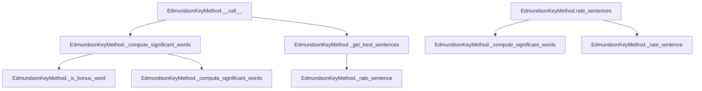

# `edmundson_key.py`

## `sumy.summarizers.edmundson_key.EdmundsonKeyMethod` · *class*

## Summary:
Implements the Edmundson key method for text summarization, which identifies significant words based on bonus word frequency and rates sentences accordingly.

## Description:
The EdmundsonKeyMethod class is a concrete implementation of the AbstractSummarizer that applies the Edmundson key method algorithm for automatic text summarization. It identifies significant words by filtering document words through a set of predefined bonus words, then computes word frequencies to determine which words are sufficiently frequent to be considered important. Sentences are subsequently ranked based on their coverage of these significant words.

This class is designed to be used as part of a larger text summarization pipeline where documents are processed to extract the most informative sentences. It provides both a primary summarization interface via the `__call__` method and a detailed sentence rating interface through `rate_sentences`.

## State:
- `_bonus_words`: frozenset of words that are considered bonus words for significance calculation. These are words that are particularly important for identifying key content in the document.
- Inherits stemmer from parent AbstractSummarizer class for word normalization.

## Lifecycle:
- Creation: Instantiate with a stemmer callable and a collection of bonus words (typically a set or list of strings). The stemmer must be callable, and bonus_words should be convertible to a frozenset for efficient lookup.
- Usage: Call the instance with a document, desired number of sentences, and weighting factor to generate a summary. Alternatively, use the `rate_sentences` method to get detailed sentence ratings for all sentences in the document.
- Destruction: No special cleanup required; relies on Python's garbage collection.

## Method Map:


## Raises:
- TypeError: Raised during initialization if the stemmer is not callable.
- ValueError: Raised during initialization if bonus_words cannot be converted to a frozenset.

## Example:
```python
from sumy.summarizers.edmundson_key import EdmundsonKeyMethod
from sumy.nlp.stemmers import null_stemmer

# Create a summarizer with bonus words
bonus_words = {"important", "key", "crucial", "significant"}
summarizer = EdmundsonKeyMethod(null_stemmer, bonus_words)

# Summarize a document
# summary = summarizer(document, sentences_count=3, weight=0.5)

# Or get detailed sentence ratings
# sentence_ratings = summarizer.rate_sentences(document, weight=0.5)
```

### `sumy.summarizers.edmundson_key.EdmundsonKeyMethod.__init__` · *method*

## Summary:
Initializes the EdmundsonKeyMethod summarizer with a stemmer and bonus words for key phrase identification.

## Description:
This method sets up the EdmundsonKeyMethod by initializing its parent AbstractSummarizer class with a stemmer and storing the bonus words that will be used to identify key phrases in the text. The method is part of the Edmundson key phrase-based summarization approach, where bonus words are given extra weight during sentence scoring.

## Args:
- stemmer: A callable object used for word stemming operations. Must be callable.
- bonus_words: Collection of words that should be given bonus weight during key phrase detection.

## Returns:
None

## Raises:
- ValueError: Raised during parent class initialization if the provided stemmer is not callable.

## State Changes:
- Attributes READ: None
- Attributes WRITTEN: 
  - self._bonus_words: Stores the bonus words collection for key phrase identification

## Constraints:
- Preconditions: 
  - The stemmer argument must be callable
  - The bonus_words argument should be a collection-like object (list, set, Counter, etc.)
- Postconditions: 
  - The parent AbstractSummarizer class is properly initialized with the provided stemmer
  - The instance's _bonus_words attribute is set to the provided bonus_words parameter

## Side Effects:
None

### `sumy.summarizers.edmundson_key.EdmundsonKeyMethod.__call__` · *method*

## Summary:
Computes significant words from a document using frequency weighting and selects the most important sentences based on their relevance to these words.

## Description:
This method implements the core logic for Edmundson key-based text summarization. It serves as the primary entry point for generating summaries using the key word approach, where significant words are identified from the document's content and used to score sentences. The method first filters words to identify bonus words, then applies frequency-based thresholding to determine which words are significant based on the provided weight parameter. These significant words are then used to rate sentences by counting word overlaps, and the top sentences are selected for the final summary.

This method is typically called during the sentence selection phase of a summarization pipeline, specifically when implementing the Edmundson key-based approach. It encapsulates the complete workflow from identifying significant words to selecting the best sentences, making it a cohesive unit for summarization.

## Args:
    document (Document): The input document containing sentences and words to summarize.
    sentences_count (int): The number of top sentences to select for the summary.
    weight (float): Frequency threshold weight used to determine significant words (0.0 to 1.0).

## Returns:
    tuple: A tuple of selected sentences ordered by their original position in the document.

## Raises:
    None explicitly raised.

## State Changes:
    Attributes READ: self._bonus_words, self.stem_word
    Attributes WRITTEN: None

## Constraints:
    Preconditions:
        - Document must have a 'words' attribute containing a list of word strings.
        - Sentences_count must be a positive integer.
        - Weight must be a float between 0.0 and 1.0.
    Postconditions:
        - The returned tuple contains exactly sentences_count sentences (or fewer if document has insufficient sentences).
        - The sentences are ordered by their appearance in the original document.

## Side Effects:
    None.

### `sumy.summarizers.edmundson_key.EdmundsonKeyMethod._compute_significant_words` · *method*

## Summary:
Computes a tuple of significant words from a document based on frequency thresholds and bonus word filtering.

## Description:
This private method processes the words in a document to identify significant terms by applying stemming, filtering for bonus words, and selecting words that exceed a frequency threshold relative to the most frequent word. It is used internally by the Edmundson key method summarizer to determine which words should be considered important for sentence scoring.

## Args:
    document: The document object containing words to process. Must have a words attribute that is iterable.
    weight: A float threshold (typically between 0 and 1) that determines the minimum relative frequency a word must have to be considered significant.

## Returns:
    tuple[str]: A tuple of significant words that meet the frequency criteria. Returns an empty tuple if no words meet the criteria.

## Raises:
    None explicitly raised.

## State Changes:
    Attributes READ: self.stem_word (method), self._is_bonus_word (method), self._bonus_words (attribute)
    Attributes WRITTEN: None

## Constraints:
    Preconditions: The document must have a words attribute that is iterable. The weight must be a numeric value. The stemmer must be properly initialized.
    Postconditions: The returned tuple contains only words that are bonus words and have a frequency greater than weight times the maximum word frequency in the document.

## Side Effects:
    None.

### `sumy.summarizers.edmundson_key.EdmundsonKeyMethod._is_bonus_word` · *method*

## Summary:
Checks whether a given word is present in the collection of bonus words for scoring purposes.

## Description:
This method determines if a word qualifies as a bonus word by checking its presence in the internal `_bonus_words` collection. It serves as a lookup mechanism used during the summarization process to identify words that should receive enhanced weight in the scoring algorithm.

## Args:
    word (str): The word to check for membership in the bonus words set.

## Returns:
    bool: True if the word exists in `self._bonus_words`, False otherwise.

## Raises:
    None explicitly raised.

## State Changes:
    Attributes READ: self._bonus_words
    Attributes WRITTEN: None

## Constraints:
    Preconditions: The method assumes `self._bonus_words` is initialized and contains valid word entries.
    Postconditions: The method returns a boolean value indicating membership status without modifying any object state.

## Side Effects:
    None.

### `sumy.summarizers.edmundson_key.EdmundsonKeyMethod._rate_sentence` · *method*

## Summary:
Computes a significance score for a sentence by counting stemmed significant words.

## Description:
This method implements the core scoring mechanism for the Edmundson key method summarization approach. It takes a sentence and compares its stemmed words against a predefined set of significant words, returning the count of matches. This scoring is used to rank sentences during the summarization process.

## Args:
    sentence: A sentence object with a 'words' attribute containing the words to evaluate.
    significant_words: A collection (typically a set) of significant words for comparison.

## Returns:
    int: The count of significant words found in the sentence after applying stemming normalization.

## Raises:
    None explicitly raised.

## State Changes:
    Attributes READ: self.stem_word
    Attributes WRITTEN: None

## Constraints:
    Preconditions: 
    - The sentence object must have a 'words' attribute that is iterable.
    - The significant_words collection must support the 'in' operator for membership testing.
    - The self.stem_word method must be callable and accept individual words as arguments.
    Postconditions: 
    - Returns a non-negative integer representing the count of matching significant words.

## Side Effects:
    None.

### `sumy.summarizers.edmundson_key.EdmundsonKeyMethod.rate_sentences` · *method*

## Summary:
Rates all sentences in a document using the Edmundson key method approach by counting significant words.

## Description:
This method is part of the EdmundsonKeyMethod class and implements the core sentence rating functionality for key-based summarization. It computes significant words from the document using a frequency-based threshold and then rates each sentence by counting how many significant words it contains. This method is typically called during the summarization process to rank sentences for inclusion in the final summary.

## Args:
    document: The document object containing sentences to rate. Must have a sentences attribute and a words attribute.
    weight: A float threshold (default 0.5) that determines the minimum relative frequency a word must have to be considered significant.

## Returns:
    dict[Sentence, int]: A dictionary mapping each sentence to its significance score (count of significant words).

## Raises:
    None explicitly raised.

## State Changes:
    Attributes READ: self._compute_significant_words, self._rate_sentence
    Attributes WRITTEN: None

## Constraints:
    Preconditions: 
    - The document must have a sentences attribute that is iterable.
    - The document must have a words attribute that is iterable.
    - The weight must be a numeric value.
    - The stemmer must be properly initialized.
    
    Postconditions:
    - Returns a dictionary with all sentences from the document as keys.
    - Each value represents the count of significant words found in the corresponding sentence.

## Side Effects:
    None.

