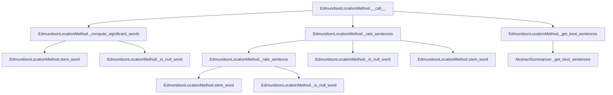

# `edmundson_location.py`

## `sumy.summarizers.edmundson_location.EdmundsonLocationMethod` · *class*

## Summary:
Implements the Edmundson location-based text summarization method that rates sentences based on their position within document structure and significance of heading words.

## Description:
The EdmundsonLocationMethod class implements a location-based summarization technique that assigns higher weights to sentences appearing in specific positions within documents (headings, first/last paragraphs, first/last sentences) while also considering the significance of words found in document headings. This approach leverages document structure to identify important content for summarization.

This class is designed to be instantiated with a stemmer and a set of null words, then used either directly via its `__call__` method or through the `rate_sentences` method to compute sentence ratings before selecting the best ones.

## State:
- `_null_words`: frozenset of words that should be filtered out during significant word computation. These are typically stop words or common terms that don't contribute to document importance.
- Inherits stemmer from AbstractSummarizer parent class for word stemming operations.

## Lifecycle:
- Creation: Instantiate with a stemmer and frozenset of null words. The stemmer must be callable.
- Usage: Call the instance with a document, desired sentence count, and weighting factors, or alternatively use the `rate_sentences` method to compute ratings separately.
- Destruction: No special cleanup required; relies on Python's garbage collection.

## Method Map:


## Raises:
- TypeError: Raised during initialization if stemmer is not callable (inherited from AbstractSummarizer).
- AttributeError: May be raised if document structure doesn't conform to expected interface (e.g., missing headings, paragraphs, or sentences attributes).

## Example:
```python
# Create summarizer with a stemmer and null words
from sumy.summarizers.edmundson_location import EdmundsonLocationMethod
from sumy.nlp.stemmers import Stemmer

stemmer = Stemmer('english')
null_words = frozenset(['the', 'and', 'or', 'but'])
summarizer = EdmundsonLocationMethod(stemmer, null_words)

# Rate sentences with custom weights
document = ...  # Some document object
ratings = summarizer.rate_sentences(document, w_h=2.0, w_p1=1.5, w_p2=1.0, w_s1=1.2, w_s2=1.1)

# Generate summary with 5 sentences
summary = summarizer(document, 5, w_h=2.0, w_p1=1.5, w_p2=1.0, w_s1=1.2, w_s2=1.1)
```

### `sumy.summarizers.edmundson_location.EdmundsonLocationMethod.__init__` · *method*

## Summary:
Initializes an EdmundsonLocationMethod instance with a stemmer and null words for text processing.

## Description:
Configures the Edmundson location-based summarization method by setting up the stemmer inherited from AbstractSummarizer and storing the collection of null words used to filter insignificant terms during sentence rating calculations. This initialization method properly chains to the parent class constructor to ensure the stemmer is correctly configured before storing the null words specific to this summarization approach.

## Args:
    stemmer (callable): A callable object that performs stemming operations for text normalization. Must be callable.
    null_words (frozenset): Immutable set of words that should be excluded from significant word computations during sentence rating.

## Returns:
    None: This method does not return any value.

## Raises:
    ValueError: Raised by the parent AbstractSummarizer.__init__ method when the provided stemmer is not callable.

## State Changes:
    Attributes READ: None
    Attributes WRITTEN: 
    - self._stemmer (inherited from AbstractSummarizer)
    - self._null_words (specific to EdmundsonLocationMethod)

## Constraints:
    Preconditions: 
    - The stemmer argument must be callable.
    - null_words must be a frozenset or similar immutable collection of strings.
    Postconditions: 
    - The instance is properly initialized with a valid stemmer and null words collection.

## Side Effects:
    None: This method does not perform any I/O operations or mutate external objects.

### `sumy.summarizers.edmundson_location.EdmundsonLocationMethod.__call__` · *method*

## Summary:
Computes location-based sentence ratings using heading words and positional weights, then selects the top sentences based on these ratings.

## Description:
This method implements the Edmundson location-based summarization technique by first identifying significant words from document headings, then computing sentence ratings that incorporate positional bonuses for sentences at the beginning or end of paragraphs and sentences. It serves as the main entry point for the location-based summarization algorithm within the Edmundson framework. Called during the summarization pipeline to generate a summary based on sentence importance derived from both content significance and positional factors.

## Args:
    document: The document object containing headings, paragraphs, and sentences to summarize.
    sentences_count: The number of top-rated sentences to select for the summary.
    w_h: Weight multiplier for the base sentence rating based on significant words.
    w_p1: Bonus weight for sentences in the first paragraph.
    w_p2: Bonus weight for sentences in the last paragraph.
    w_s1: Bonus weight for the first sentence in each paragraph.
    w_s2: Bonus weight for the last sentence in each paragraph.

## Returns:
    tuple: A tuple of the highest-rated sentences from the document, ordered by their original positions.

## Raises:
    None explicitly raised.

## State Changes:
    Attributes READ: self._compute_significant_words, self._rate_sentences, self._get_best_sentences
    Attributes WRITTEN: None

## Constraints:
    Preconditions:
        - The document must have headings, paragraphs, and sentences attributes.
        - All weight parameters (w_h, w_p1, w_p2, w_s1, w_s2) must be numeric values.
        - sentences_count must be a valid count for selecting sentences.
    Postconditions:
        - The returned sentences are the top-rated ones according to the location-weighted scoring.
        - The sentences are returned in their original order from the document.

## Side Effects:
    None.

### `sumy.summarizers.edmundson_location.EdmundsonLocationMethod._compute_significant_words` · *method*

## Summary:
Extracts and processes significant words from document headings for location-based summarization.

## Description:
Processes document headings to extract significant words by applying stemming and filtering operations. This method is part of the Edmundson location-based summarization approach, where heading words are considered potentially significant for determining sentence importance.

## Args:
    document (Document): The document object containing headings with words to process.

## Returns:
    frozenset: An immutable set of significant words derived from document headings after processing.

## Raises:
    AttributeError: If document does not have a headings attribute or if headings contain elements without a words attribute.

## State Changes:
    Attributes READ: self.stem_word, self._is_null_word
    Attributes WRITTEN: None

## Constraints:
    Preconditions: 
    - document must have a headings attribute
    - Each heading in document.headings must have a words attribute
    - self.stem_word and self._is_null_word methods must be implemented
    
    Postconditions:
    - Returns a frozenset containing processed words from headings
    - All returned words have been stemmed and filtered for null words

## Side Effects:
    None

### `sumy.summarizers.edmundson_location.EdmundsonLocationMethod._is_null_word` · *method*

## Summary:
Checks whether a given word is contained in the collection of null words used for text processing.

## Description:
This method determines if a specified word exists within the set of null words stored in the instance's `_null_words` attribute. It serves as a utility function for filtering out insignificant words during text summarization processes.

## Args:
    word (str): The word to check for membership in the null words collection.

## Returns:
    bool: True if the word is found in `self._null_words`, False otherwise.

## Raises:
    None explicitly raised.

## State Changes:
    Attributes READ: self._null_words
    Attributes WRITTEN: None

## Constraints:
    Preconditions: The instance must have a properly initialized `_null_words` attribute containing a collection (e.g., set, list) of null words.
    Postconditions: The method returns a boolean value indicating membership without modifying any object state.

## Side Effects:
    None.

### `sumy.summarizers.edmundson_location.EdmundsonLocationMethod._rate_sentences` · *method*

## Summary:
Rates sentences in a document by combining content significance with positional weighting based on paragraph and sentence positions.

## Description:
This method computes weighted ratings for all sentences in a document by first calculating their base significance scores using `_rate_sentence`, then applying positional bonuses based on sentence location within the document structure. It is called during the summarization process to rank sentences based on both content importance and structural positioning.

The method applies different weights to sentences based on:
- Paragraph position: first paragraph (w_p1 bonus) or last paragraph (w_p2 bonus)
- Sentence position within paragraph: first sentence (w_s1 bonus) or last sentence (w_s2 bonus)
- Content significance: multiplied by w_h factor

This approach follows Edmundson's location-based summarization technique where sentences in strategic positions (beginning/end of paragraphs/paragraphs) are considered more important.

## Args:
    document: Document object containing paragraphs and sentences
    significant_words: Set of significant words extracted from document headings
    w_h: Weight multiplier for base significance score (default: 1.0)
    w_p1: Bonus weight for first paragraph sentences (default: 1.0)
    w_p2: Bonus weight for last paragraph sentences (default: 1.0)
    w_s1: Bonus weight for first sentence in paragraph (default: 1.0)
    w_s2: Bonus weight for last sentence in paragraph (default: 1.0)

## Returns:
    dict: Mapping from sentence objects to their computed float ratings

## Raises:
    None explicitly raised

## State Changes:
    Attributes READ: None
    Attributes WRITTEN: None

## Constraints:
    Preconditions:
    - document must have valid paragraphs attribute containing sentences
    - significant_words must be a set-like object
    - All weight parameters should be numeric values
    - Sentence objects must have valid words attribute
    
    Postconditions:
    - Returns a dictionary mapping each sentence to a float rating
    - Ratings are positive or negative floats based on positional and content weighting

## Side Effects:
    None

### `sumy.summarizers.edmundson_location.EdmundsonLocationMethod._rate_sentence` · *method*

## Summary:
Rates a sentence based on the number of significant words it contains after stemming.

## Description:
This method evaluates how many words in a given sentence match the set of significant words, after applying the stemmer to each word. It serves as a core scoring mechanism for the Edmundson location-based summarization approach, where sentences containing more significant words are considered more important. This method is typically invoked during the sentence scoring phase of the summarization process, specifically within the `_rate_sentences` method of the `EdmundsonLocationMethod` class.

## Args:
    sentence: A sentence object containing a `words` attribute with tokenized words.
    significant_words: A collection (set or list) of significant words to compare against.

## Returns:
    int: The count of significant words found in the sentence after stemming.

## Raises:
    None explicitly raised.

## State Changes:
    Attributes READ: self.stem_word
    Attributes WRITTEN: None

## Constraints:
    Preconditions: 
    - The `sentence` argument must have a `words` attribute that is iterable.
    - The `significant_words` argument must support the `in` operator for membership testing.
    - The `self.stem_word` method must be callable and properly configured.
    Postconditions: 
    - The returned integer represents the exact count of matching stemmed words.

## Side Effects:
    None.

### `sumy.summarizers.edmundson_location.EdmundsonLocationMethod.rate_sentences` · *method*

## Summary:
Rates sentences in a document based on content significance and positional weighting using heading-derived significant words.

## Description:
Computes weighted ratings for all sentences in a document by first extracting significant words from document headings, then applying positional bonuses based on sentence location within the document structure. This method implements Edmundson's location-based summarization technique where sentences in strategic positions (beginning/end of paragraphs/paragraphs) are considered more important.

The method is called by the `__call__` method during the summarization process as part of the Edmundson location-based approach, serving as the core sentence rating mechanism that combines content importance with structural positioning.

## Args:
    document: The document object containing paragraphs and sentences to rate
    w_h (float): Weight multiplier for base significance score (default: 1.0, must be >= 0)
    w_p1 (float): Bonus weight for first paragraph sentences (default: 1.0, must be >= 0)
    w_p2 (float): Bonus weight for last paragraph sentences (default: 1.0, must be >= 0)
    w_s1 (float): Bonus weight for first sentence in paragraph (default: 1.0, must be >= 0)
    w_s2 (float): Bonus weight for last sentence in paragraph (default: 1.0, must be >= 0)

## Returns:
    dict: Mapping from sentence objects to their computed float ratings

## Raises:
    None explicitly raised

## State Changes:
    Attributes READ: self.stem_word, self._is_null_word, self._null_words
    Attributes WRITTEN: None

## Constraints:
    Preconditions:
    - document must have valid paragraphs attribute containing sentences
    - All weight parameters should be numeric values (typically non-negative)
    - Sentence objects must have valid words attribute
    - Document must have headings attribute with words
    
    Postconditions:
    - Returns a dictionary mapping each sentence to a float rating
    - Ratings are positive or negative floats based on positional and content weighting

## Side Effects:
    None

