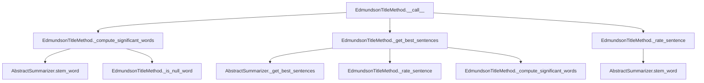

# `edmundson_title.py`

## `sumy.summarizers.edmundson_title.EdmundsonTitleMethod` · *class*

## Summary:
Implements the Edmundson title-based text summarization method that ranks sentences based on significant words extracted from document headings.

## Description:
The EdmundsonTitleMethod is a concrete implementation of the AbstractSummarizer interface that applies the Edmundson title method for text summarization. This approach identifies important content by extracting significant words from document headings and scoring sentences based on their overlap with these key terms. The method is particularly effective for documents where structural elements like headings contain important information that should be preserved in summaries.

## State:
- `_null_words`: Collection of words to filter out during significant word extraction. Type: iterable containing strings. Valid values: any collection of words that should be excluded from consideration. Invariant: Must be initialized during construction and remain constant throughout the object's lifetime.
- `_stemmer`: Inherited from AbstractSummarizer parent class. Type: callable. Valid values: any callable that accepts a string and returns a stemmed version. Invariant: Must be a callable that performs word stemming operations.

## Lifecycle:
- Creation: Instantiate with a stemmer callable and a collection of null words. The stemmer must be callable, and null_words should be an iterable of strings to exclude from significant word identification.
- Usage: Call the instance with a document object and desired sentence count to generate a summary. The method processes document headings to extract significant words, rates sentences based on this information, and returns the highest-ranked sentences in their original order.
- Destruction: No special cleanup required; relies on Python's garbage collection.

## Method Map:


## Raises:
- ValueError: Raised by parent class AbstractSummarizer during stemmer validation if the provided stemmer is not callable.
- AssertionError: May be raised by AbstractSummarizer._get_best_sentences if invalid arguments are passed to the rating function.

## Example:
```python
from sumy.summarizers.edmundson_title import EdmundsonTitleMethod
from sumy.nlp.stemmers import null_stemmer

# Create summarizer with null stemmer and common stop words
null_words = {"the", "and", "or", "but", "in", "on", "at", "to", "for", "of"}
summarizer = EdmundsonTitleMethod(null_stemmer, null_words)

# Assuming 'document' is a valid document object with sentences and headings
# Generate a summary with top 3 sentences
summary = summarizer(document, 3)

# Alternatively, rate all sentences to see their scores
sentence_scores = summarizer.rate_sentences(document)
```

### `sumy.summarizers.edmundson_title.EdmundsonTitleMethod.__init__` · *method*

## Summary:
Initializes an EdmundsonTitleMethod instance with a stemmer and null words collection.

## Description:
Configures the Edmundson title-based summarization method by setting up the required stemmer for text processing and defining a collection of words to exclude during significant word extraction from document headings. This initialization establishes the core configuration needed for the summarization algorithm to identify important content based on heading keywords.

## Args:
    stemmer (callable): A callable object that performs word stemming operations. Must accept a string and return a stemmed version.
    null_words (iterable): A collection of words to filter out during significant word extraction. Should contain strings representing words that should be excluded from consideration.

## Returns:
    None: This method initializes the object's state and does not return a value.

## Raises:
    ValueError: Raised by the parent AbstractSummarizer class if the provided stemmer is not callable.

## State Changes:
    Attributes READ: None
    Attributes WRITTEN: 
    - self._null_words: Set to the provided null_words parameter
    - self._stemmer: Set via parent class initialization with the provided stemmer parameter

## Constraints:
    Preconditions:
    - The stemmer argument must be callable
    - The null_words argument must be iterable containing strings
    - Both arguments must be provided during initialization
    
    Postconditions:
    - The object is properly configured with a valid stemmer
    - The null_words collection is stored for use in significant word filtering
    - The parent class initialization is completed successfully

## Side Effects:
    None: This method performs no I/O operations or external service calls. It only configures internal object state.

### `sumy.summarizers.edmundson_title.EdmundsonTitleMethod.__call__` · *method*

## Summary:
Selects the most important sentences from a document based on heading word significance using the Edmundson title method.

## Description:
This method implements the core sentence selection logic for the Edmundson title-based summarization approach. It extracts significant words from document headings, rates sentences based on their overlap with these significant words, and returns the highest-ranked sentences in their original order. This method is typically invoked during the summarization pipeline when the EdmundsonTitleMethod is used to generate a summary.

## Args:
    document: The document object containing sentences and headings to process.
    sentences_count: The number of top sentences to select for the summary. Can be an integer, percentage string (e.g., "30%"), or a callable that filters the ranked sentences.

## Returns:
    tuple: A tuple of selected sentences ordered by their original position in the document.

## Raises:
    AssertionError: When rating is a dictionary and additional args/kwargs are provided.
    ValueError: When count value is unsupported.

## State Changes:
    Attributes READ: self._compute_significant_words, self._get_best_sentences, self._rate_sentence, self._null_words, self.stem_word
    Attributes WRITTEN: None

## Constraints:
    Preconditions:
    - The document must have a sentences attribute containing iterable sentences.
    - The document must have a headings attribute containing iterable heading objects with words.
    - The sentences_count must be a valid integer, percentage string, or callable.
    - The _compute_significant_words, _get_best_sentences, and _rate_sentence methods must be properly implemented.
    - The _null_words attribute must be initialized with a collection of words to filter out.
    - The stemmer must be properly initialized in the parent class.
    
    Postconditions:
    - Returns exactly sentences_count sentences (or fewer if document has insufficient sentences).
    - Sentences are returned in their original order from the document.

## Side Effects:
    None.

### `sumy.summarizers.edmundson_title.EdmundsonTitleMethod._compute_significant_words` · *method*

## Summary:
Processes document headings to extract a frozenset of significant words through stemming and filtering.

## Description:
This method extracts words from document headings, applies word stemming, filters out null words, and returns the result as an immutable frozenset. It is used internally by the EdmundsonTitleMethod to identify important terminology from document structure for summarization purposes.

## Args:
    document: A document object expected to have a headings attribute containing iterable heading objects with words attribute

## Returns:
    frozenset: An immutable set containing significant words extracted from document headings after processing

## Raises:
    AttributeError: If document does not have headings attribute or if headings lack words attribute
    TypeError: If document.headings contains non-iterable elements or if processing functions fail

## State Changes:
    Attributes READ: None
    Attributes WRITTEN: None

## Constraints:
    Preconditions:
    - Document must have a headings attribute that is iterable
    - Each heading in document.headings must have a words attribute
    - self.stem_word() method must be callable
    - self._is_null_word() method must be callable
    Postconditions: Returns an immutable frozenset of processed words

## Side Effects:
    Calls self.stem_word() method for word stemming operations
    Calls self._is_null_word() method for filtering operations

### `sumy.summarizers.edmundson_title.EdmundsonTitleMethod._is_null_word` · *method*

## Summary:
Checks whether a given word is contained in the collection of null words used for text summarization.

## Description:
This method determines if a specified word exists within the set of null words that are typically excluded from summarization processes. It serves as a utility function for filtering out common stop words or insignificant terms during text processing.

## Args:
    word (str): The word to check against the null words collection.

## Returns:
    bool: True if the word is found in self._null_words, False otherwise.

## Raises:
    None explicitly raised.

## State Changes:
    Attributes READ: self._null_words
    Attributes WRITTEN: None

## Constraints:
    Preconditions: The self._null_words attribute must be initialized and contain a collection of words (e.g., set, list, or other iterable).
    Postconditions: The method returns a boolean value indicating membership in the null words collection without modifying any object state.

## Side Effects:
    None.

### `sumy.summarizers.edmundson_title.EdmundsonTitleMethod._rate_sentence` · *method*

## Summary:
Rates a sentence based on the number of significant words it contains after stemming.

## Description:
This method evaluates how much a sentence contributes to the overall significance of a document by counting the stemmed words in the sentence that appear in a predefined set of significant words. It's used internally by the EdmundsonTitleMethod summarizer to score sentences for inclusion in the final summary.

## Args:
    sentence: A sentence object containing a 'words' attribute with word tokens.
    significant_words: A collection (set or list) of significant words to check against.

## Returns:
    int: The count of significant words found in the sentence after stemming.

## Raises:
    None explicitly raised.

## State Changes:
    Attributes READ: self.stem_word (method used for word stemming)
    Attributes WRITTEN: None

## Constraints:
    Preconditions: 
    - The sentence object must have a 'words' attribute containing iterable word tokens.
    - The significant_words collection must support the 'in' operator for membership testing.
    - The self.stem_word method must be callable and accept individual word strings.
    Postconditions: 
    - Returns an integer count of matching significant words.
    - The method does not modify any instance state.

## Side Effects:
    None.

### `sumy.summarizers.edmundson_title.EdmundsonTitleMethod.rate_sentences` · *method*

## Summary:
Rates all sentences in a document by counting significant words from headings, returning a mapping of sentences to their scores.

## Description:
Processes each sentence in the document to compute a significance score based on the number of stemmed words that match significant words extracted from document headings. This method is used internally by the EdmundsonTitleMethod summarizer to score sentences for inclusion in the final summary. It is typically called during the sentence scoring phase of the summarization pipeline, specifically by the `_get_best_sentences` method when using the title-based approach.

The method first computes significant words from document headings using the `_compute_significant_words` helper method, then rates each sentence by counting how many of its stemmed words match these significant words. This scoring approach leverages the structural information in document headings to identify important content.

## Args:
    document: A document object containing sentences and headings with words to process.

## Returns:
    dict[Sentence, int]: A dictionary mapping each sentence to its computed significance score (integer count of matching significant words).

## Raises:
    None explicitly raised.

## State Changes:
    Attributes READ: self._null_words, self.stem_word
    Attributes WRITTEN: None

## Constraints:
    Preconditions:
    - The document must have sentences and headings attributes
    - Each heading in document.headings must have a words attribute
    - The document must have a sentences attribute containing iterable sentence objects
    - Each sentence in document.sentences must have a words attribute
    Postconditions:
    - Returns a dictionary with all sentences in the document as keys
    - Each value is a non-negative integer representing the count of significant words in that sentence

## Side Effects:
    Calls self.stem_word() method for word stemming operations
    Calls self._is_null_word() method for filtering operations

