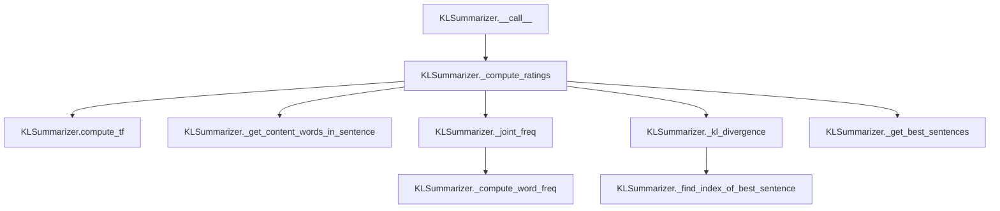

# `kl.py`

## `sumy.summarizers.kl.KLSummarizer` · *class*

## Summary:
KLSummarizer is a text summarization algorithm that uses Kullback-Leibler divergence to rank sentences and select the most informative ones for a summary.

## Description:
The KLSummarizer implements a summarization approach based on information theory, specifically utilizing Kullback-Leibler (KL) divergence to measure the difference between sentence distributions and the overall document distribution. It iteratively selects sentences that maximize the diversity of information content while maintaining relevance to the document's overall topic distribution. This class extends AbstractSummarizer and provides a concrete implementation of the text summarization process.

## State:
- stop_words: frozenset - Set of stop words to filter out from sentences during content word extraction. Defaults to an empty frozenset.
- Inherited from AbstractSummarizer: _stemmer attribute for word stemming operations

## Lifecycle:
- Creation: Instantiate with optional stemmer parameter (inherited from AbstractSummarizer). Default stemmer is null_stemmer.
- Usage: Call the instance with a document object and desired number of sentences to summarize. The document must have a sentences property containing Sentence objects.
- Destruction: No explicit cleanup required; relies on Python's garbage collection.

## Method Map:


## Raises:
- ValueError: May be raised during initialization if the provided stemmer is not callable (inherited from AbstractSummarizer)
- AttributeError: Could occur if document object lacks required sentences property or if sentences lack words property

## Example:
```python
from sumy.summarizers.kl import KLSummarizer
from sumy.parsers.plaintext import PlaintextParser
from sumy.nlp.tokenizers import Tokenizer

# Create parser and tokenizer
parser = PlaintextParser.from_string("Your long text here...", Tokenizer("english"))
summarizer = KLSummarizer()  # Uses default stemmer

# Generate summary with 3 sentences
summary = summarizer(parser.document, 3)
for sentence in summary:
    print(sentence)
```

### `sumy.summarizers.kl.KLSummarizer.__call__` · *method*

## Summary:
Computes sentence ratings using KL divergence and selects the highest-rated sentences from a document.

## Description:
This method implements the core logic of the KL divergence-based summarization algorithm. It first computes term frequencies for the document's content words, then iteratively selects sentences that minimize the KL divergence between the joint probability distribution of the summary and document. The selected sentences are returned in their original order. This method serves as the main entry point for the summarization process in the KLSummarizer class.

## Args:
    document (Document): The input document containing sentences to be summarized.
    sentences_count (int): The number of top-rated sentences to select from the document.

## Returns:
    tuple: A tuple of selected sentences ordered by their original position in the input document.

## Raises:
    None explicitly raised.

## State Changes:
    Attributes READ: None
    Attributes WRITTEN: None

## Constraints:
    Preconditions:
        - Document must contain a valid collection of sentences.
        - Sentences count must be a positive integer.
    Postconditions:
        - The returned tuple contains exactly 'sentences_count' sentences.
        - The sentences in the returned tuple maintain their original order from the document.

## Side Effects:
    None

### `sumy.summarizers.kl.KLSummarizer._get_all_words_in_doc` · *method*

## Summary:
Extracts all words from a collection of sentences into a flat list.

## Description:
This static method takes a collection of sentence objects and flattens their word collections into a single list containing all words from all sentences. It serves as a utility for gathering word data during the summarization process.

Known callers:
- `_compute_ratings` in `KLSummarizer`: Used to get all words in the current summary during KL divergence computation
- `_get_all_content_words_in_doc` in `KLSummarizer`: Called to get all words before filtering out stop words and normalizing

This method is separated from inline usage to provide a clean abstraction for word extraction, making the code more readable and reusable across different parts of the summarization algorithm.

## Args:
    sentences (Iterable[Sentence]): An iterable of sentence objects, each having a `words` attribute containing a list of words.

## Returns:
    list[Word]: A flat list containing all Word objects from all sentences in the input collection.

## Raises:
    None explicitly raised.

## State Changes:
    Attributes READ: None
    Attributes WRITTEN: None

## Constraints:
    Preconditions:
    - Each item in `sentences` must have a `words` attribute that is iterable
    - `sentences` itself must be iterable
    
    Postconditions:
    - Returns a list with length equal to the sum of lengths of all `s.words` in `sentences`
    - Order of words in returned list preserves order within sentences and order of sentences

## Side Effects:
    None

### `sumy.summarizers.kl.KLSummarizer._get_content_words_in_sentence` · *method*

## Summary:
Extracts and normalizes content words from a sentence by filtering out stop words.

## Description:
This method processes a sentence's words by first normalizing them (likely converting to lowercase) and then filtering out stop words to isolate the most meaningful content words. It serves as a key preprocessing step in the KL summarization algorithm, ensuring that only significant words are used for computing word frequencies and KL divergence scores. The method is called during the sentence rating computation phase when processing each sentence in the document.

## Args:
    sentence: A sentence object containing a `words` attribute with the sentence's word tokens.

## Returns:
    list[str]: A list of normalized content words (words that are not stop words) from the input sentence.

## Raises:
    None explicitly raised.

## State Changes:
    Attributes READ: self.stop_words, self.normalize_word
    Attributes WRITTEN: None

## Constraints:
    Preconditions: The input sentence must have a `words` attribute containing a list of word tokens.
    Postconditions: The returned list contains only normalized words that are not present in self.stop_words.

## Side Effects:
    None.

### `sumy.summarizers.kl.KLSummarizer._normalize_words` · *method*

## Summary:
Normalizes a list of words by applying the instance's normalize_word method to each word in the input list.

## Description:
This method takes a list of words and applies the instance's normalize_word method to each individual word, returning a new list containing the normalized versions. It serves as a utility for batch-normalizing words within the KL summarization algorithm, ensuring consistent text representation across different stages of the summarization process. The method is called during content word extraction and filtering operations to prepare words for frequency calculations and divergence computations.

Known callers:
- `_get_content_words_in_sentence()` in the same class: Called to normalize words before stop-word filtering
- `_get_all_content_words_in_doc()` in the same class: Called to normalize content words after stop-word removal

## Args:
    words (list): A list of words to be normalized.

## Returns:
    list[str]: A new list containing the normalized versions of each word from the input list.

## Raises:
    None explicitly raised by this method.

## State Changes:
    - Attributes READ: None
    - Attributes WRITTEN: None

## Constraints:
    - Preconditions: The input 'words' parameter must be iterable and contain elements that can be processed by self.normalize_word
    - Postconditions: The returned list contains the same number of elements as the input list, with each element being the result of self.normalize_word applied to the corresponding input element

## Side Effects:
    - Calls self.normalize_word for each word in the input list
    - No external I/O or mutations to objects outside the instance

### `sumy.summarizers.kl.KLSummarizer._filter_out_stop_words` · *method*

## Summary:
Filters out stop words from a list of words by excluding any word present in the instance's stop_words collection.

## Description:
This method takes a list of words and returns a new list containing only those words that are not in the instance's stop_words set. It is used to preprocess text by removing common words that do not contribute significantly to the meaning of the document. The method is called during content word extraction in the summarization process to ensure that only meaningful words are considered for analysis.

## Args:
    words (list[str]): A list of words to filter.

## Returns:
    list[str]: A new list containing only the words from the input list that are not present in self.stop_words.

## Raises:
    None explicitly raised.

## State Changes:
    Attributes READ: self.stop_words
    Attributes WRITTEN: None

## Constraints:
    Preconditions: The input `words` parameter must be a list of strings.
    Postconditions: The returned list contains only words that are not in self.stop_words.

## Side Effects:
    None.

### `sumy.summarizers.kl.KLSummarizer._compute_word_freq` · *method*

## Summary:
Computes the frequency count of each word in a list of words.

## Description:
This method takes a list of words and returns a dictionary mapping each unique word to its frequency count. It is designed as a helper method to process word lists for summarization algorithms that require term frequency calculations.

## Args:
    list_of_words (list[str]): A list of words for which to compute frequencies.

## Returns:
    dict[str, int]: A dictionary where keys are unique words from the input list and values are their respective frequency counts.

## Raises:
    None explicitly raised.

## State Changes:
    Attributes READ: None
    Attributes WRITTEN: None

## Constraints:
    Preconditions: The input list should contain hashable elements (strings).
    Postconditions: The returned dictionary will contain exactly one entry for each unique word in the input list.

## Side Effects:
    None

### `sumy.summarizers.kl.KLSummarizer._get_all_content_words_in_doc` · *method*

## Summary:
Extracts and normalizes all content words from a document's sentences by filtering out stop words and applying text normalization.

## Description:
This method processes a collection of sentences to extract all words, remove stop words, and normalize the remaining words for consistent text analysis. It serves as a foundational step in the KL divergence-based summarization algorithm by preparing the document's content words for frequency calculations and similarity computations. The method is called during the TF (term frequency) computation phase to gather the set of significant words in the document.

Known callers:
- `compute_tf()` in the same class: Called to obtain content words for term frequency calculation
- `_compute_ratings()` in the same class: Called indirectly through `compute_tf()` to prepare document words for KL divergence computations

## Args:
    sentences (Iterable[Sentence]): An iterable of Sentence objects containing the document's sentences.

## Returns:
    list[str]: A list of normalized content words (excluding stop words) extracted from all sentences in the document.

## Raises:
    None explicitly raised.

## State Changes:
    Attributes READ: self.stop_words
    Attributes WRITTEN: None

## Constraints:
    Preconditions: The input `sentences` parameter must be iterable and contain Sentence objects with valid `words` attributes.
    Postconditions: The returned list contains only normalized words that are not in self.stop_words.

## Side Effects:
    None.

### `sumy.summarizers.kl.KLSummarizer.compute_tf` · *method*

## Summary:
Computes term frequencies for content words in a document by normalizing word frequencies against the total count of content words.

## Description:
This method calculates the term frequency (TF) for each content word in the document represented by the input sentences. It first extracts all content words using `_get_all_content_words_in_doc()`, computes their frequency distribution with `_compute_word_freq()`, and then normalizes these frequencies by dividing each word's count by the total number of content words. This normalized frequency representation is essential for subsequent KL divergence calculations in the summarization process.

The method is part of the KL divergence-based summarization approach, where term frequencies serve as probability distributions for computing divergence between sentences and the document.

Known callers:
- `compute_kl_divergence()` in the same class: Called to obtain term frequencies for computing KL divergence between sentences and document
- `_compute_ratings()` in the same class: Called indirectly through `compute_kl_divergence()` to prepare term frequencies for sentence scoring

## Args:
    sentences (Iterable[Sentence]): An iterable of Sentence objects containing the document's sentences to process.

## Returns:
    dict[str, float]: A dictionary mapping each content word to its normalized term frequency (frequency divided by total content words count). Values are between 0 and 1 inclusive.

## Raises:
    None explicitly raised.

## State Changes:
    Attributes READ: None
    Attributes WRITTEN: None

## Constraints:
    Preconditions: The input `sentences` parameter must be iterable and contain Sentence objects with valid `words` attributes.
    Postconditions: The returned dictionary contains exactly one entry for each unique content word in the document, with values between 0 and 1 inclusive.

## Side Effects:
    None.

### `sumy.summarizers.kl.KLSummarizer._joint_freq` · *method*

## Summary:
Computes the joint probability distribution of words from two word lists by combining their individual frequency distributions.

## Description:
This method calculates the joint frequency distribution of words appearing in two separate word lists. It combines the frequency counts from both lists and normalizes them by the total length of both lists to produce probability distributions. This is used in KL-divergence-based summarization to compare word distributions between candidate sentences and the reference document. The method is called during the computation of KL divergence ratings for sentence selection, specifically when evaluating how well a candidate sentence represents the overall document distribution when combined with already selected sentences.

## Args:
    word_list_1 (list[str]): First list of words to include in the joint distribution calculation.
    word_list_2 (list[str]): Second list of words to include in the joint distribution calculation.

## Returns:
    dict[str, float]: A dictionary mapping each unique word from both input lists to its normalized joint probability (frequency/total_length).

## Raises:
    None explicitly raised.

## State Changes:
    Attributes READ: None
    Attributes WRITTEN: None

## Constraints:
    Preconditions: Both input arguments must be iterable collections of hashable elements (strings).
    Postconditions: The returned dictionary will contain exactly one entry for each unique word from both input lists, with values being floating-point probabilities between 0 and 1.

## Side Effects:
    None

### `sumy.summarizers.kl.KLSummarizer._kl_divergence` · *method*

## Summary:
Computes the Kullback-Leibler divergence between summary and document word frequency distributions.

## Description:
This helper function calculates the KL divergence, a measure from information theory that quantifies how one probability distribution diverges from another. In the KLSummarizer, it's used to evaluate how well a candidate summary represents the original document's word frequency characteristics. The function computes: Σ(doc_freq[w] * log(doc_freq[w] / summary_freq[w])) for all words w that appear in both distributions.

## Args:
    summary_freq (dict): Dictionary mapping words to their frequencies in the candidate summary.
    doc_freq (dict): Dictionary mapping words to their frequencies in the original document.

## Returns:
    float: The KL divergence value. Returns 0.0 when no common words exist or when frequency values are zero/missing.

## Raises:
    None explicitly raised.

## State Changes:
    None.

## Constraints:
    Preconditions:
        - Both summary_freq and doc_freq must be dictionaries mapping words to numerical frequencies.
        - All frequency values should be non-negative.
    Postconditions:
        - Returns a non-negative float representing the divergence measure.
        - When a word exists in both distributions with non-zero frequencies, its contribution is calculated.
        - When a word exists in one distribution but not the other, or has zero frequency, that term contributes 0 to the sum.

## Side Effects:
    None.

### `sumy.summarizers.kl.KLSummarizer._find_index_of_best_sentence` · *method*

## Summary:
Finds the index of the sentence with the minimum KL divergence score from a list of scores.

## Description:
This method identifies the index of the sentence that contributes the least to the overall divergence when added to a summary. It is used in the KL divergence-based summarization algorithm to select the next best sentence to add to the summary. This method is called internally by `_compute_ratings` during the greedy sentence selection process.

## Args:
    kls (list[float]): A list of KL divergence scores for each candidate sentence.

## Returns:
    int: The index of the sentence with the minimum KL divergence score.

## Raises:
    ValueError: If the input list is empty.

## State Changes:
    Attributes READ: None
    Attributes WRITTEN: None

## Constraints:
    Preconditions: The input list must not be empty.
    Postconditions: Returns an integer index within the bounds of the input list.

## Side Effects:
    None

### `sumy.summarizers.kl.KLSummarizer._compute_ratings` · *method*

## Summary:
Computes KL-divergence based sentence ratings for a list of sentences to determine optimal summarization order using a greedy selection algorithm.

## Description:
This method implements a greedy sentence selection algorithm that iteratively chooses sentences based on minimizing KL divergence between joint word frequency distributions. It's used internally by the KLSummarizer to rank sentences for inclusion in a summary. The algorithm computes term frequencies for the entire document, then repeatedly selects the sentence that contributes least to the overall divergence when added to the growing summary, assigning each selected sentence a decreasing rating value.

The method follows these steps:
1. Computes term frequency distribution for all content words in the document
2. Iteratively selects sentences by finding the one that minimizes KL divergence when added to the summary
3. Assigns each selected sentence a negative integer rating that decreases with selection order

Known callers:
- KLSummarizer.__call__: Called during the main summarization process to compute sentence ratings before selecting the best sentences

## Args:
    sentences (Iterable[Sentence]): Collection of sentence objects to rate for summarization

## Returns:
    Dict[Sentence, int]: Mapping from each sentence to its computed rating (negative integer, decreasing with selection order)

## Raises:
    None: This method does not explicitly raise exceptions

## State Changes:
    Attributes READ: None
    Attributes WRITTEN: None

## Constraints:
    Preconditions:
        - Sentences must be iterable and contain valid Sentence objects
        - Each sentence must have a words attribute that can be processed
    Postconditions:
        - Returns a dictionary mapping each input sentence to a unique negative integer rating
        - The rating values decrease monotonically with the order of sentence selection

## Side Effects:
    None: This method performs no I/O operations or external service calls

