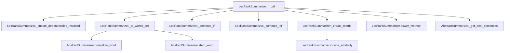

# `lex_rank.py`

## `sumy.summarizers.lex_rank.LexRankSummarizer` · *class*

## Summary:
LexRankSummarizer is a text summarization algorithm that ranks sentences based on their similarity to other sentences in a document using a graph-based approach with eigenvector centrality.

## Description:
The LexRankSummarizer implements the LexRank algorithm for automatic text summarization. It constructs a similarity matrix between sentences, treats this as a graph, and computes sentence importance using a power iteration method (similar to PageRank). The algorithm identifies the most representative sentences by measuring their connectivity within the sentence similarity graph. This summarizer is particularly effective for extracting key information from documents while preserving semantic coherence.

## State:
- threshold (float): Minimum similarity threshold for considering sentences connected in the graph. Class attribute, default is 0.1.
- epsilon (float): Convergence threshold for the power method iteration. Class attribute, default is 0.1.
- _stop_words (frozenset): Set of words to exclude from sentence processing. Private attribute, initially empty.

## Lifecycle:
- Creation: Instantiate with optional stemmer parameter (inherited from AbstractSummarizer). The summarizer uses default settings for threshold and epsilon.
- Usage: Call the instance with a document object and desired sentence count to generate a summary. The document must have a sentences property containing sentence objects with a words property.
- Destruction: No explicit cleanup required; relies on Python's garbage collection.

## Method Map:


## Raises:
- ValueError: When NumPy dependency is not installed, raised by _ensure_dependencies_installed method.
- ValueError: When the document contains no sentences, returned as empty tuple.

## Example:
```python
from sumy.summarizers.lex_rank import LexRankSummarizer
from sumy.parsers.plaintext import PlaintextParser
from sumy.nlp.tokenizers import Tokenizer

# Create summarizer instance
summarizer = LexRankSummarizer()

# Configure stop words if needed
summarizer.stop_words = ['the', 'and', 'or']

# Parse document
parser = PlaintextParser.from_string("Your document text here...", Tokenizer("english"))

# Generate summary with 3 sentences
summary = summarizer(parser.document, 3)

# Print results
for sentence in summary:
    print(sentence)
```

### `sumy.summarizers.lex_rank.LexRankSummarizer.stop_words` · *method*

## Summary:
Configures the stop words for the LexRank summarizer by normalizing and storing them as a frozen set.

## Description:
This method serves as a setter property for the `_stop_words` attribute of the LexRankSummarizer class. It takes an iterable of words, normalizes each word using the class's `normalize_word` method, and stores the result as an immutable frozenset in the `_stop_words` attribute. This frozen set is subsequently used during text processing to filter out common words that should not contribute to sentence scoring in the summarization process.

## Args:
    words (iterable): An iterable of words (strings) to be treated as stop words.

## Returns:
    None: This method does not return any value.

## Raises:
    AttributeError: If `self.normalize_word` is not defined or accessible on the instance.

## State Changes:
    Attributes READ: None
    Attributes WRITTEN: `self._stop_words`

## Constraints:
    Preconditions: The instance must have a `normalize_word` method available for mapping.
    Postconditions: The `_stop_words` attribute will be updated to a frozenset containing normalized versions of the input words.

## Side Effects:
    None: This method performs no I/O operations or external service calls. It only modifies the internal state of the object.

### `sumy.summarizers.lex_rank.LexRankSummarizer.__call__` · *method*

## Summary:
Computes sentence importance scores using LexRank algorithm and returns the most relevant sentences from a document.

## Description:
This method implements the LexRank summarization algorithm by computing TF-IDF scores, constructing a similarity matrix between sentences, applying a power method to calculate sentence importance scores, and selecting the top-ranked sentences. It serves as the main entry point for the LexRank summarizer and orchestrates the complete summarization pipeline. This method is separated from the core computation logic to provide a clean interface for users while encapsulating the complex multi-step process of LexRank summarization.

## Args:
    document (Document): The input document containing sentences to summarize.
    sentences_count (int): The number of top-ranked sentences to return.

## Returns:
    tuple: A tuple of sentences ordered by their relevance score in descending order, limited to the specified count.

## Raises:
    ValueError: If NumPy dependency is not installed.

## State Changes:
    Attributes READ: self.threshold, self.epsilon, self._stop_words
    Attributes WRITTEN: None

## Constraints:
    Preconditions:
        - Document must contain sentences.
        - Sentences count must be a positive integer.
    Postconditions:
        - Returns a tuple of sentences ordered by their original position in the document.
        - The number of returned sentences equals the requested count or fewer if document has insufficient sentences.

## Side Effects:
    None

### `sumy.summarizers.lex_rank.LexRankSummarizer._ensure_dependencies_installed` · *method*

## Summary:
Validates that the NumPy dependency is properly installed for LexRank summarization.

## Description:
This function performs a runtime check to ensure that the NumPy library is available and importable. It is called during the initialization or execution phase of the LexRank summarizer to prevent runtime failures due to missing numerical computation dependencies. If NumPy is not available, a descriptive ValueError is raised with installation instructions.

## Args:
    None

## Returns:
    None

## Raises:
    ValueError: Raised with message "LexRank summarizer requires NumPy. Please, install it by command 'pip install numpy'." when NumPy cannot be imported or is None.

## State Changes:
    Attributes READ: None
    Attributes WRITTEN: None

## Constraints:
    Preconditions: The numpy module must be importable at the module level where this function is defined.
    Postconditions: Execution continues normally if NumPy is available, or raises ValueError if not.

## Side Effects:
    None

### `sumy.summarizers.lex_rank.LexRankSummarizer._to_words_set` · *method*

## Summary:
Converts a sentence's word tokens into a filtered list of stemmed words, excluding stop words.

## Description:
Processes a sentence's word tokens through normalization, stemming, and stop word filtering to produce a clean list of significant words. This method is called during the LexRank summarization pipeline's preprocessing phase to transform raw sentence content into a standardized word representation suitable for similarity calculations and scoring. It is invoked by the main `__call__` method when preparing sentences for TF-IDF computation and matrix construction.

The method transforms each word in the sentence by:
1. Normalizing the word using `self.normalize_word()` to ensure consistent text representation
2. Stemming the normalized word using `self.stem_word()` to reduce words to their root forms
3. Filtering out words that appear in `self._stop_words` to exclude common but insignificant terms

This preprocessing step is essential for the LexRank algorithm's effectiveness, as it standardizes the text representation and removes noise that could interfere with similarity measurements between sentences.

## Args:
    sentence (Sentence): The input sentence object containing a list of word tokens to process.

## Returns:
    list[str]: A list of stemmed words that are not in the stop words collection, ready for further text analysis in the LexRank algorithm.

## Raises:
    None explicitly raised.

## State Changes:
    - Attributes READ: self._stop_words, self.normalize_word, self.stem_word
    - Attributes WRITTEN: None

## Constraints:
    - Preconditions: The sentence object must have a .words attribute containing iterable word tokens
    - Postconditions: The returned list contains only stemmed words that pass stop word filtering
    - The method assumes that self.normalize_word and self.stem_word are properly implemented
    - The method relies on self._stop_words being properly initialized as a frozenset

## Side Effects:
    - Calls self.normalize_word() for each word in the sentence
    - Calls self.stem_word() for each normalized word
    - Reads from self._stop_words frozenset for filtering
    - No external I/O or mutations to objects outside the summarizer instance

### `sumy.summarizers.lex_rank.LexRankSummarizer._compute_tf` · *method*

## Summary:
Computes normalized term frequency metrics for sentences by dividing each term's frequency by the maximum frequency in that sentence.

## Description:
This private method calculates term frequency (TF) metrics for a collection of sentences, normalizing each term's frequency against the maximum frequency observed within the same sentence. This normalization ensures that term frequencies are scaled between 0 and 1, which is essential for the LexRank algorithm's similarity computations.

The method processes each sentence by:
1. Converting each sentence into a Counter object to count term frequencies
2. Finding the maximum term frequency in each sentence using the helper method `_find_tf_max`
3. Normalizing each term's frequency by dividing by the maximum frequency
4. Returning a list of dictionaries mapping terms to their normalized frequencies

This method is part of the preprocessing pipeline in LexRank summarization, preparing term frequency data for constructing the similarity matrix that determines sentence importance.

## Args:
    self: The LexRankSummarizer instance
    sentences (list[list[str]]): A list of sentences, where each sentence is represented as a list of terms (strings)

## Returns:
    list[dict[str, float]]: A list of dictionaries, where each dictionary corresponds to a sentence and maps terms to their normalized term frequencies (float values between 0 and 1). Empty sentences return dictionaries with zero values.

## Raises:
    None explicitly raised, though underlying operations may raise exceptions from Counter or max() functions.

## State Changes:
    Attributes READ: None
    Attributes WRITTEN: None

## Constraints:
    Preconditions:
        - Input sentences must be a list of lists containing string terms
        - Each inner list represents a sentence with terms
    Postconditions:
        - Output list has the same length as the input sentences list
        - Each returned dictionary contains keys that correspond to terms in the respective input sentence
        - All normalized term frequencies are in the range [0, 1]
        - Empty sentences are handled gracefully by returning empty dictionaries

## Side Effects:
    None

### `sumy.summarizers.lex_rank.LexRankSummarizer._find_tf_max` · *method*

## Summary:
Computes the maximum term frequency from a collection of terms, returning 1 if the collection is empty.

## Description:
This method finds the highest frequency value among all terms in the input dictionary. It serves as a utility function to normalize term frequencies within the LexRank summarization algorithm. The method is typically called during the preprocessing phase when preparing term frequency data for similarity calculations between sentences.

## Args:
    terms (dict): A dictionary mapping terms to their frequency counts.

## Returns:
    float: The maximum frequency value found in the terms dictionary, or 1 if the dictionary is empty.

## Raises:
    None explicitly raised.

## State Changes:
    None.

## Constraints:
    Preconditions:
        - The input 'terms' must be a dictionary-like object with numeric values
        - All values in the dictionary should be numeric (int or float)
    Postconditions:
        - Returns a positive numeric value (float)
        - Never returns None or raises exceptions

## Side Effects:
    None.

### `sumy.summarizers.lex_rank.LexRankSummarizer._compute_idf` · *method*

## Summary:
Computes inverse document frequency (IDF) scores for terms across a collection of sentences used in LexRank summarization.

## Description:
This private method implements the inverse document frequency (IDF) calculation for the LexRank summarization algorithm. It computes IDF scores for each unique term based on how rarely the term appears across the entire sentence collection. Terms that appear in fewer sentences receive higher IDF scores, indicating greater importance for distinguishing sentences. This method is called during the preprocessing phase of LexRank to establish term weights before sentence similarity calculations.

## Args:
    sentences (list[list[str]]): A list of sentences, where each sentence is represented as a list of terms (strings).

## Returns:
    dict[str, float]: A dictionary mapping each unique term to its computed IDF score using the formula log(N / (1 + n_j)), where N is the total number of sentences and n_j is the count of sentences containing term j.

## Raises:
    None explicitly raised.

## State Changes:
    Attributes READ: None
    Attributes WRITTEN: None

## Constraints:
    Preconditions:
        - Input sentences must be a non-empty list
        - Each sentence in the list must be a non-empty list of strings
        - All terms within sentences should be hashable (strings)
    Postconditions:
        - Returned dictionary contains one entry per unique term across all sentences
        - IDF values are positive floating-point numbers representing term rarity
        - Formula uses log base e (natural logarithm) with smoothing factor of 1

## Side Effects:
    None

### `sumy.summarizers.lex_rank.LexRankSummarizer._create_matrix` · *method*

## Summary:
Constructs a normalized similarity matrix for sentences using cosine similarity with thresholding and row normalization.

## Description:
This method builds a square stochastic matrix representing pairwise sentence similarities for the LexRank summarization algorithm. It computes cosine similarity between each sentence pair using TF-IDF weighted vectors, applies thresholding to binarize similarities (setting values above threshold to 1.0, others to 0.0), and normalizes each row to ensure the matrix is stochastic (each row sums to 1.0). This creates the transition matrix used in the power method for calculating sentence importance scores.

The method is invoked during the LexRank summarization pipeline within the `__call__` method, where it processes pre-computed TF-IDF metrics to construct the similarity graph representation.

This method is separated from the main processing flow to encapsulate the core mathematical operation of building the similarity graph representation, enabling cleaner code organization and independent testing.

## Args:
    sentences (list[list[str]]): List of sentences, each represented as a list of word tokens.
    threshold (float): Similarity threshold above which values are set to 1.0, below which to 0.0.
    tf_metrics (list[dict]): Term frequency metrics for each sentence, mapping terms to their frequencies.
    idf_metrics (dict): Inverse document frequency metrics for terms, mapping terms to IDF values.

## Returns:
    numpy.ndarray: A normalized square matrix of shape (n_sentences, n_sentences) where:
        - Values are either 0.0 or 1.0 after thresholding
        - Each row sums to 1.0 due to normalization
        - Element [i,j] represents the normalized influence weight of sentence j on sentence i

## Raises:
    None explicitly raised.

## State Changes:
    Attributes READ: None
    Attributes WRITTEN: None

## Constraints:
    Preconditions:
    - Sentences must be non-empty
    - tf_metrics must have the same length as sentences
    - idf_metrics must contain entries for all terms appearing in sentences
    - threshold must be a numeric value >= 0
    Postconditions:
    - Returned matrix is square with dimensions (len(sentences), len(sentences))
    - All row sums equal 1.0 (normalized)
    - Matrix contains only 0.0 or 1.0 values (after thresholding)
    - Edge case handling prevents division by zero when degrees[row] = 0

## Side Effects:
    None

### `sumy.summarizers.lex_rank.LexRankSummarizer.cosine_similarity` · *method*

## Summary:
Computes the weighted cosine similarity between two sentences using TF-IDF metrics.

## Description:
Calculates the cosine similarity between two sentences represented as token sets, applying TF-IDF weighting to emphasize important terms. This method implements a variant of cosine similarity where terms are weighted by their TF-IDF values squared, making it suitable for use in the LexRank summarization algorithm to measure semantic similarity between sentences.

## Args:
    sentence1 (Iterable[str]): First sentence represented as a collection of tokens.
    sentence2 (Iterable[str]): Second sentence represented as a collection of tokens.
    tf1 (Dict[str, float]): Term frequency map for the first sentence.
    tf2 (Dict[str, float]): Term frequency map for the second sentence.
    idf_metrics (Dict[str, float]): Inverse Document Frequency metrics for terms.

## Returns:
    float: Cosine similarity score between 0 and 1, where 0 indicates no similarity and 1 indicates identical sentences. Returns 0.0 when either sentence has zero magnitude (no common terms or zero IDF values).

## Raises:
    KeyError: If any token in sentence1 or sentence2 is not present in idf_metrics dictionary.

## State Changes:
    Attributes READ: None
    Attributes WRITTEN: None

## Constraints:
    Preconditions: 
    - Both sentence1 and sentence2 must be iterable collections of tokens.
    - tf1, tf2, and idf_metrics must be dictionaries mapping tokens to numerical values.
    - All tokens in sentence1 and sentence2 must exist as keys in idf_metrics.
    
    Postconditions:
    - Returns a float value in the range [0, 1].
    - If both sentences have zero magnitude (no common terms or zero IDF values), returns 0.0.
    - The computation follows the formula: (Σ(tf1[t] * tf2[t] * idf[t]²)) / (√(Σ(tf1[t] * idf[t])²) * √(Σ(tf2[t] * idf[t])²))

## Side Effects:
    None.

### `sumy.summarizers.lex_rank.LexRankSummarizer.power_method` · *method*

## Summary:
Computes the principal eigenvector of a transition matrix using the power iteration method for sentence ranking in LexRank summarization.

## Description:
Implements the power iteration algorithm to compute the stationary distribution (principal eigenvector) of a stochastic transition matrix. This is used in LexRank summarization to calculate relative importance scores for sentences based on their lexical similarity connections. The method iteratively applies the transition matrix to an initial probability vector until convergence is achieved within the specified tolerance.

## Args:
    matrix (numpy.ndarray): Square transition matrix (n x n) where each row represents the probability distribution of transitions from one sentence to others. Must be a valid stochastic matrix (rows sum to 1).
    epsilon (float): Convergence threshold that determines when the iterative process stops. Must be positive.

## Returns:
    numpy.ndarray: Principal eigenvector containing normalized sentence weights (probabilities) that sum to 1.0, where each element corresponds to the importance score of a sentence.

## Raises:
    numpy.linalg.LinAlgError: If matrix operations fail due to invalid matrix dimensions or numerical instability.
    ValueError: If epsilon is not positive or matrix is not square.

## State Changes:
    None - This is a pure function that operates on input parameters and returns a result without modifying any object state.

## Constraints:
    Preconditions:
        - Matrix must be square (n x n) where n > 0
        - Each row of matrix must sum to 1.0 (valid stochastic matrix)
        - Epsilon must be greater than 0
    Postconditions:
        - Returned vector contains non-negative values
        - Elements in returned vector sum to exactly 1.0
        - Vector length equals input matrix dimension

## Side Effects:
    None - Pure mathematical computation with no external I/O or state mutations.

