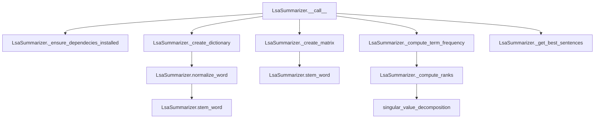

# `lsa.py`

## `sumy.summarizers.lsa.LsaSummarizer` · *class*

## Summary:
Implements Latent Semantic Analysis (LSA) for automatic text summarization by analyzing semantic relationships between words and sentences through singular value decomposition.

## Description:
The LsaSummarizer class applies Latent Semantic Analysis to extract the most important sentences from a document. It constructs a term-document matrix, performs TF-IDF weighting, and uses singular value decomposition to identify key semantic patterns. The summarizer then ranks sentences based on their contribution to these latent semantic dimensions.

This class is designed to be instantiated by users seeking automated text summarization using the LSA algorithm. It inherits from AbstractSummarizer, ensuring compatibility with the sumy framework's standard interface for summarization algorithms.

## State:
- `MIN_DIMENSIONS`: Class constant (3) specifying minimum number of dimensions for SVD reduction
- `REDUCTION_RATIO`: Class constant (1.0) controlling the proportion of dimensions retained in SVD
- `_stop_words`: Instance attribute storing frozen set of normalized stop words for filtering

## Lifecycle:
- Creation: Instantiate with optional stemmer (inherited from parent). Stop words can be configured via the `stop_words` property setter.
- Usage: Call the instance with a document object and desired sentence count to generate a summary
- Destruction: No special cleanup required; relies on Python's garbage collection

## Method Map:


## Raises:
- ValueError: When NumPy dependency is not installed, raised by `_ensure_dependecies_installed`
- AssertionError: In `_compute_term_frequency` when smooth parameter is outside [0.0, 1.0) range
- AssertionError: In `_compute_ranks` when sigma and v_matrix dimensions don't match

## Example:
```python
from sumy.summarizers.lsa import LsaSummarizer
from sumy.parsers.plaintext import PlaintextParser
from sumy.nlp.tokenizers import Tokenizer

# Create summarizer instance
summarizer = LsaSummarizer()

# Configure stop words if needed
summarizer.stop_words = ['the', 'and', 'or']

# Parse document
parser = PlaintextParser.from_file("document.txt", Tokenizer("english"))
document = parser.document

# Generate summary with 3 sentences
summary = summarizer(document, 3)
for sentence in summary:
    print(sentence)
```

### `sumy.summarizers.lsa.LsaSummarizer.stop_words` · *method*

## Summary:
Sets the stop words for the LSA summarizer by normalizing and storing them as an immutable frozen set.

## Description:
This property setter configures the stop words that will be excluded from text processing during LSA summarization. It takes a collection of words, normalizes each word using the parent class's normalize_word method, and stores them as an immutable frozenset for efficient lookup. This method is part of the LsaSummarizer's configuration interface, allowing users to customize which words are treated as stop words for better summarization results.

## Args:
    words (iterable): An iterable collection of words to be treated as stop words. Each word will be normalized using the normalize_word method before storage.

## Returns:
    None: This method does not return any value.

## Raises:
    AttributeError: If the normalize_word method is not available on the parent class (though this would indicate a broken inheritance chain).

## State Changes:
    - Attributes READ: None
    - Attributes WRITTEN: self._stop_words

## Constraints:
    - Preconditions: The words parameter must be iterable and each element must be processable by normalize_word
    - Postconditions: self._stop_words is updated to a frozenset containing normalized versions of all input words

## Side Effects:
    - Mutates the internal state of self._stop_words
    - Calls the normalize_word method for each input word

### `sumy.summarizers.lsa.LsaSummarizer.__call__` · *method*

## Summary:
Computes a latent semantic analysis summary by performing singular value decomposition on a term-document matrix and selecting sentences based on computed relevance scores.

## Description:
This method implements the core logic of the Latent Semantic Analysis (LSA) summarization algorithm. It transforms a document into a term-document matrix, applies term frequency weighting, performs singular value decomposition to reduce dimensionality, computes sentence relevance scores from the decomposed matrices, and finally selects the most relevant sentences using the parent class's sentence selection mechanism.

The method is invoked during the summarization pipeline when a LsaSummarizer instance is called with a document and desired sentence count. It orchestrates the complete LSA workflow from preprocessing to result generation.

## Args:
    document (Document): The input document to summarize, containing sentences and words.
    sentences_count (int): The number of sentences to include in the final summary.

## Returns:
    tuple[Sentences]: A tuple containing the selected sentences in their original order, or an empty tuple if no sentences can be selected.

## Raises:
    None explicitly raised.

## State Changes:
    Attributes READ: None
    Attributes WRITTEN: None

## Constraints:
    Preconditions:
        - Document must contain at least one sentence
        - Sentences_count must be a non-negative integer
    Postconditions:
        - Returns a tuple of sentences ordered by their original positions
        - If dictionary creation fails or is empty, returns empty tuple
        - Sentence selection respects the requested count limit

## Side Effects:
    - Calls external dependency check via _ensure_dependecies_installed
    - Issues warning if word count is less than sentence count
    - Uses numpy for numerical computations

### `sumy.summarizers.lsa.LsaSummarizer._ensure_dependecies_installed` · *method*

## Summary:
Verifies that the NumPy dependency is properly installed and importable for LSA summarization.

## Description:
This private method performs a runtime validation to ensure that the NumPy library is available before proceeding with LSA (Latent Semantic Analysis) summarization operations. It is called internally by the summarization process to prevent runtime failures when NumPy functions are subsequently needed. The method provides a clear error message directing users to install NumPy if it's missing.

## Args:
    None

## Returns:
    None

## Raises:
    ValueError: Raised when NumPy is not importable or evaluates to None, indicating that the LSA summarizer's core mathematical library dependency is missing.

## State Changes:
    Attributes READ: None
    Attributes WRITTEN: None

## Constraints:
    Preconditions: The method assumes that the module-level import statement `import numpy` has been successfully executed.
    Postconditions: Execution of this method guarantees that NumPy is available for subsequent mathematical operations in the LSA algorithm.

## Side Effects:
    None

### `sumy.summarizers.lsa.LsaSummarizer._create_dictionary` · *method*

## Summary:
Creates a mapping from unique stemmed words to sequential integer indices for use in document representation matrices.

## Description:
Constructs a vocabulary dictionary by processing all words in a document through normalization and stemming operations. This method filters out stop words and duplicates to create a compact representation of unique terms that will be used as features in subsequent matrix computations. The resulting dictionary maps each unique stemmed word to a sequential index, enabling efficient vectorized operations in the LSA algorithm.

This logic is separated into its own method because it encapsulates the core preprocessing and indexing logic that is reused in multiple stages of the summarization pipeline. It provides a clean abstraction for building the vocabulary space that underlies the mathematical operations performed by the LSA algorithm.

## Args:
    document (Document): The document object containing words to process. Must have a `words` attribute that yields word tokens.

## Returns:
    dict[str, int]: A dictionary mapping unique stemmed words to sequential integer indices starting from 0.

## Raises:
    None explicitly raised.

## State Changes:
    - Attributes READ: self._stop_words, self.normalize_word, self.stem_word
    - Attributes WRITTEN: None

## Constraints:
    - Preconditions: The document must have a `words` attribute that can be iterated over
    - Postconditions: The returned dictionary contains only unique stemmed words that are not stop words

## Side Effects:
    - Calls self.normalize_word() for each word in the document
    - Calls self.stem_word() for each normalized word
    - Reads from self._stop_words frozenset for filtering

### `sumy.summarizers.lsa.LsaSummarizer._create_matrix` · *method*

## Summary:
Creates a term-sentence frequency matrix for Latent Semantic Analysis by counting stemmed word occurrences in sentences.

## Description:
Constructs a numerical matrix where rows correspond to unique words in the dictionary and columns correspond to sentences in the document. Each cell [i,j] contains the frequency count of word i in sentence j. This matrix is the fundamental input for the LSA algorithm's mathematical operations including term frequency weighting and singular value decomposition.

The method is invoked during the LSA summarization pipeline as part of the preprocessing phase, specifically after building the vocabulary dictionary but before computing term frequencies and performing dimensionality reduction. It's separated from other processing steps to maintain clean architectural boundaries and facilitate testing of the core matrix construction logic.

## Args:
    document (Document): The document object containing sentences to process. Must have a sentences attribute.
    dictionary (dict): A mapping of stemmed words to their row indices in the matrix. Keys are stemmed words, values are integer indices.

## Returns:
    numpy.ndarray: A 2D matrix of shape (words_count, sentences_count) where each element represents the frequency count of a word in a sentence. Matrix is initialized with zeros and populated with word occurrence counts.

## Raises:
    None explicitly raised, though a warning is issued via Python's warnings module when the number of words in the dictionary is less than the number of sentences.

## State Changes:
    - Attributes READ: None
    - Attributes WRITTEN: None

## Constraints:
    - Preconditions: The document must have a sentences attribute, and the dictionary must map words to integer indices
    - Postconditions: The returned matrix is initialized with zeros and populated with word counts using the summarizer's stem_word method

## Side Effects:
    - Issues a warning via Python's warnings module when the number of words in the dictionary is less than the number of sentences
    - Uses numpy for efficient array creation and manipulation
    - Applies the summarizer's stem_word method to normalize sentence words before lookup in the dictionary
    - Relies on the inherited normalize_word method for initial word normalization before stemming

### `sumy.summarizers.lsa.LsaSummarizer._compute_term_frequency` · *method*

## Summary:
Computes normalized term frequencies for a document-term matrix using log normalization with smoothing.

## Description:
This method applies log normalization to convert raw word frequencies into normalized term frequencies. It scales each word's frequency in a sentence by the maximum frequency of that word across all sentences, then applies smoothing to prevent zero values. This normalization technique helps reduce the impact of very frequent words while preserving relative importance differences.

The method is called during the LSA summarization pipeline as part of the preprocessing step before singular value decomposition. It's separated from other matrix operations to maintain clean code organization and enable reuse of the normalization logic.

## Args:
    matrix (numpy.ndarray): A 2D array where rows represent words and columns represent sentences, containing raw word frequencies.
    smooth (float): Smoothing factor for normalization, must be between 0.0 and 1.0 (exclusive of 1.0). Defaults to 0.4.

## Returns:
    numpy.ndarray: The modified matrix with normalized term frequencies applied in-place.

## Raises:
    AssertionError: When the smooth parameter is outside the valid range [0.0, 1.0).

## State Changes:
    Attributes READ: None
    Attributes WRITTEN: None

## Constraints:
    Preconditions:
        - The matrix parameter must be a valid 2D numpy array
        - The smooth parameter must satisfy 0.0 <= smooth < 1.0
    Postconditions:
        - All values in the returned matrix are in the range [smooth, 1.0]
        - Matrix values are modified in-place

## Side Effects:
    None

### `sumy.summarizers.lsa.LsaSummarizer._compute_ranks` · *method*

## Summary:
Computes rank scores for sentences based on singular value decomposition results using truncated SVD components.

## Description:
This method processes the singular values and right singular vectors from SVD decomposition to calculate ranking scores for sentences in the LSA summarization process. It implements dimensionality reduction by truncating small singular values and computes weighted Euclidean norms of the transformed vectors. The method is called during the sentence ranking phase of LSA summarization, specifically within the `__call__` method after SVD computation.

## Args:
    sigma (tuple[float]): Singular values from SVD decomposition, sorted in descending order
    v_matrix (numpy.ndarray): Right singular vectors matrix from SVD decomposition with shape (n, m) where n is the number of words and m is the number of sentences

## Returns:
    list[float]: Rank scores for each sentence, representing their importance in the document

## Raises:
    AssertionError: When the length of sigma does not match the number of rows in v_matrix

## State Changes:
    Attributes READ: None
    Attributes WRITTEN: None

## Constraints:
    Preconditions:
        - sigma must contain singular values from SVD decomposition
        - v_matrix must be the right singular vectors matrix from SVD with compatible dimensions
        - Length of sigma must equal number of rows in v_matrix
    Postconditions:
        - Returns a list of rank scores with same length as number of columns in v_matrix
        - All returned scores are non-negative real numbers

## Side Effects:
    None

