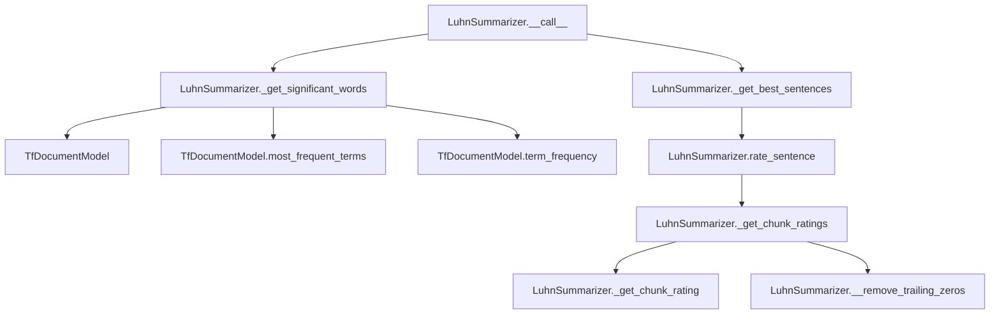

# `luhn.py`

## `sumy.summarizers.luhn.LuhnSummarizer` · *class*

## Summary:
LuhnSummarizer is a text summarization algorithm implementation that ranks sentences based on significant word frequency and grouping patterns.

## Description:
The LuhnSummarizer implements the Luhn algorithm for automatic text summarization. It identifies important sentences by analyzing word frequency and grouping significant words into contiguous chunks. This summarizer is designed to work with documents processed through the sumy framework and provides a concrete implementation of the AbstractSummarizer interface. The algorithm works by first identifying significant words based on term frequency, then rating sentences based on how these significant words appear in contiguous groups.

## State:
- `max_gap_size`: Integer constant (4) defining the maximum number of consecutive non-significant words allowed in a chunk before ending it
- `significant_percentage`: Integer constant (1) representing the percentage of words to consider as significant (100% of all words in this implementation)
- `_stop_words`: Frozenset of normalized and stemmed stop words used to filter out insignificant terms

## Lifecycle:
- Creation: Instantiate without arguments; uses default stop words and configuration
- Usage: Call the instance with a document object and desired sentence count to generate a summary
- Destruction: No explicit cleanup required; relies on Python's garbage collection

## Method Map:


## Raises:
- No explicit exceptions raised by __init__
- Exceptions may be raised by parent class AbstractSummarizer during initialization if stemmer is invalid
- Exceptions from _get_best_sentences when count is invalid

## Example:
```python
from sumy.summarizers.luhn import LuhnSummarizer
from sumy.parsers.plaintext import PlaintextParser
from sumy.nlp.tokenizers import Tokenizer

# Create summarizer
summarizer = LuhnSummarizer()

# Set custom stop words if needed
summarizer.stop_words = ['the', 'and', 'or']

# Parse document
parser = PlaintextParser.from_file("document.txt", Tokenizer("english"))
document = parser.document

# Generate summary
summary = summarizer(document, sentences_count=3)
for sentence in summary:
    print(sentence)
```

### `sumy.summarizers.luhn.LuhnSummarizer.stop_words` · *method*

## Summary:
Sets the stop words for the Luhn summarizer by normalizing and storing them as an immutable frozen set.

## Description:
This method configures the stop words used by the Luhn summarizer algorithm. It takes a collection of words, normalizes each word using the inherited normalize_word method from AbstractSummarizer, and stores them as a frozenset in the internal _stop_words attribute. This prevents the summarizer from considering these common words when identifying significant terms in documents.

The method is implemented as a setter property for the stop_words attribute, allowing users to configure stop words through assignment syntax like `summarizer.stop_words = ['the', 'and', 'or']`. This approach provides a clean interface for managing stop words while ensuring they are consistently normalized.

## Args:
    words (Iterable[str]): An iterable collection of words to be treated as stop words. These will be normalized using the inherited normalize_word method.

## Returns:
    None: This method does not return any value.

## Raises:
    AttributeError: If the normalize_word method is not available in the class hierarchy.
    TypeError: If the words parameter is not iterable or contains non-string elements that cannot be processed by normalize_word.

## State Changes:
    - Attributes READ: None
    - Attributes WRITTEN: self._stop_words

## Constraints:
    - Preconditions: The class must inherit a normalize_word method that can process the input words
    - Postconditions: The _stop_words attribute is updated to contain a frozenset of normalized stop words

## Side Effects:
    - Mutates the internal _stop_words attribute of the LuhnSummarizer instance
    - Normalizes each input word using the inherited normalize_word method

### `sumy.summarizers.luhn.LuhnSummarizer.__call__` · *method*

## Summary:
Processes a document to generate a summary by selecting the most important sentences based on significant word frequency and contextual importance.

## Description:
This method serves as the main entry point for the Luhn summarization algorithm. It orchestrates the document summarization process by first identifying significant words from the document's vocabulary, then using these words to rate and select the most informative sentences. The method leverages the Luhn algorithm's core principle of sentence importance based on the frequency and distribution of significant words within sentence chunks.

The method is called during the summarization pipeline when a user requests a summary of a document with a specified number of sentences. It integrates with the broader LuhnSummarizer class by utilizing its word processing capabilities and sentence rating mechanisms.

## Args:
    document (Document): The input document object containing sentences and words to summarize.
    sentences_count (int): The desired number of sentences to include in the final summary.

## Returns:
    tuple: A tuple of selected sentences ordered by their original position in the input document.

## Raises:
    None explicitly raised.

## State Changes:
    - Attributes READ: self._stop_words, self.significant_percentage, self.max_gap_size
    - Attributes WRITTEN: None

## Constraints:
    Preconditions:
        - Document must have a valid sentences attribute containing iterable sentences
        - Document must have a valid words attribute containing iterable words
        - Sentences_count must be a positive integer
    Postconditions:
        - The returned tuple contains exactly sentences_count sentences (or fewer if document has insufficient sentences)
        - Sentences in the returned tuple maintain their original order from the input document

## Side Effects:
    - Processes document words through normalization and stemming
    - Computes term frequency models for significant word identification
    - Applies sentence rating functions that may involve complex chunk-based calculations
    - May invoke external stemmer functions depending on configuration

### `sumy.summarizers.luhn.LuhnSummarizer._get_significant_words` · *method*

## Summary:
Extracts significant words from a collection by normalizing, stemming, filtering stop words, and selecting high-frequency terms.

## Description:
Processes a collection of words through multiple stages to identify significant terms for summarization. First normalizes each word using the summarizer's normalization function, then stems each word using the configured stemmer while filtering out stop words. Creates a term frequency model from the processed words and selects the most frequent terms based on the configured percentage. Finally filters these terms to only include those appearing more than once in the original document.

This method is called by the main summarization pipeline during the word selection phase, specifically from the `__call__` method of LuhnSummarizer. The separation into its own method allows for reusable word selection logic and makes the summarization algorithm's core logic more readable and maintainable.

## Args:
    words (Iterable[str]): Collection of words to process for significance extraction.

## Returns:
    tuple[str]: Tuple of significant words that meet the frequency threshold criteria. These are stemmed words that:
        - Have been normalized and stemmed using the summarizer's configured functions
        - Are not in the stop words list
        - Appear in the top percentage of most frequent terms (based on significant_percentage)
        - Appear more than once in the original document

## Raises:
    None explicitly raised.

## State Changes:
    Attributes READ: self._stop_words, self.significant_percentage, self.normalize_word, self.stem_word
    Attributes WRITTEN: None

## Constraints:
    Preconditions:
        - The summarizer instance must have been properly initialized with a valid stemmer and stop words configuration
        - Words parameter must be iterable containing string-like elements
    Postconditions:
        - Returns a tuple of stemmed, non-stop words that appear more than once in the original document
        - The number of returned words is limited by the significant_percentage setting
        - All returned words are in lowercase due to normalization

## Side Effects:
    - Invokes external functions: normalize_word, stem_word, and TfDocumentModel constructor
    - Uses the summarizer's configured stop words set for filtering
    - Creates a TfDocumentModel instance for term frequency analysis

### `sumy.summarizers.luhn.LuhnSummarizer.rate_sentence` · *method*

## Summary:
Computes the maximum rating among all significant word chunks in a sentence.

## Description:
Evaluates the importance of a sentence by determining the highest significance rating among all contiguous word chunks that contain significant stems. This method serves as a key component in the Luhn summarization algorithm, where sentence importance is derived from the most prominent chunk within the sentence.

The method delegates the chunk identification and rating computation to the `_get_chunk_ratings` helper method, which processes the sentence's words to find significant chunks and compute their individual ratings. It then selects the maximum rating as the overall sentence rating.

This logic is encapsulated in its own method to separate the chunk processing logic from the sentence rating logic, enabling clean separation of concerns and making the summarization algorithm easier to understand and maintain.

## Args:
    sentence: The sentence object containing words to process.
    significant_stems (set): A set of word stems considered significant for summarization purposes.

## Returns:
    float: The maximum chunk rating found in the sentence. Returns 0 if no significant chunks are identified.

## Raises:
    None explicitly raised.

## State Changes:
    Attributes READ: None
    Attributes WRITTEN: None

## Constraints:
    Preconditions: The sentence must have a valid `words` attribute containing word objects. The significant_stems parameter must be a set-like object.
    Postconditions: Returns a floating-point number representing the maximum significance rating among all chunks in the sentence. Zero is returned when no significant chunks are found.

## Side Effects:
    None

### `sumy.summarizers.luhn.LuhnSummarizer._get_chunk_ratings` · *method*

## Summary:
Identifies significant word chunks in a sentence and computes their ratings based on stem matching.

## Description:
Processes a sentence's words to detect contiguous sequences of significant words (based on stem matching against a set of significant stems). Each detected chunk is then rated using the internal `_get_chunk_rating` method. This method serves as a core component in the Luhn summarization algorithm by identifying meaningful word groupings within sentences.

The method tracks word significance using a state machine approach, where it builds chunks when encountering the first significant word in a sequence, continues appending subsequent significant/non-significant words, and terminates chunks when a gap of maximum size occurs without significant words. The resulting chunks are then scored to determine their contribution to sentence importance.

This method is called exclusively by `rate_sentence` during the summarization process to evaluate sentence significance. The sentence rating is determined by taking the maximum chunk rating among all chunks in the sentence.

## Args:
    sentence: The sentence object containing words to process.
    significant_stems (set): A set of word stems considered significant for summarization purposes.

## Returns:
    tuple[float]: A tuple of chunk ratings, one for each significant word chunk identified in the sentence. Each rating represents the normalized significance of the chunk.

## Raises:
    None explicitly raised.

## State Changes:
    Attributes READ: self.max_gap_size, self.stem_word
    Attributes WRITTEN: None

## Constraints:
    Preconditions: The sentence must have a valid `words` attribute containing word objects. The significant_stems parameter must be a set-like object.
    Postconditions: Returns a tuple of floating-point ratings, each representing the significance of a word chunk. Empty tuples are returned when no significant chunks are found.

## Side Effects:
    None

### `sumy.summarizers.luhn.LuhnSummarizer._get_chunk_rating` · *method*

## Summary:
Computes a normalized significance rating for a chunk of words based on the count of significant words and total word count.

## Description:
This method calculates a score for a chunk of words that represents how significant the chunk is within a sentence. It removes trailing zeros from the chunk, counts significant words, and applies a mathematical formula to normalize the score. This method is used internally by `_get_chunk_ratings` to rate sentence chunks during summarization.

The scoring algorithm uses the formula: (significant_words^2) / words_count, with a special case that returns 0 when there is exactly one significant word in the chunk. This prevents over-rating very short chunks with minimal significance.

## Args:
    chunk (list[int]): A list of integers representing word significance (1 for significant, 0 for non-significant) within a sentence chunk.

## Returns:
    float: The normalized chunk rating. Returns 0 when there is exactly one significant word in the chunk, otherwise returns (significant_words^2) / words_count. The result is always non-negative.

## Raises:
    AssertionError: When the chunk contains zero words after processing (i.e., when all elements were trailing zeros).

## State Changes:
    Attributes READ: None
    Attributes WRITTEN: None

## Constraints:
    Preconditions: The chunk must contain at least one word after removing trailing zeros.
    Postconditions: The returned value is always non-negative, with special handling for chunks with exactly one significant word.

## Side Effects:
    None

### `sumy.summarizers.luhn.LuhnSummarizer.__remove_trailing_zeros` · *method*

## Summary:
Removes trailing zero elements from a collection by slicing off elements from the end.

## Description:
This private method takes a collection (typically a list of numbers) and removes any trailing zero values from the end, returning a new collection with those elements excluded. It is used internally by the Luhn summarizer to clean up weight vectors or similar numeric collections that may have trailing zeros that should be ignored in further processing.

## Args:
    collection (list-like): A sequence containing numeric or comparable elements, potentially ending with zero values. Must support indexing and slicing operations.

## Returns:
    list-like: A new collection with trailing zero elements removed. If the input contains no trailing zeros, the entire collection is returned. If all elements are zero, an empty collection is returned. The return type matches the input type.

## Raises:
    None explicitly raised.

## State Changes:
    Attributes READ: None
    Attributes WRITTEN: None

## Constraints:
    Preconditions: The input collection must support indexing and slicing operations (e.g., lists, tuples, numpy arrays).
    Postconditions: The returned collection will not have any trailing zero elements. The original collection remains unchanged.

## Side Effects:
    None

