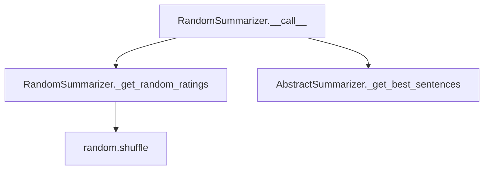

# `random.py`

## `sumy.summarizers.random.RandomSummarizer` · *class*

## Summary:
RandomSummarizer is a text summarization algorithm that selects sentences randomly from a document based on shuffled rankings.

## Description:
The RandomSummarizer implements a stochastic approach to text summarization by assigning random rankings to all sentences in a document and then selecting the top-ranked sentences. This class extends AbstractSummarizer to provide a concrete implementation of the summarization interface. It serves as a baseline or random sampling approach for comparison with more sophisticated summarization methods.

The class is typically instantiated by users or framework components that require a random sentence selection strategy for document summarization. It provides a simple yet effective way to generate summaries without applying complex linguistic analysis or scoring mechanisms.

## State:
- Inherits `_stemmer` attribute from AbstractSummarizer (callable object for word stemming)
- No additional instance attributes maintained

## Lifecycle:
- Creation: Instantiated without arguments, inheriting default stemmer from AbstractSummarizer
- Usage: Called with a document object and desired sentence count to generate a summary
- Destruction: Relies on Python's garbage collection

## Method Map:


## Raises:
- ValueError: May be raised during instantiation if an invalid stemmer is provided (inherited from AbstractSummarizer)
- None explicitly raised by RandomSummarizer's methods

## Example:
```python
from sumy.summarizers.random import RandomSummarizer
from sumy.nlp.tokenizers import Tokenizer
from sumy.parsers.plaintext import PlaintextParser

# Create summarizer instance
summarizer = RandomSummarizer()

# Parse document
parser = PlaintextParser.from_string("Your document text here", Tokenizer("english"))
document = parser.document

# Generate summary with 3 sentences
summary = summarizer(document, 3)
print(summary)
```

### `sumy.summarizers.random.RandomSummarizer.__call__` · *method*

## Summary:
Selects a random subset of sentences from a document based on randomly assigned ratings.

## Description:
This method implements the core logic for the RandomSummarizer by assigning random ratings to all sentences in the document and then selecting the top-rated sentences according to those ratings. It serves as the main entry point for the summarization process, orchestrating the random rating assignment and best sentence selection phases. The method leverages the parent class's _get_best_sentences utility to handle the actual selection logic.

## Args:
    document (Document): The input document containing sentences to be summarized.
    sentences_count (int): The number of sentences to select for the summary.

## Returns:
    tuple: A tuple of selected sentences ordered by their original position in the input document.

## Raises:
    None explicitly raised.

## State Changes:
    Attributes READ: None
    Attributes WRITTEN: None

## Constraints:
    Preconditions:
        - Document must contain a valid sentences attribute.
        - Sentences count must be a positive integer.
    Postconditions:
        - The returned tuple contains exactly sentences_count sentences.
        - The sentences in the result maintain their original order from the document.

## Side Effects:
    None

### `sumy.summarizers.random.RandomSummarizer._get_random_ratings` · *method*

## Summary:
Generates a random ranking of sentence indices for use in random sentence selection during summarization.

## Description:
This method creates a randomized mapping between input sentences and integer rankings, which is used by the random summarizer to select sentences for inclusion in the summary. It ensures that each sentence receives a unique random rank while maintaining the correspondence between sentences and their assigned ranks. This method is called during the summarization process to provide randomized ordering for sentence selection.

Known callers:
- RandomSummarizer.__call__: Called during the summarization process to generate random rankings for sentence selection

## Args:
    sentences (list): A list of sentence objects to be ranked randomly

## Returns:
    dict: A dictionary mapping each sentence to a random integer rank, where ranks are unique integers in the range [0, len(sentences))

## Raises:
    None explicitly raised

## State Changes:
    Attributes READ: None
    Attributes WRITTEN: None

## Constraints:
    Preconditions: 
    - Input sentences must be a non-empty iterable
    - Each sentence in the input should be hashable (as it will be used as a dictionary key)
    
    Postconditions:
    - The returned dictionary will have exactly len(sentences) entries
    - Each sentence appears exactly once as a key in the returned dictionary
    - Each rank value is an integer in the range [0, len(sentences))
    - All rank values in the returned dictionary are unique

## Side Effects:
    None

