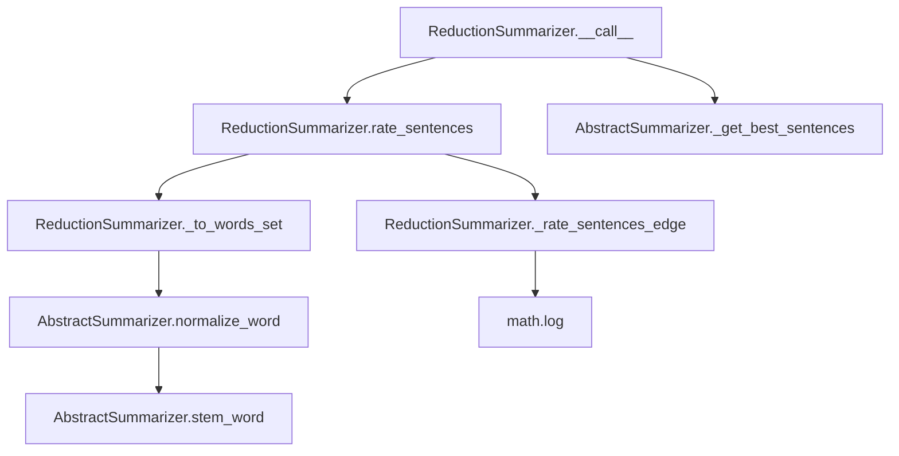

# `reduction.py`

## `sumy.summarizers.reduction.ReductionSummarizer` · *class*

## Summary:
ReductionSummarizer is a text summarization algorithm that ranks sentences based on their similarity to other sentences in the document using a reduction-based scoring mechanism.

## Description:
The ReductionSummarizer implements a sentence-ranking approach where each sentence is scored based on its similarity to all other sentences in the document. It calculates similarity through word overlap and normalizes the scores using logarithmic normalization. This summarizer is particularly effective for extracting key information from documents by identifying sentences that are most representative of the overall content.

The class inherits from AbstractSummarizer, which provides common utilities like word normalization and stemming. It operates by analyzing word overlaps between sentence pairs and computing a similarity score that reflects how much information a sentence contributes to the document's overall meaning. The algorithm uses a reduction technique where each sentence accumulates similarity scores from all other sentences it shares words with.

## State:
- `_stop_words`: frozenset of normalized and stemmed words that should be excluded from sentence analysis. Default is an empty frozenset.
- The class maintains no other persistent state beyond the stop words configuration.

## Lifecycle:
- Creation: Instantiate with optional stemmer parameter (inherited from AbstractSummarizer). Stop words can be configured via the `stop_words` property setter.
- Usage: Call the instance with a document object and desired number of sentences to summarize. The `__call__` method orchestrates the ranking and selection process.
- Destruction: No explicit cleanup required; relies on Python's garbage collection.

## Method Map:


## Raises:
- None explicitly raised by the class itself. Exceptions may occur from parent class methods or underlying utilities.

## Example:
```python
from sumy.summarizers.reduction import ReductionSummarizer
from sumy.parsers.plaintext import PlaintextParser
from sumy.nlp.tokenizers import Tokenizer

# Create summarizer instance
summarizer = ReductionSummarizer()

# Configure stop words if needed
summarizer.stop_words = ["the", "and", "or"]

# Parse document
parser = PlaintextParser.from_file("document.txt", Tokenizer("english"))
document = parser.document

# Generate summary
summary = summarizer(document, sentences_count=3)
for sentence in summary:
    print(sentence)
```

### `sumy.summarizers.reduction.ReductionSummarizer.stop_words` · *method*

## Summary:
Configures the stop words for the reduction-based text summarizer by normalizing and freezing a collection of words.

## Description:
This method serves as a setter for the `_stop_words` attribute in the `ReductionSummarizer` class. It takes an iterable of words, normalizes each word using the inherited `normalize_word` method from `AbstractSummarizer`, and stores them as an immutable `frozenset`. Stop words are terms that should be excluded from sentence scoring calculations during the summarization process.

This method is typically called during the initialization or configuration phase of a summarizer instance to define which words should be ignored when computing sentence relevance scores. The normalization ensures consistent matching regardless of case or other variations in the input words.

## Args:
    words (iterable): An iterable collection of words to be treated as stop words.

## Returns:
    None: This method does not return a value.

## Raises:
    AttributeError: If the instance does not have a `normalize_word` method inherited from `AbstractSummarizer`.

## State Changes:
    Attributes READ: None
    Attributes WRITTEN: `_stop_words`

## Constraints:
    Preconditions: The instance must inherit a `normalize_word` method from `AbstractSummarizer`.
    Postconditions: The `_stop_words` attribute is updated to a `frozenset` containing normalized versions of the input words.

## Side Effects:
    None: This method performs no I/O operations or external service calls.

### `sumy.summarizers.reduction.ReductionSummarizer.__call__` · *method*

## Summary:
Executes the reduction-based text summarization algorithm by computing sentence ratings and selecting the most representative sentences.

## Description:
This method implements the core reduction summarization algorithm, which identifies the most representative sentences in a document by measuring their similarity to other sentences. It serves as the primary interface for generating summaries using the reduction approach, where sentences are ranked based on their contribution to the overall document structure.

The method follows a two-phase process: first, it calls `rate_sentences()` to compute similarity-based ratings for all sentences in the document, then it invokes `_get_best_sentences()` to select and order the top-ranking sentences according to the specified count. This approach differs from other summarization methods by focusing on inter-sentence similarity rather than word frequency or positional heuristics.

## Args:
    document: The document object containing sentences to summarize. Must have a sentences attribute containing iterable sentence objects.
    sentences_count: The number of sentences to include in the final summary. Can be an integer specifying exact count, a percentage string (e.g., "30%"), or a callable for advanced filtering.

## Returns:
    tuple: A tuple of selected sentences ordered by their original position in the document. The number of sentences returned equals sentences_count (or fewer if the document is shorter).

## Raises:
    AssertionError: If the rating dictionary is provided with additional arguments to the rating function during sentence selection.
    ValueError: If the sentences_count value is unsupported (e.g., invalid percentage format or negative integer).

## State Changes:
    Attributes READ: None
    Attributes WRITTEN: None

## Constraints:
    Preconditions:
    - The document parameter must be a valid Document object with a sentences attribute.
    - The sentences_count parameter must be a supported type (int, float, string, or callable).
    - The summarizer must have been properly initialized with a valid stemmer and stop words configuration.
    
    Postconditions:
    - Returns a tuple containing exactly sentences_count sentences (or fewer if document is too short).
    - The returned sentences are ordered according to their appearance in the original document.
    - The sentence selection preserves the original ordering of sentences.

## Side Effects:
    None.

### `sumy.summarizers.reduction.ReductionSummarizer.rate_sentences` · *method*

## Summary:
Computes similarity-based ratings for all sentences in a document by accumulating pairwise similarity scores.

## Description:
This method implements a reduction-based sentence scoring algorithm that evaluates each sentence's importance based on its similarity to all other sentences in the document. For each pair of sentences, it computes a similarity score using the `_rate_sentences_edge` method and accumulates these scores for both sentences in the pair. The resulting ratings reflect how central each sentence is to the document's overall content structure.

The algorithm follows these steps:
1. Preprocesses each sentence into standardized word representations using `_to_words_set`
2. Computes pairwise similarity scores between all sentence pairs using `_rate_sentences_edge`
3. Accumulates similarity scores for each sentence from all its comparisons
4. Returns a mapping of sentences to their accumulated ratings

This approach identifies sentences that are semantically similar to many others, making them good candidates for inclusion in the final summary.

## Args:
    document (Document): The input document object containing a collection of sentences to rate

## Returns:
    defaultdict[float]: A mapping from each sentence object to its accumulated similarity rating, where higher values indicate more representative sentences in the document's content structure

## Raises:
    None explicitly raised.

## State Changes:
    Attributes READ: self._stop_words, self.normalize_word, self.stem_word
    Attributes WRITTEN: None

## Constraints:
    Preconditions: The document object must have a .sentences attribute containing iterable sentence objects
    Postconditions: The returned dictionary contains one entry for each sentence in the document with a numeric rating value

## Side Effects:
    Calls self._to_words_set() for each sentence in the document to preprocess word content
    Calls self._rate_sentences_edge() for each pair of sentences to compute similarity scores
    Reads from self._stop_words frozenset for filtering during word processing

### `sumy.summarizers.reduction.ReductionSummarizer._to_words_set` · *method*

## Summary:
Converts a sentence's words into a processed list of stemmed words, excluding stop words.

## Description:
Transforms a sentence's word collection by normalizing each word, applying stemming, and filtering out stop words. This method serves as a core preprocessing step for sentence comparison in the reduction-based summarization algorithm, creating standardized word representations for similarity calculations.

The method is called during sentence rating computation in the `rate_sentences` method, where it processes each sentence to extract its meaningful word content for comparison with other sentences in the document. This logic is separated into its own method to ensure consistent word preprocessing across different sentence comparison operations while maintaining clean separation of concerns in the summarization pipeline.

## Args:
    sentence (Sentence): The input sentence object containing a `words` attribute with word data.

## Returns:
    list[str]: A list of stemmed words from the sentence, with stop words removed. Each word is normalized and stemmed according to the summarizer's configuration.

## Raises:
    None explicitly raised.

## State Changes:
    - Attributes READ: self._stop_words (frozenset), self.normalize_word, self.stem_word
    - Attributes WRITTEN: None

## Constraints:
    - Preconditions: The sentence object must have a `words` attribute that can be iterated over
    - Postconditions: The returned list contains only stemmed words that are not in the stop words set

## Side Effects:
    - Invokes self.normalize_word for each word in the sentence
    - Invokes self.stem_word for each normalized word
    - Reads from self._stop_words frozenset for filtering
    - No external I/O or mutations to objects outside the summarizer instance

### `sumy.summarizers.reduction.ReductionSummarizer._rate_sentences_edge` · *method*

## Summary:
Computes a normalized similarity score between two word sequences using a logarithmic normalization technique.

## Description:
This private method calculates a similarity rating between two sequences of words by counting common elements and normalizing by the logarithm of their lengths. It's used internally by the ReductionSummarizer to compute edge weights between sentences in the summarization graph.

The similarity score ranges from 0.0 (no common words) to a maximum value determined by the logarithmic normalization. When there are no matching words, it returns 0.0 immediately.

## Args:
    words1 (list[str]): First sequence of words to compare
    words2 (list[str]): Second sequence of words to compare

## Returns:
    float: Normalized similarity score between 0.0 and 1.0, where 0.0 indicates no common words and higher values indicate greater similarity. Returns 0.0 when there are no matching words.

## Raises:
    AssertionError: When either words1 or words2 has zero length (this is asserted but not explicitly raised)

## State Changes:
    Attributes READ: None
    Attributes WRITTEN: None

## Constraints:
    Preconditions: Both arguments must be non-empty lists of strings
    Postconditions: Return value is always in the range [0.0, 1.0]

## Side Effects:
    None

