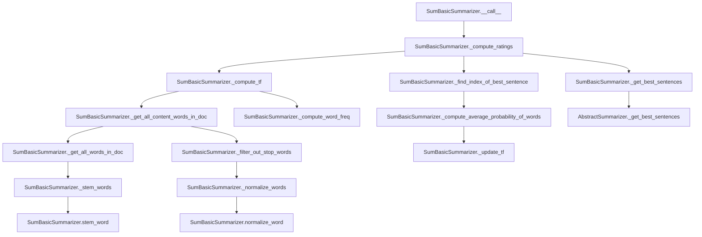

# `sum_basic.py`

## `sumy.summarizers.sum_basic.SumBasicSummarizer` · *class*

## Summary:
SumBasicSummarizer is a text summarization algorithm that ranks sentences based on the frequency of content words, repeatedly selecting the highest-rated sentence and reducing the frequency of its words to avoid redundancy.

## Description:
This class implements the SumBasic summarization algorithm, which operates by computing term frequencies of content words in a document and using these frequencies to rank sentences. The algorithm iteratively selects sentences with the highest average word frequency, updating word frequencies after each selection to prevent redundant selections. It is designed to be used as a concrete implementation of the AbstractSummarizer interface.

## State:
- `_stop_words`: frozenset of normalized stop words used to filter out non-content words during summarization. Default is an empty frozenset.
- Inherits stemmer and normalization capabilities from AbstractSummarizer.

## Lifecycle:
- Creation: Instantiate with optional stemmer parameter (inherited from AbstractSummarizer). Stop words can be set via the `stop_words` property after instantiation.
- Usage: Call the instance with a document object and desired number of sentences to summarize. The document must have a `sentences` attribute containing sentence objects with `words` attributes.
- Destruction: No special cleanup required; relies on Python's garbage collection.

## Method Map:


## Raises:
- None explicitly raised by the constructor.
- The `__call__` method may raise exceptions from the parent class or document/sentence handling if the input is malformed.

## Example:
```python
from sumy.summarizers.sum_basic import SumBasicSummarizer
from sumy.parsers.plaintext import PlaintextParser
from sumy.nlp.tokenizers import Tokenizer

# Create summarizer
summarizer = SumBasicSummarizer()

# Set custom stop words if needed
summarizer.stop_words = ['the', 'and', 'or']

# Parse document
parser = PlaintextParser.from_string("Your long text here...", Tokenizer("english"))

# Generate summary
summary = summarizer(parser.document, 3)
for sentence in summary:
    print(sentence)
```

### `sumy.summarizers.sum_basic.SumBasicSummarizer.stop_words` · *method*

## Summary:
Sets the stop words collection for the summarizer by normalizing and converting input words into an immutable frozen set.

## Description:
Configures the internal stop words storage by taking a collection of words, normalizing each word using the inherited normalize_word method, and storing them as an immutable frozenset. This method provides a clean interface for updating the stop words list that the summarizer uses to filter out common words during the summarization process.

## Args:
    words (iterable): An iterable collection of words to be treated as stop words. Each word will be normalized using the inherited normalize_word method before storage.

## Returns:
    None: This method does not return any value.

## Raises:
    TypeError: If the words argument is not iterable or if the normalize_word method is not callable.
    AttributeError: If the normalize_word method is not available on the parent class.

## State Changes:
    Attributes READ: None
    Attributes WRITTEN: self._stop_words

## Constraints:
    Preconditions: The parent class must provide a normalize_word method that can process each word in the input iterable.
    Postconditions: The self._stop_words attribute will be updated to contain a frozenset of normalized stop words.

## Side Effects:
    None: This method performs no I/O operations or external service calls. It only modifies the internal state of the object.

### `sumy.summarizers.sum_basic.SumBasicSummarizer.__call__` · *method*

## Summary:
Applies the SumBasic algorithm to rank sentences by word frequency and returns the highest-ranked sentences from a document.

## Description:
This method implements the core SumBasic summarization algorithm by computing sentence ratings based on word probability frequencies and selecting the most informative sentences. It serves as the primary interface for generating document summaries using the SumBasic technique.

The SumBasic algorithm works by:
1. Computing normalized term frequencies for all content words in the document
2. Iteratively selecting sentences based on their average word probability
3. Updating word frequencies after each selection to ensure diversity in the summary
4. Assigning decreasing negative integer ratings to sentences based on selection order
5. Using the inherited `_get_best_sentences` method to extract the top-ranked sentences

This method is invoked during the summarization pipeline when a SumBasicSummarizer instance processes a document to create a summary of the specified length. The algorithm prioritizes sentences containing less frequent words to achieve diverse and representative summaries.

## Args:
    document (Document): The input document containing sentences to summarize
    sentences_count (int): The number of sentences to include in the final summary

## Returns:
    tuple: A tuple containing the selected sentences ordered by their original position in the document

## Raises:
    None: This method does not explicitly raise exceptions

## State Changes:
    Attributes READ: None
    Attributes WRITTEN: None

## Constraints:
    Preconditions:
        - Document must have a sentences attribute containing iterable sentences
        - Sentences_count must be a non-negative integer
    Postconditions:
        - Returns a tuple of sentences from the input document
        - The number of returned sentences equals sentences_count (or fewer if document has insufficient sentences)
        - Sentence selection follows the SumBasic greedy ranking algorithm with word frequency-based scoring

## Side Effects:
    None: This method performs no I/O operations or external service calls

### `sumy.summarizers.sum_basic.SumBasicSummarizer._get_all_words_in_doc` · *method*

## Summary:
Extracts and stems all words from a collection of sentences into a single flattened list.

## Description:
This method flattens a nested structure of sentences and their constituent words into a single list of words, then applies stemming to normalize them. It serves as a foundational utility for text processing in the SumBasic summarization algorithm, enabling consistent word representation across different stages of the summarization pipeline.

The method is called during the computation of term frequency and content word extraction phases. It's separated from inline processing to ensure consistent word normalization and to support reuse across different summarization components. This design promotes modularity and makes the word extraction process reusable in other methods like `_get_all_content_words_in_doc`.

## Args:
    sentences (Iterable[Sentence]): An iterable collection of Sentence objects containing words to extract and stem.

## Returns:
    list[str]: A list of stemmed words extracted from all sentences, with each word normalized through the summarizer's stemmer.

## Raises:
    None explicitly raised.

## State Changes:
    Attributes READ: self._stemmer (via self.stem_word)
    Attributes WRITTEN: None

## Constraints:
    Preconditions:
        - Input sentences must be iterable and contain Sentence objects with a .words attribute
        - Each Sentence object must have a .words attribute that is iterable
        - The summarizer instance must have a valid stemmer configured
    Postconditions:
        - Returns a list of stemmed words with no duplicates or filtering applied
        - All words are processed through the summarizer's stem_word method

## Side Effects:
    - Invokes the summarizer's stem_word method for each word
    - May perform Unicode normalization and stemming operations
    - No external I/O or mutations to objects outside the summarizer instance

### `sumy.summarizers.sum_basic.SumBasicSummarizer._get_content_words_in_sentence` · *method*

## Summary:
Processes a sentence's words through normalization, stop-word filtering, and stemming to extract meaningful content words.

## Description:
This method implements the core text preprocessing pipeline for extracting content words from individual sentences in the SumBasic summarization algorithm. It sequentially applies three transformations to the words in a sentence: normalization (standardizing word format), stop-word filtering (removing common words), and stemming (reducing words to their root forms). The resulting list of processed words represents the sentence's meaningful content for summarization purposes.

This method is called during the summarization process when analyzing individual sentences to determine their contribution to the overall document summary. By encapsulating the complete preprocessing pipeline, it ensures consistent text processing across different parts of the summarization algorithm.

## Args:
    sentence: A sentence object containing a 'words' attribute that is iterable and contains string elements.

## Returns:
    list[str]: A list of stemmed, normalized content words extracted from the input sentence. The list contains only significant words that have been processed through the full pipeline of normalization, stop-word filtering, and stemming.

## Raises:
    None explicitly raised by this method.

## State Changes:
    - Attributes READ: None
    - Attributes WRITTEN: None

## Constraints:
    - Preconditions: The input sentence must have a 'words' attribute that is iterable and contains string elements. The instance must have properly implemented helper methods (_normalize_words, _filter_out_stop_words, _stem_words) and associated attributes (stop_words).
    - Postconditions: The returned list contains only content words that have undergone the full processing pipeline of normalization, stop-word filtering, and stemming.

## Side Effects:
    - Calls internal helper methods: _normalize_words(), _filter_out_stop_words(), and _stem_words()
    - No external I/O or mutations to objects outside the instance

### `sumy.summarizers.sum_basic.SumBasicSummarizer._stem_words` · *method*

## Summary:
Stems a list of words using the summarizer's configured stemmer function.

## Description:
This method applies the summarizer's stem_word method to each word in the input list, returning a new list containing the stemmed versions of the original words. It serves as a utility for normalizing words during the summarization process by reducing them to their root forms. This method is typically called during preprocessing steps in the summarization pipeline to ensure consistent word representation across documents.

## Args:
    words (list[str]): A list of words to be stemmed.

## Returns:
    list[str]: A list of stemmed words, maintaining the same order as the input.

## Raises:
    None explicitly raised by this method.

## State Changes:
    - Attributes READ: self.stem_word
    - Attributes WRITTEN: None

## Constraints:
    - Preconditions: The self.stem_word method must be callable and capable of processing each word in the input list. The summarizer instance must have a valid stemmer configured.
    - Postconditions: The returned list contains the same number of elements as the input list, with each element being the result of applying self.stem_word to the corresponding input word.

## Side Effects:
    - None

### `sumy.summarizers.sum_basic.SumBasicSummarizer._normalize_words` · *method*

## Summary:
Normalizes a list of words by applying the summarizer's normalization function to each word.

## Description:
This method applies the instance's word normalization function to each word in the input list, returning a new list with all words normalized according to the summarizer's configuration. It is used internally to ensure consistent word formatting before further processing in the summarization pipeline. The normalization process converts each word to a Unicode string and lowercases it for consistent text handling.

## Args:
    words (list[str]): A list of words to be normalized.

## Returns:
    list[str]: A new list containing the normalized versions of the input words.

## Raises:
    UnicodeDecodeError: When any input word contains invalid UTF-8 sequences that cannot be decoded during the normalization process.

## State Changes:
    Attributes READ: self.normalize_word
    Attributes WRITTEN: None

## Constraints:
    Preconditions: The input `words` parameter must be a list of strings. The `self.normalize_word` method must be callable and capable of handling the input word types.
    Postconditions: The returned list contains the same number of elements as the input list, with each element being the result of `self.normalize_word(w)` for each corresponding input word.

## Side Effects:
    None

### `sumy.summarizers.sum_basic.SumBasicSummarizer._filter_out_stop_words` · *method*

## Summary:
Filters out stop words from a list of words by returning only those words that are not present in the instance's stop words collection.

## Description:
This method takes a list of words and removes any word that appears in the instance's stop_words attribute. It is designed to preprocess text data by eliminating common words that do not contribute significantly to the meaning of the text, such as articles, prepositions, and conjunctions. The method is typically called during the text processing pipeline when preparing words for summarization.

## Args:
    words (list[str]): A list of words to filter.

## Returns:
    list[str]: A new list containing only the words from the input list that are not in the instance's stop_words collection. The order of words is preserved from the input list.

## Raises:
    None explicitly raised.

## State Changes:
    Attributes READ: self.stop_words
    Attributes WRITTEN: None

## Constraints:
    Preconditions: The input words list must be iterable and contain string elements. The self.stop_words attribute must be a collection (e.g., set, list) that supports the 'not in' operator.
    Postconditions: The returned list contains only words that were not found in self.stop_words. The length of the returned list is less than or equal to the length of the input list.

## Side Effects:
    None.

### `sumy.summarizers.sum_basic.SumBasicSummarizer._compute_word_freq` · *method*

## Summary:
Computes the frequency count of each word in a list of words.

## Description:
This method takes a list of words and returns a dictionary mapping each unique word to its occurrence count. It serves as a utility function for calculating word frequencies, which is a fundamental operation in various text summarization algorithms.

## Args:
    list_of_words (list[str]): A list of words for which to compute frequencies.

## Returns:
    dict[str, int]: A dictionary where keys are unique words from the input list and values are their respective counts.

## Raises:
    None explicitly raised.

## State Changes:
    None.

## Constraints:
    Preconditions:
    - The input list must contain only string elements.
    - The input list may be empty, in which case an empty dictionary is returned.
    
    Postconditions:
    - The returned dictionary contains exactly one entry for each unique word in the input list.
    - All values in the returned dictionary are non-negative integers.

## Side Effects:
    None.

### `sumy.summarizers.sum_basic.SumBasicSummarizer._get_all_content_words_in_doc` · *method*

## Summary:
Extracts and processes all content words from a collection of sentences by filtering out stop words and normalizing the remaining words.

## Description:
This method serves as a pipeline for processing sentences into meaningful content words suitable for summarization. It first extracts all words from the input sentences, then filters out common stop words, and finally normalizes the remaining words to ensure consistent representation. This method is part of the SumBasic summarization algorithm's text preprocessing workflow.

Known callers:
- `_compute_ratings` in `SumBasicSummarizer`: Called during the rating computation phase to get all content words for frequency analysis
- `_get_content_words_in_sentence` in `SumBasicSummarizer`: Used to extract content words from individual sentences for scoring purposes

This method is separated from inline usage to provide a clean abstraction for the content word extraction pipeline, making the code more readable and reusable across different parts of the summarization algorithm.

## Args:
    sentences (Iterable[Sentence]): An iterable of sentence objects, each having a `words` attribute containing a list of words.

## Returns:
    list[str]: A list of normalized content words (strings) that have been filtered to exclude stop words from the input sentences.

## Raises:
    None explicitly raised.

## State Changes:
    Attributes READ: self.stop_words
    Attributes WRITTEN: None

## Constraints:
    Preconditions:
    - Each item in `sentences` must have a `words` attribute that is iterable
    - `sentences` itself must be iterable
    - The instance must have a valid `stop_words` attribute that supports the 'not in' operator
    - The instance must have a valid `normalize_word` method that can process individual words
    
    Postconditions:
    - Returns a list of strings representing normalized content words
    - The returned list contains only words that were not found in self.stop_words
    - The length of the returned list is less than or equal to the total number of words in the input sentences

## Side Effects:
    None

### `sumy.summarizers.sum_basic.SumBasicSummarizer._compute_tf` · *method*

## Summary:
Computes term frequency (TF) scores for content words in a document.

## Description:
Calculates the term frequency of each content word in the document by dividing each word's occurrence count by the total number of content words. This private method is part of the SumBasicSummarizer class and serves as a core component in the SumBasic summarization algorithm, providing normalized frequency weights for content words that influence sentence selection during the summarization process.

The method is called during the preprocessing phase of SumBasic summarization to transform raw word counts into probability distributions suitable for scoring sentences.

## Args:
    sentences (Iterable[Sentence]): An iterable of Sentence objects containing the document's sentences to process.

## Returns:
    dict[str, float]: A dictionary mapping each content word to its term frequency score (normalized between 0 and 1).

## Raises:
    None explicitly raised.

## State Changes:
    Attributes READ: None
    Attributes WRITTEN: None

## Constraints:
    Preconditions: The input `sentences` parameter must be iterable and contain Sentence objects with valid `words` attributes.
    Postconditions: The returned dictionary will contain exactly one entry for each unique content word in the document.

## Side Effects:
    None.

### `sumy.summarizers.sum_basic.SumBasicSummarizer._compute_average_probability_of_words` · *method*

## Summary:
Calculates the average frequency of content words in a sentence relative to the document-wide word frequencies.

## Description:
This private helper method computes the mean frequency probability of content words within a sentence by aggregating individual word frequencies from the document's frequency distribution. It's a fundamental component of the SumBasic summarization algorithm that quantifies sentence informativeness based on word frequency statistics.

The method is called during sentence scoring in the summarization process to determine which sentences are most representative of the document's content based on word frequency patterns.

## Args:
    word_freq_in_doc (dict): Dictionary mapping words to their frequency counts in the entire document
    content_words_in_sentence (list): List of content words (typically nouns, verbs, adjectives, adverbs) found in the sentence being evaluated

## Returns:
    float: Average frequency probability of content words in the sentence. Returns 0 if no content words are present.

## Raises:
    KeyError: If any word in content_words_in_sentence is not found in word_freq_in_doc dictionary

## State Changes:
    - Attributes READ: None
    - Attributes WRITTEN: None

## Constraints:
    - Preconditions: 
      * word_freq_in_doc must be a dictionary with string keys and numeric values
      * content_words_in_sentence must be a list of strings that are keys in word_freq_in_doc
    - Postconditions: 
      * Returns a non-negative float value representing average word frequency
      * If content_words_in_sentence is empty, returns 0

## Side Effects:
    - None

### `sumy.summarizers.sum_basic.SumBasicSummarizer._update_tf` · *method*

## Summary:
Squares term frequencies for specified words in the frequency dictionary.

## Description:
This utility function squares the term frequency values for a given set of words. It is used internally by the SumBasic summarizer to reduce the frequency of words that have already been selected for inclusion in the summary, thereby encouraging the selection of diverse words. The operation modifies the original dictionary in-place.

## Args:
    word_freq (dict): A dictionary mapping words to their term frequencies (float values).
    words_to_update (list): A list of words whose frequencies need to be squared.

## Returns:
    dict: The updated word_freq dictionary with squared frequencies for the specified words.

## Raises:
    KeyError: If any word in words_to_update is not present in word_freq.

## State Changes:
    Attributes READ: None
    Attributes WRITTEN: None

## Constraints:
    Preconditions: 
    - word_freq must be a dictionary with numeric values
    - words_to_update must be a list of keys that exist in word_freq
    Postconditions:
    - All frequencies in word_freq for words in words_to_update are squared (multiplied by themselves)
    - The returned dictionary is the same object as the input word_freq

## Side Effects:
    None

### `sumy.summarizers.sum_basic.SumBasicSummarizer._find_index_of_best_sentence` · *method*

## Summary:
Finds the index of the sentence with the highest average word frequency probability from a collection of sentences.

## Description:
This private method implements a greedy selection strategy for the SumBasic summarization algorithm. It iterates through sentences to identify which one has the maximum average probability of its constituent words based on document-wide frequency statistics. This selection criterion helps prioritize sentences that contain less frequent words, which are typically more informative.

The method is called during the iterative sentence selection phase of the summarization process, where it determines which sentence to add to the summary next based on word frequency analysis.

## Args:
    word_freq (dict): Dictionary mapping words to their frequency counts in the entire document
    sentences_as_words (list): List of lists, where each inner list contains the content words of a sentence

## Returns:
    int: Index of the sentence with the highest average word frequency probability. Returns 0 if sentences_as_words is empty or contains no sentences.

## Raises:
    KeyError: If any word in sentences_as_words is not found in word_freq dictionary (raised by _compute_average_probability_of_words)

## State Changes:
    - Attributes READ: None
    - Attributes WRITTEN: None

## Constraints:
    - Preconditions: 
      * word_freq must be a dictionary with string keys and numeric values
      * sentences_as_words must be a list of lists containing string elements
    - Postconditions: 
      * Returns an integer index (0 or greater)
      * If sentences_as_words is empty, returns 0

## Side Effects:
    - Calls self._compute_average_probability_of_words() which may raise KeyError if words aren't found in word_freq

### `sumy.summarizers.sum_basic.SumBasicSummarizer._compute_ratings` · *method*

## Summary:
Computes sentence ratings based on word frequency probabilities using a greedy selection algorithm.

## Description:
This method implements the core sentence rating mechanism for SumBasic summarization by iteratively selecting sentences with the lowest word frequency probabilities. It maintains a running tally of selected sentences and updates word frequencies after each selection to ensure diversity in the final summary.

The method is called during the summarization process when computing sentence weights for ranking. It operates as a greedy algorithm that selects sentences based on their informativeness, with each selected sentence receiving a negative rating that decreases with each selection. The algorithm proceeds by:
1. Computing initial word frequencies across all sentences using `_compute_tf`
2. Iteratively selecting the sentence with the lowest average word frequency using `_find_index_of_best_sentence`
3. Updating word frequencies to reduce the likelihood of re-selecting similar sentences using `_update_tf`
4. Assigning negative integer ratings based on selection order

Known callers:
- `_compute_ratings()` in the same class: Called during the main summarization process to compute sentence weights

## Args:
    sentences (list): An iterable of sentence objects to be rated

## Returns:
    dict: A dictionary mapping each selected sentence to a negative integer rating, where the absolute value indicates selection order (smaller absolute values = earlier selection)

## Raises:
    None explicitly raised

## State Changes:
    Attributes READ: None
    Attributes WRITTEN: None

## Constraints:
    Preconditions:
        - Input sentences must be iterable containing sentence objects
        - Each sentence must be compatible with the internal word processing methods
    Postconditions:
        - Returns a dictionary with the same number of entries as input sentences
        - Sentence ratings are negative integers in descending order of absolute values
        - Word frequency data is updated during execution via _update_tf calls

## Side Effects:
    - Calls _compute_tf, _get_content_words_in_sentence, _find_index_of_best_sentence, and _update_tf methods
    - Modifies word frequency data through _update_tf calls

