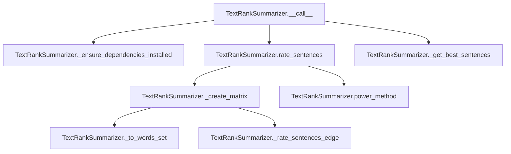

# `text_rank.py`

## `sumy.summarizers.text_rank.TextRankSummarizer` · *class*

## Summary:
TextRankSummarizer is a text summarization algorithm that uses the TextRank graph-based ranking algorithm to identify and extract the most important sentences from a document.

## Description:
This class implements the TextRank algorithm for automatic text summarization. It constructs a similarity matrix between sentences based on shared words, then applies the power method to compute sentence rankings. The summarizer is designed to be used as a drop-in replacement for other summarization algorithms in the sumy library, following the AbstractSummarizer interface.

The TextRank algorithm works by treating sentences as nodes in a graph and computing similarities between them as edges. Sentences that share more words are considered more similar and thus more likely to be important for summarization.

## State:
- epsilon (float): Convergence threshold for the power method, defaulting to 1e-4
- damping (float): Damping factor for the PageRank-like algorithm, defaulting to 0.85
- _ZERO_DIVISION_PREVENTION (float): Small value added to prevent division by zero, defaulting to 1e-7
- _stop_words (frozenset): Set of normalized stop words to exclude from sentence analysis, initially empty

## Lifecycle:
- Creation: Instantiate with optional stemmer parameter (inherited from AbstractSummarizer)
- Usage: Call the instance with a document object and desired number of sentences to extract
- Destruction: No special cleanup required; relies on Python's garbage collection

## Method Map:


## Raises:
- ValueError: When NumPy dependency is not installed, with message indicating installation command

## Example:
```python
from sumy.summarizers.text_rank import TextRankSummarizer
from sumy.parsers.plaintext import PlaintextParser
from sumy.nlp.tokenizers import Tokenizer

# Create summarizer
summarizer = TextRankSummarizer()

# Parse document
parser = PlaintextParser.from_file("document.txt", Tokenizer("english"))
document = parser.document

# Generate summary
summary = summarizer(document, sentences_count=3)
for sentence in summary:
    print(sentence)
```

### `sumy.summarizers.text_rank.TextRankSummarizer.stop_words` · *method*

## Summary:
Sets the stop words for text processing by normalizing and freezing a collection of words.

## Description:
This setter method configures the stop words used by the TextRankSummarizer for filtering out common words during text analysis. It takes a collection of words, normalizes each word using the inherited normalize_word method, and stores them as an immutable frozenset in the internal _stop_words attribute. This approach ensures consistent word normalization and efficient lookup during text processing operations.

The method is invoked during the summarizer's configuration phase when users want to customize the set of words that should be excluded from analysis. This is particularly important for text summarization where common words like "the", "and", "is" can interfere with identifying important content. The stop words are used in the _to_words_set method to filter out unwanted terms during sentence processing.

## Args:
    words (Iterable[str]): An iterable collection of words to be used as stop words. These will be normalized and stored as a frozenset.

## Returns:
    None: This method does not return a value.

## Raises:
    None explicitly raised.

## State Changes:
    - Attributes READ: None
    - Attributes WRITTEN: self._stop_words

## Constraints:
    - Preconditions: The words parameter should be iterable and contain elements that can be processed by normalize_word
    - Postconditions: The _stop_words attribute is updated to contain a frozenset of normalized words

## Side Effects:
    - Normalizes each word in the input collection using the inherited normalize_word method
    - Creates a new frozenset object, replacing any existing stop words
    - No external I/O or mutations to objects outside the summarizer instance

### `sumy.summarizers.text_rank.TextRankSummarizer.__call__` · *method*

## Summary:
Executes the TextRank summarization algorithm on a document by computing sentence ratings and selecting the top-ranked sentences.

## Description:
This method serves as the main entry point for the TextRank summarization process. It orchestrates the complete summarization workflow by ensuring dependencies are available, computing sentence importance scores using the TextRank algorithm, and selecting the most relevant sentences based on the specified count. The method is typically called during the summarization pipeline when a user requests a summary of a document.

The TextRank algorithm works by:
1. Building a similarity matrix between sentences based on shared words
2. Applying the power method to compute stationary probabilities (sentence rankings)
3. Selecting the top sentences based on their computed scores

## Args:
    document (Document): The input document object containing sentences to summarize. Must have a sentences attribute containing iterable sentence objects.
    sentences_count (int or str): The number of top-ranked sentences to select for the summary. Can be an integer specifying exact count or a percentage string (e.g., "30%").

## Returns:
    tuple[Sentence]: A tuple containing the selected sentences in their original order, sorted by importance according to the TextRank algorithm. Returns an empty tuple if the document contains no sentences.

## Raises:
    ValueError: Raised by _ensure_dependencies_installed if NumPy is not available.

## State Changes:
    Attributes READ: None
    Attributes WRITTEN: None

## Constraints:
    Preconditions:
        - The document must have a sentences attribute that is iterable.
        - The document must contain at least one sentence.
        - The sentences_count parameter must be a valid count specification (integer or percentage string).
    Postconditions:
        - Returns a tuple of sentences ordered by their original position in the document.
        - The number of returned sentences matches the requested count or is less if the document has fewer sentences.
        - If document.sentences is empty, returns an empty tuple.

## Side Effects:
    Calls _ensure_dependencies_installed to validate NumPy availability.
    Calls rate_sentences to compute sentence importance scores using TextRank algorithm.
    Calls _get_best_sentences to select and order the top sentences.

### `sumy.summarizers.text_rank.TextRankSummarizer._ensure_dependencies_installed` · *method*

## Summary:
Validates that the NumPy dependency is properly installed and available for the TextRank summarizer.

## Description:
This method performs a runtime check to ensure that the NumPy library is available for numerical computations required by the TextRank summarization algorithm. It is invoked during the summarization process to prevent runtime failures due to missing dependencies. The method serves as a guard clause to validate prerequisites before proceeding with mathematical operations.

## Args:
    None

## Returns:
    None

## Raises:
    ValueError: Raised when NumPy is not importable or evaluates to None, indicating that the LexRank summarizer requirements are not satisfied.

## State Changes:
    Attributes READ: None
    Attributes WRITTEN: None

## Constraints:
    Preconditions: The method assumes that the numpy module is either properly imported or evaluates to None.
    Postconditions: If successful, the method completes normally, confirming NumPy availability for subsequent operations.

## Side Effects:
    None

### `sumy.summarizers.text_rank.TextRankSummarizer.rate_sentences` · *method*

## Summary:
Computes normalized importance scores for each sentence in a document using the TextRank algorithm's power iteration method.

## Description:
Calculates sentence importance weights by constructing a transition matrix from sentence similarities and applying the power iteration method to find the principal eigenvector. This method serves as the core sentence scoring mechanism in the TextRank summarization algorithm, returning a mapping from each sentence to its computed relevance score.

The method is invoked during the summarization pipeline within the `__call__` method, where it processes the document to generate sentence weights that are subsequently used to select the most important sentences for the summary.

This method is separated from the main processing flow to encapsulate the mathematical computation of sentence rankings, enabling clean code organization and independent testing of the ranking algorithm.

## Args:
    document (Document): The input document containing sentences to be scored

## Returns:
    dict[Sentence, float]: A dictionary mapping each sentence in the document to its normalized importance score (between 0 and 1), where higher values indicate more important sentences

## Raises:
    None explicitly raised, but may propagate exceptions from internal methods like `_create_matrix` or `power_method`

## State Changes:
    Attributes READ: self._create_matrix, self.power_method, self.epsilon
    Attributes WRITTEN: None

## Constraints:
    Preconditions:
        - Document must contain at least one sentence
        - Internal matrix creation and power method must succeed
    Postconditions:
        - Returned dictionary contains one entry per sentence in the document
        - All scores are normalized between 0 and 1
        - Scores sum approximately to 1.0 across all sentences

## Side Effects:
    None

### `sumy.summarizers.text_rank.TextRankSummarizer._create_matrix` · *method*

## Summary:
Constructs a stochastic transition matrix for TextRank algorithm from sentence similarity weights.

## Description:
Creates a transition probability matrix used by the TextRank summarization algorithm. This matrix represents the probability of transitioning from one sentence to another based on their semantic similarity. The method computes pairwise sentence similarities using word overlap, normalizes them to form a stochastic matrix, and applies the TextRank damping factor to enable convergence via power iteration.

The implementation follows the standard TextRank formula:
P = (1-d)/n * J + d * W
where:
- P is the final transition matrix
- d is the damping factor (self.damping)
- n is the number of sentences
- J is a matrix of all ones
- W is the normalized similarity matrix

This method is called by the `rate_sentences` method during the summarization pipeline to prepare the input matrix for the power method calculation. The similarity computation uses a logarithmic normalization technique that counts common words and normalizes by log(len(words1)) + log(len(words2)).

## Args:
    document (Document): The input document containing sentences to process

## Returns:
    numpy.ndarray: A square stochastic matrix of shape (n_sentences, n_sentences) where each row sums to 1.0, suitable for power method computation

## Raises:
    None explicitly raised.

## State Changes:
    Attributes READ: self._to_words_set, self._rate_sentences_edge, self.damping, self._ZERO_DIVISION_PREVENTION
    Attributes WRITTEN: None

## Constraints:
    Preconditions: Document must contain at least one sentence
    Postconditions: Returned matrix is a valid stochastic matrix with rows summing to 1.0

## Side Effects:
    None

### `sumy.summarizers.text_rank.TextRankSummarizer._to_words_set` · *method*

## Summary:
Converts a sentence's words into a processed list of stemmed words, excluding stop words.

## Description:
Transforms a sentence's word collection by normalizing each word, applying stemming, and filtering out stop words. This method serves as a crucial preprocessing step in the TextRank summarization algorithm, preparing sentence representations for similarity calculations. The method is called during matrix creation in the `_create_matrix` method to convert sentences into word sets for pairwise similarity computation.

## Args:
    sentence (Sentence): The input sentence object containing a `words` attribute with word tokens.

## Returns:
    list[str]: A list of stemmed words from the sentence, with stop words removed and all words normalized and stemmed.

## Raises:
    None explicitly raised.

## State Changes:
    - Attributes READ: self._stop_words, self.normalize_word, self.stem_word
    - Attributes WRITTEN: None

## Constraints:
    - Preconditions: The sentence object must have a `words` attribute containing iterable word tokens
    - Postconditions: The returned list contains only stemmed words that are not in the stop words set

## Side Effects:
    - Calls self.normalize_word() for each word in the sentence
    - Calls self.stem_word() for each normalized word
    - Reads from self._stop_words frozenset for filtering

### `sumy.summarizers.text_rank.TextRankSummarizer._rate_sentences_edge` · *method*

## Summary:
Computes a normalized similarity score between two word sequences using co-occurrence counting and logarithmic normalization.

## Description:
This method implements a similarity scoring algorithm that counts common words between two sequences and normalizes the result using logarithmic terms. It's designed specifically for TextRank-based summarization to compute edge weights between sentences in the ranking graph.

The method handles special cases where normalization would result in division by zero or near-zero values by using a fallback mechanism that returns the raw rank count when appropriate. This occurs when both sequences have length 1, making the logarithmic normalization approach invalid.

## Args:
    words1 (list[str]): First sequence of words to compare (non-empty)
    words2 (list[str]): Second sequence of words to compare (non-empty)

## Returns:
    float: Normalized similarity score between 0.0 and 1.0, where:
        - 0.0 indicates no common words between sequences
        - Values closer to 1.0 indicate higher similarity
        - When both sequences have length 1, returns the raw rank value (0.0 or 1.0)

## Raises:
    AssertionError: When either input sequence has zero length (violates precondition)

## State Changes:
    None

## Constraints:
    Preconditions:
        - Both input arguments must be non-empty lists of strings
        - Each list represents a valid sequence of words
    Postconditions:
        - Returns a float value in the range [0.0, 1.0]
        - If no common words exist, returns exactly 0.0
        - If sequences are identical, returns 1.0 (when normalized properly)
        - When both sequences have length 1, returns the raw rank value (0.0 or 1.0)

## Side Effects:
    None

### `sumy.summarizers.text_rank.TextRankSummarizer.power_method` · *method*

## Summary:
Computes the principal eigenvector of a transition matrix using the power iteration method for TextRank sentence scoring.

## Description:
Implements the power iteration algorithm to find the dominant eigenvector of a transition matrix, which represents the importance scores of sentences in a document. This method is used internally by TextRankSummarizer to calculate sentence weights for summarization purposes. The algorithm iteratively applies the transition matrix to an initial probability vector until convergence, producing stationary probabilities that reflect sentence importance.

## Args:
    matrix (numpy.ndarray): Square transition matrix representing sentence relationships, where each row sums to 1.
    epsilon (float): Convergence threshold for the iterative process, determines when to stop iterating.

## Returns:
    numpy.ndarray: Principal eigenvector containing normalized sentence importance scores, with length equal to matrix rows.

## Raises:
    None explicitly raised, but may raise numpy-related exceptions if matrix operations fail.

## State Changes:
    None - This method does not modify any object state.

## Constraints:
    Preconditions:
        - Matrix must be square (n x n)
        - Matrix rows must sum to 1 (valid stochastic matrix)
        - Epsilon must be positive
    Postconditions:
        - Returned vector elements sum to 1 (normalized probabilities)
        - Vector length equals number of input matrix rows

## Side Effects:
    None - No external I/O or state mutations occur.

