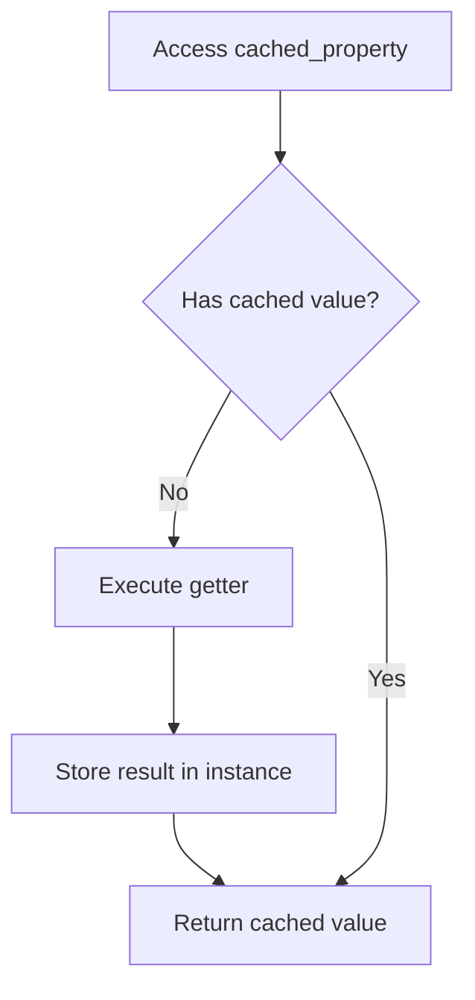
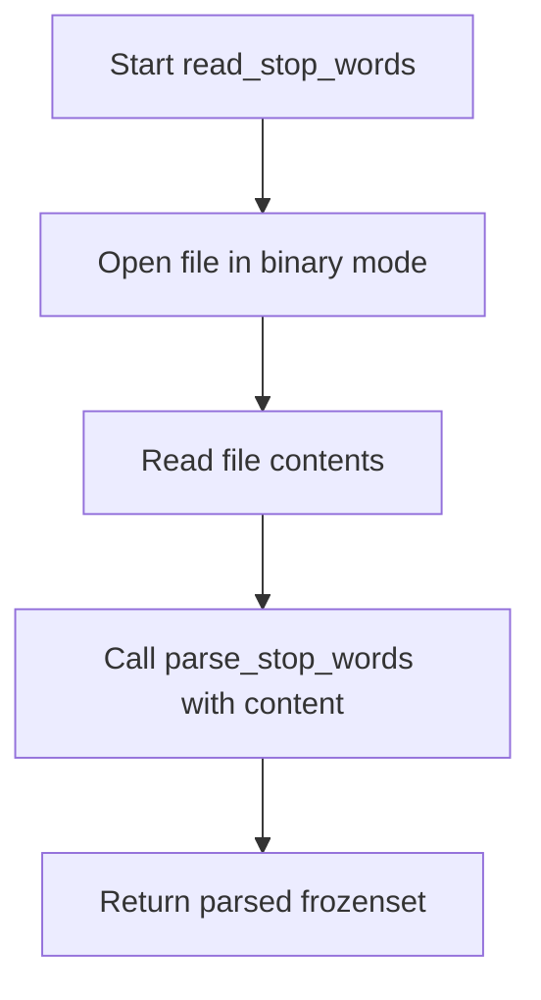

# `utils.py`

## `sumy.utils.normalize_language` · *function*

## Summary:
Normalizes language codes by converting alpha-2 or alpha-3 country codes into their full language names.

## Description:
This function takes a language identifier (which could be an alpha-2 code like "en", an alpha-3 code like "eng", or a full language name) and attempts to normalize it to a standardized lowercase language name. It uses the pycountry library to look up language information using both alpha-2 and alpha-3 code formats. The function is designed to handle various language code formats gracefully and return a consistent normalized form.

## Args:
    language (str): A language identifier that can be an alpha-2 code (like "en"), alpha-3 code (like "eng"), or a full language name (like "English"). Must be a string.

## Returns:
    str: The normalized language name in lowercase. If the input language code is not recognized, it returns the original input unchanged.

## Raises:
    None explicitly raised. The function handles KeyError exceptions internally when language lookup fails.

## Constraints:
    Preconditions:
        - Input must be a string
        - The pycountry library must be available and properly installed
    Postconditions:
        - Output is always a string
        - If input is a valid language code, output will be a lowercase language name
        - If input is not a valid language code, output equals input

## Side Effects:
    None

## Control Flow:
```mermaid
flowchart TD
    A[Start normalize_language] --> B{Input is string?}
    B -- No --> C[Return language]
    B -- Yes --> D[Initialize lookup_keys = [alpha_2, alpha_3]]
    D --> E[For each lookup_key in lookup_keys]
    E --> F{languages.get with lookup_key}
    F -- Success --> G{lang object exists?}
    G -- Yes --> H[language = lang.name.lower()]
    G -- No --> I[Continue]
    F -- KeyError --> J[Continue]
    I --> K{More lookup_keys?}
    K -- Yes --> E
    K -- No --> L[Return language]
```

## Examples:
    >>> normalize_language("en")
    'english'
    >>> normalize_language("eng")
    'english'
    >>> normalize_language("English")
    'english'
    >>> normalize_language("xyz")
    'xyz'
    >>> normalize_language(123)
    123
```

## `sumy.utils.fetch_url` · *function*

## Summary:
Fetches the content of a URL and returns it as bytes.

## Description:
Retrieves the content from the specified URL using an HTTP GET request with predefined headers. This function encapsulates the common pattern of making HTTP requests with proper resource management and error handling. It ensures that all HTTP requests include appropriate headers to avoid being blocked by servers that require user-agent identification.

## Args:
    url (str): The URL to fetch content from.

## Returns:
    bytes: The raw content of the HTTP response.

## Raises:
    requests.exceptions.RequestException: When the HTTP request fails or the server returns an error status code.

## Constraints:
    Preconditions:
        - The URL must be a valid string representing a web address.
        - The server at the URL must be accessible and respond to HTTP GET requests.
    Postconditions:
        - The returned bytes represent the complete content of the HTTP response body.

## Side Effects:
    - Makes an outbound network request to the specified URL.
    - May trigger DNS resolution and TCP connection establishment.

## Control Flow:
```mermaid
flowchart TD
    A[Start fetch_url] --> B{URL valid?}
    B -- Yes --> C[Make HTTP GET request with _HTTP_HEADERS]
    C --> D{Response successful?}
    D -- Yes --> E[Return response.content]
    D -- No --> F[raise_for_status() raises exception]
    F --> G[Exception propagated]
    B -- No --> H[Invalid URL handled by requests]
```

## Examples:
```python
# Basic usage
content = fetch_url("https://example.com/data.json")

# Error handling
try:
    content = fetch_url("https://httpbin.org/status/404")
except requests.exceptions.RequestException as e:
    print(f"Failed to fetch: {e}")
```

## `sumy.utils.cached_property` · *function*

## Summary:
A decorator that transforms a method into a cached property, storing the result as an instance attribute after the first access.

## Description:
The `cached_property` decorator provides a mechanism to memoize the result of a method call, ensuring that the method is only executed once per instance. Subsequent accesses return the cached value. This is particularly useful for expensive computations or properties that should not be recalculated on each access.

This logic is extracted into its own function to provide a reusable caching mechanism that can be applied to any method that should behave like a cached property, enforcing a clear boundary between the caching behavior and the actual computation logic.

## Args:
    getter (callable): A function that takes a single argument (the instance) and computes the property value.

## Returns:
    property: A property object that implements the cached behavior when accessed.

## Raises:
    None explicitly raised by this decorator.

## Constraints:
    - Preconditions: The `getter` function must be callable and accept a single argument representing the instance.
    - Postconditions: The first access to the decorated property will execute the getter and store the result; subsequent accesses will return the cached value.

## Side Effects:
    - Modifies the instance's attributes by setting a cached value under a private key.
    - No external I/O or state mutations beyond the instance's attribute storage.

## Control Flow:


## Examples:
```python
class MyClass:
    @cached_property
    def expensive_computation(self):
        # Simulate expensive operation
        return sum(range(1000))

# Usage
obj = MyClass()
result1 = obj.expensive_computation  # Executes getter
result2 = obj.expensive_computation  # Returns cached value
assert result1 is result2  # Both refer to the same cached value
```

## `sumy.utils.expand_resource_path` · *function*

## Summary:
Resolves a resource path by joining it with the package's data directory location.

## Description:
This function constructs an absolute path to a resource file within the sumy package's data directory. It determines the location of the sumy package installation and builds a path by appending "data" and the provided path to that location. The function ensures proper string conversion for cross-Python-version compatibility and maintains consistent path resolution across different environments.

## Args:
    path (str): Relative path to a resource file within the package's data directory.

## Returns:
    str: Absolute path to the resource file.

## Raises:
    None explicitly raised.

## Constraints:
    Preconditions:
        - The sumy module must be installed and importable.
        - The path argument must be a valid string.
    Postconditions:
        - Returns an absolute path string.
        - The returned path points to a location within the sumy package's data directory.

## Side Effects:
    None.

## Control Flow:
```mermaid
flowchart TD
    A[expand_resource_path called] --> B{path parameter}
    B --> C[Get sumy module directory]
    C --> D[Convert to absolute path]
    D --> E[Join with "data" and path]
    E --> F[Return absolute path]
```

## Examples:
    >>> expand_resource_path("stopwords/english.txt")
    "/usr/local/lib/python3.8/site-packages/sumy/data/stopwords/english.txt"

## `sumy.utils.get_stop_words` · *function*

## Summary:
Retrieves and parses stop words for a specified language from packaged data files.

## Description:
Fetches stop word data for the given language from the package's data directory and converts it into a frozen set of normalized stop words. This function serves as a centralized interface for accessing stop word lists in various languages, abstracting away the underlying data retrieval and parsing logic.

## Args:
    language (str): Language identifier that can be an alpha-2 code (like "en"), alpha-3 code (like "eng"), or a full language name (like "English").

## Returns:
    frozenset[str]: A frozen set of stop words for the specified language, with trailing whitespace removed and empty lines filtered out.

## Raises:
    LookupError: When stop-word data is not available for the specified language.

## Constraints:
    Preconditions:
        - Input language must be a string
        - Language must have corresponding stop word data in the package's data directory
    Postconditions:
        - Returns a frozenset of Unicode strings representing stop words
        - All returned stop words are stripped of trailing whitespace and empty lines are filtered out

## Side Effects:
    - Accesses package data using pkgutil.get_data
    - Invokes normalize_language function to standardize language identifiers
    - Invokes parse_stop_words function to process raw stop word data

## Control Flow:
```mermaid
flowchart TD
    A[Start get_stop_words] --> B[normalize_language(language)]
    B --> C[pkgutil.get_data with language]
    C --> D{IOError raised?}
    D -->|Yes| E[Raise LookupError]
    D -->|No| F[parse_stop_words(stopwords_data)]
    F --> G[Return frozenset of stop words]
```

## `sumy.utils.read_stop_words` · *function*

## Summary:
Reads and parses stop words from a file into a frozen set of stripped strings.

## Description:
Opens a file in binary mode and reads its contents to extract stop words. The function delegates the parsing logic to `parse_stop_words()` which processes the raw data into a frozenset of clean, deduplicated stop words. This function serves as a file I/O wrapper around the parsing logic, enabling stop word loading from persistent storage.

## Args:
    filename (str): Path to the file containing stop words, one per line. The file must be readable and contain valid UTF-8 encoded text.

## Returns:
    frozenset[str]: A frozen set of stop words with trailing whitespace removed and empty lines filtered out. All elements are Unicode strings.

## Raises:
    FileNotFoundError: When the specified filename does not exist or cannot be accessed.
    UnicodeDecodeError: When the file contains bytes that cannot be decoded using UTF-8 encoding.

## Constraints:
    - Preconditions: The filename must be a valid path to an existing file that can be opened in binary mode.
    - Postconditions: The returned frozenset contains only non-empty strings with trailing whitespace removed.

## Side Effects:
    - Reads from the filesystem using standard file I/O operations.
    - May raise file system related exceptions if the file cannot be accessed.

## Control Flow:


## Examples:
    # Basic usage
    stop_words = read_stop_words("/path/to/stopwords.txt")
    # Returns frozenset of stop words from the file
    
    # Error handling
    try:
        stop_words = read_stop_words("nonexistent.txt")
    except FileNotFoundError:
        print("Stop words file not found")
```

## `sumy.utils.parse_stop_words` · *function*

## Summary:
Parses stop words from input data into a frozen set of stripped strings.

## Description:
Converts input data containing stop words into a frozenset of stripped strings, removing empty lines and trailing whitespace. This function is designed to process stop word lists that may come from various sources such as files, strings, or other data formats, ensuring consistent formatting and deduplication of stop words.

## Args:
    data (Any): Input data containing stop words, typically a string or bytes object that can be converted to Unicode. The data is expected to contain one stop word per line.

## Returns:
    frozenset[str]: A frozen set of stop words with trailing whitespace removed and empty lines filtered out. All elements are Unicode strings.

## Raises:
    UnicodeDecodeError: When the input data contains bytes that cannot be decoded using UTF-8 encoding.

## Constraints:
    - Preconditions: The input data must be convertible to a Unicode string using the to_unicode utility function
    - Postconditions: The returned frozenset contains only non-empty strings with trailing whitespace removed

## Side Effects:
    - Invokes the to_unicode utility function to convert input data to Unicode
    - Processes input data line-by-line without external I/O operations

## Control Flow:
```mermaid
flowchart TD
    A[Start parse_stop_words] --> B[to_unicode(data)]
    B --> C[splitlines()]
    C --> D{line not empty?}
    D -->|Yes| E[rstrip() line]
    D -->|No| F[Skip line]
    E --> G[Build frozenset]
    F --> G
    G --> H[Return frozenset]
```

## Examples:
    # Basic usage with string input
    stop_words = parse_stop_words("the\\nand\\nor\\n")
    # Returns frozenset({'the', 'and', 'or'})
    
    # Usage with bytes input
    stop_words = parse_stop_words(b"the\\nand\\nor\\n")
    # Returns frozenset({'the', 'and', 'or'})
    
    # Handling empty lines and whitespace
    stop_words = parse_stop_words("the\\n  \\nand\\n  test  \\n")
    # Returns frozenset({'the', 'and', 'test'})
```

## `sumy.utils.ItemsCount` · *class*

## Summary:
A callable class that selects a subset of items from a sequence based on a specified count or percentage.

## Description:
The ItemsCount class provides a flexible way to extract a portion of items from a sequence. It supports specifying the count either as an integer/float (absolute number) or as a string ending with "%" (percentage). This class is commonly used in text summarization where a specific number or percentage of sentences needs to be selected from a document.

## State:
- `_value`: The count specification, which can be a string (e.g., "50%"), integer, or float representing the number of items to select
- Valid ranges: 
  - For integers/floats: any positive numeric value
  - For strings: percentage strings like "50%" where the numeric part is interpreted as a percentage
- Invariants: The class maintains the original value specification internally and applies it consistently during calls

## Lifecycle:
- Creation: Instantiate with a value parameter (string, int, or float)
- Usage: Call the instance with a sequence (list, tuple, etc.) to get a subset
- Destruction: No special cleanup required; uses standard Python garbage collection

## Method Map:
```mermaid
graph TD
    A[ItemsCount.__init__] --> B[ItemsCount.__call__]
    B --> C{Value Type Check}
    C -->|String Ending with %| D[Calculate Percentage]
    C -->|Integer/Float| E[Direct Slice]
    C -->|Other| F[ValueError]
    D --> G[Return Sequence[:count]]
    E --> G
    F --> H[Raises ValueError]
```

## Raises:
- ValueError: When the value parameter is neither a string, int, nor float, with message "Unsuported value of items count '%s'."

## Example:
```python
# Create an instance that takes first 5 items
selector = ItemsCount(5)
result = selector([1, 2, 3, 4, 5, 6, 7])  # Returns [1, 2, 3, 4, 5]

# Create an instance that takes first 50% of items
selector = ItemsCount("50%")
result = selector([1, 2, 3, 4, 5, 6, 7, 8])  # Returns [1, 2, 3, 4]

# Create an instance that takes first 2.5 items (rounded down)
selector = ItemsCount(2.5)
result = selector([1, 2, 3, 4, 5])  # Returns [1, 2]
```

### `sumy.utils.ItemsCount.__init__` · *method*

## Summary:
Initializes an ItemsCount object with a specified value, setting its internal `_value` attribute.

## Description:
This constructor method initializes an ItemsCount instance by storing the provided value in the private `_value` attribute. ItemsCount is typically used to track counts or quantities of items in various summarization processes within the sumy library. This method establishes the initial state of the object and is called during object instantiation.

## Args:
    value (any): The value to be stored internally. Can be of any type, commonly an integer representing a count.

## Returns:
    None: This method does not return a value.

## Raises:
    None: This method does not raise any exceptions.

## State Changes:
    Attributes READ: None
    Attributes WRITTEN: self._value

## Constraints:
    Preconditions: The object must be properly instantiated before calling this method.
    Postconditions: The instance will have its `_value` attribute set to the provided value.

## Side Effects:
    None: This method performs no I/O operations or external service calls.

### `sumy.utils.ItemsCount.__call__` · *method*

## Summary:
Returns a slice of the input sequence up to a specified count, supporting absolute numbers, percentage-based counts, or relative values.

## Description:
This method implements the callable interface of the ItemsCount class, enabling instances to be invoked like functions. It processes the input sequence according to the internal `_value` attribute to determine how many items to return from the beginning of the sequence. The method supports three value formats:
1. String values ending with "%" (e.g., "50%") - calculates percentage of sequence length
2. Numeric values (int or float) - uses as absolute count
3. Raises ValueError for unsupported types

This design allows flexible specification of item counts in summarization and text processing workflows where counts might be specified as percentages or absolute numbers.

## Args:
    sequence (list, tuple, or other sequence type): The input sequence to slice.

## Returns:
    sequence (same type as input): A slice of the input sequence containing up to the specified number of items. For percentage-based values, ensures at least one item is returned even when calculated percentage rounds to zero.

## Raises:
    ValueError: When the internal `_value` attribute is not a supported type (string ending with "%", int, or float).

## State Changes:
    Attributes READ: self._value
    Attributes WRITTEN: None

## Constraints:
    Preconditions: The input sequence must support slicing operations and have a length method.
    Postconditions: The returned sequence contains at most the number of items specified by `_value`, with a minimum of 1 item for percentage calculations.

## Side Effects:
    None

### `sumy.utils.ItemsCount.__repr__` · *method*

## Summary:
Returns a string representation of the ItemsCount object showing its internal value.

## Description:
The `__repr__` method provides a canonical string representation of an ItemsCount instance, displaying the internal `_value` attribute in a formatted string. This method is automatically invoked when the object needs to be displayed in debugging contexts, such as during print operations or when examining variables in interactive sessions.

## Args:
    None

## Returns:
    str: A string in the format "<ItemsCount: value>" where value is the repr() of the internal `_value` attribute.

## Raises:
    None

## State Changes:
    - Attributes READ: self._value
    - Attributes WRITTEN: None

## Constraints:
    - Preconditions: The object must be initialized with a valid `_value` attribute
    - Postconditions: The returned string follows the format "<ItemsCount: value>" where value is properly quoted

## Side Effects:
    - Calls to_string() function which may perform version-specific string conversion
    - No external service calls or I/O operations

