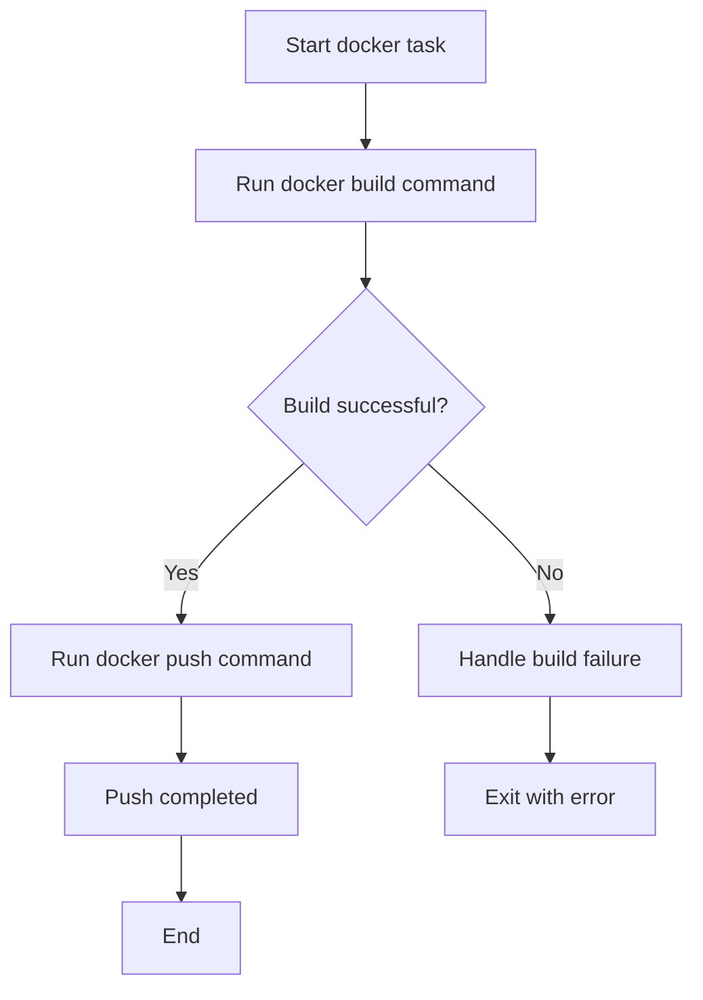

# `tasks.py`

## `clean` · *function*

## Summary:
Removes build artifacts and cache directories from the project workspace.

## Description:
This function executes a shell command to delete temporary files and directories commonly generated during development and testing processes. It is designed to clean up the working directory by removing build outputs, test coverage reports, and various caching directories.

The function is extracted into its own task to provide a standardized cleanup mechanism that can be easily invoked as part of development workflows or CI/CD pipelines. This promotes consistency in cleaning operations and reduces duplication of shell commands throughout the codebase.

## Args:
    context: The Invoke context object that provides access to execution environment and utilities.

## Returns:
    None

## Raises:
    Any exceptions raised by the underlying `context.run()` call when executing the shell command.

## Constraints:
    Preconditions:
    - The function assumes that the current working directory contains the directories to be removed.
    - The user executing this function must have appropriate filesystem permissions to delete the specified directories.

    Postconditions:
    - All specified directories and their contents are removed from the filesystem.
    - The function does not return any meaningful value.

## Side Effects:
    - Filesystem modifications: Directories and files matching the specified patterns are deleted.
    - No external services or global state changes occur.

## Control Flow:
```mermaid
flowchart TD
    A[Start clean()] --> B[Execute shell command]
    B --> C{Command succeeds?}
    C -->|Yes| D[Return None]
    C -->|No| E[Raise exception from context.run()]
```

## Examples:
```python
# Typical usage in an Invoke-based workflow
# $ invoke clean
# Removes dist/, build/, .coverage, .pytest_cache, and .mypy_cache directories
```

## `test` · *function*

## Summary:
Executes pytest to run tests in the project.

## Description:
This function serves as an Invoke task that delegates test execution to the pytest framework. It is designed to be called as part of a command-line workflow using the Invoke automation tool.

## Args:
    context: The Invoke context object containing runtime information and execution environment.

## Returns:
    The return value of the underlying context.run() call, typically None.

## Raises:
    Any exceptions raised by the pytest framework or underlying context.run() call.

## Constraints:
    Preconditions:
    - The pytest package must be installed in the environment.
    - The context object must be properly initialized by the Invoke framework.
    - The working directory should contain test files recognizable by pytest.

    Postconditions:
    - Test execution is initiated via the pytest command.
    - The function does not return control until pytest completes.

## Side Effects:
    - Executes shell command "pytest" in the current environment.
    - May produce output to stdout/stderr from pytest execution.
    - No persistent state changes outside of test execution.

## Control Flow:
```mermaid
flowchart TD
    A[Start test function] --> B{context.run("pytest")}
    B --> C[Execute pytest command]
    C --> D[Wait for completion]
    D --> E[Return control]
```

## Examples:
    To execute this task, run: `invoke test`
    This will internally execute `pytest` in the current working directory.

## `install` · *function*

## Summary:
Installs the project in development mode using setuptools.

## Description:
This function executes the command `python setup.py develop` to install the current package in development mode. It is designed to be used as an Invoke task within a project's task runner configuration.

## Args:
    context: The Invoke context object containing runtime environment and execution utilities.

## Returns:
    The return value of the underlying `context.run()` call, which typically indicates the success or failure of the command execution.

## Raises:
    Any exceptions raised by `context.run()` when executing the shell command, such as CommandNotFound or UnexpectedExit.

## Constraints:
    Preconditions:
    - The project must have a valid `setup.py` file in the root directory.
    - The Python interpreter must be available in the environment.
    - The `invoke` library must be properly configured to execute tasks.

    Postconditions:
    - The package is installed in development mode, allowing for easy modification and testing without reinstalling after each change.

## Side Effects:
    - Executes a shell command (`python setup.py develop`) which may modify the local Python environment.
    - May write to the filesystem during the installation process.

## Control Flow:
```mermaid
flowchart TD
    A[Start install()] --> B[Execute "python setup.py develop"]
    B --> C{Command succeeds?}
    C -->|Yes| D[Return success result]
    C -->|No| E[Propagate exception]
```

## Examples:
```python
# Typical usage in an Invokefile
from invoke import task

@task
def install(context):
    context.run("python setup.py develop")
```

## `release` · *function*

## Summary:
Executes the full release process by building distribution files and uploading them to PyPI.

## Description:
This function serves as a convenience wrapper for the complete Python package release workflow. It automates the process of creating distribution packages and publishing them to the Python Package Index (PyPI) using twine. The function is designed to be invoked through the Invoke task runner framework.

## Args:
    context: The invoke context object containing runtime environment and execution utilities. This parameter is required and must be provided by the Invoke task runner.

## Returns:
    None: This function does not return any value.

## Raises:
    Any exceptions raised by the underlying `context.run()` calls when executing shell commands. These could include command execution failures, permission errors, or network issues during the upload process.

## Constraints:
    Preconditions:
    - The project must have a properly configured `setup.py` file
    - The `twine` package must be installed in the environment
    - The `dist/` directory must be writable
    - Network connectivity is required for uploading to PyPI
    
    Postconditions:
    - Distribution files are created in the `dist/` directory
    - Packages are uploaded to PyPI (assuming successful authentication)

## Side Effects:
    - Creates distribution files in the local `dist/` directory
    - Makes network requests to PyPI for package upload
    - May prompt for PyPI credentials during the upload process
    - Modifies the local filesystem by creating build artifacts

## Control Flow:
```mermaid
flowchart TD
    A[Start release()] --> B[Execute setup.py build]
    B --> C{Command success?}
    C -->|Yes| D[Execute twine upload]
    C -->|No| E[Exit with error]
    D --> F[Upload to PyPI]
    F --> G[End]
```

## Examples:
    Typical usage within an Invokefile:
    ```python
    from invoke import task
    
    @task
    def release(context):
        context.run("python setup.py register sdist bdist_wheel")
        context.run("twine upload dist/*")
    ```

## `bump` · *function*

## Summary:
Increments the version number of a project and amends the latest commit with the change.

## Description:
This function automates the process of version bumping by executing the bumpversion tool followed by amending the most recent Git commit. It is designed to streamline release management workflows by combining version increment and commit update into a single operation.

## Args:
    context: The Invoke context object containing execution environment and utilities.
    version (str): The version part to bump (e.g., 'major', 'minor', 'patch'). Defaults to 'patch'.

## Returns:
    None: This function does not return any value.

## Raises:
    Any exceptions raised by the underlying `context.run()` calls or `bumpversion` command.

## Constraints:
    Preconditions:
    - The project must be a Git repository.
    - The bumpversion tool must be installed and available in the environment.
    - The context object must have a `run` method for executing shell commands.

    Postconditions:
    - The version file is updated according to the specified version part.
    - The most recent Git commit is amended to include the version change.

## Side Effects:
    - Executes shell commands: 'bumpversion [version]' and 'git commit --amend'.
    - Modifies the Git history by amending the latest commit.
    - May modify version-related files in the project directory.

## Control Flow:
```mermaid
flowchart TD
    A[Start bump()] --> B[Execute bumpversion %s]
    B --> C[Execute git commit --amend]
    C --> D[End bump()]
```

## Examples:
    # Bump patch version
    bump(context, "patch")
    
    # Bump minor version
    bump(context, "minor")
    
    # Bump major version
    bump(context, "major")
```

## `docker` · *function*

## Summary:
Builds and pushes Docker images for the sumy project to a remote registry.

## Description:
This function executes two sequential Docker commands: first building a Docker image with specific tags, and then pushing those images to a remote registry. It is designed to automate the containerization and deployment process for the sumy application.

## Args:
    context: The Invoke context object containing runtime environment and execution utilities.

## Returns:
    None

## Raises:
    Any exceptions raised by the underlying `context.run()` calls when executing shell commands.

## Constraints:
    Preconditions:
    - Docker must be installed and running on the host system.
    - The user must have appropriate permissions to execute Docker commands.
    - The current working directory must contain a valid Dockerfile.
    
    Postconditions:
    - Two Docker images (latest and 0.11.0) will be built locally.
    - Both images will be pushed to the misobelica/sumy repository on the remote registry.

## Side Effects:
    - Executes shell commands via `context.run()`, which may produce output to stdout/stderr.
    - Modifies local Docker daemon state by building new images.
    - Communicates with a remote Docker registry to push images.

## Control Flow:


## Examples:
    Typical usage within an Invoke-based workflow:
    
    ```python
    # In tasks.py
    from invoke import task
    
    @task
    def docker(context):
        context.run("docker build --no-cache --rm=true --tag misobelica/sumy:latest -t misobelica/sumy:0.11.0 .")
        context.run("docker push misobelica/sumy --all-tags")
    ```
    
    Execution:
    ```bash
    invoke docker
    ```

